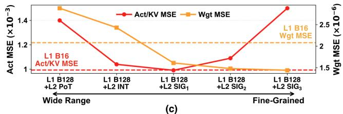

# HBQ: Hierarchical Scaling Block Quantization with Hardware-Efficiency-Aware Design for Accurate LLM Inference 通俗讲解

### 0. 整体创新点通俗解读

**痛点直击：为什么之前的 Block Quantization 总是“顾头不顾尾”**

先说这篇论文真正瞄准的大问题。现在 LLM 推理的量化方案分两大门派，各自都有“难受的地方”：

- **WoQ（Weight-only Quantization，如 AWQ）**：只压 Weight，准确率好，但 Activation 和 KV Cache 还是 FP16。这意味着硬件上必须**同时维护两套 datapath**——一套低位宽算投影层，一套全精度算 Attention。芯片面积白白浪费，而且高吞吐场景（数据中心 batch decoding）下，**算力效率（TOPS/mm²、TOPS/W）才是命门**，WoQ 在这里先天残废。
- **BQ（Block Quantization，如 NVFP4、MXFP4）**：Weight、Activation、KV 全压低位，理论上能跑在统一的低位宽流水线上，硬件很爽。**但它的准确率一直被“块大小”这个参数卡死**。

这里有个核心矛盾，是作者通过 Design Space Exploration（DSE）挖出来的：

- **块大（比如 B=128）**：硬件效率极高。因为 scale factor 的存储和反量化（dequantization）开销被摊薄到更多元素上，每 MAC 的面积、能耗、有效位宽（EBW）都直线下降。
- **块小（比如 B=16）**：准确率保得住，但硬件上“每 16 个数就要伺候一次 scale”，摊不开销，效率很差。

所以 NVFP4、MX 这类方法都**被迫**用小 block，本质上是**用硬件效率去换准确率**——它们以为自己已经是最优了，其实只是站在一个错误的权衡曲线上。

---

**通俗比方：大仓库里的“分区定价”**

想象你在管理一个大型仓库（一个 block 里的一堆数值）：

- **单层 BQ** 就像整个仓库共用**一把统一的标尺**。仓库越小（block 越小），标尺越贴合货物尺寸，量得准；但每开一个小仓库都要配一把昂贵的高精度标尺（FP8 scale + 反量化硬件），仓库开得越多，标尺开销越爆炸。
- 之前的**层级量化方法（VSQ、MicroExponent）**也想过“仓库里再分格子”，但它们的做法是：依然开很多小仓库（B=16），然后格子切得极碎（µB=2），标尺开销没省下来多少，反而增加了额外的有效位宽——**等于雇了更多管理员来管更小的仓库，账算下来还亏**。

HBQ 的思路是反过来的：**我就是要开超大仓库（B=128），一把标尺管 128 件货，摊薄到几乎免费**。货量不准的问题，不在仓库层面解决，而是在仓库内部加一层**极廉价的小标签**来解决。

---

**关键一招：Significand Scaling（SIG）——不换标尺，只贴标签**

作者的巧妙之处不在于“分层”这个概念本身（VSQ 早就有），而在于**第二级 scaling 的设计**让整个方案在硬件上几乎免费：

- **第一层（L1）**：照旧用 FP8 scale 管一个 128 元素的大 block，把最贵的反量化开销摊到最薄。
- **第二层（L2）**：在 block 内部，每个 micro-block（8 或 32 个元素）再乘一个 **2-bit 的小修正系数 α**，定义极其简单：α = 1 + c/2^x，其中 c 就是 2-bit 编码。也就是说，α 只能取 1、1.25、1.5、1.75 这种**围绕 1 的小数**。

妙就妙在这个 α 的取值范围（1~4 的窄区间）：

- 它不是 PoT（2 的幂）那种“跳变式”缩放——PoT 和 INT 的量化层级会**大量重叠**，浪费了表示能力，还覆盖了不必要的宽动态范围。
- 它是**在已有量化网格的缝隙里再插几个点**，把 FP4 的有效表示层数翻了 4 倍，而硬件上只需在 fixed-point 域做一次极小的修正——L1 反量化之前全程保持定点运算，这是效率的来源。

更聪明的是**对 Weight 和 Activation 区别对待**：

- Activation 的误差集中在**小幅度元素**（outlier 把动态范围撑大了），用粗粒度的 **SIG₁** 就能覆盖；
- Weight 的误差集中在**高幅度区域**（分布更尖锐），用细粒度的 **SIG₃** 压得更准；而且 Weight 是离线量化的，干脆每个 block 试 SIG₂ 和 SIG₃ 两个方案，**谁 MSE 小选谁**，只需存 1-bit 选择位，零校准成本。

---

**整体贡献：把三条独立的优化拧成一根绳**

单看每一条都不复杂，但作者的功力在于用 DSE 证明了它们**组合在一起会互相成全**：

- **大 block（B=128）** 提供硬件效率基础 —— 这是之前所有人不敢碰的禁区；
- **SIG 二级缩放** 用 <10% 的面积代价把大 block 损失的准确率**全额赚回来** —— 这是解锁大 block 的钥匙；
- **A5 激活精度**（而非 A4 或 A8）—— DSE 发现 A4→A5 收益巨大，A5→A8 边际收益骤减，这一个 bit 花得最值。

最终成果很硬核：**HBQ-A 用 W4A5 就打平了 WoQ（AWQ, W4A16）的准确率**，同时 PE 级面积/能效比 AxCore 高 **2.3×/4.6×**；对比 NVFP4 等 BQ 方法，系统级能耗降 **1.6–3.3×**，速度提升 **1.5–3×**。

另外还有一个容易被忽略的小贡献：**Partial Sum 也做量化（MXINT8）**。psum buffer 本来要存 FP16，占满了片上 SRAM，直接限制了 tiling 尺寸、放大了 DRAM 访问。把 psum 压成 MXINT8，等于**免费把 buffer 容量翻倍**，EMA 能耗再降 16%，而精度损失趋近于零（因为每 M/128 步才量化一次，误差没有传播机会）。

一句话总结：**之前的 BQ 在“块大小”这个维度上不敢越雷池一步，HBQ 用一个 2-bit 的 significand 标签打开了这扇门——大块摊薄硬件，小块贴标签补精度，最后连 psum 一起压，实现 W/A/KV/Psum 全低位的端到端推理。**

### 1. 硬件感知的BQ设计空间探索（DSE）与Pareto前沿分析

**痛点直击**

先说清楚之前的BQ研究到底“难受”在哪：

- **大家都在盲人摸象**。MXFP4把block size定死在32，NVFP4定死在16，这些数字不是算出来的，更像是“拍脑袋+沿用惯例”。每个人只调自己关心的那一个旋钮（比如bit-width或者scaling格式），**没人把所有旋钮拧在一起看过全局**。
- **算法人和硬件人各干各的**。算法论文只报PPL（准确率），硬件论文只报TOPS/W，两边从不见面。结果就是你可能选了一个PPL最好的配置，但它的PE面积是别人的三倍——**你根本不知道自己是不是站在Pareto前沿上，还是站在了前沿的“外面”**。
- **最致命的错觉**：业界普遍觉得“BQ天生精度差，所以NVFP4的PPL掉到6.88是没办法的事”。但这篇论文捅破了一层窗户纸——**掉点不是因为BQ这个范式不行，而是设计空间根本没搜过**。论文里随手一个调优过的朴素配置，就能同时打赢MXFP4的精度和面积。

用一句话概括：之前的BQ不是输给了物理极限，是输给了**没人认真做过联合搜索**。

---

**通俗比方**

这就像买车。

- 之前的做法：每家车厂只优化一个指标。A厂狂吹油耗（精度），B厂狂吹马力（TOPS），但**没人把“油耗-马力-价格”画在同一张散点图上**。消费者其实想要的是那条**Pareto前沿**——花同样的钱，能买到的最好组合。
- 更具体一点，论文里那个**block size**的发现就特别有“顿悟感”：

- 把block size从16拉到128，相当于**从“每件行李单独打包”改成“整卡车一起托运”**——打包用的胶带和箱子（scaling factor存储、dequant的FP乘法器、FP累加器）这些**固定开销被摊薄到128个元素头上**，硬件成本直接砍掉三分之一。
- 但代价是：一车行李里混进一个钢琴（outlier），整个车的定价都得按钢琴来，其他小件东西全被“挤扁”了——这就是**intra-block动态范围爆炸导致的精度崩塌**。
- 所以之前的MXFP4/NVFP4都停在block=16/32，本质上是**为了保精度，放弃了摊薄开销的机会**。DSE揭示了这是一条真实的trade-off曲线，而现有方法全都停在这条曲线的“上方”——明明有更优解，只是没人往下找。

---

**关键一招**

作者没有发明任何新的量化算法，而是做了一次**诚实的、带硬件计价器的联合搜索**，然后从Pareto图上直接“读”出了三个被业界集体错过的结论：

- **把“准确率”和“每MAC面积/能耗（28nm真实综合出来的）”放进同一个坐标系**，而不是像以往那样各评各的。这一步的巧思在于：面积和功耗不是估算，是**真的用PrimeTime跑了Llama3-8B真实数据的switching activity**，所以那条Pareto前沿是“物理可信”的。
- 搜索的四个轴和结论：

| 设计维度 | 之前的主流选择 | DSE发现的最优解 | 原因 |
|---|---|---|---|
| Scaling格式 | PoT（MX系，省硬件） | **FP8-scale (ue5m3)** | block一大，FP乘法的开销被摊薄，精度却白赚 |
| Element指数位 | E4/E5（传统FP8遗产） | **2-bit指数（E2M5）** | block内动态范围本来就窄，大指数预算纯属浪费 |
| 激活精度 | 死磕A4或保守A8 | **A5是甜点** | A4→A5精度大涨，A5→A8收益递减（见Table III） |
| Block size | 固定16/32 | **≥32，越大越省** | 摊薄dequant+累加开销的唯一杠杆 |

- **最关键的逻辑转换**：DSE把“block size”从一个**被人写死的控制变量**，重新定性为**主宰精度-效率trade-off的第一设计变量**。这个认知翻转直接催生了后面的HBQ——既然大block是效率的唯一出路，那就别绕开它，用第二级SIG scaling把精度补回来。**DSE不是这篇论文的附属品，它是HBQ整个故事能成立的地基**。

最后看这张图收尾，一切尽在不言中——

MXFP4和NVFP4都悬浮在DSE画出的前沿之外，而HBQ（靠SIG补精度）把前沿又往下、往左推了一截。这就是DSE的价值：**它先告诉你“天花板在哪”，再告诉你“天花板还能被捅破”**。

### 2. 层次化块量化与尾数缩放（HBQ with Significand Scaling）

**痛点直击**

块量化（Block Quantization, BQ）这事儿有个先天的尴尬：**块越大，硬件越省；块越大，模型越傻**。

- 先说为什么硬件想用大块：BQ 的每个块要存一个 scaling factor，量化后还要做一次**反量化（dequantization）**——一次浮点乘法或者移位。这些开销是“按块收费”的。
  - 块大小 B=16，意味着每 16 个数就要摊一次这些开销；
  - 块大小 B=128，同样的开销被摊到 8 倍多的数据上，**每 MAC 的面积和能耗直线下降**。
- 但问题是：一个块内所有元素**共享同一个 scaling factor**。块一大，块内的“贫富差距”（dynamic range）就爆炸了。
  - 权重还好，误差主要集中在大数值区域，分布相对稳；
  - **激活值（activation）和 KV cache 倒了大霉**——它们本来就有 outlier，128 个数挤一个 scale，小数值全被压死，误差几乎翻了三倍。
- 所以之前的 NVFP4、MX 都被逼着用**小块（B=16 或 32）保精度**，等于主动放弃了硬件效率。这就是典型的**顾头不顾尾**：精度保住了，面积和能耗上不去。

**通俗比方**

这就像**搬家时打包行李**：

- 块量化 = 一个箱子一个“打包标准”（scaling factor）。
- 小块策略 = 每个箱子只装 16 件东西，按最贵重的那件定标准——包裹精细但**胶带和标签（scale 存储与反量化）的成本摊不薄**，箱子越多越亏。
- 大块策略 = 128 件东西塞一个箱子，省了胶带钱——但你把钢琴和袜子塞一起，按钢琴的尺寸定标准，袜子全被压扁了（**小数值被大 outlier 主导的 scale 淹没**））。
- HBQ 的解法 = **大箱子里面再分小格子**：
  - 外层的大箱子（L1, B=128）继续享受规模摊销的好处；
  - 里头每个小格子（micro-block, µB=8 或 32）有自己的“微调标准”（L2 scale），袜子按袜子的标准放，钢琴按钢琴的标准放。
- 关键在于：这个小格子的“微调标准”**极其廉价**——只有 2 bit，而且不引入新的昂贵的浮点运算。

**关键一招**

作者的核心动作是：**没有为了救精度去缩小 L1 块（回到老路），而是在大块内部插了一个廉价的第二级缩放**，并且这个缩放的设计方式非常巧妙。

具体拆开看：

- **第二级 scale 怎么设计？** 这是最妙的地方。传统的二级缩放有两种死法：
  - **PoT（2 的幂）**：scale 只能取 1, 2, 4, 8...——跳得太粗，而且不同 scale 对应的量化区间大量**重叠**，等于白花 bit；
  - **INT**：scale 均匀分布在很宽的范围内——但 L1 已经把块内范围压窄了，宽范围纯属浪费。
- **Significand Scaling (SIG) 的扭转**：把 L2 scale 定义为

  `α(c) = 1 + c / 2^x`（c 是 2-bit 编码，x 是可调的粒度参数）

  - 也就是说，scale 只在 **1 到 2 之间（或附近）做细粒度的“微调”**，像给浮点数的**尾数**打补丁，而不是重新设一个指数；
  - 因为 α ≤ 4 且只有 2 bit，**反量化后的数值范围依然可控，整个 MAC 流水线在 L1 反量化之前可以全程用定点数**——这是硬件省钱的根本原因。
- **权重和激活各用各的粒度**（这是对误差分布分析的直接回应）：
  - 权重误差集中在大数值 → 用 **SIG₃**（最细粒度），而且因为是离线量化，每个块在 SIG₂/SIG₃ 里**挑 MSE 更小的那个**，存 1-bit 选择器即可，无需 calibration；
  - 激活/KV 误差来自小数值和 outlier → 用 **SIG₁**，粗一点但够用。

效果直接看误差恢复图：

- 注意 (c) 图的结论：**L1=128 + L2 SIG 之后，误差被拉回到 B=16 的水平，甚至更低**。换句话说，你拿到了大块的硬件效率，却只付了小块的精度代价——**这一招把“效率-精度”的 trade-off 曲线本身给撬动了**，而不只是在线上挪了个点。
- 成本账：L2 这一层在 HBQ-E（µB=32）配置下只带来 **约 9~10% 的面积开销**，换来的是对 NVFP4、VSQ、MicroExponent 的全面 Pareto 优势。

**一句话总结**

- 别人为了精度缩块，**HBQ 为了效率扩块，然后用一个 2-bit 的“尾数微调旋钮”把丢掉的精度捡回来**——块内动态范围的问题不在块多大，而在于一个 scale 装不下所有数，那就再给它一层几乎免费的细调。

---

**补充：与你可能想到的其他思路的对比**

- **为什么不像 VSQ 那样 L1 用 per-channel？** VSQ 的 L1 per-channel scale 无法限制块内动态范围，等于二级量化白做，最后表现跟 NVFP4 差不多还更不稳。
- **为什么不像 MicroExponent 那样 µB=2 超细粒度？** µB=2 意味着 scale 开销爆炸（EBW 直接 +1 bit），W4A4 下有效精度掉到 INT3 级别，现代 LLM 直接崩掉。
- **为什么调 L2 的 µB 而不是调 L1 的 B 来做精度旋钮？** L1 的反量化和后面的 FP 累加器是**最贵的部件**，缩小 L1 等于让最贵的操作失去摊销；调 µB 只影响廉价的 L2 定点反量化——**拧便宜的旋钮，不动贵的零件**。

### 3. 部分和块量化（Psum MXINT8 Quantization）

**痛点直击**

先想清楚一个容易被忽略的事实：在 weight-stationary 的 systolic array 里，**中间结果（partial sum, psum）比你想的更“贵”**。

- 权重可以一直驻留在 PE 里，激活也能靠 tiling 复用，但 **psum 必须存在片上 buffer 里反复读写**；
- 一次 GEMM 做不完，得切成很多 tile（$T_o \times T_k$），每做完一个 tile 的部分结果都要存回去，下一轮再取出来累加；
- 问题来了：**psum 传统上用 FP16 甚至 FP32 存**，一个数就吃掉 2~4 字节。buffer 容量是死的——psum 占的地方大，能同时容纳的 tile 就少；tile 少，权重和激活就得**反复从 DRAM 重载**；
- 这就是典型的“**计算还没累垮，先被内存搬运拖死**”。在 LLM 这种 weight EMA 主导的场景，EMA（External Memory Access）能量才是大头。

所以痛点不是“算不快”，而是“**算得再快，中间结果的搬运和存储把省下的能量又吃回去了**”。

---

**通俗比方**

把 psum buffer 想象成一个**传送带上的料箱**：

- 工人（PE 阵列）每轮加工完一批零件，得先放进料箱暂存，下轮接着加工；
- FP32 的 psum 就像每个零件都装在**大木箱**里——箱子本身比零件还占地；
- 料箱容量固定，木箱又大，结果同一批活儿得分**很多趟**来回搬运原料（权重/激活从 DRAM 重载）；
- 作者的思路很朴素：**别换更大的仓库，把木箱换成轻量托盘**——用 MXINT8 压缩 psum，同样体积的料箱能装**两倍**的中间结果；
- 一趟搬运的货多了，搬运次数直接**减半**，省的不是箱子的钱，是**来回跑的油钱（EMA energy）**。

对应到数据流图上，关键就在这个 buffer 的吞吐环节：

---

**关键一招**

作者没有去动计算路径，也没有引入复杂的压缩算法，而是在 **“PE 输出 → 写回 buffer”和“buffer 读出 → 累加”这两个接口处各插了一对轻量转换器**：

- **写入前**：32 个 FP16 psum 打包成一个 block，量化成 **MXINT8**（每 32 个共享一个 PoT scale，本身也是 block quantization 的思路复用）；
- **读出后**：反量化回 FP16，与 PE 新产生的 block 级 psum 用 FP16 加法器累加；
- **时机很讲究**：损失只发生在**每 M/B 步一次**的跨 block 累加点上，block 内部的 reduction 依然是**无损定点**完成——误差被结构性地“关在笼子里”，不会逐元素传播。

为什么敢这么做？三个设计逻辑：

- **psum 是中间量，不是最终结果**，它的量化误差会在后续累加中被平均掉，天然容错；
- **MXINT8 的量化/反量化就是移位 + 简单转换**，硬件开销几乎可以忽略（论文实测对整体 area/power 的影响是"negligible"级别）；
- block size 取 32 恰好**对齐 PE 数量**（32 个 PEs），硬件上顺手就能做。

效果直接体现在数据上（Llama3-8B，WikiText-2）：

| 累加方式 | FP16 | NVFP4 | HBQ-E |
|---|---|---|---|
| Baseline (FP32) | 6.14 | 6.88 | 6.68 |
| + Switch to FP16 | 6.14 | 6.89 | 6.69 |
| + MXINT8 Quant | 6.15 | 6.89 | 6.69 |

- PPL 几乎纹丝不动（变化 ≤0.01），但 psum 存储需求**减半** → tile 数量减半 → **系统级能耗再降 16.4%**（Table XIII 中 3.72 J → 3.11 J）。

一句话总结：**作者没有重头设计压缩算法，而是巧妙地在 psum 与 buffer 的读写接口上各插了一个“打包/拆包”的轻量步骤，把中间结果塞进了标准 BQ 的框架里，用几乎为零的精度代价换来了 tile 数减半、EMA 能耗大降**。这是典型的“在正确的地方做便宜的事”。

### 4. 28nm HBQ系统脉动阵列加速器与端到端低精度推理

**痛点直击**

先想一个现实问题：GPU 跑 LLM 推理时，硬件里其实同时养着两套“班子”：

- **WoQ 路线**（如 AWQ + AxCore）：权重压到 4-bit 省内存，但 KV cache 和 Attention 计算还是 FP16，于是芯片上必须**保留一条全精度 datapath** 专门伺候 Attention。面积效率极差（论文里 AXCore 归一化面积 0.16，是 BQ 方案的两倍多），而且投影层和 Attention 无法跑在**同一条管线**上。
- **BQ 路线**（如 MXFP4/NVFP4）：权重、激活、KV 都量化了，理论上能统一到低精度数据通路，但**精度崩了**——MXFP4 在带 KV 量化的推理任务上平均掉 38.4% 精度，基本不可用。

所以之前的局面是：**要么用面积换精度，要么用精度换面积**。HBQ 加速器的目标就一句话——用一条 4/5-bit 的统一低精度管线，跑完从 Linear 到 QKᵀ、SV 的**全部 GEMM**，同时精度逼近 WoQ。

---

**通俗比方**

可以把这个加速器想象成一个**只收“小面额纸币”的自助餐厅**：

- 传统 WoQ 芯片像一家既收现金又收外币的餐厅：柜台（MAC 阵列）很贵，还得多雇一个兑换窗口（FP16 accumulation datapath）。
- HBQ 餐厅**只收一种货币**：所有进门的 Tensor——W、A、KV、连中间算出来的 partial sum（psum）——统统先“换成零钱”（量化成块格式）才允许进后厨。好处是后厨只造一套灶台，便宜、紧凑、省电。
- 但零钱有精度损失（找零会亏）。HBQ 的对策是**两级汇率**：L1 是大区汇率（block size 128，摊薄管理成本），L2 是店门口的微调汇率（SIG scaling，每 8/32 个元素微调一次），把找零损失补回来。

而 psum 量化这步，相当于**把排队时的托盘从大号换成小号**：托盘（psum buffer）小了一半，同样面积的餐厅能同时服务两倍的顾客（tile 数量翻倍，weight/activation 重读次数减半）。

---

**关键一招**

作者并没有在算法上发明新算子，而是在**系统流程里做了三处“替换”**，每一处都服务于“全低精度、统一管线”这个目标：

- **替换一：KV cache 当权重用**。在 weight-stationary dataflow 里，KV cache 量化成 4-bit 后**直接被当作 weight 预加载进 PE 阵列**。这样 QKᵀ 和 SV 这两个 Attention GEMM 就能复用和投影层**完全相同的 MAC 单元与 dequant 逻辑**——这就是"end-to-end"的真正含义：一块 32×128 的 systolic array，吃同一套指令格式，跑完整个 Transformer。

- **替换二：PE 内部用两级反量化，且 L1 之前全是定点**。Baseline PE（Fig. 2）是“乘完 → 128 进制加法树 → FP 反量化 → FP 累加”。HBQ PE 在加法树**后面插了一个极轻的 L2 SIG 反量化**（只有 2-bit 的 scale，值域 1–4，一次定点乘加就能搞定），然后再走 L1 反量化。妙处在于：L2 scale 被刻意压在很小的动态范围内，所以**乘法、块内累加、跨微块累加全部保持 fixed-point**，最贵的 FP 运算只在每 128 个元素才发生一次——把高精度运算的频率“稀释”掉了。

 *Fig. 12. Proposed HBQ accelerator. Each PE implements the HBQ MAC operation shown in Fig. 9(b) using the W4A5 HBQ-E configuration.*

- **替换三：psum 从 FP16 压成 MXINT8**。传统 weight-stationary 设计里，psum buffer 存 FP16，buffer 大小直接限制 tile size（T_o=128, T_k=512），tile 一小就得反复从 DRAM 重读 weight。作者在**psum 写回 buffer 前**插入一个 MXINT8 块量化器（block size 32，正好对齐 32 个 PE）：

| 项目 | 传统做法 | HBQ 加速器 |
|---|---|---|
| psum 存储 | FP16 | **MXINT8（减半）** |
| 可存 psum 数量 | 1× | **2×** |
| 单个 GEMM 的 tile 数 | 1× | **0.5×** |
| 精度代价 | — | PPL 仅 +0.01（6.68→6.69） |
| 系统能耗 | — | **再降 16.4%** |

  为什么精度几乎不掉？因为块内 128 个乘积的累加是**无损定点**的，有损步骤只发生在每 M/128 步的 FP16 累加 + 量化上，误差没有传播的机会。

**一句话总结**

- 这块 28nm、500 MHz、4096-MAC 的芯片，本质上是在回答一个问题：**能不能让整个 Transformer 只用一套低精度算术单元跑完？** 答案是能——靠“KV 当 weight 复用阵列”、“SIG 缩放让 L1 前全程定点”、“psum 也量化”这三板斧，最终换来对 WoQ 的 **2.3×/4.6× 面积/能效提升**，以及对 MXFP/NVFP 的 **1.5–3× 系统加速**，精度还压着 WoQ 的 AWQ 打。

给你留个思考题：为什么作者说 HBQ-E 适合 prefill、HBQ-A 适合 decode-heavy 的推理负载？提示在 Table XI——KV cache 的 extreme outlier 对微块大小 µB 的敏感性，才是这两档配置真正的分水岭。
