# HBQ: Hierarchical Scaling Block Quantization with Hardware-Efficiency-Aware Design for Accurate LLM Inference 论文解析

## 0. 论文基本信息

**作者 (Authors)**: Chun-Ting Chen, Dongmin Han, Amit Agarwal, et al.

**发表期刊/会议 (Journal/Conference)**: unknown

**发表年份 (Publication Year)**: 2026

**研究机构 (Affiliations)**: Cornell University, Intel Corporation

---

## 1. 摘要

**目的**

- 解决 Block Quantization (BQ) 在 LLM 推理部署中**精度与硬件效率的固有矛盾**：
  - 增大 block size 可通过摊销 dequantization 与 accumulation 开销显著提升硬件效率，但会扩大 block 内动态范围，导致精度大幅退化。
  - 现有方法（如 MXFP4、NVFP4）被迫采用较小 block size（16 或 32）以保精度，牺牲了效率潜力。
- 弥补现有研究的空白：
  - 首次对 BQ 设计空间（bit-width、block size、scaling 方案、numeric format）进行**联合硬件-算法 Design Space Exploration (DSE)**。
  - 实现首个在同时量化 Weight/Activation/KV Cache 情况下达到 **Weight-only Quantization (WoQ) 级精度**的方案。

---

**方法**

- **系统性设计空间探索**，得出关键设计准则：
  - **FP8-scale**（采用 ue5m3 格式）在精度-面积权衡上全面优于 PoT-scale（MX 原始方案）。
  - 元素格式采用 **2-bit exponent FP**（如 E2M5），在动态范围与 mantissa 精度间取得最佳平衡，优于 INT 与高指数位 FP8 格式。
  - 激活精度 **5-bit (A5)** 为最优甜点：从 A4→A5 精度显著提升，A5→A8 收益递减。
  - 大 block size (≥32) 提升硬件效率但损失精度——识别出这一根本性 tension。

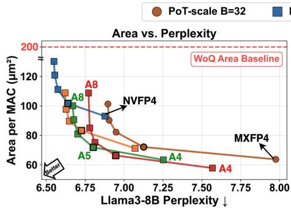

- **Hierarchical Block Quantization (HBQ)** 两级量化方案：
  - L1 采用**大 block (B=128)** 最大化效率摊销，L1 scale 使用 FP8 格式。
  - 引入**Significand Scaling (SIG)** 作为 L2 scaling：$\alpha = 1 + c/2^x$，仅 2-bit，硬件开销极低。
  - **差异化处理异质分布**：
    - Activation/KV 误差集中在小幅值区域 → 采用 **SIG₁**（恢复至 B16 级误差）。
    - Weight 误差集中在大幅值区域 → 采用 **SIG₂/SIG₃**，离线逐 block 择优（存储 1-bit selector），无需 calibration。

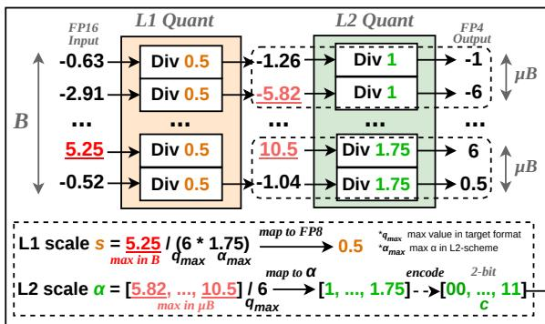

- **两种配置**：
  - **HBQ-E** (µB=32)：效率优先，面积开销 <10%。
  - **HBQ-A** (µB=8)：精度优先，匹配 WoQ (AWQ) 的 perplexity。

- **硬件加速器设计**：
  - Weight-stationary systolic array，TSMC 28nm，500 MHz，4,096 MACs/cycle，174 kB on-chip buffer。
  - **Partial Sum BQ**：将 psum 压缩为 **MXINT8** 块量化格式，等效容量翻倍、tile 数量减半，从而降低 EMA 能耗，精度损失可忽略。

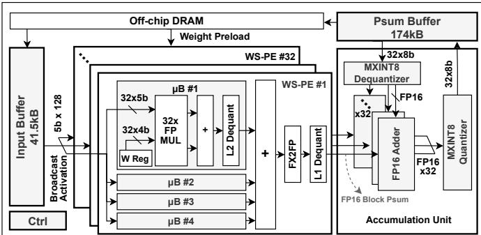 *Fig. 12. Proposed HBQ accelerator. Each PE implements the HBQ MAC operation shown in Fig. 9(b) using the W4A5 HBQ-E configuration.*

---

**结果**

- **量化精度**（Llama3-8B WikiText-2 PPL 对比，W/A/KV 均含 scale 开销的 effective bit-width）：

| 方法 | W/A/KV | Llama3-8B PPL | Area/MAC (µm²) |
|---|---|---|---|
| Baseline FP16 | 16/16/16 | 6.14 | 1 (归一化) |
| AWQ (WoQ) | 4.13/16/16 | 6.53 | 200 |
| NVFP4 | 4.5/4.5/4.5 | 6.88 | 93 |
| MXFP4 | 4.25/4.25/4.25 | 7.98 | 64 |
| VSQ | 4.5/4.5 | 9.45 | 60 |
| **HBQ-E** | 4.13/5.13/4.13 | 6.68 | **72** |
| **HBQ-A** | 4.31/5.31/4.31 | **6.52** | 87 |

- **关键量化结论**：
  - HBQ-A 以 **W4A5** 精度达到 **W4A16 (AWQ) 级精度**，且面积较 NVFP4 更小（87 vs 93 µm²）。
  - 在 KV Cache 量化场景下，HBQ-A (4.31/5.31/4.31) 与 NVFP W4A8 精度持平，但激活位宽减半。
  - Reasoning benchmark（GSM8k/HumanEval/MMLU，含 KV 量化）中 HBQ 平均准确率 **60.7%**，显著优于 NVFP W4A8 (59.2%) 与 MXFP W4A4 (27.5%)。

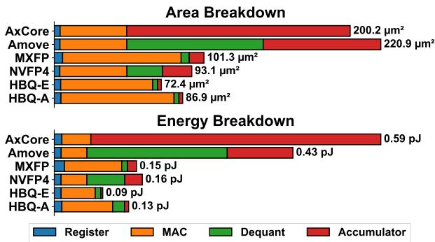

- **硬件效率**：
  - PE 级：相较 SoTA WoQ (AxCore)，面积/能效提升 **2.3×/4.6×**（同精度）。
  - 系统级：相较 Amove/NVFP4/MXFP，端到端能耗降低 **1.6–3.3×**（HBQ-E 几何均值仅 2.15 J，NVFP4 为 3.42 J，Amove 为 7.07 J）。
  - Iso-area 场景下实现 **1.5–3.0× 加速**；长生成 reasoning case study (DeepSeek-Distill-8B) 中 HBQ-A 较 MXFP/NVFP 实现约 1.8×/1.6× speedup。
  - Progressive ablation 显示：Psum MXINT8 量化带来 **16.4% 系统能耗节省**，PPL 仅增 0.01。

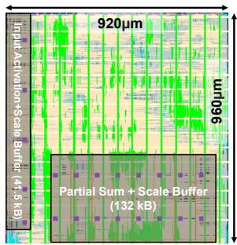

- **SIG 消融**：在 W4A5、B=128/µB=32 设置下，L2 SIG scaling 在 Llama3-8B 与 Mixtral-8x7B 上均一致优于 PoT/INT scaling（如 Llama3-8B: 6.68 vs PoT 6.84/INT 6.79），面积代价仅 +4%。

---

**结论**

- **Block size 是 BQ 精度-效率权衡的首要设计参数**，先前工作（VSQ、MicroExponent）将其固定为 16 而错过了关键优化轴。
- HBQ 通过**大 L1 block + 轻量 2-bit SIG L2 scaling** 的组合，首次打破 BQ 的精度-效率矛盾：以 **W4A5** 达到 WoQ (W4A16) 精度，同时保留 BQ 的全低精度统一数据通路优势。
- 通过量化 **W/A/KV/Psum 全部张量**，HBQ 实现 end-to-end 统一硬件上的低精度推理，相较现有 BQ 方法在精度最优的同时取得 **1.6–3.3× 能耗节省与 1.5–3× 加速**。
- 部署建议：**HBQ-E** 适用于 throughput 导向、prefill 为主的场景；**HBQ-A** 适用于 decode 密集、KV 敏感的 reasoning 场景。
- 局限与定位：相较 rotation-based 方法（QuaRot/SpinQuant），HBQ 无需 GPTQ 微调与在线旋转开销，支持 direct-casting 部署，在 W4A4 同位宽下 PPL 更优（6.73 vs 7.1/7.9）。

---

## 2. 背景知识与核心贡献

**研究背景**

- 大语言模型推理成本高昂，**Quantization** 成为降低内存与计算开销的关键技术。主流方案分为两类：
  - **WoQ (Weight-only Quantization)**：如 AWQ，仅量化权重，精度高但 KV cache 未量化，注意力部分仍需 **全精度 datapath**，无法在统一硬件上实现端到端低精度推理。
  - **BQ (Block Quantization)**：如 **MXFP4 (Microscaling)**、**NVFP4**，将 tensor 切分为 block 并共享 scaling factor，同时量化 **Weight / Activation / KV cache**，可在单一低精度硬件管线完成端到端推理，硬件效率显著更高，但存在精度退化问题。
- BQ 的设计空间（bit-width、block size、scaling scheme、numeric format）在既有工作中**缺乏系统性探索**，其 accuracy–efficiency 的 **Pareto frontier** 一直不清晰。

**研究动机**

- 作者通过 **DSE (Design Space Exploration)** 发现一个核心矛盾：**block size 是支配硬件效率的关键参数**，却常被先前工作固定为常数：
  - 增大 block size 可将 dequantization 与 accumulation 开销摊销到更多元素上，显著降低 area / energy / weight EMA。
  - 但块内 **dynamic range** 扩大、outlier 效应放大，导致精度严重退化。
- 因此 MXFP4 与 NVFP4 等方法被迫采用较小 block size（16 或 32），牺牲了硬件效率；而既有 hierarchical 方法（**VSQ**、**MicroExponent**）同样采用小 block 且使用 PoT/INT scaling，未能突破该瓶颈。

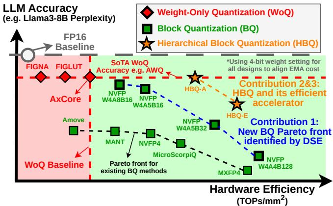 *Fig. 1. LLM inference accuracy-efficiency trade-off for WoQ, BQ, and HBQ. Values are shown relatively; see Fig. 6 and Section VII for exact results and evaluation details.*

**核心贡献**

- **系统性 Design Space Exploration**：联合评估 scaling 格式、element format、block size 与 bit-width，并结合硬件指标（28nm CMOS 综合 area/energy）与模型精度，识别出 BQ 的新 Pareto front：
  - **FP8-scale**（无符号 ue5m3）优于 **PoT-scale**；
  - **2-bit exponent** 的 FP element format（如 E2M5）实现精度与硬件成本的最佳平衡；
  - **5-bit activation (A5)** 是精度/效率的甜点；
  - **大 block size (≥32)** 提升硬件效率但需解决精度损失。
- **HBQ (Hierarchical Block Quantization)**：采用 **L1 大 block (B=128)** 保障效率，并引入两级量化配合新型 **SIG (Significand) scaling** 恢复精度：
  - SIG scaling 以 $1 + c/2^x$ 定义 L2 scale，开销仅 2-bit；
  - 针对激活与权重的**异质误差分布**，分别选取 SIG₁（激活，恢复至 B16 级误差）与 SIG₂/SIG₃（权重，误差降至 B16 以下）；
  - **HBQ-A (accurate)**：µB=8，以 **W4A5** 达到 **WoQ (W4A16, AWQ)** 级精度；
  - **HBQ-E (efficient)**：µB=32，面积较 NVFP4 再降 17%，精度超越所有既有 BQ 方法。
- **28nm ASIC 原型加速器**：
  - Weight-stationary systolic array，**32 PEs × 128 MACs = 4,096 MACs/cycle**，500 MHz，174kB on-chip buffer，place-and-routed 实现；
  - 统一 datapath 覆盖 **W / A / KV cache / Partial Sum** 全低精度端到端推理。
- **Partial Sum BQ 技术**：将 psum 以 **MXINT8** block 量化后再写回 buffer，等效容量翻倍、增大 tiling，在精度几乎无损（PPL +0.01）的前提下降低 **EMA 能耗约 16.4%**。

**关键实验结果**

| 对比维度 | 结果 |
|---|---|
| PE 级效率 vs. SoTA WoQ (AxCore) | **2.3× / 4.6×** area / energy 效率提升（同精度水平） |
| 系统级能耗 vs. Amove / NVFP4 / MXFP | 几何均值 **2.15 J** vs. 7.07 / 3.42 / 3.69 J，节省 **1.6–3.3×** |
| Iso-area 加速比 vs. 先前 BQ 方法 | **1.5–3.0×** speedup |
| Llama3-8B PPL（无 KV 量化） | HBQ-A **6.52**，优于 NVFP4 (6.88)，接近 AWQ (6.55) |

- HBQ 是首个在同时量化 Weight 与 Activation 的情况下达到 **WoQ 级精度** 的方法，并在 reasoning 任务（GSM8K / HumanEval / MMLU）上验证了对量化噪声的鲁棒性。

---

## 3. 核心技术和实现细节

### 0. 技术架构概览

**整体技术架构**

本文提出的 **HBQ (Hierarchical Block Quantization)** 是一套面向 LLM 低精度推理的“算法–硬件协同设计”架构，核心思想是**用大 Block Size 换取硬件效率，用二级层级量化（SIG scaling）弥补精度损失**，最终实现“WoQ 级精度 + BQ 级效率”的端到端推理。整体架构可分为三层：**算法层（两级量化方案）**、**PE 微架构层（HBQ MAC 运算）**、**加速器层（systolic array + 数据流 + partial sum 量化）**。

---

**一、算法层：Hierarchical Block Quantization**

- **L1 Block Quantization（大块量化）**：
  - L1 Block Size 设为 **B=128**（对齐现代模型 head dimension），采用 **FP8-scale (ue5m3)** 作为 L1 scaling factor，而非 MX 的 PoT-scale。
  - Element Format 选择 **2-bit exponent 的 FP 格式**（DSE 结论：E2 系列在精度与硬件开销间最优）。
  - 大块可充分摊销 scaling 存储与 dequantization 开销。
- **L2 Micro-block Quantization（SIG scaling）**：
  - 每个微块 μB 分配 2-bit L2 scale factor α，有效 scale 为 $\tilde{s}_{b,u} = s_b \cdot \alpha_{b,u}$。
  - 创新点：**Significand Scaling (SIG_x)**，定义为 $\alpha_{\mathrm{SIG}_x}(c) = 1 + \frac{c}{2^x}$，提供比 PoT/INT 更细粒度、更贴合分布的量化 levels，避免 levels 重叠与动态范围浪费。
  - **差异化处理 W/A 分布**：Activation/KV 用 **SIG₁**（块内动态范围大），Weight 用 **SIG₂/SIG₃ 离线混合选择**（每 L1 block 存 1-bit selector k，无 calibration 开销）。
  - 两个配置档位：

| 配置 | L1 B | μB | 精度 | 定位 |
|---|---|---|---|---|
| **HBQ-A (accurate)** | 128 | 8 | W4A5 | 匹配 WoQ (AWQ W4A16) 精度 |
| **HBQ-E (efficient)** | 128 | 32 | W4A5 | 极致硬件效率，面积仅 +9% 开销 |

- **覆盖全部张量**：Weight、Activation、**KV Cache**（与 weight 共享同一 datapath，支持 QKᵀ / SV 低精度注意力）以及 **Partial Sum** 均被量化。

---

**二、PE 微架构层：HBQ MAC 运算**

Baseline BQ PE 为四段流水：块内 B 个乘法 → **B-to-1 fixed-point adder tree**（无损块内累加）→ scaling 因子 dequantization → 跨块 FP 累加。

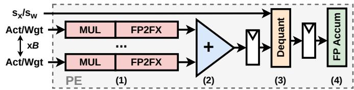 *Fig. 2. Baseline design for block quantization PE with block size B. (FP2FX: floating point to fixed point converter)*

HBQ 在此基础上引入**插入式 L2 dequantization 模块**：

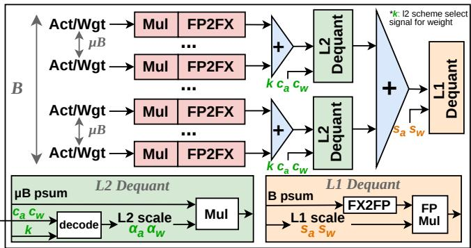 *(b) HBQ MAC operation*

- 乘法后先做 **μB-to-1 fixed-point adder tree** 完成微块内归约；
- 用 L2 scale 编码 ($c_a, c_w$) 与 weight 的 scheme selector k 执行 **L2 dequantization**；
- 再执行与 BQ 相同的 **L1 dequantization** 与跨块 FP 累加；
- 关键约束：α 限制在 2-bit 小整数范围（1–4），**L1 dequantization 之前的所有运算保持 fixed-point**，最大化效率；
- MAC 延迟为 3-cycle 流水，比 baseline BQ 多一级流水段，但在 ~500 MHz 下频率裕量充足。

---

**三、加速器层：Systolic Array 原型**

**整体架构（28nm, place-and-routed, 500 MHz）**：

 *Fig. 12. Proposed HBQ accelerator. Each PE implements the HBQ MAC operation shown in Fig. 9(b) using the W4A5 HBQ-E configuration.*

- **32 个 PE × 每 PE 128 MAC = 4,096 MACs/cycle** 吞吐；
- 片上 buffer：**41.5 kB input + 132 kB psum**（合计 174 kB）；
- 采用 **Weight-Stationary (WS) dataflow** 最小化数据搬运与动态功耗；
- KV cache 以 4-bit 量化后作为 weight 数据预载入 PE，使 **projection layers 与 attention heads 统一在同一低精度 datapath** 上运行，实现端到端推理。

**数据流**：

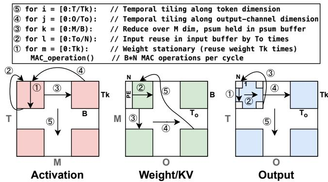

- 每 cycle 向 N=32 个 PE 广播一个 B 块 activation；
- input buffer 存 $B \times T_k$ 个 activation（weight 跨 $T_k=512$ 个 token 复用）；psum buffer 存 $T_o \times T_k$ 个 partial sum（activation 跨 $T_o=128$ 个输出通道复用）。

**Partial Sum MXINT8 量化（关键系统级创新）**：

- 每 32 个 FP16 psum 压缩为 **32 个 MXINT8**（block size=32 对齐 PE 数）后写入 psum buffer，**存储需求减半 → 可容纳 psum 数翻倍 → tile 数减半 → EMA 能耗显著降低**；
- 精度损失极小：PE 内块内归约为 fixed-point 无损，有损步骤（FP16 累加 + MXINT8 量化）仅在每 M/B 步发生一次，误差传播受限；
- 系统 energy 降低 **16.4%**，PPL 仅 +0.01。

**在线量化**：
- 辅助 SIMD 模块承担非线性运算（normalization、softmax、RoPE），其后在线执行 activation re-quantization；
- HBQ quantizer 为 3-stage 流水，量化器面积开销仅 **4.0%**，吞吐充分。

---

**架构有效性总结**

| 维度 | 关键设计 | 收益 |
|---|---|---|
| 算法 | B=128 + 2-bit SIG L2 scaling | 精度恢复至 B16 水平，匹配 WoQ (AWQ) |
| 格式 | FP8-scale (ue5m3) + E2M5 element | 优于 PoT-scale / INT / 高指数 FP |
| PE | 大块摊销 + fixed-point 前级 | 面积/MAC 72–91 µm²，较 WoQ (AxCore) **2.3×/4.6× area/energy 效率提升** |
| 系统 | MXINT8 psum 量化 + 统一 W/A/KV datapath | 系统能耗降低 **1.6–3.3×**，iso-area 加速 **1.5–3.0×** |

该架构的本质是：**通过系统化 DSE 识别 Block Size 为效率主导变量，再以硬件友好的 SIG 层级量化解锁大块精度瓶颈，最终以统一低精度 datapath + psum 压缩充分释放 Block Quantization 的端到端效率潜力**。

### 1. 硬件感知的BQ设计空间探索（DSE）与Pareto前沿分析

**核心命题：BQ的瓶颈不在范式本身，而在设计空间探索的缺失**

论文的核心洞察在于：现有BQ方法（MXFP4、NVFP4等）的精度-效率折衷并非Pareto最优，而是**设计空间探索不充分**导致的局部最优解。作者通过系统性DSE识别出新的Pareto前沿，其关键发现是——**block size是被以往工作忽视的核心设计轴**，它直接支配硬件效率（摊销dequantization与accumulation开销）与精度（intra-block动态范围扩大）之间的张力。

---

**DSE的基础设施：硬件基线PE设计**

DSE的一切硬件结论都建立在统一的基线处理单元（PE）之上，确保不同量化配置的面积/能耗对比公平可比：

 *Fig. 2. Baseline design for block quantization PE with block size B. (FP2FX: floating point to fixed point converter)*

- **四级流水结构**（对应Fig. 2）：
  - 第一级：B个activation/weight对的**乘法阵列**，若输入为FP则输出经FP2FX转换器转为定点
  - 第二级：**B-to-1定点加法树**，完成intra-block无损累加
  - 第三级：**反量化（dequantization）**，使用scaling factor（FP8乘法或PoT移位）
  - 第四级：跨block的**浮点累加**，形成channel级输出
- **关键设计决策**：
  - 加法树不做bit truncation（区别于Eyeriss等设计），保持无损基线的纯净性，为DSE提供干净的参照点
  - 所有设计在**TSMC 28nm、500 MHz**下综合，功耗使用Synopsys PrimeTime基于Llama3-8B在WikiText-2上的真实switching activity测量
- **WoQ硬件基线**选用SoTA工作**AxCore**（混合精度乘法优化 + pre-alignment FP adder），算法精度基线为**AWQ**，避免稻草人对比
- RTL代码开源以保证可复现性

---

**探索轴一：Scaling Factor格式——FP8-scale vs. PoT-scale**

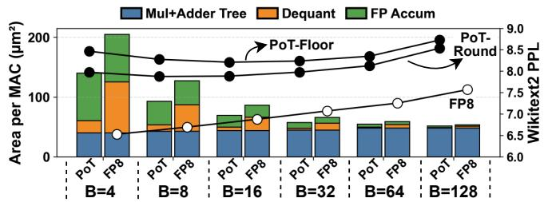

**核心矛盾**：PoT-scale（MX标准）的dequantization仅需**bit-shift**，硬件开销极低；FP8-scale需要**浮点乘法**，精度更优但每block都要付出一次FP乘法代价。

- **DSE揭示的摊销效应**：当block size增至**64或128**时，FP8-scale的dequantization成本被大量MAC操作摊销，单位MAC面积与PoT-scale趋于持平，但精度（PPL）显著更优
- **对PoT-rounding的修正**：原始MX的floor操作会截断block最大值损伤精度，改用round-to-nearest可在**零硬件开销**下持续提升精度
- **FP8子格式选择**：论文选用**FP_ue5m3**（无符号位、5位exponent、3位mantissa），理由是scaling factor不需要符号位，且近期工作证明E5M3量化结果更稳定。Table II验证其精度与NVFP4的e4m3+per-tensor scale方案相当：

| 方案 | Per-Tensor Scale | Scaling格式 | Llama2-7B PPL | Llama3-8B PPL | Llama3.1-8B PPL |
|---|---|---|---|---|---|
| NVFP4 | Yes | e4m3 | 5.76 | 6.87 | 6.94 |
| AMXFP | No | e5m2 | 5.80 | 6.97 | 7.03 |
| **本文** | No | **ue5m3** | **5.75** | **6.88** | **6.96** |

- **结论**：FP8-scale在所有block size下形成一致更优的Pareto前沿，被确立为后续探索的默认scaling方案

---

**探索轴二：Element Format——2-bit Exponent是甜点**

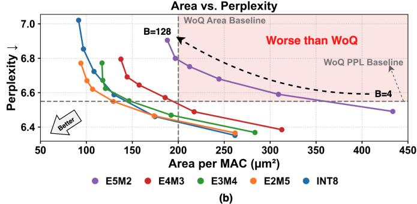

**核心论点**：传统认知认为INT格式硬件更高效，但BQ低比特场景下该假设失效。

- **论证逻辑链**：
  - 由于block内动态范围已被scaling factor归一化，PE的多数数据通路（乘法、加法树）实际工作在**fixed-point**域
  - 低比特FP（如E2M5）的定点化数据通路与INT8一样紧凑，却能提供更好的**动态范围控制**
  - 常规FP8格式（E4M3、E5M2）为粗粒度量化的宽动态范围设计，在block内的窄分布（Fig. 4(a)中Llama3-8B的per-block分布，B=128时QSNR=37.49 dB）下，大exponent预算纯属浪费
- **实验设置**：W4A8下横跨E5M2→INT8共多种8-bit格式 × block size 4–128，W4A5下复验（Fig. 5）

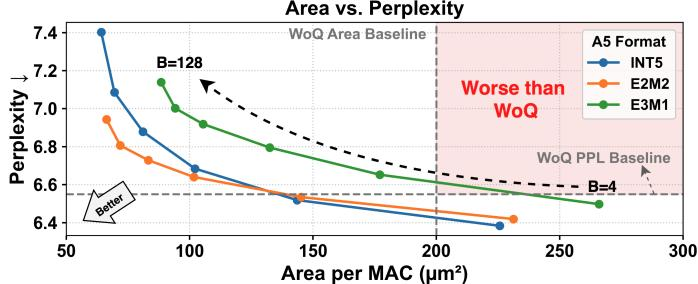

- **结论**：**E2格式（2-bit exponent，如E2M5）**在精度-面积折衷上全面胜出——缩减的动态范围使定点数据通路紧凑如INT8，增多的mantissa位提升量化质量。该结论在W4A5低比特档位依然成立

---

**探索轴三：Block Size与Activation精度的联合探索——Pareto前沿的核心**

这是DSE最重要的部分，三张子图分别以**面积/MAC**、**能耗/MAC**、**权重有效位宽（wgt-EBW）**为效率轴：

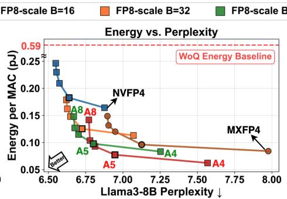

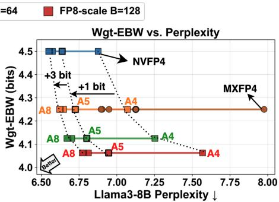

**实验设置**：

- 权重固定为FP4（E2M1），因**权重精度主导LLM负载的EMA开销**
- Activation从FP4扫到FP8（E2M1–E2M5），block size从16扫到128，scaling为FP8-scale
- 模型为Llama3-8B，精度用WikiText-2 PPL度量

**Block size的作用机制**：

- 更大的block摊销scaling factor存储、dequantization与FP accumulation开销，**降低单位MAC面积与wgt-EBW**
- 代价是intra-block动态范围扩大，**PPL单调劣化**
- **关键证据**：NVFP4在B=64时达到与MXFP4相同的单位MAC面积，但PPL显著更优（**7.25 vs. 7.98**），直观说明“同面积下存在大幅精度红利”

**Activation精度的边际递减规律**（Table III，覆盖Llama3、Qwen2.5、Mixtral多家族）：

| 精度跃迁 | 平均精度增益 | 硬件代价 |
|---|---|---|
| W4A4 → W4A5 | **+2.0%**（平均0-shot/MMLU/GSM8k） | 仅1 bit，minimal overhead |
| W4A5 → W4A8 | +0.7% | 3 bits，收益骤减 |

- **结论**：**5-bit activation（A5）**是最优折衷点
- **工程细节**：单个5-bit数据与字节边界不对齐，但**整个block打包后总字节数恰为8的倍数**，可实现紧凑存储
- QSNR分析（Fig. 7）从信号量化噪声比角度交叉验证了A5的甜点地位：

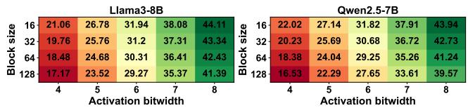

---

**探索轴四：KV Cache Block Size**

为实现端到端统一数据通路，KV cache须量化为与权重相同格式（4-bit），使**QK^T与投影层共享同一硬件**：

| KV Block Size | 8 | 16 | 32 | 64 | 128 |
|---|---|---|---|---|---|
| Llama3-8B PPL | 7.38 | 7.47 | 7.58 | 7.65 | 7.79 |
| Quantization MSE | 0.012 | 0.016 | 0.022 | 0.029 | 0.040 |

- 结论与前述一致：block size增大单调劣化量化质量，与KIVI、KVQuant等KV量化先验工作观察吻合

---

**DSE收敛的四条设计准则与“根本张力”**

**DSE最终输出**（即HBQ算法设计的输入约束）：

- **FP8-scale**优于PoT-scale（MX），形成更优Pareto前沿
- **2-bit exponent FP格式**在精度与硬件成本间取得最佳平衡，同时击败INT与大exponent FP
- **5-bit activation**是量化质量与硬件效率的甜点
- **大block（≥32）**提供更高硬件效率，但伴随精度损失

**暴露的根本张力**：大block通过摊销dequantization与accumulation开销显著提升硬件效率，却因精度劣化被以往工作放弃——MX与NVFP4固守B=16/32的根源正在于此。**这一张力直接催生了HBQ的两级量化方案**：用大L1 block（B=128）收割效率，用SIG significand scaling的L2微块修复精度。

---

**DSE在论文整体架构中的输入输出关系**

- **输入**：统一基线PE架构 + 量化算法设计维度（bit-width、element format、scaling scheme、block size）+ 真实工作负载（Llama3-8B/WikiText-2的switching activity）
- **输出**：
  - 新的BQ Pareto前沿配置空间（E2 exponent + FP8-scale + A5 + 大block），量化为Table XIII的渐进路径——从NVFP4基线出发，B=128带来**-34.8%面积/-36.5%系统能耗**但+0.31 PPL的代价，该代价由L2 SIG scaling（+9.1%面积）回补0.27 PPL
  - W/A异构误差分布的实证分析基础（Fig. 8），指导SIG参数差异化选择（activation用SIG_1、weight用SIG_2&3离线混合）
- **闭环验证**：DSE发现“简单调优即可超越现有BQ方法”（Fig. 1），同时论证了效率天花板受限于block size张力——这两点分别构成HBQ**必要性论证**（现有方法确实次优）与**创新性论证**（突破block size限制需要新算法机制）的完整逻辑链

**方法论价值**：该DSE首次将**MAC级硬件指标（面积、能耗）与端到端精度指标（PPL、zero-shot）联合纳入BQ探索**，弥补了MicroExponent/BDR框架只看QSNR与存储开销、VSQ只在ResNet-50上纯算法视角探索L2 vector size的缺陷，为算法-硬件co-design确立了可复现的评估范式（开源RTL + 匹配的物理实现流程）。

### 2. 层次化块量化与尾数缩放（HBQ with Significand Scaling）

**核心观点**

层次化块量化（Hierarchical Block Quantization, HBQ）的本质是**用“两级缩放因子分解”换取“大块尺寸的硬件摊销收益”**。传统 BQ 面临根本性矛盾：block size 增大（从 16 到 128）可以将 L1 scale 存储、反量化（dequantization）和 FP accumulation 的开销摊销到更多 MAC 操作上，从而显著降低每 MAC 面积与能耗；但块内 dynamic range 随之扩张，量化误差（尤其是激活值中的 outlier 效应）急剧放大。HBQ 通过在 L1 大块内部引入**低开销的 L2 significand scaling（SIG）**，将误差恢复到 B16 级别甚至更低，同时保留 B=128 带来的全部硬件效率收益。

---

**一、两级量化机制（Two-Level Quantization）**

HBQ 将传统单级 BQ 分解为两级缩放层级：

- **L1 层级（大块）**：block size 固定为 **B = 128**（对齐现代模型的 head dimension），每个 L1 块共享一个 FP8（**ue5m3**，无符号位以节省 1 bit）缩放因子 $s_b$。
- **L2 层级（micro-block, μB）**：每个 L1 块内部划分为若干微块 $\mathcal{U}_{b,u} \subset B_b$，每个微块携带一个 **2-bit** 的 L2 缩放编码 $c$。
- **有效缩放因子**为两级因子之积：

$$\tilde{s}_{b,u} = s_b \cdot \alpha_{b,u}$$

- 量化与反量化流程：
  - 量化：$q^{(b,u)} = \mathcal{Q}_F(x / \tilde{s}_{b,u})$，其中 $\mathcal{Q}_F$ 为目标 element format（如 FP4 E2M1）的 casting 函数；
  - 反量化：$\hat{x} = q^{(b,u)} \cdot \alpha_{b,u} \cdot s_b$。
- 核心收益：以 FP4 为例，2-bit L2 scale 将**可表示量化级数有效扩展 4 倍**，相当于在不增加 element bit-width 的前提下“虚拟地”提升了精度。

---

**二、Significand Scaling（SIG_x）的算法设计**

**参数化定义**

- SIG 引入超参数 **x** 控制缩放粒度，L2 缩放因子定义为：

$$\alpha_{\mathrm{SIG}_x}(c) = 1 + \frac{c}{2^x}, \quad c \in \{0, 1, ..., 2^n - 1\}, \ x \in \mathbb{N}$$

- 其中 **n = 2**（即 c 为 2-bit 编码），因此每个 $\alpha$ 取值为 $\{1, 1+\frac{1}{2^x}, 1+\frac{2}{2^x}, 1+\frac{3}{2^x}\}$，取值范围锁定在 **[1, 2)** 至 **[1, 4)** 的窄区间内。
- x 越大，相邻 α 之间的间隔越小（粒度越细），缩放因子越接近 1。

**为何优于 PoT 与 INT 缩放（对 prior hierarchical 方法的批判）**

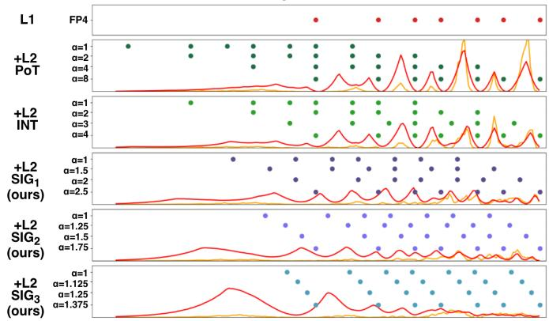

- **PoT（VSQ/MicroExponent 采用）**：缩放因子为 2 的幂次，不同 α 下的量化级严重**重叠（overlap）**，有效精度被浪费；且覆盖了过宽的 dynamic range。
- **INT**：等间距整数值缩放，同样存在级数重叠与范围浪费问题。
- **SIG**：
  - 量化级在数值轴上**互补分布**，不重叠，最大化了 2-bit 编码的表示效率；
  - 窄幅缩放（1–4 倍）精确匹配 BQ 已经归一化后的窄 intra-block dynamic range；
  - 关键硬件性质：由于 $\alpha$ 限制在小整数范围（1–4），**L2 反量化之后的数值仍保持在有限 dynamic range 内**，使 L1 反量化之前的全部运算得以在 **fixed-point datapath** 上执行，避免昂贵的浮点单元。

---

**三、激活/权重异质性（Heterogeneity）的差异化处理**

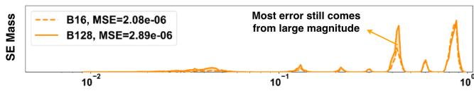

误差分布分析（block size 从 16 增至 128）揭示了两种张量的本质差异：

- **权重（Weight）**：MSE 相对稳定，新增误差集中在**高幅值区域**——分布集中，需要更细的缩放粒度来加密高幅值量化点。**SIG₃**（α ∈ {1, 1.125, 1.25, 1.375}）提供最细粒度，可将误差压至 **B16 以下水平**；继续增大到 SIG₄ 无额外收益。
- **激活与 KV Cache**：block size 增大导致误差**近乎三倍增长**，主要来自小幅值元素（outlier 放大效应、dynamic range 扩张）——需要更宽的范围覆盖而非极致粒度。**SIG₁**（α ∈ {1, 1.5, 2, 2.5}）是甜点配置，可将 B=128 的误差恢复到 **B16 级别**。
- **离线混合选择（Offline Mixture Selection）**：权重量化离线执行时，对每个 L1 块同时评估 **SIG₂ 与 SIG₃** 并选取 MSE 更小者，无需任何 calibration；每个 L1 块仅存储 **1-bit selector (k)** 供反量化时选择解码方案。

---

**四、MAC 运算流水线与硬件映射**

 *(b) HBQ MAC operation*

HBQ MAC 相较于基线 BQ PE（Fig. 2 的四级流水）插入了 L2 反量化级，完整流程为：

- **Stage 1 — 乘法**：μB 对激活/权重对执行乘法（FP 输入时经 FP2FX 转为定点）；
- **Stage 2 — intra-micro-block reduction**：**μB-to-1 fixed-point adder tree** 完成微块内无损累加（区别于 BQ 的 B-to-1 树）；
- **Stage 3 — L2 反量化**：使用 $c_a, c_w$ 编码及权重侧的 scheme 选择位 k 解码 α，执行低开销缩放；
- **Stage 4 — L1 反量化 + FP accumulation**：沿用与 BQ 相同的 L1 缩放（FP8 乘法），随后跨块进行浮点累加得到 channel 级输出。
- **关键设计约束**：L2 scale 严格保持 2-bit、α ∈ [1, 4)，确保 Stage 1–3 全部停留在 fixed-point 域，最小化引入第二层级的硬件代价。

**在线量化器（Online Quantizer）开销**

| 方案 | 面积 (µm²) | 延迟 | 吞吐 | 加速器面积占比 |
|---|---|---|---|---|
| NVFP4 | 22,001 | 2 cycles | 128 activations | 3.0% |
| HBQ | 26,024 | 3 cycles (L1 scale → L1 quant → L2 quant 三级流水) | 128 activations | **4.0%** |

- 量化器全流水化以隐藏延迟；由于 L2 缩放因子限制在小整数范围，相对 NVFP4 的额外逻辑开销极小，128 activations/cycle 的吞吐足以匹配 4096-MAC GEMM 速率。

---

**五、微块尺寸（μB）权衡与双配置**

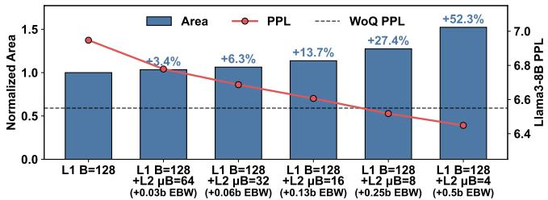

μB 是 HBQ 的核心精度-效率调节旋钮：

- **降低 L1 block size** 会同时削弱 L1 反量化与后级 FP accumulator（二者远比 L2 反量化昂贵）的摊销效果，因此**用 μB 而非 L1 size 做调节是更优选择**。
- 两种出厂配置：

| 配置 | L1 (B) | L2 (μB) | Scale EBW 开销 | 定位 |
|---|---|---|---|---|
| **HBQ-E**（efficient） | 128 | 32 | 0.125 | <10% 面积开销，面积/MAC 低至 72 µm²，适合 prefill 主导的吞吐型部署 |
| **HBQ-A**（accurate） | 128 | 8 | 0.3125 | µB=8 时精度追平 WoQ（AWQ W4A16），仅用 **W4A5** 即达 W4A16 级 PPL |

- 实证：HBQ-E 在多模型平均 zero-shot 上仅落后 HBQ-A **0.4%**；但在 KV Cache 量化下的 reasoning 任务中差距扩大至约 **3%**（KV cache 存在极端 outlier，细粒度 μB 更有利于压缩 dynamic range），故 **HBQ-A 推荐**用于 decode 密集、KV-heavy 的长推理场景。

---

**六、与 prior hierarchical 方法的对比与消融**

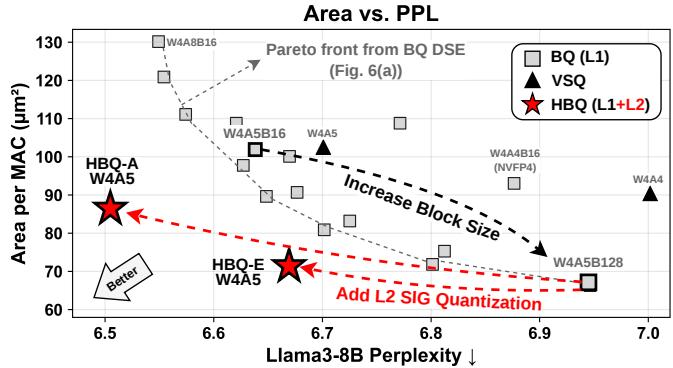

| 方案 | B (k₁) | µB (k₂) | L1 Scale | L2 Scale | Scale EBW 开销 |
|---|---|---|---|---|---|
| MX (MicroExponent) | 16 | 2 | PoT-8b | PoT-1b | 1.0 |
| VSQ | channel | 16 | FP-32b | INT-8b | 0.5 |
| **HBQ-E** | **128** | **32** | **FP-8b** | **W: SIG₂&₃-2b / A: SIG₁-2b** | **0.125** |
| **HBQ-A** | **128** | **8** | **FP-8b** | **W: SIG₂&₃-2b / A: SIG₁-2b** | **0.3125** |

- **MicroExponent**：µB=2 极细粒度引入 +1 bit 有效位宽，W4A4 下有效 element 精度退化至 INT3，现代 LLM 精度不可接受；且采用 DSE 已证明劣于 FP8-scale 的 PoT 缩放。
- **VSQ**：per-channel L1 缩放无法压缩第二级的 dynamic range，层级化收益受限，实际表现近似“带整数缩放的 NVFP4”，继承了小块限制。
- **L2 缩放方案消融**（W4A5, B=128/µB=32, WikiText-2 PPL↓）：

| L2 方案 | Llama3-8B（A:SIG, W:SIG） | Mixtral-8x7B（A:SIG, W:SIG） |
|---|---|---|
| 无 L2（仅 L1 FP-8b） | 6.95 | 4.24 |
| PoT | 6.70 | 4.12 |
| INT | 6.69 | 4.12 |
| **SIG** | **6.68** | **4.11** |

- SIG 全面优于 PoT/INT；从 PoT 切换至 INT/SIG 的面积代价仅 **+3%/+4%**（B=128/µB=32），精度提升的性价比明确。
- **渐进优化消融**（Llama3-8B）进一步拆解各组件贡献：

| 渐进步骤 | PPL | 面积/MAC (µm²) | 系统能耗 |
|---|---|---|---|
| NVFP4 基线 (W4A4B16) | 6.88 | 93.0 | 4.99 J |
| + 5-bit activation | 6.64 | 101.7 (+9.4%) | 5.29 J |
| + B=128 | 6.95 | 66.3 (**−34.8%**) | 3.36 J (**−36.5%**) |
| + L2 SIG scaling | 6.68 | 72.4 (+9.1%) | 3.72 J |
| + MXINT8 Psum 量化 | 6.69 | 72.4 (+0%) | **3.11 J (−16.4%)** |

---

**七、输入输出关系与在整体系统中的角色**

- **输入**：高精度张量（FP16 权重/激活/KV Cache），经两级量化编码为「低精度 element（FP4/FP5, E2M1/E2M3）+ 2-bit L2 SIG 编码 $c$ + 8-bit FP8 L1 scale $s_b$ +（权重侧）1-bit selector k」的紧凑表示。
- **输出**：PE 计算后输出 channel 级的 FP16 partial sum，经 **MXINT8 block quantization**（block size 32）压缩后写入 psum buffer，供跨 M 维累加与 tiling 重用。
- **系统级定位**：HBQ 是加速器的算法基座——在 28nm、500 MHz 的 weight-stationary systolic array 上，支撑 **W/A/KV/Psum 全链路低精度推理**：
  - 相对 SoTA WoQ（AxCore/AWQ）：同等精度下 **2.3×/4.6× 面积/能效提升**；
  - 相对 prior BQ（Amove/NVFP4/MXFP）：**1.6–3.3× 系统能耗降低、1.5–3.0× 加速**，同时精度全面领先；
  - HBQ-A 以 **W4A5** 达到 WoQ 级 PPL（如 Llama3-8B 上 6.52 vs AWQ 的 6.53），首次实现“WoQ 精度 + BQ 效率”的兼得。

---

**总结**

HBQ 的技术精髓可归纳为三个协同设计决策：**大 L1 块（B=128）摊销高精度运算开销、2-bit SIG 尾数缩放以互补量化级恢复精度、激活/权重差异化 SIG 粒度适配异质分布**。三者共同作用，使层级化量化不再是精度与效率的折中手段，而是同时超越单级 BQ Pareto 前沿与 WoQ 精度上限的系统性方案。

### 3. 部分和块量化（Psum MXINT8 Quantization）

**核心动机：Partial Sum Buffer 是 Weight-Stationary 数据流的关键瓶颈**

- 在 HBQ 加速器采用的 **weight-stationary (WS) dataflow** 中，psum buffer 承担跨 tile 的中间结果缓存职责，其容量直接决定了两个关键 tiling 参数：
  - **T_k**（token tile size）：决定权重可被多少 token 复用；
  - **T_o**（output tile size）：决定 activation 可被多少输出通道复用。
- 常规设计中 psum 以 **FP16 或 FP32** 存储，单个 psum 占用空间大，导致：
  - buffer 可容纳的 psum 数量受限；
  - T_o 与 T_k 被迫缩小；
  - weight/activation 需要更频繁地从外部存储重新加载；
  - 最终表现为 **EMA (External Memory Access) 能耗开销显著上升**。
- 论文的关键判断：**psum buffer 容量是 tiling 粒度与 EMA 开销之间的直接耦合点**，压缩 psum 的存储位宽即可在不增加 SRAM 面积的前提下扩大有效 buffer 容量。

---

**量化方案设计与参数设置**

- 采用 **BQ (Block Quantization) 直接作用于 psum**，具体配置为：
  - **Block size = 32**：刻意与加速器的 **PE 数量 (N=32)** 对齐，使得每个 cycle 由 32 个 PE 产出的 32 个 block-level psum 恰好构成一个完整的量化 block，硬件映射天然对齐、无需额外重组逻辑；
  - **数据格式 = MXINT8**：即 INT8 element 配合 PoT block scale 的 Microscaling 变体。
- 选择 **MXINT8** 而非 MXFP8 的原因：
  - **量化/反量化硬件成本极低**（INT cast + PoT 位移，无需浮点乘法）；
  - 实验表明其精度优于 MXFP8 等同类格式，更适合 psum 这种动态范围相对受限的数据。
- **关键设计原则——高精度累积与压缩存储解耦**：
  - 累加运算本身始终在 **FP16** 精度下进行；
  - MXINT8 仅在 **写入 psum buffer 时** 施加压缩；
  - 从 buffer 读出时立即反量化回 FP16 参与后续累加，即“**FP16 accumulate, MXINT8 store**”。

---

**硬件数据通路与逐周期操作流程**

 *Fig. 12. Proposed HBQ accelerator. Each PE implements the HBQ MAC operation shown in Fig. 9(b) using the W4A5 HBQ-E configuration.*

在 4096-MAC systolic array（32 PEs × 128 MACs/PE，500 MHz，TSMC 28nm）中的完整数据流如下：

- **输入端**：
  - PE 内部完成 128 个 MAC 运算后，经 **µB-to-1 定点 adder tree**（HBQ 两级结构）与 L1/L2 反量化，每 cycle 从 32 个 PE 输出 32 个 **FP16 block-level psum**。
- **读出路径**：
  - 每 cycle 从 psum buffer 读出 **32 个 MXINT8 psum**；
  - 经低成本反量化（INT8→FP16 + PoT shift）恢复为 FP16。
- **累加与回写**：
  - **FP16 adder** 将 32 个反量化值与 32 个新产生的 block-level psum 对应相加；
  - 更新后的 FP16 结果经 **quantizer 压缩回 MXINT8**；
  - 写回 psum buffer，完成一次迭代。
- **输出端**：
  - psum buffer 总容量 132kB，在 MXINT8 存储下可容纳 **T_o × T_k = 128 × 512** 规模的 psum 矩阵，支撑 activation 沿 M 维（reduction dimension）的完整复用。

**容量与 tiling 的量化收益链**：

| 环节 | 效果 |
|---|---|
| FP16 → MXINT8 存储 | 单个 psum 占用空间 **减半** |
| Buffer 有效容量 | psum 数量 **翻倍** |
| Tiling 粒度 | 单次 GEMM 所需 tile 数 **减半** |
| 系统级影响 | weight/activation 重载次数减少 → **EMA 能耗下降** |

---

**误差控制机制：为什么精度损失几乎为零**

这是该技术最核心的巧思——误差被计算结构本身天然抑制：

- **误差源隔离**：
  - PE 内部的 intra-block reduction（B 个乘积的累加）全程使用 **定点算术，完全无损**；
  - 唯一的有损环节是 **FP16 累加 + MXINT8 量化**。
- **误差注入频率极低**：
  - 沿 reduction dimension M 的整个累加过程中，lossy 步骤仅每 **M/B** 步发生一次（B=128 时即每 128 次累加才引入一次量化误差）；
  - 量化误差不会在 PE 内部定点路径中传播，只在 FP16 域中以低频方式叠加。
- **验证方法**：
  - 作者实现了**定制 CUDA kernel**，在 GPU 上精确复刻“FP16 累积 + MXINT8 block 量化”的数值行为，确保软件评估与硬件实际行为一致。

**精度影响实测数据（Table VII）**：

| Accumulation Kernel | Llama3-8B PPL (FP16) | NVFP4 PPL | HBQ-E PPL | GSM8K Acc (FP16/NVFP4/HBQ-E) |
|---|---|---|---|---|
| Baseline (FP32) | 6.14 | 6.88 | 6.68 | 86.2 / 68.0 / 74.0 |
| + Switch to FP16 | 6.14 (+0) | 6.89 (+0.01) | 6.69 (+0.01) | 86.2 / 68.4 / 74.0 |
| + MXINT8 Quantization | 6.15 (+0.01) | 6.89 (+0) | 6.69 (+0) | 86.1 / 68.5 / 74.0 |

- 结论：MXINT8 psum 量化带来的 PPL 变化 **≤0.01**，GSM8K 精度变化 **≤0.1%**，部分配置甚至为正向波动，属于噪声级别。

---

**系统级收益量化**

- **Progressive optimization 消融（Table XIII，Llama3-8B，token length 2048）**：

| 优化步骤 | PPL | Area/MAC (µm²) | System Energy (J) |
|---|---|---|---|
| NVFP4 (W4A4B16) 基线 | 6.88 | 93.0 | 4.99 |
| + 5-bit act | 6.64 (−0.24) | 101.7 (+9.4%) | 5.29 (+6.0%) |
| + B=128 | 6.95 (+0.31) | 66.3 (−34.8%) | 3.36 (−36.5%) |
| + L2 SIG scaling | 6.68 (−0.27) | 72.4 (+9.1%) | 3.72 (+10.7%) |
| **+ MXINT8 Psum Quant** | **6.69 (+0.01)** | **72.4 (+0%)** | **3.11 (−16.4%)** |

- 关键数据点：
  - **系统总能耗降低 16.4%**（3.72 J → 3.11 J），几乎全部来自 DRAM/EMA 访问的削减；
  - **面积开销为 0%**——quantizer/dequantizer 逻辑（INT cast + 移位器）相对于 132kB SRAM 与 4096 个 MAC 可忽略不计；
  - Fig. 15(b) 的 breakdown 进一步确认 **partial-sum quantization 带来的 area 与 power 开销均可忽略**。

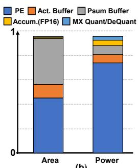

---

**在整体架构中的角色定位**

- **补全全链路低精度推理**：HBQ 的核心叙事是 “quantize all W/A/KV/Psum”。psum 量化是继 weight、activation、KV cache 之后最后一块低精度化拼图，使整个 GEMM 生命周期（乘法、块内累加、跨块累加、中间存储）均脱离 FP16/FP32 存储依赖。
- **间接支撑 end-to-end 统一 datapath**：
  - KV cache 以 4-bit 权重格式存储并复用 weight datapath，attention（QKᵀ、SV）与 projection layer 共享同一套硬件；
  - psum 压缩则保证了在该统一 datapath 上跑大 tile 时 buffer 不成为瓶颈。
- **能耗结构中的杠杆作用**：
  - 在 iso-throughput 系统对比（Fig. 16）中，HBQ-E 几何平均能耗 2.15 J，显著低于 NVFP4 (3.42 J) 与 MXFP (3.69 J)；
  - 尽管 HBQ 采用 5-bit activation 使 EMA 位宽略高于 4-bit 方案，但 **psum 量化带来的 tile 扩大使 DRAM energy 反而全场最低**，实现了“以计算侧微增换存储侧大降”的净收益。
- **部署建议层面的影响**：该技术对 **decode-intensive / KV-heavy 场景**（如长链推理，Table XII 中 512 输入 + 8K 输出 token 的 case study）尤其关键——此时能耗由 KV cache 与中间结果的 DRAM 访问主导，任何 buffer 效率提升都被放大为可观的系统级节能与加速（HBQ-A 相对 MXFP 获得 1.76× speedup 与 0.48× 能耗）。

---

**技术本质总结**

- **一句话概括**：将 Microscaling 思想从神经网络 **operand**（W/A/KV）延伸到 **intermediate computation state**（psum），利用“高精度计算、低精度驻留”的解耦策略，在零面积、零精度代价下将 psum buffer 有效容量翻倍，切断 tiling 受限→数据重载→EMA 能耗攀升的因果链，最终贡献了 HBQ 系统总能耗 16.4% 的削减。
- **可迁移的设计 insight**：中间结果（partial sum / inter-block accumulation）在低精度量化体系中常被忽视，但其存储位宽是 WS 类数据流加速器中 buffer-bound 问题的根源；block size 与计算阵列规模（PE 数）对齐，是实现零开销量化映射的实用技巧。

### 4. 28nm HBQ系统脉动阵列加速器与端到端低精度推理

**总体定位与设计动机**

- HBQ 加速器是论文的硬件落地环节，其目标是把 **算法层的 Hierarchical Block Quantization（HBQ）** 与 **硬件层的脉动阵列（Systolic Array）** 联合设计，实现量化 **Weight / Activation / KV Cache / Partial Sum** 四类数据的端到端低精度推理。
- 与 WoQ（如 AxCore）需要保留 FP16 attention datapath 不同，HBQ 将 **KV cache 量化到 4-bit 并作为 weight 数据处理**，使 projection 层（GEMM）与 attention 计算（$QK^T$、$SV$）共享同一低精度数据通路，实现 **Unified HW for end-to-end inference**。
- 设计采用 **HBQ-E 配置（W4A5，B=128 / µB=32）** 作为原型实现，兼顾面积效率与精度。

---

**加速器整体架构**

 *Fig. 12. Proposed HBQ accelerator. Each PE implements the HBQ MAC operation shown in Fig. 9(b) using the W4A5 HBQ-E configuration.*

- 核心规格（TSMC 28nm，Place-and-Routed 实现）：

| 参数 | 数值 |
| --- | --- |
| 工艺 / 频率 | TSMC 28nm / 500 MHz |
| 计算单元 | 32 PEs × 128 MAC = **4,096 MACs/cycle** |
| On-chip Buffer | Input 41.5 kB + Psum 132 kB（共 174 kB） |
| Dataflow | **Weight-Stationary (WS)** |
| 实现流程 | SystemVerilog RTL → Synopsys DC 综合 → Cadence Innovus 布局布线 |
| 功耗分析 | Synopsys PrimeTime + SDF 时序 + Llama3-8B/WikiText-2 真实开关活动标注 |
| SRAM | Arm SRAM Compiler 同工艺生成，保证 buffer 面积/功耗/能耗建模准确 |

- 每个 PE 内部实现 HBQ 特有的 MAC 操作（见下文），权重常驻 PE 内部以 **最小化数据搬运与动态功耗**。
- 假设系统侧存在一个辅助 **SIMD 模块** 处理非线性算子（normalization、softmax、RoPE），其输出在线量化后送入 HBQ 加速器。

---

**HBQ MAC 运算与两级反量化**

 *(b) HBQ MAC operation*

- 相比于单级 BQ PE（block 内 B-to-1 定点加法树 → L1 反量化 → 跨 block FP 累加），HBQ PE 的流水流程为：
  - **乘法级**：128 组 activation/weight 低精度乘法（W4/E2M1 × A5/E2M4），若输入为 FP 则经 FP2FX 转为定点。
  - **Micro-block 内归约**：µB-to-1 定点加法树（HBQ-E 中 µB=32），块内归约**无损**。
  - **L2 反量化**：使用 2-bit SIG 编码（$c_a$、$c_w$）及 weight 侧 1-bit 方案选择信号 $k$，按 $\alpha = 1 + c/2^x$ 恢复微块缩放。
  - **L1 反量化**：与 BQ 相同的 FP8-scale（ue5m3）乘法，完成 block 级反量化。
  - **跨 block FP 累加**：形成 channel 级输出。
- 关键设计点：**2-bit L2 scale 使反量化前的数值保持有限动态范围**，因此 L1 反量化之前的全部运算均在 **定点数据通路** 上执行，最大化硬件效率；这也是 SIG 相比 PoT/INT 的核心硬件优势（L2 scale 仅为 1–4 的小整数范围）。
- MAC 延迟为 **3 cycles**（乘法 / L2 反量化 / L1 反量化+累加），相比 BQ 的 2-cycle 设计在 ~500 MHz 下并不吃亏，因为该频段 critical path 由 FP accumulation 主导（Fig. 17 分析）。

---

**Weight-Stationary Dataflow 与分块策略**

- Tiling 参数：token tile $T_k = 512$，output tile $T_o = 128$。
- 数据复用机制：
  - 权重预加载至 32 个 PE 后常驻；每 cycle 向全部 N=32 个 PE **广播** 一个 B=128 的 activation block。
  - Input buffer 容纳 $B \times T_k$ 个 activation，实现跨 $T_k$ 个 token 的 **权重复用**。
  - Psum buffer 容纳 $T_o \times T_k$ 个 partial sum，沿 reduction 维 M 全程持有，实现跨 $T_o$ 输出通道的 **activation 复用**。
- Attention 映射：$QK^T$ 与 $SV$ 中的 **K/V cache 按 weight 数据处理（4-bit）**，复用同一套 WS dataflow 与 HBQ MAC 通路。

---

**Partial Sum MXINT8 量化**

- 动机：WS dataflow 下 psum buffer 容量直接限制 $T_o$、$T_k$，若 psum 以 FP16/FP32 存储，buffer 能容纳的 psum 数量有限 → tile 数增多 → activation/weight 重载频繁 → **EMA 能耗上升**。
- 方案：
  - 以 **block size 32**（与 PE 数对齐）将 32 个 FP16 psum 压缩为 **32 个 MXINT8 psum** 写回 buffer，存储需求**减半**。
  - 读出路径：每 cycle 读取 32 个 MXINT8 psum → 反量化为 FP16 → 与 PE 产出的 32 个 block 级 psum 经 FP16 加法器合并 → 再量化回 MXINT8 写入。
- 精度保障机制：
  - 块内 128 个乘积的归约在 PE 内以定点**无损**完成；
  - 有损步骤仅发生在 FP16 累加 + MXINT8 量化处，且沿 M 维**每 M/B 步才发生一次**，数值误差传播被严格限制。
  - 自定义 CUDA kernel 验证结果（Llama3-8B WikiText-2 PPL）：

| Accumulation Kernel | FP16 | NVFP4 | HBQ-E |
| --- | --- | --- | --- |
| Baseline (FP32) | 6.14 | 6.88 | 6.68 |
| + Switch to FP16 | 6.14 (+0) | 6.89 (+0.1) | 6.69 (+0.01) |
| + MXINT8 Quantization | 6.15 (+0.01) | 6.89 (+0) | 6.69 (+0) |

- 收益：psum 存储翻倍 → 单个 GEMM 所需 tile 数**减半** → EMA 能耗降低。消融实验（Table XIII）显示 psum 量化使系统总能耗再降 **16.4%**（3.72 J → 3.11 J），且面积零开销、精度损失仅 +0.01 PPL。

---

**KV Cache 量化与端到端低精度推理**

- 量化对象：
  - KV cache：**4-bit**（HBQ-E 为 4.13 有效位宽，含 scaling factor），格式与 weight 一致，共享 datapath；
  - Q tensor（$QK^T$ 输入）与 S tensor（softmax 输出，$SV$ 输入）：量化至 4/5-bit；
  - 量化在 **RoPE 之后** 执行，模拟真实部署场景。
- 精度结果（WikiText-2 PPL↓，有效位宽含 scaling factor）：

| Methods | W/A/KV | Llama2-7B | Llama3.1-8B | Llama3.2-3B |
| --- | --- | --- | --- | --- |
| MXFP W4A4 | 4.25/4.25/4.25 | 8.28 | 11.39 | 17.82 |
| NVFP W4A4 | 4.5/4.5/4.5 | 6.08 | 7.47 | 9.59 |
| NVFP W4A8 | 4.5/8.5/4.5 | 5.81 | 6.81 | 8.66 |
| HBQ-E | 4.13/5.13/4.13 | 6.02 | 7.16 | 9.12 |
| HBQ-A | 4.31/5.31/4.31 | **5.84** | **6.80** | **8.63** |

- **HBQ-A 以 W4A5 设置达到 NVFP W4A8 的精度水平**，即 activation 位宽减半仍保持可比 PPL。
- 在 reasoning 任务（GSM8K / HumanEval / MMLU，含 KV 量化）中，HBQ-E 平均 57.9、HBQ-A 达 60.7，而 MXFP W4A4 崩溃至 27.5（-38.4%），证明 HBQ 在端到端量化下精度稳定性显著优于现有 BQ。
- 对比 KIVI、KVQuant 等亚 4-bit KV 方法：它们依赖 pre-RoPE 量化、per-channel 缩放、非均匀数据类型等复杂技术，**增加 ASIC 设计复杂度且无法与 projection 层共享 datapath**，故不采用。

---

**在线量化开销**

- Quantizer 采用 **3-stage 流水线**（L1 scale → L1 quant → L2 quant），完全隐藏延迟：

| 方案 | Quantizer 面积 (µm²) | Latency (cycle) | 吞吐 | 加速器面积 | 开销占比 |
| --- | --- | --- | --- | --- | --- |
| NVFP4 | 22,001 | 2 | 128 act/cycle | 704,482 | 3.0% |
| HBQ | 26,024 | 3 | 128 act/cycle | 623,164 | 4.0% |

- 由于 L2 SIG 缩放因子被限制在 1–4 的小整数范围，L2 量化级的**附加逻辑开销极小**；128 act/cycle 的吞吐足以匹配 4,096-MAC 阵列的 GEMM 消耗速率。

---

**物理实现结果**

- 完整 Place-and-Routed 版图与面积/功耗 breakdown 显示：
  - **Psum 量化模块引入的面积与功耗开销可忽略**；
  - 面积主要由 MAC 阵列与 SRAM buffer 构成，HBQ-E 的 area per MAC 仅 **91 µm²**（Table IX），低于 NVFP4 的 93 µm² 和 AxCore WoQ 的 200 µm²，显著低于 FP16 baseline。
- 频率维度分析（Fig. 17）：在 100 µm² MAC 面积预算下，HBQ 相比 iso-PPL 的 MXFP/NVFP 可达 **~1.8× 更高频率**，且在各频点下 TOPS/W 与 TOPS/mm² 均一致占优——大 block 摊销了高精度运算，使额外流水级不构成 critical path 瓶颈。

---

**系统级评估：能耗与加速比**

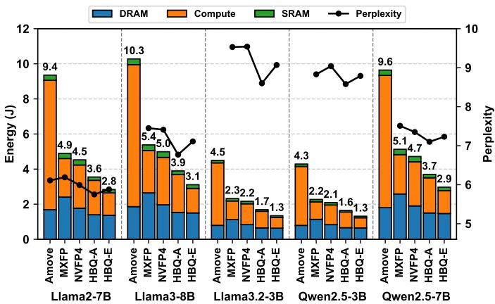

- 评估设置：context length 2,048，所有 GEMM（含 attention head）全部量化；基线加速器配置为**相同算力、相同 buffer、相同累加单元**以保证公平；能耗模型涵盖 PrimeTime 计算能耗 + SRAM compiler 能耗/access + DRAM（4 pJ/bit，按有效位宽计）。
- Iso-throughput 能耗结果（几何均值，含 KV 量化）：

| 方案 | 系统能耗 (J) |
| --- | --- |
| Amove | 7.07 |
| MXFP (W4A8) | 3.69 |
| NVFP4 | 3.42 |
| **HBQ-E** | **2.15** |

- 尽管 HBQ 使用 5-bit activation 略增 EMA 开销，但 **psum 量化带来的更大 tiling 显著降低 DRAM 能耗**，使其在所有模型上取得最低 DRAM 能耗；整体实现 **1.6–3.3× 系统能耗降低**。
- Iso-area 加速比：HBQ-E 在各模型与序列长度下取得 **约 1.5–3× speedup**；随序列长度增长，4-bit KV cache 的优势进一步放大（KV 体积更小 → memory-bound 延迟降低）。
- 长生成 reasoning 场景（DeepSeek-R1-Distill-Llama-8B，512 输入 / 8K 输出 / batch 64）：
  - HBQ-A 以 87 µm²/MAC 匹配 MXFP（101 µm²）与 NVFP（130 µm²）的精度（GSM8k 82.0 / MATH500 71.8）；
  - 能耗仅为 MXFP 的 **0.50×**，加速比 **1.62×**；短 prompt-长生成场景下能耗由 KV cache DRAM 访问主导，HBQ 用一半 KV 容量匹配 MXFP 精度，优势尤为明显。

---

**输入输出关系与在整体工作中的位置**

- 输入侧：
  - Weight（离线量化，FP4 + SIG₂&₃ 混合选择，含 1-bit 方案选择器 $k$）；
  - Activation（SIMD 模块输出经在线 3-stage quantizer 量化，FP5 + SIG₁）；
  - KV cache（4-bit，post-RoPE 量化，运行时作为 weight 流入阵列）。
- 输出侧：
  - Channel 级 FP16 GEMM 结果（经两级反量化与 FP 累加）；
  - Psum 以 MXINT8 形式在 on-chip buffer 中流转，直至 reduction 完成。
- 在整体研究中的角色：
  - 该加速器是 **DSE 结论（FP8-scale、2-bit exponent、A5、大 block）→ 算法创新（SIG 两级量化）→ 电路实现（MXINT8 psum、WS dataflow）** 的完整闭环验证；
  - 它证明了 HBQ 可在单一硬件流水线上完成 projection 与 attention 的端到端低精度推理，兑现 Table I 中 “quantize all W/A/KV/Psum + unified HW” 的目标；
  - 最终量化成绩：**2.3×/4.6× 的 PE 级 area/energy 效率提升**（对比 SoTA WoQ AxCore，同精度），配合 1.6–3.3× 系统能耗降低与 1.5–3× 加速比（对比既有 BQ），确立新的 accuracy–efficiency Pareto frontier。

---

## 4. 实验方法与实验结果

---

**一、实验设置分析**

**模型与基准**

- 覆盖模型：**Llama-2-7B / Llama-3-8B / Llama-3.1-70B / Llama-3.2-3B**、**Qwen2.5-3B/7B**、**Mixtral-8x7B (MoE)**，并额外引入 **DeepSeek-R1-Distill-Llama-8B** 做长生成推理 case study。模型家族与规模跨度较大，验证了方法的泛化性，且刻意包含了 Llama3 系列这类**公认难以量化**的模型。
- 评测指标分层设计合理：
  - **Perplexity (WikiText-2)**：主指标，衡量语言建模质量；
  - **Zero-shot 判别任务**：Winogrande、PIQA；
  - **推理链任务**：GSM8K (8-shot CoT)、MMLU (5-shot)、HumanEval，专门针对低比特量化下急剧退化的 reasoning 场景 [47]。

**硬件评估环境**

- 工艺与流程：**TSMC 28nm**、500 MHz 综合目标，Synopsys Design Compiler 综合 + Cadence Innovus 布局布线，SRAM 使用同工艺 Arm memory compiler 生成，保证 buffer 面积/功耗建模准确。
- 功耗测量采用 **PrimeTime + SDF 反标 + Llama3-8B WikiText-2 真实数据 switching activity**，动态功耗估计贴近实际推理行为，而非仅静态/无负载功耗。
- 量化开销单独建模：online quantizer（3-stage pipeline）在 4096-MAC 加速器上仅占 **3.0%/4.0% (NVFP4/HBQ) 面积**，激活量化吞吐 128/cycle 即可匹配 GEMM 吞吐。

**Baseline 选择逻辑**

- **WoQ**：以 **AWQ**（精度）+ **AxCore**（硬件，mixed-precision 乘法优化 + pre-alignment FP adder）为最强组合。
- **BQ**：MXFP(+)、NVFP4、Amove、VSQ、MicroExponent 用统一 PE 基线自研 RTL 实现（保证微架构公平）；MANT 直接引用其论文 28nm 综合结果（W4A8，因不支持 W4A4）；MicroScopiQ 因 PE 含激进的 bit-truncation 且未验证精度影响而被排除效率对比。
- 公平性控制点：
  - 所有 baseline 加速器配置**相同算力、buffer、累加单元**；
  - MXFP/NVFP 在效率对比中提升激活至 **W4A8 以对齐精度**；
  - **Iso-throughput / iso-area / iso-accuracy** 三种对齐方式分别用于能量、加速比、长生成 case study。

---

**二、结果数据分析**

**核心量化精度 (Table IX, 无 KV 量化)**

| 方法 | W/A | Llama3-8B PPL | Llama2-7B PPL | Area/MAC (µm²) |
|---|---|---|---|---|
| FP16 Baseline | 16/16 | 6.14 | 5.47 | — |
| AWQ (WoQ) | 4.13/16 | 6.53 | 5.60 | 200 |
| NVFP4 | 4.5/4.5 | 6.88 | 5.75 | 93 |
| MicroExponent | 4/4 | 9.45 | 7.09 | 64 |
| **HBQ-E** | 4.13/5.13 | **7.03** | 5.71 | **91** |
| **HBQ-A** | 4.31/5.31 | **6.68** | 5.64 | **87** |

- 关键结论一：**HBQ-A 用 W4A5 达到 AWQ (W4A16) 同级 PPL**（6.68 vs 6.53，Llama2 上 5.64 vs 5.60 几乎持平），是论文最核心的 claim——“首个量化 W/A 仍达 WoQ 精度的方案”。
- 关键结论二：面积效率反超。HBQ-A 的 87 µm²/MAC **低于 NVFP4 的 93 µm²**，同时 PPL 更优（6.68 vs 6.88），说明大 block (B=128) 摊销 + 2-bit SIG 的架构在 Pareto 前沿上同时压制精度与面积。
- MicroExponent 面积最小 (64 µm²) 但 PPL 爆炸（9.45），证明其 B=16/µB=2 的过细二级 scaling 带来 **+1 bit EBW 开销**、有效元素精度退化至 INT3，不可用于现代 LLM。
- 跨模型一致性：HBQ-A 在 Qwen2.5-7B (7.08)、Mixtral-8x7B (4.03) 上均优于 NVFP4 (7.30/4.18)，未出现 VSQ 那种跨模型不稳定现象。

**KV Cache 量化与端到端推理 (Table X / Table XI)**

| 方法 | W/A/KV | Llama2-7B | Llama3.1-8B | Llama3.2-3B |
|---|---|---|---|---|
| MXFP W4A4 | 4.25/4.25/4.25 | 8.28 | 11.39 | 17.82 |
| NVFP W4A8 | 4.5/8.5/4.5 | 5.81 | 6.81 | 8.66 |
| **HBQ-A** | 4.31/5.31/4.31 | **5.84** | **6.80** | **8.63** |

- **HBQ-A 在 W4A5 下 PPL 与 NVFP W4A8 持平或更优**，激活少 3 bit 意味着更低的 MAC 面积与更高的有效算力。
- Reasoning 任务 (Table XI) 揭示了量化鲁棒性的分层：
  - MXFP W4A4 全量化后平均暴跌 **-38.4%**（GSM8k 从 86.2 跌至 35.0），说明 4-bit PoT scaling 不可用于生产级端到端推理；
  - HBQ-E (4/5/4) 平均 57.9%，HBQ-A (4/5/4) 平均 **60.7%**，不仅超过 NVFP W4A8 (59.2%)，且 KV 仅 4-bit（NVFP 为 8-bit 激活 + 4.5-bit KV）；
  - HBQ-E 在 Llama3.2-3B 上比 HBQ-A 掉约 3%（63.4 vs 70.7, GSM8k），印证 **µB=32 vs 8 的细粒度差异在 KV-outlier 敏感的 decode 场景被放大**，作者据此给出部署建议：prefill 用 HBQ-E，decode/reasoning 用 HBQ-A——这是消融直接指导系统设计的范例。

**系统能量与加速比 (Fig 16 / Fig 18)**

- Iso-throughput、context 2048、全 GEMM（含 attention）量化条件下的几何平均能量：
  - HBQ-E：**2.15 J** | NVFP4：3.42 J | MXFP(W4A8)：3.69 J | Amove：7.07 J
  - 系统级节能 **1.6–3.3×**。
- 能量拆解显示胜负手在于 **DRAM (EMA) 能量**：虽然 HBQ 5-bit 激活略增 EMA 开销，但 **MXINT8 partial-sum 量化使 psum buffer 容量翻倍 → tile 数减半 → 权重/激活重载减少**，DRAM 能量全场最低。
- Iso-area speedup：通过给每种方法调激活精度对齐 PPL，HBQ-E 达 **1.5–3× 加速**；序列越长（KV 占比越高）加速比越大，因 HBQ 能以 4-bit KV 维持精度，而对手必须抬精度。

**长生成 Reasoning Case Study (Table XII, DeepSeek-Distill-Llama-8B, 512 in / 8K out / batch 64)**

- Iso-accuracy 下 HBQ-A 对 MXFP/NVFP 分别有 **14%/33% 面积效率优势**、**1.62×/1.76× → 实际 speedup 1.62× (HBQ-A) / 1.76× (HBQ-E)**；
- 能量结构上短 prompt 长生成场景被 KV DRAM access 主导，HBQ 以一半 KV size 匹配 MXFP 精度，能耗仅为 MXFP 的 **0.50×**；MXFP 因需 8-bit KV (8.25) 在 memory-bound decode 阶段彻底劣势。

**频率与关键路径 (Fig 17)**

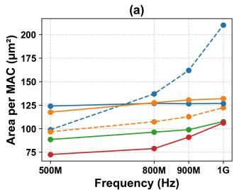

- 公平性处理到位：作者为 BQ 基线额外实现 **3-cycle pipeline 版本 (-PL)** 以匹配 HBQ 的 3-cycle 延迟；
- 500 MHz 附近关键路径由 **FP accumulation** 主导，BQ 加流水级收益有限；100 µm² MAC 面积预算下 HBQ 可跑到 **~1.8× 频率**；
- 全频段范围内 HBQ 的 **TOPS/W 与 TOPS/mm² 均占优**，排除了“HBQ 只赢在面积、输在时序”的可能。

---

**三、消融实验分析**

**DSE 层面消融：逐维度解耦**

- **Scaling 格式 (Table II)**：无符号 **ue5m3** FP8-scale 在三个 Llama 模型上 PPL (5.75/6.88/6.96) 全面优于 NVFP4 的 e4m3+per-tensor 补偿方案，且硬件上去掉 sign bit 简化 dequantizer——精度与面积双赢。
- **PoT vs FP8-scale (Fig 3)**：B=64/128 时 FP8-scale 的浮点乘 dequant 开销被摊销至与 PoT shift 相当，但精度显著更好；PoT-floor → PoT-round（round-to-nearest）零开销改进精度，两个细节都体现 DSE 的颗粒度。

- **元素格式**：固定块内分布后**指数预算冗余**，E2 (如 E2M5) 是甜点——紧凑定点 datapath 接近 INT8，尾数精度又优于 INT；该结论在 W4A8 (Fig 4b) 与 W4A5 (Fig 5) 两个精度点均成立。
- **激活精度 (Table III)**：跨 8 个模型/任务，**4b→5b 平均 +2.0%，5b→8b 仅 +0.7%**，5-bit 是边际收益拐点；小模型 (Llama-3.2-3B, Qwen2.5-3B) 与 Instruct 模型收益更大，说明小模型/指令模型对激活量化更敏感、更依赖 A5。
- **Block size (Fig 6, Table IV)**：B 从 16→128 面积/EBW 单调下降、PPL 单调上升，这是全文的核心张力，也是 HBQ 的立项依据；KV block size 消融 (PPL 7.38→7.79) 复现同一规律。

**SIG scaling 的核心消融 (Table VI, 最重要的算法消融)**

- 控制变量：W4A5、B=128/µB=32，L1/L2 scaling 方案在 {FP-8b, PoT, INT, SIG} 的 2×2/4×4 网格上扫描：
  - Llama3-8B：L1-only 6.95 → 最优组合 **SIG×SIG 6.68**（L2 贡献约 -0.26/-0.21）；
  - Mixtral-8x7B：4.24 → **4.11**；
  - SIG 在所有组合位置均严格最优，且 PoT→INT/SIG 的 L2 硬件代价仅 **+3%/+4%** 面积，性价比论证完整。
- **SIG_x 参数 x 的选择 (Fig 8c)**：激活/KV 用 **SIG₁**（粗粒度，恢复至 B16 误差级），权重用 **SIG₂&SIG₃ 离线混合选择**（SIG₃ 更细，误差降至 B16 以下），x≥4 无增益——与 Fig 8a 的误差分布分析（权重误差集中于高幅值区、激活误差来自小幅值/outlier）形成**机制级闭环**。

**微块 µB size (Fig 10, Table V, Table IX/XI)**

| 配置 | µB | Scale EBW 开销 | 定位 |
|---|---|---|---|
| MX/MicroExp | 2 | 1.0 | 精度过差 |
| VSQ | 16 | 0.5 | channel 级 L1 无法压动态范围 |
| **HBQ-E** | 32 | 0.125 | 吞吐优先，面积 +9% 换 Pareto |
| **HBQ-A** | 0.3125 | 0.3125 | 精度优先 |

- 作者论证 **L2 size 是比缩小 L1 block 更优的调节旋钮**：缩小 L1 会重新引入昂贵的 L1 dequant + FP accumulator 摊销损失，而 L2 dequant 全程定点、代价低——这是“层级位置”上的关键设计洞察。

**SIG₂/SIG₃ 选择比例 (Fig 19)**

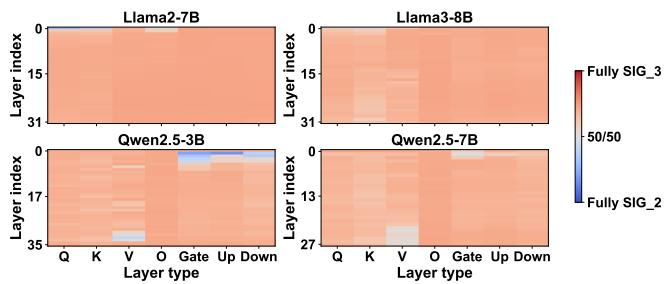

- 各层权重的 SIG₃（细粒度）占比普遍占主导，直接验证**权重分布集中于大幅值区**的统计假设，且 1-bit selector 离线存储、无需 calibration。

**Partial Sum MXINT8 消融 (Table VII)**

- 自定义 CUDA kernel 复现 FP16+MXINT8 累加行为：MXINT8 量化对 Llama3-8B PPL 影响 **+0.00~0.01**、GSM8k **±0**，精度损失可忽略；而它带来 **psum 存储减半 → tile 减半 → 系统能量 -16.4%** (Table XIII)，是零精度代价的纯工程收益。
- 机制解释：块内 B 个乘积的 reduction 在 PE 内定点**无损完成**，有损步骤仅在每 M/B 步发生一次，误差传播被结构性抑制。

**渐进式优化消融 (Table XIII, 最有说服力的总结性消融)**

| 渐进步骤 | PPL | Area/MAC (µm²) | 系统能量 |
|---|---|---|---|
| NVFP4 (W4A4B16) | 6.88 | 93.0 | 4.99 J |
| + 5-bit act | 6.64 (-0.24) | 101.7 (+9.4%) | 5.29 (+6.0%) |
| + B=128 (DSE) | 6.95 (+0.31) | **66.3 (-34.8%)** | 3.36 (-36.5%) |
| + L2 SIG scaling | 6.68 (-0.27) | 72.4 (+9.1%) | 3.72 (+10.7%) |
| + MXINT8 Psum | 6.69 (+0.01) | 72.4 (+0%) | **3.11 (-16.4%)** |

- 每一步优化的 **精度-硬件代价被精确量化**，清晰展示设计逻辑链：B=128 换取 34.8% 面积但损 0.31 PPL → SIG 用 9.1% 面积把 0.27 PPL 买回来 → Psum 量化再砍 16.4% 能量且几乎免费。终态相对 NVFP4：**PPL -0.19、面积 -22%、能量 -38%**，三项同时改善。

---

**四、总体评价**

**实验设计优点**

- **消融链条完整**：DSE 逐维度（scale/格式/精度/block size）→ SIG 参数与方案网格 → µB size → Psum 量化 → 渐进式归因，每项 claim 都有对应控制变量实验支撑；
- **公平性意识强**：baseline 统一 RTL 实现、-PL 流水线匹配、iso-accuracy/area/throughput 三种对齐方式、Amove 仅计 PE 成本并明示、MicroScopiQ/MANT 排除理由透明；
- **评测覆盖部署全貌**：从 PPL 到 CoT reasoning、从 PE 级面积到含 DRAM 4pJ/bit 的系统能量、从 prefill 到 8K 长生成 decode，评估维度显著超出一般 BQ 论文。

**可商榷之处**

- **Table IX 中 HBQ-E 在 Qwen2.5-3B PPL 12.1 vs NVFP4 8.92**，明显异常点未单独讨论（可能因 µB=32 在该小模型上的 outlier 敏感性），HBQ-E 的跨模型稳定性弱于 HBQ-A；
- **WoQ 精度对比仅 AWQ**，未纳入 QuaRot/SpinQuant 的无 GPTQ 或 Hadamard-rotation 方案的完整精度-开销对比（仅在 Related Works 给 W4A4 PPL 数字）；
- **累加截断的 baseline 设计选择**（保留全精度 adder tree）使 BQ baseline 面积偏保守，对 HBQ 有利，但作者已声明这是为保持 DSE 干净基线，并在 MicroScopiQ 讨论中自我披露了该风险；
- 长生成 case study 假设 512/8K/batch 64，**未报告实际 latency 绝对值**，speedup 数据依赖 area-efficiency 推算而非实测端到端时间。

**结论强度**

数据整体支撑论文三大核心 claim：**W4A5 达 WoQ 级精度**（Table IX/X）、**PE 级 2.3×/4.6× 面积/能效提升**（Fig 14 vs AxCore）、**系统级 1.6–3.3× 节能与 1.5–3× 加速**（Fig 16/18/Table XII）。其中 progressive ablation (Table XIII) 是全文论证最严密的部分，将“层级量化 + 显著数 scaling + psum 量化”的复合贡献分解为可审计的单步收益。

---

