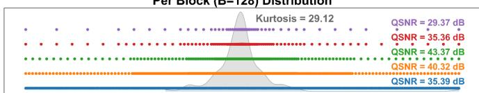
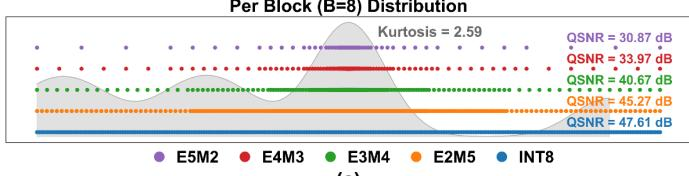
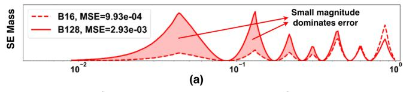
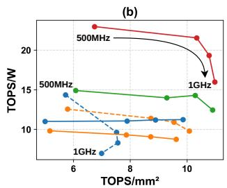
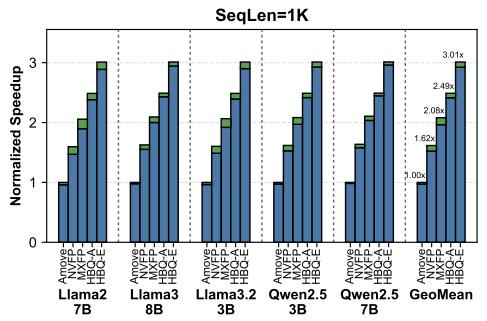
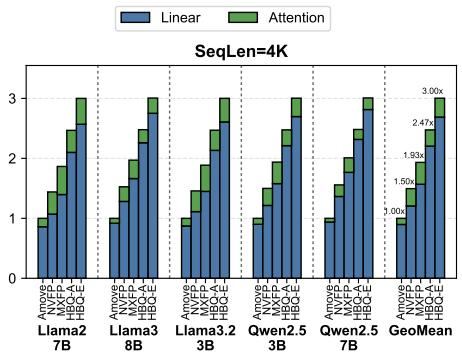
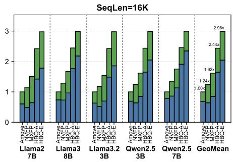

# HBQ: Hierarchical Scaling Block Quantization with Hardware-Efficiency-Aware Design for Accurate LLM Inference 原文翻译

# HBQ：面向硬件高效性设计的分层缩放块量化，用于精准的大语言模型推理

Chun-Ting Chen Cornell University New York, NY, USA cc2793@cornell.edu

Dongmin Han\* Cornell University New York, NY, USA dh783@cornell.edu

Amit Agarwal   
Intel Corporation   
Hillsboro, OR, USA   
amit1.agarwal@intel.com

Hangyeol Mun Cornell University New York, NY, USA hm632@cornell.edu

Mark Anders   
Intel Corporation   
Hillsboro, OR, USA   
mark.a.anders@intel.com

Jake Hyun Cornell University New York, NY, USA jh2978@cornell.edu

Mohamed Abdelfattah Cornell University New York, NY, USA mohamed@cornell.edu

Arnab Raha   
Intel Corporation   
Santa Clara, CA, USA   
arnab.raha@intel.com

Jae-sun Seo Cornell University New York, NY, USA js3528@cornell.edu

摘要——块量化（Block Quantization, BQ）已成为高效部署大语言模型（LLM）的一种有前景的方法，它使低精度计算成为可能，同时将精度退化控制在一定范围内。与仅权重量化（scalar weight-only quantization, WoQ）相比，BQ 同时对权重和激活值进行量化，可提供显著更高的硬件效率，并能在统一数据通路上实现端到端推理，但其设计空间——涵盖位宽、块大小、缩放方式与数值格式——在以往工作中仍未得到充分探索。

我们通过设计空间探索（DSE）提供了大量硬件/基准测试结果。特别地，我们发现增大块大小对于提升硬件效率至关重要，因为它可以摊销反量化与累加的开销，但这会显著降低精度。这一权衡从根本上限制了传统 BQ 方法。

基于这一洞察，我们提出了分层块量化（Hierarchical Block Quantization, HBQ）。与以往采用相对较小块大小和传统二的幂（Power-of-Two, PoT）或基于整数缩放的分层量化方法 [1], [2] 不同，HBQ 使用大块以最大化效率，并引入了一种新颖的低开销有效数字（significand, SIG）缩放用于第二级量化。通过更有效地分配量化等级，并考虑到激活值与权重分布的不同特性，SIG 缩放相比以往的 PoT 和 INT 方案，能够更有效地补偿大块带来的额外误差。所提出的 HBQ-A（accurate，精准）配置在仅使用 W4A5 设置的情况下实现了 W4A16 级别的精度，同时所需的硅面积小于 NVFP4。HBQ-E（efficient，高效）进一步将硬件成本降低 17%，同时保持比所有现有 BQ 方法更高的精度。

我们实现了一个 28nm ASIC 加速器，将 HBQ 应用于权重、激活值和 KV cache，并集成了新颖的部分和（partial sum）BQ 方案以进一步降低 EMA 能耗。与最先进的 WoQ 相比，HBQ 在相同精度水平下实现了 2.3×/4.6× 更高的面积/能效；与以往 BQ 方法相比，实现了 1.6–3.3× 的系统能耗降低和 1.5–3.0× 的加速，同时提供最佳精度。

Index Terms—量化，硬件加速器，LLM 推理

<table><tr><td colspan="6">表 I HBQ 与主流量化方法的对比。HBQ 通过量化所有 W/A/KV/PSUM 实现低精度推理。</td></tr><tr><td colspan="3">在实现 WoQ 级别精度的同时支持高效的端到端推理。</td></tr><tr><td></td><td>Baseline</td><td>WoQ</td><td>BQ</td><td>HBQ</td></tr><tr><td>示例</td><td>FP16</td><td>AWQ [3]</td><td>NVFP4 [4]</td><td>本工作</td></tr><tr><td>归一化面积</td><td>1</td><td>0.16X</td><td>0.07√</td><td>0.06√</td></tr><tr><td>Llama3-8B PPL*</td><td>6.14</td><td>6.55√</td><td>6.88 X</td><td>6.52√</td></tr><tr><td>低精度</td><td>否</td><td>WX</td><td>W/A/KV</td><td>W/A/KV/Psum √</td></tr><tr><td>用于端到端推理的统一硬件</td><td>否</td><td>否 X</td><td>是 √</td><td>是 √</td></tr></table>

\*为保证公平比较，所示结果未包含 KV 量化

  
Fig. 1. WoQ、BQ 与 HBQ 的 LLM 推理精度-效率权衡。数值以相对形式展示；具体结果与评估细节见图 6 与第七节。

## I. 引言

大语言模型正在快速发展，推动了对云端与边缘平台上高效推理的强烈需求。量化已成为一种通过以更少位数表示权重和激活值来降低内存与计算成本的关键技术。在现有方法中，块量化作为面向低比特 LLM 推理的一种有效训练后方法，受到了广泛关注。

与逐张量或逐 Token 量化不同，BQ 将张量划分为共享同一缩放因子的块，从而缓解离群值问题并提升量化质量 [4]–[7]。代表性示例包括 Microscaling (MX) [7]，其对 32 个元素组成的块采用二的幂次缩放；以及 NVIDIA 的 NVFP4 [4]，其采用 FP8 缩放、块大小为 16。近期工作进一步探索了算法与协同设计层面的改进 [2], [6], [8]–[11]，凸显了 BQ 的巨大潜力。

表 I 总结了主流量化方案之间的差异。仅权重量化[3], [12]–[14] 面向内存受限的自回归推理，能实现高精度，但需要一条独立的用于 Attention 的全精度数据通路，因为 KV cache 仍未量化。即便采用 KV cache 量化技术 [15], [16]，也难以将投影层与 Attention 头统一到同一硬件上。相比之下，BQ 将权重、激活值和 KV cache 全部量化到低精度，从而在单一硬件流水线上实现端到端推理，尽管会带来一定精度损失。此外，BQ 主要采用低精度数据通路，天然比 WoQ 更具硬件效率。这一优势在高吞吐场景（例如数据中心的批量解码）中尤为显著，因为此时计算效率（TOPS/W、TOPS/mm2）占据主导地位。总而言之，相较于 WoQ，BQ 以适度的精度损失换取了部署效率的大幅提升。

然而，BQ 的性能对其设计选择高度敏感，包括位宽、数值格式、块大小和缩放方案。我们发现，即使是简单的配置——只要经过合理调优——也能优于现有的 BQ 方法（图 1），同时在困惑度和面积效率上均更优。这表明 BQ 当前的局限并非源于该范式本身，而是源于设计空间探索的不足。

这些观察促使我们开展一项全面的设计空间探索。先前的工作 [2] 考虑了位宽和格式等单一因素，但并未联合评估关键维度，也未纳入面积、能耗等硬件指标以及困惑度等端到端精度指标。因此，BQ 的精度–效率 Pareto 前沿仍不明确。

在本工作中，我们首先建立一个硬件基线（第 III 节），并开展系统的设计空间探索（第 IV 节），识别出一条持续优于现有 BQ 方法的新 Pareto 前沿。我们的分析揭示，块大小——在先前探索工作中 [1], [2] 常被当作固定的控制变量——实际上是一个决定精度–效率权衡的关键设计参数。增大块_size 可以通过在更多元素间分摊缩放因子存储与反量化开销来提升硬件效率，但也会增大块内动态范围，导致精度损失。因此，Microscaling 和 NVFP4 等先前方法采用相对较小的固定块大小以保持精度，但这一设计选择导致了次优的硬件效率。

基于这一洞见，我们提出了分层块量化（Hierarchical Block Quantization，HBQ）（第 V 节）。HBQ 采用更大的块大小，并通过带新型低开销尾数缩放（significand scaling，SIG）的两级量化方案来解决精度退化问题。通过考虑 BQ 中激活值与权重的异构误差分布，SIG 恢复了大块大小带来的精度损失。HBQ-A（accurate，高精度）配置在与 NVFP4 相当的面积效率下达到与 WoQ 方法相同的精度水平，而 HBQ-E（efficient，高效）配置则聚焦于极致的硬件效率，同时保持可接受的精度损失。在引入 KV cache 量化后，HBQ 仍能保持高精度，并支持在我们的加速器上进行端到端推理。总体而言，HBQ 以 BQ 的效率达到了 WoQ 的精度水平。

我们在 TSMC 28nm 完成布局布线的原型加速器中实现了 HBQ，并引入了一种新的部分和块量化技术以提升有效缓冲容量、减少外部存储访问（EMA）。总体而言，本文的主要贡献如下：

• 对 BQ 开展了全面的硬件–算法权衡分析与设计空间探索，涵盖精度、格式、缩放方法和块大小。识别出一条新的 BQ Pareto 前沿，其最优配置为：2 位指数的 FP 元素格式、FP8-scale 缩放格式以及大块大小（≥ 32）。

• 我们提出了分层块量化，采用尾数缩放在更大块大小下恢复精度损失。HBQ 在精度与硬件效率之间实现了超越现有 BQ 方法的最佳权衡。特别地，HBQ-A 达到与 WoQ 相同的精度水平，同时提供 2.3× 的硬件效率。

• 我们在 28nm CMOS 工艺下的权重驻留式脉动阵列加速器中对 HBQ 进行了原型验证。完成布局布线的设计包含 174kB 片上缓冲器和 4,096 个 MAC 计算单元，运行频率为 500 MHz。借助 KV cache 量化，我们实现了可接受精度损失的端到端低精度推理。

• 我们提出了一种部分和 BQ 技术，以极小的精度损失降低 EMA 能耗，进一步释放系统级效率增益。

## II. 背景

## A. 块量化

块量化将激活或权重张量沿输入通道维度划分为大小为 B 的连续块，每块内的所有元素共享一个公共缩放因子 $s _ { b }$。设 $B _ { b }$ 表示块 b 中元素的集合。给定元素 $\boldsymbol { x } \in \boldsymbol { B } _ { b }$ 和目标格式转换函数 $\mathcal { Q } _ { F } ( \cdot )$，量化按如下方式进行：

$$
\begin{array} { r } { q ^ { ( b ) } = \mathcal { Q } _ { F } \left( \frac { x } { s _ { b } } \right ) } \end{array}\tag{1}
$$

其中 ${ \boldsymbol q } ^ { ( b ) }$ 以元素格式 F（例如 INT4）存储，而 $s _ { b }$ 以更高精度的格式（例如 FP8）存储。原始值在反量化时重构为：

$$
{ \hat { x } } = s _ { b } \cdot q ^ { ( b ) }\tag{2}
$$

通过降低量化粒度，块量化归一化了每个块内的局部动态范围，相比于逐张量或逐通道方案降低了量化误差 [5], [6]，其代价是额外的块级缩放因子存储 [5], [6] 和反量化开销。

表 II
不同 FP8-SCALE 格式之间的比较。结果基于 WIKITEXT-2 上的 W4A4B16 配置。
<table><tr><td></td><td colspan="2">NVFP4 [4]</td><td>AMXFP1 [5]</td><td>本文方法</td></tr><tr><td>逐张量缩放 缩放格式</td><td>否 e4m3</td><td>是 e4m3</td><td>否 e5m2</td><td>否 ue5m3</td></tr><tr><td>Llama2-7B PPL Llama3-8B PPL</td><td>6.10</td><td>5.76</td><td>5.80</td><td>5.75</td></tr><tr><td rowspan="2">Llama3.1-8B PPL</td><td>11.89</td><td>6.87</td><td>6.97</td><td>6.88</td></tr><tr><td>9.69</td><td>6.94</td><td>7.03</td><td>6.96</td></tr></table>

1AMXFP 中的非对称缩放方案未用于此处结果。

## B. 缩放因子格式

在块量化中，缩放因子有两种典型的选择。

1) 二的幂次（PoT-scale，PoT 缩放）：Microscaling (MX) [7] 是一种在算法和硬件设计框架 [9]、[17]、[18] 中被广泛采用的量化格式。MX 最初由开放计算项目（Open Compute Project, OCP）提出，它定义了一种标准化的块量化格式，采用 $\mathrm { F P } 8 _ { u e 8 m 0 }$ 缩放因子，也被称为二的幂次（PoT）缩放。这种缩放方案通过在量化和反量化过程中用位移操作替代除法和乘法，从而将硬件开销降至最低。给定元素 $\boldsymbol { x } \in B _ { b }$ 以及元素格式中最大正常数的指数 $e _ { m a x }$，缩放因子 $s _ { b }$ 的推导如下：

$$
s _ { b } = 2 ^ { \left\lfloor \log _ { 2 } \left( \operatorname* { m a x } _ { x \in \mathcal { B } _ { b } } | x | \right) - e _ { \operatorname* { m a x } } \right\} rfloor\tag{3}
$$

原始 MX 使用向下取整（floor），这可能会截断块最大值并损害精度 [5]、[19]。我们转而采用就近舍入（round-to-nearest）[5]，该方法在不增加硬件开销的情况下持续提升精度。

2) 浮点（FP8-scale，FP8 缩放）：除 PoT-scale 之外，浮点缩放能提供更好的精度，例如 AMXFP [5] 使用 $\mathrm { F P } _ { e 5 m 2 }$，而 Amove [6]、NVFP [4] 使用 $\mathsf { F P } _ { e 4 m 3 }$ 。给定元素格式中可表示的最大值 $q _ { m a x }$ 以及缩放格式 $\mathrm { F P } _ { { e _ { x } } { m _ { y } } }$，$s _ { b }$ 的推导如下：

$$
s _ { b } = \mathcal { Q } _ { \mathrm { F P } e _ { x } m _ { y } } \left( \frac { \operatorname* { m a x } _ { x \in \mathcal { B } _ { b } } | x | } { q _ { \mathrm { m a x } } } \right)\tag{4}
$$

在 NVFP 中，高精度（通常为带 5 位指数的 FP16）的完整数值范围无法被其 $\mathsf { F P } _ { e 4 m 3 }$ 缩放完全覆盖。因此，NVFP4 中额外增加了一个逐张量（per-tensor）缩放因子来补偿其数值范围。

在本文中，为了简化反量化开销的评估，同时考虑到缩放因子不需要符号位这一事实，我们在 FP8-scale 格式中使用 $\mathrm { F P } _ { u e 5 m 3 }$ 。最近的一项工作 [20] 同样表明，使用 E5M3 能够获得更稳定的量化结果。我们在表 II 中的实验进一步证明，其性能与 NVFP4 缩放方案相当。

## III. 硬件基线设计

我们建立了 BQ 的基线处理单元（processing-element, PE）设计，它作为我们设计空间探索的基础。先前的工作 [2] 在块数据表示（block data representation, BDR）框架中采用 PoT-scale，但后续分析表明，这对于低精度 LLM 推理而言是一种次优的权衡。因此，我们构建了一个针对我们设定场景量身定制的基线架构（RTL 可在 [21] 获取）。

  
Fig. 2. 块大小为 B 的块量化处理单元（PE）基线设计。（FP2FX：浮点转定点转换器）

  
Fig. 3. 不同块大小（B）下 PoT-scale 与 FP8-scale 方案的比较。柱状图报告了归一化的单位 MAC 面积，折线图展示了对应的 Llama-3-8B 困惑度（↓），采用 FP W4A4 设定。（PoT-floor：原始 MX 实现；PoT-round：第 II-B1 节所述的舍入方案）

Fig. 2 展示了块大小为 B 的 PE，包含四个阶段：(1) 对激活值/权重对进行 B 次乘法，若输入为 FP，则将输出转换为整数格式；(2) 一个 B 转 1 的定点加法树，用于无损的块内累加；(3) 使用缩放因子进行反量化（例如 FP8 乘法或 PoT 位移）；(4) 跨块的浮点累加，以形成通道级输出。

该设计与先前的加速器实现 [22]–[24] 一致。虽然在加法树中进行位截断是可行的 [25]，但我们保留全精度，以维持一个干净的设计空间探索基线。

## IV. BQ 设计空间探索

在本节中，我们从缩放因子格式、元素格式、块大小和位宽等方面对 BQ 进行探索。模型精度主要使用 Llama3-8B [26] 在 WikiText-2 [27] 上的困惑度进行评估，并辅以 PIQA [28] 和 Winogrande [29] 上的零样本（zero-shot）结果作为补充。硬件成本使用基线 PE 设计进行评估，面积和能耗按单位 MAC 归一化。所有设计均在 TSMC 28nm CMOS 工艺下以 500 MHz 进行综合。功耗使用 Synopsys PrimeTime 测量，开关活动来自 Llama3-8B 在 WikiText-2 上的运行结果，以捕捉真实的动态行为。我们采用 SoTA 工作 Ax-Core [30] 作为 WoQ 硬件基线（实现细节见第 VII-A 节），并采用 AWQ [3] 作为困惑度基线。

## A. FP8-scale 与 PoT-scale

如第 II-B 节所述，FP8-scale 提供了比 PoT-scale 更高的量化质量。然而，PoT-scale 的优势在于极低的反量化开销，因为它仅对部分和进行简单的位移操作，而 FP-scale 则需要在点积之后进行一次浮点乘法。

面积 vs. 困惑度  
每块（B=8）分布  
 面积 vs. 困惑度  
每块（B=128）分布  
每 Token 分布
<table><tr><td rowspan=3 colspan=1></td><td rowspan=1 colspan=1>Kurtosis = 1786.00QSNR = 27.29 dBQSNR = 33.42 dB</td></tr><tr><td rowspan=1 colspan=1>QSNR = 37.49 dB</td></tr><tr><td rowspan=1 colspan=1>QSNR = 21.96 dB</td></tr><tr><td rowspan=1 colspan=1></td><td rowspan=1 colspan=1>QSNR = 16.24 dB</td></tr></table>

  
Fig. 4. 不同 FP8（E5M2 至 E2M5）与 INT8 在块大小（B）为 4、8、16、32、64 和 128 时的比较。 其中不同 8 位激活值格式的可表示 levels，灰色曲线为 Llama3-8B 数据分布。 不同格式之间的面积与 W4A8 困惑度权衡。

  
Fig. 5. W4A5 量化下不同块大小和激活值格式之间的面积–困惑度权衡。

为了分析这一权衡，我们在 Fig. 3 中对不同块大小下的两种缩放方案进行了比较。当块大小增大到 64 或 128 时，FP8-scale 的反量化开销会被摊销到更多的 MAC 操作上，从而获得与 PoT-scale 相当的效率。与此同时，与 PoT-scale 相比，FP8-scale 带来了显著更优的模型精度（困惑度）。鉴于这种持续更优的精度–效率权衡，除非另有说明，本文后续部分均默认采用 FP8-scale 作为缩放方案。

## B. 元素格式的选择

整数格式通常被认为比浮点格式更具硬件效率。然而，由于 BQ 的低位宽设置具有较窄的动态范围，数据通路（图 2）的大部分实际上以定点方式运行。因此，低位宽浮点格式可以实现相近的硬件效率，同时提供更好的动态范围控制。

TABLE III  
不同激活位宽下的精度提升。实验在 LLAMA3 (L3)、QWEN2.5 (Q2.5) 和 MIXTRAL-8X7B (M-8X7B) 模型上进行，块大小（block size）为 64。
<table><tr><td rowspan="2">任务</td><td rowspan="2">模型</td><td colspan="3">准确率 (%)</td><td rowspan="2">提升 (%) 5b→8b</td></tr><tr><td>W4A4</td><td>W4A5</td><td>W4A8 4b→5b</td></tr><tr><td rowspan="5">Avga 0-shot</td><td>L3-8B</td><td>74.3</td><td>75.3</td><td>76.5</td><td>1.0</td><td>1.2</td></tr><tr><td>L3.1-70B</td><td>80.8</td><td>81.3</td><td>81.7</td><td>0.5</td><td>0.4</td></tr><tr><td>L3.2-3B</td><td>70.8</td><td>72.0</td><td>72.5</td><td>1.1</td><td>0.5</td></tr><tr><td>Q2.5-3B</td><td>70.1</td><td>72.5</td><td>73.8</td><td>2.4</td><td>1.3</td></tr><tr><td>Q2.5-7B</td><td>74.5</td><td>75.9</td><td>76.1</td><td>1.4</td><td>0.2</td></tr><tr><td rowspan="2">MMLU</td><td>M-8x7B</td><td>77.3</td><td>79.2</td><td>79.8</td><td>1.9</td><td>0.6</td></tr><tr><td>L3-8B</td><td>59.5</td><td>62.1</td><td>62.8</td><td>2.6</td><td>0.7</td></tr><tr><td>5-shot</td><td> $\mathrm { L } 3 . 2 \mathrm { - } 3 \mathrm { B - } \mathrm { I } ^ { \mathrm { b } }$ </td><td>55.3</td><td>57.0</td><td>57.9</td><td>1.7</td><td>0.9</td></tr><tr><td>Gsm8k</td><td> $\overline { { \mathrm { L } 3 . 1 - 8 \mathrm { B } { - } \mathrm { I } ^ { \mathrm { b } } } }$ </td><td>78.5</td><td>81.5</td><td>81.8</td><td>3.0</td><td>0.3</td></tr><tr><td>8-shot</td><td> $\mathrm { L } 3 . 2 \mathrm { - } 3 \mathrm { B - } \mathrm { I } ^ { \mathrm { b } }$ </td><td>70.3</td><td>73.0</td><td>74.5</td><td>2.7</td><td>1.5</td></tr><tr><td colspan="2">平均</td><td>71.0</td><td>73.0</td><td>73.7</td><td>2.0</td><td>0.7</td></tr></table>

aWinogrande [29] 与 PIQA [28] 的平均得分 bInstruct 模型

另一方面，传统的 FP8 格式（E4M3、E5M2）[31] 是为具有宽动态范围的粗粒度量化而设计的。在按块量化（block-wise quantization）下，每个块内的分布变得窄得多且更平滑（图 4(a)），使得较大的指数位预算变得不必要且浪费。

我们在 W4A8 设置下评估了从 E5M2 到 INT8 的各种格式。如图 4(b) 所示，E2 格式（例如 E2M5）取得了更好的精度–效率折中。缩减的动态范围使得定点数据通路可以做到与 INT8 类似的紧凑程度，同时更高的尾数精度提升了量化质量。这一趋势在更低位宽的 W4A5 下同样成立，优于其他备选方案（图 5）。总体而言，2 位指数提供了最佳平衡，并在本文余下部分被采用。

## C. 块大小与激活精度

本节研究块大小与激活精度对效率–精度折中关系的影响。在使用 2 位指数的前提下，我们在从 16 到 128 的块大小范围内评估了从 FP4 到 FP8（E2M1–E2M5）的激活精度。我们将权重精度固定为 FP4 (E2M1)，因为权重精度在 LLM 工作负载中主导 EMA。

图 6 展示了 Llama3-8B 模型在 FP8-scale 下 BQ 的效率–精度折中。更大的块大小通过将缩放因子分摊（amortize）到更多元素上，降低了每个 MAC 的硬件成本和权重 EMA，同时只带来适中的精度退化。值得注意的是，块大小为 64 的 NVFP4 实现了与 MXFP4 相同的每 MAC 面积，却带来了显著更好的困惑度（7.25 对比 7.98）。

在不同的激活精度中，5 位 (A5) 始终提供最佳折中。将精度从 A4 提升到 A5 带来了显著的困惑度改进，而进一步提升到 A8 的收益则递减。这一趋势在不同基准测试、模型家族和模型规模上均成立（表 III），其中 W4A5 仅以一个额外位和极小的开销就在 W4A4 基础上提升了准确率，而更多的位（$\mathbf { A } 5 \ \ \mathbf { A } 8$）只带来有限的增益。图 7 通过 QSNR 分析进一步支持了这一观察。尽管单个 5 位数据在布局上是不对齐的（layout-misaligned），但将一个块内的所有激活打包后，总数据大小为 8 的倍数，因此数据仍可以被紧凑地存储。总体而言，借助灵活的激活精度与块大小，我们为 BQ 识别出了一条新的 Pareto 前沿，而现有方法（如 MXFP4 和 NVFP4）在该前沿上明显处于次优位置。

  
(a)

  
(b)

  
(c)

图 6. Llama3-8B 困惑度 (PPL↓) 与 在不同块大小和激活精度下的折中关系（权重格式固定为 FP4）。所有激活格式均使用 2 位指数。
  
图 7. 不同激活精度与块大小下的 QSNR 分析。

TABLE IV  
W/A 固定为 NVFP4 时的 KV 块大小折中。
<table><tr><td>KV Cache 块大小</td><td>8</td><td>16</td><td>32</td><td>64</td><td>128</td></tr><tr><td>Llama3-8B PPL</td><td>7.38</td><td>7.47</td><td>7.58</td><td>7.65</td><td>7.79</td></tr><tr><td>量化 MSE</td><td>0.012</td><td>0.016</td><td>0.022</td><td>0.029</td><td>0.040</td></tr></table>

## D. KV Cache 块大小

为了在统一的 BQ 加速器上实现端到端推理，我们使用与权重相同的格式量化 KV cache，使二者能够在注意力（例如 $Q K ^ { T } )$ 和投影层中共享同一数据通路。我们将 W/A 固定为 NVFP4，并研究 KV 的块大小对量化质量的影响（表 IV）。结果表明，更大的块大小会降低质量，这与上一节的观察以及先前 KV cache 量化工作 [15]、[32] 的结论一致。

## E. 设计空间探索的结论

我们以以下关键洞察总结对各种块量化方案的设计空间探索：

• FP8-scale 在精度–硬件折中方面取得了优于 PoT-scale (MX) 的 Pareto 前沿。

• 具有 2 位指数的浮点格式在精度与硬件成本之间提供了最佳平衡，优于 INT 格式和更高指数位数的 FP 格式。

• 5 位激活在量化质量与硬件效率之间提供了极佳的平衡。

• 更大的块大小（≥32）以模型精度退化为代价，带来更高的硬件效率。

总体而言，上述发现为高效的块量化确立了实用的设计准则。更重要的是，我们的 DSE 揭示了块量化中的一个根本性矛盾：

通过分摊反量化与累加的开销，更大的块大小可以显著提升硬件效率，但由于精度退化问题，先前的工作很少采用大块。因此，NVFP4 和 MX 等先前的设计采用了相对较小的块大小（例如 16 或 32），从而限制了从更大块中可获得的效率提升。

## V. 分层块量化

为了在保持模型质量的同时启用大块大小以提升效率，我们分析了增大块大小所引起的误差分布偏移，并提出了分层块量化，这是一种两级量化方案。HBQ 引入了一种新颖的有效数字缩放来应对激活与权重分布的异构特性，在保留大块效率优势的同时恢复精度。

## A. 误差分布分析

图 8(a) 展示了当块大小从 16 增加到 128 时，块归一化平方误差质量分布的偏移。对于权重，MSE 保持相对稳定，额外的误差集中在高幅值区域。相比之下，增大块大小会使激活误差增加近三倍，且主要来自小幅值元素，这表明离群值效应被放大且动态范围被扩展。我们观察到 KV cache 与其他激活呈现出相似的误差分布，因此将其合并分析。

这些观察表明，权重和激活需要不同的补救措施来缓解更大块尺寸下的精度损失。权重受益于高幅值区域更密集的量化，而激活则需要覆盖更宽的动态范围。

## B. 分层块量化（HBQ）

如前一节所讨论的，鉴于量化位数有限，低精度（如 FP4）在块大小增加到 128 时会产生较大误差。在本工作中，我们引入另一个量化层级。通过 2 级量化，我们可以有效地增加可表示的量化级别数。对于给定的 L1 块 $B _ { b }$ 及其关联的缩放因子 $s _ { b } ,$ 我们为每个微块 $\mathcal { U } _ { b , u } \subset B _ { b }$ 分配一个 L2 缩放因子 $\alpha _ { b , u }$。HBQ 中用于量化元素的有效缩放因子因此为：

Weight Error Distribution  
  
Activation/KV-Cache Error Distribution

(b)  
  
图 8. (a) 块大小从 16 增加到 128 时的误差分布偏移。(b) 使用 2-bit L2 缩放因子 α 的不同 L2 缩放方案下的量化级别，以及与 L1 $B { = } 1 2 8$ 组合时产生的误差分布（x 轴与 (a) 对齐）。(c) (b) 对应的 MSE 汇总。所提出的有效位（significand）缩放将误差恢复至 B16 水平或更低。

$$
\tilde { s } _ { b , u } = s _ { b } \cdot \alpha _ { b , u } .\tag{5}
$$

元素 $x \in \mathcal { U } _ { b , u }$ 的量化和反量化过程如下：

$$
q ^ { ( b , u ) } = \mathcal { Q } _ { F } \left( \frac { x } { \tilde { s } _ { b , u } } \right)\tag{6}
$$

$$
\hat { x } = q ^ { ( b , u ) } \cdot \alpha _ { b , u } \cdot s _ { b }\tag{7}
$$

其中 $\mathcal { Q } _ { F } ( \cdot )$ 表示针对给定目标格式的类型转换函数。

以 FP4 搭配 2-bit L2 缩放 α 为例，引入 L2 量化通过组合不同的 α 值，有效地将可表示级别数扩大了四倍。图 8(b) 展示了在大 L1 块尺寸（B=128）下不同 L2 缩放方案产生的量化级别，以及相应的误差分布（x 轴与图 8(a) 对齐以便直接比较）。

在 PoT [1] 和 INT [2] 等传统方案中观察到两个关键局限。首先，不同 α 之间的量化级别发生重叠，降低了有效精度。其次，这些方案将级别分配在过宽的动态范围上。采用 B=128 的 BQ 已经限制了块内动态范围——尤其是对权重而言——使得这种分配方式效率低下。这些观察促使我们设计一种更细粒度、更灵活的缩放方案，以更好地适应激活和权重的不同分布，从而恢复大块尺寸下的精度。

1) 有效位缩放 $( S I G _ { x } ) .$ 我们提出一种新颖的 L2 缩放方案，称为有效位缩放（SIG），以提供更细的粒度。SIG 引入参数 x 来定义缩放因子 α：

$$
\bar { \alpha _ { \mathrm { S I G } _ { x } } } ( c ) = 1 + \frac { c } { 2 ^ { x } } , \quad c \in 0 , 1 , \ldots , 2 ^ { n } - 1 , ; x \in \mathbb { N } .\tag{8}
$$

其中 n 表示 $\alpha$ 的位宽，c 是二进制编码。我们采用 $n = 2$ 以降低硬件和位宽开销。

通过调整参数 x，我们可以控制有效位缩放的粒度。图 8(c) 展示了在 L1 B128 块量化之上引入不同 L2 缩放方案的均方误差（MSE）。结果表明，$\mathrm { S I G } _ { 1 } \mathrm { \ ' } _ { \mathrm { s } }$ 的粒度是激活和 KV 分布的最佳选择，可将大块尺寸（B=128）带来的误差恢复至 B16 水平。对于分布更集中于大幅值的权重，$\mathrm { S I G _ { 3 } }$ 提供了最细的粒度，并进一步将误差降至 B16 水平以下。增加到 $\mathrm { S I G } _ { 4 }$ 或更高不会带来额外的精度收益。

2) 离线混合选择：由于权重量化是离线执行的，HBQ 会对每个 L1 块同时评估 $\mathrm { { S I G } _ { 2 } }$ 和 $\mathrm { S I G } _ { 3 }$，并选择权重量化 MSE 最小的方案，因此无需校准。每个 L1 块存储 1-bit 选择器（k），在反量化时用于选择要解码的方案。

3) 激活精度与块大小：鉴于第 IV-C 节中 W4A5 设置的优越权衡，我们采用该设置。为了最大化反量化成本的摊销并与现代模型的 head 维度对齐 [26], [33], [34]，我们将 L1 块大小设为 $B { = } 1 2 8$。我们在图 10 中展示了从 4 到 64 的不同微块 $( \mu B )$ 尺寸的权衡。为满足不同部署场景的多样化需求，我们提出两种方案：HBQ-E（高效）使用 $\mu B { = } 3 2$，在实现强精度–效率权衡的同时仅带来 <10% 的面积开销；HBQ-A（精确）采用 $\mu B { = } 8$，仅以 W4A5 精度即可匹配 WoQ（W4A16，AWQ [3]）的困惑度。我们还观察到，L2 块尺寸是比降低 L1 块尺寸更好的效率–精度权衡调节旋钮，因为降低 L1 块尺寸会削弱对 L1 反量化及后续 FP 累加器的摊销效果，而这两者的开销都远高于 L2 反量化。

4) HBQ MAC 运算：图 9(b) 展示了 MAC 运算和 HBQ 反量化过程。与 BQ 不同——BQ 在乘法之后使用 B-to-1 定点加法树对块内所有元素进行块内归约——HBQ 使用 µB-to-1 定点加法树进行微块内归约，随后进行 L2 反量化，使用其关联的 L2 缩放编码 $c _ { a } , c _ { w }$ 以及权重的 L2 方案选择 k。之后，通过与 BQ 中完全相同的 L1 反量化过程执行微块间归约。注意，由于我们将 L2 缩放 α 保持在 2-bit，反量化后的值保持在有限的动态范围内，使得 L1 反量化之前的所有运算都可以采用定点精度以最大化效率。所提出的 2-bit 有效位缩放方案有助于将引入 L2 量化的额外开销降至最低，同时有效提升量化质量。

  
(a) HBQ 量化（例如 FP4 + SIG2）

  
(b) HBQ MAC 运算

图 9. (a) HBQ 的量化过程，以 FP4 元素格式和 2-bit SIG2 L2 方案为例。(b) HBQ 的 MAC 运算。在图 2 的基线 PE 之上，引入了一个额外的 L2 反量化模块。  
  
图 10. 微块（µB）尺寸消融研究。

## C. 权衡：HBQ 与 BQ

图 11 将 HBQ 与传统 BQ 进行了比较。HBQ 建立了新的 Pareto 前沿，同时提升了精度和效率。从 W4A5B16 出发，将 block 大小增加到 B128 可使面积降低 1.6 倍。引入第二级量化层级对于 µB=32 的 HBQ-E 仅带来 9% 的开销，却同时实现了比现有方法（包括 NVFP4、VSQ [1] 和 MicroExponent [2]）更低的困惑度和更小的面积。HBQ-A 采用更小的 micro-block 大小（µB=8），其精度可与 WoQ 方法相匹敌，在仅需 66% 面积的情况下，其困惑度优于 W4A8B16。

## D. 相关的层级化方法

先前的工作 VSQ [1] 和 MicroExponent [2] 也采用了层级化量化方案（表 V）。然而，HBQ 的动机来自一个根本不同的观察：block 大小所引起的精度–效率权衡。通过我们的 DSE，我们发现 block 大小是决定硬件效率的主要因素，因为更大的 block 可以显著摊销反量化和累加的开销。相比之下，VSQ 和 MicroExponent 在其精度–效率权衡的设计探索中都始终将 block 大小固定为 B=16，错失了提升效率的一个关键维度。需要注意的是，VSQ 曾对 L2 向量大小（从 1 到 64）进行过小规模的探索，但纯粹是从 ResNet-50 上的精度角度出发，并未进行任何硬件效率分析。

  
Fig. 11. HBQ 的困惑度–面积权衡。方块表示从图 6 的设计空间探索中识别出的 BQ 设计点。MicroExponent 在 W4A4/5 下仅达到 9.4/7.8 的 PPL，超出了所显示的范围。

从精度角度来看，VSQ 采用 per-channel L1 缩放，无法限制第二级量化层级的动态范围，从而限制了层级化缩放的有效性。MicroExponent 采用 PoT 缩放，而我们的 DSE（第四节）表明它始终劣于 FP8 缩放。此外，这两种方法所使用的较小 block（16）和 micro-block（2）大小引入了大量缩放因子开销，增加了有效位宽（EBW）。因此，这两种方法甚至无法保持在单级量化的 Pareto 前沿上（图 11）。

与之相反，HBQ 将大型 L1 block 与轻量级的基于 SIG 的 L2 缩放方案相结合。通过针对激活值和权重的不同分布定制缩放粒度，同时保持较窄的动态范围，HBQ 能够在 L1 反量化之前使用定点数据通路以降低成本，并恢复因大 block 造成的精度损失。因此，HBQ 实现了比先前层级化量化方法显著更优的精度–效率权衡。

为了理解所提出的有效数字（significand）缩放的贡献，我们仅针对 L2 缩放方案进行了消融研究。表 VI 表明，在 Llama 和 Mixtral 模型上，SIG 相比 PoT 和 INT 缩放提供了最佳的困惑度结果。在 $B { = } 1 2 8 / \mu B { = } 3 2$ 下将 L2 缩放从 PoT 切换为 INT/SIG 的面积代价仅为 +3%/+4%，证明了其精度提升的合理性。

TABLE V  
不同两级量化方案的比较（括号内为 BDR [2] 表示）。
<table><tr><td rowspan=1 colspan=1></td><td rowspan=1 colspan=1>B(k1)</td><td rowspan=1 colspan=1>µB(k2)</td><td rowspan=1 colspan=1>L1 Scale s(s type)</td><td rowspan=1 colspan=1>L2 Scale α(ss type)</td><td rowspan=1 colspan=1>Scale EBW2overhead</td></tr><tr><td rowspan=1 colspan=1>MX (ex)1</td><td rowspan=1 colspan=1>16</td><td rowspan=1 colspan=1>2</td><td rowspan=1 colspan=1>PoT-8b</td><td rowspan=1 colspan=1>PoT-1b</td><td rowspan=1 colspan=1>1</td></tr><tr><td rowspan=1 colspan=1>VSQ [1]</td><td rowspan=1 colspan=1>channel</td><td rowspan=1 colspan=1>16</td><td rowspan=1 colspan=1>FP-32b</td><td rowspan=1 colspan=1>INT-8b</td><td rowspan=1 colspan=1>0.5</td></tr><tr><td rowspan=1 colspan=1>HBQ-E(本文)</td><td rowspan=1 colspan=1>128</td><td rowspan=1 colspan=1>32</td><td rowspan=1 colspan=1>FP-8b</td><td rowspan=1 colspan=1> $\overline { { \mathbf { W } \colon \mathbf { S I G } _ { 2 \& 3 } - 2 \mathbf { b } } }$  $\mathrm { A } \colon \mathrm { S I G } _ { 1 }  { - } 2 \mathrm { b }$ </td><td rowspan=1 colspan=1>0.125</td></tr><tr><td rowspan=1 colspan=1>HBQ-A(本文)</td><td rowspan=1 colspan=1>128</td><td rowspan=1 colspan=1>8</td><td rowspan=1 colspan=1>FP-8b</td><td rowspan=1 colspan=1> $\begin{array} { r } { \overline { { \mathbf { W } \colon \mathbf { S I G } _ { 2 \& 3 } - 2 \mathbf { b } } } } \\ { \mathbf { A } \colon \mathbf { S I G } _ { 1 } - 2 \mathrm { b } } } \end{array}$ </td><td rowspan=1 colspan=1>0.3125</td></tr></table>

1Microexponent [2] 2有效位宽

TABLE VI  
L2 缩放方案消融研究，Wikitext-2 困惑度↓（设置：W4A5，B=128/µB=32）。
<table><tr><td colspan="6">Llama3-8b</td></tr><tr><td colspan="2" rowspan=2>act\weight scaling scheme</td><td>L1</td><td colspan="3">+L2 (2b)</td></tr><tr><td>FP-8b</td><td>PoT</td><td>INT</td><td>SIG</td></tr><tr><td>LI</td><td>FP-8b</td><td>6.95</td><td>6.89</td><td>6.85</td><td>6.74</td></tr><tr><td rowspan="3">+L2 (2b)</td><td>PoT</td><td>6.90</td><td>6.84</td><td>6.80</td><td>6.70</td></tr><tr><td>INT</td><td>6.89</td><td>6.84</td><td>6.79</td><td>6.69</td></tr><tr><td>SIG</td><td>6.89</td><td>6.83</td><td>6.78</td><td>6.68</td></tr></table>

<table><tr><td colspan="6">Mixtral-8x7b</td></tr><tr><td rowspan="3" colspan="2">act\weight scaling scheme</td><td>L1</td><td colspan="3">+L2 (2b)</td></tr><tr><td>FP-8b</td><td>PoT</td><td>INT</td><td>SIG</td></tr><tr><td>FP-8b</td><td>4.24</td><td>4.23</td><td>4.21</td><td>4.16</td></tr><tr><td rowspan="3">LI +L2 (2b)</td><td>PoT-2b</td><td>4.20</td><td>4.19</td><td>4.17</td><td>4.12</td></tr><tr><td>INT-2b</td><td>4.19</td><td>4.19</td><td>4.16</td><td>4.12</td></tr><tr><td>SIG-2b</td><td>4.19</td><td>4.18</td><td>4.16</td><td>4.11</td></tr></table>

## VI. HBQ 加速器

为了获取 HBQ 带来的效率收益，我们提出了一种脉动阵列加速器，该加速器原生支持 HBQ 独特的两级方案与新颖的有效数字缩放，并集成了新的部分和 BQ 技术。

## A. 架构与数据流

我们在脉动阵列加速器中对所提出的 HBQ 方法进行了原型实现，如图 12 所示。该加速器采用 HBQ-E 配置实现。设计由 32 个处理单元（PE）组成，每个 PE 能够执行 128 次 MAC 运算，总吞吐量为每周期 4,096 次 MAC。采用权重驻留（weight-stationary, WS）数据流以最小化数据搬运并降低动态功耗。为了支持高数据复用和高效分块，该加速器集成了 41.5kB/132kB 的输入/psum 缓冲区。

图 13 描述了该加速器的权重驻留数据流，给定 token 分块大小 $T _ { k }$ 和输出分块大小 $T _ { o } .$ 对于注意力操作（即 $Q K ^ { \top }$ 和 $S V )$ ，我们将 KV cache 量化为 4 位并将其视为权重数据。在权重预加载到 PE 上之后，每周期将一个包含 B 个激活值的 block 广播到所有 N=32 个 PE。输入缓冲区存储 $B T _ { k }$ 个激活值，从而实现权重跨 $T _ { k }$ 个 token 的复用。同样，psum 缓冲区保存 $T _ { o } T _ { k }$ 个部分和，允许在完整的归约维度 M 上进行复用，并实现激活值跨 $T _ { o }$ 个输出通道的复用。在我们的缓冲区大小设置下，$T _ { k }$ 设为 512，$T _ { o }$ 设为 128。

## B. Partial Sum MXINT8 量化

片上 psum 缓冲区在权重驻留分块中扮演着关键角色。传统上，psum 以高精度（例如 FP16 或 FP32）存储，每个 psum 占用大量空间，限制了缓冲区一次能够容纳的 psum 数量。这一限制直接约束了分块尺寸 $T _ { o }$ 和 $T _ { k }$，进而增加了激活/权重重载的频率，导致 EMA 开销上升。

  
Fig. 12. 提出的 HBQ 加速器。每个 PE 采用图 9(b) 所示的 HBQ MAC 操作，使用 W4A5 HBQ-E 配置。

  
Fig. 13. HBQ 加速器的数据流示意图。

受这一瓶颈的启发，我们新采用 BQ 来处理 psum。使用与 PE 数量相匹配的 32 作为块大小，我们将 32 个 FP16 psum 量化为 32 个 MXINT8 psum，在写入片上缓冲区之前对 psum 进行压缩，同时仍保留高精度累加。MXINT8 提供低成本的量化和反量化操作，并且根据我们的实验，与 MXFP8 等类似的方案相比，它还能提供更好的精度，因此非常适合用于 psum 优化。

在我们的加速器设计中（图 12），每个周期从 psum 缓冲区读取 32 个 MXINT8 psum，并将其反量化为 FP16 用于累加。随后，FP16 加法器将这些数值与 PE 产生的 32 个块级 psum 相结合。更新后的 psum 再被量化回 MXINT8 后写入缓冲区。在块大小固定的情况下，采用 MXINT8 psum 量化将每个 psum 的存储需求减半，从而有效地使片上缓冲区可存储的 psum 数量翻倍。这一扩展直接将单个 GEMM 操作所需的分块数量减半，从而降低了 EMA 开销。

尽管将 FP16 累加与 MXINT8 psum 量化相结合会引入潜在的精度损失，但其影响被计算结构本身降至最低。B 个乘积的块内规约在 PE 内部使用定点运算无损完成；唯一有损的步骤发生在 FP16 累加与 MXINT8 量化时，且沿规约维度 M 每隔 M/B 步仅发生一次。这极大地限制了数值误差的传播。为了量化精度影响，我们实现了复现 FP16–MXINT8 累加行为的定制 CUDA kernel。表 VII 展示了采用 FP16 累加和 psum MXINT8 块量化的基准测试结果，观察到的精度下降极小。这证实了 MXINT8 是一种有效且实用的 BQ 选择，能够在不损失精度的情况下降低 psum 缓冲区成本。

TABLE VII  
采用不同累加 Kernel 的定量结果。
<table><tr><td colspan="4">Llama3-8B 在 Wikitext-2 上 (PPL↓)</td></tr><tr><td>累加 Kernel</td><td>FP16</td><td>NVFP4</td><td>HBQ-E</td></tr><tr><td>Baseline (FP32)</td><td>6.14</td><td>6.88</td><td>6.68</td></tr><tr><td>+ 切换到 FP16</td><td>6.14 (+0)</td><td>6.89 (+0.1)</td><td>6.69 (+0.01)</td></tr><tr><td>+ MXINT8 量化</td><td>6.15 (+0.01)</td><td>6.89 (+0)</td><td>6.69 (+0)</td></tr><tr><td colspan="4">Llama3.1-8B-Ins 在 GSM8k 上 (Accuracy↑)</td></tr><tr><td>累加 Kernel</td><td>FP16</td><td>NVFP4</td><td>HBQ-E</td></tr><tr><td>Baseline (FP32)</td><td>86.2</td><td>68.0</td><td>74.0</td></tr><tr><td>+ 切换到 FP16</td><td>86.2 (-0)</td><td>68.4 (+0.4)</td><td>74.0 (-0)</td></tr><tr><td>+ MXINT8 量化</td><td>86.1 (-0.01)</td><td>68.5 (+0.1)</td><td>74.0 (-0)</td></tr></table>

TABLE VIII
<table><tr><td colspan="6">4096-MAC 加速器中的量化器开销。</td></tr><tr><td></td><td>面积</td><td>延迟</td><td>吞吐量</td><td>加速器</td><td>量化器</td></tr><tr><td>NVFP4</td><td>(µm2) 22,001</td><td>(cycle)</td><td>128 activations</td><td>面积 (µm2) 704,482</td><td>开销</td></tr><tr><td></td><td></td><td>2</td><td>128 activations</td><td>623,164</td><td>3.0% 4.0%</td></tr><tr><td>HBQ</td><td>26,024</td><td>3</td><td></td><td></td><td></td></tr></table>

## C. 在线量化开销

在实际部署中，我们假设有一个辅助 SIMD 模块来支持所需的非线性操作（例如归一化、softmax、旋转位置编码）。这些函数通常需要更高精度（例如 FP16）的算术运算。激活重量化随后在非线性函数之后在线执行，然后再发送到 HBQ 加速器，以降低通信和内存开销。

为了评估在线量化的开销，我们为 NVFP4 和 HBQ 实现了量化器模块，并在表 VIII 中报告结果。两个量化器均采用全流水线设计以隐藏延迟。HBQ 量化器采用 3 级流水线（L1 缩放、L1 量化、L2 量化），如图 9(a) 所示。由于所提出的第二级缩放因子被限制在一个较小的整数范围（1–4）内，与 NVFP4 相比，HBQ 中 L2 量化的额外逻辑开销极小。鉴于我们 4,096-MAC 加速器的 GEMM 吞吐量，128 个激活的量化器吞吐量已经足够。

## VII. 评估

## A. 实验设置

模型与基准测试。我们在开源 LLM [26]、[34]、[35] 上评估所有量化方案，包括 Llama 2、3 以及 Qwen2.5 系列，还有 Mixtral-8x7B [36]。我们使用 WikiText-2 [27] 上的困惑度指标、zero-shot 判别式基准 Winogrande [29]、常识基准 PIQA [28]、5-shot 通用知识与推理基准 MMLU [37]、zero-shot HumanEval [38]，以及采用 8-shot CoT 模板设置的生成式思维链推理任务 GSM8K [39]，来测试不同量化方案的性能。

加速器设置。我们使用 SystemVerilog 实现我们的 HBQ 加速器，并采用 Synopsys Design

Compiler 在 TSMC 28nm 工艺、500 MHz 频率下进行综合。布局布线使用 Cadence Innovus 完成，片上 SRAM 采用同一工艺节点的 Arm SRAM 编译器生成，以确保对缓冲区行为、面积和功耗的精确建模。为了获得真实的动态功耗估计，我们使用 Synopsys PrimeTime 进行基于 SDF 的时序和开关活动标注，所用的真实数据来自 Llama3-8B 在 WikiText-2 数据集上的运行结果。

Baseline 选择。我们将 HBQ 与若干最先进的 BQ 方法进行对比。MXFP [7]、NVFP [4]、Amove [6]（采用激进配置以对齐 EMA 开销）、VSQ [40] 和 MicroExponent [2] 使用我们的 PE baseline（第 III 节）实现，因为它们与我们设计共享相同或相似的微架构，其 RTL 实现可在 [21] 中找到。MANT [11] 在其论文中直接报告了 28nm 的综合结果，我们使用该结果进行比较。由于其 PE 不支持 W4A4，我们以 W4A8 设置报告结果。我们对 MicroScopiQ [9] 中提供的 PE 设计进行综合以获得面积结果。他们的 PE 对乘积采用了位截断处理，而原论文中并未提供其潜在精度下降的分析。我们还纳入了 MXFP+ [19]，作为 MXFP 的改进版本。

至于 WoQ，我们实现了 SoTA 工作 AxCore [30] 中的 PE 设计，该设计融合了混合精度乘法优化和预对齐 FP 加法器 [24]、[41]。鉴于其更优的困惑度，我们使用 AWQ [3] 作为 WoQ 的困惑度 baseline。我们没有纳入诸如 Olive [42]、Tender [43]、ANT [44] 和 GOBO [45] 等先前工作，因为它们已被我们的 baseline 超越，或被证明不适用于现代 LLM。

## B. LLM 量化结果

我们首先仅将量化应用于投影层来评估 HBQ 的量化质量，结果汇总于表 IX。所有方法均采用相近的权重位宽以对齐 EMA 开销。最后一列报告了 28nm CMOS 工艺下每个 MAC 单元的面积，从而可以清晰比较不同量化方案在精度—面积之间的权衡。HBQ 取得了最高的精度，并且在除 MXFP4 和 MicroExponent 之外的所有方法中提供了最佳的面积效率，而后两者的精度下降是不可接受的。值得注意的是，HBQ-A 在 5-bit 激活下仍保持了与 AWQ 相当的精度。现有的最先进 BQ 方法（如 MANT 和 Amove）尚未在 Llama3-8B 或更新的模型上进行评估，而这些模型相比 Llama2 或 OPT [46] 模型明显更难量化。

在分层方法中，HBQ 优于 MicroExponent 和 VSQ。MicroExponent 极为细粒度的第二层级引入了额外的有效位宽开销（总计 +1 bit）；在 W4A4 设置下，这会将有效元素精度降低至 INT3/INT3，对现代 LLM 而言精度不可接受。VSQ 的第一层级逐通道量化主要用于编码 L2 缩放因子，而无法缩小动态范围，从而限制了分层的实际收益。因此，VSQ 实际上类似于采用整数缩放和格式的 NVFP4，继承了小尺寸块（small-block）的局限性，在每个 MAC 面积和精度上与 NVFP4 相当（但在不同模型间更不稳定）。

TABLE IX  
QUANTIZATION RESULTS EVALUATED ON WIKITEXT-2 (PPL ↓) AND AVERAGE ZERO-SHOT ACCURACY (↑) ON WINOGRANDE AND PIQA.
<table><tr><td colspan="3"></td><td rowspan="2">2-7B</td><td colspan="3">3-8B</td><td colspan="2">Llama 3.1-70B</td><td colspan="2">3.2-3B</td><td colspan="3">Qwen 2.5-3B</td><td colspan="2">Mixtral 8x7B</td><td rowspan="2">Area per MAC (µm2) (↓)</td></tr><tr><td>Method</td><td>Block size</td><td>W/Aª</td><td>PPL 0-shot</td><td>PPL</td><td></td><td>0-shot</td><td>PPL 0-shot</td><td>PPL</td><td>0-shot</td><td>PPL</td><td>0-shot</td><td>2.5-7B PPL</td><td>0-shot</td><td>PPL 0-shot</td></tr><tr><td>Baseline</td><td></td><td>16/16</td><td>5.47</td><td>74.0</td><td>6.14</td><td>77.2</td><td>2.81</td><td>82.0</td><td>7.81</td><td>73.6</td><td>8.01</td><td>73.6</td><td>6.84</td><td>76.3</td><td>80.0</td><td></td></tr><tr><td>AWQ</td><td>128</td><td>4.13/16</td><td>5.60</td><td>73.1</td><td>6.53</td><td>76.5</td><td></td><td></td><td>8.22</td><td>72.6</td><td>8.46</td><td>72.6 7.09</td><td>75.6</td><td>3.84</td><td></td><td>200c</td></tr><tr><td>MANT</td><td>64</td><td>4.25/4.25</td><td>5.92</td><td></td><td></td><td></td><td></td><td></td><td></td><td></td><td></td><td></td><td></td><td></td><td></td><td>148d</td></tr><tr><td>Amove-Aggrb</td><td>4</td><td>4.25/4.25</td><td>6.11</td><td></td><td></td><td></td><td></td><td></td><td></td><td></td><td></td><td></td><td></td><td></td><td></td><td></td></tr><tr><td>MicroScopiQ</td><td>128</td><td></td><td></td><td></td><td>=</td><td></td><td></td><td></td><td></td><td></td><td></td><td></td><td></td><td></td><td></td><td>221</td></tr><tr><td>MXFP4</td><td>32</td><td>4.23/4.23</td><td>6.11</td><td></td><td>6.89</td><td></td><td></td><td></td><td></td><td></td><td></td><td></td><td></td><td>5.03</td><td></td><td>90e</td></tr><tr><td></td><td></td><td>4.25/4.25</td><td>6.33 5.75</td><td>71.4</td><td>7.98</td><td>72.9</td><td>4.73</td><td>79.9</td><td>9.98</td><td>69.2</td><td>11.0 69.2</td><td>8.56</td><td>74.0</td><td>4.91</td><td>77.4</td><td>64</td></tr><tr><td>NVFP4</td><td>16 16/2</td><td>4.5/4.5</td><td></td><td>73.4</td><td>6.88</td><td>76.4</td><td>3.64</td><td>80.8</td><td>8.63</td><td>72.2</td><td>8.92</td><td>72.0 7.30</td><td>74.4</td><td>4.18</td><td>79.4</td><td>93</td></tr><tr><td>MicroExponent VSQ</td><td>ch/16</td><td>4/4 4.5/4.5</td><td>7.09 5.80</td><td>70.8 73.3</td><td>9.45</td><td>70.4</td><td>6.34</td><td>76.2</td><td>12.2</td><td>65.5</td><td>19.6 64.8</td><td>9.22</td><td>70.9</td><td></td><td>=</td><td>60</td></tr><tr><td>HBQ-E</td><td>128/32</td><td>4.13/5.13</td><td>5.71</td><td></td><td>7.03</td><td>76.0</td><td>4.14</td><td>79.4</td><td>8.77</td><td>71.1</td><td>12.1</td><td>70.7 7.39</td><td>74.1</td><td></td><td></td><td>91</td></tr><tr><td>HBQ-A</td><td>128/8</td><td>4.31/5.31</td><td>5.64</td><td>73.4 73.4</td><td>6.68 6.52</td><td>75.8 76.4</td><td>3.48 3.30</td><td>80.1 81.3</td><td>8.43 8.26</td><td>72.7 72.5</td><td>8.73 8.55</td><td>73.0 7.19 73.6 7.08</td><td>75.3 75.7</td><td>4.11 4.03</td><td>79.0 79.8</td><td>72 87</td></tr></table>

a反映包含缩放因子在内的有效位宽 bPPL 结果包含 KV cache 量化 c以 AxCore PE 作为 WoQ 面积基线  
d由于原始 PE 不支持 W4A4，采用 W4A8 设置下的面积效率 ePE 设计中采用了激进的位截断

TABLE X  
WIKITEXT-2 PERPLEXITY↓ WITH KV CACHE QUANTIZATION.
<table><tr><td>Methods</td><td>W/A/KVa</td><td>Llama2-7B</td><td>Llama3.1-8B</td><td>Llama3.2-3B</td></tr><tr><td>Amove-Aggr</td><td>4.25/4.25/5</td><td>6.11</td><td></td><td></td></tr><tr><td>MXFP+</td><td>4.25/4.25/4.25</td><td></td><td>9.54</td><td></td></tr><tr><td>MXFP++</td><td>4.25/4.25/4.25</td><td></td><td>9.22</td><td></td></tr><tr><td>MXFP W4A4</td><td>4.25/4.25/4.25</td><td>8.28</td><td>11.39</td><td>17.82</td></tr><tr><td>MXFP W4A8</td><td>4.25/8.25/4.25</td><td>6.47</td><td>7.49</td><td>9.67</td></tr><tr><td>NVFP W4A4</td><td>4.5/4.5/4.5</td><td>6.08</td><td>7.47</td><td>9.59</td></tr><tr><td>NVFP W4A8</td><td>4.5/8.5/4.5</td><td>5.81</td><td>6.81</td><td>8.66</td></tr><tr><td>HBQ-E</td><td>4.13/5.13/4.13</td><td>6.02</td><td>7.16</td><td>9.12</td></tr><tr><td>HBQ-A</td><td>4.31/5.31/4.31</td><td>5.84</td><td>6.80</td><td>8.63</td></tr></table>

a反映包含缩放因子在内的有效位宽

HBQ 则是从硬件—精度协同设计的角度来构建分层量化。在针对 L1 设计的全面 DSE 结果的指导下，HBQ 引入了低开销的 2-bit 尾数（significand）缩放。通过采用不同的 SIG 尺度，HBQ 能够拟合激活值与权重的异构统计特性，从而实现高精度。

KV Cache 量化。为了在统一的加速器上映射端到端推理，所有 GEMM 运算都应量化到低精度，包括 attention head 的计算。除了对 KV cache 进行 4-bit 量化外，我们还将 QKT 运算中的 Q 张量以及 SV 运算中的 S 张量（softmax 输出）量化到低精度（4-bit 或 5-bit）。在我们的评估设置中，Q 和 K cache 的量化在旋转位置编码（RoPE）之后进行，以模拟真实部署场景。表 X 表明，HBQ 以最低的权重和 KV cache 位宽优于所有现有 BQ 方法。值得注意的是，HBQ-A 仅在 W4A5 设置下即可达到与 NVFP W4A8 相当的困惑度水平。

先进的 KV cache 量化方法 [15]、[32] 可以达到 sub-4-bit 的精度，但它们依赖于复杂的技术——例如 RoPE 前量化（pre-RoPE quantization）、逐通道（而非逐 token）量化以及非均匀数据类型——这会增加 ASIC 设计复杂度，并且无法与投影层共享同一数据通路。

推理基准测试。为了进一步评估 HBQ 的鲁棒性，我们在推理密集型任务上对其进行了评估（表 XI）。当权重和激活值都被量化到 8-bit 以下时，这些任务的准确率往往会急剧下降 [47]。值得注意的是，此前的工作（MANT [11]、Amove [6]、MX+ [19]、MicroScopiQ [9]）并未评估此类推理基准。

结果表显示，当 KV cache 未量化时，HBQ-A 在 W4A5 精度下实现了与 AWQ [3] 相同的准确率水平。

在带 KV cache 量化的情况下，我们的加速器可支持端到端推理。HBQ 在所有任务上均保持稳定的准确率，而 NVFP4——尤其是 MXFP4——则出现显著的性能退化。尽管 MXFP4 因部署便捷而被广泛采用，但其准确率下降令人无法接受（平均 -38.4%）。即使将 NVFP 和 MXFP 的激活精度提升至 8-bit——这会带来大幅更高的面积开销——HBQ 在 W4A5 下仍能取得更优的准确率。总体而言，与现有的 BQ 和 WoQ 方法相比，HBQ 为实际部署提供了更优的效率与准确率表现。

对微块大小的影响 我们还通过对比 HBQ-A（µB=8）和 HBQ-E（µB=32）研究了 L2 微块大小（µB）的影响。在表 IX 中，HBQ-E 在多个模型上取得了 75.6% 的平均零样本准确率，仅比 HBQ-A（76.0%）低 0.4%。然而，在带 KV cache 量化的推理基准测试（表 XI）中——已知该场景下模型质量对量化更为敏感 [47]——HBQ-E 相比 HBQ-A 出现了额外的约 3% 准确率下降。正如先前工作 [15]、[16]、[32] 所指出的，KV cache 通常存在极端离群值，这意味着更细的粒度有助于缩小动态范围，从而解释了上述现象。

因此，对于面向吞吐量的部署，尤其是 prefill 为主的工作负载，我们推荐使用 HBQ-E，其计算受限的特性与 HBQ-E 面向效率的设计理念相契合。相比之下，HBQ-A 更适合 decode 密集型和 KV cache 繁重的应用场景，例如推理工作负载，这类场景下准确率对量化较为敏感。

  
Fig. 14. 每个 MAC 的归一化面积与能耗分解。MXFP 结果以 W4A8 设置展示以对齐准确率。

## C. 硬件评估

PE 硬件效率。我们首先在 PE 层面进行硬件评估，将 HBQ 与基线方案进行比较。由于先前评估显示 MXFP4 的精度明显更差，我们采用 W4A8 设置以进行公平比较。图 14 报告了归一化的每次 MAC 面积和能耗，其中能耗通过带有开关活动标注的功耗分析获得。尽管 AxCore 针对混合精度乘法 W4A16 进行了优化，但它仍需要对每个乘积进行高精度累加。Amove 和 NVFP4 使用较小的块大小，限制了反量化和累加成本的摊销，从而导致更高的开销。对于 Amove，我们仅报告其 PE 成本，不包括其解压模块。MXFP 的 PoT 缩放导致量化保真度较差，需要更高精度来恢复精度，从而增加了 MAC 面积。

尽管 HBQ 引入了额外的 L2 反量化阶段，但采用更大的块大小可以摊销高精度操作，从而实现最佳的 MAC 级效率。我们没有报告 MANT 的细分数据，因为其 RTL 不可获取；然而，其算法每个块需要两个高精度累加器来计算最终输出，实际上使其开销翻倍。MicroScopiQ 也被排除在外，因为其 PE 实现中采用了激进的位截断，而其对模型精度的影响尚未得到验证。与 SoTA WoQ 方法 AxCore 相比，我们在面积和能效上分别实现了至少 2.3×/4.6× 的提升。

加速器评估。在 MAC 级分析的基础上，我们接下来评估完整的加速器实现。图 15(a) 展示了版图，图 15(b) 展示了面积和功耗分解。结果表明，部分和（partial-sum）量化引入的面积和功耗开销可以忽略不计。

为确保公平的系统级比较，我们将所有基线加速器配置为与 HBQ 设计相同的计算能力、缓冲区大小和累加单元规格。以下结果反映了在这些匹配的硬件设置下的端到端加速器级效率。

Iso-throughput 能耗比较。图 16 比较了我们提出的 HBQ-A 和 HBQ-E 与三种基线架构（Amove、NVFP4 和 MXFP，采用 W4A8 设置以对齐精度）的端到端能耗和困惑度，其中五种方案均在相同的时钟频率和吞吐量下运行。为确保端到端比较，所有 GEMM 操作（包括 attention head 中的操作）均被量化。所有实验均使用 2,048 个 Token 的上下文长度。值得注意的是，Amove 仅提供了 Llama2-7B 上的困惑度结果。

  
(a)

  
(b)  
图 15. HBQ 加速器的实现结果：(a) 完整版图和 (b) 面积/功耗分解。

  
图 16. 不同模型和架构下的系统能耗分解。困惑度在启用 KV cache 量化的情况下测得。

计算能耗通过 Synopsys PrimeTime 功耗分析获得。SRAM 能耗根据存储器编译器文档中的每次访问能耗估算。DRAM 能耗反映了权重和激活（按其有效位宽）的总存储器访问量，假设能耗为 4pJ/bit [48], [49]，并采用图 13 中的固定数据流。

图 16 的结果证实了 HBQ-A 和 HBQ-E 在困惑度和系统能耗上的有效性。尽管 HBQ 使用 5 位激活——相比 Amove 和 NVFP4 略微增加了 EMA 开销——但所提出的部分和量化支持更大的分块（tiling）并显著降低了 EMA 能耗，从而在所有模型中实现了最低的 DRAM 能耗。

两种 HBQ 变体在实现最低能耗的同时，提供了最佳的困惑度。特别地，HBQ-E 在各模型上仅消耗 2.15 J（几何平均），而 Amove 为 7.07 J，NVFP4 为 3.42 J，MXFP 为 3.69 J。总体而言，HBQ 在保持模型质量的同时实现了 1.6–3.3× 的系统级能耗节省。

工作频率与关键路径。为了理解 iso-PPL BQ（MXFP/NVFP）与 HBQ 之间关键路径差异的影响，我们在图 17 中展示了不同频率下的面积和效率趋势。BQ 采用图 2 中的 2 周期延迟设计，而 HBQ 在微块归约（micro-block reduction）之后引入了一个额外的流水线阶段。为了公平比较，我们还实现了一个 3 周期的 BQ MAC。在中等工作频率（∼500MHz）下，关键路径主要由 FP 累加主导，使得额外的流水线阶段对 BQ 的效果不明显（图 17(a)）。在 $1 0 0 \ \mu \mathrm { { m } } ^ { 2 }$ 的 MAC 面积预算下，HBQ 实现了 ${ \sim } 1 . 8 \times$ 的更高频率。总体而言，图 17(b) 表明，与 iso-PPL 的 MXFP/NVFP 相比，HBQ 在各频率下均持续提供更好的能效（TOPS/W）和吞吐密度（TOPS/mm2）。

  
-- MXFP W4A8(2 cycles)  MXFP W4A8-PL(3 cycles)  HBQ-A(3 cycles)-- NVFP W4A5(2 cycles) NVFP W4A5-PL(3 cycles) HBQ-E(3 cycles)  
图 17. (a) 不同频率下的面积和 (b) 效率趋势。MXFP 和 NVFP 的激活精度被提高以匹配 PPL。对于 $\displaystyle \mathbf { \tilde { \Sigma } } ^ { 6 6 } mathbf { - P L } ^ { 5 5 }$ 配置，在乘法之后添加了一个额外的流水线阶段，以匹配 HBQ 的延迟。

表 XII  
DEEPSEEK-DISTILL-LLAMA-8B ISO-ACCURACY 与 ISO-AREA 数学推理长生成案例研究。
<table><tr><td rowspan="2"></td><td rowspan="2">W/A/KVa</td><td colspan="3">精度</td><td colspan="3">归一化效率</td></tr><tr><td>GSM8k</td><td>MATH500</td><td>平均</td><td> $\mathbf { A r e a / M A C }$ </td><td>能耗</td><td>加速比</td></tr><tr><td>基线</td><td>16/16/16</td><td>84.2</td><td>75.4</td><td>79.8</td><td> $\overline { { > 1 0 0 0 ~ \mathrm { u m } ^ { 2 } } }$ </td><td></td><td></td></tr><tr><td>MXFP</td><td>4.25/8.25/8.25</td><td>80.3</td><td>72.4</td><td>76.4</td><td> $\overline { { 1 0 1 \ \mathrm { u m } ^ { 2 } } }$ </td><td>1.00×</td><td>1.00×</td></tr><tr><td>NVFP</td><td>4.5/8.5/4.5</td><td>80.9</td><td>72.4</td><td>76.7</td><td>130 um²</td><td>0.55×</td><td>1.32×</td></tr><tr><td>HBQ-E</td><td>4.13/5.13/4.13</td><td>78.6</td><td>68.2</td><td>73.4</td><td>72 um²</td><td>0.48×</td><td>1.76×</td></tr><tr><td>HBQ-A</td><td>4.31/5.31/4.31</td><td>82.0</td><td>71.8</td><td>76.9</td><td>87 um²</td><td>0.50×</td><td>1.62×</td></tr></table>

a反映包括缩放因子在内的有效位宽

Iso-area 加速比比较。图 18 在 iso-area 设置下评估了 HBQ 相对其他方法的端到端推理加速比。我们调整每种方法的激活精度以达到近乎相同的 PPL。在固定的裸片面积和片上缓冲区下，我们为每种方法分配不同数量的 MAC。HBQ 相比其他方法持续展现出加速。此外，由于 HBQ 即使在 4 位 KV-cache 量化下仍能保持相当的困惑度，随着序列长度的增加，它带来了更大的加速。在各模型和序列长度上，HBQ-E 相比 SoTA 工作实现了约 1.5–3× 的加速。

推理任务上的长生成案例研究。先前的评估主要聚焦于计算密集的 prefill 阶段。为了扩展评估范围，我们使用 DeepSeek-R1-Distill-Llama-8B [26], [50] 在 iso-accuracy 和 iso-area 设置下进行了一项长生成案例研究，该模型在解码过程中生成长链式思维（chain-of-thought）响应。由于先前表 IX 所示，MANT、Micro-ScopiQ 和 Amove 等 BQ 方法在精度上被 NVFP 主导、在效率上被 MXFP 主导，且未在其原始论文中报告长生成推理结果，我们使用 MXFP 和 NVFP 作为强基线。我们假设

TABLE XIII  
所提出方法在 HBQ 中的渐进式优化权衡。结果基于 Token 长度 2,048 进行评估。
<table><tr><td colspan="2">渐进式方法</td><td>Llama3-8B 困惑度 (↓)</td><td>每个 MAC 的面积 (μm2)</td><td>系统能耗 (J)</td></tr><tr><td rowspan="2">Baseline</td><td>NVFP4 (W4A4B16)</td><td>6.88</td><td>93.0</td><td>4.99</td></tr><tr><td> $\overline { { + \mathrm { ~ U s e ~ } 5 { \cdot } \mathrm { b i t ~ a c t } } }$ </td><td> $\overline { { 6 . 6 4 \ ( - 0 . 2 4 ) } } $ </td><td> $\overline { { 1 0 1 . 7 \ ( + 9 . 4 \% ) } } $ </td><td> $\overline { { 5 . 2 9 \ ( + 6 . 0 \% ) } } $ </td></tr><tr><td rowspan="2">+ DSE</td><td> $+ \mathrm { ~ U s e ~ B } { = } 1 2 8$ </td><td> $6 . 9 5 \ ( + 0 . 3 \mathrm { 1 } )$ </td><td> $6 6 . 3 \ ( - 3 4 . 8 \% )$ </td><td> $3 . 3 6 \ \AA ( - 3 6 . 5 \% )$ </td></tr><tr><td> $+ \ \mathrm { L 2 \ S I G \ s c a l i n g }$ </td><td> $\overline { { 6 . 6 8 \ ( - 0 . 2 7 ) } } $ </td><td> $7 2 . 4 \ ( + 9 . 1 \% )$ </td><td> $3 . 7 2 \ ( + 1 0 . 7 \% )$ </td></tr><tr><td>+ HBQ-E + Psum Quant</td><td> $\overline { { + \mathrm { \bf ~ M X I N T 8 ~ P s u m } } }$ </td><td> $\overline { { { \bf 6 . 6 9 } \left( + 0 . 0 1 \right) } } $ </td><td> $7 2 . 4 \ ( + 0 \% )$ </td><td> $\overline { { 3 . 1 1 \ ( - 1 6 . 4 \% ) } } $ </td></tr></table>

512 个输入 Token、8K 个输出 Token，batch size 为 64。在进行等精度（iso-accuracy）对比时，我们调整了各 Baseline 的激活值与 KV-cache 精度，使其与 HBQ-A 的精度相匹配。结果汇总于表 XII。我们主要将 HBQ-A 与 MXFP/NVFP 进行比较，因为它们达到了相近的精度。HBQ-A 相较于 MXFP/NVFP 将面积效率提升了 14%/33%，这是由于 HBQ 在维持精度所需的激活精度更低，因而在等面积设置下可提供更高的计算能力，从而带来加速。此外，HBQ 在匹配 MXFP 精度的同时将 KV cache 大小减半，进一步超越了 MXFP，降低了无法通过批量解码缓解的 memory-bound 延迟。另一方面，在短提示、长生成的场景下，能耗主要受 KV cache 的 DRAM 访问主导，这使得 MXFP 的表现远差于其他方法。

## D. 消融研究

尾数选择。图 19 展示了权重量化中 $\mathrm { S I G _ { 2 } }$ 与 $\mathrm { S I G _ { 3 } }$ 之间的选择比例。在大多数层中，细粒度尾数缩放 $\mathrm { ( S I G _ { 3 } ) }$ 占主导地位，进一步印证了权重分布的集中特性。

渐进式优化。HBQ 引入了若干优化步骤以得出最终设计。为了分离各项贡献，我们在表 XIII 中给出了渐进式的权衡。从 NVFP4 格式出发，我们量化了在 DSE、HBQ 以及 psum 量化中各项设计决策在困惑度与硬件效率之间的权衡。值得注意的是，部分和量化在精度损失可忽略不计的情况下，将系统能耗降低了 16.4%。

## VIII. 相关工作

BQ 探索框架。先前工作 [2] 提出了块数据表示框架，并对诸如 MSFP [51]、Hybrid-BFP [52] 和 VSQ [1], [40] 等块数据类型进行了广泛探索，研究了在较高位宽（4–16 bit）和多种数据分布下的 QSNR 以及点积的硬件/存储开销。与之相反，我们的探索聚焦于低精度 LLM 推理（W4A4–W4A8），并以 weight-EMA 瓶颈下的 MAC 级硬件效率为驱动，同时采用困惑度来反映部署精度。HBQ 旨在利用 LLM 特有的特性，同时降低 EMA、面积和能耗。

基于旋转的量化。除了本文讨论的 weight-only 量化与块量化之外，基于旋转的量化 [53]–[57] 通过基于 Hadamard 的变换来缓解 LLM 中激活值离群值的影响。这些方法达到了与 WoQ 和 BQ 相当的精度水平，但它们通常需要微调（QuaRot 依赖 GPTQ [13] 来达到有竞争力的精度），并引入额外的全精度在线旋转开销。另一方面，HBQ 支持直接转换部署，无需校准且没有计算开销。为了进行公平比较，我们在 W4A4 设置下将这些方法与 HBQ 进行了对比。QuaRot [54] 和 SpinQuant [53] 在 Llama3-8B 模型上借助 GPTQ 分别达到 7.9/7.1 的 PPL，而 W4A4 的 HBQ-E/A 无需 GPTQ 即可达到 7.06/6.73 的 PPL，在相同位宽下实现了更优的 PPL。

  
图 18. 在 PPL 近似相同的情况下，不同架构的等面积加速比。

  
图 19. 不同模型中权重尾数缩放方案的选择比例。

基于码本的量化。向量量化（VQ）[58]–[60] 使用以向量粒度（通常每个条目覆盖 4–8 个元素）微调过的、包含 FP16 条目的码本对权重进行量化，以利用权重向量间的冗余。VQ 主要面向 memory-bound 推理而设计，因为它可以将权重大约压缩到 2-bit 精度且精度损失可接受。然而，其推理速度常常受限于巨大的码本查找开销和 FP16 数据通路。例如，SoTA 的 W2A16 VQ [61] 相较 FP16 仅实现 2× 加速。LO-BCQ [62] 和 BlockDialect [63] 将块量化与基于码本的解码相结合，同时采用整数数据通路。与 HBQ 类似，它们也在块级别处理异构分布，但粒度更细，通过查找表为每个块分配不同的预定义格式。相比之下，HBQ 在更粗粒度但更硬件友好的层面上处理异构性，即对权重和激活值应用不同的尾数缩放策略 $\mathrm { ( S I G _ { 1 , 2 , 3 } ) }$，同时保留常规的 FP 表示。这避免了额外的查找开销，能够直接对量化后的操作数进行计算，具有更低的解码复杂度和更高效的硬件执行。

## IX. 结论

据我们所知，HBQ 是首个在同时量化权重和激活值的情况下仍能达到 WoQ 级精度的方法。这项工作还首次对块量化进行了全面的设计空间探索，同时兼顾硬件效率与模型精度。在这些洞见的指导下，我们采用大块尺寸以提升效率，并引入了带尾数缩放的层级量化方案，仅以 W4A5 精度便将精度恢复到 W4A16 水平。

我们进一步论证了部分和量化的可行性，并量化了其在降低 EMA 方面的影响。总体而言，在精度相当的前提下，HBQ 相较 WoQ 在 PE 级面积/能耗效率上分别实现了至少 2.3×/4.6× 的提升，并且与先前的 BQ 方法相比，以 1.6–3.3× 的系统能耗节省和 1.5–3× 的加速达到了最先进的精度。通过对所有 W/A/KV/Psum 进行量化，HBQ 在保持高精度的同时，充分释放了块量化的效率潜力。

## REFERENCES

[1] S. Dai, R. Venkatesan, M. Ren, B. Zimmer, W. Dally, and B. Khailany, “VS-Quant: Per-vector Scaled Quantization for Accurate Low-Precision Neural Network Inference,” in Conference on Machine Learning and Systems (MLSys), vol. 3, 2021, pp. 873–884.

[2] B. Darvish Rouhani, R. Zhao, V. Elango, R. Shafipour, M. Hall, M. Mesmakhosroshahi, A. More, L. Melnick, M. Golub, G. Varatkar, L. Shao, G. Kolhe, D. Melts, J. Klar, R. L’Heureux, M. Perry, D. Burger, E. Chung, Z. S. Deng, S. Naghshineh, J. Park, and M. Naumov, “With Shared Microexponents, A Little Shifting Goes a Long Way,” in International Symposium on Computer Architecture (ISCA), 2023.

[3] J. Lin, J. Tang, H. Tang, S. Yang, W.-M. Chen, W.-C. Wang, G. Xiao, X. Dang, C. Gan, and S. Han, “AWQ: Activation-aware Weight Quantization for On-Device LLM Compression and Acceleration,” Conference on Machine Learning and Systems (MLSys), vol. 6, pp. 87–100, 2024. [4], Nvidie “NVIDLA NVER4

[4] Nvidia, “NVIDIA NVFP4 Format,” https://developer.nvidia.com/blog/introducing-nvfp4-for-efficient-andaccurate-low-precision-inference, accessed: 01 October 2025.

[5] J. Lee, J. Park, J. Kim, Y. Kim, J. Oh, J. Oh, and J. Choi, “AMXFP4: Taming Activation Outliers with Asymmetric Microscaling Floating-Point for 4-bit LLM Inference,” in Findings of the Association for Computational Linguistics (ACL), 2025.

[6] X. Xie, L. Wang, L. Xiao, M. Han, L. Liu, X. Xu, J. Wang, Z. Song, and X. Liao, “Amove: Accelerating LLMs through Mitigating Outliers and Salient Points via Fine-Grained Grouped Vectorized Data Type,” in IEEE/ACM International Symposium on Microarchitecture (MICRO), 2025, p. 854–868.

[7] B. D. Rouhani, R. Zhao, A. More, M. Hall, A. Khodamoradi, S. Deng, D. Choudhary, M. Cornea, E. Dellinger, K. Denolf et al., “Microscaling Data Formats for Deep Learning,” arXiv preprint arXiv:2310.10537, 2023.

[8] M. Li, Y. Lin, Z. Zhang, T. Cai, X. Li, J. Guo, E. Xie, C. Meng, J.- Y. Zhu, and S. Han, “SVDQuant: Absorbing Outliers by Low-Rank Components for 4-Bit Diffusion Models,” in International Conference on Learning Representations (ICLR), 2025.

[9] A. Ramachandran, S. Kundu, and T. Krishna, “MicroScopiQ: Accelerating Foundational Models through Outlier-Aware Microscaling Quantization,” in International Symposium on Computer Architecture (ISCA), 2025, p. 1193–1209.

[10] J. Koo, D. Park, S. Jung, and J. Kung, “OPAL: Outlier-Preserved Microscaling Quantization Accelerator for Generative Large Language Models,” in ACM/IEEE Design Automation Conference (DAC), 2024.

[11] W. Hu, H. Zhang, C. Guo, Y. Feng, R. Guan, Z. Hua, Z. Liu, Y. Guan, M. Guo, and J. Leng, “M-ANT: Efficient Low-bit Group Quantization for LLMs via Mathematically Adaptive Numerical Type,” in IEEE International Symposium on High Performance Computer Architecture (HPCA), 2025, pp. 1112–1126.

[12] W. Shao, M. Chen, Z. Zhang, P. Xu, L. Zhao, Z. Li, K. Zhang, P. Gao, Y. Qiao, and P. Luo, “OmniQuant: Omnidirectionally Calibrated Quantization for Large Language Models,” in International Conference on Learning Representations (ICLR), 2023.

[13] E. Frantar, S. Ashkboos, T. Hoefler, and D. Alistarh, “GPTQ: Accurate Post-Training Quantization for Generative Pre-trained Transformers,” in International Conference on Learning Representations (ICLR), 2022.

[14] C. Lee, J. Jin, T. Kim, H. Kim, and E. Park, “Owq: Outlier-aware weight quantization for efficient fine-tuning and inference of large language models,” 2024. [Online]. Available: https://arxiv.org/abs/2306.02272

[15] Z. Liu, J. Yuan, H. Jin, S. Zhong, Z. Xu, V. Braverman, B. Chen, and X. Hu, “KIVI: A Tuning-Free Asymmetric 2bit Quantization for KV Cache,” in International Conference on Machine Learning (ICML), 2024.

[16] J. Zhang, J. Wei, H. Huang, P. Zhang, J. Zhu, and J. Chen, “SageAttention: Accurate 8-Bit Attention for Plug-and-play Inference Acceleration,” arXiv preprint arXiv:2410.02367, 2024.

[17] S. Sharify, U. Saxena, Z. Xu, W. Yazar, I. Soloveychik, and X. Wang, “Post Training Quantization of Large Language Models with Microscaling Formats,” in NeurIPS Efficient Natural Language and Speech Processing Workshop, 2024. [Online]. Available: https://proceedings.mlr.press/v262/sharify24a.html

[18] W.-S. Khwa, P.-C. Wu, J.-W. Su, C.-Y. Cheng, J.-M. Hsu, Y.-C. Chen, L.-J. Hsieh, J.-C. Bai, Y.-S. Kao, T.-H. Lou, A. S. Lele, J.-J. Wu, J.-C. Tien, C.-C. Lo, R.-S. Liu, C.-C. Hsieh, K.-T. Tang, and M.-F. Chang, “A 16nm 216kb, 188.4TOPS/W and 133.5TFLOPS/W Microscaling Multi-Mode Gain-Cell CIM Macro Edge-AI Devices,” in IEEE International Solid-State Circuits Conference (ISSCC), vol. 68, 2025, pp. 1–3.

[19] J. Lee, J. Park, S. Cha, J. Cho, and J. Sim, “MX+: Pushing the Limits of Microscaling Formats for Efficient Large Language Model Serving,” in IEEE/ACM International Symposium on Microarchitecture (MICRO), 2025, p. 869–883.

[20] A. Fasoli, M. Kar, C.-C. Liu, S. Venkataramani, V. Srinivasan, L. Chang, and N. Wang, “Is finer better? the limits of microscaling formats in large language models,” arXiv preprint arXiv:2601.19026, 2026.

[21] Anonymous, “RTL Codebase for Hierarchical Block Quantization,” https://github.com/anonymous-800/hierarchical-block-quantization, 2025, Github Repository.

[22] S. Kim, J. Oh, J. So, Y. Choi, S. Kim, D. Im, G. Park, and H.-J. Yoo, “EdgeDiff: 418.4mJ/Inference Multi-Modal Few-Step Diffusion Model Accelerator with Mixed-Precision and Reordered Group Quantization,” in IEEE International Solid-State Circuits Conference (ISSCC), vol. 68, 2025, pp. 1–3.

[23] H. Mun, J. Meng, X. Hu, Y. Liao, and J. Seo, “ASAP: A 28nm Transformer Training Accelerator with Alternating Sparsity and Asymmetrical Microscaling Floating-Point Precision,” in IEEE Symposium on VLSI Technology and Circuits, 2025, pp. 1–3.

[24] Y. Kim, J. Jang, J. Lee, J. Park, J. Kim, B. Kim, S. J. Kwon, D. Lee et al., “Winning Both the Accuracy of Floating Point Activation and the Simplicity of Integer Arithmetic,” in International Conference on Learning Representations (ICLR), 2023.

[25] Y.-H. Chen, T. Krishna, J. S. Emer, and V. Sze, “Eyeriss: An energyefficient reconfigurable accelerator for deep convolutional neural net-

works,” IEEE Journal of Solid-State Circuits, vol. 52, no. 1, pp. 127– 138, 2017.

[26] A. Grattafiori, A. Dubey, A. Jauhri, A. Pandey, A. Kadian, A. Al-Dahle, A. Letman, A. Mathur, A. Schelten, A. Vaughan et al., “The Llama 3 Herd of Models,” arXiv preprint arXiv:2407.21783, 2024.

[27] S. Merity, C. Xiong, J. Bradbury, and R. Socher, “Pointer Sentinel Mixture Models,” arXiv preprint arXiv:1609.07843, 2016.

[28] Y. Bisk, R. Zellers, J. Gao, Y. Choi et al., “PIQA: Reasoning about Physical Commonsense in Natural Language,” in AAAI Conference on Artificial Intelligence (AAAI), vol. 34, no. 05, 2020, pp. 7432–7439.

[29] K. Sakaguchi, R. L. Bras, C. Bhagavatula, and Y. Choi, “WinoGrande: An Adversarial Winograd Schema Challenge at Scale,” Communications of the ACM, vol. 64, no. 9, pp. 99–106, 2021.

[30] J. Zou, Y. Chen, X. Chen, C. Xu, and X. Chen, “AxCore: A Quantization-Aware Approximate GEMM Unit for LLM Inference,” in IEEE/ACM International Symposium on Microarchitecture (MICRO), 2025, p. 839–853.

[31] P. Micikevicius, D. Stosic, N. Burgess, M. Cornea, P. Dubey, R. Grisenthwaite, S. Ha, A. Heinecke, P. Judd, J. Kamalu et al., “FP8 Formats for Deep Learning,” arXiv preprint arXiv:2209.05433, 2022.

[32] C. Hooper, S. Kim, H. Mohammadzadeh, M. W. Mahoney, Y. S. Shao, K. Keutzer, and A. Gholami, “Kvquant: Towards 10 million context length llm inference with kv cache quantization,” Advances in Neural Information Processing Systems, vol. 37, pp. 1270–1303, 2024.

[33] H. Touvron, L. Martin, K. Stone, P. Albert, A. Almahairi, Y. Babaei, N. Bashlykov, S. Batra, P. Bhargava, S. Bhosale et al., “Llama 2: Open foundation and fine-tuned chat models,” arXiv preprint arXiv:2307.09288, 2023.

[34] A. Yang, B. Yang, B. Zhang, B. Hui, B. Zheng, B. Yu, C. Li, D. Liu, F. Huang, H. Wei, H. Lin, J. Yang, J. Tu, J. Zhang, J. Yang, J. Yang, J. Zhou, J. Lin, K. Dang, K. Lu, K. Bao, K. Yang, L. Yu, M. Li, M. Xue, P. Zhang, Q. Zhu, R. Men, R. Lin, T. Li, T. Tang, T. Xia, X. Ren, X. Ren, Y. Fan, Y. Su, Y. Zhang, Y. Wan, Y. Liu, Z. Cui, Z. Zhang, Z. Qiu et al., “Qwen2.5 Technical Report,” arXiv preprint arXiv:2412.15115, 2025.

[35] H. Touvron, L. Martin, K. Stone, P. Albert, A. Almahairi, Y. Babaei, N. Bashlykov, S. Batra, P. Bhargava, S. Bhosale et al., “Llama 2: Open Foundation and Fine-tuned Chat Models,” arXiv preprint arXiv:2307.09288, 2023.

[36] A. Q. Jiang, A. Sablayrolles, A. Roux, A. Mensch, B. Savary, C. Bamford, D. S. Chaplot, D. d. l. Casas, E. B. Hanna, F. Bressand et al., “Mixtral of experts,” arXiv preprint arXiv:2401.04088, 2024.

[37] D. Hendrycks, C. Burns, S. Basart, A. Zou, M. Mazeika, D. Song, and J. Steinhardt, “Measuring Massive Multitask Language Understanding,” in International Conference on Learning Representations (ICLR), 2021.

[38] M. Chen et al., “Evaluating Large Language Models Trained on Code,” arXiv preprint arXiv:2107.03374, 2021.

[39] K. Cobbe, V. Kosaraju, M. Bavarian, M. Chen, H. Jun, L. Kaiser, M. Plappert, J. Tworek, J. Hilton, R. Nakano et al., “Training Verifiers to Solve Math Word Problems,” arXiv preprint arXiv:2110.14168, 2021.

[40] B. Keller, R. Venkatesan, S. Dai, S. G. Tell, B. Zimmer, C. Sakr, W. J. Dally, C. T. Gray, and B. Khailany, “A 95.6-tops/w deep learning inference accelerator with per-vector scaled 4-bit quantization in 5 nm,” IEEE Journal of Solid-State Circuits, vol. 58, no. 4, pp. 1129–1141, 2023.

[41] J. Jang, Y. Kim, J. Lee, and J.-J. Kim, “FIGNA: Integer Unit-Based Accelerator Design for FP-INT GEMM Preserving Numerical Accuracy,” in IEEE International Symposium on High-Performance Computer Architecture (HPCA), 2024, pp. 760–773.

[42] C. Guo, J. Tang, W. Hu, J. Leng, C. Zhang, F. Yang, Y. Liu, M. Guo, and Y. Zhu, “OliVe: Accelerating Large Language Models via Hardwarefriendly Outlier-Victim Pair Quantization,” in International Symposium on Computer Architecture (ISCA), 2023.

[43] J. Lee, W. Lee, and J. Sim, “Tender: Accelerating Large Language Models via Tensor Decomposition and Runtime Requantization,” in International Symposium on Computer Architecture (ISCA), 2025, p. 1048–1062.

[44] C. Guo, C. Zhang, J. Leng, Z. Liu, F. Yang, Y. Liu, M. Guo, and Y. Zhu, “ANT: Exploiting Adaptive Numerical Data Type for Low-Bit Deep Neural Network Quantization,” in IEEE/ACM International Symposium on Microarchitecture (MICRO), 2023, p. 1414–1433.

[45] A. H. Zadeh, I. Edo, O. M. Awad, and A. Moshovos, “GOBO: Quantizing Attention-Based NLP Models for Low Latency and Energy Efficient Inference,” in IEEE/ACM International Symposium on Microarchitecture (MICRO), 2020, pp. 811–824.

[46] S. Zhang, S. Roller, N. Goyal, M. Artetxe, M. Chen, S. Chen, C. Dewan, M. Diab, X. Li, X. V. Lin, T. Mihaylov, M. Ott, S. Shleifer, K. Shuster, D. Simig, P. S. Koura, A. Sridhar, T. Wang, and L. Zettlemoyer, “Opt: Open pre-trained transformer language models,” 2022. [Online]. Available: https://arxiv.org/abs/2205.01068

[63] W. Jang and T. Tambe, “Blockdialect: Block-wise fine-grained mixed format quantization for energy-efficient llm inference,” arXiv preprint arXiv:2501.01144, 2025.

[47] R. Liu, Y. Sun, M. Zhang, H. Bai, X. Yu, T. Yu, C. Yuan, and L. Hou, “Quantization Hurts Reasoning? An Empirical Study on Quantized Reasoning Models,” in Conference on Language Modeling (COLM), 2025.

[48] M. O’Connor, N. Chatterjee, D. Lee, J. Wilson, A. Agrawal, S. W. Keckler, and W. J. Dally, “Fine-grained dram: energyefficient dram for extreme bandwidth systems,” in Proceedings of the 50th Annual IEEE/ACM International Symposium on Microarchitecture, ser. MICRO-50 ’17. New York, NY, USA: Association for Computing Machinery, 2017, p. 41–54. [Online]. Available: https://doi.org/10.1145/3123939.3124545

[49] N. Chatterjee, M. O’Connor, D. Lee, D. R. Johnson, S. W. Keckler, M. Rhu, and W. J. Dally, “Architecting an energy-efficient dram system for gpus,” in 2017 IEEE International Symposium on High Performance Computer Architecture (HPCA), 2017, pp. 73–84.

[50] D. Guo, D. Yang, H. Zhang, J. Song, P. Wang, Q. Zhu, R. Xu, R. Zhang, S. Ma, X. Bi et al., “Deepseek-r1: Incentivizing reasoning capability in llms via reinforcement learning,” arXiv preprint arXiv:2501.12948, 2025.

[51] B. Rouhani, D. Lo, R. Zhao, M. Liu, J. Fowers, K. Ovtcharov, A. Vinogradsky, S. Massengill, L. Yang, R. Bittner, A. Forin, H. Zhu, T. Na, P. Patel, S. Che, L. C. Koppaka, X. Song, S. Som, K. Das, S. Tiwary, S. Reinhardt, S. Lanka, E. Chung, and D. Burger, “Pushing the limits of narrow precision inferencing at cloud scale with microsoft floating point,” in Proceedings of the 34th International Conference on Neural Information Processing Systems, ser. NIPS ’20. Red Hook, NY, USA: Curran Associates Inc., 2020.

[52] M. Drumond, T. Lin, M. Jaggi, and B. Falsafi, “Training dnns with hybrid block floating point,” Advances in Neural Information Processing Systems, vol. 31, 2018.

[53] Z. Liu, C. Zhao, I. Fedorov, B. Soran, D. Choudhary, R. Krishnamoorthi, V. Chandra, Y. Tian, and T. Blankevoort, “SpinQuant: LLM quantization with Learned Rotations,” in International Conference on Learning Representations (ICLR), 2025.

[54] S. Ashkboos, A. Mohtashami, M. L. Croci, B. Li, P. Cameron, M. Jaggi, D. Alistarh, T. Hoefler, and J. Hensman, “QuaRot: Outlier-Free 4-Bit Inference in Rotated LLMs,” International Conference on Neural Information Processing Systems (NeurIPS), vol. 37, pp. 100 213–100 240, 2024.

[55] J. Xiang and S. Q. Zhang, “DFRot: Achieving outlier-free and massive activation-free for rotated LLMs with refined rotation,” in Second Conference on Language Modeling, 2025. [Online]. Available: https://openreview.net/forum?id=WzGypILLDb

[56] S. Ashkboos, M. Nikdan, S. Tabesh, R. L. Castro, T. Hoefler, and D. Alistarh, “Halo: Hadamard-assisted lower-precision optimization for llms,” arXiv preprint arXiv:2501.02625, 2025.

[57] M. S. Akhondzadeh, A. Bojchevski, E. Eleftheriou, and M. Dazzi, “Kurtail: Kurtosis-based llm quantization,” arXiv preprint arXiv:2503.01483, 2025.

[58] V. Egiazarian, A. Panferov, D. Kuznedelev, E. Frantar, A. Babenko, and D. Alistarh, “Extreme compression of large language models via additive quantization,” arXiv preprint arXiv:2401.06118, 2024.

[59] M. Van Baalen, A. Kuzmin, I. Koryakovskiy, M. Nagel, P. Couperus, C. Bastoul, E. Mahurin, T. Blankevoort, and P. Whatmough, “Gptvq: The blessing of dimensionality for llm quantization,” arXiv preprint arXiv:2402.15319, 2024.

[60] Y. Liu, J. Wen, Y. Wang, S. Ye, L. L. Zhang, T. Cao, C. Li, and M. Yang, “Vptq: Extreme low-bit vector post-training quantization for large language models,” in Proceedings of the 2024 Conference on Empirical Methods in Natural Language Processing, 2024, pp. 8181– 8196.

[61] G. Park, J. Bae, B. Kim, B. Park, J. Ryu, H. Kim, S. J. Kwon, and D. Lee, “Codegemm: A codebook-centric approach to efficient gemm in quantized llms,” Advances in Neural Information Processing Systems, vol. 38, pp. 34 603–34 623, 2026.

[62] R. Elangovan, C. Sakr, A. Raghunathan, and B. Khailany, “Bcq: Block clustered quantization for 4-bit (w4a4) llm inference,” arXiv preprint arXiv:2502.05376, 2025.