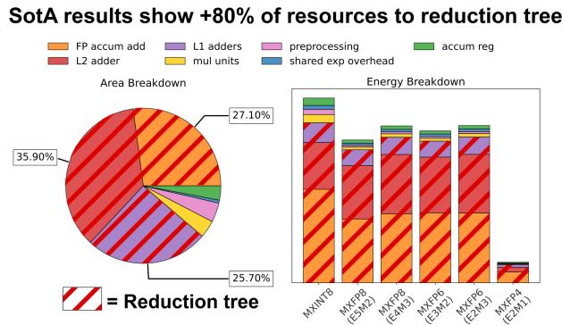
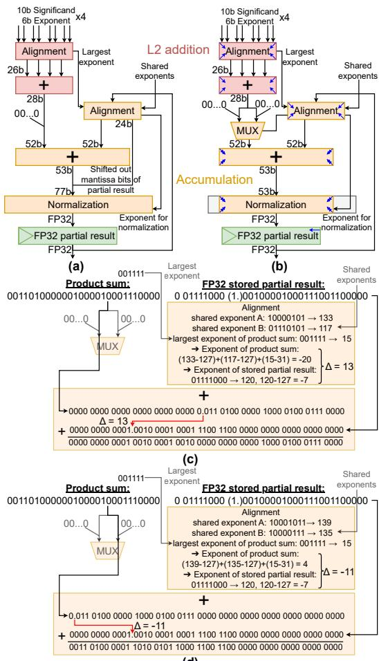
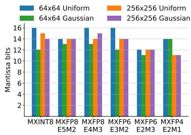
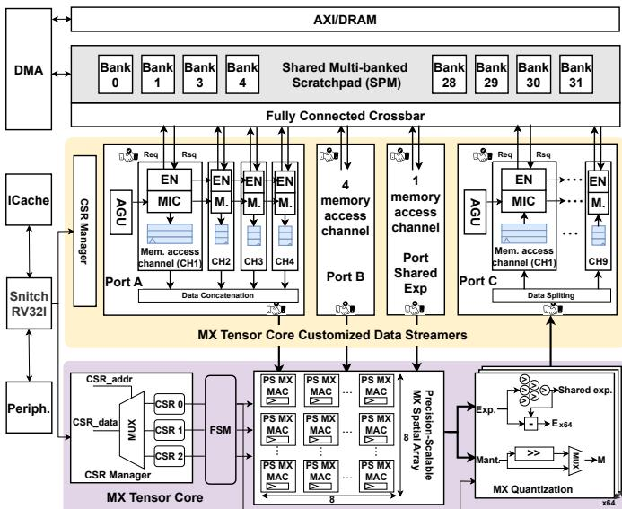

# Precision-Scalable Microscaling Datapaths with Optimized Reduction Tree for Efficient NPU Integration 通俗讲解

### 0. 整体创新点通俗解读

好，我们坐下来聊聊这篇论文。它表面上是做硬件的，但骨子里是在回答一个很实际的问题：**能不能用一套计算单元，既跑推理又跑训练？**

---

**痛点直击**

- 问题的根源在于：**推理和训练对数值格式的胃口完全不同**。
  - 推理用 **INT8** 就够了，又小又省电；
  - 训练却需要巨大的动态范围（梯度可能从 10⁻⁸ 飙到 10³）， traditionally 必须用 **FP32**。
- **Microscaling (MX)** 标准就是为调和这个矛盾而生的：32 个元素共享一个 8-bit exponent，每个元素本身可以只是 FP8/FP6/FP4/INT8。这样窄位宽也能覆盖大动态范围。
- 但 MX 的硬件实现卡在一个非常具体的地方：**加法树**。
  - 你算出来的乘积是“带各自小 exponent 的窄浮点数”，要把它们累加起来，得先**对齐**——这一步占了整个 MAC **88.7% 的面积、约 85% 的能耗**（见下图）。
  - 两条已有的路线各有各的难受：
    - **FP32 累加**：每次加完都要 normalize、align，逻辑又贵又慢；
    - **长整数累加**：把所有数拉宽成很长的整数再加，加法器宽得离谱（67-bit 甚至 95-bit）。

 *Fig. 1. Resource breakdown of the state-of-the-art precision-scalable Microscaling (MX) multiply-accumulate (MAC) unit [15], where more than 80% of the resources go to the reduction tree.*

- 还有一层系统级的痛点：作者团队之前的 MX MAC [15] 根本**没集成进 NPU**，而现有 SNAX 平台的 data streamer 是按最坏情况固定带宽配的——跑低精度时很多 memory channel 空转，白白耗电还加剧 bank contention。

一句话总结痛点：**不是乘法贵，是“把一堆不同 scale 的数加到一起”这件事贵；而且算得再快，喂不上数据也白搭。**

---

**通俗比方**

把累加浮点数想象成**记账**：

- 你有一堆欠条，面额单位五花八门——有的是“分”，有的是“万元”。要算总账，就得先把所有欠条换算成同一个单位再相加。
- **FP32 累加**的路线是：每加一笔就把总额重新格式化成一个“标准格式的总额条”（normalize），下一笔来再换算对齐——每一步都做无谓的整理，繁琐。
- **长整数累加**的路线是：干脆规定“所有人都换算成最小单位‘分’”，账本拉得老长（67-bit 账本），加法本身简单了，但账本和最后的整理都贵。
- **作者的 hybrid 方案**相当于一个聪明会计的观察：**“我每次只需要处理两张条子——新的一批乘积之和 vs. 之前记的总额。”这两张条子里，只有一张需要‘往大里换算’，另一张必然是‘往小里换算’——我根本不用同时准备两边的余量！** 一根 24-bit 的“缓冲带”，左边用的时候右边必然闲置，那就用一个 **MUX** 把这条缓冲带挪到左边或右边就行了。

至于第二个 trick（mantissa 从 23-bit 砍到 16-bit），比方是：**你最终记账结果只会保留到“角”（量化到 MX 格式），那你中间过程精确到“分”的千分位就没有意义——把账本精度砍到“分”就够，账本立刻薄了一半。**

---

**关键一招**

作者在原有流程里做了三处“外科手术式”的替换：

- **第一招：hybrid reduction tree**
  - 保留 [15] 那种支持全部 6 种 MX 格式的**窄 L2 加法树**（只算 28-bit 的 product-sum，不做全宽整数化）；
  - 但把 **early-accumulation** 技巧从 [24] 嫁接过来：累加时**不 normalize 中间结果**，直接把 FP32 partial sum 的 significand 对齐到 product-sum 上加。
  - 关键优化：原本左边和右边各要一条 24-bit 延展（加法前 24-bit + 加法后 24-bit，normalization 得吃 77-bit 输入），作者发现**两条延展永远只有一条在用**，于是用一个 MUX 复用，normalization 输入宽度从 77-bit 压回 **53-bit**。

 *(d)*

- **第二招：砍累加精度**
  - 逻辑转换很妙：**最终结果反正要量化回 MX 格式，量化误差是逃不掉的地板**。那只要“加法误差 ≤ 量化误差”，加法误差就被量化误差“淹没”，对最终精度无感。
  - 作者用 uniform/Gaussian 分布做误差对比实验（下图），发现 mantissa 砍到约 13-16 bit 时两者打平，于是硬件取 **16-bit mantissa**——L2 加法树按比例缩窄，累加部分每砍 1 bit 缩 2 bit，硬件进一步瘦身。

- **第三招：系统级集成**
  - 8×8 的 MX tensor core 塞进 **SNAX** 平台，通过 3 个 CSR 寄存器由 RISC-V 核心动态切换精度模式；
  - data streamer 加了**动态 channel gating**：INT8 模式只开 1 条通道，FP8 开 4 条，FP4 开 4 条——不再为低精度模式空耗带宽和功耗。

 *Fig. 5. System architecture overview with precision-scalable MX tensor core integration.*

---

**结果如何**

| 指标 | 对比 [15] (前 SotA) 的提升 |
|---|---|
| MXINT8 能效 | **1.59×** |
| MXFP8/6 能效 | **3.05×–3.21×** |
| MXFP4 能效 | **1.13×** |
| 系统 GeMM 利用率 | **94.4%–99.5%**（ResNet18/ViT 推理+训练） |

- 而且这是**第一个**同时满足“全 MX 格式 precision-scalable + 完整 NPU 集成”的方案——[24] 只支持 FP8 且没集成，[15] 支持全格式但只是孤立 MAC，[25] 集成了但只会 INT8。
- 代价也是诚实的：对比纯 INT8 的专用 GeMM 核 [25]（4680 GOPS/W），全格式灵活性确实吃了能效亏——这是**通用性 vs. 效率**的经典 trade-off。

---

**核心心法**

这篇论文最值得你带走的一点：**优化的突破口往往不在“算得更聪明”，而在“算得刚好”。**

- 两条 24-bit 延展永远只用一条 → 用 MUX 复用（结构性冗余）；
- 加法误差只要不越过量化误差的地板 → mantissa 大胆砍到 16-bit（精度性冗余）；
- streamer 按精度模式动态开关通道 → 带宽性冗余。

三个层面的贡献，本质上是同一件事：**找到“永远用不上的那部分硬件”，然后把它删掉。**

### 1. 混合精度可扩展归约树

**痛点直击**

- 这篇论文的核心战场不是乘法器，而是 MAC 里那个**归约树**。数据摆在那儿：**88.7% 的面积、85% 的能耗**都烧在了累加这一步。乘法本身很便宜，把一堆乘积“加到一起”才是吞资源的大户。

 *Fig. 1. Resource breakdown of the state-of-the-art precision-scalable Microscaling (MX) multiply-accumulate (MAC) unit [15], where more than 80% of the resources go to the reduction tree.*

- 当时的两条 SotA 路线，各自都“很难受”：
  - **FP32 加法路线** [15]：每加一步都要做**对齐→相加→归一化**。就像一个强迫症会计，每记一笔账都要把账本重新誊写整齐一次。归一化逻辑在硬件里出奇地贵。
  - **长整数加法路线** [24]：把所有数对齐到一个公共锚点，塞进一个 67-bit 的超宽整数里做**无损加法**，确实省掉了归一化，但代价是加法器和归一化都要伺候一个**77-bit 宽的怪物**。你为了“不丢任何一个 bit”，把硬件按最坏情况过度配置了——而最坏情况几乎从不发生。
- 根子上的问题：**“绝对精确”和“硬件高效”被当成了二选一**。但其实这两个方案各自的优点是可以拼起来的——FP32 的**窄加法器**，加上整数加法的**免归一化**。

---

**通俗比方**

- 想象你在做科学计数法的竖式加法：一个很大的数 $3.2 \times 10^8$ 加一个很小的数 $1.5 \times 10^{-5}$，你必须先对齐数量级。
- 关键的观察是：**对齐的时候，永远只有一方需要“挪”**。要么是小数往右挪（尾数右移、高位补零），要么是大数往右挪（尾数右移、低位补零）——**你绝不需要同时给两边都留空白边距**。
- 但之前的硬件不知道这一点，老老实实在数的**两侧都预留了 24-bit 的空白列**（左侧 24 + 主体 28 + 右侧 24 ≈ 77-bit），就像一张左右两边都印了空白栏的账本纸，实际上你每次只会用到其中一边。
- **混合归约树的做法**：把那张纸的空白栏做成“可撕下来贴到左边或贴到右边”的活页——用一个 **MUX**，根据累加时谁大谁小，动态决定 24-bit 的扩展位挂在**左侧还是右侧**。账本宽度瞬间从 77-bit 缩回 **53-bit**，而正确性一点没丢。

---

**关键一招**

- 作者没有从零造一个新加法器，而是做了一个**嫁接手术**：把 [24] 的 **early-accumulation** 技巧移植进 [15] 的 FP32 归约树骨架里，然后连砍两刀。

 *(d)*

- **第一刀（结构上）**：识别出“左扩展”和“右扩展”**互斥**。28-bit 的乘积和，要么在左边补 24 个零（让存下来的 FP32 部分和能左移过来对齐），要么在右边补（让部分和的尾数右移出去后还能接回来）。二者取其一，所以归一化的输入宽度从 77-bit 砍到 **53-bit**——这就是线索里那句 "efficient 28-bit signal widths" 的真正含义：**用互斥性换掉了 adder 的过度配置**。

- **第二刀（精度上）**：追问一个更根本的问题——累加器真的需要 FP32 的 23-bit 尾数吗？
  - 注意到最终结果反正要被**量化回 MX 格式**（比如 E2M1 只有 1-bit 尾数），量化误差是逃不掉的地板。
  - 只要**加法误差 < 量化误差**，多出来的精度就是白花钱——用千分尺量尺寸，最后却用斧头砍。
  - 作者用均匀分布和高斯分布模拟通用负载，画出两条误差曲线的交点（见下图），发现 13~16-bit 尾数就够，最终硬件选了保守的 **16-bit**。
  - 这一刀是连锁反应：尾数每减 1 bit，L2 对齐/加法器跟着缩 1 bit，而累加器的对齐、加法、归一化**每个都缩 2 bit**——因为它们的位宽由“L2 输出宽度 + 部分和尾数宽度”两部分共同决定，两头都在缩。

- 一句话总结这招的本质：**先看“需要多准”（量化误差定了地板），再看“什么时候用硬件”（互斥性砍掉冗余）**——两刀下去，归约树这个占 85% 能耗的大头被同时从宽度和精度两个维度压扁，最后换来对 SotA [15] **MXFP8/6 模式 3 倍以上**的能效提升。

### 2. 基于误差分析的累加精度优化

**痛点直击**

这篇文章做的是 MX 格式的 MAC 运算单元。之前的做法（[15] 和 [24]）都有一个共同的“肌肉记忆”：**累加器的中间结果必须存成 FP32**，也就是 23-bit mantissa。这个假设看起来很安全，但代价是——

- 整个 reduction tree 的加法器宽度、对齐 shifter、normalizer 全都要按 24-bit 精度去设计
- 前面我们说过，reduction tree 占了整个 MAC **80% 以上的面积和功耗**，而 mantissa 宽度直接决定了这些模块的规模
- 换句话说，硬件成本是跟着累加精度线性放大的，你存多宽的中间结果，就得修多宽的路

但这里有个被大家忽略的浪费：**你辛辛苦苦用 FP32 精度累加了一路，最后一刻却要把结果量化回 MXFP8 / MXFP6 / MXFP4 这种 3~4 bit mantissa 的格式**。用 24-bit 精度去服务一个 4-bit 的出口，这就是“顾头不顾尾”——前面保护得无微不至，后面却自己把精度扔了。

---

**通俗比方**

这就像你往一个**漏水的桶**里倒水，反复加水（累加）：

- 桶底有个固定的洞（**quantization error**，最终量化到 MX 格式时必然丢失的精度），这个洞你堵不上——因为下一层网络就必须用 MX 格式
- 桶壁也有细微的渗漏（**addition error**，累加时的舍入误差），桶壁越薄渗得越快
- 之前所有人都默认“桶壁必须做到金库级别厚”（FP32 mantissa），生怕渗漏
- 但作者的洞察是：**只要桶壁的渗漏比桶底的洞小，多出来的渗漏根本流不出去——都被桶底那个更大的洞吞掉了**

所以桶壁不用做厚，做到“渗漏 ≈ 桶底的洞”就停手。再厚就是**纯浪费硬件**，因为精度在出口处注定被砍掉。

---

**关键一招**

作者没有在电路上做任何花哨的改动，而是做了三步“算账”：

- **第一步：识别出两个独立的误差源**
  - **Quantization error**：最终从 FP 累加结果量化到 MX 格式，这是**结构性、不可避免的**，由目标格式（E4M3 只有 3-bit mantissa）决定
  - **Addition error**：累加过程中的舍入，**这个是硬件设计者可以控制的**——由存的 mantissa 宽度决定

- **第二步：扫频找交点**
  - 用矩阵乘法（64×64 和 256×256）做仿真，横轴扫 mantissa 宽度（2 到 23 bit），分别测两个误差相对于 FP64 “完美结果”的归一化误差
  - 逻辑很简单：**只要 quantization error 还压着 addition error 一头，加法误差就是免费的**，反正会被量化一起抹掉
  - 交点处就是“再降 mantissa 就开始伤及最终结果”的临界值

- **第三步：取最坏情况，定一个工程安全值**
  - 不同格式、不同矩阵尺寸、不同分布（uniform / Gaussian）下的临界 mantissa 各不相同
  - 作者取所有情况下的**最高值**，最终定为 **16-bit mantissa**——注意，这仍然比 FP32 的 24-bit 少了 8 bit
  - 这 8 bit 省下来不是小数目：根据文中分析，**累加部分的加法器和 normalizer 的位宽随 mantissa 是两倍缩放**（每砍 1 bit mantissa，这些模块窄 2 bit），L2 加法器则等比例缩窄

**一句话总结**：作者没有重新设计电路，而是**重新定义了“多准才算准”**——把累加精度从“对齐 FP32 标准”这个教条，扭转为“对齐最终量化的实际需求”。省下的 mantissa 直接换算成了 reduction tree 的面积和功耗节省，而最终结果的精度一 bit 都没损失，因为误差预算早就被量化这个“更大的洞”占满了。

这个思路值得你记住，它在硬件设计里非常通用：**精度不必处处对齐最高标准，只需对齐到下游消费精度——中间的“过度精度”是纯粹的面积税**。

### 3. MX张量核心的SNAX集成与CSR统一控制

**痛点直击**

先想一个问题：你辛辛苦苦设计了一个**精度可切换的 MX 计算阵列**（INT8 推理、FP8/FP6/FP4 训练都能跑），把它接进一个 NPU 系统时，会遇到什么？

- **控制难**：精度模式、累加深度、矩阵 tile 尺寸，这三个参数每个都要动态变。传统做法是给每种配置写一套专用指令或者改硬件连线，换一个 workload 就要重新折腾，**硬件灵活性直接被控制接口卡死**。
- **喂不饱**：计算阵列在不同精度下的**带宽需求天差地别**——MXINT8 一个 cycle 只做 2 个操作，MXFP4 一个 cycle 要做 16 个。如果数据通路按 worst-case（FP4）静态配置，那跑 INT8 时一堆 memory channel 闲着还在漏电，**bank contention 和动态功耗白白浪费**。
- **两难困境**：很多论文在 MAC 级别做得漂亮，但只是个孤立的计算单元（比如 SotA [15] 就是 "NPU integrated? ×"），**一到系统级就露馅**——控制开销和数据搬运把 MAC 的效率优势全吃掉了。

一句话：**算力再强，控制系统和数据供给跟不上，就是一台没接油管的好引擎**。

**通俗比方**

把整个 NPU 想象成一家餐厅：

- **MX Tensor Core** 是后厨里一位全能大厨，会做日料（INT8）、法餐（FP8）、快餐（FP4），做得还都很快。
- **Snitch RISC-V core + CSR** 是前厅经理。他不需要会做菜，也不需要冲进后厨盯着每个灶台——他只需要递三张**标准化的点单小票**：今天做哪国菜（CSR0：精度模式）、一道菜做几层（CSR1：累加深度）、一桌几个盘子（CSR2：矩阵 tile 尺寸）。后厨的 **FSM** 看到小票自己就会安排整场流水线。
- **Data Streamers** 是传菜员团队。关键巧思在于：上日料时只派 1 个传菜员，上 FP4 大餐时才派齐 4 个——**按菜系动态排班，闲着的人不下班但不开工（不耗动态功耗）**。

这个比方里的精髓是：**控制解耦（经理发小票）+ 数据按需供给（传菜员动态排班）**，两头一起松绑，大厨才能火力全开——论文里那个 94.41%–99.51% 的利用率就是这么来的。

 *Fig. 5. System architecture overview with precision-scalable MX tensor core integration.*

**关键一招**

作者没有为 MX 阵列发明什么新指令集，也没有搞复杂的硬件重构，而是做了两次非常克制但精准的“接口手术”：

- **招式一：用 CSR 把“配置硬件”变成“写寄存器”**
  - 原本的思路可能是：精度切换 → 改数据通路 → 重新综合或写专用指令。
  - 作者的扭转：**只暴露 3 个 32-bit 的 CSR 寄存器**，Snitch 核心用标准 RISC-V CSR write 指令，一个 cycle 32 bit，就把精度模式、累加次数、tile 尺寸全配完了。
  - 妙处在于**零定制指令开销**：任何会写 RISC-V 的程序员立刻就能用，硬件侧的 **FSM 拿到寄存器值后自己生成所有微架构控制信号**——软件只管“说做什么”，硬件自己管“怎么做”。
- **招式二：把静态带宽供给改成动态 channel gating**
  - 传统 SNAX streamer 按最坏情况预留带宽，不管你跑什么精度，所有 memory channel 都在。
  - 作者的扭转：在 streamer 里加**运行时门控**——MXINT8 只开 1 个 channel，MXFP8 开 4 个，MXFP4 才开满。再配上**可编程 AGU**，让每个精度模式都能用最适合自己的数据 layout 和访问 pattern。
  - 结果就是：低精度模式的内存子系统不再“空转”，SPM 的 bank contention 显著缓解，论文能量分布里 **MX core 反而成了耗电大头**（而 SPM 和数据通路被压得很低），说明系统级浪费被挤掉了。

**一句话总结**

这一招的本质是：**不要让软件理解硬件的复杂度，也不要让硬件猜测软件的需求**——中间架一层极薄的 CSR 抽象 + 一层动态带宽门控，就能让一个精度可变的计算阵列，在一个通用 NPU 平台上跑到接近理论峰值。这比把 MAC 本身做快 10%，对系统能效的贡献往往更大。

### 4. 动态通道门控数据流

**痛点直击**

这篇论文的 MAC 阵列是**精度可伸缩**的：MXINT8 每周期只吃 1 份乘积，MXFP4 模式下要一口气算 8 份。这意味着数据口的“胃口”随精度模式剧烈变化：

- SNAX 原本的 data streamer 是**按最坏情况（worst-case）静态配带宽**的——通道数按 MXFP4 那种最饿的模式铺设。
- 当你跑 MXINT8 时，问题就来了：
  - 多余的 memory 通道**并没有闲着**，它们照样产生动态功耗（dynamic power），纯粹是“空转烧电”。
  - 更阴险的是 **bank contention**：这些没人用的通道还在争抢 SPM 的 32 个 bank，把真正需要的通道堵在路口。
- 本质上这是个经典的“**为峰值买单，为均值干活**”的浪费——硬件按峰值建，工作负载却在低精度区间徘徊，钱和电都花在了用不上的地方。

---

**通俗比方**

把它想象成一家**餐厅的上菜传送带**：

- 你按“周末爆满”的客流量装了 4 条传送带（对应 4 条 memory channel）。
- 工作日中午只来了少量客人（MXINT8，带宽需求只有 1 条通道的量），但你不能把传送带停下来——它们还在空转耗电，而且厨房门口（memory bank）就那么几个口，4 条带子挤着抢，真正有菜的那条反而被堵。
- **动态通道门控**干的事就是：给每条传送带装一个开关，客少的时候只开 1 条，客多的时候 4 条全开。开关由前台（Snitch RISC-V core 通过 CSR 配置）在运行时拨动。

再往深一层：这其实是**时分复用思想从“计算”下放到“访存”**。计算侧的 precision-scalable 早已是常识——低位宽时就少开几个乘法器；但访存侧通常被当成“哑巴管道”，大家默认它永远满载跑。这篇工作的洞察是：**访存带宽也应该是精度的函数**。

---

**关键一招**

作者没有去改 MAC 阵列本身，而是在 **SNAX data streamer 里插了一个运行时的“通道闸门”**，逻辑转换非常干净：

- **输入侧感知精度**：Snitch core 通过 CSR 0 写入当前 precision mode（INT8 / FP8 / FP6 / FP4），这个信号直接喂给 streamer。
- **按需开闸**：streamer 在运行时只激活当前模式所需的通道子集：

| Precision Mode | 激活通道数 |
|---|---|
| MXINT8 | 1 |
| MXFP8 | 4 |
| MXFP6 | 3 |
| MXFP4 | 4 |

- **一举三得**：
  - 未激活的通道不产生 memory traffic → 省动态功耗；
  - 未激活的通道不碰 SPM bank → **bank contention 缓解**；
  - 各模式还配了各自优化的数据布局（data layout），streamer 内部的**可编程 AGU** 在运行时切换访问模式，保证不同位宽的操作数都能对齐 spatial array 的取数节奏。

注意作者**没有**做的是：没有加更大的 FIFO 去缓冲、没有降频、没有砍掉通道硬件（面积不变）。它纯粹是一个**控制层面的改造**——把原本静态的带宽分配变成了一个随精度模式联动的开关网络。这和论文里 Fig. 8 的能量分解是自洽的：正因为 streamer 和 SPM 的动态功耗被压下去了，**能量大头才会落到 MX tensor core 本身**，而不是像传统设计那样被内存子系统白白吃掉一半。

一句话总结：**计算精度已经在缩放了，凭什么数据通路还按满配跑？** 这就是把 precision-scalable 的理念从算术单元一路贯彻到 memory 子系统的最后一公里。
