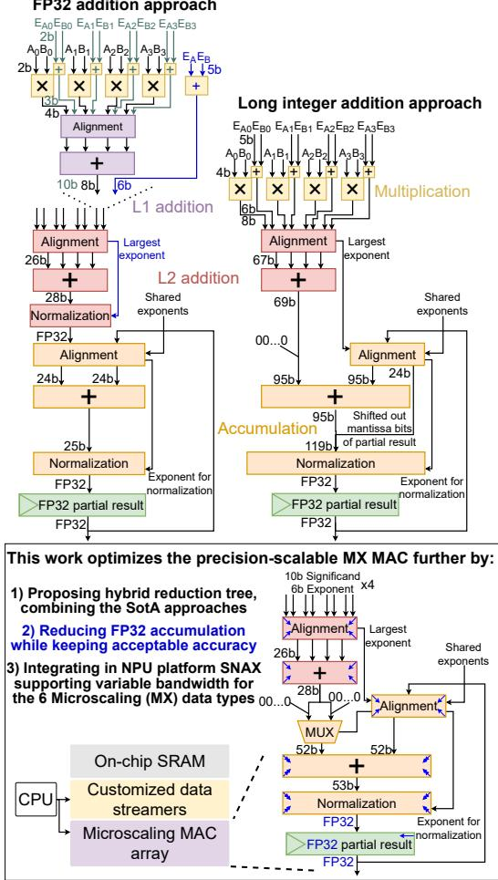
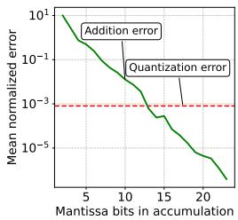
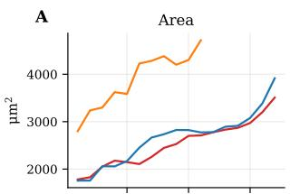
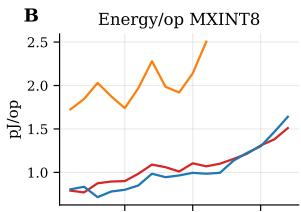
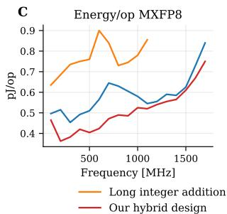
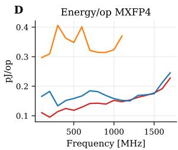
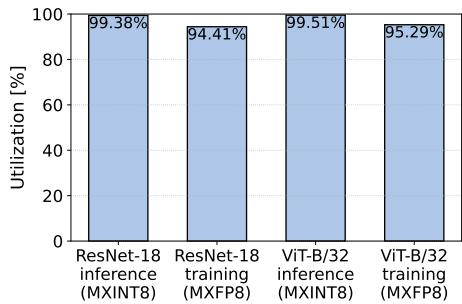
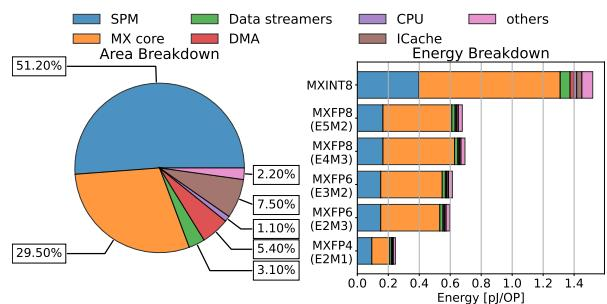

# Precision-Scalable Microscaling Datapaths with Optimized Reduction Tree for Efficient NPU Integration 原文翻译

# 面向高效 NPU 集成的、具有优化归约树的精度可扩展 Microscaling 数据通路

Stef Cuyckens\*, Xiaoling Yi\*, Robin Geens, Joren Dumoulin, Martin Wiesner, Chao Fang†, Marian Verhelst

ESAT-MICAS, KU Leuven, Belgium

Email: {stef.cuyckens, xiaoling.yi}@esat.kuleuven.be

摘要——新兴的持续学习应用要求下一代神经网络处理单元（NPU）平台同时支持训练和推理操作。前景广阔的 Microscaling（MX）标准为推理提供了较窄的位宽，并为训练提供了较大的动态范围。然而，现有的 MX 乘累加（MAC）设计面临一个关键的权衡：整数累加需要对较窄的浮点乘积进行昂贵的格式转换，而 FP32 累加则会带来量化损失和高昂的归一化开销。为了解决这些限制，我们提出了一种用于 MX MAC 的混合精度可扩展归约树，它结合了两种方法的优势，实现了具有受控精度放松的高效混合精度累加。此外，我们将这些 MAC 组成的 8×8 阵列集成到最先进（SotA）的 NPU 集成平台 SNAX 中，为我们优化的精度可扩展 MX 数据通路提供高效的控制和数据传输。我们在 MAC 和系统两个层面对我们的设计进行了评估，并与 SotA 进行了比较。我们的集成系统在 MXINT8、MXFP8/6 和 MXFP4 下分别实现了 657、1438-1675 和 4065 GOPS/W 的能效，以及 64、256 和 512 GOPS 的吞吐量。

## I. 引言

对能够在边缘设备上进行持续学习的应用（包括机器人、可穿戴健康监测器和自动驾驶车辆 [1]–[4]）日益增长的需求，要求系统在保持能效和面积效率并满足严格时延约束的同时，能够适应不断变化的环境 [5]–[8]。为了降低片上系统的面积和成本，训练和推理工作负载都应由一个共同的计算架构来支持 [9]–[13]。在这种统一的训练–推理 NPU 平台中，挑战在于实现一个能够以不同精度需求执行这两类任务的乘累加（MAC）阵列，同时提供精简的控制逻辑和高带宽的数据流以维持峰值吞吐量 [14]、[15]。

推理工作负载通常依赖于紧凑的整数格式（如 INT8 或 INT4）来最小化硬件成本和能耗 [16]–[18]。相比之下，训练工作负载需要大得多的动态范围来维持模型收敛 [19]，这传统上由 FP32 算术提供。对所有操作使用高精度浮点的面积和功耗代价过高，而在训练中使用低精度整数格式可能导致显著的精度损失。

  
图 1. 最先进的精度可扩展 Microscaling（MX）乘累加（MAC）单元 [15] 的资源分布，其中超过 80% 的资源用于归约树。

Microscaling（MX）数据类型通过在共享指数下对元素进行分组来弥合这一差距，从而以较窄的元素格式（如 FP8、FP6、FP4 或 INT8）保持动态范围 [20]、[21]。因此，MX 数据类型支持动态选择数据类型的精度可扩展 MAC 阵列，允许在训练期间使用更高的精度、在推理期间使用更低的精度，并对能够容忍精度退化的任务使用降低的精度 [15]、[20]。这些能力提升了能效和适应性，使 MX 非常适合边缘持续学习 [22]、[23]。

尽管有这些优势，实现兼容 MX 的 MAC 单元带来了显著的设计挑战。支持多种 MX 数据类型使 MAC 计算单元资源消耗巨大，先前的工作表明，累加树占据了 MX MAC 面积（88.7%）和能耗（≈ 85%）的主要部分 [15]，如图 1 所示。这一开销源于在累加之前需要对齐具有共享指数的乘积：将较窄的浮点乘积转换为宽整数会带来高昂的格式转换成本 [24]，而 FP32 累加则需要昂贵的归一化逻辑并产生量化损失 [15]。

虽然精度可扩展的 MX MAC 级优化至关重要，但 NPU 的能效最终受到系统级因素的限制，例如存储器访问瓶颈 [25]–[27]。最先进（SotA）的集成框架 SNAX [28] 通过专用的数据流发生器 [29] 提供高效的数据管理，从而解决了这一问题。然而，这些数据流发生器是按静态最坏情况带宽配置的，这会导致部分未被利用的存储器通道产生动态功耗，并在低精度操作时加剧 bank 争用——当使用来自 [15] 的 SotA 精度可扩展 MX MAC 单元时，这一限制尤为明显。

为了克服这些限制，本文提出了具有优化归约树的精度可扩展 MX 数据通路以及高效的 NPU 集成，其主要贡献如下：

• 在算术单元层面，本文提出了一种用于 MX MAC 的混合精度可扩展归约树，它结合了现有方法的关键优势：利用整数累加能够跳过昂贵归一化的能力，同时利用浮点累加可减少加法器宽度的好处来降低硬件成本。

• 通过进一步放松累加精度对该实现进行优化，进一步降低硬件成本，同时将精度损失控制在可接受范围内。

• 在 NPU 层面，将所提出的 MAC 组成的 8×8 阵列集成到 SNAX NPU 平台中，并对其数据流基础设施进行适配，以高效处理不同 MX 数据类型的动态带宽需求。

我们在 MAC 和系统两个层面对该设计进行了评估，并与 SotA MX MAC 实现进行了比较，最终在 MXINT8、MXFP8/6 和 MXFP4 下分别以 1.59×、3.05×-3.21× 和 1.13× 的因子在能效上超越了先前的 SotA [15]。

## II. 背景与动机

## A. MX 格式与现有技术 MX 数据通路

MX 标准 [20] 定义了六种数据类型，如表 I 所示：MXINT8、MXFP8 E5M2、MXFP8 E4M3、MXFP6 E3M2、MXFP6 E2M3 和 MXFP4 E2M1，其中记号 ExMy 表示 x 个指数位和 y 个尾数位。数据被组织成（倍数于）32 个元素的向量，每个向量共享一个 8 位指数。这种由共享指数与各 MXFP 格式独立指数构成的二级指数方案，在硬件效率与动态范围之间取得了平衡，而这正是在边缘侧以低位宽量化有效训练神经网络所必需的 [15]、[20]。

文献 [15] 提出的现有精度可扩展 MX MAC 首次在单个 INT–FP 混合数据通路中动态支持全部六种 MX 数据类型。其实现方式是将 MAC 拆分为 2 位乘法单元，以处理 MXFP4 的 2 位有效数字。该 MAC 具有三种模式：MXINT8、MXFP8/6 和 MXFP4，分别在与存储的 FP32 部分结果累加之前对 1、4 或 8 个乘积求和。图 2（左）给出了总体概览。指数处理发生在加法树的三个层级。在 MXFP4（E2M1）模式下，每个乘积带有 3 位指数（两个 2 位输入指数之和），所得的 4 位乘积（1.M 或 0.M）在第一级（L1）加法（紫色）之前按指数对齐。L1 输出在 MXFP4 模式下是 10 位有效数字，而 MXFP8/6 和 MXINT8 模式产生 8 位结果，与常规精度可扩展 MAC [30] 相同。在第二级（L2，红色），MXFP8/6 模式同样需要指数对齐：四个 8 位有效数字，每个最多带有 6 位指数（来自 MXFP8 E5M2 指数相加），相对于最大指数进行右移。

  
Fig. 2. Overview and issues of the state-of-the-art reduction trees for MX MAC implementations: FP32 addition [15], and Long integer addition [24]. Followed by the solutions proposed in this work.

为保持精度，有效数字被扩展至 26 位，除非对齐移位超过该宽度，否则不会造成信息丢失。26 位宽度与 FP32 的 24 位精度相匹配，并含两个保护位用于处理次正规数。随后结果被归一化为 FP32，并在第三级（橙色）与存储的 FP32 部分和累加，在此层级应用共享指数。经过多周期累加后，最终的 FP32 结果被量化回目标 MX 格式。由于 [15] 使用 64 元素、共享 8 位指数的 8×8 组，量化需要全部 64 个未量化的 MAC 输出来计算正确的共享指数，然后再量化为某一 MX 类型。这些量化后的结果馈入下一神经网络层。我们将 [15] 中的加法树称为 FP32 加法（FP32-addition）方法。

另一项现有技术工作 [24] 提出了不同的加法树设计（图 2，右）。它提出了一种仅支持 MXFP8 E5M2 和 MXFP8 E4M3 的精度可扩展 MX MAC。由于不支持 MXFP4，其加法树从 [15] 的 L2 加法器层级开始。输入使用 8 位有效数字，指数最多为 6 位。他们不是对齐到最高指数，而是对齐到一个公共锚点（anchor），将每个有效数字放置在一个 67 位整数中，并无损地相加。为了与 FP32 部分结果累加，他们采用了早期累加（early-accumulation）[31]，即将 FP32 结果对齐到共享的 MXFP8 指数，从而在乘积相加之后无需归一化和对齐。FP32 尾数被对齐到以 26 个零位扩展后的 95 位乘积和上，以便在 FP32 指数较大时实现无损累加。若 FP32 指数小得多，移出的尾数位会通过适当的符号处理被重新附加，从而即使在和非常小的情况下也能保证正确性。该方法无需对乘积和进行归一化或对齐即可实现精确累加，但需要更宽的累加加法器以及更宽位宽上的归一化。更多细节见 [14]、[24]、[31]。我们将该设计称为长整数加法（long integer addition）方法。

TABLE I  
CONCRETE MX FORMATS SPECIFIED BY [20]
<table><tr><td>MX name</td><td>MXINT8</td><td colspan="2">MXFP8</td><td colspan="2">MXFP6</td><td>MXFP4</td><td></td></tr><tr><td>Element format</td><td>INT8</td><td>E5M2</td><td>E4M3</td><td>E3M2</td><td>E2M3</td><td>E2M1</td></tr><tr><td>No. bits element</td><td>8</td><td>8</td><td>8</td><td>6</td><td>6</td><td>4</td></tr><tr><td></td><td colspan="6">Block size of 32 elements. Shared exponent of 8 bits.</td></tr></table>

## B. SNAX 集群

SNAX [28] 是一个用于快速 NPU 集成的 RISC-V 计算集群模板。它包含一个 RISC-V RV32IMAFD Snitch [32] 核心，通过标准的配置与状态寄存器（Configuration and Status Register，CSR）指令控制 NPU。一个具有全连接交叉开关的 128 KiB、32 个体bank的共享便签式存储器（SPM）被用于存储操作数并提供高带宽数据访问。专用的数据流生成器（data streamer）被设计用于向 NPU 提供自主且连续的数据流，最大化 NPU 的利用率。一个 DMA 核心处理 SPM 与外部存储器之间的数据传输，提供 512 位的峰值数据带宽。

为了支持敏捷的 NPU 集成，SNAX 采用了混合数据/控制耦合策略，以在系统层面提升 NPU 的可编程性与效率。松耦合的控制接口实现了高效的内核卸载，而不会阻塞 RISC-V Snitch 核心；同时基于 CSR 的配置模型抽象化了硬件细节，便于编程。与此并行，紧耦合的数据流生成器 [29] 提供对共享存储器的低延迟访问，在设计时适应多样的带宽需求，并在运行时针对多样的 NPU 工作负载适应各种数据访问模式。

## III. 归约树设计

## A. 混合归约树

我们的工作基于 [15] 提出的精度可扩展的 MX MAC 架构，该架构支持所有 MX 类型，因而提升了训练–推理平台的适应性。我们的优化聚焦于 L2 加法器和累加部分，因为它们主导了 MAC 的能耗和面积开销（图 1）。因此，我们归约树设计的输入是四个带有 6 位指数的 10 位尾数（如第 II-A 节所述），以及两个 8 位的共享指数，每个因子对应一个，与 [15]、[24] 中的做法一致。

具体而言，我们将 [24]、[31] 中的早期累加方案集成到 [15] 的 FP32 归约树中，如图 3a 所示。这使得高效的 28 位信号宽度成为可能，避免了 L2 加法器中加法器的过度配置，同时降低了 L2 加法器与累加之间的归一化和对齐开销。引入早期累加的缺点是，与 FP32 加法方法 [15] 相比，累加部分需要更大的加法器和归一化逻辑。在图 3a 中，28 位的乘积和被扩展 24 位，以允许存储的 FP32 值的 24 位尾数向左移位以进行正确的加法。加法完成后，53 位输出再扩展 24 位，因为整个 24 位尾数可能被完全移出，需要在归一化时重新接回。这导致归一化逻辑需要支持 77 位的输入。

为了解决这一高昂的归一化开销，我们对归约树进行了进一步优化，如图 3b 所示。这里，我们利用了这样一个事实：加法前的 24 位扩展仅在存储的 FP32 部分结果大于乘积和、且需要相对于乘积和向左移位时才需要；而加法后的 24 位扩展仅在存储的 FP32 部分结果的尾数需要向右移位时才使用。由于同一时刻只会用到其中一个 24 位扩展，归一化的输入宽度可以放宽至 53 位。这通过一个多路选择器（MUX）实现，该 MUX 根据对齐时存储的 FP32 值的尾数如何移位，在左侧或右侧扩展 28 位的乘积和。为简洁起见，图 3 中未展示符号处理。这两种累加配置的示例如图 3c 和图 3d 所示。

## B. 累加精度优化

在处理浮点数据格式时，最重要的参数之一是结果的精度，它主要取决于计算中所使用的尾数位数 [33]，以及这些位数中有多少真正保留在最终结果中。大多数工作将部分结果存储为 FP32，其具有 23 位尾数精度 [15]、[24]。高效的实现通过使计算精度与最终结果的精度保持一致来避免过度的计算。因此，所存储的部分结果的精度会影响整个加法树结构。本节提出在我们混合归约树设计中减少所存储部分结果的尾数位数，以进一步优化我们的精度可扩展 MX MAC 的实现。

首先，我们研究减少所存储部分结果的尾数位数会如何影响我们的归约树设计。在图 3b 中，蓝色箭头指示了各模块可缩减的程度；带有单端箭头的模块按尾数宽度成比例缩减，而带有双端箭头的模块的位宽在尾数每减少一位时减少两位。L2 对齐和加法按比例缩减，因为该加法的精度在 [15] 中被设计为与所存储的部分结果相同。在累加过程中，所存储部分结果的对齐、加法和归一化，其缩减幅度均为两倍。这是因为这些模块输入的位宽是通过将 L2 加法的输出宽度与所存储部分结果的尾数宽度相结合而得到的。此前，28 位与所存储部分结果的 24 位有效数字（significand）组合成 52 位的信号宽度，而这两者均随尾数宽度而变化。

  
(d)

图 3. 我们提出的混合归约树架构的第一次（a）和第二次（b）迭代，以及用于说明（b）中多路选择器的示例。

  
图 4. 比较累加中尾数长度缩减时的量化误差与加法误差，两种误差均相对于以 float64 计算的结果进行归一化，该结果在计算误差时也被视为完美结果：（左）针对 MXFP8 E4M3、矩阵大小为 64x64 且矩阵元素服从高斯分布的误差比较，（右）量化误差大于加法误差的最低尾数长度，涵盖 64x64 和 256x256 两种矩阵大小以及均匀分布和高斯分布两种矩阵元素分布。

其次，我们检验在不影响最终结果精度的前提下，所存储中间结果的尾数宽度可以减少多少。如第 II-A 节所述，最终存储在累加寄存器中的浮点结果，在所有数据累加完成之后会被量化为某一种 MX 数据格式。该量化按照 [20] 中的方式实现，即通过找到 MX 组中的最大元素来计算新的共享尺度，然后将各元素除以该共享尺度，再将各个元素量化为 INT8、FP8、FP6 或 FP4。这自然会引入一定的量化误差。该量化误差是不可避免的，否则下一层的计算将需要在 FP32 中完成，其所需资源远多于 MX 数据格式。现在，为了估计在不损害加法精度的前提下所存储中间结果的尾数宽度可以减少多少，我们将加法误差与该量化误差进行比较。我们的假设是，只要量化误差超过加法误差，后者就可以忽略不计。这一条件使我们能够缩减尾数宽度，直到两种误差源的量级变得相当。

由于我们的训练-推理 NPU 平台的目标应用是持续学习，我们无法针对预定义的工作负载来优化尾数宽度。相反，我们的目标是比较通用工作负载下的加法误差与量化误差。我们通过两种方式来模拟这种通用工作负载：1) 对 MX 组的元素和共享指数使用均匀分布；2) 使用高斯分布。均匀分布的共享指数被限制在 -32 到 32 的实用范围内，以避免溢出，而高斯分布的标准差则通过设定 $6 \sigma = 2 ^ { 3 2 }$ 来确定。

在图 4（左）中，展示了 MXFP8 E4M3 量化下矩阵大小为 64x64 的矩阵乘法的加法误差与量化误差。在 x 轴上，尾数宽度在 2 位到 23 位之间变化，其中所存储的部分结果和计算均以该尾数长度进行。误差相对于 FP64 结果计算，并以该 FP64 值进行归一化。这种归一化可以防止误差被少数几个较大的值所主导，从而提供对所有数据点的相对误差度量。在图 4 中，当尾数宽度为 13 位时，量化误差与加法误差变得相当。图 4（右）给出了针对不同 MX 数据格式、不同矩阵大小以及两种输入分布，加法误差等于量化误差时的临界尾数宽度。硬件实现中选择了其中最高的尾数宽度，因为这样即使在最坏情况下也能提供精确的加法。为此，我们的设计采用 16 位的尾数宽度。

## IV. NPU 集成

精度可扩展的 MX MAC 被组织为一个 8×8 的空间阵列，称为 MX tensor core，以实现通用矩阵乘法工作负载的空间数据复用与并行执行。本节首先介绍 MX tensor core 的架构（第 IV-A 节），然后描述其集成到 SotA NPU 平台 SNAX [28] 的过程，包括 MX tensor core 的灵活控制（第 IV-B 节）和高效的数据流传输（第 IV-C 节）。

  
图 5. 集成了精度可扩展 MX tensor core 的系统架构总览。

## A. MX Tensor Core

如图 5（底部）所示，MX tensor core 由三个主要子模块组成：一个灵活的有限状态机（FSM）、一个精度可扩展的 MX 空间阵列，以及一个基于 SIMD 的量化单元。FSM 提供微架构控制与握手信号。它为计算阵列配置精度模式，并基于矩阵大小生成控制信号，协调整个 GeMM 执行过程。空间阵列由 64 个精度可扩展的 MX MAC 单元组成，排列为 8 × 8 的二维网格，可实现水平和垂直两个方向的数据复用 [34]、[35]。根据所选的精度模式，该阵列对两个 8 × 8 矩阵执行 GeMM 运算，在 INT8、FP8/FP6 和 FP4 模式下分别需要 8、2 或 1 个周期 [15]。位于空间阵列下游的 SIMD 量化单元处理 64 个浮点输出，并将其转换为任意受支持的 MX 数值格式。这种控制、计算与量化的分离，使 tensor core 能够动态适应不同的精度和矩阵大小需求，同时保持高计算吞吐量。

## B. 通过 CSR 实现统一控制

MX tensor core 由 Snitch RISC-V 处理器通过标准 CSR 写操作进行编程，提供每周期 32 位的配置带宽。如图 5（左下）所示，一个专用 CSR 管理器暴露出三个寄存器，构成统一的编程接口。如表 II 所示，CSR 0 用于为空间阵列和量化单元选择数值精度，而 CSR 1 和 CSR 2 分别定义累加维度和矩阵分块维度。通过发出 CSR 写指令，Snitch 核心可动态配置 MX tensor core 的 FSM，在运行时将计算阵列适配至所需的精度、累加深度和矩阵尺寸。

TABLE II 用于 MX TENSOR CORE 配置的 CSR
<table><tr><td>寄存器</td><td>功能</td></tr><tr><td>CSR0</td><td>MX 阵列与量化精度模式选择</td></tr><tr><td>CSR1</td><td>单个结果输出对应的累加次数</td></tr><tr><td>CSR2</td><td>块矩阵尺寸：矩阵分块的行/列维度</td></tr></table>

## C. 通过动态 Streamer 实现精简数据供给

如图 5（中）所示，我们采用具有独立访存通道的独立数据 streamer，以满足 MX tensor core 的带宽需求。为了适应 MX tensor core 在不同精度模式下各异的带宽需求，我们对 SNAX 数据 streamer [29] 进行了扩展，引入了动态通道门控。在运行时，streamer 仅激活当前精度模式所需的访存通道子集：根据不同精度模式的计算特性 [15]，MXINT8、MXFP8、MXFP6 和 MXFP4 模式分别需要 1、4、3 和 4 个通道。这种选择性激活减少了不必要的访存流量，并缓解了存储子系统中的能耗与 bank 争用问题。此外，每种精度模式都以针对其操作数位宽优化的数据布局存储矩阵分块，并从 MX tensor core 的视角展现出不同的访问模式。数据 streamer 中可编程的地址生成单元（AGU）可在运行时由 Snitch 核心进行配置，以支持合适的数据布局和访问模式。总而言之，增强后的数据 streamer 能够灵活适配带宽、数据布局和访问模式，从而高效支持多种 MX 精度模式。

## V. 实验结果

我们以 SystemVerilog RTL 实现了精度可扩展的 MX MAC、MX tensor core 以及增强的 SNAX 集成基础设施。性能、面积和功耗在 MAC 级和系统级进行评估，采用标准 VLSI 综合流程，使用 Synopsys Design Compiler®，基于 GlobalFoundries 22FDX® 工艺，典型-典型工艺角，电源电压为 0.8V。为了获得准确的功耗结果，我们在 Siemens QuestaSim™ 中运行门级网表仿真以生成开关活动，并使用 Synopsys PrimeTime PX™ 进行功耗和能耗分析。综合流程中采用了时钟门控以提升能效。

## A. MAC 评估

本节评估我们采用混合归约树设计的精度可扩展 MX MAC，并与第 II-A 节中的两个 SotA 加法树设计进行比较。通过将 SotA 加法树替换到我们的 MX MAC [15] 中，我们实现了加法策略的直接对比。设计在 100 MHz 至 1800 MHz 的时钟频率范围内进行比较。虽然支持所有 MX 格式，但为简洁起见，图 6 仅展示了 MXINT8、MXFP8 E4M3 和 MXFP4，因为其他

Fig. 6. 我们的精度可扩展 MX MAC 设计与 SotA 的 MAC 级对比：长整数加法 [24] 和 FP32 加法 [15]。每次乘法和加法计为一次操作，因此 MXINT8 为 2 ops/cycle，MXFP8 和 MXFP6 为 8 ops/cycle，MXFP4 为 16 ops/cycle。  
  
Fig. 7. 我们的集成式 MX tensor core NPU 上推理（INT8）和训练（FP8 E4M3）工作负载的时间利用率。

MXFP8 和 MXFP6 格式的结果与 MXFP8 E4M3 相似。在整个频率范围内，我们的混合设计在面积和能耗上均优于长整数加法方法 [24]。我们的设计可达 1800 MHz，而 SotA 设计仅能达到 1100 MHz。与 FP32 加法 [15] 相比，在低于 1 GHz 时，我们的设计在 MXFP8 和 MXFP4 模式下能效更高；高于该频率时，二者能效相当。在 MXINT8 模式下，FP32 SotA 设计保持更高的能效。在面积效率方面，我们的设计在 500 至 1000 MHz 之间更优。

## B. NPU 集成评估

我们现在评估集成 NPU 的系统级性能，并展示该系统在 500 MHz 工作频率下的面积与能耗分解。

1) 性能评估：我们在 ResNet18 和 Vision Transformer 上评估了 MX tensor core 在 batch size 为 32 时的推理与训练性能 [36]。推理采用 INT8，而训练则采用 FP8 E4M3，以利用其更大的动态范围 [37]。如图 7 所示，MX tensor core 在这四个工作负载上实现了 94.41%-99.51% 的计算利用率。这一高利用率表明该系统成功地将控制和内存瓶颈降至最低，使核心能够在接近理论峰值吞吐量的状态下运行。

  
Fig. 8. 我们所集成 NPU 的面积与功耗分解。  
TABLE III

最先进（SOTA）技术对比。
<table><tr><td rowspan=1 colspan=1></td><td rowspan=1 colspan=1>[24]</td><td rowspan=1 colspan=1>[15]</td><td rowspan=1 colspan=1>[25]</td><td rowspan=1 colspan=1>Our Work</td></tr><tr><td rowspan=1 colspan=1>频率</td><td rowspan=1 colspan=1>1000</td><td rowspan=1 colspan=1>400</td><td rowspan=1 colspan=1>200</td><td rowspan=1 colspan=1>500</td></tr><tr><td rowspan=1 colspan=1>Technology (nm)</td><td rowspan=1 colspan=1>12</td><td rowspan=1 colspan=1>16</td><td rowspan=1 colspan=1>16</td><td rowspan=1 colspan=1>22</td></tr><tr><td rowspan=1 colspan=1>Area (mm2)</td><td rowspan=1 colspan=1>0.59</td><td rowspan=1 colspan=1>8.92</td><td rowspan=1 colspan=1>0.62</td><td rowspan=1 colspan=1>0.60</td></tr><tr><td rowspan=1 colspan=1>Area/MAC (um2)</td><td rowspan=1 colspan=1>3150</td><td rowspan=1 colspan=1>2080</td><td rowspan=1 colspan=1>144</td><td rowspan=1 colspan=1>2766</td></tr><tr><td rowspan=1 colspan=1>支持的精度</td><td rowspan=1 colspan=1>MXFP8</td><td rowspan=1 colspan=1>MX (INT8, FP8,FP6, FP4)</td><td rowspan=1 colspan=1>INT8</td><td rowspan=1 colspan=1>MX (INT8, FP8,FP6, FP4)</td></tr><tr><td rowspan=1 colspan=1>吞吐量(GOPS)</td><td rowspan=1 colspan=1>102</td><td rowspan=1 colspan=1>/</td><td rowspan=1 colspan=1>204</td><td rowspan=1 colspan=1>MXINT8: 64,MXFP8/6: 256,MXFP4: 512</td></tr><tr><td rowspan=1 colspan=1>能效(GOPS/W)</td><td rowspan=1 colspan=1>356</td><td rowspan=1 colspan=1>MXINT8: 412,MXFP8/6: 472-521MXFP4: 3597</td><td rowspan=1 colspan=1>4680</td><td rowspan=1 colspan=1>MXINT8: 657,MXFP8/6: 1438-1675.MXFP4: 4065</td></tr><tr><td rowspan=1 colspan=1>NPU 已集成？</td><td rowspan=1 colspan=1>√</td><td rowspan=1 colspan=1>×</td><td rowspan=1 colspan=1>√</td><td rowspan=1 colspan=1>√</td></tr><tr><td rowspan=1 colspan=1>精度可扩展？</td><td rowspan=1 colspan=1>×</td><td rowspan=1 colspan=1>√</td><td rowspan=1 colspan=1>X</td><td rowspan=1 colspan=1>√</td></tr></table>

2) 面积与功耗分析：图 8 展示了详细的面积与能耗分解。该系统占用 0.60mm2 的面积，其中大部分被多 bank 的 SPM 与数据供给模块占据，MX tensor core 仅占 29.5%。相比之下，MX core 在能耗分解中占主导地位，这是由于数据流中的动态通道门控以及综合流程中的时钟门控提升了 SPM 与数据供给等时序逻辑的能效。我们的代码已在 [38] 中公开。

## C. 与 SotA 的对比

我们在表 III 中与 SotA 进行了对比。与其他 MX 计算核心 [15]、[24] 相比，我们的系统在能效上均优于二者。其中，相较于 [15] 的提升幅度大于图 6 中的预期，这是因为本工作采用了寄存器优化设置以及综合流程中更为宽松的约束。与面向 INT8 的非精度可扩展 GeMM 核心 [25] 相比，我们看到本设计的精度可扩展性与 MX 支持确实带来了能效与面积效率上的显著差距。

## VI. 结论

在本工作中，我们针对为精度可扩展的 Microscaling 计算核心开发高效系统实现所面临的挑战，采取了以下措施：(1) 借鉴 SotA 实现方案，开发了一种新的归约树方法；(2) 通过谨慎地降低累加精度，对归约树进行了进一步优化；(3) 将我们的计算单元集成到 NPU 平台 SNAX 中，并根据计算精度扩展了 SNAX 实现，使其支持动态带宽。我们的集成系统在能效上相较于先前的 SotA [15] 分别提升 1.59×（MXINT8）、3.05×-3.21×（MXFP8/6）和 1.13×（MXFP4），同时高效地集成于 NPU 平台 SNAX 之中。

## REFERENCES

[1] N. Tahir et al., “Edge computing and its application in robotics: A survey,” Journal ofSensor and Actuator Networks (JSAN), vol. 14, no. 4, p. 65, 2025.

[2] D. Sharma et al., “Enabling inference and training of deep learning models for ai applications on iot edge devices,” in Artificial Intelligencebased Internet of Things Systems, 2022, pp. 267–283.

[3] H. Yang et al., “Human-guided continual learning for personalized decision-making of autonomous driving,” IEEE Transactions on Intelligent Transportation Systems (TITS), vol. 26, no. 4, pp. 5435–5447, 2025.

[4] F. Pique´ et al., “Controlling soft robotic arms using continual learning,” IEEE Robotics and Automation Letters (RAL), vol. 7, no. 2, pp. 5469– 5476, 2022.

[5] S. Zhu et al., “On-device training: A first overview on existing systems,” ACM Transactions on Sensor Networks (TOSN), vol. 20, no. 6, pp. 1–39, 2024.

[6] C. Ogbogu et al., “Energy-efficient machine learning acceleration: from technologies to circuits and systems,” in 2023 IEEE/ACM International Symposium on Low Power Electronics and Design (ISLPED). IEEE, 2023, pp. 1–8.

[7] R. Bhardwaj et al., “Ekya: Continuous learning of video analytics models on edge compute servers,” in 19th USENIX Symposium on Networked Systems Design and Implementation (NSDI). Renton, WA: USENIX Association, Apr. 2022, pp. 119–135.

[8] Y. Kong et al., “Edge-assisted on-device model update for video analytics in adverse environments,” in Proceedings of the 31st ACM International Conference on Multimedia (MM), 2023, pp. 9051–9060.

[9] S. Shukla et al., “A scalable multi-teraops core for ai training and inference,” IEEE Solid-State Circuits Letters (SSCL), vol. 1, no. 12, pp. 217–220, 2018.

[10] N. P. Jouppi et al., “A domain-specific supercomputer for training deep neural networks,” Communications of the ACM (CACM), vol. 63, no. 7, pp. 67–78, 2020.

[11] F. Liu et al., “Inspire: Accelerating deep neural networks via hardwarefriendly index-pair encoding,” in Proceedings of the 61st ACM/IEEE Design Automation Conference (DAC), 2024, pp. 1–6.

[12] Y. Bai et al., “Be-npu: A bandwidth-efficient neural processing unit with adaptive processing schemes for reduced off-chip bandwidth demand,” IEEE Transactions on Computers (TC), 2025.

[13] R. Hojabr et al., “Taxonn: A light-weight accelerator for deep neural network training,” in 2020 IEEE International Symposium on Circuits and Systems (ISCAS), 2020, pp. 1–5.

[14] L. Huang et al., “A precision-scalable risc-v dnn processor with ondevice learning capability at the extreme edge,” in 2024 29th Asia and South Pacific Design Automation Conference (ASP-DAC), 2024, pp. 927–932.

[15] S. Cuyckens et al., “Efficient precision-scalable hardware for microscaling (mx) processing in robotics learning,” in IEEE/ACM International Symposium on Low Power Electronics and Design (ISLPED), 2025, pp. 1–7.

[16] S. K. Lee et al., “A 7-nm four-core mixed-precision ai chip with 26.2- tflops hybrid-fp8 training, 104.9-tops int4 inference, and workload-aware throttling,” IEEE Journal of Solid-State Circuits (JSSC), vol. 57, no. 1, pp. 182–197, 2022.

[17] F. Liu et al., “Spark: Scalable and precision-aware acceleration of neural networks via efficient encoding,” in 2024 IEEE International Symposium on High-Performance Computer Architecture (HPCA). IEEE, 2024, pp. 1029–1042.

[18] Y. Chen et al., “M4bram: Mixed-precision matrix-matrix multiplication in fpga block rams,” in 2023 International Conference on Field Programmable Technology (ICFPT). IEEE, 2023, pp. 69–78.

[19] J. Lu et al., “Evaluations on deep neural networks training using posit number system,” IEEE Transactions on Computers (TC), vol. 70, no. 2, pp. 174–187, 2020.

[20] B. D. Rouhani et al., “Microscaling data formats for deep learning,” 2023. [Online]. Available: https://arxiv.org/abs/2310.10537

[21] B. D. Rouhani et al., “Ocp microscaling formats (mx) specification,” Open Compute Project, 2023, accessed: March 12, 2025. [Online]. Available: https://www.opencompute.org/documents/ ocp-microscaling-formats-mx-v1-0-spec-final-pdf

[22] A. Tseng et al., “Training llms with mxfp4,” 2025. [Online]. Available: https://arxiv.org/abs/2502.20586

[23] Y. Chen et al., “Oscillation-reduced mxfp4 training for vision transformers,” 2025. [Online]. Available: https://arxiv.org/abs/2502. 20853

[24] G. ˙Islamoglu˘ et al., “Mxdotp: A risc-v isa extension for enabling microscaling (mx) floating-point dot products,” in IEEE 36th International Conference on Application-specific Systems, Architectures and Processors (ASAP), 2025, pp. 81–84.

[25] X. Yi et al., “Opengemm: A highly-efficient gemm accelerator generator with lightweight risc-v control and tight memory coupling,” in Proceedings of the 30th Asia and South Pacific Design Automation Conference (ASP-DAC), 2025, pp. 1055–1061.

[26] C. Fang et al., “Anda: Unlocking efficient llm inference with a variablelength grouped activation data format,” in 2025 IEEE International Symposium on High Performance Computer Architecture (HPCA). IEEE, 2025, pp. 1467–1481.

[27] X. Yi et al., “Nnasim: An efficient event-driven simulator for dnn accelerators with accurate timing and area models,” in 2022 IEEE International Symposium on Circuits and Systems (ISCAS). IEEE, 2022, pp. 2806–2810.

[28] R. A. Antonio et al., “An open-source hw-sw co-development framework enabling efficient multi-accelerator systems,” in IEEE/ACM International Symposium on Low Power Electronics and Design (ISLPED), 2025, pp. 1–7.

[29] X. Yi et al., “Datamaestro: A versatile and efficient data streaming engine bringing decoupled memory access to dataflow accelerators,” in 62nd ACM/IEEE Design Automation Conference (DAC), 2025, pp. 1–7.

[30] V. Camus et al., “Review and benchmarking of precision-scalable multiply-accumulate unit architectures for embedded neural-network processing,” IEEE Journal on Emerging and Selected Topics in Circuits and Systems (JETCAS), vol. 9, no. 4, pp. 697–711, 2019.

[31] D. R. Lutz et al., “Fused fp8 4-way dot product with scaling and fp32 accumulation,” in 2024 IEEE 31st Symposium on Computer Arithmetic (ARITH), 2024, pp. 40–47.

[32] F. Zaruba et al., “Snitch: A tiny pseudo dual-issue processor for area and energy efficient execution of floating-point intensive workloads,” IEEE Transactions on Computers (TC), vol. 70, no. 11, pp. 1845–1860, 2020.

[33] Y. Zhang et al., “Reduced precision checking to detect errors in floating point arithmetic,” 2015. [Online]. Available: https: //arxiv.org/abs/1510.01145

[34] B. Moons et al., “14.5 envision: A 0.26-to-10tops/w subword-parallel dynamic-voltage-accuracy-frequency-scalable convolutional neural network processor in 28nm fdsoi,” in 2017 IEEE International Solid-State Circuits Conference (ISSCC). IEEE, 2017, pp. 246–247.

[35] K. Ueyoshi et al., “Diana: An end-to-end energy-efficient digital and analog hybrid neural network soc,” in 2022 IEEE International Solid-State Circuits Conference (ISSCC), vol. 65. IEEE, 2022, pp. 1–3.

[36] Y. Kim et al., “Dacapo: Accelerating continuous learning in autonomous systems for video analytics,” in ACM/IEEE 51st Annual International Symposium on Computer Architecture (ISCA), 2024, pp. 1246–1261.

[37] B. Noune et al., “8-bit numerical formats for deep neural networks,” 2022. [Online]. Available: https://arxiv.org/abs/2206.02915

[38] KULeuven-MICAS, “Precision-scalable mx,” https://github.com/ KULeuven-MICAS/Precision-Scalable MX, 2025, accessed: 2025-11- 07.