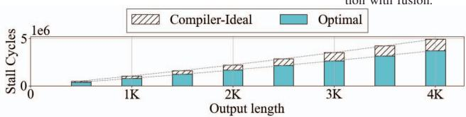
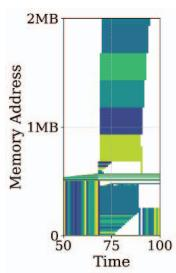
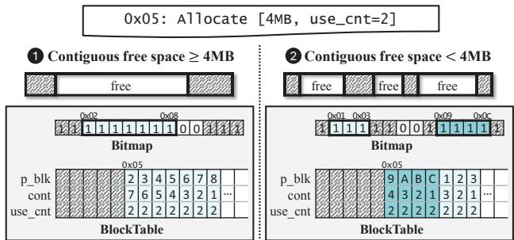
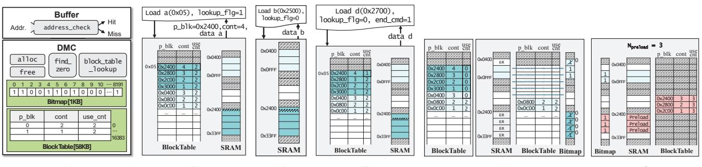
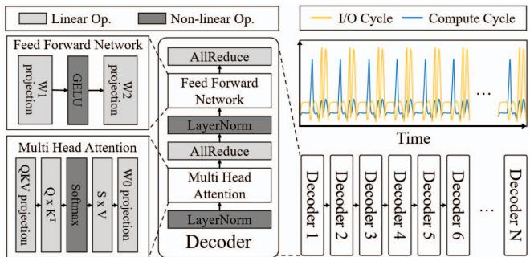

# SMOOTH: Hardware-Assisted Fine-Grained On-Chip Memory Management for Efficient On-Device LLM Inference 通俗讲解

### 0. 整体创新点通俗解读

**痛点直击**

先说清楚这篇论文真正憋不住的是什么。在手机 SoC 上跑 LLM，瓶颈根本不是算力，而是**内存带宽**：

- 解码阶段每生成一个 token，都要搬运巨大的权重矩阵，算的是 **GEMV**，操作强度极低，纯属“搬砖式” I/O；
- 但执行流程又在 Linear 算子（吃带宽）和 Softmax / GELU 这类非线性算子（吃算力、带宽闲着）之间**来回横跳**，带宽利用率呈现剧烈的**突发性**——忙的时候全堵死，闲的时候全空转；
- 现有编译器（XLA / TVM）确实做 tiling、算子融合、生命周期分析，但这些全是**编译期静态决定**的。问题是运行时的条件是活的：
  - 统一内存架构下，CPU / GPU 抢带宽，NPU 实际可用带宽随时波动；
  - 用户输入输出长度千变万化，静态选定的 tile size 一旦失配，延迟恶化最高 **2.9 倍**；
- 更要命的是**碎片化**：算子融合拉长了中间张量的生命周期，而传统 SPM 要求每个 tile 占据**一块物理连续**的 SRAM 区域。结果就是 SRAM 里到处是“用不了的小窟窿”——即使编译器有完美的生命周期信息（论文里的 Compiler-Ideal 假设），stall cycle 仍然比理论最优多出 **32.7%**。

一句话：**静态的、粗粒度的、要求连续的内存管理，撞上了动态的、突发的、碎片化的 LLM 访存行为**。这就是论文的靶心。

---

**通俗比方**

把 SRAM 想象成一家**后厨备菜台**，DRAM 是远处的冷库，厨师是计算单元：

- **编译器管 SPM**（老做法）：规定“每道菜的食材必须**整块连续**码在台面上”。前一道菜没彻底做完，那块地方就不能动。结果台面上到处是“这盘用完的边角料还占着一大块”的死区，新菜想提前备料（preload）也没地方放——冷库到备菜台的通道（带宽）在炒菜的间隙明明空着，却没人去搬东西；
- **硬件 Cache**（Capuchin 那类）：像眼神好的学徒，看你拿过什么就猜你还要什么。但它**不知道菜单**（未来的 tensor 生命周期），猜不准 LLM 这种低复用、形状多变的访存；
- **SMOOTH 的做法**：干脆把备菜台划成一个个**固定大小的小格子**（block，类似 OS 的分页，但虚拟地址空间和物理 SRAM 一样大，所以查表可以做得极轻）。食材不再要求连续摆放——哪几格空着就用哪几格，逻辑上相邻的数据物理上可以散落各处；
- 再配一个**眼里有活的领班**：每格食材上贴一个“还剩几道菜要用”的计数器（use_cnt），哪格食材用完最后一道菜，**当场收走、立刻擦台**（early reclamation），腾出的格子马上用来在带宽空闲时提前搬下一批食材。

---

**关键一招**

作者的巧妙之处不在于“发明了分页”——虚拟内存几十年前就有了——而在于做了三个精准的**扭转**：

- **把分配权从编译器手里“下放”给硬件，但没把编译器踢出局**。编译器依然做静态生命周期分析，但它的工作从“决定每块数据放哪”降级为“给数据打标签”（标注 use_cnt）。真正跑的时候，由 DMC（Dynamic Memory Controller）根据实时的碎片状况和带宽余量动态落位；
- **没让分页的查表开销毒害常见路径**。这是最关键的一招：block 级虚拟化本来有 TLB 式查表开销，但深度学习访存大多是**连续流式**的（矩阵逐块扫）。于是作者设计了一个 **address_check + 翻译旁路**机制——首次访问查一次表，拿到（物理地址， 连续块数）后缓存下来，后续落在连续区间内的访问**直接用物理地址，零查表**；只有跨块且下一块物理上不连续时才重新查表。也就是说：
  - 连续场景 → 退化为传统 SPM 的零开销行为；
  - 碎片场景 → 才启用 block 级翻译的灵活性；
  - **两种模式自动切换**，兼得鱼与熊掌；
- **把“什么时候释放内存”从软件信号改成硬件计数**。传统 SPM 要等软件显式 free，而 SMOOTH 让 buffer 逻辑跟踪 ISA 执行进度，识别“这是对本数据块的最后一次访问”，置一个 end_cmd 标志，DMC 立即递减 use_cnt、清 bitmap、回收格子——回收顺序上先改表再清位图，保证不会出现数据被新分配覆盖的竞态。腾出的空间立刻按空闲带宽预算（公式本质就是“空闲周期 × 可用带宽 ÷ 块大小”）去 preload 后续层的权重。

效果上，这套组合拳拿到了实打实的数字：

| 指标 | 相对基线的提升 |
|---|---|
| **TTFT** | 平均降 41.4%，最高 **59.2%**（vs Compiler-Ideal） |
| **TTLT** | 最高 **73.0%**（vs Gemmini），43.2%（vs Compiler-Ideal） |
| **能耗** | 平均最高降 **51.2%**（vs Gemmini） |
| **硬件开销** | 面积仅占 NPU 的 **0.0023%–0.095%**，功耗亚纳瓦级 |

而且注意一个反直觉的现象：**SRAM 越大或带宽越充裕，SMOOTH 相对基线的优势反而收窄**——这恰好反证了它的收益来源正是“碎片 + 带宽紧张”这对移动端特有的矛盾。论文的定位也因此非常克制：它不碰模型结构、不牺牲精度，纯粹在**微架构层**把移动 SoC 上被浪费的带宽松弛窗口捡回来，与量化、KV cache 优化等模型层技术完全正交、可叠加。

一句话总结：**编译器管“计划”，硬件管“执行”——SMOOTH 用几乎为零的硬件代价，把静态的连续分配扭转成了运行时的块级虚拟化 + 即时回收 + 带宽感知预取，专治 LLM 解码的突发 I/O**。

### 1. Block-level SPM虚拟化（硬件动态内存控制器）

**痛点直击**

先说清楚传统 SPM 到底“难受”在哪。LLM 推理在移动 SoC 上跑，SRAM 只有 2–8 MB，但编译器（XLA/TVM）管理 SPM 的方式非常“死板”：

- **必须连续分配**：编译器给每个 tensor/tile 分配一段物理上连续的 SRAM 地址，tile 动辄几十到几百 KB。
- **算子融合雪上加霜**：QKV fusion、FlashAttention、FFN fusion 把多个操作捆在一起，输入输出的 lifetime 互相重叠，导致 tensor 不能提前释放，SRAM 里到处是“锯齿状”的洞。
- **碎片 → 没法预取**：编译器想 preload 下一个 tile 时，必须同时满足三个条件——有带宽、有时间、**有一块足够大的连续空闲区**。碎片化之后，空闲内存明明总量够，但因为“不连续”，就是装不下。
- 结果就是论文里那个扎眼的数字：即使假设编译器拥有**完美 lifetime 信息**（Compiler-Ideal），4K token 场景下 stall cycle 仍比理论最优多 **32.7%**——这不是编译器笨，是**架构本身的天花板**。

上图就是碎片化的“案发现场”：地址空间随时间被 fuse 过的 tile 切得七零八落，后面再想塞大块数据就无能为力了。

---

**通俗比方**

这本质上就是**把操作系统的 virtual memory paging 搬进了片上 SRAM**，但搬得非常克制。

想象一个仓库（SRAM）：

- **老做法**：编译器像个强迫症管理员——每种货物必须**整整齐齐摆成一排连续货架**。运一批 4 MB 的货，就必须先清出一整条 4 MB 的连续通道。哪怕仓库里散落着 5 MB 的空位，只要不连续，对不起，这批货进不来，只能堆到仓库外面（off-chip DRAM），来回跑一趟又慢又费电。
- **SMOOTH 的做法**：把所有货物**拆成统一规格的小箱子**（固定大小的 block，比如 1 KB）。一批货可以**散放在仓库任何角落的空箱位**上，再配一本台账（**block table**）记录“第 N 箱货放在哪个物理位置”。这样，之前那些没人要的犄角旮旯，全都能利用起来。

但这里有个关键差异，也是 SMOOTH 比直接抄 OS paging 聪明的地方：

- OS 的虚拟地址空间远大于物理内存，所以需要多级页表、TLB 那一套重装备；
- 而 SMOOTH 的“虚拟空间”**被 SRAM 容量封顶**（数据全装不下就没意义），所以一块**直接映射的 block table + 一个 bitmap** 就够——台账薄到可以塞进硬件里，查一次只要 **615 ps**，功耗皮瓦级。

 *Fig. 10. Block-based on-chip memory allocation.*

上图正是这个“装箱”过程：4 MB 的请求，如果连续空间够（Case ①）就整段拿下；如果被碎片卡住（Case ②），就拆成 0x09–0x0C 加 0x01–0x03 两段拼起来。**逻辑上是完整的 tensor，物理上可以东一块西一块。**

---

**关键一招**

作者没有去改编译器算法，也没有堆更大的 SRAM，而是在**编译器和 SPM 之间塞了一个硬件中间层——DMC（Dynamic Memory Controller）**，把“分配的权力”从编译时移交到了运行时。具体扭转了三处：

- **分配方式替换**：编译器不再直接拿物理地址，而是拿虚拟地址；DMC 内部用 **bitmap 追踪所有物理 block 的占用状态**，用 `find_zero` 模块找最长空闲段，不够长就拆成多段散着放。**连续性约束被彻底解除。**
- **翻译开销的“双模式”规避**：每次访问都要查 block table 太亏。DMC 利用深度学习负载天然的**空间局部性**（矩阵乘法就是顺序扫描）：第一次访问查表后，把物理地址和连续长度（`p_blk, cont`）一并返回给 buffer 缓存；后续地址只要落在这段连续区间内，**直接走零开销的旁路**，不碰表。只有跨越 block 边界且物理不连续时，才重新查一次。这就是所谓的 translation-bypass fast path——**碎的时候有灵活性，顺的时候零开销**，两头的好处全占了。
- **回收时机的扭转（早回收）**：传统方案要等编译器发出显式的 free 信号；SMOOTH 让硬件用 `use_cnt`（编译器静态标注的剩余使用次数）自己数数——buffer 发出最后一次访问时置位 `end_cmd`，DMC 立刻把计数减一，归零即回收。**空间腾出来一秒，就能提前一秒去 preload 下一个 tile**，把非线性算子（Softmax/GELU）期间的空闲带宽全吃掉。

| 维度 | 传统编译器 SPM | SMOOTH (Block-level 虚拟化) |
|---|---|---|
| 分配粒度 | Tensor/Tile（几十–几百 KB） | 固定 block（~1 KB） |
| 物理布局 | 必须连续 | 可离散，block table 映射 |
| 地址翻译 | 无（本身就是物理地址） | 首次查表 + 连续区旁路 |
| 回收时机 | 编译器显式释放 | 硬件 `use_cnt` 归零即刻回收 |
| 预取触发 | 需大块连续空闲区 | 任意零散空闲 block 即可 |
| 硬件代价 | 0 | 面积 **0.095%**，功耗亚 nW 级 |

一句话总结这招的精髓：**用 OS paging 的思想解决碎片化，但用“虚拟空间 = 物理容量”这个约束把整套机制砍到硬件能扛的重量**——于是既能精细装箱，又不为灵活性付出翻译税。最终 Compiler-Ideal 上那 32.7% 的碎片税，就被这块小小的 DMC 消化掉了，换来的就是论文里 TTFT 最多 **59.2%**、TTLT 最多 **73.0%** 的延迟削减。

### 2. 双模式地址翻译（连续区域查表旁路快路径）

**一、痛点直击 (The "Why")**

SMOOTH 搞**块级虚拟化（block-level virtualization）**，本质上是把 SPM 切成固定大小的块，用一张**直映射 Block Table** 做逻辑地址→物理地址的翻译。这个设计解决了 fragmentation，但它引入了一个新麻烦：

- 每次访问数据都要先查一遍 Block Table，就像每次回家都要先去物业查一遍“你家的门牌号对应哪个物理房间”；
- 而 LLM 推理里恰恰有海量的**顺序访问**：GEMV 操作里，一个 input vector 要连续扫过整个 weight matrix 的 Q/K/V projection，这些访问是**地址连续、成千上万次**的；
- 如果每次都老老实实查表，翻译开销会被访问次数放大——块切得越细（论文里小到 1 KB 甚至更小），查表次数越多，**碎片化的收益就被查表的税吃掉了**。

这就成了一个两难：**块切细 → 抗碎片但查表贵；块切粗 → 查表便宜但碎片回来了**。

**二、通俗比方 (The Analogy)**

 *Fig. 12. (a) Design component of SMOOTH. (b) Access with address translation. (c) Direct access without block table lookup. (d) Access with end\_cmd for early reclamation. (e) Reclaim blocks that ensure data integrity. (f) Preload data into reclaimed blocks using idle bandwidth.*

这个设计其实就是**虚拟内存里的 TLB 思想，但做得更极端**：

- 传统 OS 里，VA→PA 每次都走 Page Table 会慢死，所以发明了 TLB 缓存“最近查过的翻译结果”；
- 但 SMOOTH 连 TLB 都嫌多余，因为它发现了一个 OS 世界里不成立的额外先验：**DL workload 里，一旦一段数据被分配到连续的物理块上，后续访问会大概率一直连续走下去**（因为 GEMM/GEMV 本来就是顺序流式访问矩阵）。

所以更贴切的比方是**导航 App 的“沿当前道路直行”逻辑**：

- 你问一次导航“去 XX 怎么走”，它给你算一条路线（相当于查一次 Block Table）；
- 但在你还没拐弯之前，导航不会每次前进一步就重新算一遍路线——它知道你会**沿路直行**，直接保持静默；
- 只有当你**跨过了路口（block boundary）**，它才重新介入算下一段。

SMOOTH 的 buffer 就是这个导航：它缓存了 `(p_blk, cont)` 这对信息——“物理起点在哪、还能直行几个块”——在 `cont` 覆盖范围内，**所有后续访问直接用物理地址，查表整个被旁路（bypass）掉**。

**三、关键一招 (The "How")**

作者没有去优化查表本身（比如做更大的 table 或更 fancy 的缓存结构），而是**釜底抽薪地消除了“需要查表”这个前提**。具体的逻辑转换是：

- **传统流程**：每次内存请求 → 查 Block Table → 拿到物理地址 → 访问。翻译是**每次访问的前置步骤**；
- **SMOOTH 流程**：把翻译从“每访问一次”降级为“**每跨越一次块边界才触发**”。具体做了三件事：
  - **首次访问**时查一次表，DMC 顺手把 `(p_blk=物理块地址, cont=连续块数)` 随数据一起**回传给 buffer**，buffer 把它缓存住；
  - buffer 内部有一个轻量的 **address_check 模块**（论文里综合结果显示延迟仅 **83.7 ps**，是五个模块里最快的），它只盯着地址里对应 block boundary 的那几个 bit（比如 1 KB 块就盯第 10 位）——bit 没翻转，说明还在同一个块里，**物理地址直接 +偏移量**就完了，零查表；
  - 一旦地址跨过块边界、且缓存的 `cont` 计数耗尽（说明物理上不连续了），buffer 才重新拉高 **lookup flag**，再发起一次翻译请求。

这样，“查表开销”从 **O(访问次数)** 被压到了 **O(不连续段数)**——而 LLM 推理恰好是“大部分时间连续、偶尔碎片”的访问模式，所以：

- **连续场景**（常态）：表现和传统裸 SPM 一样，零翻译开销，保留了 coarse-grained SPM 的速度优势；
- **碎片场景**：退化为逐块查表，但换来了把数据塞进散落空隙的能力。

**一句话总结**

- 这是一个**“按需付费”的混合设计**：灵活性（块级虚拟化）本来是要交查表税的，作者通过让 buffer 记住“还能连续走多远”，把这笔税**只在真正遇到碎片时才收**；
- 论文里的量化佐证：即使把块切小到 512 B，这套 lookup flag 机制使得控制开销**保持在 0.1% 以下**（Fig. 21a 中标注的 overhead 数据），而地址翻译的快路径本身贡献了约 **0.2%** 的延迟削减——说明这个 bypass 不是锦上添花，而是让细粒度方案“活得下去”的前提条件。

### 3. 硬件驱动的早期内存回收（use_cnt / end_cmd信号机制）

**痛点直击 (The "Why")**

- 传统的 SPM（Scratchpad Memory）回收，靠的是**编译器在编译期估算的“生命周期”**（lifetime analysis）。编译器只能保守地说：“这个 tensor 可能要到第 N 步才用完，那我第 N 步之后再释放它。”
- 问题是，这个估计**几乎总是偏晚**。LLM 推理的实际执行时间受运行时状态影响极大——内存带宽被 CPU/GPU 抢了多少、实际的算子执行快慢——编译器根本无法预知。
- 结果就是：**数据明明已经被消费完了，占着的 SRAM 块却迟迟不释放**。这带来两个连锁恶果：
  - SRAM 里躺着一堆“僵尸块”，新数据想预载（preload）进来却没空间，只能等。
  - 瞬时出现的带宽空闲窗口（compute 阶段那几十个 cycle）白白溜走——想提前搬下一层数据，可惜**内存腾不出来**。
- 一句话总结：编译器是“事后诸葛亮”，回收永远慢半拍，导致 **preloading 的时机被卡死**。

---

**通俗比方**

- 想象一家餐厅的传菜台。编译器版的规矩是：“每个盘子必须按预定的‘用餐时长’计时，时间到了才收走。”哪怕客人五分钟就吃完了，服务员也要等到预定的半小时才敢收盘子——因为规则就是这么定的，服务员不敢赌。
- 结果呢？传菜台（SRAM）堆满了空盘子，后厨的新菜（要 preload 的下一层权重）端不上来，客人干等。
- **SMOOTH 的做法**：干脆不要服务员按时间表收盘，而是**在每个盘子上装个计数器**。厨师的菜分给几张桌子用，计数器就记几个数；每张桌子动过一次这个盘子，计数器减一；**减到零的瞬间，盘子立刻被收走**。谁消费完了谁触发回收，精确到“这一口”。
- 更妙的是，收盘子的不是人（软件），而是传菜台自带的机械装置（硬件逻辑），**零延迟、零开销**。

---

**关键一招**

- 作者没有去改进编译器的生命周期估计（这条路是死路，运行时信息编译器根本拿不到），而是**把“判断数据是否用完”这件事的权威，从编译期完全移交给了运行时的硬件**。
- 具体的逻辑替换分两步：

- **第一步：编译器只“计数”，不再“定时”**
  - 编译器不再输出“这块内存在第 X 步后释放”这样的时间表。
  - 它只标注一个静态信息：**这个 buffer 会被几个后续操作消费**，写进 Block Table 的 **use_cnt** 字段。比如一个 Q projection 的输出，后面会被 attention 用 2 次，就标 use_cnt = 2。
  - 这是一种**编译期与运行期的职责分离**：编译器负责“知道有多少个消费者”（这是它看得见的静态信息），硬件负责“知道消费者什么时候真的消费完”（这只有运行时才知道）。

- **第二步：buffer 发出 end_cmd 信号，硬件即时回收**
  - 执行 ISA 指令的 **buffer 端逻辑**知道自己操作的访问模式和数据规模，因此它能判断出**哪一次访问是对某个块的“最后一次访问”**。
  - 在发起这次最后的内存加载请求时，buffer 顺势**拉高 end_cmd 信号**（一比特，几乎零成本）。
  - DMC（Dynamic Memory Controller）收到信号后，立刻对 Block Table 中对应的 use_cnt **做减一操作**。
  - 一旦 use_cnt 减到零——意味着所有消费者都已消费完毕——硬件**立刻、自动地**执行回收：
    - 先更新 Block Table，把该块标记为不再使用；
    - 再清除 bitmap 中对应的分配位（这个顺序保证了数据完整性，防止新分配覆盖还在被读的数据）。
  - 回收完成后，DMC 马上把腾出的空间用于 preload，利用的正是公式 $N_{preload} = \lfloor (U \times BW) / Block\_size \rfloor$ 计算出的空闲带宽预算。

 *Fig. 12. (a) Design component of SMOOTH. (b) Access with address translation. (c) Direct access without block table lookup. (d) Access with end\_cmd for early reclamation. (e) Reclaim blocks that ensure data integrity. (f) Preload data into reclaimed blocks using idle bandwidth.*

- 上图中的 至 就是这套机制的完整时序：**(d)** buffer 发出带 end_cmd 的最后一次访问 → **(e)** DMC 确认 use_cnt 归零并安全回收块 → **(f)** 立即用空闲带宽把未来要用的数据（如 W1₁）preload 进刚释放的块里。

**为什么这招“便宜”且“快”**

- 信号本身就是**搭便车**：end_cmd 不是一条额外的指令，而是寄生在“本来就要发起的最后一次访存请求”上的一个 flag。
- 回收逻辑全部由轻量硬件模块（free 模块）完成，论文实测其延迟仅 **654.6 ps**、功耗亚纳瓦级——相对毫秒级的推理延迟，完全可以忽略。
- 与编译器方案的对比可以直观概括为：

| 维度 | 编译器生命周期分析 | SMOOTH 硬件早期回收 |
|---|---|---|
| 回收时机 | 编译期静态估计，偏晚 | 运行时消费完毕即刻触发 |
| 判断依据 | 保守的“最坏情况”时间表 | **use_cnt 归零**的精确事实 |
| 释放延迟 | 等到静态边界，可能滞后数百 cycle | **end_cmd** 当拍触发，近零延迟 |
| 对 preloading 的影响 | 空间释放慢，错过带宽空闲窗口 | 空间即时腾出，抓住每个空闲窗口 |

- 这就是论文里 SMOOTH-ER 相比 SMOOTH-Base 仍能多拿到 **11.1%～47.0%** ITL 改善的核心来源：**块分配解决了“放得下”的问题，早期回收解决了“放得早”的问题**——两者合起来，才真正把 compute 阶段那些转瞬即逝的带宽空闲变成了实打实的性能。

### 4. 带宽感知的细粒度硬件预加载调度

**痛点直击 (The "Why")**

先想清楚一个根本矛盾：LLM 解码阶段是典型的**“抽风式”访存模式**——计算时（Softmax、GELU 这类高 OI 操作）内存带宽大量闲置，读权重时（GEMV）带宽瞬间被打满，计算单元干等。理想策略很明确：**趁带宽闲着的时候，提前把后面的权重搬进 SRAM**。但传统编译器做这件事时会“很难受”：

- **编译期是瞎子**：编译器只能静态估计“什么时候带宽会闲”，但移动 SoC 上 CPU/GPU 同时在抢内存，实际可用带宽每毫秒都在抖动，静态计划表瞬间过期。
- **预加载的触发条件太苛刻**：传统方案要求“带宽空闲 + 有足够时间搬完一整块连续 tile + SRAM 里有足够大的连续空位”三个条件同时满足才发起。碎片一多，第三条几乎永远不成立，结果就是眼睁睁看着空闲带宽浪费掉。
- **粒度太粗**：就算条件满足，也是以几十到几百 KB 的 tile 为单位搬运。碎片化的空隙塞不下一整块 tile，只好放弃。

 *Fig. 1. Execution flow of a transformer decoder on a mobile SoC, where high-OI operations and low-OI operations alternate, resulting in bursty memory traffic and off-chip DRAM bottlenecks.*

---

**通俗比方**

把这想象成**自助餐厅的传菜员**：

- **编译器方案**是按菜单排班：传菜员拿着一张提前打印好的时刻表，规定“12:05 上一整桌菜”。但餐厅实际客流随时变，时刻表很快失灵；而且后厨窗口（SRAM 空位）是按“整桌”预留的——哪怕窗口只剩能放三盘菜的空间，也绝不上菜。
- **SMOOTH 的 DMC** 则是站在现场盯着盘子看的领班：
  - 他不看时刻表，而是**实时观察**——“现在后厨到大厅的通道（带宽）有多空？客人还有多久吃完（计算还需多久）？”
  - 他的判断逻辑就一句话：**“空闲时间 × 当前实测带宽 = 我还搬得动多少菜，能塞几盘就先端几盘”**。
  - 菜是按**盘（block）**为单位上的，不要求整桌；窗口里有三个空位就先端三盘，绝不浪费任何一次往返。

关键洞察在于：这个决策**不需要精确预测未来**，只需要知道“现在还剩多少运输能力”——这两个量硬件都能直接测到。

---

**关键一招**

作者没有去改进编译器的预测能力（那条路已被证明走不通），而是**把“预加载时机和数量”的决策权，从编译期整个搬到了运行时的硬件里**：

- **决策位置的转移**：编译器不再决定何时预加载、预加载多少，只负责提供“这块数据未来还会被读几次”（`use_cnt`）这种**静态生命周期标注**；真正“现在搬不搬、搬多少”由 DMC 在运行时自主判断。
- **核心逻辑转换**：预加载单位从“tile（必须连续、必须整块）”降为“block（固定大小、可散落存放）”。这样一来，**碎片不再是预加载的障碍**——三个小空隙加起来也够塞几块数据。
- **公式背后的直觉**：`N_preload = floor((U × BW)/Block_size)` 中，**U 是当前空闲计算周期数**（硬件数出来的），**BW 是实测可用带宽**（硬件动态探测的，不是标称值）。乘积就是“这波空窗期总共能搬多少字节”，除以 block 大小就是块数。每来一个空闲窗口就重新算一次，天然适应带宽波动。
- **闭环保障**：`use_cnt` 归零的 block 被**硬件驱动地提前回收**（不用等软件显式释放），回收顺序严格先改表再清 bitmap，防止新分配覆盖未读完的数据；预加载进度存进寄存器，buffer 访问时先查寄存器——数据到了直接读 SRAM，没到就从 DRAM 取，无缝衔接。

**一句话总结**：传统方案是“计划经济”——预测失效就全面瘫痪；SMOOTH 是“市场经济”——每个空闲瞬间，硬件用两个实时测量值（空闲时间 × 实测带宽）现场定价，能搬多少搬多少。预测不准没关系，因为**它压根不依赖预测**。
