# SMOOTH: Hardware-Assisted Fine-Grained On-Chip Memory Management for Efficient On-Device LLM Inference 论文解析

## 0. 论文基本信息

**作者 (Authors)**: Seulki Kim, Hwanjun Lee, Bokyeong Kim, et al.

**发表期刊/会议 (Journal/Conference)**: ISCA

**发表年份 (Publication Year)**: 2026

**研究机构 (Affiliations)**: DGIST, Samsung Research, Yonsei University

---

## 1. 摘要

**目的**

- 解决 **LLM 在移动 SoC 上进行 on-device inference** 时面临的严峻内存与带宽瓶颈问题。移动端 SRAM 容量有限（仅 **2–8 MB**），LPDDR5 带宽低（**13–34 GB/s**），而 decoder 式 LLM 推理以 **I/O-bound 的 GEMV** 操作为主，导致性能严重受限。
- 揭示现有 **compiler 驱动的静态 SPM（Scratchpad Memory）管理** 的根本缺陷：
  - 编译期 tiling、lifetime-based allocation、operator fusion 均为**静态决策**，无法适应运行时的动态变化（如 KV cache 尺寸、统一内存架构下的带宽波动、CPU/GPU 并发竞争）。
  - **粗粒度 tile 级分配**（数十至数百 KB）要求物理连续空间，叠加算子融合延长 buffer 生命周期，造成严重 **fragmentation**。
  - 实验量化显示：静态 tile 尺寸与运行时条件不匹配可使延迟劣化 **最高 2.9×**；即使是具备完美 lifetime 知识的 **Compiler-Ideal** 基线，在 4K tokens 下仍因碎片化多产生 **32.7% 的 stall cycles**。
- 提出硬件辅助的细粒度片上内存管理方案 **SMOOTH（SMOothing I/O Traffic with Hardware support）**，在运行时动态优化 SPM 使用，填补静态编译器无法利用的瞬态带宽空隙。

---

**方法**

- **核心架构：基于 Dynamic Memory Controller（DMC）的 block 级 SPM 管理**，解耦逻辑 tensor 组织与物理 SRAM 布局：
  - **细粒度 block 分配**：采用固定大小 block（类似虚拟内存 paging，但虚拟地址空间以 SRAM 容量为界），消除外部碎片；通过 **find_zero** 模块寻找最长空闲区间，**alloc** 模块支持将请求拆分到多个非连续物理区域。
  - **低开销地址翻译**：使用 **direct-mapped block table**（含 p\_blk、cont、use\_cnt 字段）与 **bitmap** 空闲列表；**address\_check** 模块在空间局部性保持（连续访问）时直接以物理地址访问，绕过表查询，实现双模式混合设计。
  - **硬件驱动的早期回收**：buffer 通过追踪 ISA 执行进度，在最后一次访问时置 **end\_cmd** 标志，DMC 递减 **use\_cnt**；计数归零的 block 即刻回收并立即触发预加载，无需等待软件释放信号。
- **带宽感知预加载**：空闲周期内按公式 `N_preload = ⌊(U × BW) / Block_size⌋` 决定预加载 block 数量（U 为空闲计算周期，BW 为硬件实时测得的可用带宽），利用 bursty 流量中的瞬态带宽空隙。

 *Fig. 12. (a) Design component of SMOOTH. (b) Access with address translation. (c) Direct access without block table lookup. (d) Access with end\_cmd for early reclamation. (e) Reclaim blocks that ensure data integrity. (f) Preload data into reclaimed blocks using idle bandwidth.*

- **实现与评估平台**：
  - 硬件逻辑以 **Verilog** 实现，使用 **Yosys** + **ASAP7 7nm** 标准单元库综合，评估面积/时序/功耗开销。
  - 集成进 **LLMCompass**（ScaleSim 的 LLM 优化扩展）进行 cycle-accurate 仿真，模拟 Qualcomm Hexagon V73 类移动 NPU 配置。
  - 通过三星 Galaxy S24 Ultra、Galaxy S25+（Snapdragon 8 Elite）、Google Edge TPU、NVIDIA Jetson AGX Orin（配置为 **Constrained-SoC**：EMC 限频 512 MHz / 32 GB/s，GPU 714 MHz）进行真机 profiling 验证。
- **对比基线**：**Compiler-Ideal**（理想化静态编译器策略）、**Capuchin**（硬件 cache 管理 + cache-line 级 prefetch）、**Gemmini**（流水线化 tile 重叠）、以及本文的 **SMOOTH-Base**（block 分配）与 **SMOOTH-ER**（block 分配 + 早期回收）。

---

**结果**

- **总体性能提升**（8 MB SRAM，batch size 1）：

| 指标 | 对比基线 | 提升 |
|---|---|---|
| **TTFT** | Compiler-Ideal | 平均降低 **41.4%**，最高 **59.2%** |
| **TTLT** | Compiler-Ideal | 平均 **43.2%**，最高 **60.0%** |
| **TTLT** | Gemmini | 平均 **49.1%**，最高 **73.0%** |
| **TTLT** | SMOOTH-Base | 平均最高 **24.0%** |
| **能量消耗** | Gemmini | 平均降低 **51.2%**（32K 长度下高达 **70.7%**） |
| **能量消耗** | Compiler-Ideal / Capuchin | 平均 **44.0%** / **39.9%** |

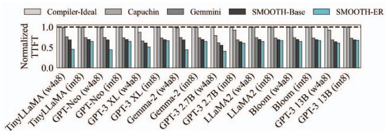

- **动态运行时因素下的鲁棒性**：
  - **带宽敏感性**（16–128 GB/s）：带宽越受限，SMOOTH-ER 收益越大；ITL 相对 Compiler-Ideal 平均降低 **40.0%**，相对 SMOOTH-Base 平均 **11.1%**（最高 47.0%）。
  - **并发干扰**（Geekbench CPU/GPU co-run，64 GB/s）：ITL 相对 Compiler-Ideal 仍获得平均 **42.7%** 提升，验证了其在波动带宽下的有效性。
  - **长输入序列**（2K–32K）：相对 Gemmini 的增益从 **50.1% 稳步扩展至 66.8%**，最高达 **73.0%**，有效缓解长上下文 KV cache 带来的内存压力。
- **Block 尺寸与 SRAM 敏感性**：
  - Block 尺寸通常设为 model dimension；若与 tile 尺寸未对齐，内部碎片可致延迟劣化 **最高 9.9%**。
  - SRAM 为 2 MB（容量过小限制预加载）或 32 MB（碎片减少使静态方案受益）时增益有所下降，**8 MB 为收益最显著区间**。
- **硬件开销可忽略**：
  - 计算逻辑面积仅占估算 NPU 面积的 **0.0023%**，内存控制逻辑 **0.095%**（基于 ASAP7 综合结果）。
  - 各模块延迟范围为 **83.7–1508.2 ps**，功耗处于亚纳瓦级别（pW 量级）；控制开销在所有实验中**低于总延迟的 0.1%**，32K 序列下额外能耗峰值仅 **15 nJ**。
- **评估模型覆盖**：TinyLLaMA (1.1B) 至 GPT-3 13B 共 8 个模型，均采用 **w4a8/int8** 量化。

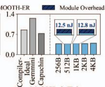

---

**结论**

- SMOOTH 通过 **block 级 SPM 虚拟化**（结合连续区域翻译旁路的零开销快速路径）与 **基于 buffer 级运行时信号的硬件驱动早期回收**，首次实现了支持细粒度 block 放置与运行时驱动回收的 SPM 架构——这两项特性是 LLM workload 所必需、但所有先前 SPM 设计均缺失的。
- 该方案在不修改模型参数、不引入精度损失的前提下，将 bursty 的 load/store 请求在时间上平滑化，显著改善移动 SoC 上 LLM 推理的 **TTFT、TTLT 与能耗**，且增益随序列长度与内存受限程度增大而扩大。
- **硬件开销可忽略不计**（面积 <0.1%、时序亚纳秒级），具备实际部署可行性；与模型级压缩技术（quantization、pruning、KV cache 优化）**正交互补**，可叠加使用。
- 未来工作方向包括：更紧密的 compiler-hardware 协同调度（联合 lifetime 分析）、向异构加速器池的扩展，以及面向多租户/流式场景的 contention-aware 策略。

---

## 2. 背景知识与核心贡献

**研究背景**

- 大语言模型在端侧部署需求激增：实时响应与用户隐私推动 LLM 在移动设备上直接推理，但移动 SoC 的硬件约束远比服务器严苛。
- 移动平台资源瓶颈突出：
  - 片上 SRAM 容量有限（**2–8 MB**）。
  - LPDDR5 带宽低下（**13–34 GB/s**）。
  - batch size 为 1，计算单元利用率天然偏低。
- LLM 推理的固有特性加剧瓶颈：
  - 自回归解码阶段在线性算子（GEMV，如 QKV 投影）与非线性算子（Softmax、GELU）间反复交替。
  - GEMV 属于 **Low-OI**（低操作强度）的 I/O-bound 阶段，需搬运大权重矩阵，带宽瞬间饱和。
  - 非线性算子属于 **High-OI** 的 compute-bound 阶段，带宽大量闲置。
  - 两者交替导致**高度突发性的内存流量**，资源利用率长期偏低。

 *Fig. 1. Execution flow of a transformer decoder on a mobile SoC, where high-OI operations and low-OI operations alternate, resulting in bursty memory traffic and off-chip DRAM bottlenecks.*

---

**研究动机**

- 静态编译器优化（如 XLA、TVM 的 tiling、算子融合、基于 lifetime 的内存分配）在动态运行时条件下失效：
  - **系统级带宽波动**：统一内存架构下，CPU/GPU 并发负载（如 Geekbench）导致 NPU 可用带宽动态变化，静态 tile size 无法匹配。
  - **负载级带宽波动**：输入/输出 token 长度跨请求差异巨大，静态编译器为单一 prompt 重新优化执行图在边缘处理器上可耗时高达 **11.5 秒**，无法覆盖所有运行时情况。
  - tile size 选择不当可使推理延迟退化最高 **2.9×**。
- 粗粒度 SPM 管理导致严重碎片化：
  - 传统 SPM 以 tensor/tile 级（数十至数百 KB）连续分配，历史上因 CNN 规则的 tile 形状而够用。
  - LLM 的算子融合（QKV fusion、FlashAttention、FFN fusion）延长了中间缓冲区生命周期，产生大量碎片化的不可用 SRAM 空隙，甚至引发 off-chip spill。
- 预加载策略受限：静态编译器需同时满足带宽可用、有充足时间取整块连续 tile、存在足够大连续空闲区三个条件，碎片化使预加载频繁受阻，短暂时段的带宽空闲窗口无法被利用。
- 关键量化证据：即使是假设拥有完美 lifetime 知识的 **Compiler-Ideal** SPM，相较可字节级放置数据的 Optimal 上界，在 4K token 时仍多产生 **32.7%** 的 stall cycles——证明这是架构层面的根本缺陷，而非具体编译器的实现问题。

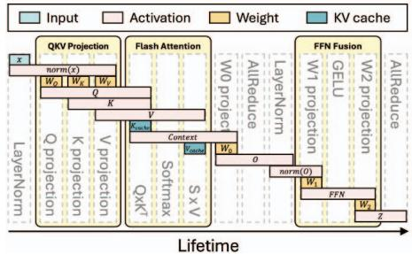

---

**核心贡献**

- **问题表征**：系统量化了移动 LLM 推理中的内存低效根源——突发内存需求、粗粒度编译决策导致的带宽空闲浪费与碎片化，以及统一内存架构下动态带宽与可变序列长度使静态 tile size 严重次优（延迟退化最高 2.9×）。
- **揭示静态 SPM 的根本局限**：通过 compiler-ideal 实验证明，即使是假设完美的静态分配器也无法适应运行时变化，碎片化额外引入高达 **32.7%** 的 stall cycles。
- **提出 SMOOTH 架构**：硬件辅助、运行时感知的 SPM 管理框架，核心机制包括：
  - **块级 SPM 虚拟化**：以固定大小 block 为粒度管理，解耦逻辑 tensor 组织与物理 SRAM 布局，消除外部碎片；配合 direct-mapped block table 与 bitmap 空闲列表实现轻量地址翻译。
  - **双模式快速路径**：连续区域通过 address_check 模块直接访问、绕过表查询，保留传统 SPM 的零开销特性；仅在跨块且物理不连续时回退到 block table 查找。
  - **硬件驱动早期回收**：基于 buffer 层的 end_cmd 信号与硬件管理的 use_cnt 计数，在数据消费完毕后即刻回收 block，无需等待软件释放，从而支撑更激进、及时的预加载。
  - **带宽感知预加载**：利用空闲带宽按公式 `N_preload = ⌊(U × BW) / Block_size⌋` 动态决定预取块数，平滑 I/O 突发流量。
- **实验验证**：基于 LLMCompass（ScaleSim 的 LLM 扩展）做 cycle-accurate 评估，RTL 以 Verilog 实现并经 Yosys + ASAP7 综合验证开销可忽略（计算逻辑仅占 NPU 面积 **0.0023%**，功耗为亚纳瓦级）。主要性能收益：

| 指标 | 相对基线 | 提升幅度 |
|---|---|---|
| TTFT | Compiler-Ideal | 平均降低 41.4%，最高 **59.2%** |
| TTLT | Compiler-Ideal / Gemmini | 平均 43.2% / 49.1%，最高 **73.0%** |
| 能耗 | Compiler-Ideal / Gemmini / Capuchin | 平均最高 **51.2%**（对 Gemmini，32K 序列达 70.7%） |
| ITL（带宽受限场景） | Capuchin / Compiler-Ideal | 平均 30.5% / 40.0% |

- **与相关工作的本质区别**：
  - 区别于 NVIDIA TMA 等固定功能搬运引擎——SMOOTH 支持块级虚拟化，可利用非连续碎片空间。
  - 区别于 Capuchin、Amoeba-Cache 等纯硬件方案——SMOOTH 结合编译器 lifetime 分析实现主动式回收与预加载，而非被动响应历史访问模式。
  - 不修改模型表示，与量化、剪枝、KV cache 优化等模型级压缩技术**正交可叠加**，无精度损失。

---

## 3. 核心技术和实现细节

### 0. 技术架构概览

**核心定位**

SMOOTH（**SMOothing I/O Traffic with Hardware support**）是一个面向**移动 SoC 上 on-device LLM 推理**的硬件辅助片上内存管理框架，其核心目标是解决 autoregressive decoding 中 **compute-bound 与 I/O-bound 阶段交替**所导致的突发性内存流量（bursty memory traffic）和 SRAM 碎片化问题。该框架将传统上由编译器静态承担的复杂内存调度任务，转移至运行时硬件 **DMC（Dynamic Memory Controller）**，形成“编译器提供静态生命周期标注 + 硬件执行动态分配与释放”的软硬件协同设计。

---

**整体架构组成**

SMOOTH 架构建立在硬件 DMC 之上，围绕三大设计原则构建：

- **Fine-grained Block Allocation（细粒度块分配）**：
  - 以**固定大小 block**（类似虚拟内存中的 paging，典型如 1 KB）取代传统可变尺寸 tile 的分配方式
  - 逻辑 tensor 组织与物理 SRAM 布局**解耦**，逻辑相邻的 tensor 可使用**非连续物理内存**，从根本上消除 external fragmentation
  - 通过 **bitmap** 追踪所有物理 block 的占用状态，简化 free-space 搜索硬件逻辑

- **Low-overhead Address Translation（低开销地址转换）**：
  - 采用 **direct-mapped block table** 完成编译器可见逻辑地址到物理 SRAM 地址的转换
  - 引入 **address_check** 模块利用空间局部性：对连续映射区域**跳过表查询**（translation bypass），实现双模式混合设计——碎片化场景走 block-virtualized 模式，连续访问场景走零开销快速路径
  - Block table 每项记录三个字段：**p_blk**（物理 block 地址）、**cont**（连续 block 数量）、**use_cnt**（编译器推导的剩余使用计数）

- **Hardware-driven Early Reclamation（硬件驱动早期回收）**：
  - 不依赖软件显式释放信号，而是由硬件自主追踪 block 使用情况
  - 缓冲区在最后一次访问某 block 时置起 **end_cmd** 标志，DMC 据此递减 **use_cnt**，数据消费完毕即刻回收
  - 严格遵循“先更新 block table 状态、再清除 bitmap 条目”的顺序，确保数据完整性

 *Fig. 12. (a) Design component of SMOOTH. (b) Access with address translation. (c) Direct access without block table lookup. (d) Access with end\_cmd for early reclamation. (e) Reclaim blocks that ensure data integrity. (f) Preload data into reclaimed blocks using idle bandwidth.*

上图展示了架构的核心微结构，以及六种典型访问场景： 地址翻译访问、 免查表直接访问、 携带 **end_cmd** 的访问、 确保 data integrity 的安全回收、 利用 idle bandwidth 的预加载。

---

**四个轻量级硬件模块**

DMC 内部由四个功能模块构成，形成完整的 block 生命周期管理闭环：

- **find_zero**：识别最长连续空闲区域，用于分配决策（碎片化时多次搜索以拼装非连续 block 集合）
- **alloc**：预取并分配 block，更新 bitmap 与 block table
- **free**：回收 **use_cnt** 归零的过期 block
- **block_table_lookup**：解析逻辑到物理的地址映射

---

**运行时工作流程**

- **分配阶段**：编译器发出带虚拟地址与 **use_cnt** 的分配请求 → DMC 检查 bitmap → 若存在足够大的连续空闲区则直接映射；若碎片化则通过 **find_zero** 依次搜索多个最长连续区域进行拼接式分配
- **访问阶段**：首次访问带 lookup flag，DMC 返回 **(p_blk, cont)** 元组 → buffer 缓存该连续区间信息 → 后续连续地址访问直接用物理地址，**跨 block 边界且下一 block 非物理连续时**才重新发起翻译请求
- **回收与预加载阶段**：DMC 在空闲周期周期性检测 **use_cnt=0** 的 block → 安全回收后立即利用 idle bandwidth 预加载后续数据，预加载数量由公式确定：

$$N_{preload} = \lfloor (U \times BW) / Block\_size \rfloor$$

  - 其中 **U** 为可用空闲计算周期，**BW** 为硬件运行时动态测得的可用内存带宽
  - DMC 记录最后预取的 block 索引于寄存器中，buffer 访问时据此判断数据已在 SRAM 还是需从 main memory 获取

---

**硬件开销**

基于 Yosys 综合与 ASAP7 7 nm 标准单元库的评估显示开销可忽略：

| 维度 | NPU | SRAM | Compute 逻辑 | Memory 控制逻辑 |
|---|---|---|---|---|
| 面积 (μm²) | 13,730,000 | 1,811,939 | 314 | 13,050 |
| 相对占比 | — | 13.2% | **0.0023%** | **0.095%** |

各模块时延均在皮秒量级、功耗在皮瓦量级，控制开销在全部实验中**低于总时延的 0.1%**，且已计入最终评估结果。

---

**评估与实现载体**

- SMOOTH 的 RTL 以 **Verilog** 实现，并集成至 **LLMCompass**（ScaleSim 的 LLM 优化扩展）进行 cycle-accurate 仿真
- 目标硬件配置对标 **Qualcomm Hexagon V73** 类移动 NPU 与 **LPDDR5** 内存：940 MHz 核心频率、32×32 Matrix Engine、32-lane Vector Engine、SRAM 覆盖 2/8/32 MB、DRAM 带宽覆盖 16–128 GB/s
- 与 **Compiler-Ideal**、**Capuchin**、**Gemmini** 三类基线对比，SMOOTH-ER（含 early reclamation）实现 TTFT 最高降低 **59.2%**、TTLT 最高降低 **73.0%**、平均能耗最高降低 **51.2%**

### 1. Block-level SPM虚拟化（硬件动态内存控制器）

**核心定位**

**Block-level SPM虚拟化**是SMOOTH架构的基石，其本质是将物理SRAM划分为**固定大小的块**，通过硬件**Dynamic Memory Controller (DMC)**在编译器可见的逻辑地址与物理SRAM地址之间建立一层轻量级的翻译与调度机制。该设计打破了传统编译器驱动SPM管理中**“张量必须连续映射到物理SRAM”**的刚性约束，使逻辑上相邻的tensor数据可以分散放置于**非连续的物理块**中，从而消除外部碎片、释放被浪费的SRAM容量，并为**激进的预加载** 创造空间条件。

 *Fig. 12. (a) Design component of SMOOTH. (b) Access with address translation. (c) Direct access without block table lookup. (d) Access with end\_cmd for early reclamation. (e) Reclaim blocks that ensure data integrity. (f) Preload data into reclaimed blocks using idle bandwidth.*

---

**实现原理：类分页的块虚拟化机制**

- **设计灵感来源**：借鉴操作系统**虚拟内存分页** 思想，但二者存在本质差异：
  - 传统虚拟内存抽象的是一个远大于物理内存的进程地址空间；
  - SMOOTH的虚拟地址空间**受SRAM物理容量约束**（所有活跃数据必须容纳于片上，超限即触发昂贵的off-chip访问），这一约束使得**直接映射的翻译表**成为可能，避免了OS式多级页表的开销。
- **核心数据结构**：
  - **Block Table（块表）**：直接映射结构，每个表项包含三个字段：
    - **p_blk**：记录该虚拟块被分配到的物理块地址；
    - **cont**：记录从当前块开始的**连续物理块数量**，用于支持连续访问时的翻译旁路；
    - **use_cnt**：编译器静态标注的**剩余使用次数**，驱动硬件早期回收。
  - **Allocation Bitmap（分配位图）**：以位图形式跟踪所有物理块的占用状态，供**find_zero**模块快速搜索最长连续空闲区域。
- **块大小参数设置**：基准配置采用**1 KB块**（对应addr_check模块监控第10个地址位以检测块边界），实验表明块大小通常设置为**模型维度** 以对齐tile，若块大小与tile未对齐，内部碎片可导致延迟增加最多**9.9%**。

 *Fig. 10. Block-based on-chip memory allocation.*

---

**四个轻量级硬件模块的算法流程**

- **find_zero（搜索）**：扫描位图，识别**最长的连续空闲物理块区域**，返回起始块地址与区域大小。延迟364.4 ps，功耗1.4×10⁻¹ pW量级。
- **alloc（分配）**：执行实际的块分配与预取：
  - 从**find_zero**给出的最长连续空闲区起点开始**顺序分配**；
  - 若请求超出该区域，则**重复搜索**次长空闲区，直至凑齐请求总量；
  - 每完成一段分配，同步更新**位图**与**块表**（记录p_blk、cont、use_cnt）。
- **block_table_lookup（翻译）**：解析虚拟地址到物理地址的映射，延迟615.2 ps。
- **free（回收）**：释放use_cnt归零的块，更新块表与位图，延迟654.6 ps。

**具体分配流程示例（图10）**：以虚拟地址0x05处发起**4 MB请求、use_cnt=2**为例：

- **情形①（连续可用）**：位图显示物理块0x02–0x08构成足够长的连续空闲区，单次分配完成，各虚拟块表项的cont字段记录连续长度，use_cnt统一置2。
- **情形②（碎片化）**：找不到4 MB连续区时，DMC分多次分配离散区域——先占0x09–0x0C，再占0x01–0x03。**cont字段在每段内记录段内连续长度**，跨段边界处触发重新翻译；**use_cnt语义与连续情形完全一致**。这正是“逻辑连续、物理离散”解耦能力的直接体现。

---

**快速地址翻译：双模式混合设计**

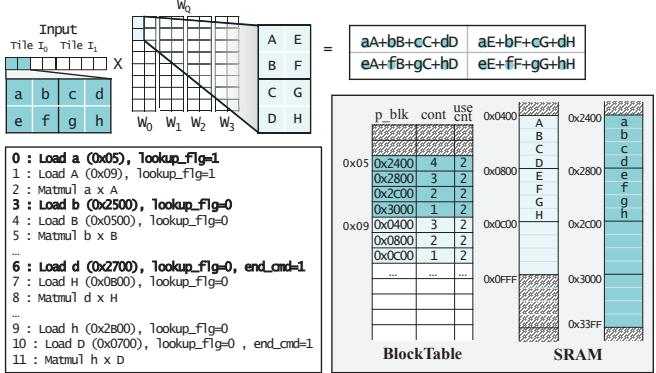

这是SMOOTH区别于所有先前SPM架构的关键创新——**保留块级分配灵活性的同时，提供与零开销传统SPM等价的连续访问快路径**：

- **翻译路径（碎片化模式）**：
  - 缓冲区发起带**lookup flag=1**的访问请求时，DMC通过块表完成翻译，并将**(p_blk, cont)**元信息随数据一并返回；
  - 缓冲区缓存该连续区间信息，后续落在该区间内的访问**直接以物理地址访问**（如数据a翻译得p_blk=0x2400、cont=4后，数据b可直接以物理地址0x2500访问），无需再次查表。
- **直通快路径（连续模式）**：
  - **addr_check模块**持续监控架构块大小对应的地址位（1 KB块即第10位），检测**块索引切换**时刻；
  - 若下一块仍在缓存的cont覆盖范围内，继续直接物理访问；若跨越块边界且下一块**物理上不连续**，缓冲区重新拉起lookup flag发起翻译。
  - 该机制使连续区域的翻译开销几乎归零——实验中连续地址翻译带来的延迟降低约为**0.2%**，控制开销在所有实验中**低于总延迟的0.1%**。
- **end_cmd机制（早期回收的触发点）**：
  - 缓冲区逻辑感知ISA操作的访存模式与输入规模，能识别**对某块的最后一次访问**；
  - 发起该最终访问（如图中数据d，块0x2400–0x27FF的末元素）的load请求时，置**end_cmd=1**；
  - DMC据此**递减对应块表项的use_cnt**——这是硬件驱动早期回收区别于“等待显式软件释放信号”的核心信号通路。

---

**早期回收与带宽感知预加载的协同**

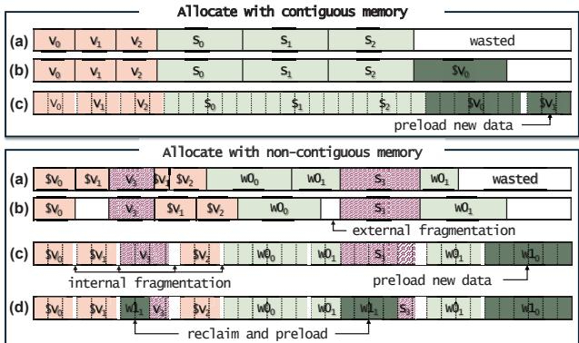 *Fig. 9. On-chip memory management strategies for contiguous and noncontiguous memory cases.*

- **回收的严格顺序保证**：DMC在空闲周期周期性识别use_cnt归零的块，并遵循**先更新块表状态、后清位图**的顺序——因为分配决策依赖位图判定空闲，该顺序防止新分配在回收完成前覆盖仍在使用的数据，**确保数据完整性**。
- **预加载量计算**：

| 参数 | 含义 |
|---|---|
| **N_preload** | 本次预加载的块数，由公式 ⌊(U × BW)/Block_size⌋ 决定 |
| **U** | 当前可用的空闲计算周期 |
| **BW** | 硬件在运行时**动态测量**的可用内存带宽 |
| **Block_size** | 架构块大小 |

- **无缝续传设计**：预加载按顺序从主存取块至SRAM，**最后取回的块索引存于寄存器**；缓冲区访问数据时查询该寄存器判断数据是否已完整载入——已载入则直接读SRAM，未载入则从主存取，保证数据流无缝衔接。
- **策略效果对比**（图9的四种策略）：相对于 纳粹  硬件cache (a) 的盲目预取、 编译器best-effort (b) 受连续tile边界约束无法填充碎片、以及 **块分配+编译器预加载**——(d)通过**早期回收V₃、S₃等已消费块**腾出空间预加载W1₁，实现无论物理碎片如何都维持**高片上占用率**。

---

**硬件开销量化**

| 指标 | NPU (基准) | SRAM (基准) | Compute逻辑 | Memory控制逻辑 |
|---|---|---|---|---|
| 面积 (µm²) | 13,730,000 | 1,811,939 | 314 | 13,050 |
| 相对占比 | — | 13.2% | **0.0023%** | **0.095%** |

| 硬件模块 | find_zero | alloc | addr_check | bt_lookup | free |
|---|---|---|---|---|---|
| 延迟 | 364.4 | 1508.2 | **83.7** | 615.2 | 654.6 |
| 功耗 | 1.4×10⁻¹ | 5.5×10⁻¹ | **3.0×10⁻²** | 2.3×10⁻¹ | 2.8×10⁻¹ |

- 综合工具为**Yosys**，采用**ASAP7 7 nm**标准单元库（保守近似Snapdragon 8 Gen3的4 nm工艺）；
- 最昂贵的**alloc**模块延迟约1.5 ns，远小于毫秒级的推理操作粒度；功耗处于**皮瓦级**，对系统能效影响可忽略。

---

**输入输出关系与在整体架构中的作用**

- **输入侧（编译器→硬件的契约）**：
  - 编译器执行**静态生命周期分析**，完成QKV projection fusion、FlashAttention、FFN fusion等优化后，向硬件传递：逻辑虚拟地址、请求大小、以及每个tile的**use_cnt标注**；
  - 编译器**不再负责**运行时的具体放置、回收时机与预加载决策——这是SMOOTH将“复杂内存调度负担从编译器移交给运行时硬件”的分工重构。
- **输出侧（硬件向执行流提供的服务）**：
  - 对缓冲区：透明的物理地址解析（含直通快路径）、数据就绪状态查询（基于最后块索引寄存器）；
  - 对计算引擎：通过消除碎片与及时预加载，保证**Low-OI线性算子执行时数据已驻留SRAM**，压缩 stall cycles。
- **在整个推理流水线中的角色**：LLM自回归解码中，高OI非线性算子（Softmax、GELU）留下**短促且不可预测的带宽空闲窗口**——静态编译器无法捕获，而块虚拟化使DMC能在这些窗口中以**细粒度块为单位**填充任意形状的空闲区域，将**突发I/O流量在时间维度上摊平**。这一机制与**早期回收**共同支撑了SMOOTH-ER相对Compiler-Ideal最高**73.0%的TTLT降低**与平均**51.2%的能耗削减**——而这一切建立在一个仅占NPU面积**约0.1%**的硬件控制层之上。

### 2. 双模式地址翻译（连续区域查表旁路快路径）

**核心观点**

SMOOTH 的双模式地址翻译机制（**Dual-Mode Address Translation**）是一种针对 deep learning workload 空间局部性特征设计的轻量化地址解析策略。其本质是：在**块级虚拟化**（block-level virtualization）带来灵活性的同时，为**连续物理区域**（contiguous physical region）提供一条**查表旁路**（translation-bypass）的快路径，从而将传统 SPM **零开销直接寻址**的优势与 block-based allocation 的抗碎片化能力融合于同一硬件结构中。

 *Fig. 12. (a) Design component of SMOOTH. (b) Access with address translation. (c) Direct access without block table lookup. (d) Access with end\_cmd for early reclamation. (e) Reclaim blocks that ensure data integrity. (f) Preload data into reclaimed blocks using idle bandwidth.*

---

**实现原理与数据结构**

- **直接映射块表（Direct-Mapped Block Table）**：SMOOTH 的虚拟地址空间大小与物理 SRAM 容量近似同阶（不同于 OS paging 的大地址空间），因此无需多级页表或 TLB，只需一张单级直接映射表即可完成翻译。
- 每个块表条目（entry）存储三个关键字段：
  - **p_blk**：该虚拟块对应的物理块地址（physical block address）；
  - **cont**：从当前块开始的**连续物理块数量**（contiguous block count），是快路径切换的核心判断依据；
  - **use_cnt**：编译器静态标注的**剩余使用次数**（remaining usage count），用于硬件驱动的早期回收。
- **Bitmap 自由块位图**：追踪所有物理块的占用状态，供 `find_zero`（最长空闲区搜索）与 `alloc`（分配）模块使用。
- **addr_check 模块**：位于 buffer 侧的轻量判断单元，决定每次访问走**翻译路径**还是**直接访问路径**。其关键特性是延迟极低（**83.7 ps**），远低于块表查询的 **615.2 ps**。

| 硬件模块 | 功能 | 延迟 | 功耗 |
|---|---|---|---|
| **addr_check** | 判断是否可旁路翻译（快路径入口） | 83.7 ps | 3.0×10⁻² pW |
| **bt_lookup** | 块表查询（慢路径翻译） | 615.2 ps | 2.3×10⁻¹ pW |
| **find_zero** | 位图中搜索最长连续空闲区 | 364.4 ps | 1.4×10⁻¹ pW |
| **alloc** | 分配并预取块 | 1508.2 ps | 5.5×10⁻¹ pW |
| **free** | 回收过期块 | 654.6 ps | 2.8×10⁻¹ pW |

---

**算法流程：翻译路径**

 *Fig. 11. Memory access requested from the buffer during the Q projection.*

- **触发条件**：buffer 发起的数据请求带有 **lookup flag = 1**，表示该请求的物理地址未知（首次访问某个虚拟区域，或上一个连续区段已被跨越）。
- **执行步骤**：
  - DMC 通过 **bt_lookup** 模块查询块表，解析出 `p_blk` 与 `cont`；
  - DMC 将数据连同 **(p_blk, cont)** 元组一起返回给 buffer；
  - buffer 将该连续范围信息**缓存于本地寄存器**，作为后续直接访问的依据；
  - 单次块表查询即可覆盖一个连续物理区段内的所有后续访问，将翻译开销**摊销**（amortize）到整段访问序列上。
- 该路径对应论文 Fig. 12(b) 的场景：数据 `a` 请求时 lookup flag 为 1，DMC 返回 `p_blk=0x2400, cont=4`。

---

**算法流程：查表旁路快路径**

- **触发条件**：待访问数据位于已缓存的连续范围之内（如数据 `b` 落在 `0x2400` 起始的 cont=4 区段内）。
- **执行步骤**：
  - buffer 通过 **addr_check** 模块确认目标地址在已缓存的 物理连续范围内；
  - 直接以 **物理地址**（如 `0x2500`）访问 SRAM，**完全跳过**块表查询；
  - buffer 侧维护一个**位级监测逻辑**（bit-level monitoring）：针对体系结构定义的块大小（如 **1 KB block** 对应监测第 10 根地址线），动态监控地址中对应块边界的比特位；
  - 当该比特位发生变化，即检测到**块索引切换**（block index change）时，buffer 检查缓存的 `cont` 值：
    - 若 `cont` 表明下一个物理块仍然连续 → 继续走快路径；
    - 若不连续（`cont` 耗尽或物理映射跳变）→ **重新置位 lookup flag**，回到翻译路径。
- **设计动机**：GEMV/GEMM 中的 Q/K/V projection 等矩阵运算天然具有顺序扫描模式，绝大多数访问命中快路径，使块级虚拟化的平均翻译开销趋近于零。

---

**与早期回收的联动：end_cmd 信号**

- buffer 侧逻辑不仅追踪地址连续性，还**感知 ISA 操作的内存访问模式与输入尺寸**，因此能识别对某个 buffer 的**最后一次访问**。
- 在发起最后一次访问的 load 请求时，buffer 置位 **end_cmd = 1**（对应 Fig. 12(d 中对块 `0x2400–0x27FF` 最后元素 `d` 的请求）。
- DMC 收到 end_cmd 后递减块表中对应的 **use_cnt**：
  - `use_cnt` 归零的块可被**立即回收**（early reclamation），进入 `free` 流程；
  - 回收严格遵循**先更新块表状态、再清除 bitmap** 的顺序，保证数据完整性，防止新分配覆盖尚未回收完成的数据；
  - 释放的物理块随即可用于带宽感知的预加载，预加载块数由公式 `N_preload = ⌊(U × BW) / Block_size⌋` 决定（U 为空闲计算周期，BW 为硬件动态实测的可用带宽）。

---

**分配策略如何支撑双模式**

 *Fig. 10. Block-based on-chip memory allocation.*

- **连续情形（Case ①）**：位图中存在满足请求大小的连续空闲区，DMC 分配整段连续物理块，`cont` 字段记录完整跨度——此场景下快路径覆盖率最高，行为等价于传统 offset-based SPM。
- **碎片化情形（Case ②）**：`find_zero` 先定位最长连续空闲区，顺序分配；若不足以满足请求，则迭代搜索次长空闲区（如先分配 `0x09–0x0C`，再分配 `0x01–0x03`），形成**多段不连续映射**；每个区段独立记录其 `cont` 长度，`use_cnt` 与连续分配情形保持一致。
- 这种设计使碎片化场景仍能完成分配（消除 external fragmentation），代价仅是跨区段时多触发几次块表查询。

---

**参数设置与敏感性**

- **块大小**：
  - SMOOTH-Base / SMOOTH-ER 通常将 block size 设为**模型维度**，与 tile 边界对齐以最小化 internal fragmentation；
  - 若块大小与 tile size 不对齐，internal fragmentation 最多导致 **9.9%** 的延迟退化；
  - 更小的块带来更细粒度的预加载与更高的内存复用，但增加块表查询频次——正是快路径机制将这一开销压制到可忽略水平（连续区域翻译优化带来约 **0.2%** 的额外延迟降低）。
- **控制开销**：在输入长度 1024、输出长度 2048 的配置下，所有实验的控制开销均**低于总延迟的 0.1%**。

---

**输入输出关系与系统定位**

- **输入**：
  - 来自 buffer 的虚拟地址访问请求 + lookup flag（0/1）；
  - 编译器静态标注的 **use_cnt**（嵌入块表条目）；
  - 硬件运行时测得的可用带宽 BW 与空闲周期 U（驱动预加载）。
- **输出**：
  - 解析后的物理 SRAM 地址（快路径）或 (物理地址, cont) 元组（翻译路径）；
  - 块表与 bitmap 的状态更新（分配、回收）；
  - 回收后的空闲块上预加载的未来数据（如后续层权重）。
- **在整体中的作用**：双模式翻译是 SMOOTH 三大设计原则（**fine-grained block allocation**、**low-overhead address translation**、**hardware-driven early reclamation**）的枢纽——它使得块级虚拟化在 LLM 的层间碎片化执行中始终可用，同时保证 contiguous 访问场景下与传统 SPM **同等的零开销行为**。这一能力是 SMOOTH 实现 TTFT 最高 **59.2%**、TTLT 最高 **73.0%** 延迟削减，以及平均最高 **51.2%** 能耗降低的微架构基础之一。

### 3. 硬件驱动的早期内存回收（use_cnt / end_cmd信号机制）

**核心定位：为什么需要硬件驱动的早期回收**

 *Fig. 12. (a) Design component of SMOOTH. (b) Access with address translation. (c) Direct access without block table lookup. (d) Access with end\_cmd for early reclamation. (e) Reclaim blocks that ensure data integrity. (f) Preload data into reclaimed blocks using idle bandwidth.*

- **问题根源**：传统 SPM（Scratchpad Memory）管理中，内存块的释放依赖编译器的**静态生命周期估计**（static lifetime analysis），但估计值与实际运行时行为频繁偏离，导致**内存释放滞后、碎片化加剧、带宽空闲窗口被浪费**。
- **融合操作放大问题**：QKV projection fusion、FlashAttention、FFN Fusion 等编译器优化会**延长中间张量的生命周期**，使得即使数据已被消费，静态分析仍认为其“存活”，无法及时回收。
- **关键洞察**：LLM 解码阶段在 compute-bound（高 OI 的非线性操作）与 I/O-bound（低 OI 的 GEMV）之间快速交替，产生的**带宽空闲窗口短暂且不可预测**，只有具备**运行时执行进度可见性**的硬件才能捕捉。
- **SMOOTH 的解法**：将回收决策从编译器下沉到 **DMC（Dynamic Memory Controller）** 硬件，通过 **use_cnt** 与 **end_cmd** 两个协同信号，在**数据被消费的瞬间**完成块级回收，为后续激进 preload 腾出空间。

---

**实现原理：use_cnt 与 end_cmd 的双层信号架构**

- **use_cnt（remaining usage count，剩余使用计数）**：
  - 存储于 **direct-mapped block table** 的每个表项中，与 **p_blk**（物理块地址）和 **cont**（连续块数）并列。
  - **编译器负责静态分析**并标注每个内存块将被多少次操作访问（即使用次数），将其写入 use_cnt 字段——这是软硬件协同设计的关键分工：**编译器提供“未来知识”，硬件提供“实时进度”**。
  - 与传统虚拟内存（如 OS paging）的本质区别：SMOOTH 的虚拟地址空间受限于物理 SRAM 容量，因此 use_cnt 元数据量小，可用**直接映射表**实现低开销翻译。
- **end_cmd（结束命令标志）**：
  - 由 **buffer 侧硬件逻辑**在发出内存加载请求时主动断言（asserted）。
  - **断言条件**：buffer 逻辑感知当前正在执行的 ISA 操作的**内存访问模式和输入尺寸**，据此判定某次访问是该块的**最后一次访问**（final access）。
  - 作用：通知 DMC “这个块对当前操作而言不再需要”，触发 use_cnt 递减。

两者的输入输出关系可概括为：

| 信号/字段 | 产生方 | 载体 | 消费方 | 触发动作 |
|---|---|---|---|---|
| use_cnt 初值 | 编译器（静态 lifetime analysis） | block table 表项 | DMC | 作为递减基准 |
| end_cmd | Buffer 逻辑（感知 ISA 执行进度） | 内存 load 请求的标志位 | DMC | 对目标块 use_cnt 执行递减 |
| use_cnt = 0 | DMC 递减后产生 | block table 表项 | DMC 的 free 模块 | 标记块可回收 |

---

**算法流程：从递减到回收再到预载的闭环**

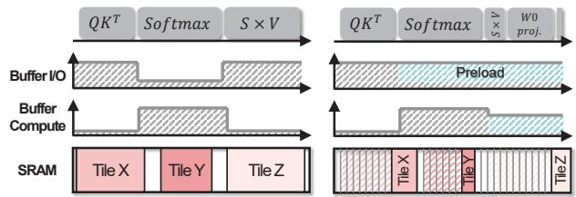 *(a) Tile-size granularity scratchpad memory management. (b) Fine-grained memory management with early reclamation. Fig. 8. I/O burst mitigation with on-chip memory management.*

以 Fig. 12d–f 中的具体场景为例，完整流程如下：

- **步骤一：最后一次访问检测（Fig. 12d）**
  - Buffer 请求块 0x2400–0x27FF 中的**最后一个数据元素 d** 时，在 load 请求上置 **end_cmd=1**。
  - 该请求携带的信息表明：此块在当前操作中的使命即将完成。
- **步骤二：使用计数递减**
  - DMC 收到 end_cmd 后，查找 block table 中对应表项，将 **use_cnt 减一**。
  - 由于 use_cnt 表示跨操作的剩余使用次数，**只有当计数归零**（即所有依赖该块的操作均已完成）时，块才真正进入可回收状态。
  - 注意此机制天然支持**多操作共享同一数据块**的场景：例如 Fig. 10 中 use_cnt=2 的分配，意味着该块被两个操作使用，需两次 end_cmd 才能释放。
- **步骤三：早期回收（early reclamation，Fig. 12e）**
  - DMC 在**空闲周期**（无 pending 内存请求时）周期性地扫描已分配块，识别 **use_cnt 已归零**的块。
  - 回收遵循**严格顺序**以保证数据完整性：
    - **先**更新 block table 状态，将块标记为“不再使用”；
    - **后**清除 allocation bitmap 中的对应位。
  - **顺序不可颠倒的原因**：分配决策依赖 bitmap 寻找空闲空间，若先清 bitmap，新分配可能在回收流程完全结束前**覆写尚未处理完的数据**。
- **步骤四：带宽感知的激进预载（Fig. 12f）**
  - 回收完成后，DMC 立即利用空闲带宽开始 preload。
  - 每次预载的块数量由公式 (1) 决定：

$$
N_{\mathrm{preload}} = \lfloor (U \times BW) / Block\_size \rfloor
$$

  - 其中 **U** 为可用空闲计算周期，**BW** 为**硬件在运行时动态测量**的可用内存带宽（而非编译期假设值），**Block_size** 为架构定义的块大小（实验中典型设置为模型维度对齐，如 1 KB）。
  - DMC 将已预载的**最后一块的索引存入寄存器**；后续 buffer 访问数据时先查询该寄存器：
    - 若加载已完成 → 直接从 SRAM 读取；
    - 若未完成 → 从主存获取，**无缝衔接**数据传输。

---

**在整体架构中的作用：闭环于“回收—预载”的协同**

 *Fig. 10. Block-based on-chip memory allocation.*

- **与块级分配的互补关系**：
  - 块级虚拟化（block-based allocation）解决的是**碎片化下的空间利用**问题——允许逻辑上连续的 tensor 映射到物理上不连续的 SRAM 块；
  - 早期回收解决的是**时间维度上的空间释放**问题——在数据消费完成的瞬间释放空间；
  - 二者结合后，SMOOTH 才能实现 Fig. 8(b) 所示的效果：**compute 阶段的空闲带宽被持续用于预载未来 tile**，将 I/O 突发流量“摊平”（SMOothing）。
- **对比编译器静态回收的不可替代性**：
  - 编译器触发 preload 需同时满足三个条件：带宽可用、有充足时间取整块连续 tile、存在足够大的**连续**空闲区域——碎片化场景下第三条经常不满足；
  - SMOOTH 的硬件回收不要求连续区域（find_zero 可拼接多个分散空闲段），且不需要编译器重新调度，**响应粒度达到块级、响应延迟达到周期级**。
- **对比硬件 Cache（如 Capuchin）的本质差异**：
  - Cache 预取器基于**过去访问模式**，是反应式的（reactive），无法预知未来 tile 访问（如 FlashAttention 之后所需的 V-cache）；
  - SMOOTH 借助编译器标注的 use_cnt 获得**前瞻性**，同时用硬件信号获得**实时性**，实现了纯软件与纯硬件方案都不具备的能力组合。

---

**参数设置与硬件开销量化**

- **模块级延迟与功耗**（基于 Yosys + ASAP7 7 nm 工艺库综合，1 KB block size）：

| 硬件模块 | 功能 | 延迟 | 功耗 |
|---|---|---|---|
| addr_check | 判定是否需要地址翻译 | 83.7 ps | 3.0×10⁻² pW |
| find_zero | 寻找最长空闲区域 | 364.4 ps | 1.4×10⁻¹ pW |
| bt_lookup | block table 地址翻译 | 615.2 ps | 2.3×10⁻¹ pW |
| free | 执行块回收 | 654.6 ps | 2.8×10⁻¹ pW |
| alloc | 预载并分配块 | 1508.2 ps | 5.5×10⁻¹ pW |

- **关键结论**：
  - 回收核心模块 **free** 的延迟仅 **654.6 ps**，功耗处于**亚纳瓦级**（sub-nanowatt），相对于毫秒级的推理延迟与毫瓦级的系统功耗而言**可忽略不计**。
  - 整体控制开销在输入长度 1024 / 输出长度 2048 的配置下**低于总延迟的 0.1%**，且该开销已计入评估结果。
  - 内存控制逻辑的面积开销仅占估计 NPU 面积的 **0.095%**。
- **块大小（Block_size）的设置权衡**：
  - 小块 → 预载粒度更细、内存复用更充分，但 block table 查询开销上升（由 **lookup_flag** 旁路机制缓解，连续访问可跳过翻译）；
  - 实验表明块大小若与 tile 大小未对齐，内部碎片可使延迟恶化**最多 9.9%**，故 SMOOTH-Base/SMOOTH-ER 通常**将块大小设为模型维度**。

---

**性能贡献：早期回收（SMOOTH-ER 相对 SMOOTH-Base）的增量收益**

早期回收机制的独立价值可通过 SMOOTH-ER 与 SMOOTH-Base 的消融对比直接量化：

| 评估指标 | 场景 | SMOOTH-ER 相对 SMOOTH-Base 的提升 |
|---|---|---|
| TTLT（端到端生成延迟） | 输入 512 / 8 MB SRAM | 平均最高 **24.0%** |
| ITL（inter-token latency） | 带宽 16–128 GB/s | 平均 **11.1%**，最高 **47.0%** |
| ITL（长输入敏感性） | 输入序列 2K–32K | 额外提升最高 **26.4%** |
| ITL（co-run 干扰） | Geekbench CPU/GPU 共跑 @64 GB/s | 平均 **5.0%** |

- **收益随条件变化的规律**：
  - **带宽越受限**，早期回收的价值越大——空闲带宽窗口越稀缺，及时腾出空间进行预载的边际收益越高；
  - **输入序列越长**，收益越显著——KV cache 增长加剧内存压力，回收-预载闭环有效对冲了长上下文带来的内存开销；
  - **带宽充裕或 SRAM 极大/极小时**收益收窄：大 SRAM 下 Compiler-Ideal 本身碎片化减轻；小 SRAM 下可供预载的物理空间受限。

---

**总结**

- **use_cnt / end_cmd 机制的本质**是一次**软硬件职责再分工**：编译器输出使用次数的静态先验（写入 use_cnt），buffer 硬件在 ISA 执行层面感知“最后一次访问”并置 end_cmd，DMC 将二者融合后在周期级完成块回收。
- 它使 SMOOTH 成为**首个同时具备细粒度块放置与运行时驱动回收**能力的 SPM 架构，弥补了静态编译器（无法感知运行时进度）与反应式硬件 Cache（无法预知未来访问）之间的结构性空白。
- 其代价被严格控制在**面积 0.095%、延迟 <0.1%、功耗亚纳瓦级**的量级，而回报是 TTLT 最高 **73.0%** 的削减——这一**开销/收益比**是该机制在移动 SoC 上可行的根本依据。

### 4. 带宽感知的细粒度硬件预加载调度

**核心机制定位**

带宽感知的细粒度硬件预加载调度是 SMOOTH 框架中 Dynamic Memory Controller (DMC) 的核心运行时策略，其目标是在 LLM 自回归解码的 **bursty memory traffic** 场景下，将高 OI (Operational Intensity) 非线性算子（如 Softmax、GELU）执行期间闲置的 memory bandwidth，主动转化为对后续 Low-OI GEMV 算子所需权重/KV cache 的 **提前搬运**，从而平滑 I/O 峰值、消除 compute stall。

 *Fig. 12. (a) Design component of SMOOTH. (b) Access with address translation. (c) Direct access without block table lookup. (d) Access with end\_cmd for early reclamation. (e) Reclaim blocks that ensure data integrity. (f) Preload data into reclaimed blocks using idle bandwidth.*

---

**算法原理与决策流程**

- **触发条件**：DMC 周期性检测是否存在 **idle cycles**（无 pending memory request 的空转周期）。只有检测到空闲带宽窗口时，预加载调度才被激活。
- **核心公式**：每次预加载机会中，待加载 block 数量由下式决定：

```
N_preload = ⌊(U × BW) / Block_size⌋
```

  - **U**：当前可用的空闲 compute cycles 数量，代表预加载窗口的时间预算
  - **BW**：可用 memory bandwidth，由硬件在执行期间 **动态实测**（dynamically measured by the hardware），而非编译期静态假设
  - **Block_size**：架构级固定 block 大小（论文基准配置为 1 KB）
  - **N_preload**：本轮预加载的 block 数量，通过向下取整保证不超出带宽预算

- **带宽动态测量意义**：移动 SoC 采用 unified memory architecture，CPU/GPU/NPU 共享 LPDDR5。由于并发负载（论文用 Geekbench 6 模拟 co-run 干扰）导致 NPU 可用带宽在 13–34 GB/s 量级上剧烈波动，静态编译器无法预知。DMC 的运行时实测机制使预加载数量 **自适应衰减或扩张**，避免在带宽被抢占时产生反效果（占用本已紧张的带宽，恶化主流程访存）。

---

**预加载执行的完整生命周期**

- **Step 1 — 早期回收（Early Reclamation）**：预加载的前提是物理 SRAM 中存在 free blocks。DMC 内部周期性扫描 block table，识别 **use_cnt 已归零** 的 block，按严格顺序回收：
  - 先更新 block table 状态，标记 block 不再使用
  - 再清除 allocation bitmap 中对应位
  - 该顺序保证 allocation 依据的 bitmap 不会在回收完成前指向仍含有效数据的区域，确保 **data integrity**
- **Step 2 — 空闲空间搜索**：`find_zero` 模块扫描 bitmap，识别最长连续空闲 region（类似 OS paging 中的 best-fit 连续区段查找）
- **Step 3 — 带宽预算计算**：代入公式计算本轮 `N_preload`，并将预加载目标 block 分配至回收所得的 **非连续物理 block 集合**（这是 SMOOTH 相较 Compiler-Ideal 的关键优势——不要求 contiguous allocation）
- **Step 4 — 顺序搬运**：DMC 从 main memory 顺序预加载后续数据 block 至 SRAM，并在寄存器中记录 **最后已取回 block 的 index**
- **Step 5 — 终止条件**：满足以下任一条件即停止本轮预加载：
  - 空闲带宽预算（U × BW）耗尽
  - SRAM 中无剩余 free region
- **Step 6 — 命中判定**：buffer 发起数据访问时，DMC 查询上述寄存器：
  - 已完全加载 → 直接从 SRAM 读取，实现 **零 off-chip 访问**
  - 未加载完成 → 从 main memory fetch，保证数据流 **无缝衔接**（seamless continuation）

 *(a) Tile-size granularity scratchpad memory management. (b) Fine-grained memory management with early reclamation. Fig. 8. I/O burst mitigation with on-chip memory management.*

---

**与传统编译器预加载的约束对比**

论文明确指出，静态编译器发出 preload 请求需 **同时满足三个条件**，而 SMOOTH 逐项解除这些限制：

| 约束条件 | Compiler-Ideal | SMOOTH DMC |
| --- | --- | --- |
| 带宽可用性 | 编译期无法预知运行时波动 | 硬件实时实测 BW，自适应调整 |
| 预取时间充足 | 需保证完整 tile 的搬运时间 | Block 粒度预取，时间预算碎片化可用 |
| 连续空闲区域 | 必须存在容纳整个 contiguous tile 的空间 | 借助 block virtualization，可填充非连续空洞 |

 *Fig. 9. On-chip memory management strategies for contiguous and noncontiguous memory cases.*

---

**输入输出关系与在整体架构中的作用**

- **输入信号**：
  - 编译器静态标注的 **use_cnt**（每个 tensor 的剩余使用次数，作为硬件主动回收的依据）
  - 硬件运行时探测的 **idle compute cycles (U)** 与 **available bandwidth (BW)**
  - allocation bitmap 与 block table 的实时状态
- **输出效果**：
  - SRAM 占用率维持高位（利用碎片化空闲 block 填充后续权重，如 W₁₀、W₁₁）
  - 后续 GEMV 算子发起访问时命中 SRAM，消除因等待 off-chip fetch 产生的 **stall cycles**
- **系统级定位**：该调度机制是连接 **fine-grained block allocation** 与 **early reclamation** 两大能力的执行引擎。Allocation 提供可填充的物理空间，reclamation 及时释放空间，而带宽感知调度则决定 **何时、搬运多少**，三者协同构成 reclaim-and-preload 闭环，将 bursty I/O 在时间轴上摊平。

---

**性能与开销量化**

- **性能贡献**：在 64 GB/s 带宽及 Geekbench co-run 干扰下，SMOOTH-ER 的 ITL 相对 Compiler-Ideal 平均提升 **42.7%**，相对 SMOOTH-Base 提升 **5.0%**；带宽降至 16 GB/s 时系统更加 memory-bound，SMOOTH-ER 相对 SMOOTH-Base 的增益可达 **47.0%**（平均 11.1%），验证早期回收 + 及时预加载在带宽受限场景下的价值。
- **控制开销**：预加载依赖的五个硬件模块（find_zero / alloc / addr_check / bt_lookup / free）经 Yosys + ASAP7 7 nm 综合验证：

| 模块 | 延迟 | 功耗 |
| --- | --- | --- |
| find_zero | 364.4 ps | 1.4×10⁻¹ pW |
| alloc | 1508.2 ps | 5.5×10⁻¹ pW |
| addr_check | 83.7 ps | 3.0×10⁻² pW |
| bt_lookup | 615.2 ps | 2.3×10⁻¹ pW |
| free | 654.6 ps | 2.8×10⁻¹ pW |

  - 全部模块功耗处于 **sub-nanowatt** 量级，整体控制开销在 input 1024 / output 2048 的实验配置下 **低于总延迟的 0.1%**，且已计入论文报告的 end-to-end 结果中
- **Block size 权衡**：更小的 block 强化细粒度预加载与内存复用，但增加 block table lookup 开销；论文通过 lookup flag 机制对连续区域 **旁路地址翻译**（contiguous fast path），使 SMOOTH 通常将 block size 设为 model dimension；若 block 与 tile 尺寸未对齐，internal fragmentation 可使延迟恶化至多 **9.9%**。

---

**局限性讨论**

- 预加载收益高度依赖 **空闲带宽窗口的存在**：短 output length 场景下 attention 与非线性算子耗时短，idle cycles 不足，SMOOTH-ER 相对 Gemmini（tile 级流水线预取）优势收窄
- 大模型（如 LLaMA2）每个算子所需 tile 数量庞大，SRAM 同一时刻仅能驻留小部分，即使占用率高，SMOOTH-ER 相对 SMOOTH-Base 的额外延迟降低仍然有限
- 预加载目标选择依赖编译器提供的 operation lifetime 信息——纯硬件无法独立预测未来 tensor 访问，这体现了 SMOOTH **编译器-硬件协同设计**（compiler annotates, hardware orchestrates）的架构立场


---

## 4. 实验方法与实验结果

**实验设置分析**

- **仿真平台**：所有核心实验基于 **LLMCompass**（ScaleSim 的 LLM 扩展版本）进行 **cycle-accurate** 仿真，并集成了端到端 SRAM manager 以支持基于地址的内存分配与全流程数据预取。
- **目标硬件建模**：仿真配置参照 **Qualcomm Hexagon V73**（HMX、HVX）与 LPDDR5 移动内存，具体配置如下表：

| 参数 | 配置 |
|---|---|
| Core frequency | 940 MHz |
| Number of cores | 1 |
| Matrix Engine (ME) | 32×32 |
| Vector Engine (VE) | 32 lanes (32 ALUs/lane) |
| SRAM size | 2 / 8 / 32 MB |
| DRAM bandwidth | 16 / 32 / 64 / 128 GB/s |

- **模型配置**：覆盖 1.1B 至 13B 的 8 个 Transformer 模型，统一采用 **w4a8/int8** 量化，batch size 固定为 1（符合移动端单请求场景）：

| Model | #Params | #Layers | #Heads | d_model |
|---|---|---|---|---|
| TinyLLaMA | 1.1B | 22 | 32 | 2048 |
| GPT-Neo | 1.3B | 24 | 16 | 2048 |
| GPT-3 XL | 1.3B | 24 | 24 | 2048 |
| Gemma-2 | 2.0B | 18 | 8 | 2048 |
| GPT-3 2.7B | 2.7B | 32 | 32 | 2560 |
| LLaMA2 | 7.0B | 32 | 32 | 4096 |
| Bloom | 7.1B | 30 | 32 | 4096 |
| GPT-3 13B | 13.0B | 40 | 40 | 5140 |

- **Baseline 策略（共 5 种）**：
  - **Compiler-Ideal**：理想化编译器策略，假设完美 lifetime 分析、best-fit 分配，且通过仿真对每层从 512B 至 4MB 暴力搜索最优 tile size；
  - **Capuchin**：硬件管理策略，将 on-chip memory 视作 64-byte cache，基于运行时访问模式做 cache-line 粒度动态预取；
  - **Gemmini**：全栈 DNN 加速框架，通过 input/output tile 流水线重叠实现字节级细粒度预载；
  - **SMOOTH-Base**：块粒度分配器（消融项），仅做 block 分配降低碎片；
  - **SMOOTH-ER**：SMOOTH-Base + **early reclamation**（硬件驱动的早期回收）。
- **Fusion 配置**：所有模型均启用三种典型算子融合——QKV projection fusion、FlashAttention（融合 Q×Kᵀ、Softmax、S×V）、FFN fusion（W1 + GELU + W2）。
- **硬件开销评估**：使用 **Yosys** + **ASAP7 7nm** 标准单元库对五个硬件模块（find_zero、alloc、addr_check、bt_lookup、free）综合，并以 NPU 占 SoC 面积 10% 的保守假设计算相对开销。

---

**核心结果数据分析**

- **TTFT（Time-to-First-Token）**：
  - 在 8MB SRAM 下，**SMOOTH-ER 相对 Compiler-Ideal 平均降低 TTFT 41.4%，最高达 59.2%**；
  - TTFT 阶段无 KV cache 压力，8MB 已足够（扩至 32MB 仅改善 ≤1.0%），性能瓶颈在于预载时机不足而非容量；
  - **Capuchin** 仅在 GPT 系列模型上获得收益，原因在于硬件 cache 缺乏编译器提供的 tensor 生命周期信息，无法预取 FlashAttention 产生的大量 attention tile；
  - Gemmini 凭借流水线预载下一个 tile 获得一定改善，但受粗粒度 tile 边界限制。


- **TTLT（Time-to-Last-Token）**：输入长度 512、SRAM 8MB 条件下：
  - **SMOOTH-ER 相对 Compiler-Ideal 平均提升 43.2%，最高 60.0%**；
  - **相对 Gemmini 平均提升 49.1%，最高 73.0%**；
  - 收益来源随输出长度变化：短输出时收益主要来自 prompt phase（非线性操作时间短，可利用的 idle cycle 有限）；长输出时 generation phase 贡献绝大部分增益（预载数据量增大显著改善性能）；
  - Compiler-Ideal 在长输出时虽也增加预载数据量，但连续地址分配引发 **memory fragmentation**，导致增益受限。

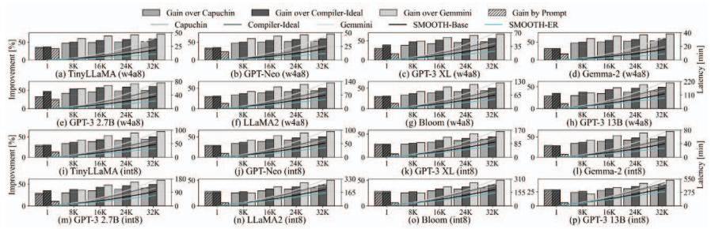 *(a)*

- **SRAM 容量敏感性**：增益在 **8MB（中等容量）时最大**，两端均衰减：
  - 2MB：物理容量不足以支撑大量预载；
  - 32MB：Compiler-Ideal 碎片问题缓解，可通过大 tile + 连续分配充分预载，SMOOTH-ER 相对优势收窄；
  - Gemmini 因采用流水线预载下一个 tile，对 SRAM 大小几乎不敏感。

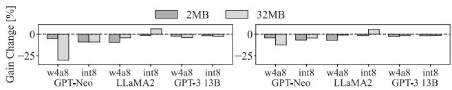

- **内存带宽敏感性（ITL 分析，GPT-Neo）**：
  - 带宽 16–128 GB/s 及 64GB 下 Geekbench co-run 干扰场景中，**SMOOTH-ER 相对 Capuchin 平均降低延迟 30.5%，相对 Compiler-Ideal 降低 40.0%**；
  - 带宽越紧张（memory-bound 越严重），early reclamation 带来的收益越大：相对 SMOOTH-Base 平均提升 11.1%（最高 47.0%）；
  - 在 CPU/GPU 干扰导致 idle bandwidth 动态变化的场景下，仍取得相对 Compiler-Ideal 平均 42.7%、相对 SMOOTH-Base 5.0% 的增益，验证了硬件动态测量带宽（式 (1)）的适应性。

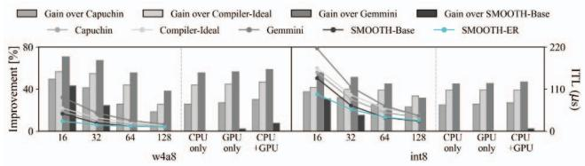

- **输入序列长度敏感性（固定输出 1024 tokens）**：
  - 长上下文场景下 KV cache 内存占用随输入长度线性增长，SMOOTH-ER 优势随序列长度递增；
  - **相对 Gemmini 的增益从 2K 序列的 50.1% 单调扩展至 32K 的 66.8%**，最高 73.0%；
  - 相对 SMOOTH-Base 额外提升最高 26.4%。

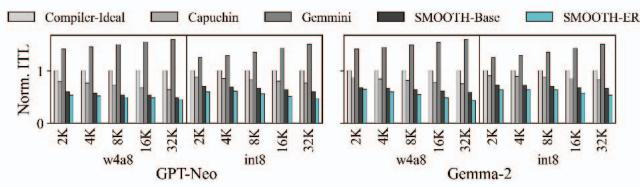

- **能耗分析**：
  - 按各序列长度取最优 block size，**SMOOTH-ER 相对 Compiler-Ideal / Gemmini / Capuchin 平均能耗降低 44.0% / 51.2% / 39.9%**；
  - 相对 Gemmini 的能耗节省从 1K 的 28.1% 增长至 32K 的 **70.7%**；相对 Compiler-Ideal 从 30.7% 增长至 56.7%；
  - 硬件模块自身能耗开销在 32K 序列下峰值仅 **15 nano-joules**，可忽略。

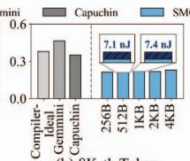

---

**消融实验分析**

- **消融设计**：论文通过 **SMOOTH-Base（仅块分配）** 与 **SMOOTH-ER（块分配 + 早期回收）** 的对照，剥离两个核心机制的独立贡献：
  - **块级分配的贡献**：解除连续物理空间约束，将逻辑 tile 与物理 SRAM 布局解耦，消除外部碎片，允许利用碎片化的空闲 block 预载后续 tile（如 W1₀ 可在分散空闲块中预载）；
  - **早期回收的贡献**：基于硬件 use_cnt 信号在数据被消费后立即回收 block，而非等待软件显式释放，使预载时机更早、更激进。
- **消融量化结果汇总**：

| 对比维度 | SMOOTH-ER 相对 SMOOTH-Base 的增益 |
|---|---|
| TTLT（总体） | 平均最高 24.0% |
| 带宽敏感性（ITL） | 平均 11.1%，最高 47.0% |
| 输入长度敏感性 | 最高额外提升 26.4% |
| 干扰场景（Geekbench co-run） | 5.0% |

- **增益受限的条件与原因**：
  - **短输出长度**：非线性操作总时间短，idle cycle 不足，early reclamation 释放的预载窗口有限；
  - **大模型（如 LLaMA2）**：每次操作需要的 tile 数量巨大，SRAM 同一时刻只能容纳一小部分（Fig. 18 显示 hit tile 占比随输出长度增长仍偏低），因此即便回收迅速、占用率高，额外延迟降低有限；
  - **高带宽场景**：内存容量与传输约束缓解，SMOOTH-Base 与 SMOOTH-ER 差距收窄；**低带宽场景**下 early reclamation 收益最大，印证其核心价值在于捕捉瞬态带宽松弛。

- **Fusion 消融（Fig. 16b vs 16c）**：
  - 无 fusion：各算子独立顺序执行，内存带宽持续饱和，包括 Compiler-Ideal 在内的所有策略改善均有限；
  - 有 fusion：多个算子合并为 tensor 级执行单元，阶段性缓解带宽饱和，为激进预载创造窗口，推理延迟显著降低；
  - **Capuchin 的失败模式**（Fig. 17）：attention 阶段结束时 SRAM 占用率骤降——无 fusion 时硬件 prefetcher 无法预测后续算子；有 fusion 时预测变得可行，说明 SMOOTH 的编译器 lifetime 信息 + 硬件执行的协同设计优于纯硬件反应式预取。

- **Block Size 敏感性（Fig. 21）**：
  - 小 block：预载与内存复用更细粒度，但 block_table_lookup 次数增加；论文的 **lookup flag 机制**通过缓存连续区段信息（p_blk, cont）对连续地址旁路翻译，使控制开销保持在极低水平（控制开销 < 总延迟 0.1%，连续地址翻译带来 0.2% 延迟降低）；
  - block size 未与 tile size 对齐时会引入 **internal fragmentation**，延迟最多增加 9.9%；
  - 实践准则：SMOOTH-Base / SMOOTH-ER 通常将 block size 设为 model dimension。

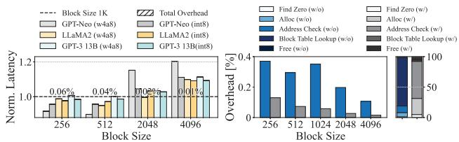

---

**硬件开销验证**

| 模块 | NPU | SRAM | Compute 逻辑 | Memory 控制逻辑 |
|---|---|---|---|---|
| 面积 (µm²) | 13,730,000 | 1,811,939 | 314 | 13,050 |
| 相对占比 | — | 13.2% | **0.0023%** | **0.095%** |

| 指标 | find_zero | alloc | addr_check | bt_lookup | free |
|---|---|---|---|---|---|
| 延迟 | 364.4 | 1508.2 | 83.7 | 615.2 | 654.6 |
| 功耗 | 1.4×10⁻¹ | 5.5×10⁻¹ | 3.0×10⁻² | 2.3×10⁻¹ | 2.8×10⁻¹ |

- 五个控制模块延迟均在 **ps 量级**、功耗在 **sub-nanowatt** 范围；在输入 1024 / 输出 2048 的配置下，控制开销占总延迟不超过 0.1%，且已计入端到端评估结果，说明性能收益并非以隐藏开销换取。

---

**总体评价**

- 实验覆盖维度全面：**模型规模（1.1B–13B）、SRAM 容量（2/8/32MB）、带宽（16–128GB/s）、输入/输出长度（2K–32K）、fusion 有无、block size、动态干扰**，形成多轴交叉验证；
- 仿真环境经过校准：真实平台（Jetson AGX Orin、Galaxy S24 Ultra、Edge TPU）上非线性操作占比分别为 20.4%/17.0%/14.1%（TinyLLaMA），而仿真器给出 9.4%，表明仿真对非线性操作耗时是**保守估计**，结果不夸大；
- 消融逻辑清晰：SMOOTH-Base → SMOOTH-ER 剥离 early reclamation 贡献，Compiler-Ideal 提供“完美静态编译”上界，Optimal 提供“字节级无碎片”理论上界（差距 32.7% stall cycles 定量刻画了静态连续分配的架构性缺陷）；
- 局限性提示：结果基于结构化元数据的 cycle-accurate 仿真而非真实流片；SMOOTH 相对 Compiler-Ideal 的优势在 SRAM 充裕（32MB）或带宽充裕时显著收窄，其适用定位明确为**资源受限、动态干扰的移动 SoC 场景**。

---
