# SMOOTH: Hardware-Assisted Fine-Grained On-Chip Memory Management for Efficient On-Device LLM Inference 原文翻译


# SMOOTH：面向高效端侧 LLM 推理的硬件辅助细粒度片上内存管理

Seulki Kim   
DGIST   
Daegu, Republic of Korea   
skkim@dgist.ac.kr   
Hwanjun Lee   
DGIST   
Daegu, Republic of Korea   
lee.hwanjun@dgist.ac.kr

Bokyeong Kim Samsung Research Seoul, Republic of Korea bokyeong.kim@samsung.com

Sungju Kim   
Yonsei University   
Seoul, Republic of Korea   
sungju.kim@yonsei.ac.kr   
Kyeonghyeon Ryu   
DGIST   
Daegu, Republic of Korea   
khryu@dgist.ac.kr   
Yunhyeong Jeon   
DGIST   
Daegu, Republic of Korea   
yhjeon@dgist.ac.kr   
Yeji Jung   
DGIST   
Daegu, Republic of Korea   
jung.yeji@dgist.ac.kr   
Daehoon Kim   
Yonsei University   
Seoul, Republic of Korea   
daehoonkim@yonsei.ac.kr

摘要——在移动设备上直接运行大语言模型（LLM）的需求日益增长，加剧了在严苛的内存与带宽约束下实现高效端侧推理的迫切性。尽管编译器层面的优化（如内存分块与基于生命周期的分配）能够提升片上 SRAM 的利用率，但在应对自回归解码过程中计算阶段与 I/O 阶段交替出现所引发的突发内存流量与碎片化问题时，这些方法仍然效果有限。本文提出 SMooTH，一个在运行时动态优化 scratchpad 使用的硬件辅助片上内存管理框架。首先，一种细粒度的基于块的分配与预加载方案提升了有效 SRAM 利用率，并充分利用空闲内存带宽。其次，一种硬件驱动的早期回收机制利用缓冲区级信号及时释放未使用的内存块，从而实现更激进、更及时的预加载。我们使用 Verilog 实现了 SMoOTH，并将其集成到 LLMCompass（ScaleSim 的 LLM 优化扩展版本）中以进行周期级精确评估。实验结果表明，在内存受限的移动 SoC 上，与现有基线方法相比，SMOOTH 将首 Token 生成时间（TTFT）最多降低 59.2%，将末 Token 生成时间（TTLT）最多降低 73.0%，相比最先进的基线方法平均节能高达 51.2%。

索引术语——大语言模型，端侧推理，SoC，scratchpad 内存管理。

## I. 引言

大型语言模型已成为从自然语言助手 [1]- [9] 到个性化推荐 [10]–[13] 等各类应用中不可或缺的组成部分。近来，这些模型的端侧部署逐渐兴起，以实现实时响应并保护用户隐私 [14]- [16]。然而，尽管服务器级系统在 LLM 推理期间同样会遭遇内存瓶颈，移动硬件上的约束却要严苛得多。LLM 推理由 I/O 密集的通用矩阵-向量乘法（GEneral Matrix-Vector multiplication, GEMV）操作主导，而移动 SoC 有限的 SRAM（2–8 MB）和低带宽的 LPDDR5（13-34 GB/s）进一步加剧了这一瓶颈。因此，内存带宽会迅速饱和，严重降低端侧推理性能。这些问题还因 LLM 自身的架构特性而进一步恶化。基于 Transformer 的模型在自回归解码过程中 [17]-[19] 在非线性操作与线性操作之间反复交替。这导致高度突发性的内存流量：在计算阶段内存带宽基本处于空闲状态，而在 GEMV 层加载大规模权重时带宽则被完全占满。这种相位交替的行为导致移动硬件上的资源利用率长期低下，留下了大量未被挖掘的性能空间。然而，这种高度突发性的模式与现代编译器所采用的静态、tile 级内存规划存在根本性错配：带宽富余出现在短暂且不可预测的时间窗口中，无法被固定的编译期调度所捕获。

现代深度学习编译器（包括 XLA [20] 和 TVM [21]）试图通过编译期优化（如内存分块、算子融合以及基于生命周期的内存分配 [22]-[24]）来缓解内存瓶颈。虽然这些技术可以减小内存占用，但它们在本质上是静态的，无法适应运行时相关的行为，例如不断变化的 Key/Value（KV）缓存大小或波动的执行时序。此外，移动 SoC 中的统一内存架构会导致可用带宽因并发运行的 CPU 和 GPU 工作负载的争用而动态波动。另外，最优执行在很大程度上取决于运行时条件，因为输入与输出 token 长度会随用户请求的不同而显著变化。由于这些动态因素在编译期是未知的，静态编译器只能保守地固定 tile 尺寸。这常常与运行时条件不匹配，使推理延迟劣化超过 2 倍。从历史上看，片上便签存储器过去一直避免块级分配，因为逐块的地址转换需要不容忽视的元数据与访问开销，而且传统的 CNN/DNN 工作负载也无法从中获益。由于 CNN 的 tile 形状规整且数据复用率高，内存碎片化极少，因此基于连续偏移的 SPM 既足够又最优。因此，标准 SPM 管理采用了粗粒度方式，在张量或 tile 级别分配内存——通常为数十到数百 KB [25], [26]。然而，这些假设在 LLM 上不再成立。融合后的、层特定的 tile 模式与长生命周期的中间缓冲区会造成严重的碎片化，同时数据复用率低且 tile 形状在不同操作之间各不相同。因此，粗粒度、连续分配的 SPM 从根本上无法适配解码端 LLM 的不规则、突发性内存行为。

为了弥补这些缺陷，现代编译器越来越依赖复杂的生命周期分析与分配启发式策略。然而，这些机制仍然依赖静态估计的生命周期，而后者常常与实际运行时行为相偏离，导致低效的内存复用。算子融合进一步延长了缓冲区的生命周期并加剧碎片化，而缺乏对执行进度的可见性的软件管理式预取则无法利用短暂、瞬时的可用带宽窗口。为了量化这些限制的实际影响，我们在代表性移动 SoC 上对 LLM 推理进行了性能剖析，并使用周期级精确模拟器复现了所观察到的行为。作为基线，我们评估了一种编译器理想 SPM，它假设具备完美的生命周期知识，并能最优地预加载所有不重叠的 tile，但仍然缺乏运行时反馈，且受限于连续分配。尽管有这一乐观假设，该编译器理想 SPM 在 4K token 时仍因碎片化导致的 SRAM 利用不足而使停顿周期增加 32.7%，仍远低于能够以字节级粒度放置数据的最优策略。因此，现有的编译器驱动 SPM 技术在根本上过于静态和粗粒度，无法满足端侧 LLM 推理对细粒度、时间敏感的内存需求。

为了解决这些限制，我们提出 SMOOTH（SMOothing I/O Traffic with Hardware support），一个通过硬件辅助在运行时动态调度片上 SRAM 使用的 SPM 管理框架。与以往仅依赖静态编译器决策的 SPM 方法不同，SMOOTH 引入了现有 SPM 系统从根本上缺失的两项能力。第一，SMOOTH 以块级粒度对 SPM 进行虚拟化，同时引入一种轻量级机制来绕过连续区域的地址转换。这形成了一种双模式混合设计：SMOOTH 在出现碎片化时使用细粒度的块虚拟化模式，而在块保持连续时自动切换到转换旁路的快速路径。这使得 SMOOTH 既能保留块级分配的灵活性（这对 LLM 引发的碎片化至关重要），又能在常见的连续访问场景下提供与传统 SPM 相同的零开销行为。据我们所知，此前没有任何 SPM 架构支持块级虚拟化，也没有提供将细粒度块分配与零开销连续快速路径相结合的双模式机制——而这些能力对于逐层执行反复引发碎片化并暴露短暂带宽富余的 LLM 工作负载而言至关重要。第二，SMOOTH 集成了一种硬件驱动的早期回收机制，该机制基于缓冲区级别的运行时信号而非编译器估计的生命周期来释放块。这使 SMOOTH 能够利用瞬时的带宽富余并支持细粒度预取——这些能力在静态 SPM 系统中从根本上不可用。综上，这些能力构成了首个实现细粒度块放置与运行时驱动回收的 SPM 架构，而这正是 LLM 所必需、却为所有先前 SPM 设计所缺失的两项特性。

我们使用 LLMCompass [27]（ScaleSim [28] 的 LLM 优化扩展）实现了 SMOOTH，并用 Verilog 综合了其硬件逻辑，包括集成 DMC 的块表与基于位图的地址转换机制。实验结果表明，SMOOTH 显著提升了端侧 LLM 的延迟与能效：与代表性的编译器及硬件基线相比，它将首 token 时间最多降低 59.2%，将末 token 时间最多降低 73.0%。此外，SMOOTH 显著降低了模型推理能耗，与最先进的加速器相比平均能耗最多降低 51.2%。

总结而言，本工作的贡献如下：

• 刻画移动端 LLM 推理中内存低效的根本原因：我们量化了突发性内存需求与粗粒度编译器决策（分块、生命周期分析、融合）如何留下大量未被利用的带宽富余并引发碎片化，进而导致显著停顿。此外，我们刻画了动态运行时因素——具体而言，统一内存架构中波动的可用带宽以及变化的用户序列长度——如何使静态 tile 尺寸严重偏离最优，有时导致延迟劣化高达 2.9 倍。

• 揭示静态 SPM 管理的根本局限性：通过分析与编译器理想化（compiler-ideal）实验，我们证明即使是假设中完美的静态 SPM 分配器也无法适应动态运行时变化，并因碎片化而额外产生高达 32.7% 的停顿周期。

• 面向 LLM 设计硬件辅助、运行时感知的 scratchpad 架构：SMOOTH 提供块级 SPM 虚拟化与硬件驱动的提前回收机制，从而支持细粒度预取，并能更有效地利用瞬态带宽余量，最终提升移动 SoC 上的延迟与吞吐表现。

## II. 背景

## A. 移动 SoC 中 LLM 推理的特性

基于解码器（Decoder）的 LLM 推理在两个截然不同的阶段中运行。在 prompt 阶段，模型使用对所有 token 对的全量自注意力（full self-attention）同时处理整个输入序列。该阶段由通用矩阵-矩阵乘法（General Matrix-Matrix multiplication，GEMM）主导，这类操作具有高操作强度（High-OI），在本质上属于计算受限型。相反，在 token 生成阶段，模型利用键值缓存（KV caching）将输入从 $d \times l$ 矩阵缩减为 $d \times 1$ 向量。因此，注意力矩阵从 ${ \mathit { l } } \times { \mathit { l } }$ 收缩为 ${ \mathit { l } } \times 1$，使工作负载转变为反复执行的通用矩阵-向量乘法（GEneral Matrix-Vector multiplication，GEMV）。在整个生成阶段，执行过程在线性操作（如 QKV 与 W0 投影）与非线性操作（如 softmax 与激活函数）之间持续交替。线性操作需要为相对较少的计算搬运大规模的 $d \times d$ 权重矩阵，导致低操作强度（Low-OI），使其严重受限于 I/O。相比之下，非线性操作主要依赖向量算术吞吐能力，导致内存带宽严重利用不足。随着序列长度 $l$ 的增长，这种迭代式的 GEMV 模式急剧放大了内存流量，在移动片上系统环境严苛的硬件约束下造成严重的带宽瓶颈。这种突发式流量模式在我们对配备 8 MB 移动 NPU 与 LPDDR5 内存的高通 Hexagon V73 处理器的仿真中得到了清晰体现（详见 § VI）。如图 1 所示，执行过程在计算阶段与 I/O 阶段之间剧烈交替，在 Low-OI 阶段由于频繁的片外 DRAM 访问而产生大量停顿周期。因此，计算受限型与 I/O 受限型操作之间的这种长期失衡严重降低了资源利用率，凸显了在边缘设备上实现低延迟 LLM 推理时，高效片上内存管理的迫切需求。

  
Fig. 1. 移动 SoC 上 Transformer 解码器的执行流程，其中高 OI 操作与低 OI 操作交替出现，导致突发式内存流量与片外 DRAM 瓶颈。

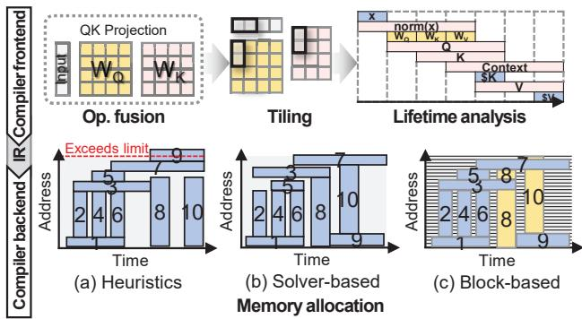  
Fig. 2. 深度学习编译流程。

## B. 面向 LLM 的编译器驱动片上内存管理

基于 Transformer 的模型需要庞大的端上内存，使 LLM 推理在本质上属于内存受限型。因此，现代加速器依赖由快速但容量有限的片上 SRAM 与大容量片外 DRAM 组成的分层内存系统。SRAM 通常由硬件作为 cache 管理，或由软件作为 scratchpad 管理 [29], [30]。硬件管理的 cache 依赖空间与时间局部性，但 Transformer 工作负载呈现出不规则、低复用的访问模式。投影权重规模庞大，在解码步骤间很少被复用，且以因层而异的编译器定义分块被访问，同时 KV-cache 的访问量随序列长度增长。因此，cache 行表现出极小的时间局部性，且在每个分块内仅有有限的空间复用，导致在紧张的片上容量下 cache 效率低下。此外，与基于 SPM 的设计不同，cache 缺乏编译器对未来数据流与缓冲区生命周期的可见性，无法在带宽密集阶段主动进行数据准备。相比之下，SPM 向软件或编译器暴露显式地址空间，实现对数据放置与复用的确定性控制。虽然这增加了软件复杂性与运行时开销，但与利用静态模型结构和数据流的编译器引导优化相配合时，可获得更高的利用率 [31]–[33]。因此，基于 SPM 的架构在深度学习加速器中被广泛采用，编译器管理的数据编排缓解了片上容量限制。图 2 总结了深度学习编译工作流。编译器首先将模型降低为原语操作并应用前端优化（如融合、分块、生命周期分析），然后构建捕获操作与张量元数据的中间表示（IR）。后端阶段利用该 IR 进行面向硬件的优化，例如内存分配与调度 [22]。在后端中，内存分配对于将张量映射到有限的片上缓冲区至关重要 [34], [35]，需要在保证正确执行的同时最大化数据复用并减少传输。

传统后端分配器通常采用启发式或求解器式策略。启发式分配器（如 TFLite [36]、XLA [24] 和 TVM [25] 所采用的）提供了快速的编译速度，但以粗粒度方式运作：内存在张量或分块级别进行分配与复用，而分块往往跨越数十至数百 KB。然而在 LLM 中，分块形状因层而异（例如投影、前馈块与注意力头），这些不匹配经常在 SPM 中产生锯齿状间隙，导致严重的内部碎片。此外，算子融合虽然提升了计算局部性，却延长了中间张量的生命周期，减少了操作间回收空间的机会，进一步放大了碎片化效应。求解器式方法（如 ILP 或基于约束的公式化方法 [37], [38]）可以实现更高的利用率，但它们仍继承了相同的分块粒度限制，并带来显著的编译时间开销。归根结底，现有的编译器驱动 SPM 方案在本质上是静态且粗粒度的：它们在张量或分块级别进行内存分配与回收，缺乏对细粒度运行时进度的可见性，并且无法快速响应突发式 LLM 执行所产生的短暂余量窗口。粗粒度静态分配与细粒度、时间敏感的带宽行为之间的这种差距，催生了一种新的片上内存管理方法的需求：以更小的单元虚拟化 SPM 容量，并使分配与回收和运行时执行相协调。

(b) LLaMA2 (w4a8)  
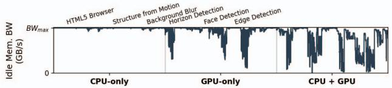  
Fig. 3. 在 CPU 与 GPU 并发工作负载下 NPU 的空闲内存带宽。

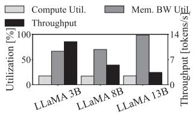  
 计算与内存带宽利用率，模型越大带宽需求越高。

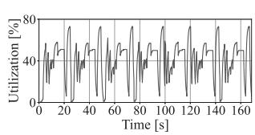  
 解码层推理期间随时间变化的内存带宽利用率。  
Fig. 4. Constrained-SoC 上 LLaMA-3 的计算与内存带宽利用率。

## III. 研究动机

与高性能服务器级或桌面级平台相比，移动 SoC 在更为严苛的内存和功耗约束下运行。它们仅能提供一小部分的片外 DRAM 带宽和片上缓存容量，因此要维持 LLM 推理的吞吐量变得相当困难。此外，端侧推理通常以 batch size 为一的方式运行，导致计算单元利用率天然偏低，使其特别容易受到内存停顿（memory stall）的影响。这种不平衡在解码器侧推理阶段进一步加剧，因为加载投影权重和键值（KV）缓存等访存密集型操作会产生突发式的访问模式。我们首先对一款商用 SoC 进行了性能剖析，发现 LLM 推理期间存在内存带宽瓶颈。为了进一步探究所观察到的带宽利用不足的根本原因，我们开展了一系列基于模拟器的实验。

## A. 静态编译器在动态运行时条件下的低效性

移动环境的动态特性以及 LLM 的计算特征给静态编译器驱动的优化带来了严峻挑战。在移动 SoC 中，硬件资源并非专属于单一应用，而是由多个并发运行的工作负载共享，导致资源可用性高度多变。这种环境可变性，加之 LLM 推理本身波动的需求，从根本上限制了离线静态优化策略的有效性。

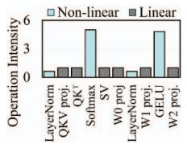

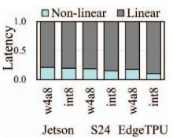

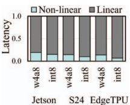  
 批大小为 1 时 GPT-3 的运算强度。 TinyLLaMA 的延迟分解。 GPT-3 的延迟分解。

Fig. 5. 移动平台上的运算强度与端到端延迟分解。  
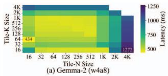

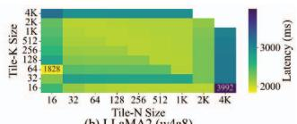  
Fig. 6. 静态编译器通过模拟器模拟，将每个权重以 N × K 尺寸的 tile 进行切分时，Gemma-2 和 LLaMA2 在不同 tile 尺寸下的延迟变化。

系统引起的带宽可变性。移动 SoC 采用统一内存架构，CPU、GPU 和 NPU 共享同一带宽受限的系统内存。在多程序执行环境下，由于并发运行工作负载的争用，每个处理单元可使用的有效内存带宽会动态波动。Fig. 3 通过刻画一款商用移动平台（搭载 Snapdragon 8 Elite SoC 的 Samsung Galaxy S25+）上 NPU 观测到的空闲内存带宽，展示了这种可变性。结果表明，NPU 可用的空闲带宽会因并发 CPU 与 GPU 活动的存在与否及其类型而发生大幅变化。为了模拟真实的移动使用场景，我们采用了 Geekbench 6 [39]，并在运行两个代表性 CPU 工作负载和四个代表性 GPU 工作负载的同时测量 NPU 的空闲内存带宽，从而捕捉实际多应用环境中内存带宽固有的可变性。这种可变性使得静态编译器调度难以持续选择与运行时可用带宽相匹配的 tile 尺寸。

工作负载引起的带宽可变性。这种不可预测性不仅存在于空闲时段，还体现在 LLM 推理期间内存带宽的实际使用上。我们在三个平台上开展了实验——Samsung Galaxy S24 Ultra、Google Edge TPU 以及 NVIDIA Jetson AGX Orin——以研究 LLM 的片外内存流量模式。由于商用移动设备上的硬件可见性有限，我们仅在 Jetson AGX Orin 上直接剖析了计算与内存带宽，该平台配备 8 核 Cortex-A78AE CPU、2048 核 Ampere GPU 以及 64 GB LPDDR5。为了近似移动 SoC 的性能特征，我们配置了一个特定环境，下文称之为 Constrained-SoC。在 Constrained-SoC 中，我们通过将内存控制器（EMC）频率限制在 512 MHz（对应约 32 GB/s 的峰值带宽）、GPU 频率限制在 714 MHz（对应约 5.5 TFLOPS 的 FP16 吞吐量）来约束硬件资源。

Fig. 4a 展示了 LLaMA-3 在解码阶段、三种不同模型规模下的计算与内存带宽利用率。虽然计算利用率几乎保持不变，但吞吐量随模型规模增大而下降，这表明内存带宽已成为主要的性能瓶颈。Fig. 4b 对 LLaMA 8B 上单个 Transformer 解码器层内随时间变化的内存带宽利用率进行了更细致的分析。剖析结果表明，内存带宽的使用波动显著。运算强度（Operation Intensity, OI）定义为计算量与内存流量之比，有助于解释这种带宽波动 [40]。线性运算具有低 OI 并会使内存带宽饱和，而非线性运算（如 Softmax 和 GELU）具有高 OI，会使内存系统利用不足。Figures 5b 和 5c 展示了经 QNN [41]、edgetpu_compiler [42] 和 NVCC [43] 编译的模型分别在 S24、EdgeTPU 和 Jetson 等移动级设备上、在 LLM 解码层的运行时间分解。高 OI 非线性运算在端到端执行时间中所占的比例在三个平台上保持一致。这种一致性验证了受约束的 Jetson 配置能够准确反映移动级设备的计算-内存行为。此外，结果表明 OI 特性在推理过程中动态演化，且高 OI 运算占整体延迟的相当大比例，这为其预加载提供了动机。

序列长度和可用内存带宽的可变性，使得静态编译器驱动的优化难以持续选择与运行时条件相匹配的 tile 尺寸。首先，不同用户请求之间的输入和输出 token 长度差异显著。其次，如 Fig. 6 所示，即使在受片上内存容量限制的可行 tile 尺寸范围内，模型推理延迟也会随静态编译器确定的 tile 尺寸而显著变化，增幅最高可达 2.9×。因此，要实现最优性能，就需要在运行时动态调整 tile 尺寸，以匹配不断变化的序列长度和波动的可用内存带宽。然而，试图针对每一种可能的序列长度和硬件条件进行静态优化或重新编译执行图，其代价高得令人望而却步。近期研究指出，在移动边缘处理器上针对单一可变 prompt 长度优化一个执行图可能耗时高达 11.5 秒 [44]。因此，离线编译器级优化无法有效扩展以覆盖运行时遇到的所有动态序列长度和带宽波动。

## B. 编译器管理的片上内存在大模型推理中的局限性

为了进一步研究观测到的带宽利用率不足的根本原因，我们进行了仿真分析，以模拟编译器管理的 SPM 的行为。具体而言，我们 (1) 分析了融合算子所创建的 tile 的生命周期，以理解它们在推理过程中如何占用并使片上内存产生碎片化，以及 (2) 评估了编译器的静态预取策略在缓解由内存带宽饱和导致的计算停顿方面的效果。详细的方法论与实现见 § VI。

  
 Transformer 层内的参数生命周期。


 融合带来的 SRAM 碎片化。
  
 大模型推理过程中的计算停顿周期。
Fig. 7. 编译器管理的片上内存的局限性。

内存碎片化。现代深度学习编译器通常将每个张量分配到片上 SRAM 的一块连续区域。随着层复杂度的增加，大型中间张量的不均匀生命周期自然导致内存碎片化。算子融合的广泛使用进一步加剧了这一问题。为了降低运行时开销并提升内存局部性，编译器通常采用融合技术，将多个算子合并为单个 kernel。常见的例子包括 QKV 投影融合、FlashAttention（融合 $Q \times K ^ { T }$、Softmax 以及 $S \times V,$）以及 FFN 融合（合并 W1 投影、GELU 与 W2 投影）[23]、[33]。

Fig. 7a 展示了在模拟编译器应用三种代表性优化（QKV 投影、Flash attention 和 FFN 融合）的模拟器中，基于数据复用的各算子的生命周期。例如，QKV 投影融合迫使 Q、K 和 V 的激活值在同一个 kernel 内计算并同时驻留，从而阻止其被提前释放。Fig. 7b 展示了在 2 MB SRAM 上同时应用这三种融合时，地址空间中内存占用随时间变化的一个片段。这使得在分配新内存时难以复用碎片化的地址空间。虽然这类融合提升了数据复用并减少了 kernel 启动开销，但它导致了输入与输出之间内存生命周期的重叠。这些相互依赖关系阻碍了内存的提前回收，在 SRAM 中留下碎片化且无法使用的区域。即使是像最佳适配这样的先进启发式分配器也无法完全缓解这一效应，导致 SRAM 利用率次优，某些情况下甚至引发片上内存溢出。关键的是，这种碎片化不仅仅是启发式分配的副产物：它源于 tile 必须以固定 tile 粒度、连续映射的要求，这使编译器无法将较小的活跃区域打包填入这些空隙。


(a) Tile 粒度的便签式内存管理。 粒度内存管理与提前回收。
Fig. 8. 通过片上内存管理缓解 I/O 突发。

预取的局限性。Fig. 7c 展示了解码层中计算停顿周期数量相对于 token 生成长度的变化，比较了实际实现与理论上限。第一种策略 Compiler-Ideal 基于全图活跃性分析模拟了真实的 XLA 行为。虽然它最小化了峰值内存使用，但它遵循连续内存分配的严格约束，迫使数据以连续块的形式加载到 SPM 中。相比之下，第二种策略 Optimal 通过放宽这一连续性约束，代表了理论上限。它假设数据可以以字节级粒度进行预取，从而在不产生碎片化开销的情况下充分利用整个 SRAM 容量。Compiler-Ideal 与 Optimal 之间的计算停顿差距（阴影部分）随生成长度逐渐增大，在 4K 时达到 32.7% 的峰值。这一差距主要源于静态 SPM 系统中粗粒度的内存管理和预取约束，反映的是一种根本性的架构限制，而非特定编译器的缺陷。

这一差距源于静态编译器发起预取请求的条件不充分。在当前的编译器驱动 SPM 系统中，只有当以下条件同时满足时才会触发预取：(1) 当前有可用的内存带宽，(2) 有足够的时间来获取一整块连续的内存 tile，以及 (3) 存在足够大的连续空闲片上内存区域来容纳数据。对内存连续性的要求，叠加内存碎片化问题，显著限制了编译器主动预取后续数据的能力。因此，可用的内存带宽常常处于未充分利用的状态，增加了因数据延迟就绪而导致计算停顿的概率。Compiler-Ideal 相较于 Optimal 的计算停顿周期增加，定量地展示了当前预取策略中连续性约束所引入的低效性。

## IV. SMOOTH 概述

我们提出 SMOOTH（SMOothing I/O Traffic with Hardware support，利用硬件支持平滑 I/O 流量），这是一种硬件辅助的片上内存管理框架，旨在最大化端侧 LLM 推理的内存带宽利用率。现有基于 scratchpad 的架构通常依赖粗粒度的 tile 分配，这要求连续的物理空间，并将内存复用推迟到完整计算结束之后。这种刚性导致碎片化问题，并且无法在计算密集周期内利用内存带宽余量。为了解决这些限制，SMOOTH 引入了一种细粒度的基于块（block）的内存系统，将逻辑张量组织与物理 SRAM 布局解耦，从而实现激进的预加载和持续的高吞吐。

SMOOTH 构建在一个基于硬件的动态内存控制器（Dynamic Memory Controller，DMC）之上，该控制器通过三个关键设计原则来管理内存操作：第一，细粒度块分配。内存不以可变大小的 tile 进行管理，而是以与硬件处理单元对齐的固定大小块进行管理。这种方法消除了可变大小分配中常见的外部碎片和内存空洞，并简化了空闲空间追踪的硬件逻辑。第二，低开销地址转换。DMC 采用直接映射的块表和基于位图的空闲列表，将编译器可见的逻辑地址转换为物理 SRAM 地址。为了最小化延迟，该转换机制包含一个 address_check 模块，允许对顺序映射的区域进行直接访问，在保持空间局部性时绕过表查找。第三，硬件驱动的早期回收。与等待显式软件释放信号的传统设计不同，SMOOTH 通过硬件管理的 use_cnt 自主追踪 tile 的使用情况，使内存块在其数据被消费后即可立即回收。

SMOOTH 将复杂内存调度的负担从编译器转移到运行时硬件。编译器执行静态生命周期分析以标注使用计数，而 DMC 负责动态分配与释放。这种协同设计使 SMOOTH 能够显著放宽分配约束，为逻辑上相邻的张量使用非连续的物理内存。因此，计算受限阶段的可用带宽被有效利用，可以比传统流水线方案更早地预加载即将使用的数据（例如后续层的权重）。如图 8 所示，SMOOTH 的细粒度管理与早期回收机制积极利用这些空闲时间进行预加载，最大化计算与 I/O 的重叠，并缓解内存受限 SoC 中的带宽瓶颈。基于块的内存分配通过解决现有方法的粒度限制，显著提升了 attention 阶段的预加载效率。如图 9 所示，我们针对非碎片化和碎片化两种情况，比较了四种片上内存数据管理与未来数据预加载策略： 硬件管理的 cache，硬件以最细粒度预取数据； 由编译时静态分析驱动的尽力而为预加载，以实现最小的片上内存占用，这在现代深度学习编译器中被广泛采用； 硬件驱动的基于块的内存分配，结合编译器驱动的预加载； 采用快速回收已用块的基于块的内存分配，并结合激进预加载。首先，在连续内存中，硬件管理的预取器 在当前张量范围内盲目运行，无法提前为 Vcache（记为 \$V）进行前瞻。相比之下， 依赖于编译器引导的生命周期分析来确定内存分配。激进预加载策略 试图通过尽早且紧凑地分配 tile 来最大化片上内存利用率。然而，其有效性从根本上受到粗粒度 tile 边界的制约：如果某个 tile 无法放入剩余的连续区域，预加载就无法进行。基于块的分配 解除了这一限制，将逻辑 tile 与物理布局分离，尽管这引入了内部碎片。这有效提升了 SRAM 利用率，因为 tile 的一部分（例如 V — cache1 块）可以在少量空闲空间可用时立即被预加载。

  
Fig. 9. On-chip memory management strategies for contiguous and noncontiguous memory cases.

这一优势在碎片化场景中尤为关键。随着 S × V 计算的推进，一些已被使用的 V projection 和 attention 输出会被释放，以便为未来的 tile 预加载腾出空间。当释放导致内存碎片化时，硬件 cache 可以通过细粒度的 cache line 分配利用碎片化空间，但它缺乏对未来 tile 访问的了解，因此无法主动为下一个操作预加载数据。标准编译器 无法有效利用碎片化空间，并预加载大型连续的权重张量 $W 0 _ { 0 }$ 和 W01，导致外部碎片。然而，基于块的分配 能够有效识别这些分散的可用块，并用额外的权重（W10）进行预加载，从而无论物理碎片化如何，都能维持较高的片上利用率。在 中，采用早期块回收的基于块分配策略抢占式地回收已被消费的 $V _ { 3 }$ 和 $S _ { 3 }$ 的块。释放的块随后被用于预加载下一个 tile $( W 1 _ { 1 } )$。

## V. SMOOTH 架构

## A. 基于块的片上内存管理

为简化设计，SMOOTH 采用固定大小的块来管理片上内存，类似于虚拟内存系统中的分页机制。然而，与操作系统的分页不同，其虚拟地址空间并不比物理 SRAM 大多少。传统的虚拟内存为每个进程抽象出一个宽广的地址空间，而 SMOOTH 则暴露一个块虚拟化的分配接口，协助 DL 编译器编排 SPM 的分配。尽管放宽物理连续性要求减少了碎片化，但所有活跃数据仍必须容纳于物理 SRAM 之内；超出这一限制将迫使代价高昂的片外访问。因此，编译器可见的虚拟空间实际上受限于 SRAM 容量，从而可以采用高效的直接映射转换表。图 12a 展示了所需的微架构。每个块表项存储物理块地址（p\_blk）、所分配的连续块数量（cont）以及编译器推导的剩余使用计数（use\_cnt），同时用位图跟踪所有物理块的分配状态，以实现快速的空闲空间搜索与回收。buffer 中的 address\_check 模块判定一次访问是否需要地址转换。DMC 中的四个轻量级模块以较低开销实现转换与高效的块管理：find\_zero 用于识别最长的空闲区域，alloc 用于预取并分配块，free 用于回收已过期的块，block\_table\_lookup 用于解析地址映射。

  
Fig. 10. Block-based on-chip memory allocation.

  
Fig. 11. Memory access requested from the buffer during the Q projection.

图 10 展示了一个内存分配场景：在虚拟地址 Ox05 处发起 4 MB 的请求，use\_cnt 为 2。分配策略取决于 SRAM 中是否存在足够大的连续空闲块区域，这由分配位图进行跟踪。在情形 ① 中，存在一个至少为 4MB 的连续空闲区域，分配器找到一个覆盖物理块 Ox02 至 Ox08 的空闲跨度。位图随之更新以反映此次分配，直接映射的块表记录虚拟地址与所分配物理块之间的映射。对于对应 virt=Ox05 的每个虚拟块，p\_blk 字段存储所分配的物理块地址，cont 字段存储剩余的连续块数量，并且所有表项的 use\_cnt 字段均设置为 2。在情形 ② 中，如果碎片化导致无法找到足够容纳请求的连续区域，DMC 会分配多个互不相邻的物理块区域。DMC 首先通过 find\_zero 模块获取最长连续区域的起始块地址与大小，并从起始地址开始顺序分配块。如果请求的分配超出该区域的大小，分配器会重复搜索以找到下一个最长的连续区域（先分配 Ox09–Ox0C，再分配 Ox01–Ox03）。位图相应更新，块表在 p\_blk 表项中记录所分配的块索引。cont 字段记录每个已分配段内的连续长度，而 use\_cnt 字段则与连续分配情形下保持一致。

  
Fig. 12. (a) Design component of SMOOTH. (b) Access with address translation. (c) Direct access without block table lookup. (d) Access with end\_cmd for early reclamation. (e) Reclaim blocks that ensure data integrity. (f) Preload data into reclaimed blocks using idle bandwidth.

## B. 快速高效的地址转换

为了提升 LLM 推理中片上内存管理的效率，我们提出了一种快速且轻量的地址转换机制，该机制利用空间局部性来最小化查找开销。该机制建立在前面介绍的基于块的内存管理方案之上，并采用直接映射的块表，在编译器生成的虚拟地址与物理 SRAM 地址之间实现快速转换。其核心思想是利用深度学习工作负载中常见的连续分配模式来减少转换查找，尤其是在 Q/K/V 投影等矩阵乘法运算期间。图 8 展示了输入向量与权重 Q 矩阵相乘运算期间 buffer 发起的内存访问场景。

在缺少物理地址的情况下访问数据 a 和 A 需要进行块表查找。然而，完成地址转换后，对连续地址内数据的访问可以直接使用物理地址进行。如图 12b 所示，当 buffer 以查找标志 1 请求访问数据 a 时，DMC 通过块表执行地址转换，并将数据连同相应的物理地址与连续块数量（p\_blk=0x2400，cont=4）一并传输给 buffer。转换完成后，buffer 会缓存该连续范围的信息（p\_blk、cont），供后续访问使用，从而在该连续内存范围内可以直接通过物理地址访问数据，无需额外的块表查找。为了有效管理这些直接访问，buffer 逻辑会动态监测架构块大小所定义的块边界对应的地址位字段（例如，针对 1 KB 的块大小，跟踪第 10 个地址位）。在 ISA 指令执行期间，buffer 利用这一位级信息检测块索引何时发生变化，表明访问已进入一个新的块。图 12c 中的数据 b 位于先前接收到的连续空间内，因此可以直接以物理地址（0x2500）访问，从而降低访问延迟。然而，如果跨越了块边界且缓存的 cont 信息表明下一个块在物理上并不连续，buffer 会重新置起查找标志，发起新的地址转换请求。此外，buffer 逻辑能够感知正在执行的 ISA 指令的内存访问模式与输入规模，从而可以判定对某个 buffer 的所有访问何时全部完成。

通过跟踪 ISA 指令的执行进度，buffer 可以识别对某个块的最后一次访问发生在何时。在为该最后一次访问发起内存加载请求时，buffer 会置起 end\_cmd 标志。例如，在图 12d 中，当请求块 0x2400–0x27FF 的最后一个数据元素 d 时，buffer 设置 end\_cmd=1，表明该块在当前指令中将不再被使用。随后 DMC 递减块表中相应的 use\_cnt 表项，使该块得以提前回收并被后续分配复用。

## C. 数据预加载

为了缓解 LLM 推理期间的突发内存流量，SMOOTH 执行一种硬件辅助的回收与预加载（reclaim-and-preload）机制，在被请求之前从不再使用的数据中回收内存，并将数据预加载到已释放的空间中。在没有待处理内存请求的空闲周期期间，DMC 会在内部周期性地识别 use_cnt 已降至零的已分配块（图 12e）。如图 12f 所示，早期回收遵循严格的顺序，以确保对回收区域的安全复用。DMC 首先更新块表状态，将相应块标记为不再使用，然后清除关联的位图（bitmap）条目。由于分配决策依赖位图来识别空闲空间，这种顺序可防止新的分配在回收过程完全完成之前覆写数据。回收内存后，DMC 立即开始预加载，以利用原本空闲的内存带宽。当检测到空闲带宽周期时，DMC 按顺序预加载数据。每次预加载时机所加载的块数由式 (1) 确定：

$$
N _ { \mathrm { p r e l o a d } } = \lfloor ( U \times B W ) / B l o c k _ { - } s i z e \rfloor\tag{1}
$$

其中 $N _ { \mathrm { p r e l o a d } }$ 是要预加载的块数，$U$ 表示可用的空闲计算周期，$B W$ 是可用的内存带宽，该值由硬件在执行期间动态测量。当为预加载分配块时，位图和块表中相应的条目会被更新以反映其新状态。

预加载持续进行，直到空闲预算耗尽或不再有剩余空闲区域。DMC 以细粒度块级别从主存将后续数据块预加载到 SRAM 中，并将最后检索的块的索引存储在寄存器中。当从缓冲区访问数据时，DMC 会查询该寄存器以确定对应数据是否已完全加载到片上存储器中。如果加载已完成，则直接从 SRAM 读取数据；否则从主存获取数据，从而确保数据传输的无缝延续。通过将早期回收与带宽感知预加载相结合，SMOOTH 实现了细粒度、主动式的 SRAM 管理，降低了突发性，掩盖了碎片化带来的性能损失，并在受限的片外带宽下维持高吞吐量的数据流。

## D. 开销

为了评估所提出的硬件模块的面积、时序和功耗开销，我们使用开源综合工具 Yosys [45] 对五个关键功能进行了综合。鉴于 Snapdragon 8 Gen3 采用 TSMC 的 4 nm 工艺制造 [46]，我们使用了公开可用的 ASAP7 7 nm 标准单元库 [47]，据我们所知，这是目前可用的最精确的开源工艺节点。由于 NPU 的确切裸片面积未公开，我们保守地假设其占用整个 SoC 面积的 10%，并将该估计值作为计算相对面积开销的基准。综合在表 III 所述的硬件配置下进行，目标是移动级 NPU 以及表 IV 所述的 GPT-Neo-Quant。表 I 报告了 1 KB 块大小下的面积估计，其他块大小的结果见第 VI 节。NPU 和 SRAM 行对应假设的基准组件，而计算和内存（SRAM）条目则显示了我们模块的综合开销。相对于估计的

TABLE I  
所提出模块的面积开销。
<table><tr><td></td><td>NPU</td><td>SRAM</td><td>Compute</td><td>Memory (SRAM)</td></tr><tr><td> $\mathrm { A r e a } ( \mu \mathrm { m } ^ { 2 } )$ </td><td>13,730,000</td><td>1,811,939</td><td>314</td><td>13,050</td></tr><tr><td>Ratio (%)</td><td></td><td>13.2</td><td>0.0023</td><td>0.095</td></tr></table>

TABLE II

各硬件模块的延迟与功耗。
<table><tr><td>Metric</td><td>find_zero</td><td>alloc</td><td>addr_check</td><td>bt_lookup</td><td>free</td></tr><tr><td>Time (ps)</td><td>364.4</td><td>1508.2</td><td>83.7</td><td>615.2</td><td>654.6</td></tr><tr><td>Power (pW)</td><td> $1 . 4 \times 10 ^ { - 1 }$ </td><td> $5 . 5 \times 10 ^ { - 1 }$ </td><td> $3 . 0 \times 10 ^ { - 2 }$ </td><td> $2 . 3 \times 10 ^ { - 1 }$ </td><td> $2 . 8 \times 10 ^ { - 1 }$ </td></tr></table>

NPU 面积而言，计算逻辑仅增加 0.0023%，内存控制逻辑仅增加 0.095%，这证实了整体硬件占用面积可以忽略不计。表 II 总结了各硬件模块的延迟（以皮秒为单位）和功耗（以皮瓦为单位）。相对于观察到的延迟降低，SMOOTH 引入的时序开销极小，而其功耗保持在亚纳瓦范围内，表明对整体系统效率的影响可以忽略不计。具体而言，在表 IV 所述的硬件配置下，在所有输入长度为 1024、输出长度为 2048 的实验中，控制开销始终低于总延迟的 0.1%。该开销已计入第 VI 节给出的评估结果中，以确保端到端执行时间测量的准确性。

## VI. 评估

## A. 实验设置

我们使用 LLMCompass [27]（一个面向基于 Transformer 的 LLM 推理的周期级精确模拟器）来评估 SMOOTH。LLMCompass 构建于 ScaleSim [28] 之上，可模拟 Transformer 模型的生成阶段。我们在模拟器中集成了一个端到端的 SRAM 管理器，以支持基于地址的分配，并实现整个执行过程中的数据预取（preloading）。所有实验均在反映移动 NPU 架构特点的硬件配置下进行，该架构具有紧张的 SRAM 约束、较低的内存带宽以及固定功能的计算引擎（如矩阵单元和向量单元）。详细系统配置见表 III，该配置参考了 Qualcomm Hexagon V73 处理器（HMX、HVX [48]）和移动 DDR 内存（LPDDR5）[49]–[51]。

在 § III 所述的实验中，非线性操作在 TinyLLaMA 总执行时间中的占比分别为 20.4%、17.0% 和 14.1%（分别对应 Jetson AGX Orin、Galaxy S24 Ultra 和 Edge TPU），而 GPT-2.7B 的对应比例为 17.1%、12.5% 和 10.3%（图 5b）。相比之下，模拟器报告的比例较小，TinyLLaMA 和 GPT-2.7B 分别为 9.4% 和 5.7%（图 13）。这些结果表明，我们的模拟环境对非线性操作所占执行时间的估计是保守的。

基线（Baseline）。我们比较了五种片上内存管理策略。Compiler-Ideal：一种理想化的基于编译器的策略，假设可以进行最大程度的内存预取，并采用最佳适应（best-fit）内存分配，利用生命周期分析以及非重叠内存缓冲区的复用来提升内存效率 [22], [25], [52]。此外，针对每一层和每个操作，它通过模拟评估从 512 B 到 4 MB 的 tile 大小，并选择能产生最小时延的配置。Capuchin [53]：一种硬件管理策略，将片上内存视为 64 字节的 cache，基于运行时访问模式以 cache 行粒度动态预取张量，以改善数据局部性并减少停顿。Gemmini [54]：一个全栈 DNN 加速框架。它采用流水线式的片上内存分配策略，通过重叠输入/输出 tile，实现细粒度的字节级预取。SMOOTH-Base：一种块粒度的内存分配器，可减少 SPM 内的碎片，并通过紧凑的数据放置提升内存带宽利用率。SMOOTH-ER：在 SMOOTH-Base 基础上增加了对未使用内存块的提前回收（early reclamation）。该回收机制提高了内存复用率，并允许及时预取未来的数据，从而支持连续且高效的数据流。

TABLE III  
移动 NPU 的模拟环境。
<table><tr><td>参数</td><td>移动 NPU</td></tr><tr><td>核心频率</td><td>940 MHz</td></tr><tr><td>核心数量</td><td>1</td></tr><tr><td>矩阵引擎 (ME)</td><td>32×32</td></tr><tr><td>向量引擎 (VE)（每 lane 32 个 ALU）</td><td>32 lanes</td></tr><tr><td>SRAM 大小</td><td>2  /  8  /  32MB</td></tr><tr><td>DRAM 带宽</td><td>16 /  32 /  64 /  128 GB/s</td></tr></table>

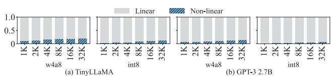  
图 13. 在 Compiler-Ideal（基线）上，线性操作与非线性操作在端到端时延中的占比分解。

## B. 模型

为了反映真实的移动端部署场景，我们选择了适合在资源受限的移动 NPU 上执行的基于 Transformer 的 LLM。鉴于在移动 NPU 上运行大参数量 LLM 推理的需求日益增长，我们还评估了较大的模型，例如 GPT-3 13B。所选模型在架构规模和量化格式上各不相同，从而能够对一系列计算与内存需求进行全面的评估。表 IV 总结了它们的配置。所有模型均采用了 § III 中描述的三种算子融合（图 7a），这些融合在现代深度学习编译器中已被广泛采用。为了契合设备端助手和聊天应用等移动使用场景，我们在所有实验中均使用批量大小（batch size）为 1 的设置，与 [50], [55] 中的做法一致。

TABLE IV  
模型配置详情。
<table><tr><td>模型</td><td>#参数量</td><td>#层数</td><td>#注意力头数</td><td>dmodel</td><td>量化</td></tr><tr><td>TinyLLaMA [56]</td><td>1.1B</td><td>22</td><td>32</td><td>2048</td><td>w4a8/int8</td></tr><tr><td>GPT-Neo [57]</td><td>1.3B</td><td>24</td><td>16</td><td>2048</td><td>w4a8/int8</td></tr><tr><td>GPT-3 XL [58]</td><td>1.3B</td><td>24</td><td>24</td><td>2048</td><td>w4a8/int8</td></tr><tr><td>Gemma-2 [59]</td><td>2.0B</td><td>18</td><td>8</td><td>2048</td><td>w4a8/int8</td></tr><tr><td>GPT-3 2.7B [58]</td><td>2.7B</td><td>32</td><td>32</td><td>2560</td><td>w4a8/int8</td></tr><tr><td>LLaMA2 [60]</td><td>7.0B</td><td>32</td><td>32</td><td>4096</td><td>w4a8/int8</td></tr><tr><td>Bloom [61]</td><td>7.1B</td><td>30</td><td>32</td><td>4096</td><td>w4a8/int8</td></tr><tr><td>GPT-3 13B [58]</td><td>13.0B</td><td>40</td><td>40</td><td>5140</td><td>w4a8/int8</td></tr></table>

  
图 14. 相对于 Compiler-Ideal 归一化的 TTFT。

## C. 实验结果

TTFT。图 14 展示了五种分配策略在 8MB SRAM 下、以 Compiler-Ideal 为基准归一化的首 Token 响应时间（TTFT）。首 Token 推理不需要 KV cache，因此 8MB 已经足够。因此，将 SRAM 增加到 32 MB 至多只能将 TTFT 降低 1.0%。由于 TTFT 的计算强度较高，只需像 Gemmini 那样对下一个 tile 进行流水线化即可提升性能，但 Compiler-Ideal 由于预加载时间不足而表现不佳。然而，得益于细粒度的块级预加载，SMOOTH-ER 相较于 Compiler-Ideal 实现了平均 41.4%、最高 59.2% 的 TTFT 降低。Capuchin 在 GPT 模型上表现出 TTFT 的降低，但在其他模型上与 Compiler-Ideal 相近。这种延迟源于硬件 cache 无法预取由于 SRAM 容量增大而由 FlashAttention 增加的 attention tile，因为它缺乏编译器提供的张量数据生命周期信息。

TTLT。图 16a 展示了输入长度为 512 个 Token、SRAM 容量为 8 MB 时，端到端生成延迟（称为 Time-to-Last-Token，TTLT）随输出长度的可扩展性。TTLT 度量的是从输入 prompt 到生成最后一个 Token 的延迟，是评估用户感知响应能力的综合指标。柱状图展示了所提出的 SMOOTH-ER 内存管理方案相对于两个基线（Compiler-Ideal 和 Gemmini）所取得的相对性能提升。SMOOTH-ER 相较于 Compiler-Ideal 实现了 43.2% 的整体平均性能提升，相较于 Gemmini 实现了 49.1% 的整体平均性能提升，最大性能提升分别达到 60.0% 和 73.0%。此外，SMOOTH-ER 相较于基线 SMOOTH-Base 最多带来了 24.0% 的平均性能提升。另外，柱状图中的阴影区域表示 prompt 阶段对性能增益的贡献比例。对于较短的输出长度，大部分增益来自 prompt 阶段。然而，随着输出 Token 长度的增加，生成阶段贡献了整体性能提升的主要部分。对于较短的输出长度，attention 和非线性操作的耗时较短，留给预加载的空闲周期不足。这导致与对下一个 tile 进行流水线化的 Gemmini 相比，提升幅度较小。然而，随着输出 Token 长度的增加，预加载更多数据显著提升了性能。相反，Compiler-Ideal 也会随着输出长度的增加通过预加载更多数据来提升性能，但由于采用连续的 SPM 地址分配，会导致内存碎片化。SMOOTH-ER 通过解决内存碎片化问题，在所有输出长度下均显著降低了相较 Compiler-Ideal 的延迟。图 15 展示了性能提升对 SRAM 大小的敏感性。当 SRAM 大小降至 2 MB 或增至 32 MB 时，提升幅度趋于下降。通过流水线方式预加载下一个 tile 的 Gemmini 对 SRAM 大小几乎不敏感。当片上内存较小时，用于预加载的物理内存容量受限。然而，当片上内存较大时，可以通过更大的 tile 尺寸和连续地址分配来降低延迟，从而进一步缩小提升幅度。特别是，随着片上内存大小的增加，SMOOTH-ER 相较于 Compiler-Ideal 的性能增益显著下降。这是因为当片上内存充足时，Compiler-Ideal 遭受的内存碎片化较少，能够预加载足够数量的数据。

  
(a) ∆ vs Compiler-Ideal  
(b) ∆ vs Gemmini  
图 15. 相对于 8 MB 基线的增益随 SRAM 大小的敏感性，分别为 2 MB 和 32 MB。

片上内存占用率。图 16b 和图 16c 展示了每第 N 个 Token 的逐 Token 生成延迟，以及在 Token 生成过程中所有层的平均 SRAM 占用率，比较了启用与不启用算子融合两种情况。在不启用融合的情况下，随着输出序列长度的增加，由于 KV cache 的存在，需要加载到片上内存中的数据量不断增长。然而，由于各算子在无优化的情况下串行执行，内存带宽趋于饱和，包括基线 Compiler-Ideal 在内的所有策略的性能提升都很有限。相比之下，算子融合在一定程度上缓解了内存带宽饱和，从而实现了激进的预加载，显著降低了推理延迟。具体而言，图 17 展示了 attention 运算结束时的 SRAM 占用率。对于 Capuchin，其层级别的端到端占用率与其他策略相当，但在 attention 阶段结束时占用率急剧下降。在不启用融合的情况下，各算子独立执行，使得即使是强大的预取器也难以预测后续算子，从而限制了性能。而启用融合后，多个算子被合并为单一的 Tensor 级执行单元，从而实现更高效的预取并降低延迟。图 18 展示了在 GPT-Neo 和 LLaMA2 中，随着输出长度的增加，为每个算子加载 tile 时可由缓冲区满足（命中 tile）的比例。尽管块会被快速回收，但 LLaMA2 这样的大模型每个算子仍需要大量 tile，而每次只有其中一小部分能够驻留在片上内存中。因此，即使 SRAM 占用率很高，SMOOTH-ER 相较于 SMOOTH-Base 带来的额外延迟降低仍然有限。此外，SMOOTH 利用编译器计算的算子生命周期信息来预加载那些在硬件层面难以预测的未来张量的数据，从而实现进一步的延迟降低。

内存带宽敏感性。图 19a 评估了 SMOOTH-ER 对 GPT-Neo 在不同内存带宽（16、32、64、128 GB/s）以及最大带宽 64 GB/s 下 Geekbench 协同运行负载干扰时的 inter-token latency（ITL）的影响，展示了 SMOOTH-ER 相较于基线策略的性能提升。Geekbench 按照 § III 中的设置，测试了两个 CPU 负载和四个 GPU 负载。结果表明，随着内存带宽的降低，系统越来越受内存限制，SMOOTH-ER 带来的性能增益也更为显著。在所有评估的配置中，SMOOTH-ER 相较于 Capuchin 实现了平均 30.5% 的延迟降低，相较于 Compiler-Ideal 实现了 40.0% 的延迟降低。与 SMOOTH-Base 相比，SMOOTH-ER 带来了平均 11.1%（最高 47.0%）的性能提升。当内存带宽足够大时，内存容量与传输约束得以缓解，SMOOTH-ER 与 SMOOTH-Base 之间的性能差距随之缩小。相反，在带宽受限的条件下，早期回收（early reclamation）能够带来更大的性能收益。此外，尽管 CPU/GPU 负载干扰导致空闲带宽动态变化，ITL 相较于 Compiler-Ideal 实现了平均 42.7% 的增益，相较 SMOOTH-Base 实现了 5.0% 的增益。

输入序列长度敏感性。图 19b 展示了在固定输出生成长度为 1024 个 Token 的前提下，归一化 ITL 随输入序列长度的变化情况。最近，长上下文推理的需求快速增长，即便在移动环境中也是如此。随着输入序列长度的增长，KV cache 的内存占用成比例增加，严重劣化了生成阶段的延迟。在这些内存密集的条件下，所提出架构的有效性变得尤为显著。SMOOTH-ER 相较于 Gemmini 实现了高达 73.0% 的性能提升，并相较 SMOOTH-Base 额外获得高达 26.4% 的改进。按序列长度进行详细分解可以看出，SMOOTH-ER 的相对优势呈现出明显的上升趋势。例如，相较于 Gemmini 的平均增益从 2K 序列长度下的 50.1% 稳步扩展到 32K 下的 66.8%，这证实了 SMOOTH-ER 能够高效缓解处理长输入序列所带来的不断攀升的内存开销。

能耗分析。图 20 展示了根据块大小生成第 N 个 Token 的能耗，因为所提出架构的开销会随每个输出序列长度的块大小而变化。随着生成长度的增加，基线架构中频繁的内存访问和低效的缓存利用率导致能耗急剧飙升。在这些严重受内存限制的条件下，所提出架构的能效优势变得尤为突出。总体而言，在假定每个序列长度均采用最优块大小的情况下，SMOOTH-ER 分别相较于 Compiler-Ideal、Gemmini 和 Capuchin 实现了平均 44.0%、51.2% 和 39.9% 的能耗降低。按生成长度进行详细分解可以看出，SMOOTH-ER 的相对能耗节省呈现出明显的上升趋势。例如，相较于 Gemmini 的能耗降低从 1K 序列长度下的 28.1% 稳步增长到 32K 下高达 70.7% 的水平。类似地，相较于 Compiler-Ideal 的节省从 30.7% 增长到 56.7%。此外，实验数据证实，SMOOTH-ER 引入的硬件模块开销极其微小——在 32K 序列下峰值仅为 15 纳焦耳。SMOOTH-ER 在有效缓解长上下文生成所带来的能耗增长的同时，几乎不产生任何额外的架构开销。

 32K-th Token  
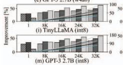

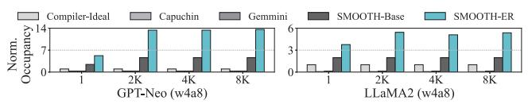

  
 

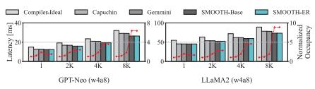

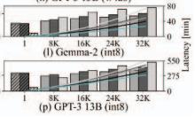

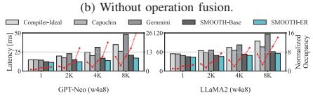  
 操作融合（With operation fusion）。
图 16.  SMOOTH-ER 相较于 Capuchin、Compiler-Ideal 和 Gemmini 的 TTLT 及其增益， 每 Token 生成延迟与 SRAM 占用率， 分别为未融合 与融合 情况，均归一化到 Compiler-Idea1 下输出长度为 1 的情形。

图 17. 归一化到 Compiler-Ideal 的 Attention 结束时的 SRAM 占用率。
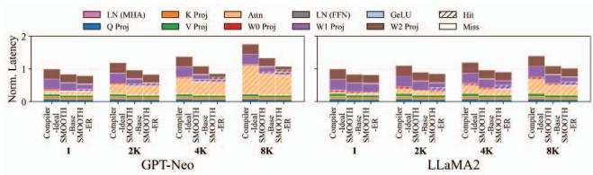  
图 18. 每个操作中命中 Tile 相对于未命中 Tile 的缓冲区内存占用比率。


 在 16-128 GB/s 内存带宽下的 ITL 提升以及 64 GB/s 下并发工作负载干扰的情况。
  
 取决于输入序列长度的归一化 ITL。
图 19. 动态运行时因素对 Inter-token 延迟的影响。

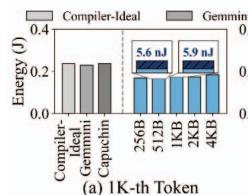

  
 第 8K 个 Token

  
图 20. 不同块大小下生成第 N 个 Token 的能耗。

块大小敏感性。图 21a 展示了三个代表性模型——GPT-Neo、LLaMA2 和 GPT-3 13B——在 SMOOTH-ER 不同块大小下的端到端延迟，评估条件为输入长度 1024、输出长度 2048 以及 8 MB SRAM 容量。延迟值归一化到块大小为 1024 字节时的基线延迟。每个柱子上方的数值标注表示各块大小下产生的相对控制开销。较小的块大小通过细粒度预加载和改善内存复用来降低延迟；然而，这会增加块表查找开销。虽然有限的 SRAM 会因碎片化引发的 find\_zero 操作而加剧延迟，但 SMOOTH 的专用硬件设计确保了控制开销可忽略不计。该开销数值量化了连续区域高效地址转换所带来的延迟降低。虽然较小的块通常会增大 block\_table\_lookup 开销，但我们的 lookup flg 机制避免了连续地址的冗余转换。更大的 SRAM 容量也会提高找到连续空闲区域的可能性，从而降低 find\_zero 和 alloc 开销。与基线相比，连续地址转换带来了 0.2% 的延迟降低。SMOOTH-Base 和 SMOOTH-ER 通常将块大小设置为模型维度。然而，如果块大小与 Tile 大小未对齐，内部碎片化可能导致延迟最多增加 9.9%（图 21b）。


 不同块大小下的归一化端到端延迟与相对控制开销。
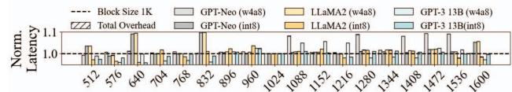  
 块大小未对齐时由内部碎片化导致的延迟劣化。
图 21. SMOOTH-ER 的块大小敏感性。

## VII. 相关工作

模型级内存占用缩减。为了应对 LLM 巨大的内存需求，各类模型级技术已被广泛采用，包括权重/激活量化 [62]、[63]、剪枝 [64] 以及 KV cache 优化 [65]–[68]。尽管这些方法能有效降低内存容量需求，但它们通常伴随着复杂的权衡，例如潜在的精度退化或不规则的计算模式。与这些模型修改方法无关，SMOOTH 仅专注于微架构层面的效率提升，而不改变模型表示。因此，SMOOTH 不会引入任何精度退化，并且可以与现有压缩技术正交地结合使用，以实现进一步的推理加速。

静态内存分配。基于软件的方法（如 XLA [24]、TVM [25]、FlashAttention [33]）应用了分块（tiling）与融合（fusion）来改善计算局部性。然而，这些方法依赖于静态生命周期分析。这种刚性使它们无法适应运行时的变化，例如波动的移动端内存带宽或变化的 LLM 推理长度，这常常导致严重的片上碎片化，并且无法利用突发性 LLM 解码阶段中短暂的带宽冗余。为了降低数据移动的开销，现代 GPU 架构引入了硬件加速的拷贝引擎。例如，NVIDIA 的 Tensor Memory Accelerator（TMA）[69] 卸载了异步数据传输，在硬件中处理地址生成以降低寄存器压力。

然而，尽管 TMA 是一种高效的数据移动引擎，它并不提供内存虚拟化能力；它严格要求物理连续或按步长排布的地址模式。因此，它缺乏利用 LLM 推理执行阶段中不可避免地出现的分散内存碎片的能力。相比之下，SMOOTH 采用块级虚拟化将逻辑张量与物理地址解耦，使硬件能够利用静态编译器和固定功能拷贝引擎均无法利用的非连续空闲空间。

动态内存虚拟化。为了克服静态分配的刚性，硬件辅助的动态内存管理已被积极研究。基础性工作如 SPMVisor [70] 引入了硬件/软件虚拟化层（vSPM）来透明地分配分布式片上存储器，而 HaVOC [71] 则将其扩展到混合 SRAM/NVM 架构。最近，诸如 Amoeba-Cache [72] 之类的自适应 cache 架构被提出，通过基于空间局部性动态调整 cache 块大小来减少存储浪费。然而，此类纯硬件方法本质上是反应式的：它们依赖过去的访问模式，而不知道未来的数据生命周期。这一局限使它们无法执行应对 LLM 突发 I/O 流量所需的前瞻性内存回收与预加载。相比之下，我们的工作通过将细粒度块分配与编译器驱动的前瞻性管理相结合，解决片上 SRAM 利用率不足的问题，使 SMOOTH 能够通过静态活跃度分析提前回收内存并预加载数据。

## VIII. 结论

我们提出了一种新方法，用于解决限制基于 Transformer 的 LLM 在移动 SoC 上推理的突发性片外内存流量问题。我们的硬件辅助、块粒度的 SRAM 管理——由运行时数据活跃度跟踪与提前回收驱动——在不修改模型参数、不牺牲精度的前提下，将 load/store 请求在时间上分散开来。该设计以 Verilog 实现并集成到 LLMCompass 中，在现实的 SRAM 与 DRAM 带宽约束下，将 TTLT 最多降低 73.0%。其收益随片上容量的增大而增长，可作为 Compiler-Ideal、Capuchin 和 Gemmini 基线的有力补充。未来工作包括更紧密的编译器-硬件协同调度以实现联合生命周期分析、扩展到异构加速器池，以及面向多租户或流式场景的竞争感知策略。

## 致谢

本研究得到了韩国政府（MSIT）资助的信息与通信技术规划与评估院（IITP）基金（Nos. RS-2024-00396013, RS-2024-00459797, RS-2025-02263869 和 RS-2025-09942968），以及韩国政府（MSIT）资助的韩国国家研究基金会（NRF）基金（No. RS-2026-25490694）的支持。

[1] R. Anil, A. M. Dai, O. Firat, M. Johnson, D. Lepikhin, A. Passos, S. Shakeri, E. Taropa, P. Bailey, Z. Chen, et al., "Palm 2 technical report," arXiv preprint arXiv:2305.10403, 2023.

[2] J. Achiam, S. Adler, S. Agarwal, L. Ahmad, I. Akkaya, F. L. Aleman, D. Almeida, J. Altenschmidt, S. Altman, S. Anadkat, et al., "Gpt-4 technical report," arXiv preprint arXiv:2303.08774, 2023.

[3] H. Touvron, T. Lavril, G. Izacard, X. Martinet, M.-A. Lachaux, T. Lacroix, B. Rozière, N. Goyal, E. Hambro, F. Azhar, et al., "Llama: Open and efficient foundation language models," arXiv preprint arXiv:2302.13971, 2023.

[4] A. T. Neumann, Y. Yin, S. Sowe, S. Decker, and M. Jarke, "An llm-driven chatbot in higher education for databases and information systems," IEEE Transactions on Education, 2024.

[5] J. K. Kim, M. Chua, M. Rickard, and A. Lorenzo, "ChatGPT and large language model (LLM) chatbots: The current state of acceptability and a proposal for guidelines on utilization in academic medicine," Journal of Pediatric Urology, vol. 19, no. 5, pp. 598–604, 2023.

[6] L. Zheng, W.-L. Chiang, Y. Sheng, S. Zhuang, Z. Wu, Y. Zhuang, Z. Lin, Z. Li, D. Li, E. Xing, et al., "Judging llm-as-a-judge with mt-bench and chatbot arena," Advances in neural information processing systems, vol. 36, pp. 46595–46623, 2023.

[7] Z. Yang, X. Xu, B. Yao, E. Rogers, S. Zhang, S. Intille, N. Shara, G. G. Gao, and D. Wang, "Talk2care: An llm-based voice assistant for communication between healthcare providers and older adults,"Proceedings of the ACM on Interactive, Mobile, Wearable and Ubiquitous Technologies, vol. 8, no. 2, pp. 1–35, 2024.

[8] A. Mahmood, J. Wang, B. Yao, D. Wang, and C.-M. Huang, "Llm-powered conversational voice assistants: Interaction patterns, opportunities, challenges, and design guidelines," arXiv preprint arXiv:2309.13879, 2023.

[9] S. Huang, X. Zhao, D. Wei, X. Song, and Y. Sun, "Chatbot and fatigued driver: Exploring the use of LLM-based voice assistants for driving fatigue," in Extended Abstracts of the CHI Conference on Human Factors in Computing Systems, 2024, pp. 1–8.

[10] J. Xu, Z. Li, W. Chen, Q. Wang, X. Gao, Q. Cai, and Z. Ling, "On-device language models: A comprehensive review," arXiv preprint arXiv:2409.00088, 2024.

[11] Meta, "What's New Across Our AI Experiences," 2023. [Online]. Available: https://about.fb.com/news/2023/12/meta-ai-updates/

[12] Meta, "Meta AI is Now Multilingual, More Creative and Smarter," 2024. [Online]. Available: https://about.fb.com/news/2024/07/meta-ai-is-nowmultilingual-more-creative-and-smarter/

[13] Meta Quest Blog, “Smart(er) Glasses: Introducing New Ray-Ban — Meta Styles + Expanding Access to Meta AI with Vision," 2024. [Online]. Available: https://www.meta.com/blog/ray-ban-metasmart-glasses-new-styles-multimodal-ai-ferrari/

[14] Apple,"Apple Intelligence," 2024. [Online].Available: https://www.apple.com/apple-intelligence/

[15] Samsung,“Galaxy AI," 2024. [Online]. Available: https://www.samsung.com/us/galaxy-ai/

[16] L. Yang, K. Sreedhar, H. Liu, and E. Beigne, "Enabling On-Device Large Language Models with 3D-Stacked Memory," in NeurIPS 2024 Workshop Machine Learning with new Compute Paradigms, 2024.

[17] G. Heo, S. Lee, J. Cho, H. Choi, S. Lee, H. Ham, G. Kim, D. Mahajan, and J. Park, "Neupims: Npu-pim heterogeneous acceleration for batched llm inferencing," in Proceedings of the 29th ACM International Conference on Architectural Support for Programming Languages and Operating Systems, Volume 3, 2024, pp. 722–737.

[18] J. Park, J. Choi, K. Kyung, M. J. Kim, Y. Kwon, N. S. Kim, and J. H. Ahn, "Attacc! unleashing the power of pim for batched transformerbased generative model inference," in Proceedings of the 29th ACM International Conference on Architectural Support for Programming Languages and Operating Systems, Volume 2, 2024, pp. 103–119.

[19] M. Zhou, W. Xu, J. Kang, and T. Rosing, "Transpim: A memorybased acceleration via software-hardware co-design for transformer," in 2022 IEEE International Symposium on High-Performance Computer Architecture (HPCA), 2022, pp. 1071–1085.

[20] OpenXLA, "xla: A machine learning compiler for GPUs, CPUs, and ML accelerators," 2025. [Online]. Available: https://github.com/openxla/xla

[21] Apache TVM, "Apache TVM: An End-to-End Machine Learning Compiler Framework for CPUs, GPUs and Accelerators," 2024. [Online]. Available: https://tvm.apache.org/

[22] M. Li, Y. Liu, X. Liu, Q. Sun, X. You, H. Yang, Z. Luan, L. Gan, G. Yang, and D. Qian, "The deep learning compiler: A comprehensive survey," IEEE Transactions on Parallel and Distributed Systems, vol. 32, no. 3, pp. 708–727, 2020.

[23] “Optimize Large Language Model TVM How-To Tutorial," 2025. [Online]. Available: https://tvm.apache.org/docs/how\_to/tutorials/optimize\_llm.html

[24] TensorFlow, "XLA (Accelerated Linear Algebra)," 2024. [Online]. Available: https://www.tensorflow.org/xla?hl=ko

[25] T. Chen, T. Moreau, Z. Jiang, L. Zheng, E. Yan, H. Shen, M. Cowan, L. Wang, Y. Hu, L. Ceze, et al., "TVM: An automated End-to-End optimizing compiler for deep learning," in 13th USENIX Symposium on Operating Systems Design and Implementation (OSDI 18), 2018, pp. 578–594.

[26] Y. Shi, Z. Yang, J. Xue, L. Ma, Y. Xia, Z. Miao, Y. Guo, F. Yang, and L. Zhou, "Welder: Scheduling deep learning memory access via tilegraph," in 17th USENIX Symposium on Operating Systems Design and Implementation (OSDI 23), 2023, pp. 701–718.

[27] H. Zhang, A. Ning, R. B. Prabhakar, and D. Wentzlaff, "Llmcompass: Enabling efficient hardware design for large language model inference," in 2024 ACM/IEEE 51st Annual International Symposium on Computer Architecture (ISCA), 2024, pp. 1080–1096.

[28] A. Samajdar, Y. Zhu, P. Whatmough, M. Mattina, and T. Krishna, "Scale-sim: Systolic cnn accelerator simulator," arXiv preprint arXiv:1811.02883, 2018.

[29] N. P. Jouppi, C. Young, N. Patil, D. Patterson, G. Agrawal, R. Bajwa, S. Bates, S. Bhatia, N. Boden, A. Borchers, et al., "In-datacenter performance analysis of a tensor processing unit," in Proceedings of the 44th annual international symposium on computer architecture, 2017, pp. 1–12.

[30] R. Krashinsky, O. Giroux, S. Jones, N. Stam, and S. Ramaswamy, "NVIDIA A100 Tensor Core GPU Architecture: Ampere Architecture Whitepaper," Technical White Paper, NVIDIA Corporation, May 2020. [Online]. Available: https://images.nvidia.com/aem-dam/enzz/Solutions/data-center/nvidia-ampere-architecture-whitepaper.pdf

[31] Y.-H. Chen, T. Krishna, J. S. Emer, and V. Sze, "Eyeriss: An energyefficient reconfigurable accelerator for deep convolutional neural networks," IEEE journal of solid-state circuits, vol. 52, no. 1, pp. 127–138, 2016.

[32] S. Zouzoula, M. A. Maleki, M. W. Azhar, and P. Trancoso, "Scratchpad Memory Management for Deep Learning Accelerators," in Proceedings of the 53rd International Conference on Parallel Processing, 2024, pp. 629–639.

[33] T. Dao, D. Fu, S. Ermon, A. Rudra, and C. Ré, "FlashAttention: Fast and Memory-Efficient Exact Attention with IO-Awareness,"Advances in Neural Information Processing Systems, vol. 35, pp. 16344–16359, 2022.

[34] L. Zheng, C. Jia, M. Sun, Z. Wu, C. H. Yu, A. Haj-Ali, Y. Wang, J. Yang, D. Zhuo, K. Sen, et al., "Ansor: Generating {High-Performance} tensor programs for deep learning," in 14th USENIX symposium on operating systems design and implementation (OSDI 20), 2020, pp. 863–879.

[35] H. Zhu, R. Wu, Y. Diao, S. Ke, H. Li, C. Zhang, J. Xue, L. Ma, Y. Xia, W. Cui, et al., "{ROLLER}: Fast and efficient tensor compilation for deep learning," in 16th USENIX Symposium on Operating Systems Design and Implementation (OSDI 22), 2022, pp. 233–248.

[36] TensorFlow Team, “TensorFlow Lite," 2025. [Online]. Available: https://www.tensorflow.org/lite

[37] P. Jain, A. Jain, A. Nrusimha, A. Gholami, P. Abbeel, J. Gonzalez, K. Keutzer, and I. Stoica, "Checkmate: Breaking the memory wall with optimal tensor rematerialization,"Proceedings of Machine Learning and Systems, vol. 2, pp. 497–511, 2020.

[38] M. Maas, U. Beaugnon, A. Chauhan, and B. Ilbeyi, "Telamalloc: Efficient on-chip memory allocation for production machine learning accelerators," in Proceedings of the 28th ACM International Conference on Architectural Support for Programming Languages and Operating Systems, Volume 1, 2022, pp. 123–137.

[39] "Geekbench: Cross-Platform Benchmark," 2026. [Online]. Available: https://www.geekbench.com/

[40] S.-C. Kao, S. Subramanian, G. Agrawal, A. Yazdanbakhsh, and T. Krishna, "Flat: An optimized dataflow for mitigating attention bottlenecks," in Proceedings of the 28th ACM International Conference on Architectural Support for Programming Languages and Operating Systems, Volume 2, 2023, pp. 295–310.

[41] Qualcomm Technologies, Inc.,“QualcommAI Engine Direct SDK," 2025. [Online].Available: https://www.qualcomm.com/developer/software/qualcomm-ai-enginedirect-sdk

[42] Coral, "Edge TPU Compiler," Google LLC, 2025. [Online]. Available: https://www.coral.ai/docs/edgetpu/compiler

[43] NVIDIA Corporation, "NVIDIA CUDA Compiler Driver NVCC," 2025. [Online]. Available: https://docs.nvidia.com/cuda/cuda-compiler-drivernvccl

[44] D. Xu, H. Zhang, L. Yang, R. Liu, G. Huang, M. Xu, and X. Liu, "Fast on-device llm inference with npus," in Proceedings of the 30th ACM International Conference on Architectural Support for Programming Languages and Operating Systems, Volume 1, 2025, pp. 445–462.

[45] C. Wolf, "Yosys Open SYnthesis Suite," 2023. [Online]. Available: https://yosyshq.net/yosys/

[46] J. Yuan, J. Deng, V. Lin, Y. Chen, J. Chiu, M. Lin, J. Chen, D. Zhang, Y. Chen, D. Liu, et al., "High performance 5G mobile SOC productization with 4nm EUV Fin-FET technology," in 2023 IEEE Symposium on VLSI Technology and Circuits (VLSI Technology and Circuits), 2023, pp. 1–2.

[47]“ASAP7 PDK," [Online]. Available: https://github.com/The-OpenROAD-Project/asap7

[48] “Qualcomm Hexagon V73 Technical Reference," 2025. [Online]. Available: https://docs.qualcomm.com/bundle/publicresource/80-N2040- 54.pdf

[49] “"Snapdragon 8 Gen 3 Mobile Platform Product Brief," 2025. [Online]. Available: https://docs.qualcomm.com/bundle/publicresource/87-71408- 1\_REV\_C\_Snapdragon\_8\_gen\_3\_Mobile\_Platform\_Product\_Brief.pdf

[50] Z. Xue, Y. Song, Z. Mi, X. Zheng, Y. Xia, and H. Chen, "Powerinfer-2: Fast large language model inference on a smartphone," arXiv preprint arXiv:2406.06282, 2024.

[51] L. Chen, D. Feng, E. Feng, Y. Wang, R. Zhao, Y. Xia, P. Xu, and H. Chen, "Characterizing Mobile SoC for Accelerating Heterogeneous LLM Inference," in Proceedings of the ACM SIGOPS 31st Symposium on Operating Systems Principles, 2025, pp. 359–374.

[52] Z. Zheng, P. Zhao, G. Long, F. Zhu, K. Zhu, W. Zhao, L. Diao, J. Yang, and W. Lin, "Fusionstitching: boosting memory intensive computations for deep learning workloads," arXiv preprint arXiv:2009.10924, 2020.

[53] X. Peng, X. Shi, H. Dai, H. Jin, W. Ma, Q. Xiong, F. Yang, and X. Qian, "Capuchin: Tensor-based gpu memory management for deep learning," in Proceedings of the Twenty-Fifth International Conference on Architectural Support for Programming Languages and Operating Systems, 2020, pp. 891–905.

[54] H. Genc, S. Kim, A. Amid, A. Haj-Ali, V. Iyer, P. Prakash, J. Zhao, D. Grubb, H. Liew, H. Mao, et al., "Gemmini: Enabling Systematic Deep-Learning Architecture Evaluation via Full-Stack Integration," in Proceedings of the 58th Annual Design Automation Conference (DAC), 2021.

[55] Z. Yu, S. Liang, T. Ma, Y. Cai, Z. Nan, D. Huang, X. Song, Y. Hao, J. Zhang, T. Zhi, et al., "Cambricon-llm: A chiplet-based hybrid architecture for on-device inference of 70b llm," in 2024 57th IEEE/ACM International Symposium on Microarchitecture (MICRO), 2024, pp. 1474–1488.

[56] TinyLlama, "TinyLlama-1.1B-Chat-v1.0 (Hugging Face model)," 2024. [Online]. Available: https://huggingface.co/TinyLlama/TinyLlama-1.1B-Chat-v1.0

[57] EleutherAI, "GPT-Neo-1.3B (Hugging Face model)," 2024. [Online]. Available: https://huggingface.co/EleutherAI/gpt-neo-1.3B

[58] T. Brown, B. Mann, N. Ryder, M. Subbiah, J. D. Kaplan, P. Dhariwal, A. Neelakantan, P. Shyam, G. Sastry, A. Askell, et al., "Language models are few-shot learners," Advances in neural information processing systems, vol. 33, pp. 1877–1901, 2020.

[59] Google, "Gemma-2-2B-IT (Hugging Face model)," 2024. [Online]. Available: https://huggingface.co/google/gemma-2-2b-it

[60] Meta, "Llama-2-7b (Hugging Face model)," 2023. [Online]. Available: https://huggingface.co/meta-llama/Llama-2-7b

[61] BigScience, "BLOOM-7B1 (Hugging Face model)," 2022. [Online]. Available: https://huggingface.co/bigscience/bloom-7b1

[62] E. Frantar, S. Ashkboos, T. Hoefler, and D. Alistarh, "Gptq: Accurate post-training quantization for generative pre-trained transformers," arXiv preprint arXiv:2210.17323, 2022.

[63] S. Li, X. Ning, K. Hong, T. Liu, L. Wang, X. Li, K. Zhong, G. Dai, H. Yang, and Y. Wang, "Llm-mq: Mixed-precision quantization for efficient llm deployment," in The Efficient Natural Language and Speech Processing Workshop with NeurIPS, vol. 9, 2023, p. 3.

[64] M. Zhu and S. Gupta, "To prune, or not to prune: exploring the efficacy of pruning for model compression," arXiv preprint arXiv:1710.01878, 2017.

[65] I. Beltagy, M. E. Peters, and A. Cohan, "Longformer: The longdocument transformer," arXiv preprint arXiv:2004.05150, 2020.

[66] M. Zaheer, G. Guruganesh, K. A. Dubey, J. Ainslie, C. Alberti, S. Ontanon, P. Pham, A. Ravula, Q. Wang, L. Yang, et al., "Big bird: Transformers for longer sequences," Advances in neural information processing systems, vol. 33, pp. 17283–17297, 2020.

[67] E. Voita, D. Talbot, F. Moiseev, R. Sennrich, and I. Titov, "Analyzing multi-head self-attention: Specialized heads do the heavy lifting, the rest can be pruned," arXiv preprint arXiv:1905.09418, 2019.

[68] Z. Zhang, Y. Sheng, T. Zhou, T. Chen, L. Zheng, R. Cai, Z. Song, Y. Tian, C. Ré, C. Barrett, et al., "H2o: Heavy-hitter oracle for efficient generative inference of large language models," Advances in Neural Information Processing Systems, vol. 36, pp. 34661–34710, 2023.

[69] NVIDIA Corporation, “Tensor Memory Accelerator (TMA) CUDA Core Compute Libraries (CCCL)," 2026. [Online]. Available: https://nvidia.github.io/cccl/unstable/cccl/tma.html

[70] L. A. D. Bathen, N. D. Dutt, D. Shin, and S.-S. Lim, "SPMVisor: dynamic scratchpad memory virtualization for secure, low power, and high performance distributed on-chip memories," in Proceedings of the seventh IEEE/ACM/IFIP international conference on Hardware/software codesign and system synthesis, 2011, pp. 79–88.

[71] L. A. Bathen and N. Dutt, "HaVOC: A hybrid memory-aware virtualization layer for on-chip distributed scratchpad and non-volatile memories," in Proceedings of the 49th Annual Design Automation Conference, 2012, pp. 447–452.

[72] S. Kumar, H. Zhao, A. Shriraman, E. Matthews, S. Dwarkadas, and L. Shannon, "Amoeba-cache: Adaptive blocks for eliminating waste in the memory hierarchy," in 2012 45th Annual IEEE/ACM International Symposium on Microarchitecture, 2012, pp. 376–388.


## 附录

## A. 摘要

本工件（artifact）包含 SMOOTH 的实现，这是一个硬件辅助的细粒度片上内存管理框架，同时还包括用于对比的基线方案（Compiler-Ideal、Capuchin、Gemmini）。该工件将我们定制的片上内存管理机制集成到开源的 LLMCompass 周期级精确模拟器中，以评估推理延迟和能耗。此外，它还包含所提出的硬件模块（如动态内存控制器、早期回收逻辑）的 Verilog RTL 代码，这些代码使用 Yosys 和 ASAP7 预测性 7 nm 标准单元库进行综合，以评估面积、功耗和时序开销。所有基础实验均通过 shell 和 Python 脚本执行，可以复现每个模型的执行指标，并生成图 14、图 16 和图 20，以及表 1 和表 2。由于该模拟器使用结构性元数据而非执行实际的模型权重，因此该工件具有很高的内存效率。论文中观察到的一般性能趋势和架构开销在不同宿主机上均保持有效。

## B. 工件清单（元信息）

• 算法：硬件辅助的基于块的内存分配与早期回收

• 程序：LLMCompass（基于 Python 的模拟器）、SMOOTH RTL（Verilog）

• 编译：Yosys（用于 Verilog RTL 综合）、OpenSTA（用于静态时序分析）

• 模型：TinyLLaMA、GPT-Neo、Gemma-2、LLaMA2、Bloom、GPT-3（结构性元数据）

• 数据集：工作负载与元数据配置（已包含在仓库中）

• 运行环境：Docker（推荐）或带有 Conda 的 Linux（Python 3.9）

• 硬件：标准 x86 多核 CPU，8–16 GB 内存

• 执行：Bash shell 脚本和 Python 脚本

• 指标：首 Token 时间、末 Token 时间、能耗、硬件面积、功耗、时序

• 输出：图（EPS/PNG 格式）、用于生成表格的原始数据日志

• 实验：延迟/能耗仿真以及用于评估硬件开销的 RTL 综合

• 大约需要多少磁盘空间？：约 10 GB（用于仿真日志和综合输出）

• 准备工作流程大约需要多少时间？：15–30 分钟

• 完成实验大约需要多少时间？：在 48 核 CPU 上约 20 小时（取决于宿主 CPU 性能）

• 是否公开可用？：是

• 使用的自动化工作流框架？：Docker、Bash/Shell 脚本

• 是否已存档（提供 DOI）？：是

## C. 描述

1) 访问方式：所有源代码、脚本和配置文件均可在我们的 GitHub 仓库中获取：https: //github.com/skkim-caslab/SMOOTH。

2) 硬件依赖：一台配备 x86 CPU 和至少 8–16 GB 主存的标准工作站或笔记本电脑。无需专用硬件（GPU、FPGA、NPU），因为本工件依赖于基于软件的周期级精确仿真和逻辑综合。

3) 软件依赖：我们强烈建议使用 Docker，因为它会自动解决旧版硬件综合工具所需的所有系统级依赖（如 glibc、libreadline）。所提供的 Docker 镜像基于 Ubuntu 22.04。如果在宿主机上原生运行，所需软件包括 Linux 操作系统、Conda（Python 3.9）、PyTorch（v2.0.0）、scalesim==2.0.2（严格限定版本以防止配置错误）、matplotlib、pandas 和 seaborn。此外，Yosys 和 OpenSTA 必须在本地安装。ASAP7 预测性 PDK 已包含在仓库中。

4) 数据集：本工件评估了多个大语言模型。由于模拟器使用结构性元数据（如层数、维度、注意力头数）而非加载实际的参数权重来建模执行过程，因此不需要外部的数 GB 规模的数据集。所有工作负载配置元数据均已原生包含在仓库中。

5) 模型：仿真轨迹表示 TinyLLaMA、GPT-Neo、Gemma-2、LLaMA2、Bloom 和 GPT-3 的执行过程。

## D. 安装

评估者可以选择我们推荐的基于 Docker 的设置，或基于本地 Conda 的设置。

## 选项 1：Docker 环境（强烈推荐）

1) 克隆仓库：

git clone <repository\_url> SMOoTH

2) 从根目录构建 Docker 镜像：cd SMOOTH && docker build -t isca2026\_smooth\_ae.

3) 运行容器并挂载仓库：docker run -it --rm --name smooth\_ae\_env -v \$(pwd):/workspace/SMOOTH isca2026\_smooth\_ae（容器内会自动设置环境变量 \$SMOOTH\_HOME。）

## 选项 2：Conda 环境（备选方案）

1) 克隆仓库并设置环境变量：export SMOOTH\_HOME=/path/to/your/SMOOTH

2) 搭建 Python 环境：-1 u y uvn n

conda create -n smooth\_ae python=3.9   
&& conda activate smooth\_ae   
pip install scalesim==2.0.2   
matplotlib pandas seaborn   
conda instal1 pytorch==2.0.0-c   
pytorch

3) 在宿主机系统上安装 Yosys 和 OpenSTA（例如通过 apt 或从源码构建）。

## E. 实验工作流

在 \$SMOOTH\_HOME 目录下（无论是在 Docker 容器内还是在 Conda 环境中）执行以下指令以复现结果：

## 1) 生成基线和 SMOOTH 策略数据：

cd \$SMOOTH\_HOME/src/policies

## 2) 复现延迟图（图 14 与图 16）：

cd \$SMOOTH\_HOME/src/ae/figure14

&& python plot\_ttft.py

../../../data/seq\_1/8MB

cd \$SMOOTH\_HOME/src/ae/figure16

&& python plot\_latency.py

## 3) 复现能耗图（图 20）：

```shell
cd $SMOOTH_HOME/src/ae/figure20 &&
python plot_energy.py
```

## 4) 综合硬件模块：

cd \$SMOOTH\_HOME/src/verilog/ && bash run\_all.sh

## 5) 复现开销表（表 1 与表 2）：

```shell
cd $SMOOTH_HOME/src/ae/table1 &&
python get_area.py
cd $SMOOTH_HOME/src/ae/table2 &&
python get_power.py
```

## F. 评估与预期结果

与图 14、图 16 和图 20 以及表 1 和表 2 对应的关键实验结果，将由上述脚本生成到各自的目录中。

• 图 14（TTFT）：展示 SMOOTH 相较于基线所实现的归一化首 Token 时间的降低。

• 图 16（TTLT）：展示在不同 Token 长度下整体生成延迟的降低。

• 图 20（能耗）：验证 SMOOTH 在第 N 个 Token 生成方面带来的能效收益。

• 表 1 与表 2（硬件开销）：详细说明 5 个综合后的硬件模块（address\_check、alloc、bt\_lookup、find\_zero、free）的面积、功耗和时序开销的原始输出。结果将证实，相对于性能收益而言，这些开销可以忽略不计。

## G. 实验定制

评估者可以通过修改所提供 shell 脚本中的仿真参数来定制实验。例如，更改输入/输出序列长度或调整目标 SRAM 容量（例如从 8 MB 改为 2 MB 或 32 MB），即可测试 SMOOTH 对不同内存约束的敏感性，这与论文中讨论的敏感性分析相吻合。

## H. 说明

由于 LLMCompass 是一个确定性的周期级精确模拟器，无论宿主机的绝对计算速度如何，所报告的延迟周期数都将保持一致。模拟器本身的执行时间可能会因宿主 CPU 而异，但最终评估得到的硬件指标将保持稳定。
