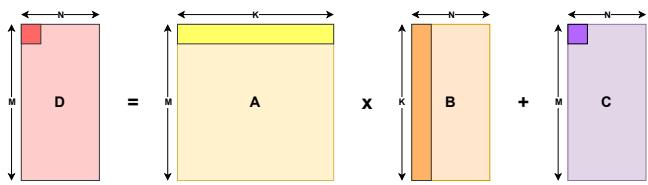
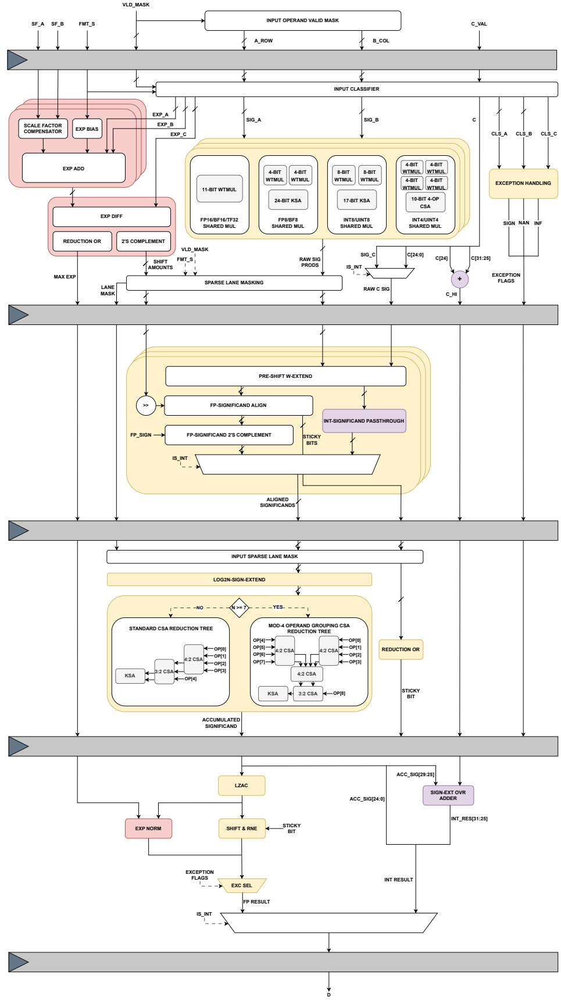
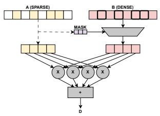
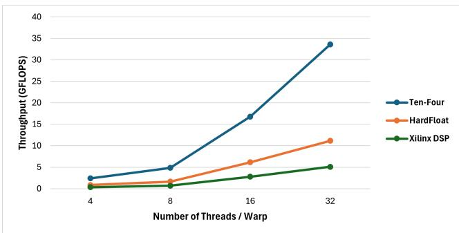

# Ten-Four: An Open-Source Fused Dot Product Unit for Mixed-Precision GPGPU Tensor Cores 图表详解

### Fig. 1: Tensor Core sub-matrix-tile MMA dimensions

- **图像基本信息**
    - 图像标识：**Fig. 1: Tensor Core sub-matrix-tile MMA dimensions**
    - 图像类型：**架构示意图 / 数学运算可视化**
    - 核心功能：展示 **Tensor Core** 执行 **Warp-Matrix-Multiply-Accumulate (WMMA)** 操作时的子矩阵瓦片（sub-matrix-tile）维度关系

- **视觉元素解析**
    - **矩阵 D**（粉色/红色区域）：输出结果矩阵，维度为 **M × N**，位于等式左侧
    - **矩阵 A**（黄色区域）：左操作数矩阵，维度为 **M × K**，代表输入特征/激活值
    - **矩阵 B**（橙色区域）：右操作数矩阵，维度为 **K × N**，代表权重参数
    - **矩阵 C**（紫色区域）：累加器/偏置矩阵，维度为 **M × N**，与输出同维度
    - **运算符号**：明确展示 **D = A × B + C** 的 **MMA（Matrix Multiply-Accumulate）** 运算语义

- **数学表达与硬件映射**
    - 对应论文公式 (1)：
        $$D_{m,n} = \sum_{i=0}^{K-1} (A_{m,i} \times B_{i,n}) + C_{m,n}$$
    - **维度约束逻辑**（基于论文 Section I 详细推导）：
        - 受限于 **warp register** 容量（32线程/warp 配置下为 **1024 bits**）
        - 矩阵 A、B 使用**低精度格式**（FP16/BF16/FP8/BF8/INT8/INT4）
        - 矩阵 C、D 使用**高精度格式**（FP32/INT32）以保证数值稳定性

- **典型配置维度实例**

| 输入格式 | 累加格式 | M 维度 | N 维度 | K 维度 | MMA 形状 |
|---------|---------|--------|--------|--------|----------|
| **FP16/BF16** | **FP32** | 8 | 4 | 8 | **8×4×8** |
| **FP8/BF8** | **FP32** | 8 | 4 | 16 | **8×4×16** |
| **INT8** | **INT32** | 8 | 4 | 8 | **8×4×8** |
| **INT4** | **INT32** | 8 | 4 | 16 | **8×4×16** |

- **架构设计意义**
    - **数据密度优化**：通过 **register packing scheme**（如图 2 所示），在 32-bit 寄存器中打包多个低精度元素（如 2个FP16 或 4个FP8 或 8个INT4）
    - **计算密度最大化**：方形或近方形瓦片设计（M≈K）优化 **tiling efficiency** 和 **cache locality**
    - **Ten-Four 实现基础**：该图定义的 **[M×N] grid of K-element Fused Dot Product (FEDP) units** 正是 Ten-Four 微架构的基本构建单元（如图 3 所示的 **8×4 grid of 8-element FEDP**）

- **精度混合策略体现**
    - **乘法阶段**（A × B）：使用低精度（如 FP16）减少存储带宽和计算复杂度
    - **累加阶段**（+ C）：使用高精度（如 FP32）防止多次累加导致的 **rounding error accumulation**
    - 这种 **mixed-precision** 设计是现代深度学习加速器的核心特征，平衡了吞吐量与数值精度

### Fig. 4: Ten-Four Mixed-Precision Fused Dot Product Microarchitecture

- **整体架构概览**：
    - 图 4 展示了 **Ten-Four Mixed-Precision Fused Dot Product Microarchitecture** 的详细数据通路（Datapath）设计。
    - 这是一个 **4级流水线（4-stage pipeline）** 结构，图中灰色的粗横条代表了各级之间的**流水线寄存器（Pipeline Registers）**。
    - 该设计核心在于**融合（Fused）**了浮点（Floating-Point）和整数（Integer）运算，并集成了**Microscaling (MX)** 格式支持和**稀疏性（Sparsity）**优化。

- **Stage 1: 共享乘法、指数计算与异常处理 (Shared Multiplier, Exponent & Exception Handling)**：
    - **输入分类 (Input Classifier)**：根据输入格式信号 (`FMT_S`) 对操作数 A 和 B 进行分类。
    - **共享乘法器阵列 (Shared Multipliers)**：
        - 采用 **Class-wise Shared Multiplier** 策略以平衡面积和速度。
        - **FP16/BF16/TF32**：共用 **11-bit Wallace Tree Multiplier (WTMUL)**。
        - **FP8/BF8**：共用两个 **4-bit WTMUL**，并通过 **24-bit Kogge-Stone Adder (KSA)** 求和。
        - **INT8/UINT8**：使用 **8-bit WTMUL** 配合 **17-bit KSA**。
        - **INT4/UINT4**：使用 **4-bit WTMUL** 配合 **10-bit 4:2 CSA**。
    - **指数处理与 MX 支持 (Exponent & MX Logic, 粉色区域)**：
        - 包含 **Scale Factor Compensator**（缩放因子补偿器）和 **Exp Bias** 逻辑，用于原生支持 **Microscaling (MX)** 格式。通过将块缩放因子直接融入初始指数加法（`EXP ADD`）中，实现了早期累加（Early Accumulation）。
        - **Max Exp Identification**：通过 `EXP DIFF` 计算差值矩阵，利用 `REDUCTION OR` 和并行比较逻辑快速找出最大指数，用于后续对阶。
    - **异常检测 (Exception Handling)**：并行检测 NaN、Infinity 等特殊情况，生成异常标志。

- **Stage 2: 有效数字对齐 (Significand Alignment)**：
    - **预移位与扩展 (Pre-shift & Extend)**：根据 Stage 1 计算出的移位量（Shift Amounts）对乘积结果进行对齐。
    - **浮点对齐 (FP-Significand Align)**：执行右移操作以对齐指数，并进行 **2's Complement** 转换（处理符号位）。同时计算 **Sticky Bits**（粘滞位）以保证舍入精度。
    - **整数旁路 (Int-Significand Passthrough)**：整数数据通路在此阶段基本直通或仅做简单处理，因为整数不需要像浮点那样复杂的小数点对齐。
    - **稀疏通道掩码 (Sparse Lane Masking)**：在此阶段应用掩码逻辑，若检测到输入为零（由 Stage 1 的 Valid Mask 控制），可关闭相应通道的数据通路活动。

- **Stage 3: 累加 (Accumulation)**：
    - **CSA 归约树 (CSA Reduction Tree)**：这是设计的核心累加单元。
        - 支持动态配置：当操作数 $N > 7$ 时（例如 32线程/warp 配置），自动切换至 **MOD-4 Operand Grouping CSA** 以缩短关键路径；否则使用 **Standard CSA**。
        - 将所有对齐后的乘积项与加数 C 的低 25 位（`C[24:0]`）进行多操作数归约求和。
    - **整数加数拆分策略 (Addend Splitting Strategy)**：
        - 为了解决 32 位整数加数 C 超出浮点累加器宽度的问题，设计将 C 拆分为两部分。
        - **低 25 位 (`C[24:0]`)**：送入主要的 CSA 树进行累加。
        - **高 7 位 (`C[31:25]`, 即 `C_HI`)**：绕过 CSA 树，直接通过流水线传递至最后一级。这种设计显著减少了中间级寄存器的开销。

- **Stage 4: 归一化、舍入与结果选择 (Normalization, Rounding & Selection)**：
    - **前导零预测计数 (LZAC)**：对累加结果进行前导零计数，确定归一化所需的移位量。
    - **规格化与舍入 (Shift & RNE)**：
        - 执行左移归一化操作。
        - 应用 **Round-to-Nearest-Even (RNE)** 舍入算法，结合 Guard、Round 和 Sticky bits 生成最终的 FP32 结果。
    - **整数结果重组 (Integer Result Assembly)**：
        - **Sign-Extd Ovr Adder**：将 Stage 3 累加器的溢出/进位（`ACC_SIG[28:25]` 或类似高位）与旁路传来的 `C_HI` 进行相加。
        - 最终将此结果与低 25 位拼接，形成完整的 **INT32** 输出。
    - **异常选择 (Exc Sel)**：根据 Stage 1 生成的异常标志，决定是输出正常计算结果还是 IEEE-754 标准的特殊值（NaN/Inf）。

- **关键设计特性总结**：

| 特性 | 实现细节 | 架构优势 |
| :--- | :--- | :--- |
| **Mixed-Precision (混合精度)** | 支持 FP16/BF16/TF32/FP8/BF8 及 INT8/INT4 输入，FP32/INT32 累加 | 统一架构覆盖主流 AI 训练与推理精度需求 |
| **Fused Datapath (融合数据通路)** | 浮点与整数共用 CSA 累加器和归一化逻辑 | 减少面积开销，消除调度延迟 |
| **MX Format Support (微缩放格式)** | 在 Stage 1 将 Scale Factor 直接融入指数计算 | 兼容 OCP MX 标准，支持块量化加速 |
| **Sparsity Support (稀疏支持)** | Sparse Lane Masking 机制配合时钟门控 | 降低动态功耗，适应稀疏模型推理 |
| **Addend Splitting (加数拆分)** | 32位整数 C 拆分为高低两部分分别处理 | 解决了整数位宽大于浮点中间位宽的物理限制 |

### (a) Sparse-Dense interaction.

- **图像核心主题**: 该图展示了 **Inner-Product Primitive**（内积原语）在 **Sparse-Dense Interaction**（稀疏-稠密交互）场景下的数据流与控制机制，是 Ten-Four 架构中 **Sparse Lane Mask** 策略的原理示意图。

- **输入向量特征分析**:
    - **向量 A (SPARSE)**: 呈现稀疏分布，包含多个空白格（代表零值元素）和少量有效元素（黄色填充）。这种稀疏性常见于经过剪枝（Pruning）后的深度学习模型权重或激活值。
    - **向量 B (DENSE)**: 呈现稠密分布，所有位置均包含有效数据（粉色填充）。

- **掩码生成与传播机制**:
    - **MASK 生成逻辑**: 系统对稀疏向量 A 进行**零值检测（Zero-Detection）**，生成位级掩码信号（MASK）。该掩码精确映射了 A 向量中非零元素的位置。
    - **控制路径**: MASK 信号向下传递至算术逻辑层，作为**时钟门控（Clock-Gating）**或操作使能的控制依据。

- **计算通道选择性激活**:
    - **乘法阵列 (×)**: 图示包含 5 个并行乘法单元。在 Sparse-Dense 模式下，仅当 A 对应位置的元素非零时，对应的乘法器才被激活执行浮点/整数乘法。
    - **资源节省**: 对于 A 为零的 lane，通过门控技术**冻结其流水线寄存器**，消除该路径上的开关活动（Switching Activity），从而显著降低动态功耗。

- **归约与输出**:
    - **累加器 (+)**: 所有被激活通道产生的部分积（Partial Products）汇入最终的加法树/累加器进行归约求和。
    - **输出 D**: 产生融合点积（Fused Dot Product）的最终结果。

- **架构设计意义**:
    - 该机制解决了传统 Inner-Product 单元在处理**单侧稀疏**时的效率问题：无需改变底层内积计算原语的面积效率优势，仅通过微架构层面的门控优化即可实现功耗降低。
    - 这是 Ten-Four 相对于 Outer-Product（外积）方案（需存储大型中间矩阵）的**务实折中（Pragmatic Middle Ground）**，在保持高计算密度的同时适配了现代深度学习工作负载的稀疏特性。

### 02e5a80d755c7ce07b594c4c1b90820e5300d4a8eaf9ab45dd958e0c68f3a2af.jpg

*   **图表类型与主题**：该图为折线图（Line Chart），展示了三种不同 Fused Dot Product (FEDP) 后端实现在 FP16/BF16 格式下的**性能扩展性 (Performance Scaling)** 对比。
*   **坐标轴定义**：
    *   **横坐标 (X-axis)**：Number of Threads / Warp（每 Warp 线程数），取值范围为 **4, 8, 16, 32**，代表不同的 SIMT 配置。
    *   **纵坐标 (Y-axis)**：Throughput (GFLOPS)（峰值吞吐量），单位为 **十亿次浮点运算/秒**。
*   **对比对象**：三条曲线分别代表三种硬件后端实现方案：
    *   **Ten-Four**（蓝色）：本文提出的融合点积单元。
    *   **HardFloat**（橙色）：基于 Berkeley HardFloat 库的离散实现。
    *   **Xilinx DSP**（绿色）：基于 Xilinx 原生 DSP IP 的实现。

下表根据图表及论文正文数据整理了各配置下的具体吞吐量表现：

| Threads / Warp | Ten-Four (GFLOPS) | HardFloat (GFLOPS) | Xilinx DSP (GFLOPS) | Ten-Four vs HardFloat 加速比 | Ten-Four vs Xilinx DSP 加速比 |
| :--- | :--- | :--- | :--- | :--- | :--- |
| **4** | ~2.419 | ~0.855 | ~0.343 | **~2.8×** | **~7.1×** |
| **8** | ~5.200 | ~1.700 | ~0.900 | **~3.1×** | **~5.8×** |
| **16** | ~17.100 | ~6.000 | ~3.000 | **~2.9×** | **~5.7×** |
| **32** | **~33.577** | ~11.159 | ~5.090 | **~3.1×** | **~6.6×** |

*   **显著的性能领先优势**：Ten-Four 在所有线程配置下均实现了对基线的碾压式超越。在最高配置 (**32 threads/warp**) 下，其峰值吞吐量达到 **33.577 GFLOPS**，分别是 HardFloat 和 Xilinx DSP 的约 **3.1 倍**和 **6.6 倍**。
*   **超线性扩展趋势**：随着每 Warp 线程数的翻倍（从 4 到 32），Ten-Four 的吞吐量呈现出**超线性增长**态势（从 ~2.4 增至 ~33.5）。这表明该微架构在处理大规模并行点积运算时具有极高的资源利用效率和优秀的并行度扩展能力。
*   **核心架构优势归因**：这种巨大的性能鸿沟主要源于以下微架构创新：
    *   **极低的操作延迟**：Ten-Four 实现了 **4-cycle** 的流水线延迟，而 HardFloat 需要 **10 cycles**，Xilinx DSP 更是高达 **31 cycles**。更短的临界路径直接转化为更高的时钟频率和吞吐量。
    *   **优化的累加器结构**：采用了 **MOD-4 操作数分组 CSA (Carry-Save Adder)** 结构，有效缩短了多操作数累加阶段的逻辑深度。
    *   **融合计算范式**：通过将浮点和整数数据通路融合，并采用**早期加数累加 (Early Accumulation)** 策略，消除了传统离散单元间频繁的寄存文件读写开销和中间舍入误差。
*   **实际应用意义**：在 32 threads/warp 的标准 GPGPU 配置下，单个基于 Ten-Four 的 Tensor Core 即可提供超过 **134 GFLOPS** 的峰值算力（考虑完整的 Tensor Core 阵列），这使其成为构建高性能开源 GPGPU 加速器的理想选择。

