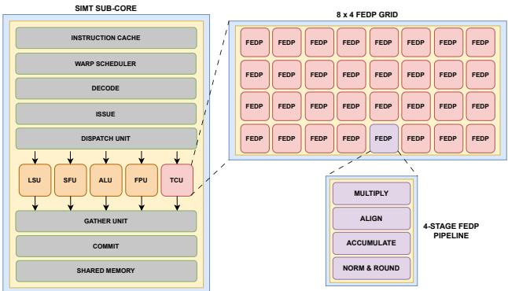
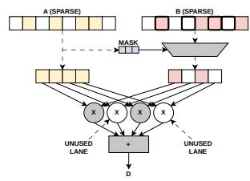

# Ten-Four: An Open-Source Fused Dot Product Unit for Mixed-Precision GPGPU Tensor Cores 论文解析

## 0. 论文基本信息

**作者 (Authors)**: Nikhil Rout, Blaise Tine

**发表期刊/会议 (Journal/Conference)**: unknown

**发表年份 (Publication Year)**: 2026

**研究机构 (Affiliations)**: Vellore Institute of Technology, Chennai, University of California, Los Angeles

---

## 1. 摘要

**研究目的**

- 深度学习工作负载中 **GEMM 操作占用超过 80% 运行时**（如 Meta Llama 8B 在 NVIDIA B200 上的 profiling 结果），高效混合精度 MMA（Matrix Multiply-Accumulate）操作是 GPGPU 加速的关键瓶颈。
- 现有开源 GPGPU Tensor Core 实现（如 **Ventus**、**Virgo**、Nada et al. 的 Vortex Tensor Core 原型）依赖**离散算术单元库**（Berkeley HardFloat、FPnew），存在三大问题：
  - 高延迟（多周期级联运算）
  - 累积舍入误差（中间结果多次舍入）
  - 资源利用率低
- 本文提出 **Ten-Four**：一个开源、可配置的**混合精度 Fused Dot Product (FEDP) 单元**，作为 RISC-V 架构 **Vortex GPGPU** 的 Tensor Core Unit (TCU) 扩展，首次在开源领域打通专用 Fused Dot Product 设计与 GPGPU Tensor Core 原型之间的鸿沟。

---

**研究方法**

- **整体架构**：在 Vortex GPGPU SIMT Sub-Core 中采用 **[8×4] FEDP 单元阵列**构成 TCU（32-threads/warp 配置），执行 8×4×8（FP16 输入）或 8×4×16（FP8 输入）的 MMA 操作，操作数直接来自 warp register file。

 *Fig. 3: Vortex GPGPU SIMT Sub-Core with Tensor Core Unit Extension*

- **4 级流水线微架构**（Fig. 4）：
  - **Stage-1**：采用 Zhang et al. 的 **class-wise 共享乘法器**方案——FP16/BF16/TF32 共享单一 11×11-bit Wallace Tree 乘法器（BF16 mantissa 零扩展），FP8(E4M3)/BF8(E5M2) 共享两个 4×4-bit WTMUL；所有格式收敛至统一 **E8M25 中间表示**。基于 Sohn et al. 比较器架构扩展的**最大指数识别电路**，仅计算 (N-1)×(N-1) 差值矩阵上三角（利用对称性补全下三角），实现近 **O(1) 关键路径深度**（面积代价 O(N²)）。
  - **Stage-2**：Significand 对齐，转换为 2's complement，计算 Sticky bit 保留精度。
  - **Stage-3**：**Addend C 从首级即参与累加**（其指数参与最大指数查找、其 significand 参与对齐），避免传统实现的二次对齐/归一化/舍入；采用递归 4:2 压缩器 CSA 及 **MOD-4 分组 CSA**（≥7 操作数时优化关键路径），最终由 **Kogge-Stone Adder** 求和。
  - **Stage-4**：Predictive LZAC 归一化 + **RNE (Round-to-Nearest-Even)** 舍入，输出 FP32 结果。

 *Fig. 4: Ten-Four Mixed-Precision Fused Dot Product Microarchitecture*

- **整数数据通路融合**：支持 INT8/UINT8/INT4/UINT4 乘法与 INT32 累加，复用浮点 Stage-3 累加器；采用**新颖的 addend-splitting 策略**——C 的低 25 位与乘积项一同进入 CSA，高 7 位（C_HI）旁路传播，最终级将累加器符号扩展溢出与 C_HI 相加拼接出完整 INT32 结果。
- **Sparse Lane Mask 与 Clock Gating**：针对 Dual-Side 稀疏场景（NVIDIA 仅支持权重侧 2:4 结构化稀疏），当输入 A 或 B 为零时对相应 lane 的流水线寄存器 clock-gate；进入累加器前将第三级寄存器输出与 valid mask AND 门控，避免 stale 数据进入 CSA 树——以 inner-product 架构实现动态功耗降低，回避 DSTC 外积方案的 M×N 累加缓冲面积开销。
- **Microscaling (MX) 支持**：由于 C 从首级参与累加，传统的“事后缩放”不兼容；Ten-Four **反转因式分解顺序**，将 block scale factors 直接并入每个低精度元素的指数加法与 bias 电路（符合 MX 规范中 implementation-defined 的精度与操作顺序）。
- **验证方法**：基于 PyTorch CUDA kernel 生成格式特定 WMMA/PTX 例程，以 **NVIDIA Ada 架构 RTX 4090** Tensor Core 为硬件参考，覆盖 normals、subnormals、zeros、infinities、NaNs、灾难性取消六类特征，每种格式 100,000+ 随机测试向量。

---

**研究结果**

- **FPGA 性能**（AMD Xilinx Alveo U55C，32-threads/warp 配置）：

| 指标 | 数值 |
|---|---|
| 操作延迟 | **4-cycle**（对比 HardFloat 10-cycle、Xilinx DSP 31-cycle） |
| Fmax | **262.325 MHz** |
| 峰值吞吐 | **134.308 GFLOPS**（每 Tensor Core） |
| 性能提升 | 较 HardFloat 实现 **~3.1×**，较 Xilinx DSP **~6.6×** |

- **FPGA 面积对比**（FP16/BF16，32-threads/warp）：

| 资源 | Xilinx DSP | HardFloat | Ten-Four |
|---|---|---|---|
| LUTs | 98,581 | 291,207 | **188,077**（较 HardFloat 降 40-55%） |
| FFs | 141,314 | 93,190 | **29,769**（较 HardFloat 降 62-68%） |
| DSPs | 1,024 | 256 | **0**（完全消除 DSP 占用） |

- **ASIC 综合结果**（Synopsys Design Compiler + ASAP 7nm PDK，8-element 全格式配置，目标 1500 MHz）：

| 指标 | 数值 |
|---|---|
| Fmax | **1.571 GHz** |
| 总功耗 | 6.28 mW（动态 6.21 mW，漏电 69.5 µW） |
| Cell Area | **1,959.86 µm²** |

- **ASIC 吞吐（32-threads/warp 单 Tensor Core）**：TF32 达 402.2 GFLOPS，FP16/BF16 达 804.4 GFLOPS，FP8/BF8 达 **1.608 TFLOPS**；在技术节点归一化与 iso-configuration 假设下，较 A100 级 Tensor Core（约 720 GFLOPS/单元）**单位峰值吞吐高约 11%**。
- **数值精度**：FP16、BF16、FP8、BF8、TF32、INT8、INT4 全部格式与 NVIDIA Ada Tensor Core 达到 **100% 匹配（ULP=0）**。
- **功能覆盖**：对比 HardFloat、FPNew、FloPoCo、ExSdotp、MXDOTP、Lutz et al.、Cuyckens et al. 等设计，Ten-Four 是唯一同时具备**开源、可配置、IEEE-754 合规（扩展累加器宽度至 53-bit 可达完整合规）、融合整数数据通路、Microscaling、Sparse Lane Clock-Gating** 全部特性的设计。

---

**结论**

- Ten-Four 通过**融合整数与浮点数据通路**（addend-splitting）、**稀疏 lane clock-gating**、**MX 早期 addend 累加**三项核心设计，克服了现有离散算术单元 FEDP 设计的延迟与资源利用率限制。
- 以**不到 60% 的面积开销**实现较 Berkeley HardFloat 方案 **~3.1× 的性能提升**，在消除 DSP 依赖的同时兼顾数值精度（与 NVIDIA Tensor Core 100% 匹配）。
- 其可配置 RTL 与验证方法论为**块量化、非结构化稀疏格式的硬件-软件协同设计**及深度学习推理加速器的快速原型开发提供了开源基础。

---

## 2. 背景知识与核心贡献

**研究背景**

- **深度学习驱动 GEMM 加速需求**：以 Meta Llama 8B LLM 为例，其在 NVIDIA Blackwell B200 GPU 上的运行时中**超过 80% 被各类 GEMM 操作占据**，GEMM 已成为现代工作负载的核心计算瓶颈。
- **商用 Tensor Core 的演进**：
  - GPU 厂商（NVIDIA Tensor Cores、AMD Matrix Cores）引入专用矩阵引擎，执行 **WMMA / MFMA** 等 warp 级指令。
  - Tensor Core 直接从 SIMT Sub-Core 寄存器堆读取 A/B/C 子矩阵 tile，完成 **M×N×K 的 MMA** 运算后写回结果矩阵 D。
  - 采用**低精度乘法 (FP16/INT8) + 高精度累加 (FP32/INT32)** 的混合精度策略，兼顾吞吐与数值稳定性；中间结果无需落回寄存器堆，降低功耗与访存压力。
- **硬件架构背景**：
  - 自 Ampere 架构起，每个 Sub-Core 配置**单一大型 Tensor Core** 处理完整 32-thread warp。
  - 利用 **warp register (1024 bits)** 与寄存器打包机制（2×FP16/BF16、4×FP8/BF8/INT8、8×INT4），推导出如 **8×4×8 (FP16)** 与 **8×4×16 (FP8)** 的 MMA tile 形状。
- **开源 GPGPU 的落后现状**：
  - 开源设计（如 Ventus、Virgo）依赖 **Berkeley HardFloat** 离散浮点模块；Nada 等人的工作使用多个 **FPnew FMA** 实例，均导致**高延迟、舍入误差累积与资源利用率低下**。
  - Ampere 引入的 **2:4 structured sparsity** 以及 Blackwell / CDNA 4 的 **OCP Microscaling (MX)** 硬件加速支持，进一步拉大了商用与开源设计的差距。

 *Fig. 3: Vortex GPGPU SIMT Sub-Core with Tensor Core Unit Extension*

---

**研究动机**

- **填补空白**：现有开源浮点库（HardFloat、FPNew、FloPoCo）提供的是离散算术单元，而专用 Fused Dot Product 设计（ExSdotp、MXDOTP、Lutz 等）又局限于特定格式或 ISA，二者之间存在**面向通用 GPGPU Tensor Core 的可配置融合点积单元**的空白。
- **平台选择**：基于 RISC-V 的开源 **Vortex GPGPU** 具有多层次可配置性（cluster、core、warp、thread、cache 层级）与成熟运行时生态，是构建与评估 Tensor Core Unit (TCU) 扩展的理想平台。
- **设计目标**：
  - 缩短操作延迟（4-cycle vs HardFloat 的 10-cycle 与 Xilinx DSP 的 31-cycle）。
  - 统一浮点与整数数据通路，最大化资源复用。
  - 原生支持 **MX block-quantized** 输入与**非结构化双侧重稀疏**场景下的功耗优化。

---

**核心贡献**

- **可配置 4-cycle FEDP 流水线**：
  - 支持低精度乘法：**FP16、BF16、TF32、FP8 (E4M3)、BF8 (E5M2)**。
  - 支持高精度 **FP32 累加**，实现为 Vortex GPGPU 的 TCU 扩展。
- **统一浮点-整数数据通路**：
  - 在浮点数据通路内融合 **INT8/UINT8/INT4/UINT4 乘法与 INT32 累加**。
  - 提出创新的 **addend-splitting 策略**：C 的低 25 位进入 Stage-3 CSA 累加器，高 7 位 (C_HI) 独立传播，在末级并行拼接，以极小开销完成整数加法。
- **Sparse Lane Mask 与 Clock Gating**：
  - 当输入 A 或 B 为零时，从 Stage-1 起对相应 lane 的流水线寄存器进行时钟门控。
  - 进入累加器前将第三级寄存器输出与 valid mask 进行 AND 运算，确保禁用 lane 输出零值而非陈旧数据。
  - 相比 DSTC 的外积方案，避免了 M×N 中间部分矩阵缓冲的面积开销，为**双侧重稀疏 Tensor Core** 提供务实的功耗优化路径。
- **Microscaling (MX) 原生支持**：
  - 颠倒传统因子分解顺序：将 block scale 因子 **X^(A)、X^(B) 直接融入 Stage-1 的低精度指数加法与 bias 电路**，而非延后到末级应用，从而兼容 addend C 的**早期累加**架构，且完全符合 MX 规范（规范本身允许实现自定义的运算顺序）。
- **数值精度验证**：
  - 以 NVIDIA Ada 架构 RTX 4090 为硬件参考，通过 PyTorch CUDA kernel 生成 WMMA/PTX 例程。
  - 覆盖 normals、subnormals、zeros、infinities、NaNs、catastrophic cancellation 六类特征，**每种格式 100,000+ 随机测试向量**。
  - 在 FP16/BF16/FP8/BF8/TF32/INT8/INT4 上实现与 NVIDIA Tensor Core **100% 数值匹配 (ULP=0)**。

---

**关键性能结果**

| 指标 | 数值 |
|---|---|
| FPGA Fmax (Alveo U55C) | **262.325 MHz** |
| 操作延迟 | **4 cycles** |
| 单 Tensor Core 峰值吞吐 (FPGA, 32 threads/warp) | **134.308 GFLOPS** |
| 相比 HardFloat 实现的性能提升 | **~3.1×** |
| 面积成本 | **< 60%** (相对 HardFloat) |
| ASIC Fmax (ASAP 7nm) | **1.571 GHz** |
| ASIC 单元面积 | 1959.86 μm² |
| ASIC 总功耗 | 6.28 mW |

- **FPGA 资源对比 (FP16/BF16, N=32)**：
  - LUT：188,077 vs HardFloat 291,207（**降低 40-55%**）。
  - FF：29,769 vs HardFloat 93,190（**降低 62-68%**，较 Xilinx DSP 降低 74-79%）。
  - **DSP 占用为 0**，而 HardFloat 需 256 个、Xilinx DSP 需 1024 个。
- **ASIC 归一化对比**：32 threads/warp 配置下，单 Tensor Core 可达 TF32 402.2 GFLOPS、FP16/BF16 804.4 GFLOPS、FP8/BF8 **1.608 TFLOPS**；在技术节点归一化与等配置假设下，较 A100 级 Tensor Core（约 720 GFLOPS/单元）的**单位峰值吞吐高出约 11%**，且支持显著更广的数值格式。

---

**定位与意义**

- Ten-Four 是**首个连接专用 Fused Dot Product 实现与 GPGPU Tensor Core 原型**的开源工作，在 Table III 的对比中成为唯一同时具备**开源、可配置、IEEE-754 兼容（可扩展至 53-bit 累加器）、融合整数通路、Microscaling、Sparse Lane Clock-Gating** 全部特性 的设计。
- 其可配置 RTL 与验证框架，为未来**block-quantized 与非结构化稀疏格式的软硬件协同设计**提供了快速原型平台。

---

## 3. 核心技术和实现细节

### 0. 技术架构概览

本文提出的 **Ten-Four** 是一个开源的、可配置的**混合精度融合点积单元 (Fused Dot Product, FEDP)** 微架构，作为 RISC-V 架构 **Vortex GPGPU** 的 **Tensor Core Unit (TCU) 扩展**，用于替代现有开源设计中基于离散浮点运算单元（如 Berkeley HardFloat、FPnew）的低效方案。

---

**系统级架构定位**

- Ten-Four 位于 Vortex GPGPU 的 **SIMT Sub-Core** 中，与 Integer ALU、FPU、LSU 等 SIMD lane 并列部署
- 整体 Tensor Core 采用 **[8×4] 网格**（M=8, N=4）的 K 元素 FEDP 单元构成，在 **32-threads/warp** 配置下每个 FEDP 执行 **8 元素点积**（K=8），计算 $D_{m,n} = \sum_{i=0}^{K-1}(A_{m,i} \times B_{i,n}) + C_{m,n}$
- 操作数直接来自 **warp register**（1024 bits 容量），支持 **寄存器打包**：2×FP16/BF16、4×FP8/BF8/INT8、8×INT4 每个寄存器

 *Fig. 3: Vortex GPGPU SIMT Sub-Core with Tensor Core Unit Extension*

---

**FEDP 核心流水线架构（4-cycle）**

 *Fig. 4: Ten-Four Mixed-Precision Fused Dot Product Microarchitecture*

- **Stage-1：共享乘法器、最大指数与异常处理**
  - 采用**类间共享乘法器 (class-wise shared multiplier)** 方案：FP16/BF16/TF32 共享单个 **11×11-bit Wallace Tree 乘法器**，FP8(E4M3)/BF8(E5M2) 共享两个 4×4-bit WTMUL
  - 所有格式统一收敛到 **E8M25 中间表示**
  - 基于 Sohn 等人的减法器比较器架构扩展的**最大指数识别电路**：并行计算 (N-1)×(N-1) 指数差分矩阵（利用对称性仅算上三角），实现近似 **O(1) 关键路径深度**（O(N²) 面积代价）
  - IEEE-754 异常检测（NaN、∞×0、对向无穷相加）与指数/尾数处理并行执行
- **Stage-2：尾数对齐**
  - 2K 条对齐 lane，乘积尾数按移位量对齐并转为**二补码**表示
  - 从移出位计算 **Sticky bit** 以保留精度
- **Stage-3：累加**
  - **加数 C 从第一阶段即参与处理**（指数参与最大指数查找、尾数对齐），避免传统“点积求和后再加 C”的二次对齐/归一化/舍入开销
  - 使用 **Carry-Save Adder (CSA)**：4:2 压缩器递归链接，7 个以上操作数时采用 **MOD-4 操作数分组 CSA** 优化关键路径
- **Stage-4：归一化与舍入**
  - **预测式前导零计数器 (LZAC)** 确定归一化移位量
  - 应用 **Round-to-Nearest-Even (RNE)** 舍入（利用 LSB/Guard/Round/Sticky 位）生成最终 FP32 结果
- 关键算术组件选型：
  - 最终求和使用 **Kogge-Stone Adder (KSA)**（牺牲面积换取低扇出）
  - **放弃 Radix-4 Booth 编码**（4-11 bit 位宽下编码开销超过收益）

---

**整型数据通路融合**

- 在现有浮点数据通路内支持 **INT8/UINT8/INT4/UINT4 乘法 + INT32 累加**，复用 Stage-3 的高成本累加器，消除双 Tensor Core 调度需求
- 采用**加数拆分策略** 解决 32-bit 整数加数超出累加器宽度（25+log₂(2K) bits）的问题：
  - 低 25 位与乘积项一起在 CSA 中累加
  - 高 7 位（**C_HI**）单独流水传播
  - 最终阶段将累加器符号扩展的溢出加到 C_HI，与低 25 位拼接得到完整 INT32 输出

---

**稀疏 Lane 时钟门控**

- 针对 **Dual-Side Sparsity**（内积原语天然不支持，NVIDIA 仅支持权重侧 2:4 结构化稀疏），Ten-Four 选择务实折中：保留内积 FEDP 设计，不做 DSTC 式外积重构
- 机制：
  - 基于操作数格式与零检测逻辑生成 **input valid mask**
  - 输入为零的 lane 从 Stage-1 起即 **clock-gate** 流水线寄存器，消除乘法与对齐阶段的切换活动
  - 进入累加器前，第三级寄存器输出与 valid mask **AND 门控**，确保禁用 lane 提供零值而非过期寄存器值

 *(a) Sparse-Dense interaction.*

---

**Microscaling (MX) 格式支持**

- 支持 OCP MX **块量化**输入，公式为 $Dot(A,B) = X^{(A)}X^{(B)}\sum_{i=1}^{k}(P_i^{(A)} \times P_i^{(B)})$
- **反向因式分解**创新：不做传统的“先算 SoP、末尾加 scale 到指数”，而是将块缩放因子 $X^{(A)}$、$X^{(B)}$ 在 Stage-1 直接并入每个低精度元素的指数加法与 bias 电路，从而与**加数 C 的早期累加**架构兼容（MX 规范允许 implementation-defined 的精度与运算顺序，故完全合规）

---

**可配置性**

- 运行时：通过 **source format 信号**动态切换输入数据类型
- 编译时：
  - 4 元素（4/8 threads/warp）或 8 元素（16/32 threads/warp）点积配置
  - 按需实例化任意格式子集（如仅 LLM 训练所需 FP16/BF16/TF32），裁剪面积

---

**支持的精度格式与性能概览**

| 维度 | 规格 |
|---|---|
| 低精度乘法格式 | FP16, BF16, TF32, FP8(E4M3), BF8(E5M2), INT8/UINT8, INT4/UINT4 |
| 高精度累加格式 | FP32, INT32 |
| 流水线延迟 | **4-cycle**（对比 HardFloat 10-cycle、Xilinx DSP 31-cycle） |
| FPGA (Alveo U55C) Fmax | 262.325 MHz，134.308 GFLOPS/Tensor Core（32 threads/warp） |
| ASIC (ASAP 7nm) | Fmax 1.571 GHz，功耗 6.28 mW，面积 1959.86 μm² |
| 数值精度验证 | 与 NVIDIA Ada Tensor Core **100% 匹配 (ULP=0)**，10 万+ 随机测试向量 |

- 与基线实现对比（FP16/BF16, N=32 配置）：

| 指标 | Xilinx DSP | HardFloat | Ten-Four |
|---|---|---|---|
| LUTs | 98581 | 291207 | **188077** |
| FFs | 141314 | 93190 | **29769** |
| DSPs | 1024 | 256 | **0** |
| 吞吐提升 | ∼6.6× | ∼3.1× | 基准 |

---

**架构设计哲学总结**

- **融合优先**：浮点/整型/点积/加数全融合，消除中间寄存器访问与多次舍入
- **资源复用最大化**：类间共享乘法器、整型复用浮点累加器、指数差分矩阵复用于移位量计算
- **面向实际工作负载**：MX 早期缩放契合块量化训练/推理，Sparse Lane 门控契合非结构化双侧重稀疏的功耗优化
- **开源生态整合**：首个连接专用 FEDP 实现与 GPGPU Tensor Core 原型的工作，填补开源 GPGPU 设计空间空白

### 1. 4级混合精度融合点积浮点流水线（含加数早期累加）

**核心定位**

Ten-Four 的 4 级混合精度融合点积（Fused Dot Product, FEDP）流水线是其 Tensor Core Unit（TCU）的计算核心。其最关键的微架构决策是 **加数早期累加（Early Addend Accumulation）**：addend C 不再在点积求和之后单独做一次对齐、归一化和舍入，而是从 Stage-1 起就与乘积项（product terms）并行处理，全程参与共享的对齐与累加硬件。这一策略直接消除了传统“先点积后加加数”方案中额外的一次 2-operand 对齐/归一化/舍入，同时缩短了关键路径并降低了累计舍入误差。

 *Fig. 4: Ten-Four Mixed-Precision Fused Dot Product Microarchitecture*

---

**支持的精度配置与输入输出关系**

* 输入低精度乘法格式：**FP16、BF16、TF32、FP8(E4M3)、BF8(E5M2)**；整数侧为 **INT8/UINT8/INT4/UINT4**。
* 累加高精度格式：浮点侧 **FP32**，整数侧 **INT32**。
* 核心运算：

$$D_{m,n} = \sum_{i=0}^{K-1}(A_{m,i} \times B_{i,n}) + C_{m,n}$$

* **K 可配置**：
  - 4/8 threads/warp 配置下为 **4-element** 点积（累加操作数为 5 个：4 个乘积 + addend C）。
  - 16/32 threads/warp 配置下为 **8-element** 点积（累加操作数为 9 个）。
* 编译期可裁剪：LLM 训练等仅用 FP16/BF16/TF32 的场景可省去低位宽格式逻辑；运行期通过 **source format 信号**动态切换数据类型。
* 在整体中的作用：一个 Tensor Core 由 **[8×4] grid 的 K-element FEDP 单元**组成（FP16/FP32 场景下为 8×4×8 MMA shape，FP8 场景下 K 加倍为 8×4×16），FEDP 是构成 Tensor Core 的基本计算单元，直接决定延迟（4 cycle）、频率（262.325 MHz Fmax）与吞吐（134.308 GFLOPS/TC）。

---

**Stage-1：共享乘法器、最大指数识别与异常处理**

* **Class-wise 共享乘法器**（借鉴 Zhang et al. [35]）：
  - 尾数位宽相近的格式共享 Wallace tree multiplier（WTMUL）：**FP16/BF16/TF32 共用一个 11×11-bit WTMUL**，BF16 尾数进入前做 zero-extension。
  - **FP8(E4M3)/BF8(E5M2) 共享两个 4×4-bit WTMUL**，乘积再经 24-bit Kogge-Stone Adder（KSA）求和，以压缩回统一位宽。
  - 取舍：放弃 Radix-4 Booth recoding——在 4–11 bit 操作数宽度下，bit-pair 编码开销超过减半部分积的收益。
* **乘法器 Lane 复制策略**：由于寄存器 packing（FP16/BF16 每对、FP8/BF8 每 4 个打包进 32-bit 寄存器），每个 K-element 点积实例化 **2×K 条并行乘法 lane**；TF32 每 32-bit 寄存器仅 1 个操作数，故每隔一条 lane 才有效；FP8/BF8 打包 4 个元素则需额外的归约以维持后续流水级位宽一致。
* **统一中间表示**：所有格式在 Stage-1 收敛到 **raw E8M25 中间格式**，保证后续流水级资源复用。
* **指数处理与 bias 转换**：

$$CONV_{FP16/FP32} = BIAS_{FP32} - (2 \times BIAS_{FP16}) + 1$$

$$EXP_{FP32} = EXP_A + EXP_B + CONV_{FP16/FP32}$$

* **最大指数识别**（扩展自 Sohn et al. [32] 的减法器式比较器）：
  - 并行计算 (N-1)×(N-1) 的两两指数差矩阵，**差的符号位指示每对操作数相对大小**。
  - 利用对称性只算差矩阵上三角，下三角通过补码符号位直接导出，降低面积。
  - 通过 **one-hot 编码** + reduction OR 提取最大指数索引；**alignment shift 量直接复用差矩阵**（按需取反），避免重复计算。
  - 复杂度：关键路径接近 **O(1)**，面积代价 **O(N²)**。
* **早期累加的第一步**：addend **C 的指数在 Stage-1 就加入最大指数搜索**，与其他 2K 个乘积指数同台竞争，这是整个融合设计的前提。
* **IEEE-754 异常处理**（与指数/尾数处理完全并行）：
  - 乘法异常：检测 NaN 输入、**infinity × zero** 条件。
  - 加法异常：识别点积各元素与 addend 之间**异号 infinity** 的对消情形，提前生成结果的 sign、NaN、infinity 标志。

---

**Stage-2：尾数对齐（Significand Alignment）**

* 与 Stage-1 对应，每个 K-element 点积配备 **2×K 条对齐 lane**（外加 addend lane）。
* 乘积尾数按 Stage-1 算出的 shift 量右移对齐到公共最大指数；C 的尾数同样在此阶段对齐。
* 每条 lane 做两件事：
  - 根据符号位转换为 **2's complement** 表示（为有符号累加做准备）。
  - 从移出位计算 **sticky bit**，保留精度供 Stage-4 舍入使用。
* C 与乘积项的 **sign-extension 同步进行**，两者在数据通路形态上完全同质化。

---

**Stage-3：累加（Accumulation）**

* **全对齐操作数一次性累加**：25-bit 对齐后的有符号尾数（乘积项 + addend C）统一符号扩展至：

$$25 + \log_2(2K) \text{ bits}$$

  - 4/8 threads/warp：5 个操作数（4 乘积 + C），选用**标准 CSA**。
  - 16/32 threads/warp：9 个操作数（8 乘积 + C），选用 **MOD-4 operand grouping CSA**。
* **多操作数加法硬件**：
  - **Carry-Save Adder（CSA）**：用递归链式 4:2 compressor 构建，奇数操作数时附加条件性 3:2 compressor；操作数 ≥7 时采用 MOD-4 分组进一步压缩关键路径。
  - CSA 将 N 个 W-bit 操作数无损压缩为 (W + log N)-bit 的 sum + carry，无进位传播依赖。
  - 最终求和由 **Kogge-Stone Adder（KSA）** 完成——以面积换低 fanout 的并行前缀树，优于 carry-lookahead。
* **整数融合复用点**：INT8/INT4 的乘法各自有独立的 class-wise 乘法器，但 **Stage-3 的高成本累加器被整数格式完全复用**，这是“统一流水线”面积收益的主要来源。
* **整数加数的 split 策略**（novel addend-splitting）：INT32 加数 C 超出累加器宽度（25 + log₂(2K) bits），处理方式为：
  - **低 25 bits（C_LO）**：与乘积项一起进 Stage-3 CSA 累加。
  - **高 7 bits（C_HI）**：作为独立小位宽数据穿透流水线，**显著减少中间流水线寄存器开销**。
  - Stage-4 中，将累加器的符号扩展溢出与 C_HI 相加构造结果高 7 位，与低 25 位拼接输出完整 **INT32**。

---

**Stage-4：归一化与舍入（Normalization & Rounding）**

* 从有符号累加结果中提取幅值；用 **predictive Leading Zero Counter（LZAC）** 确定归一化移位量（预测式实现隐藏前导零计数延迟）。
* 指数调整：**max exponent − shift amount**；尾数左移归一化。
* 舍入：基于 LSB、Guard、Round 位和 Stage-2 保存的 **Sticky bits**，执行 **Round-to-Nearest-Even（RNE）**，产出最终 **FP32** 点积结果。
* 异常覆盖：若 Stage-1 预检到异常，结果被覆盖为 IEEE 规范的 canonical **NaN 或 infinity** 表示。
* 整数路径并行收尾：整数高位构造与浮点归一化**在同一 stage 并行完成**，不额外占用流水级。

---

**加数早期累加的设计动机与收益对比**

| 维度 | 传统后置加数方案 | Ten-Four 早期累加方案 |
|---|---|---|
| 加数处理时机 | 点积求和后单独一次 2-operand 对齐/归一化/舍入 | Stage-1 起与乘积项同流水 |
| 舍入次数/误差 | 多一次独立舍入，**累计舍入误差高** | 单次 RNE，匹配 NVIDIA Tensor Core 精度（ULP=0） |
| 关键路径 | 串行加法级 | 关键路径缩短，4-cycle 总延迟 |
| MX 兼容性 | 传统“先求和后加 scale”天然适配后置加数 | 需 **scale 因子反转注入**（见下） |

* **与 MX 格式的协同难题及解法**：传统 MX 实现将块 scale $X^{(A)} + X^{(B)}$ 延迟加到最终 FP32 指数上，这与 Ten-Four 的 C 早期参与不兼容（C 的指数在 Stage-1 就已定局）。Ten-Four 的解法是**反转因式分解顺序**——将两个 scale 因子直接并入每个低精度元素的 Stage-1 指数加法与 bias 电路，即 $X^{(A)}X^{(B)}\sum_i(P_i^{(A)} \times P_i^{(B)})$ 的 scale 被前移吸收进元素级指数。由于 OCP MX 规范 [28] 明确将内部精度与运算顺序定义为 implementation-defined，该方案**完全 MX 合规**。
* **与稀疏 clock-gating 的协同**：input valid mask（来自格式与 zero-detection 逻辑）控制各 lane 流水寄存器的 clock gating；零输入 lane 从 Stage-1 起即停止翻转。由于累加在 Stage-3 才发生多 lane 归约，**第三级流水寄存器输出必须与 valid mask 做 AND**，确保被门控 lane 向 CSA 树提供 0 而非 stale value。

---

**实测验证指标**

| 指标 | 数值 |
|---|---|
| 操作延迟 | **4 cycle**（vs HardFloat 10 cycle、Xilinx DSP 31 cycle） |
| FPGA Fmax（Alveo U55C） | 262.325 MHz |
| 峰值吞吐/TC（32 threads/warp） | 134.308 GFLOPS |
| ASIC Fmax（ASAP 7nm, 1500 MHz 目标） | 1.571 GHz |
| 数值精度（vs Ada RTX 4090 Tensor Core） | **100% 匹配，ULP=0**（覆盖 normals/subnormals/zeros/infinities/NaNs/灾难性抵消，每格式 100,000+ 随机向量） |

**总结**：该 4 级流水线的本质是将“多操作数对齐 + 一次性累加 + 单次舍入”的融合思想贯穿始终——addend C 从第一级起即融入最大指数搜索与对齐流程，配合 class-wise 共享乘法器、差矩阵复用的 O(1) 指数比较、CSA/KSA 多操作数压缩，以及整数加数 split 策略，在单一数据通路内同时服务浮点与整数两种语义，以 4-cycle 延迟和零 DSP 占用实现了相对 Berkeley HardFloat 约 **3.1×** 的吞吐提升与 40–55% 的 LUT 节省。

### 2. 整数数据通路融合的加数拆分策略

**加数拆分策略的动机与问题定义**

Ten-Four 的核心设计目标是在**单条融合数据通路**中同时服务浮点（FP）与整数（INT）两种语义的 fused dot product，而非用 arbiter 调度两个独立的 Tensor Core 执行单元。融合的瓶颈在于**位宽失配**：

- 浮点通路中，Stage-3 累加器的有效宽度由 **E8M25 中间表示**决定，即对齐并符号扩展后的 significand 为 **25 bits**，再为多操作数有符号求和扩展至 **(25 + log₂(2K)) bits**。
  - K=4（4/8 threads/warp 配置）：累加器宽度 = 25 + 3 = **28 bits**
  - K=8（16/32 threads/warp 配置）：累加器宽度 = 25 + 4 = **29 bits**
- 整数累加要求输出 **INT32**，即加数 C 与乘积之和的动态范围覆盖全 32 bits，**超出**上述 25~29 bit 的累加器位宽。
- 若为整数单独实例化一套 ≥33 bits 的并行累加树与流水线寄存器，将使流水线寄存器开销近乎翻倍，违背融合设计的初衷。

 *Fig. 4: Ten-Four Mixed-Precision Fused Dot Product Microarchitecture*

---

**拆分原理：以累加器位宽为切割边界**

该策略将 32-bit 加数 C 沿 **bit 25** 边界切分为两段，本质是把一个宽加法分解为“低位参与主累加、高位延迟合并”的两段式进位传递结构：

- **C_LO = C[24:0]**：低 25 bits，作为第 (2K+1) 个操作数直接送入 Stage-3 的 **CSA (Carry-Save Adder)** 树，与 2K 个乘积项（对 INT8，乘积为 16 bits；对 INT4，乘积为 8 bits，均先符号扩展）共同做无进位传播压缩。
- **C_HI = C[31:25]**：高 7 bits（包含符号位区域），**不进入**宽累加器，仅以 7 bits 的窄位宽穿过 Stage-1 至 Stage-3 的流水线寄存器旁路传递。
- 数学等价性：设乘积和 P = Σ(Aᵢ×Bᵢ)，则
  - D = C + P = (C_HI·2²⁵ + C_LO) + (P_HI·2²⁵ + P_LO)
  - 低 25 bits 部分 (C_LO + P_LO) 在 CSA 中完成，其产生的**进位/借位（overflow）**在 Stage-4 与 C_HI 合并，恢复全精度结果。

**关键取舍**：

- 切割点选在 bit 25 而**非符号位边界**，完全由共享累加器宽度决定——这要求 C_HI 合并时必须正确处理低 25-bit 加法的**符号扩展进位**，而非简单拼接。
- 由于 INT8×INT8 的 K=8 乘积和最大仅需 25 + log₂16 = 29 bits 动态范围，溢出位宽仅 3~4 bits，7-bit 的 C_HI 通道留有充分裕量。

---

**四阶段流水线中的算法流程**

- **Stage-1（共享乘法器）**：
  - 整数格式拥有独立的 **class-wise 共享乘法器**（与浮点的 11×11 / 4×4 Wallace tree 分离），INT8 乘积为 16 bits，INT4 乘积为 8 bits。
  - 并行完成 C 的拆分：C_LO 送入主通路，C_HI 进入 7-bit 旁路寄存器。
  - 对照浮点通路：此处无 exponent 求和、无 bias 转换、无 IEEE-754 异常检测，整数语义下这些电路静态旁路。
- **Stage-2（对齐）**：
  - 浮点通路的 significand 对齐（基于 Stage-1 计算的 shift amount）在整数语义下**天然不需要**——整数操作数无需对齐，仅做符号扩展以匹配 (25 + log₂(2K)) bits 累加宽度。
  - Sticky bit 生成逻辑对整数无效，被掩蔽。
- **Stage-3（累加）**：
  - C_LO 与 2K 个符号扩展后的乘积项一起，经 **CSA 树**（4/8 threads 配置用标准递归 4:2 压缩器链，16/32 threads 配置用 **MOD-4 operand grouping CSA**）压缩为 sum + carry 对。
  - C_HI 仅在旁路寄存器中逐级传递，**零计算开销**。
- **Stage-4（归一化与舍入 / 整数合并）**：
  - 浮点路径执行 **LZAC (predictive Leading Zero Counter)** 归一化与 RNE 舍入；整数路径与之**并行**：
    - 取累加结果的 25-bit 低位和；
    - 提取累加器超出 25 bits 的**符号扩展溢出段**；
    - 将溢出段与 C_HI 相加，得到修正后的高 7 bits；
    - 高 7 bits 与低 25 bits **拼接 (concatenate)**，输出完整 **INT32** 结果 D。

---

**输入输出关系与整体作用**

- **输入**：
  - A/B 操作数：按 32-bit 寄存器 packing 方案，每寄存器打包 4×INT8/UINT8 或 8×INT4/UINT4；
  - C：单个 INT32 加数；
  - source format 信号：运行时动态选择 INT8/UINT8/INT4/UINT4 或各浮点格式。
- **输出**：D = Σᵢ(Aᵢ×Bᵢ) + C，精确的 **INT32** 结果（无舍入误差，区别于浮点路径）。
- **在整体架构中的角色**：
  - 一个 [8×4] grid 的 FEDP 单元即构成一个完整 Tensor Core（对应 8×4×8 的 INT8 MMA shape，因 FP8 翻倍的 K 维同理适用于 INT8 packing）；
  - 累加器——整个数据通路中**面积代价最高**的部件——在 FP 与 INT 语义间 100% 复用，消除了双执行单元、arbiter 调度及独立流水线的开销。

---

**收益量化与对照**

| 设计维度 | 独立 INT 累加器方案 | 全宽共享累加器（≥33 bits） | **Ten-Four 加数拆分** |
|---|---|---|---|
| 累加器复用 | 无（独立实例化） | 部分复用，需位宽扩展 | **完整复用 25+log₂(2K) bits CSA** |
| 旁路寄存器开销 | 完整 32-bit 加数路径 | 全宽 C 贯穿 4 级流水 | **仅 7-bit C_HI 旁路** |
| Stage-4 附加逻辑 | 独立 KSA 求和 | 无 | 一次 7-bit 加法（与 FP 归一化并行） |
| 调度复杂度 | 需 arbiter 在 FP/INT 单元间仲裁 | 无 | **无（同周期融合）** |

- 该策略直接支撑了 Table I 中的实测收益：对比 Berkeley HardFloat 基线实现 **FF 减少 62-68%**（4 级 vs 10 级流水 + 更窄的中间寄存器）、**LUT 减少 40-55%**、**DSP 占用归零**。
- 数值正确性经 **100,000+ 随机测试向量**验证，INT8 与 INT4 均达到与 NVIDIA Ada Tensor Core **100% 匹配（ULP=0）**，证明拆分-合并操作未引入任何精度损失。

---

**局限与设计权衡**

- **IEEE-754 合规性约束的传导**：累加器默认 25-bit 宽度是为低精度格式优化的，若需完整 IEEE-754 合规（如 FP64 累加），须将参数化累加器宽度扩至 **53 bits 以上**——此时拆分边界需相应重算，C_HI 通道消失（25 ≥ 32 时整数加数可整体进入累加器）。
- **非自然边界切割**：切割点位于数值中间而非符号边界，Stage-4 的进位合并必须依赖符号扩展溢出而非无符号进位，这要求 CSA 树对有符号 two's complement 求和的正确符号扩展（论文通过将所有操作数符号扩展至 25 + log₂(2K) bits 保证）。
- **适用前提**：该策略隐含假设乘积和的动态范围不超过累加器宽度（INT8×INT8 在 K≤16 时必然满足），对更大的 K 维需重新评估溢出裕量。

### 3. 稀疏通道掩码与时钟门控

**核心观点**

Ten-Four 的 **Sparse Lane Mask** 策略是一种在保持面积高效的 **inner-product FEDP** 架构不变的前提下，通过 **zero-detection + clock gating** 消除零值输入 Lane 动态功耗的实用方案。它没有牺牲计算密度去换取算法层面的双面稀疏加速，而是将稀疏性“降维”为纯粹的 **动态功耗优化**，规避了 NVIDIA 2:4 结构化稀疏和 DSTC 外积架构各自的根本性限制。

---

**问题背景：为什么需要该机制**

- 现代 DL 工作负载（剪枝 LLM、推荐系统、图神经网络）在 **weights 和 activations** 两端均天然存在大量稀疏性。
- 传统 **inner-product** 计算原语存在根本限制，无法高效处理双面稀疏：

 *(a) Sparse-Dense interaction.*

 *(b) Sparse-Sparse interaction. Fig. 5: Inner-product primitive dual-side sparsity limitations*

- Fig. 5 揭示的本质矛盾：
  - **Sparse-Dense 交互**（Fig. 5a）：NVIDIA 稀疏 Tensor Core 仅支持 **weight 矩阵的 2:4 结构化稀疏**，activation 侧必须稠密。
  - **Sparse-Sparse 交互**（Fig. 5b）：两个稀疏向量做内积时需执行 **inner-join**（按 K 维索引匹配非零元素），硬件代价极高。
- **DSTC（Dual-Side Sparse Tensor Core）** 用 **outer-product** 替代 inner-product 绕开了 inner-join 问题，但代价沉重：
  - 需在 K 维规约步进过程中保存完整的 **M×N 中间部分积矩阵**；
  - 需要昂贵的 **accumulation buffers**；
  - 导致 **面积开销大幅增加** 与 **计算密度下降**。

---

**实现原理与算法流程**

Ten-Four 的整体数据通路如下，Sparse Lane Mask 逻辑贯穿其中：

 *Fig. 4: Ten-Four Mixed-Precision Fused Dot Product Microarchitecture*

**关键设计依据：流水线各阶段的计算依赖特性**

- **Stage-1（Shared Multiplier / 最大指数 / 异常处理）与 Stage-2（Significand Alignment）**：Lane 计算是 **self-contained（自包含）** 的——每条 Lane 的乘法、对齐操作只依赖自身输入，不存在跨 Lane 依赖。
- **Stage-3（CSA Accumulation）**：发生 **multi-lane reduction**，所有 Lane 的结果汇入 Carry-Save Adder 压缩树，跨 Lane 依赖在此出现。

**逐阶段门控流程**

- **输入检测**：
  - 由 **operand format**（源格式信号）与 **zero-detection logic** 共同推导出 **input valid mask**（输入有效掩码）；
  - 掩码判定粒度为单条 FEDP Lane，当 Lane 的输入 A 或 B 元素被识别为零，该 Lane 标记为无效。
- **Stage-1 ~ Stage-2：clock gating 生效区间**
  - 被标记 Lane 的 **pipeline registers 从第一个 Stage 起即被 clock-gated**；
  - 由于这两级计算自包含，停掉时钟不会污染任何后续逻辑，直接 **消除乘法与对齐阶段的 switching activity（开关活动）**，即切断了动态功耗的主要来源。
- **Stage-2 → Stage-3 边界：AND-gating 保护**
  - 进入累加器前，**第三级 pipeline register 的输出与 valid lane mask 做 AND 运算**；
  - 目的：确保被禁用 Lane 向 CSA 树贡献的是确定性的 **零值**，而非门控残留的 **stale register values（陈旧寄存器值）**；
  - 这一步是正确性的关键保险——clock gating 只保证寄存器不翻转，但不保证其内容清零，必须用组合逻辑强制置零。
- **Stage-4**：无需特殊处理，累加结果已保证正确。

**逻辑关系总结**

- 有效掩码的传播路径：`zero-detect(A/B operands) → valid mask → clock gate enable (Stage 1~2) → AND mask (Stage 3 输入)`；
- 功耗收益来源：门控区间内的寄存器时钟翻转功耗 + 乘法器/对齐器组合逻辑的开关功耗。

---

**参数设置与配置约束**

- **Lane 数量与线程配置绑定**：
  - **4 / 8 threads/warp** → 4-element FEDP，累加操作数为 5 个（4 乘积 + 1 addend C）；
  - **16 / 32 threads/warp** → 8-element FEDP，累加操作数为 9 个；
  - 对应 Stage-3 选用标准 **CSA** 或 **MOD-4 operand grouping CSA**。
- **掩码粒度**：以单个乘法 Lane（即一对 packed A/B 元素）为单位，与 **register packing scheme** 对齐（FP16/BF16 每寄存器 2 元素、FP8/BF8/INT8 每寄存器 4 元素）。
- **收益上界**：动态功耗节省比例与输入稀疏度近似线性相关，属于 **workload-dependent** 的收益，论文未给出具体实测功耗削减数据（ASIC 报告的 6.21 mW 动态功耗为满负荷满格式配置下的数值）。

---

**输入输出关系与在整体架构中的作用**

- **输入**：
  - 低精度操作数 A、B（FP16/BF16/TF32/FP8/BF8/INT8 等 packed 格式）；
  - 源格式选择信号（决定 zero-detection 的位宽解析方式）。
- **输出**：
  - 高精度点积结果 **D = Σ(A×B) + C**（FP32/INT32），门控对数值结果 **零影响**——被门控 Lane 的贡献本就为零。
- **架构定位**：
  - 与 **Fused Integer Datapath**、**Microscaling (MX) 早期缩放** 并列，构成 Ten-Four 的三大功能特性；
  - 在 Table III 对比中，这是 Ten-Four 区别于 HardFloat、FPNew、ExSdotp、MXDOTP、Lutz et al.、Cuyckens et al. 所有先前工作的 **独有特性**。
- **设计哲学**：
  - 采取 **pragmatic middle ground**：保留 inner-product FEDP 的面积效率与计算密度，仅将稀疏性转化为功耗收益；
  - 为面向 **unstructured dual-side sparse workloads（非结构化双面稀疏）** 的 Tensor Core 提供一条无需 outer-product 重建数据通路、无需 2:4 结构化约束的低成本工程路径。

---

**与现有方案的能力对比**

| 特性维度 | NVIDIA Sparse Tensor Core | DSTC (Outer-Product) | Ten-Four Sparse Lane Mask |
|---|---|---|---|
| 稀疏类型 | 2:4 结构化（仅 weight 侧） | 双面非结构化 | 双面非结构化（检测层面） |
| 加速收益 | 吞吐量 2× | 吞吐量提升 | **仅动态功耗降低** |
| 硬件代价 | 需稀疏索引 metadata | M×N 累加缓冲，面积/密度开销大 | 零检测 + 门控逻辑，**微架构复杂度极低** |
| 计算原语 | inner-product | outer-product | inner-product（不变） |
| 结果正确性 | — | — | 门控 Lane 以零值进入 CSA，**数值零影响** |

---

**关键结论**

- 该机制的本质是一次 **正确性与功耗的解耦设计**：利用流水线前两级 Lane 计算自包含的特性实施 clock gating，利用 Stage-3 边界的 AND masking 保证累加正确性。
- 它不追求稀疏带来的峰值吞吐提升，而是以近乎零的架构代价，让面积高效的 FEDP 设计在真实稀疏工作负载下获得动态功耗红利，是开放源码 GPGPU Tensor Core 设计中 **首个集成稀疏感知功耗管理** 的方案。

### 4. Microscaling (MX) 格式的逆序缩放因子分解

**核心观点**

Ten-Four 对 Microscaling (MX) 格式的处理采用了**逆序缩放因子分解 (Reversed Scale Factorization)** 策略：将块级 scale factors 从传统的“末尾统一应用”反转到“开头逐元素吸收”，直接融入 Stage-1 的 exponent 加法与 bias 电路中。这一设计是该论文能在 **4-cycle 流水线内同时实现 MX 支持、addend 早累积与 fused datapath** 的关键支撑点，且完全符合 OCP MX v1.0 规范（该规范将内部精度与运算顺序定义为 **implementation-defined**）。

---

**MX 格式的数学基础**

- MX 格式的核心思想是**块级共享指数**：每 32 个连续元素共享一个 scale factor，以块为单位保持动态范围，同时保留低精度格式的内存与吞吐优势
- 论文中给出的 MX 点积定义：

$$
\mathrm{Dot}(A, B) = X^{(A)} X^{(B)} \sum_{i=1}^{k} \left( P_i^{(A)} \times P_i^{(B)} \right)
$$

- 各符号含义：
  - $X^{(A)}$、$X^{(B)}$：两个输入向量各自的**块级 scale factor**（OCP MX 规范中为 **E8M0** 格式，即 8-bit 无符号指数，纯 2 的幂）
  - $P_i^{(A)}$、$P_i^{(B)}$：低精度元素本身（如 MXFP8 的 E4M3、MXFP6、MXFP4 等）
  - 求和项：Sum-of-Products (SoP)
- 由于 scale factor 是**纯 2 的幂**，它与尾数乘法在数学上完全可交换——这为“在何处应用缩放”提供了自由度，是逆序分解得以成立的算术前提

---

**传统实现：Deferred Scaling（末端延迟缩放）**

- 典型流程（如 Lutz et al. 的 late accumulation 架构）：
  - 低精度元素先做 SoP 累积，得到 FP32 中间结果
  - 单独计算组合缩放：$X^{(A)} + X^{(B)}$（对数域即指数相加）
  - 将组合后的 scale 加到 FP32 结果的 exponent 上
  - **之后**才进行 addend C 的累积
- 这种方式与 Ten-Four 架构存在**根本性冲突**：
  - Ten-Four 从 Stage-1 起，addend C 的 exponent 就参与 **maximum exponent finding**，其 significand 与乘积项一起对齐、符号扩展、进入 CSA 累积
  - 若缩放在末端才应用，FP32 SoP 结果的 exponent 需要事后修正，C 的对齐关系随之改变
  - 这将强制引入一次额外的 **2-operand 对齐、normalization 与 rounding**，恰好重建了 fused 设计试图消除的延迟与舍入误差累积路径

---

**Ten-Four 的逆序分解：Early Scaling（前端逐元素缩放）**

 *Fig. 4: Ten-Four Mixed-Precision Fused Dot Product Microarchitecture*

具体实现机制如下：

- **Stage-1 中的指数通路重构**：每个元素的 exponent 加法不再只计算 $EXP_A + EXP_B + CONV$（即原论文公式 2/3 的格式 bias 转换），而是扩展为：

$$
EXP_{scaled} = EXP_A + X^{(A)} + EXP_B + X^{(B)} + CONV_{src/FP32}
$$

- 关键设计要点：
  - **bias 电路复用**：MX scale（E8M0）本身就是指数形式，可与原有的格式 bias 转换常数（如 $BIAS_{FP32} - 2 \times BIAS_{FP16} + 1$）合并进同一套加法电路，硬件开销近乎为零
  - **逐元素应用**：缩放作用在每一个低精度乘积的 exponent 上，而非 SoP 汇总结果上——虽然对同一块内所有元素而言 $X^{(A)}$、$X^{(B)}$ 相同，但在电路层面它们走的是与普通格式完全一致的 per-lane exponent 加法路径
  - **流水线零改动**：后续 Stage-2 的 significand alignment、Stage-3 的 CSA 累积（含 C 的早累积）、Stage-4 的 LZAC normalization 与 RNE rounding 均无需任何 MX 专用分支
  - **中间表示统一**：所有格式（含 MX 输入）依旧收敛到 **E8M25 raw intermediate representation**，保证后续阶段的资源复用

- 数值行为分析：
  - 由于缩放为纯 2 的幂，它只移动 exponent、不触碰 mantissa，因此乘积的 significand 计算与逐元素精度完全不变
  - 早缩放的一个潜在影响是**中间指数动态范围变化**：极端的 $X^{(A)}+X^{(B)}$ 组合可能使中间 exponent 偏大或偏小，但 E8M25 的 8-bit 指数域提供了充足余量；同时，较大的正向 scale 可将源格式的 subnormal 提升到可正常表示的范围，反而有利于精度
  - 论文的验证框架（针对 NVIDIA Ada RTX 4090 Tensor Core，每格式 100,000+ 随机测试向量，覆盖 normals/subnormals/zeros/infinities/NaNs/catastrophic cancellation 六类边界场景）确认了结果正确性

---

**两种方案的系统性对比**

| 维度 | Deferred Scaling（传统） | Reversed Factorization（Ten-Four） |
|---|---|---|
| 缩放应用时机 | SoP 累积完成之后 | Stage-1 逐元素 exponent 加法中 |
| 与 addend 早累积的兼容性 | 不兼容，需末端二次对齐 | 完全兼容，C 与缩放后的乘积同轮处理 |
| 额外流水线级 / 延迟 | 需额外对齐、归一化、舍入路径 | 零额外级数，维持 4-cycle |
| 舍入次数 | SoP 与缩放/C 累积分开，多次舍入 | 单次 RNE 舍入（Stage-4） |
| bias 电路开销 | 需独立的 scale 加法电路 | 与既有 bias 转换电路融合 |
| 规范合规性 | 合规 | 合规（MX 规范明确允许 implementation-defined 的精度与运算顺序） |

---

**在整体架构中的作用与输入输出关系**

- **输入**：低精度块量化元素 $P^{(A)}, P^{(B)}$（FP8/BF16 等）+ 各自的块级 scale factor $X^{(A)}, X^{(B)}$ + FP32 addend C
- **输出**：单一 FP32 累积结果，数学上等价于 $X^{(A)}X^{(B)}\sum(P_i^{(A)} \times P_i^{(B)}) + C$
- **架构定位**：
  - 使 Vortex GPGPU 的 TCU extension 获得**原生 MX 硬件支持**，对标 NVIDIA Blackwell 与 AMD CDNA 4 的产业趋势，这是绝大多数开源方案（如 Berkeley HardFloat、FPnew、Ventus、Virgo）完全缺失的能力（见论文 Table III 对比）
  - 与 **Sparse Lane Mask clock-gating** 正交：零值检测作用于元素本身，与 exponent 是否携带块缩放无关，两个特性可叠加生效
  - 与**整数通路融合**（addend-splitting 策略，C 的低 25 位进 CSA、高 7 位 C_HI 旁路）互不干扰，因为 MX 仅存在于浮点路径
  - 在 ASIC 综合结果中支撑了 **1.571 GHz Fmax / 1959.86 µm² cell area / 6.28 mW** 的整体指标，证明逆序分解未引入可观的时序或面积代价

**总结**

逆序缩放因子分解的本质，是把“数学上必须在某处发生的指数平移”重新安排到**电路中代价最低、且与 fused 流水线天然契合的位置**——Stage-1 的指数加法节点。它以近乎零硬件开销换取了 MX 块量化输入的原生支持，同时保住了 Ten-Four 全部三项核心卖点：4-cycle 低延迟、addend 早累积的单次舍入精度，以及跨浮点/整数/MX 的统一 fused datapath。

---

## 4. 实验方法与实验结果

**一、实验设置分析**

- **实验平台双轨制**：论文采用 **FPGA + ASIC** 双设计流程验证，覆盖原型实现与物理可行性两个层面。
  - **FPGA 流程**：目标平台为 **AMD Xilinx Alveo U55C**，目标时钟频率 300 MHz，评估变量为 threads/warp 配置 (N = 4, 8, 16, 32)。
  - **ASIC 流程**：使用 **Synopsys Design Compiler** 与 **ASAP 7nm Predictive PDK** (ASU + ARM Research)，标准单元库为 asap7sc7p5t_AO_LVT_TT_nldm，目标频率 1500 MHz，工艺角 PVT_0P7V_25C (typical corner)。
- **被测配置 (DUT)**：ASIC 流程仅综合一个 **eight-element dot product** 设计，且**开启全部浮点与整数格式**，这是评估“最坏情况”资源占用的合理选择。
- **Baseline 选择**：
  - **Xilinx DSP IP**：代表厂商优化后的离散乘法器方案。
  - **Berkeley HardFloat**：开源社区事实标准，也是 Ventus、Virgo 等 GPGPU Tensor Core 原型所用方案，对比针对性强。
- **数值验证设置**：以 **NVIDIA Ada Architecture RTX 4090** 为硬件参考，通过 PyTorch 生成 CUDA kernel 中的 **WMMA/PTX 例程**做输出比对；测试向量分六类 (normals, subnormals, zeros, infinities, NaNs, catastrophic cancellation)，每种格式 **100,000+ 随机测试向量**，指标为 **ULP=0 (bit-exact)**。
- **实验设置的潜在局限**：
  - 吞吐量对比基于 **FPGA 实现后的 Fmax**，而非统一频率归一化，三后端的时序收敛难度差异可能引入偏差。
  - 与 **A100 的对比基于公开规格推断的“iso-configuration 假设”**，threads/warp、Tensor Core 等效单元的对应关系是估算，非直接实测。
  - 未提供端到端 workload (如真实 LLM 推理) 在 Vortex GPGPU 集成后的性能数据，评估停留在单元级。

---

**二、FPGA 结果数据分析**

Table I 数据显示 Ten-Four 在面积与吞吐上全面占优：

| 资源类型 | 对比对象 | Ten-Four 优势幅度 |
|---|---|---|
| LUTs (N=32) | HardFloat (291,207) | 188,077，**降低约 35-55%** |
| LUTs (N=4) | HardFloat (18,400) | 10,945，**降低约 40%** |
| FFs | HardFloat | **降低 62-68%** (如 N=32: 29,769 vs 93,190) |
| FFs | Xilinx DSP | **降低 74-79%** (如 N=32: 29,769 vs 141,314) |
| DSPs | 两 Baseline 均线性增长 | **Ten-Four 恒为 0** |

- **性能对比 (Fig. 6, FP16/BF16)**：
  - Ten-Four 单周期吞吐 **2.419–33.577 GFLOPS**；
  - HardFloat **0.855–11.159 GFLOPS**，Ten-Four 领先约 **3.1×**；
  - Xilinx DSP **0.343–5.090 GFLOPS**，Ten-Four 领先约 **6.6×**。
- **性能来源归因**：论文明确指出优势主要来自两点——**4-cycle 操作延迟** (对比 HardFloat 10 cycles、Xilinx DSP 31 cycles) 以及 **MOD-4 CSA 累加器结构**。
- **面积来源归因**：FF 大幅减少得益于**融合流水线消除了离散单元间的中间寄存与调度开销**；DSP 归零说明设计完全映射到 LUT fabric，代价是 LUT 绝对值仍随 N 线性扩展 (N=16→N=32 接近翻倍)，对大型多 TC 集成存在布线/拥塞风险。
- **关键指标汇总**：32-threads/warp 下达到 **262.325 MHz Fmax** 与 **134.308 GFLOPS/Tensor Core** 峰值吞吐 (FPGA 平台)。

---

**三、ASIC 结果数据分析**

| 指标 | 数值 |
|---|---|
| Fmax | **1.571 GHz** (超额完成 1500 MHz 目标) |
| Total Power | 6.28 mW |
| Dynamic Power | 6.21 mW (占比 ~98.9%) |
| Leakage Power | 69.5 µW |
| Cell Area | 1,959.86 µm² |

- **单位吞吐推断**：32-threads/warp 下单个 Tensor Core 可达 **402.2 GFLOPS (TF32) / 804.4 GFLOPS (FP16/BF16) / 1.608 TFLOPS (FP8/BF8)**，前提是面积按 8×4 FEDP 阵列扩展。
- **与 A100 对比**：A100 (同为 7nm) 的 FP16 Tensor Core 约合 **720 GFLOPS/unit**，Ten-Four 推断为 **~11% 更高的单位峰值吞吐**，且在**单一统一架构内支持更广泛的数值格式**。该对比是论文最亮眼的数据点，但需注意其推断性质。
- **功耗数据的有效性局限**：这是**无切换活动标注的综合功耗报告** (6.28 mW @ 1.571 GHz)，未给出实际 workload 下的动态功耗或功耗-吞吐比 (pJ/op)，能量效率评估不完整。

---

**四、数值准确性结果**

- 六种格式 (**FP16, BF16, FP8, BF8, TF32, INT8, INT4**) 全部达到与 NVIDIA Ada Tensor Core 的 **100% bit-exact 匹配 (ULP=0)**。
- 测试方法学借鉴 Tensor Core 微基准研究，覆盖异常处理路径，可信度较高。
- **隐含权衡**：Table III 脚注透露默认 **25-bit 累加器宽度**并非完整 IEEE-754 compliant，需扩展至 **53-bit** 才能达到全合规——即当前精度匹配是以牺牲极值场景的合规余量为代价，论文正文对此披露不够突出。

---

**五、消融实验分析 (Ablation Study)**

论文**未包含严格的消融实验**，这是评估部分的主要短板。可识别的近似消融证据及其缺失如下：

- **已提供的近似消融**：
  - **配置空间扫描**：N = 4/8/16/32 threads/warp 的吞吐与资源扩展曲线，等效于对融合度的规模验证。
  - **Baseline 横向对比**：间接隔离了“融合式 vs 离散式”架构选择的贡献 (3.1×–6.6×)。
- **缺失的关键消融**：
  - **Sparse Lane Clock-Gating 无量化功耗收益**：这是论文核心贡献之一，但全文未给出**开启/关闭 clock-gating 的动态功耗对比数据**，6.28 mW 报告值未说明 gating 状态，说服力不足。
  - **MOD-4 CSA 未单独消融**：性能提升被笼统归因于“低延迟 + MOD-4 CSA”，但两者的贡献未被分解量化。
  - **Shared Multiplier 方案未对比**：class-wise shared multiplier vs format-dedicated multiplier vs unified grid 的面积-频率 trade-off 缺乏数据支撑。
  - **MX early-accumulation 因子化反转**：与传统 deferred-scaling 方案的精度/时序对比缺失。
  - **Addend-splitting 策略**：整数加融合是创新点，但无独立的面积/延迟开销测量。
- **对比实验的公平性缺口**：HardFloat 实现是否经过同等优化 (如共享 exponent 逻辑、流水线平衡) 未说明，3.1× 的数字可能高估了相对成熟 baseline 的优势。

---

**六、总体评价**

- **数据强项**：FPGA 资源对比严谨、DSP 零占用是硬性优势；ULP=0 的数值验证覆盖面完整；ASIC Fmax 超额收敛 (1.571 GHz vs 1.5 GHz 目标) 验证了物理可行性。
- **数据弱项**：核心创新点 (sparsity, MX, addend-splitting) 缺少独立量化；无端到端系统级评估；与 A100 的对比基于推测而非实测。
- 结论：这是一组**单元级指标扎实、但组件级归因不足**的实验，若补充 sparse gating 功耗消融与 pipeline 结构分解实验，论证将显著更完整。

---

