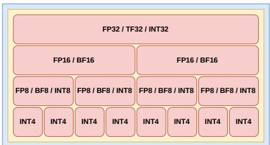

# Ten-Four: An Open-Source Fused Dot Product Unit for Mixed-Precision GPGPU Tensor Cores 原文翻译

# Ten-Four：一种面向混合精度 GPGPU Tensor Core 的开源融合点积单元

Nikhil Rout

韦洛尔理工学院（Vellore Institute of Technology），金奈

nikhilrout97@gmail.com

Blaise Tine

加州大学洛杉矶分校

blaisetine@cs.ucla.edu

摘要——高效的混合精度矩阵乘累加（MMA）运算对于在 GPGPU 上加速深度学习工作负载至关重要。然而，现有的面向 Tensor Core 的开源点积实现依赖于离散的算术单元，导致高延迟、累积舍入误差以及资源利用率低下。为应对这些挑战，我们提出了 Ten-Four，一种可扩展的混合精度融合点积单元，它将浮点与整数算术流水线集成于单一融合架构之中，并作为开源的基于 RISC-V 的 Vortex GPGPU 的 Tensor Core 单元扩展加以实现。我们的设计支持 FP16/BF16/FP8/BF8/INT8/INT4 格式的低精度乘法以及 FP32/INT32 格式的更高精度累加，原生支持 Microscaling（MX）格式，并提供稀疏 lane 时钟门控以实现动态功耗降低，同时数值精度与 NVIDIA Tensor Core 相当。Ten-Four 实现了 4 个周期的运算延迟，Fmax 达到 262.325 MHz，在 AMD Xilinx Alveo U55C FPGA 上每个 Tensor Core 可提供 134.308 GFLOPS 的峰值吞吐量，相较于基于 Berkeley HardFloat 的等价实现实现了约 3.1 倍的性能提升，且面积开销不到其 60%。

关键词——融合点积，GPGPU 微体系结构，混合精度，稀疏性，Microscaling，Tensor Core

近年来，深度学习模型的广泛应用推动 GPU 设计者在加速通用矩阵乘法（GEMM）运算方面做出大量投入，该运算是现代工作负载中的关键计算瓶颈。例如，对 Meta 的 Llama 8B 大语言模型在 NVIDIA Blackwell B200 GPU 上的性能分析表明，超过 80% 的运行时间被用于执行某种变体的 GEMM。为了缓解这一瓶颈，GPU 厂商引入了专用的面向吞吐量的矩阵引擎，例如 NVIDIA Tensor Core [23] 和 AMD Matrix Core [1]，用以执行专用的 Warp-Matrix-Multiply-Accumulate（WMMA）和 Matrix Fused Multiply Add（MFMA）指令，分别。

对 NVIDIA Volta 架构 [23] WMMA 指令的微基准测试揭示了底层 Tensor Core 硬件的微架构细节 [15, 29]。Tensor Core 直接从 SIMT Sub-Core 寄存器堆接收输入矩阵子分块（sub-tile）作为操作数 A、B 和 C，执行一次 MxNxK 的矩阵乘加运算，并将结果子分块矩阵 D 存回寄存器堆，与其并排放置的整数 ALU、FPU 和 LSU SIMD 通道类似。为了在最大化吞吐量的同时保持数值稳定性，矩阵乘法的输入（矩阵 A 和 B）采用较低精度（例如 FP16/INT8），而加数矩阵 C 和结果矩阵 D 采用较高精度（例如 FP32/INT32）。由于 MMA 运算的融合，中间结果无需存入寄存器堆，从而显著降低了功耗和访存流量。这也使得在相同的裸片面积内可以集成更多计算能力，进而改善了吞吐量/mm2 和吞吐量/瓦特这两项在数据中心 GPU 中比以往任何时候都更为关键的指标。

  
Fig. 1: Tensor Core 子矩阵分块 MMA 维度

最初，NVIDIA Volta 架构的 SIMT Sub-Core 包含两个 Tensor Core，每个 Tensor Core 处理来自常驻 32 线程 warp 中 16 个协作线程的数据。然而，自 Ampere 架构 [24] 引入以来，每个 Sub-Core 仅配备一个更大的 Tensor Core，处理 warp 的全部 32 个线程。WMMA 指令作用于“warp 寄存器”，这些寄存器以协作方式存储跨越整个 warp 的子矩阵分块操作数。一个 warp 寄存器可以概念化为同一物理寄存器（例如 R0）在全部 32 个线程中的复制。因此，当在 warp 级指令中指定单个寄存器操作数时，所有 32 个线程的寄存器会同时被访问，每个 warp 寄存器可提供 32×32 = 1024 位的容量。此外，为了最大化数据密度，采用了一种寄存器打包方案，其中每两个 16 位元素（FP16/BF16）、四个 8 位元素（FP8/BF8/INT8）或八个 4 位元素（FP4/INT4）组成一组，打包进给定的 32 位寄存器中，如图 2 所示。

A、B 和 C 的每个 MMA 操作数子分块必须能够放入单个 warp 寄存器中，以便加载到 Tensor Core。此外，矩阵维度的选择应尽可能接近正方形，以最大化分块效果和缓存命中。因此，假设输入为 FP16，矩阵 A 可以存储 (1024/16) = 64 个 FP16 操作数。由于 64 = 8，我们设 M=8 且 K=8。另一方面，矩阵 C 受限于较高精度的累加，因此只能存储 (1024/32) = 32 个 FP32 操作数。当 M=8 时，我们有 8 × N = 32，得到 N=4。最后，设 N=4 且 K=8，矩阵 B 只需存储 32 个 FP16 操作数（512 位），这仅为 warp 寄存器容量的一半。这样就得到了 FP16 输入、FP32 累加下的 8×4×8 Tensor Core MMA 形状。类似地，由于 FP8 在 FP16 的空间中可以打包两个元素，每个 warp 寄存器可以存储 128 个 FP8 操作数，有效地将 K 归约维度翻倍，从而得到 FP8 输入、FP32 累加下的 8×4×16 形状。

  
Fig. 2: 不同 WMMA 操作数格式的寄存器打包

本质上，一个“Tensor Core”可以实现为由 K 元素融合点积（FEDP）单元组成的 [M×N] 网格：

$$
D _ { m , n } = \sum _ { i = 0 } ^ { K - 1 } ( A _ { m , i } \times B _ { i , n } ) + C _ { m , n }\tag{1}
$$

尽管商用 GPU 中的 Tensor Core 近年来取得了显著进展（NVIDIA FP16 Tensor Core 的 FLOPS 从 Volta 到 Hopper 世代增长了八倍 [26]），开源 GPGPU 设计空间却进展滞后，其原型只能提供有限的吞吐量。随着 Ampere 世代 [21, 24] 引入 2:4 结构化稀疏，以及 NVIDIA Blackwell [27] 和 AMD CDNA 4 [2] 架构中原生支持硬件加速的 OCP Microscaling（MX）格式 [28, 31]，这一差距还在进一步扩大。

这一性能差距主要源于现有开源设计依赖于离散的浮点算术单元库，这些库带来了高延迟、累积的舍入误差以及较差的资源利用率。例如，Ventus GPGPU Tensor Core [18] 和 Virgo GPGPU 集群级脉动阵列矩阵单元 [17] 使用了来自 Berkeley HardFloat [13] 库的离散混合精度浮点算术模块。类似地，Nada 等人 [22] 使用多个 FPnew [20] FMA 实例化，为基于 RISC-V 的 Vortex GPGPU [33] 开发了一个 Tensor Core。

为了解决开源 GPGPU 设计空间中缺乏高性能 Tensor Core 实现的问题，我们提出了 Ten-Four1，这是一种新颖的可配置混合精度融合点积（FEDP）单元微架构，在 Vortex GPGPU Tensor Core 单元（TCU）扩展之上开发。Vortex 在多个粒度层级（集群、核心、warp、线程、缓存层次结构）上的可配置性以及其成熟的运行时生态系统，使其成为构建和评估我们设计的理想平台。图 3 展示了我们在 32 线程/warp 配置下，如何采用 [8×4] 的 8 元素 FEDP 单元网格在 Vortex GPGPU sub-core 中组成一个 TCU。

  
Fig. 3: 带 Tensor Core 单元扩展的 Vortex GPGPU SIMT Sub-Core

据我们所知，这是首个将专用融合点积实现与 GPGPU Tensor Core 原型相结合的开源工作。我们工作的主要贡献总结如下：

• 我们提出了一种可配置的 4 周期融合点积（FEDP）流水线，支持 FP16、BF16、TF32、FP8(E4M3) 和 BF8(E5M2) 的低精度乘法以及 FP32 的高精度累加，作为 Vortex GPGPU 的 TCU 扩展的一部分实现。

• 我们描述了一种在浮点数据通路中集成整数运算的统一流水线方法，通过一种新颖的加数拆分策略，以极小的开销实现资源复用最大化。

• 我们引入了一种稀疏通道掩码策略，当输入 A 或 B 为零时，通过时钟门控降低动态功耗，从而使基于内点积的双侧稀疏 Tensor Core 设计更加实用。

• 我们包含了对 Microscaling（MX）格式块量化输入的支持，同时继续保持对加数的早期累加。

• 我们针对 NVIDIA Ada 架构 [25] Tensor Core 验证了我们 FEDP 结果的正确性，实现了 100% 的数值精度匹配。

• 我们展示了相较等效的基于 Berkeley HardFloat 的实现约 3.1 倍的性能提升，在 32 线程/warp 配置下，以不到 60% 的面积成本，实现了 262.325 MHz $F _ { m a x }$ 以及每个 Tensor Core 134.308 GFLOPS 的峰值吞吐量。

## II. TEN-FOUR 微架构

Ten-Four 是一个用于开发功能丰富的混合精度 GPGPU Tensor Core 的开源融合点积硬件 IP，采用 SystemVerilog 编写。

## A. 关键算术子模块

混合精度融合内积数据通路需要多个多操作数加法。进位保存加法器（CSA）特别适合这一任务，因为它们能够在不产生进位传播依赖的情况下，有效地将 N 个 W 位的操作数归约为一个 (W + log N) 位的和与进位。我们采用递归链式 4:2 压缩器开发了一种标准 CSA，并在操作数为奇数时配合条件性 3:2 压缩器，同时引入了 MOD-4 操作数分组 CSA，以便在需要累加七个或更多操作数时进一步缩短关键路径。最终求和由 Kogge-Stone 加法器（KSA）完成，该加法器通过其并行前缀树结构在每个阶段实现更低的扇出，以牺牲面积效率为代价超越了超前进位设计。我们还实现了 Wallace 树乘法器（WTMUL），其部分积通过 CSA 有效归约。我们决定不在设计中引入 Radix-4 Booth 重编码，因为在我们的 4–11 位目标位宽下，其引入的位对编码开销超过了将部分积数量减半所带来的收益。

## B. Ten-Four 混合精度浮点数据通路

根据 SIMT 子核心的配置，Ten-Four 可被配置为执行四元素（在每 warp 4 或 8 线程时）或八元素（在每 warp 16 或 32 线程时）融合内积计算。它还可以在编译时选择性地实例化可用输入格式的任意子集或全部格式，以根据应用需求减少面积并提高效率。例如，仅使用 FP16/BF16/TF32 格式的 LLM 训练负载可以完全省去较低精度格式的逻辑。Ten-Four 还允许在运行时通过源格式信号动态更改输入数据类型。如图 4 所示，完整的 Ten-Four 数据通路由 4 个流水线阶段组成：

1) 阶段 1：共享乘法器、最大指数与异常处理：Ten-Four 采用按类别共享的乘法器方案，在格式专用乘法器的短关键路径与 Zhang 等人 [35] 提出的统一子字部分积网格的面积效率之间进行均等权衡。在计算时，具有相近尾数位宽的格式共享相同的 Wallace 树乘法器。例如，FP16、BF16 和 TF32 三种格式的尾数乘法均在单个 11×11 位 WTMUL 中完成，其中 BF16 尾数在进入乘法器前先进行零扩展。请注意，由于输入是以每 32 位寄存器打包 FP16/BF16 对或 FP8/BF8 四元组的形式给出的，对于给定的 K 元素内积，我们并行实例化 2×K 条乘法器通道。这样，由于每个 32 位寄存器只能打包一个 TF32 操作数，对于该输入类型只有每隔一条通道有效。相反，由于可以打包四个 FP8/BF8 元素，它们需要额外的归约以在流水线后续阶段保持位宽一致性。因此，FP8（E4M3）与 BF8（E5M2）共享两个 4×4 位 WTMUL，其乘积随后通过一个 24 位 KSA 求和。通过这种方式，所有格式都收敛到原始的 E8M25 中间表示，以在后续流水线阶段保持一致性和高效的资源利用。

类似地，输入 A 与 B 操作数的指数和及其各自格式对应的 FP32 偏置转换按照以下公式计算：

$$
C O N V _ { F P 1 6 / F P 3 2 } = B I A S _ { F P 3 2 } - ( 2 \times B I A S _ { F P 1 6 } ) + 1\tag{2}
$$

$$
E X P _ { F P 3 2 } = E X P _ { A } + E X P _ { B } + C O N V _ { F P 1 6 / F P 3 2 }\tag{3}
$$

这些指数和被送入我们的最大指数识别电路，该电路建立在 Sohn 等人的基于减法器的比较器架构 [32] 之上，并将其扩展为支持任意数量的 N 个操作数。我们并行计算所有 (N-1)×(N-1) 个成对指数差，其中结果的符号位指示每对操作数之间的相对大小。为了减少面积开销，我们利用对称性只计算差值矩阵的上三角，并通过简单地对上三角符号位取反来推导下三角。最大指数索引通过独热编码方案识别，并通过归约 OR 逻辑提取。对齐所需的移位量现在可以通过复用差值矩阵轻松计算，并在必要时对值取反。与传统归约树比较器相比，该方法以 $O ( N ^ { 2 } )$ 的面积代价提供了接近 O(1) 的关键路径深度。

符合 IEEE-754 标准的异常处理与指数和尾数处理并行执行。对于每个乘积，我们检测 NaN 输入以及无穷大乘以零的乘法异常条件。加法异常则通过识别内积各元素与被加数之间符号相反的无穷大来检测，从而预先产生结果的符号、NaN 和无穷大标志。

2) 阶段 2：有效数对齐：在这一阶段，与共享乘法器类似，对于给定的 K 元素内积，我们有 2×k 条对齐通道。乘积有效数根据上一阶段计算的移位量进行对齐，并根据其符号位转换为二进制补码表示。各通道中移出的位还会被用于计算 Sticky 位，以保存精度。

3) 阶段 3：累加：朴素的内积实现在内积求和之后单独累加被加数 ”C"，这需要额外的双操作数对齐、规格化和舍入，从而增大了舍入误差和关键路径延迟。我们的设计从第一个流水线阶段起就集成了被加数处理，其中 C 的指数参与最大指数的寻找，其有效数与乘积项一同进行对齐和符号扩展。25 位对齐并符号扩展后的有效数与被加数进一步符号扩展为 $( 2 5 { + } \mathrm { l o g } _ { 2 } ( 2 \mathrm { K } ) )$ 位，以正确处理有符号算术。根据待求和操作数的数量——每 warp 4/8 线程时为五个，或每 warp 16/32 线程时为九个——在编译时选择实例化标准 CSA 或 MOD-4 操作数分组 CSA。

4) 阶段 4：规格化与舍入：最后一个流水线阶段从有符号累加结果中提取幅值，并采用预测性前导零计数器（LZAC）确定规格化移位量。指数通过从最大指数中减去计算出的移位量来调整，而尾数则通过左移有效数进行规格化。使用 LSB、Guard、Round 以及先前提取的 Sticky 位应用舍入到最近偶数（RNE）舍入，以产生最终的 FP32 内积结果。若发生异常，结果将被 IEEE 兼容的规范 NaN 或无穷大表示覆盖。

  
Fig. 4: Ten-Four 混合精度融合内积微架构

## C. 整数数据通路的融合

整数点积运算需要浮点数据通路中已经存在的多个算术组件 [5, 7]。融合两条流水线可以消除仲裁器以及对两个独立 Tensor Core 执行单元进行调度的需求。因此，Ten-Four 努力实现同样的目标：通过增加最小的开销，在现有浮点数据通路中支持 INT8、UINT8、INT4 和 UINT4 乘法以及 INT32 累加。虽然整数格式拥有各自按类别共享的乘法器，但代价显著更高的第 3 级累加器同样被整数格式所复用。

然而，融合 32 位整数加数 C 的加法带来一个挑战：该加数的宽度超出了累加器的 $25 { + } \log _ { 2 } ( 2 \mathrm { K } )$ 位宽度。我们采用一种新颖的拆分策略来解决这一约束。C 的低 25 位在第 3 级 CSA 中与乘积项一同累加，而仅高 7 位（在图 4 中记为 C HI）沿流水线传播，从而大幅减少中间流水线寄存器的开销。在最后一级，整数结果的高 7 位与浮点归一化并行构建，即将累加器的符号扩展溢出与 C HI 相加。随后，该结果与低 25 位累加结果直接拼接，生成完整的 INT32 输出。

## D. 稀疏 Lane 掩码与时钟门控

现代深度学习工作负载，包括剪枝后的 LLM、推荐系统和图神经网络，在权重和激活值上均自然表现出显著的稀疏性。虽然利用这种双侧行稀疏性可以显著降低内存占用和带宽需求，但如图 5 所示，当前的 NVIDIA Sparse Tensor Cores [24–27] 由于内积计算原语本身在处理双侧行稀疏时的根本性限制，仅支持权重矩阵上的 2:4 结构化稀疏。

  
(a) 稀疏-稠密交互。

  
(b) 稀疏-稀疏交互。  
Fig. 5: 内积原语的双侧行稀疏性限制

Wang 等人提出了双侧行稀疏 Tensor Cores（Dual-Side Sparse Tensor Cores，DSTC）[34]，通过将内积单元替换为外积单元来规避这一限制。外积通过对列-行向量对计算叉积，天然地避免了内连接问题，从而在乘法之前将稀疏输入压缩为稠密向量。然而，外积需要在 K 归约步骤之间将完整的 M×N 中间部分积矩阵存储在代价高昂的累加缓冲区中，从而带来大量的面积开销，并降低了给定裸片上的计算密度。

Ten-Four 采取了一条务实的折中路线：保留面积高效的内积 FEDP 设计，同时至少通过选择性 lane 时钟门控来利用稀疏性降低功耗。如图 4 所示，由操作数格式和零检测逻辑导出的输入有效掩码控制 FEDP lane 的时钟门控。当某个 lane 的输入被识别为零时，其流水线寄存器从第一级开始即被时钟门控，从而消除乘法和对齐级中的开关活动，因为在这些级中 lane 计算是自包含的。然而，在进入发生多 lane 归约的累加级之前，第三个流水线寄存器的输出会与有效 lane 掩码进行 AND 运算，确保被禁用的 lane 向 CSA 树提供零值而非寄存器中的陈旧值。这种方法在降低动态功耗的同时，避免了外积设计所需的微架构复杂性或面积开销，是面向非结构化双侧行稀疏工作负载的 Tensor Core 的一种实用解决方案。

## E. 微缩放（Microscaling，MX）格式支持

具有共享指数的块浮点表示，相比传统的按张量量化，能够使模型保持明显更高的精度，同时维持低精度格式的内存占用和吞吐量优势 [8, 31]。两个长度为 k 的符合 MX 规范的向量 A 和 B 的基本点积运算定义为：

$$
{ \mathrm { D o t } } ( A , B ) = X ^ { ( A ) } X ^ { ( B ) } \sum _ { i = 1 } ^ { k } \left( P _ { i } ^ { ( A ) } \times P _ { i } ^ { ( B ) } \right)\tag{4}
$$

其中 $X ^ { ( A ) }$ 和 $X ^ { ( B ) }$ 是块缩放因子，$P _ { i } ^ { ( A ) }$ 和 $P _ { i } ^ { ( B ) }$ 分别是向量 A 和 B 的第 i 个元素。关键在于，MX 规范 [28] 将点积的内部精度和运算顺序留作实现定义，允许硬件设计者进行激进的微架构优化。

实现该运算的传统方法是先将两个缩放因子 $X ^ { ( A ) }$ 和 $X ^ { ( B ) }$ 相加，然后在最终加数累加之前，将该组合尺度简单地加到 FP32 结果的指数上，从而作用于混合精度乘积和（SoP）。然而，这种延迟缩放方式与 Ten-Four 的流水线架构不兼容，因为在 Ten-Four 中，FP32 加数 C 从第一个流水线级开始就与 SoP 一同处理。Ten-Four 通过反转因式分解来解决这一问题。不再将块尺度从 SoP 中提取出来并在最后应用，而是如图 4 所示，将缩放因子直接纳入每个低精度元素在起始阶段的指数加法与偏置电路中。这样，尽管运算顺序相对于传统实现被颠倒了，但该方法仍然完全符合 MX 规范，因为该规范明确允许实现定义的精度和运算顺序。

## III. 评估

## A. FPGA 设计流程分析

我们在 AMD Xilinx Alveo U55C FPGA 上，以 300MHz 工作时钟频率为目标，针对多种线程/warp 配置（N = 4, 8, 16, 32），将 Ten-Four 与等价的 Xilinx DSP IP 以及基于 Berkeley HardFloat [13] 的离散实现进行了评估对比。

  
Fig. 6: FEDP 后端性能扩展性（FP16/BF16）

图 6 表明，Ten-Four 实现了显著更高的单周期吞吐量1扩展能力（2.419–33.577 GFLOPS），相比之下 HardFloat 为 0.855–11.159 GFLOPS（约低 3.1 倍），Xilinx DSP 为 0.343–5.090 GFLOPS（约低 6.6 倍）。这一提升主要源于我们 4 周期的延迟设计（相比之下 HardFloat 为 10 周期，Xilinx DSP 为 31 周期），以及 MOD-4 CSA 累加器结构。

TABLE I: FEDP 后端面积开销（FP16/BF16）
<table><tr><td></td><td>Backend</td><td> $\mathbf { N } = \mathbf { 4 }$ </td><td> $\mathbf { N } = \mathbf { 8 }$ </td><td> $\mathbf { N } = \mathbf { 1 6 }$ </td><td> $\mathbf { N } = 3 2$ </td></tr><tr><td rowspan="3">LUTs</td><td>Xilinx DSP</td><td>6216</td><td>12414</td><td>49236</td><td>98581</td></tr><tr><td>HardFloat</td><td>18400</td><td>37002</td><td>144001</td><td>291207</td></tr><tr><td>Ten-Four</td><td>10945</td><td>21899</td><td>95336</td><td>188077</td></tr><tr><td rowspan="3"> $F F s$ </td><td>Xilinx DSP</td><td>9107</td><td>18063</td><td>70738</td><td>141314</td></tr><tr><td>HardFloat</td><td>6163</td><td>12153</td><td>46850</td><td>93190</td></tr><tr><td>Ten-Four</td><td>2364</td><td>4624</td><td>14967</td><td>29769</td></tr><tr><td rowspan="3"> $D S P s$ </td><td>Xilinx DSP</td><td>64</td><td>128</td><td>512</td><td>1024</td></tr><tr><td>HardFloat</td><td>16</td><td>32</td><td>128</td><td>256</td></tr><tr><td>Ten-Four</td><td>0</td><td>0</td><td>0</td><td>0</td></tr></table>

表 I 表明，我们的设计相较于 HardFloat 实现了 40-55% 的 LUT 减少，同时与 Xilinx DSP 相当。触发器（Flip-Flop）的使用量显著降低，相较 HardFloat 减少 62-68%，相较 Xilinx DSP 减少 74-79%。此外，我们的设计完全消除了 DSP 块的使用，而两个基线方案的 DSP 块需求均随线程数线性增长。

## B. ASIC 设计流程分析

为验证 Ten-Four 的实际可行性，我们使用 Synopsys Design Compiler 以及由亚利桑那州立大学与 ARM Research 合作开发的 ASAP 7nm 预测性 PDK [6]，对一个启用了所有浮点和整数格式的八元素点积设计进行了综合。综合目标为 asap7sc7p5t\_AO\_LVT\_TT\_nldm 标准单元库，时钟频率 1500 MHz，典型工作条件 PVT\_0P7V\_25C。表 II 总结了 ASIC 综合报告。

TABLE II: Ten-Four ASIC 综合结果
<table><tr><td>Metric</td><td>Value</td></tr><tr><td>Maximum Frequency  $\left( F _ { \operatorname* { m a x } } \right)$ </td><td>1.571 GHz</td></tr><tr><td>Total Power Consumption</td><td>6.28 mW</td></tr><tr><td>Dynamic Power</td><td>6.21 mW</td></tr><tr><td>Leakage Power</td><td>69.5 µW</td></tr><tr><td>Cell Area</td><td>1959.86  $\mu \mathrm { { m } ^ { 2 } }$ </td></tr></table>

在 32-线程/warp 配置下，单个基于 Ten-Four 的 Tensor Core 可提供高达 402.2 GFLOPS 的 TF32、804.4 GFLOPS 的 FP16/BF16，以及 1.608 TFLOPS 的 FP8/BF8 峰值吞吐量。作为对比，NVIDIA 的 A100 数据中心 GPU [24] 同样采用 7nm 工艺节点制造，其基础频率为 1065 MHz 至 1275 MHz，最大加速频率为 1410 MHz（取决于具体型号，SXM 或 PCIe）。A100 GPU 集成了 432 个第三代 Tensor Core，可为 FP16/BF16 运算提供高达 312 TFLOPS 的算力，相当于每个 Tensor Core 约提供 720 GFLOPS 的算力。在工艺归一化的峰值吞吐量模型以及同构配置假设（线程/warp 与 Tensor Core 等价单元）下，根据公开规格推断，Ten-Four 的单单元峰值吞吐量比 A100 级别的 Tensor Core 高出约 11%，同时还在单一统一架构中支持范围显著更广的数值格式。

## C. 数值精度验证

为验证 Ten-Four FEDP 计算的正确性，我们开发了一套综合验证框架，其灵感来源于 Tensor Core 微基准测试方法 [11, 16]。该框架采用基于 PyTorch 的 CUDA 内核生成技术，创建面向 NVIDIA Ada 架构 [25] RTX 4090 GPU 的特定格式 WMMA 和 PTX 例程，并以该硬件作为参考基准。我们的验证框架系统地测试了六类不同特征类别中的边界情况：规格化数（normals）、次规格化数（subnormals）、零、无穷大、NaN 以及灾难性抵消（catastrophic cancellation）场景。每种格式均接受超过 100,000 个随机测试向量的测试，并对异常处理路径进行了穷尽式覆盖。Ten-Four 在 FP16、BF16、FP8、BF8、TF32、INT8 和 INT4 数据类型上与 NVIDIA Tensor Core 实现了 100% 的数值精度匹配（ULP=0）。

## A. 开源浮点库

Berkeley HardFloat [13] 是一个被广泛采用的浮点库，为基本计算机算术运算提供了符合 IEEE 754 标准的 HDL 实现，最初使用 Verilog 编写，现已移植到 Chisel。它允许在编译时通过模块参数对指数和尾数位宽进行任意配置，并在中间计算中使用重编码（recoded）格式，已被众多开源项目广泛使用，例如 Gemmini [12]、Virgo [17]、Ventus [18] 以及更广泛的 Chipyard SoC 生态系统 [3]。

TABLE III: 先前浮点算术库与融合点积设计的对比
<table><tr><td rowspan="2">设计</td><td rowspan="2">开源</td><td colspan="5">支持的输入格式</td><td rowspan="2">可配置</td><td rowspan="2">符合 IEEE-754 标准</td><td rowspan="2">融合整数数据通路</td><td rowspan="2">微缩放（Microscaling）</td><td rowspan="2">稀疏 lane 时钟门控</td></tr><tr><td>TF32</td><td>FP16</td><td>BF16</td><td>FP8</td><td>BF8</td></tr><tr><td>Berkeley HardFloat [13]</td><td>V</td><td>X</td><td>√</td><td>X</td><td>X</td><td>X</td><td>√</td><td>√</td><td>X</td><td>X</td><td>X</td></tr><tr><td>FPNew [20]</td><td></td><td>X</td><td>√</td><td>√</td><td>L</td><td>X</td><td>√</td><td>√</td><td>X</td><td>X</td><td>√</td></tr><tr><td>FloPoCo [9]</td><td>√</td><td>X</td><td>√</td><td>X</td><td>X</td><td>X</td><td>√</td><td>X</td><td>X</td><td>X</td><td>X</td></tr><tr><td>ExSdotp [4]</td><td>√</td><td>X</td><td>√</td><td>√</td><td>√</td><td>√</td><td>√</td><td>√</td><td>X</td><td>X</td><td>X</td></tr><tr><td>MXDOTP [14]</td><td>√</td><td>X</td><td>X</td><td>X</td><td>√</td><td>L</td><td>X</td><td>X</td><td>X</td><td>√</td><td>X</td></tr><tr><td>Desrentes et al. [10]</td><td>V</td><td>X</td><td>X</td><td>X</td><td></td><td>J</td><td>X</td><td>X</td><td>X</td><td>X</td><td>X</td></tr><tr><td>Lutz et al. [19]</td><td>X</td><td>X</td><td>X</td><td>X</td><td>√</td><td>√</td><td>√</td><td>√</td><td>X</td><td>√</td><td>X</td></tr><tr><td>Cuyckens et al. [7]</td><td>X</td><td>X</td><td>X</td><td>X</td><td>√</td><td>√</td><td>√</td><td>X</td><td>√</td><td>√</td><td>X</td></tr><tr><td>Ten-Four（本工作）</td><td>√</td><td>¬</td><td>√</td><td>J</td><td></td><td>√</td><td>√</td><td>√a</td><td>√</td><td>√</td><td>√</td></tr></table>

a当可参数化的累加器位宽从默认的 25 位增加到 53 位或更高时，Ten-Four 可以实现完全符合 IEEE-754 标准。

类似地，FPNew [20] 提供了一个高度参数化的 transprecision 浮点单元，采用 SystemVerilog 编写，面向 RISC-V ISA 的 F 扩展。它实现了格式特定或合并的多格式切片，具有可配置的流水线深度，并在 FP64 到 FP8 范围内展现出优秀的能耗比例性。它已被集成到 PULP Platform [30]、Vortex GPGPU 的 FPU lane [33] 以及 Nada 等人的 Tensor Core 原型 [22] 中。

## B. 专用混合精度融合点积设计

ExSdotp [4] 在 FPNew 的基础上扩展了精确的 2 元素点积支持，以较低精度的源格式（FP8/FP16）计算乘积，并以较高精度的目标格式（FP16/FP32）进行累加，且仅需单次舍入。该融合设计相比两个扩展 FMA 的级联节省了约 30% 的面积和关键路径，同时避免了由浮点加法不满足结合律而产生的精度损失。在此工作基础上，MX-DOTP [14] 引入了首个面向微缩放点积的 RISC-V ISA 扩展，通过利用流语义寄存器（Stream Semantic Registers, SSRs）提供其四个操作数和缩放因子，而无需修改寄存器堆，从而支持全部六种 MX 格式并实现原生块缩放，并采用基于锚点（anchor-based）的对齐方式实现高效的多路累加。

Lutz 等人 [19] 提出了两种 MXFP8 点积微架构：一种是用于复用现有 FP32 累加硬件的延迟累加（late accumulation）架构，另一种是面向专用加速器的早期累加（early accumulation）数据通路。两种方法均表明，基于锚点的对齐方案可以避免代价高昂的最大指数查找。进一步深入超低精度领域，Cuykens 等人 [7] 面向机器人持续学习场景设计了 MX 处理方案，通过使用 2 位乘法器构建块的精度可扩展硬件，支持全部六种 OCP MX 规定的数据类型（MXINT8、2 种 MXFP8 变体、2 种 MXFP6 变体和 MXFP4）。他们的基于方形分组的 64 元素（8×8）共享指数分组以及采用分层累加的统一整数-浮点数据通路，展示了格式自适应硬件在极低精度训练中的优势。

上述现有库提供了有价值的浮点构建模块，但其离散化运算设计在点积单元中引入了高延迟、累积的舍入误差和资源低效问题。相反，专用的融合设计虽然缓解了这些缺陷，但其适用范围局限于特定格式或 ISA。Ten-Four 弥合了这一差距，将这些专用融合微架构推广到更广泛、可配置的混合精度 GPGPU Tensor Core 场景之中。

## V. 结论

本文介绍了 Ten-Four，这是一个开源的高性能融合点积单元（Fused Dot Product Unit）微架构，用于为基于 RISC-V 的 Vortex GPGPU 开发功能丰富的混合精度 Tensor Core 单元扩展。通过融合整数与浮点数据通路、对稀疏 lane 进行时钟门控以及通过早期加数累加执行微缩放（Microscaling），Ten-Four 克服了当前基于离散算术单元的 Tensor Core FEDP 设计在延迟和资源利用率方面的限制。我们在 AMD Xilinx Alveo U55C FPGA 上实现了 4 个周期的运算延迟，工作频率为 262.325 MHz，在 32 线程/warp 配置下每个 Tensor Core 可提供 134.308 GFLOPS 的峰值吞吐量，同时在数值精度上与 NVIDIA Tensor Core 相当。此外，Ten-Four 可配置的 RTL 设计与验证方法学，能够支持未来面向深度学习推理加速器的自定义块量化和非结构化稀疏格式的快速原型设计与评估，实现软硬件协同设计。

[1] AMD, “AMD CDNA 2 Architecture,” https://www.amd. com/content/dam/amd/en/documents/instinct-business-docs/ white-papers/amd-cdna2-white-paper.pdf, 2021.

[2] AMD, “AMD CDNA 4 Architecture,” https://www.amd. com/content/dam/amd/en/documents/instinct-tech-docs/ white-papers/amd-cdna-4-architecture-whitepaper.pdf, 2025.

[3] A. Amid et al., “Chipyard: Integrated design, simulation, and implementation framework for custom socs,” IEEE Micro, vol. 40, no. 4, pp. 10–21, 2020.

[4] L. Bertaccini et al., “Minifloat-nn and exsdotp: An isa extension and a modular open hardware unit for low-precision training on risc-v cores,” in 2022 IEEE 29th Symposium on Computer Arithmetic (ARITH), 2022, pp. 1–8.

[5] T. M. Bruintjes et al., “Sabrewing: A lightweight architecture for combined floating-point and integer arithmetic,” ACM Trans. Archit. Code Optim., vol. 8, no. 4, Jan. 2012. [Online]. Available: https://doi.org/10.1145/2086696.2086720

[6] L. T. Clark et al., “Asap7: A 7-nm finfet predictive process design kit,” Microelectronics Journal, vol. 53, pp. 105–115, 2016. [Online]. Available: https://www.sciencedirect. com/science/article/pii/S002626921630026X

[7] S. Cuyckens et al., “Efficient precision-scalable hardware for microscaling (mx) processing in robotics learning,” in 2025 IEEE/ACM International Symposium on Low Power Electronics and Design (ISLPED), 2025, pp. 1–7.

[8] B. Darvish Rouhani et al., “With shared microexponents, a little shifting goes a long way,” in Proceedings of the 50th Annual International Symposium on Computer Architecture, ser. ISCA ’23. New York, NY, USA: Association for Computing Machinery, 2023. [Online]. Available: https: //doi.org/10.1145/3579371.3589351

[9] F. de Dinechin and M. Kumm, Application-Specific Arithmetic. Springer, 2024. [Online]. Available: https://link.springer.com/ book/10.1007/978-3-031-42808-1

[10] O. Desrentes, B. D. de Dinechin, and J. Le Maire, “Exact dot product accumulate operators for 8-bit floating-point deep learning,” in 2023 26th Euromicro Conference on Digital System Design (DSD), 2023, pp. 642–649.

[11] M. Fasi et al., “Numerical behavior of NVIDIA tensor cores,” PeerJ Computer Science, vol. 7, p. e330, 2021. [Online]. Available: https://doi.org/10.7717/peerj-cs.330

[12] H. Genc et al., “Gemmini: Enabling systematic deep-learning architecture evaluation via full-stack integration,” in Proceedings of the 58th Annual Design Automation Conference (DAC), 2021.

[13] J. R. Hauser, “Berkeley HardFloat floating-point arithmetic package, release 1,” https://www.jhauser.us/arithmetic/HardFloat.html, 2019.

[14] G. Islamoglu et al., “ MXDOTP: A RISC-V ISA Extension for Enabling Microscaling (MX) Floating-Point Dot Products ,” in 2025 IEEE 36th International Conference on Applicationspecific Systems, Architectures and Processors (ASAP). Los Alamitos, CA, USA: IEEE Computer Society, Jul. 2025, pp. 81–84. [Online]. Available: https://doi.ieeecomputersociety.org/ 10.1109/ASAP65064.2025.00021

[15] Z. Jia et al., “Dissecting the nvidia volta gpu architecture via microbenchmarking,” 2018. [Online]. Available: https: //arxiv.org/abs/1804.06826

[16] F. A. Khattak and M. Mikaitis, “Accurate models of nvidia tensor cores,” 2025. [Online]. Available: https: //arxiv.org/abs/2512.07004

[17] H. Kim et al., “Virgo: Cluster-level matrix unit integration in gpus for scalability and energy efficiency,” in Proceedings of the 30th ACM International Conference on Architectural Support for Programming Languages and Operating Systems, Volume 2, ser. ASPLOS ’25. New York, NY, USA: Association for

Computing Machinery, 2025, p. 1382–1399. [Online]. Available: https://doi.org/10.1145/3676641.3716281

[18] J. Li et al., “Ventus: A high-performance open-source gpgpu based on risc-v and its vector extension,” in 2024 IEEE 42nd International Conference on Computer Design (ICCD), 2024, pp. 276–279.

[19] D. R. Lutz et al., “Fused fp8 4-way dot product with scaling and fp32 accumulation,” in 2024 IEEE 31st Symposium on Computer Arithmetic (ARITH), 2024, pp. 40–47.

[20] S. Mach et al., “Fpnew: An open-source multiformat floatingpoint unit architecture for energy-proportional transprecision computing,” IEEE Transactions on Very Large Scale Integration (VLSI) Systems, vol. 29, no. 4, pp. 774–787, 2020.

[21] A. Mishra et al., “Accelerating sparse deep neural networks,” 2021. [Online]. Available: https://arxiv.org/abs/2104.08378

[22] A. Nada, G. M. Sarda, and E. Lenormand, “Cooperative warp execution in tensor core for risc-v gpgpu,” in 2025 IEEE International Symposium on High Performance Computer Architecture (HPCA), 2025, pp. 1422–1436.

[23] NVIDIA Corporation, “NVIDIA Tesla V100 GPU Architecture,” https://images.nvidia.com/content/volta-architecture/pdf/ volta-architecture-whitepaper.pdf, 2017.

[24] NVIDIA Corporation, “NVIDIA A100 Tensor Core GPU Architecture,” https://images.nvidia.com/aem-dam/en-zz/Solutions/ data-center/nvidia-ampere-architecture-whitepaper.pdf, 2020.

[25] NVIDIA Corporation, “NVIDIA Ada GPU Architecture,” https://images.nvidia.com/aem-dam/Solutions/geforce/ada/ nvidia-ada-gpu-architecture.pdf, 2022.

[26] NVIDIA Corporation, “NVIDIA H100 Tensor Core GPU Architecture,” https://resources.nvidia.com/en-us-hopper-architecture/ nvidia-h100-tensor-c, 2022.

[27] NVIDIA Corporation, “NVIDIA Blackwell Architecture Technical Brief,” https:// resources.nvidia.com/en-us-blackwell-architecture/ blackwell-architecture-technical-brief, 2024.

[28] Open Compute Project, “OCP Microscaling Formats (MX) Specification v1.0,” https://www.opencompute.org/documents/ ocp-microscaling-formats-mx-v1-0-spec-final-pdf, 2023.

[29] M. A. Raihan, N. Goli, and T. M. Aamodt, “Modeling deep learning accelerator enabled gpus,” in 2019 IEEE International Symposium on Performance Analysis of Systems and Software (ISPASS), 2019, pp. 79–92.

[30] D. Rossi et al., “Pulp: A parallel ultra low power platform for next generation iot applications,” in 2015 IEEE Hot Chips 27 Symposium (HCS), 2015, pp. 1–39.

[31] B. D. Rouhani et al., “Microscaling data formats for deep learning,” 2023. [Online]. Available: https://arxiv.org/abs/2310. 10537

[32] J. Sohn and E. E. Swartzlander, “A fused floating-point four-term dot product unit,” IEEE Transactions on Circuits and Systems I: Regular Papers, vol. 63, no. 3, pp. 370–378, 2016.

[33] B. Tine et al., “Vortex: Extending the risc-v isa for gpgpu and 3d-graphics,” in MICRO-54: 54th Annual IEEE/ACM International Symposium on Microarchitecture, ser. MICRO ’21. New York, NY, USA: Association for Computing Machinery, 2021, p. 754–766. [Online]. Available: https: //doi.org/10.1145/3466752.3480128

[34] Y. Wang et al., “Dual-side sparse tensor core,” in 2021 ACM/IEEE 48th Annual International Symposium on Computer Architecture (ISCA), 2021, pp. 1083–1095.

[35] H. Zhang, D. Chen, and S.-B. Ko, “Efficient multiple-precision floating-point fused multiply-add with mixed-precision support,” IEEE Transactions on Computers, vol. 68, no. 7, pp. 1035–1048, 2019.