# TensorExplorer: Pre-Silicon Screening of Tensor-Core Numerical 论文解析

## 0. 论文基本信息

**作者 (Authors)**: Wei Liu, Yi Yu, Qianliang Liu, et al.

**发表期刊/会议 (Journal/Conference)**: ArXiv

**发表年份 (Publication Year)**: 2026

---

## 1. 摘要

**目的**

- 解决张量核心在 **pre-ISA（指令集集成前）** 阶段缺乏可审计数值格式筛选机制的问题：现代低精度生态（OCP microscaling、NVIDIA NVFP4、AMD/Huawei 格式、IEEE **P3109**）提供了大量候选值表与缩放规则，而硬件无法全量暴露每种模式。
- 填补现有工具链的空白——格式规范只定义编码、量化方法假设模式已存在、可配置算术只实现已选定的菜单——TensorExplorer 旨在回答：**哪些数值契约能通过真实 workload、其存储行为是否合理、其算术路径成本是否可接受**。
- 扩展筛选维度至**数值执行路径**层面：验证相同名义数据类型（如 FP32 输入）在 Kernel 图中被反复组合（如 KDA 仿射链）时，内部精度差异是否会被放大。

---

**方法**

- 构建四级**证据漏斗**，以“提出 → 分类 → 定价”的可审计循环逐步收敛设计空间：
  - **廉价数值筛选**：基于 **QSNR** 对 **504 个 interim P3109 格式** × 8 模型 × 6 种 group size（共 24,192 行）做确定性采样排序。
  - **实现先验准入**：压缩宽度须节省至少 **25%** 原始 value payload、payload 须适配 16-value 数据包，并以 8-bit 为 byte-lane 参考；仅 GPU 友好的 **4/6/8-bit** 宽度进入正式菜单，不合规宽度作为 holdout 对照。
  - **完整 workload 评估**：对晋级候选执行完整 **WikiText-2 PPL** 与 zero-shot 任务（PIQA、ARC-Easy，决赛选手补测 ARC-Challenge/HellaSwag/WinoGrande），并以 ΔPPL ≤ 0.1、ΔAcc ≥ −0.15 pp 为单侧工程预算，区分 quality-pass、lossy-frontier 与 control 三类标签，同时报告 **95% model-cluster 置信区间**，均值与区间判定不合并。
  - **硬件成本测量**：以参数化 Chisel 生成的 dot-product 单元在 **TSMC 22 nm、1410 MHz** 下做 pre-layout 综合，度量面积、packing 与模式复用成本。
- 候选形式化为 **x = (f, G, r, K)**（格式、共享 scale group、舍入规则、硬件锚定宽度），每行记录包含 QSNR、ΔPPL、ΔAcc、有效存储位 **B_eff = b_ν + b_s/G**、decode/multiplier/reduction 代理及实测面积。
- 通过**不对称操作数对**扩展搜索：仅对各自通过个体筛选的存活格式做 A×B 组合综合，匹配现有 block-scaled MMA 接口的独立 operand 类型。
- 执行路径压力测试：以 **KDA-shaped 128×128 仿射链**（深度 1–64）对比 **TF32 / TF32x3 / IEEE** 三种 `tl.dot` 精度对 FP64 的相对状态误差与内核延迟，并在 pinned FLA commit 上复现真实 CP kernel 行为。
- 附加**边界检查**：小规模 STE fake-quant 训练试点（byte-level causal/masked LM + SST-2 BERT）、W/A8 双操作数量化回放、max-abs vs 0.9× clipping 应力测试、16 点 odd-width holdout。

---

**结果**

- **四比特区域**：NVFP4-like **g8** 是最强测试点（PPL delta 0.511、任务 delta −0.505 pp），但仍**同时超出两个质量预算**，被标记为 lossy width-frontier 而非 quality-pass；在相同 5.0 有效比特下，它比 MXINT4/MXFP4 分别好 **0.856 / 更多**个百分点，证明**范围与 scale 语义胜过适度的解码面积增加**。
- **六比特区域**：P3109 **b6p5sf_g8** 均值通过双预算（ΔAcc −0.056 pp），但**任务区间 [−0.218, 0.113] pp 跨越预算**，仅 5/8 模型个体通过；其 K16 面积 4188 μm²，比 b8p6sf 参考节省 **20.6%**（K128 节省 19.0%），构成 cost-advantaged 中间地带。
- **八比特区域**：MXINT8、b8p5sf/b8p6sf/b8p7sf 形成**未解决的近基线带**，在确定性协议下视为不可区分的点估计，选择转化为存储与复用决策；b8p6sf_g64 为区间确认的参考点（95% CI 均在预算内）。
- **Group size 非单调性**：继承父 scale 时 g8 与 g16 **完全一致**（1,344 个采样张量零差异）；独立缩放则改变 **23.2–45.9%** 的 scale code，PPL 变化**方向依格式而定**——小组提供更多选择而非单调质量保证。
- **QSNR 条件性有效**：对 40 个晋级 P3109 候选，QSNR 与 PPL delta 的 Spearman ρ = −0.968，但在 6-bit 区域内弱化至 −0.527；预算回放显示 QSNR 在 28 套件处补全全部接受点，而 width priority 在 24 套件处覆盖更多 frontier 点——**最优排序取决于筛选目标与预算**。
- **硬件成本证据**：

| 候选 | 状态 | 有效位 | K16 面积 (μm²) | 解读 |
|---|---|---|---|---|
| nvfp4_g8 | lossy 4-bit | 5.000 | 4798 | 最强 4-bit，双预算均失败 |
| mxint8_g16 | pass 8-bit | 8.500 | 6134 | 区间确认的 OCP 参考 |
| p3109_b6p5sf_g8 | pass 6-bit | 7.000 | 4188 | 面积最低，任务区间未决 |
| p3109_b8p6sf_g64 | pass 8-bit | 8.125 | 5277 | 区间确认的 P3109 参考 |
| P3109 八模式复用集 | mode set | — | 55369 (K128) | 比最宽路径仅增 **15.1%** |

- **编码宽度不能预测面积**：不对称对中 MXFP8×MXFP4 比 MXFP8×MXFP8 节省 **9.66%**，但 MXFP8×MXFP6 E2M3 反而**大 0.91%**——保留的 significand 精度位与 decode/对齐路径抹平了名义位宽优势。
- **中间精度阈值**：真实 Qwen2.5-7B 操作数下，实用的 6/8-bit 候选需 **12 个保留尾数分数位**才能在最差模块上越过 50 dB，4-bit 控制点仅需 10 位——内部甜点不由 value width 单独决定。
- **执行路径放大**：深度 64 的 KDA 仿射链上，TF32/TF32x3/IEEE 的中位相对状态误差分别为 **3.76×10⁻² / 2.66×10⁻⁵ / 1.63×10⁻⁶**，对应孤立内核延迟 **1.00× / 1.88× / 20.54×**；但 pinned FLA 实验中可行 D=64 下三种精度 CP 输出**位相同**，误差源自 CP 与否而非 TF32——精度差异须在**足够深的状态传播链**中才显化。
- **Recipe 敏感性**：统一施加 0.9× clipping 使 6-bit/8-bit 候选从预算内跌出且排序翻转，证明 shortlist 必须在目标 recipe 下重新验证。

---

**结论**

- TensorExplorer 将 pre-ISA 数值格式选择转化为**可复现、可审计的决策流程**，输出包含质量标签、实现边界与路径绑定约束的 precision-region shortlist，明确区分**硬件可见的数值契约**与**模型特定的量化策略**。
- 推荐紧凑菜单由三区域构成：**range-aware 4-bit（NVFP4-like，lossy 但最强）**、**cost-advantaged 6-bit（P3109 b6p5sf，任务区间未决）**、**保守 8-bit 参考**；不对称操作数对（如 MXFP8×MXFP4）在个体筛选后可按需引入，无需实例化完整笛卡尔积。
- 混合模式的支持成本主要取决于**最宽路径**：八模式共享解码器仅增加 15.1% 面积，模式多样性在选中解码器共享算术核心时代价低廉。
- 提出超越外部数据类型的架构含义：“FP32 输入”不是完整契约，编译器/Kernel 接口应**显式暴露 TF32 快速路径与 TF32x3/IEEE 精确路径**的选择，并将高精度模式分配扩展到**数值深层状态传播区域**（如 context-parallel 仿射前缀）。
- 明确边界：shortlist 限定于声明的 RTN/PTQ 协议、GPU 导向宇宙与 22 nm pre-layout 单元代价代理；ISA 编码、operand delivery、调度与物理收敛仍属下游工作。

---

## 2. 背景知识与核心贡献

**研究背景**

- 低精度算力格式已从单一 bit-width 选择演变为一个多样化的格式家族，涵盖 **OCP Microscaling (MX)**、**NVIDIA NVFP4**、整数模式、**AMD/Huawei 厂商格式**以及 **IEEE P3109** 标准，各格式在数值表、缩放规则、分组语义上存在本质差异。
- Tensor Core 硬件无法无代价地暴露全部格式家族：每一种额外的执行模式都会消耗 packing、算术单元、验证、编译器与 **ISA 编码预算**。
- 现有工具链存在明确的断层：
  - 格式规范（如 OCP、P3109）只定义编码，不回答“该实现哪个”。
  - 硬件感知量化（**HAQ、GPTQ、AWQ、SmoothQuant** 等）只优化模型如何使用已有模式。
  - 可配置算术（Bit Fusion、FIGNA 等）只在模式确定后实现菜单。
- 缺失的关键环节是 **pre-ISA selection**：在 ISA 集成之前，系统性筛选出哪些数值契约能够通过工作负载验证、存储行为合理、且算术路径成本可控。

**研究动机**

- **4-bit 反例**：在同为 5.0 有效比特/权重的条件下，最便宜的算术单元并非最佳工作负载点。**NVFP4-like g8** 在 PIQA/ARC-Easy 上仅损失 0.505 pp，而 **MXINT4** 和 **MXFP4** 分别损失 1.361 和 1.804 pp——range 与 scale 语义的重要性超过 decoder 面积的微小增加。
- **6-bit 存储悖论**：**P3109 b6p5sf** 保留了大部分 8-bit 质量，但 byte-oriented 的 operand staging 可能抵消其密度优势，需要实测检验。
- **混合精度操作数**：**DeepSeek-V4** 报告了 FP4 权重配合 FP4×FP8 计算路径的部署形态，NVIDIA 的 block-scaled MMA 接口已允许独立的 FP8/FP6/FP4 操作数类型，对称的 M×M 枚举会遗漏这一部署驱动的空间。
- **执行路径盲区**：现代 kernel 的分解可能在不改变可见 datatype 的情况下改变算术路径。FLA 的 **KDA context-parallel** 路径中，FP32×FP32 的 Triton tl.dot 默认走 **TF32** tensor-core 输入，局部误差可能在后续变换中重新放大——“FP32 输入”并非完整的数值契约。

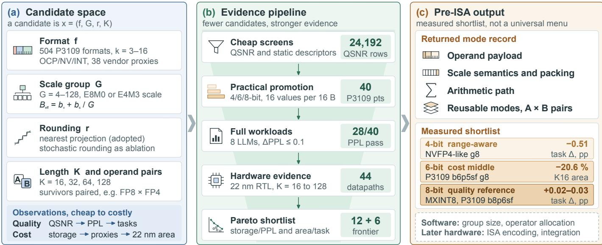 *Fig. 1. Overview of the TensorExplorer pre-ISA screening flow. (a) Candidates are defined by numerical format, scale group, rounding policy, dot-product length, and selected operand pairing, and are characterized along quality and cost axes. (b) Cheap QSNR and static screens, promotion of regular 4/6/8-bit payloads, full workloads, and 22 nm RTL evidence progressively narrow the design space before Pareto selection. (c) The output is a measured mode record and shortlist containing a lossy range-aware 4-bit point, a cost-advantaged 6-bit middle, and near-baseline 8-bit references. Task callouts are mean accurac deltas in percentage points; the 6-bit callout is K16 area relative to b8p6sf. The shortlist is not a universal format menu, and ISA encoding and hardware integration remain downstream.*

**核心贡献**

- **可复现的 pre-ISA 筛选流程**
  - 提出显式的 **admission、promotion、quality-pass、lossy-frontier、control** 规则，将格式选择变成可审计的决策记录。
  - 记录同时区分硬件可见的数值契约与模型特定的量化策略，并审计所选算术模式在数值执行路径上的组合方式。
- **大规模格式空间实测定位**
  - 在 **504 个 interim P3109 格式**及 OCP、NVIDIA、AMD、Huawei、integer 导向候选上识别出清晰的 **4/6/8-bit 实用区域**：
    - **NVFP4-like g8**：最强 4-bit PTQ 点，但超出两个质量预算（PPL Δ 0.511，task Δ −0.505 pp）。
    - **P3109 b6p5sf_g8**：成本优势型 6-bit 中间点，K16 面积较 8-bit 参考低 **20.6%**，task 均值仅损失 0.056 pp，但其 95% 置信区间跨越预算线。
    - **MXINT8 与 8-bit P3109**：构成未解决的 near-baseline 带，最终由存储与复用决策主导。
  - 揭示 **group size 非单调性**：继承父 scale 时 g8 与 g16 完全一致，独立缩放则改变 23.2–45.9% 的 scale 编码，可逆转近持平的 PPL 排序。
  - 证明 **QSNR 与 width priority** 的相对优势随筛选目标与预算切换，QSNR 是条件性剪枝辅助而非最终门槛。
- **实现后果的量化证据**
  - 通过 packing 分析、解析成本模型与实测 **22 nm PPA**，构建 44 个 P3109 format-by-K 数据路径、24 个可复用单元及 9 个对称/非对称 MXFP4/6/8 单元。
  - 关键发现：编码宽度不能可靠排序面积——**MXFP8×MXFP6 E2M3 反而比对称 MXFP8×MXFP8 大 0.91%**，尽管每 lane 少 2 个值比特；**MXFP8×MXFP4 则节省 9.66%**。
  - 8 个 P3109 模式共享最宽算术路径时，相对最宽成员仅增加 **15.1%** 面积。
- **执行路径边界的受控压力测试**
  - 设计 KDA-shaped affine-chain 压力测试，在 depth 64 时测得三种内部精度的中位相对状态误差与成本：

| 执行路径 | 中位相对误差 (vs FP64) | 隔离 kernel 成本 |
|---|---|---|
| **TF32** | 3.76 × 10⁻² | 1.00× |
| **TF32x3** | 2.66 × 10⁻⁵ | 1.88× |
| **IEEE FP32** | 1.63 × 10⁻⁶ | 20.54× |

- 核心结论：TensorExplorer 返回一份带**质量、实现与路径组合边界**标注的实测精度区域候选清单，供下游 ISA 集成与 tensor-core 设计直接使用。

---

## 3. 核心技术和实现细节

### 0. 技术架构概览

**核心定位**

TensorExplorer 是一个面向 **pre-ISA（ISA 集成前）** 的 Tensor Core 数值格式筛选框架，核心目标是回答一个此前缺失的设计问题：在众多低精度数值格式中，**哪些数值契约值得消耗硬件模式位**，即在投入 ISA 编码、decoder、验证与编译器预算之前，先用可审计的证据流程筛出幸存者。

---

**整体架构：三层证据漏斗**

架构采用 **screen → classify → cost** 的非对称证据流水线，廉价探测提出候选，昂贵评估赋标签，硬件测量最后定夺：

- **第一层：廉价静态筛选**
  - 候选以 **x = (f, G, r, K)** 描述，即数值格式、共享 scale 的 group size、rounding 规则、以及硬件锚定 dot-product 长度 K。
  - **QSNR** 作为快速通道，对 **504 个 IEEE P3109 interim 格式 × 8 个模型 × 6 种 group size** 共 24,192 行进行排序。
  - 静态 descriptor 包括 decode/multiplier 代理、有效存储位 **B_eff = b_ν + b_s/G**。
  - **宽度准入先验** 固定于 workload 排序之前：仅接受 4/6/8-bit（16-value payload 需适配 16-byte staging packet，压缩模式须节省至少 25% 原始 value payload）；odd-width 候选仅作为 **holdout 对照**，不进入实际菜单。

- **第二层：全量 workload 分类**
  - 通过筛选的候选进入 **完整 WikiText-2 PPL** 与 **zero-shot 任务**（PIQA/ARC-Easy 为主，ARC-Challenge/HellaSwag/WinoGrande 复核决赛者）。
  - 标签体系：**quality-pass**（满足 ΔPPL ≤ 0.1、ΔAcc ≥ −0.15 pp 单侧预算）、**lossy width-frontier**（质量失败但作为该位宽的非支配代表保留）、**control**（仅暴露失败或被排除层位）。
  - 配套的边界检查：STE 假量化小型训练 pilot、W/A8 双 operand 量化 replay、clipping 压力测试，用于检验 PTQ 短名单在量化参与更新或第二路径量化时是否立即失效。

- **第三层：硬件实现成本测量**
  - 使用参数化 **Chisel** 生成的 dot-product 单元，在 **TSMC 22 nm @ 1410 MHz** 做综合，产出实测 **PPA**（以 area 为选择变量，vectorless power 仅作诊断）。
  - 覆盖 **44 个 P3109 format-by-K datapath**（K ∈ {16, 32, 64, 128}）、24 个可复用单元、以及 **9 个非对称 operand pair**（如 MXFP8×MXFP4）。
  - 解析成本模型 **C_unit = C_dec + C_scale + K·C_mul + C_red + C_acc + C_mode** 区分 decode、scale、乘法、reduction、accumulator 与多模式复用开销。
  - 辅以 packing 分析（GMEM/L2/SMEM 字节流、byte-lane 占用）与 holdout 成本模型校准（mean APE 8.89%）。

---

**关键架构机制**

- **数值/硬件联合表征模型**：每个候选行记录跨层证据向量 Φ(x)，包含 QSNR、ΔPPL、ΔAcc、B_eff、D_dec、M_mul、R_red、U_pack、实测面积 A、复用率 ρ_reuse，Pareto 选择器在此表上做支配判定。

- **阶段式 operand-pair 扩张**：对称候选先单独过筛，只有幸存格式才组合为非对称 pair（保留独立 decode/scale 路径，乘法与 reduction 联合定宽），避免全 Cartesian 展开，匹配现有 FP8/FP6/FP4 MMA 接口。

- **执行路径审计（π，execution path）**：除格式选择外，框架对复合算子做 **execution-path 压力测试**。以 FLA **KDA** context-parallel 仿射链（S_i = M_i·S_{i−1} + H_i）为案例，比较 Triton `tl.dot` 的 **TF32 / TF32x3 / IEEE** 三种内部精度在深度 1–64 下的状态误差传播，证明“FP32 input”不是完整的数值契约。

- **软硬件边界切分**：硬件拥有 value/scale 解码、对齐、zero 处理、尾部位保留、累加与可复现 rounding 原语；软件拥有 clipping、rotation、layer 豁免等策略。Group size 属于 operand metadata 与存储契约，不创建新算术 datapath。

- **可审计输出**：最终返回包含 operand payload、scale 语义、packing、算术路径描述符与可复用模式集的 **mode record + shortlist**，明确止步于 ISA 编码、swizzle、operand collector 与物理实现之前。

 *Fig. 1. Overview of the TensorExplorer pre-ISA screening flow. (a) Candidates are defined by numerical format, scale group, rounding policy, dot-product length, and selected operand pairing, and are characterized along quality and cost axes. (b) Cheap QSNR and static screens, promotion of regular 4/6/8-bit payloads, full workloads, and 22 nm RTL evidence progressively narrow the design space before Pareto selection. (c) The output is a measured mode record and shortlist containing a lossy range-aware 4-bit point, a cost-advantaged 6-bit middle, and near-baseline 8-bit references. Task callouts are mean accurac deltas in percentage points; the 6-bit callout is K16 area relative to b8p6sf. The shortlist is not a universal format menu, and ISA encoding and hardware integration remain downstream.*

---

**最终输出：三个实用精度区域**

| 区域 | 代表候选 | 状态 | 关键数据 |
|---|---|---|---|
| **Lossy 4-bit** | NVFP4-like g8 | 最强测试 4-bit 点，双预算均失败 | PPL Δ 0.511，任务 Δ −0.505 pp，但仍比 MXINT4 好 0.856 pp |
| **Cost-advantaged 6-bit** | P3109 b6p5sf_g8 | 均值通过，任务置信区间跨界 | 比 b8p6sf 省 **20.6% K16 面积**，10.8 TOPS/mm² |
| **Near-baseline 8-bit** | MXINT8_g16 / b8p6sf_g64 | 质量参照，选择退化为存储/复用决策 | 面积区间 5277–6134 μm² |

补充结论：**编码位宽不能单独预测面积**（同为 6-bit 的 E3M2 与 E2M3 出现面积反转）；八模式 P3109 复用单元仅增加 **15.1%** 面积即可覆盖最宽构成路径；group size 与 QSNR 均非单调排序器——独立缩放的 g8 会改变 23.2–45.9% 的 scale code 并可能反转近持平的 PPL 排序。

### 1. Pre-ISA 数值格式筛选框架（证据漏斗）

**核心定位：Pre-ISA 证据漏斗的整体架构**

TensorExplorer 的本质是填补一个架构设计空白：在 **数值格式规范**（OCP MX、NVFP4、IEEE P3109）与 **硬件实现**（可配置算术单元、ISA 集成）之间，缺少一个可复现的 **格式筛选决策层**。其贡献不是新的量化算法或新的 Pareto 优化器，而是一套显式的、可审计的 **准入、晋升、质量通过、有损前沿、对照** 五级规则体系，将海量候选格式收敛为一份带质量与成本边界的执行模式短名单。

 *Fig. 1. Overview of the TensorExplorer pre-ISA screening flow. (a) Candidates are defined by numerical format, scale group, rounding policy, dot-product length, and selected operand pairing, and are characterized along quality and cost axes. (b) Cheap QSNR and static screens, promotion of regular 4/6/8-bit payloads, full workloads, and 22 nm RTL evidence progressively narrow the design space before Pareto selection. (c) The output is a measured mode record and shortlist containing a lossy range-aware 4-bit point, a cost-advantaged 6-bit middle, and near-baseline 8-bit references. Task callouts are mean accurac deltas in percentage points; the 6-bit callout is K16 area relative to b8p6sf. The shortlist is not a universal format menu, and ISA encoding and hardware integration remain downstream.*

---

**一、候选对象的数学建模：候选即模式字段组合**

- 每个候选被参数化为 **x = (f, G, r, K)**，其中：
  - **f**：值/缩放格式（Binary-k-p 值表、INT 编码、块缩放语义）
  - **G**：共享缩放的 Group Size（4–128）
  - **r**：舍入规则（最近邻 RTN 或 seed 记录的随机投影）
  - **K**：硬件锚定的 Dot-Product 维度（16/32/64/128）
- 投影算子定义为 **Ŵℓ,g(x) = Qf,G,r(Wℓ,g) = sℓ,g · ΠCf,r(Wℓ,g / sℓ,g)**，其中 **Cf** 是实现的值表，**sℓ,g** 是 Group Scale
- 存储代价采用有效位数模型：**B_eff = b_ν + b_s / G**，将值精度与 Scale 摊销显式解耦
- 关键设计决策：**执行路径 π** 不作为 504 格式上的另一个笛卡尔维度展开，而是仅对通过个体筛选的复合算子做审计——这是控制搜索空间爆炸的核心机制

**候选行证据契约 Φ(x)**：

| 字段 | 含义 | 获取成本 |
| --- | --- | --- |
| QSNR | 局部投影失真 | 廉价，全量可算 |
| ΔPPL / ΔAcc₂/₃ | 全负载质量 | 仅晋升点 |
| B_eff | 有效存储位 | 静态计算 |
| D_dec, M_mul, R_red | 解码/乘法/归约代理 | 静态计算 |
| U_pack, A, ρ_reuse | 打包、22 nm 实测面积、模式复用 | 仅晋升区域 |

---

**二、证据漏斗的五级流程与决策规则**

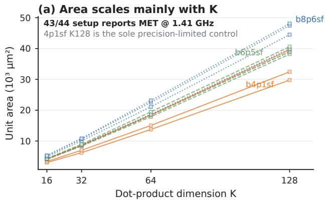

**第一级：显式准入先验—— 在看任何负载数据之前固定**

- **宽度准入**：仅 GPU 生态的 4/6/8-bit 进入实用菜单（4-bit 携 8 字节值、6-bit 携 12、8-bit 携 16，均适配 **16-value/16-byte staging packet**）
- **压缩门槛**：相对 8-bit 至少节省 **25%** 原始值流量
- **字节基准**：8-bit 作为 Byte-Lane 参考锚点
- **不规则宽度**（3/5/7-bit 等 16 个分层对照点）仅用于审计该先验的代价，不进入硬件菜单

**第二级：QSNR 快速通道—— 廉价探测的排序与剪枝**

- 候选×模型×Group 网格覆盖 **504 个 P3109 格式 × 8 模型 × 6 组大小 = 24,192 行** QSNR 数据
- 采样策略完全确定：每 Linear 层最多 16 组，**seed = 3109**，保证可复现
- QSNR 的角色边界被精确刻画：
  - 粗排序有效：QSNR vs 平均 PPL 的 **Spearman ρ = −0.968**（40 个实用 P3109 点）
  - 精排序失效：6-bit 区域内部 **ρ 降至 −0.527**，无法区分近并列候选
  - 结论：**QSNR 既非准入策略也非最终门控，仅为受限空间的优先级信号**

**第三级：全负载质量标注**

- 晋升点跑完整 **WikiText-2 PPL**（context/stride 256/256，非重叠窗口，运行时有效标签分母）+ 完整零样本任务（PIQA/ARC-Easy acc_norm；决赛圈加 ARC-Challenge/HellaSwag/WinoGrande）
- 模型集：LLaMA/Llama-2/Llama-3/Mistral/Qwen3/Qwen2.5 家族至 13B，量化 Linear 层 197–281 个，保证是 **全模型 weight-only PTQ 效应**
- **单侧均值预算**：
  - ΔPPL ≤ **0.1**（为均值未量化 PPL 的 0.93%）
  - ΔAcc ≥ **−0.15 pp**（为均值任务基线的 0.19%）
  - 明确定位为 **工程容差而非统计显著性阈值**

**三级可复现标签**：

- **quality-pass**：满足所有可用均值预算
- **lossy width-frontier**：质量未达标，但保留为已准入位宽的非支配代表（如 nvfp4_g8）
- **control**：仅用于暴露失败模式或被排除的分层（如 4-bit P3109 压力对照、奇数宽度保留集）
- **interval-confirmed** 附加条件：95% 模型簇置信区间也须落在对应单侧预算内；**均值状态与区间状态永不合并**——这是 b6p5sf_g8（均值通过但任务区间 [−0.2176, 0.1132] 越界）与 b8p6sf_g64（区间确认）被区分开的机制

**第四级：硬件成本证据—— 仅在数值候选仍有意义后调用**

- 层次递进：有效位 → 解码/乘法代理（**p²** 乘法器代理、码点数×符号/指数/尾数载荷宽度的解码表代理）→ TSMC 22 nm @ 1410 MHz 实测综合
- 成本分解模型 **C_unit = C_dec + C_scale + K·C_mul + C_red + C_acc + C_mode**，其中 **C_mode** 显式度量多格式复用的控制/解码器开销
- **关键解耦**：Group Size **G** 只影响 B_eff 与打包，**不产生新算术块**——存储成本轴与数据通路成本轴在 Pareto 计算前先分离
- 66 个软件可见格式/组配置映射到 **44 个唯一 format-by-K 数据通路**；24 个可复用单元共享最大算术核、仅切换解码器

**第五级：Pareto 选择与配对扩展**

- 支配定义：在采纳的质量与成本坐标上均不劣、且至少一维严格优
- 对称候选是算子对空间的对角线：单格式筛选幸存者才允许组成有序对 **x× = (f_A, G_A, r_A; f_B, G_B, r_B; K)**，配对成本按 **C_× = D_dec(f_A) + D_dec(f_B) + K·M(p_A, p_B) + R_red(K, p_A, p_B)** 静态评估
- 这种 **分阶段扩展** 契合 NVIDIA 块缩放 MMA 已支持独立 FP8/FP6/FP4 操作数类型的现实，同时避免全笛卡尔积的硬件模式爆炸

---

**三、排序策略对比：预算依赖的 QSNR vs 宽度优先**

回顾性预算扫描在一个固定宇宙（40 个签名有限 4/6/8-bit 候选、12 个任务关键点、6 个决赛圈点）内重放两种确定性排序：

- **Mean-QSNR 优先**：按 QSNR 降序、再按候选 ID
- **宽度优先**：按值位数降序、有效位数降序、再按候选 ID

| 已评估套件数 | QSNR 优先命中 | 宽度优先命中 | 结论 |
| --- | --- | --- | --- |
| 24 | 24 个均值预算点；2/4 前沿点 | 24 个均值预算点；3/4 前沿点 | 宽度优先覆盖更多前沿 |
| 28 | **28 个均值预算点 + 全部 4 个前沿点** | 27 + 3 | QSNR 提前一个套件完成收敛 |
| 29 | — | 达到双总量 | 宽度优先滞后 |
| 40（穷举） | 28 均值预算点、4 前沿点 | 同左 | 穷举本身浪费 12 个套件 |

- 每 suite = 8 次模型级 PPL 运行，因此 QSNR 相对宽度先验的增量优势精确量化为 **一个候选套件 / 8 次 PPL 运行**
- 留一模型族敏感性：QSNR 排序的接受召回率 **90.9%–100%**；Qwen2.5 被扣留时宽度优先多保留一个接受点
- 论文明确承认边界：该截断是回顾性的，**不建立对全部 504 格式的召回保证**

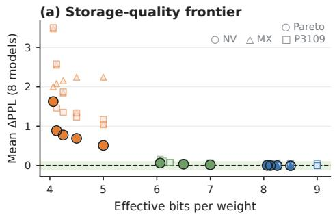

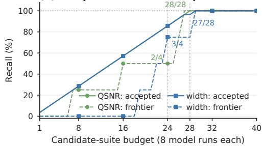

---

**四、漏斗的输出：三个实测精度区域**

| 候选 | 状态 | 有效位 | ΔPPL | ΔTask (95% CI) | K16 面积 |
| --- | --- | --- | --- | --- | --- |
| **nvfp4_g8** | lossy 4-bit 前沿 | 5.000 | 0.511 | −0.505 [−0.697, −0.307] | 4798 µm² |
| **mxint8_g16** | pass, 8-bit 参考 | 8.500 | −0.005 | +0.032 [−0.041, 0.098] | 6134 µm² |
| **b6p5sf_g8** | pass, 6-bit 中间 | 7.000 | 0.019 | −0.056 [−0.218, 0.113] | **4188 µm²** |
| **b8p6sf_g64** | pass, 8-bit 区间确认 | 8.125 | −0.001 | +0.020 [−0.029, 0.066] | 5277 µm² |
| **P3109 八模式集** | 实用模式集 | — | — | — | K128 55369 µm²（+15.1% over 最宽成员） |

- 漏斗暴露的第一个反例：同为 **5.0 有效位**，**NVFP4-like g8 只丢 0.505 pp**，而 MXINT4/MXFP4 丢 1.361/1.804 pp——范围与 Scale 语义胜过解码器面积的微小增加，说明漏斗**不简单偏好最便宜数据通路或最窄原始位宽**
- b6p5sf_g8 相对 b8p6sf 节省 **20.6% K16 面积**、G=16 时节省 **23.5% 总流量**，但任务区间越界使其保持“未解决”状态——质量、成本、置信度三个维度被独立记录而非强行融合

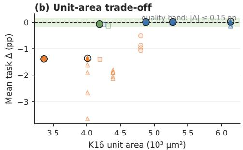

---

**五、漏斗的横向审计机制：防止先验性盲区**

**奇数宽度 Holdout 审计**

- 16 个分层对照（5 个 QSNR 分位 + 高成本对照）覆盖被 4/6/8 先验排除的宽度，在 Mistral-7B/Qwen3-8B 上以统一 tokenizer/toolchain 复测
- 结果：8/16 近基线；Mistral 的并列前沿漏掉一个奇数宽 g128 对照（**召回 2/3**，tie-epsilon = 0.01 PPL）——这是对先验的**实测局限记录**，而非扩大菜单的理由

**配对边界检查（防止 PTQ 短名单在更真实条件下立即失效）**

- W/A8 重放：MXINT8 g64 激活量化后再叠加 b6p5sf_g8 权重，PPL 变化仅 **−0.024**——短名单不因第二操作数量化而崩溃
- 非对称重放：MXFP8 激活（g32）下 MXFP4/MXFP6 E2M3/MXFP8 权重的 PPL 增幅为 1.585/0.168/0.136，确认 FP4 无校准仍是有损的
- Clipping 压力测试：固定 0.9×max-abs 使 6/8-bit 候选**双双越出 0.1-PPL 均值预算且顺序互换**——证明 budget 通过是**配方绑定的**，必须按目标配方重新验证
- 训练侧检查：两个字节级 WikiText-2 试点（各 0.48M 参数、512 步、STE 假量化）+ 一个 BERT-like SST-2 完整训练（5.97M 参数、67,349 训练样本），提供“无立即崩溃”证据而非生产级 FP4 训练配方

**Group Size 非单调性反例**

- 继承父 Scale 的强制 g8 子代与 g16 **在 1,344 个采样张量上完全一致**；独立 g8 量化则改变 **23.2–45.9% 的 Scale 编码**并可使近并列 PPL 顺序反转
- 结论：Group Size 属于**操作数元数据与存储契约**，不是算术数据通路维度——这是漏斗将存储轴与数据通路轴分离的实证依据

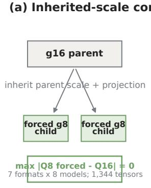

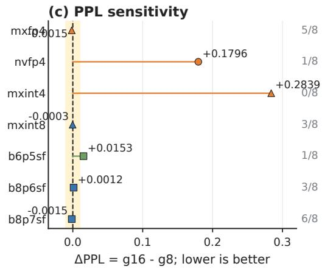

---

**六、执行路径审计：漏斗的第二条轴线**

- 传统筛选只看外部数据类型；TensorExplorer 增补对 **数值执行路径 π** 的审计——同一数学算子可经不同算术原语、内部精度与归约组合实现
- KDA 形状的仿射链压力测试（S_i = M_i·S_{i-1} + H_i，深度 64）给出量化的路径边界：

| 路径 | 深度 1→64 中位相对状态误差（vs FP64） | 孤立核延迟（深度 64，RTX 4090） |
| --- | --- | --- |
| **TF32** | 6.59×10⁻⁴ → 3.76×10⁻² | 1.00× (0.189 ms) |
| **TF32x3** | 4.80×10⁻⁷ → 2.66×10⁻⁵ | 1.88× (0.356 ms) |
| **IEEE FP32** | 2.01×10⁻⁷ → 1.63×10⁻⁶ | 20.54× (3.891 ms) |

- 但在可行的 pinned FLA KDA CP 核（D=64）上，三种精度输出 **bit-identical**——CP 与非 CP 差异不能归因于 TF32；漏斗因此只采纳窄结论：**名义数据类型不是完整契约，仿射链深度值得审计**，而非“TF32 全局不安全”

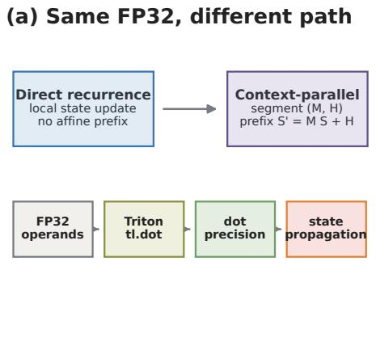

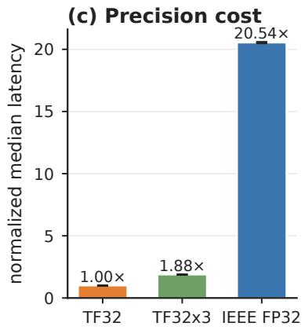

---

**七、硬件成本证据对漏斗的两个关键修正**

**修正一：编码宽度不能可靠排序面积**

- 九个 K16 非对称对中，MXFP8×MXFP4 比 MXFP8×MXFP8 省 **9.66%**，但 MXFP8×MXFP6 **E2M3 反而大 0.91%**——E2M3 保留与 E4M3 相同的四位尾数精度，解码、对齐与乘积宽度抵消了名义位宽节省
- 类似地 b4p2sf 被 b4p3sf 支配（同存储、更差质量、更大面积）

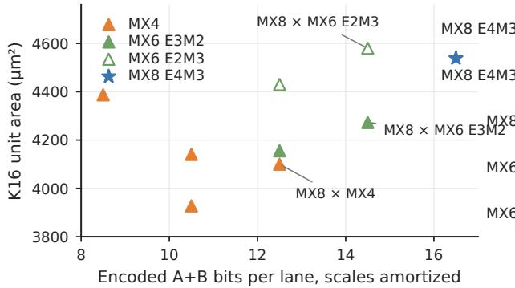

**修正二：模式复用成本是“最宽通路”决策**

- 八模式 K128 可复用单元仅比最宽成员大 **15.1%**（全 11 模式 18.6%）；对比八单元复制的 **83.3%** 面积节省上界，说明多个 P3109 模式共享最宽算术核 + 切换解码器是廉价的
- 成本模型留出验证：线性面积模型（K、K·log K、precision²、指数宽）在 44 个 held-out 预测上达 **8.89% 平均 / 25.77% 最大**绝对百分比误差；最宽成员复用模型在 24 点上达 5.53% 均值误差——仅为同一生成器与工艺内的早期锚点，**非跨家族验证**

---

**八、框架在整体中的作用与输入输出边界**

- **输入**：504 个 interim P3109 格式 + OCP/NVIDIA/AMD/Huawei/INT 导向候选（各格式定义值表、Group Scale、舍入、编码），以及由 TensorGauge 提供的 bit 级精确数值模型（控制累加结构、舍入路径、中间精度保留策略并接入 PyTorch）
- **输出**：一份**可测量的执行模式记录**——包含操作数载荷、Scale 语义、打包、算术路径描述符、可复用模式集、选定操作数对，以及每条质量/实现/路径组合边界
- **下游边界**：ISA 编码、swizzle、操作数收集器、调度、后布局集成、时钟树、物理收敛全部留给后续张量核设计阶段——漏斗的止点在 **pre-ISA**
- **审据链的不对称性**是框架的方法论核心：QSNR 提议区域 → Holdout 测量筛选召回 → 全 PPL/完整任务分配体制标签 → 硬件证据仅在数值候选仍有意义后调用；**低面积数字无法拯救明确的负载失败**，反之高 QSNR 也无法单独决定硬件投资
- 明确的适用域声明：结论限定于声明的 RTN/weight-only PTQ 配方、激活策略与 P3109 interim 编码假设；短名单**不是通用格式菜单**，且 "NVFP4-like" 是 E4M3-scaled FP4 筛选代理而非 Blackwell NVFP4 的位级模型（后者含 16-value 微块与更高层缩放约定）

**方法论的深层价值**

- 将常被混淆的三类观测显式分离：**局部投影误差（QSNR）**、**全负载质量（PPL/Task）**、**算术路径成本（RTL PPA）**
- 用 **预声明的覆盖规则**（lossy frontier、control）替代隐式淘汰，使“为什么这个点被保留/降级”在每一行都可追溯
- 通过把 Group Size 归入存储契约、把执行路径归入事后审计、把配对扩展限制在幸存者之间，实现了对 **504 格式 × 组大小 × 舍入 × 操作数对** 空间的可控压缩，而非穷举

### 2. 跨 504 个 P3109 格式的精度区域实证结论与排序器失效分析

**问题定位：为什么格式选择需要“证据漏斗”而不是单一排序器**

TensorExplorer 面对的核心困境是：IEEE P3109 定义了一个参数化的 Binary-k-p 值表家族（k 为存储值位宽、p 为有效精度参数），候选空间高达 **504 个 interim 格式**，再加上 OCP、NVIDIA、AMD、Huawei 及 integer 导向的候选。Tensor Core 的每个 execution mode 都要消耗 decoder、scale、product、reduction 与 verification 预算，无法全量暴露。论文的关键论断是：**单一数值代理指标（QSNR）或单一硬件指标（编码位宽 / 面积）都无法独立完成排序**——必须用多层证据交叉验证。

---

**筛选流程与参数设置**

- **候选建模**：每个候选表示为 $x = (f, G, r, K)$，即数值格式、共享 scale 的 group 大小、rounding 规则、硬件锚定位宽。观察量包括 QSNR、ΔPPL、ΔAcc、有效存储位 $B_{\mathrm{eff}} = b_\nu + b_s/G$、以及 22 nm 单元面积。
- **QSNR 快速通道**：504 个 P3109 格式 × 8 个模型（LLaMA / Llama-2 / Llama-3 / Mistral / Qwen3 / Qwen2.5 家族，最大 13B）× 6 个 group size，共 **24,192 行**确定性采样记录；每 linear layer 最多采 16 个 group，seed 固定 3109。
- **Admission Prior（宽度准入规则）**：在看到 workload 结果**之前**固定：
  - 仅保留 GPU 导向的 **4/6/8-bit** 宽度；
  - 16-value payload 必须装进一个 16-byte staging packet（4-bit 8B / 6-bit 12B / 8-bit 16B）；
  - 压缩格式相对 8-bit 至少节省 **25%** 原始 value payload。
  - 由此从 504 格式收敛到 **40 个** signed-finite 4/6/8-bit format/group 候选、12 个 task keypoints、6 个 strong-task finalists。
- **质量预算（工程容差，非显著性阈值）**：ΔPPL ≤ 0.1（约 0.93% 平均未量化 PPL）；ΔAcc ≥ −0.15 pp（约 0.19% 任务基线）。
- **三层标签体系**：quality-pass（通过全部 mean 预算）、lossy width-frontier（质量失败但作为该位宽的非支配代表被保留）、control（仅用于暴露失败或被排除的层位）。

 *Fig. 1. Overview of the TensorExplorer pre-ISA screening flow. (a) Candidates are defined by numerical format, scale group, rounding policy, dot-product length, and selected operand pairing, and are characterized along quality and cost axes. (b) Cheap QSNR and static screens, promotion of regular 4/6/8-bit payloads, full workloads, and 22 nm RTL evidence progressively narrow the design space before Pareto selection. (c) The output is a measured mode record and shortlist containing a lossy range-aware 4-bit point, a cost-advantaged 6-bit middle, and near-baseline 8-bit references. Task callouts are mean accurac deltas in percentage points; the 6-bit callout is K16 area relative to b8p6sf. The shortlist is not a universal format menu, and ISA encoding and hardware integration remain downstream.*

---

**核心反例：同为 5.0 effective bits，最便宜的算术单元不是最好的 workload 点**

这是论文给出的第一个决定性证据，直接否定了“面积优先”的排序策略：

| 候选（weight-only PTQ, nearest rounding） | Effective bits/weight | 算术单元成本 | PIQA/ARC-Easy 精度损失 |
|---|---|---|---|
| **nvfp4_g8**（E4M3-scaled FP4） | 5.0 | 较高（scale 路径更宽） | **−0.505 pp** |
| **mxint4_g8** | 5.0 | 较低（整数路径最简） | **−1.361 pp** |
| **mxfp4_g8** | 5.0 | 最低 | **−1.804 pp** |

- 三个候选存储位完全相同，nvfp4_g8 在八模型平均上全部为负方向的最小损失，且比 mxint4_g8 好 **0.856 pp**。
- 结论：**range 与 scale 语义的价值超过 decoder 面积的适度增加**。TensorExplorer 保留 NVFP4-like 作为 4-bit lossy width-frontier（因其仍双双超出质量预算），同时如实记录其高于 MXFP4/MXINT4 的 scale-path 面积——quality 与 cost 轴被明确分离，不允许低面积“救援”workload 失败。

---

**跨 504 格式的精度区域实证结论**

P3109 家族内部的筛选呈现清晰的三段式区域结构：

- **4-bit 区域 = stress control 区域**：没有任何 4-bit P3109 promoted 点进入 near-baseline PPL 带；P3109 的 4-bit signed-finite shapes 全部降级为压力控制点，仅用于暴露失败边界。
- **6-bit 区域 = cost-advantaged middle**：
  - 十个 6-bit PPL 点中有 **八个** 进入 near-baseline 带，由 **b6p5sf** 领跑；
  - b6p5sf_g8 的 mean 同时通过 PPL（0.019）与 task（−0.056 pp）预算，但 **95% task 置信区间 [−0.218, 0.113] pp 跨越预算线**，八模型中仅 5/8 单独通过——论文明确标注为“mean 通过、interval 未确认”的状态，拒绝将 mean 与 interval 状态合并；
  - 其 mean 相对 PPL 变化为 0.254%（NLL 0.00252），leave-one-family-out 检验显示 task mean 在 −0.093 至 −0.017 pp 之间浮动。
- **8-bit 区域 = near-baseline band（storage/reuse 决策）**：全部 **20 个** 8-bit PPL 点进入 near-baseline 带；b8p6sf_g64 的 95% interval（[−0.010, 0.008] PPL / [−0.029, 0.066] pp）**interval-confirmed** 通过，8/8 模型通过 task 预算。此时格式选择退化为存储与 mode-reuse 的工程决策，而非质量决策。
- **Codepoint 审计保证语义有效**：对 11 个 practical signed-finite 格式 + 3 个 odd-width control 的每个 codepoint 与 P3109 interim 十六进制表逐一比对，**零失配**；每个 finite-code set 以 16-hex 字符哈希钉死（如 b6p5sf=cda8ac8b08f22432）。注意符号约定：p 是 significand-precision 参数，显式分数精度为 p−1；b8p7sf 是 **8-bit payload 且 p=7**，不是 7-bit 格式；signed-finite 表将 sign-negative zero 保留为 NaN，故 finite 计数为 $2^k - 1$。
- **更广家族的测量性局限**：16 个分层 odd-width holdout 中 8 个在双模型 mean 上 near-baseline；但 Mistral 的 tie frontier 含 3 点，admitted set 在 0.01-PPL tie epsilon 下漏掉 1 个 odd-width g128 control，**recall 仅 2/3**。这是对 ecosystem prior 排除成本的量化测量，而非把所有可行位宽都升格为硬件 mode 的理由。
- **Vendor replay**：38 个 AMD/Huawei/NVIDIA 导向的 public alias 中 9 个达到 full-flow mean 预算；AMD/OCP E4M3 最强（g16：ΔPPL 0.055，ΔAcc −0.022 pp）；E2M3 出现指标分离——g128 给出最低 ΔPPL，g32 给出最佳 task 结果。

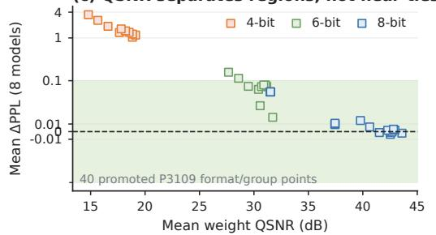

---

**排序器失效分析之一：QSNR 与 Width Priority 的预算依赖交换**

在 40 候选 × 320 model-level PPL runs 的固定宇宙内做 retrospective budget sweep（QSNR priority：按 QSNR 降序；Width priority：按 value bits 降序 → effective bits 降序）：

| 预算（suite 数） | QSNR priority 表现 | Width priority 表现 |
|---|---|---|
| 24 | 24 accepted points，2/4 frontier points | 24 accepted points，**3/4 frontier points** |
| 28 | **28/28 accepted + 4/4 frontier** | 27 accepted，3/4 frontier |
| 29 | — | 追平（28 + 4） |
| 40（穷举） | 28 accepted + 4 frontier（全集） | 同左 |

- **结论**：最优排序器取决于“预算必须回收什么”。Width priority 在小预算下覆盖更多 frontier 点；QSNR 在 accepted-region completion 上领先 **恰好一个 suite（8 次 PPL run）**。这个 cutoff 是 retrospective 的，**不构成对全部 504 格式的 recall 声明**。
- Leave-one-model-family-out 时，QSNR accepted recall 为 **90.9%–100%**（Qwen2.5 被 withheld 时 width priority 反而多保住一个 accepted 点）——这是 sensitivity 证据，不是 prospective validation。
- 统计结构上：QSNR vs mean ΔPPL 在 40 点全集上 Spearman ρ = −0.968、Pearson r = −0.819，但在 6-bit 区域内部 fine ranking 退化到 **ρ = −0.527**。QSNR 能把 lossy 4-bit shapes 从 6/8-bit 区域中干净分离，却无法解析近邻 tie。

---

**排序器失效分析之二：Group Size 的非单调性——量化器在变**

Group size 不是单调质量排序器，根本原因是**独立 scale 的更小 group 改变了量化器本身**（Figure 3 的受控 replay）：

- **继承 scale 时**：g8 child 强制继承 g16 parent 的 scale 与 nearest projection，跨 7 个格式、**1,344 个采样张量**（全部 8 个 LLM 的 Linear weight rows）逐一完全匹配——即 g8 在继承语义下是 g16 的精确重构。
- **独立 scale 时**：g8 独立量化改变了 **23.2%–45.9%** 的 scale codes，FP4-style 格式的 clipping pattern 随之改变。
- **PPL 后果双向**：完整 WikiText-2 PPL 差异跨格式**变号**（|ΔPPL| ≤ 0.01 的 pale-yellow tie band 内外均有分布），大 group 的微小聚合优势（MXFP4、MXINT8、b8p7sf）落在或接近 tie-aware band，不构成对大 group 的内在偏好。
- P3109 task keypoints 在更宽 group 分离下同样分裂：最佳 6/8-bit group 因 aggregate metric 略有不同，但 per-model 与 per-task 符号在 tie band 内分裂。
- **架构含义**：group size 属于 operand metadata 与存储契约（影响 $B_{\mathrm{eff}}$ 与 packing），**不创建独立算术 datapath**——TensorExplorer 因此把存储成本轴与 datapath 成本轴在 Pareto 计算前显式分离。

---

**排序器失效分析之三：Near-Baseline 带内的 rank 不稳定性**

- 五个 finalists 上，PPL vs ARC-Challenge/HellaSwag/WinoGrande 给出 Pearson r = −0.945 但 **Spearman ρ = −0.300**；two-task proxy vs 强任务为 r = 0.905、**ρ = 0.100**。线性相关强、秩相关崩塌，说明这些指标能分离 lossy 4-bit 区域，但**不能对 6/8-bit cluster 内部排序**。
- 三任务扩展检查确认 regime 而非名次：nvfp4_g8 仍是最受支持的 4-bit finalist 但平均损 0.403 pp；mxint8_g16、b8p6sf_g64、b8p7sf_g16 全部落在 baseline 0.013 pp 内——near-baseline cluster 无法以统计置信排序。
- **Tie-aware Pareto replay**：将差异按 0.01 PPL / 0.15 pp 折叠后，storage/PPL frontier 从 **12 点缩到 9 点**，area/task frontier 从 **6 点缩到 3 点**，证明大量原始“非支配点”实为噪声级 tie。
- **Rounding 消融**：seed-0 stochastic-value PTQ 全面劣化——18 个点平均 mean PPL 恶化 **1.356**、PIQA/ARC-Easy 平均劣化 **1.233 pp**，无任何点进入 Pareto shortlist，进一步确认 nearest rounding 为采用路径的合理性。

---

**输入输出关系与在整体流程中的作用**

- **输入**：504 个 P3109 interim 格式定义 + OCP/NV/INT/vendor 候选 + 8 模型权重张量 + 显式 admission / promotion / budget / control 规则。
- **中间证据流**：QSNR（提出区域）→ 全量 WikiText-2 PPL + 完整 PIQA/ARC-Easy（指派 regime 标签）→ packing + 22 nm 综合（分离数值近邻的幸存者）→ tie-aware Pareto 选择。
- **输出**：一个带 quality / implementation / path-composition 边界的可审计 **execution-mode shortlist**——lossy 4-bit（nvfp4_g8，最强测试点但双预算失败）、cost-advantaged 6-bit（b6p5sf_g8，mean 通过、interval 未决，K16 面积比 b8p6sf 小 20.6%）、near-baseline 8-bit（storage/reuse 决策），以及 8-mode K128 复用单元仅比最宽组成路径贵 **15.1%** 的 mode-set 证据。
- **对下游的边界声明**：该记录止步于 pre-ISA——ISA 编码、swizzle、operand collector、调度与 post-layout 集成留给后续 tensor-core 设计；同时明确“NVFP4-like”是 E4M3-scaled FP4 筛选代理，非 Blackwell 生产实现的逐位模型。

---

**方法论总结**

- 三个失效模式共同指向一个设计规则：**QSNR 是 restricted-space 的条件性剪枝信号，既非 admission policy 也非 final gate**；width priority 在小预算下换 frontier 覆盖；group size 改变量化器而非单调排序；near-baseline 带内的秩必须交给 interval 与 tie-aware 处理。
- 论文的价值不在提出新优化算法，而在于把 **硬件可见的数值契约**（value table、scale 语义、rounding、packing、算术路径）与 **模型特定的量化策略** 解耦，并使 pre-ISA 选择过程的每一步（哪个点为何被 promote / demote / 保留为 tie）可复现、可审计。

### 3. 执行路径精度审计（KDA 仿射链状态误差放大）

**核心定位：从“数据类型契约”到“执行路径契约”**

TensorExplorer 的主体筛选流程关注**数值格式**（value encoding、group scale、rounding），而 KDA 仿射链压力测试补充了一条正交的审计轴线：即使外部数据类型完全相同（名义上都是 FP32 输入），底层算术原语（TF32 / TF32x3 / IEEE）的不同仍会在**有状态图组合**中被放大并变得可观测。该案例研究证明：**"FP32 input" 不是一个完整的数值契约**，pre-ISA 筛选必须扩展到执行路径层面。

---

**一、问题背景：KDA Context Parallelism 中的隐式精度陷阱**

- **KDA/KCP 机制**：Kimi Linear 提出的 **KDA** 注意力架构在 context parallelism 下，由 FLA 库的 CP kernel 将各 chunk 预处理为仿射 **(M, H)** 变换对，前缀合并更新初始状态后恢复正常递推。
- **触发条件**：该路径中名义上的 FP32×FP32 矩阵乘通过 Triton **tl.dot** 实现，而 Triton 在 NVIDIA 平台上对 FP32 输入的 **tensor-core 默认精度是 TF32**（仅保留 10 位尾数），需显式指定 tf32x3 或 ieee 才能获得更高精度。
- **误差再入**：局部 dot 的截断误差会经由后续仿射变换**重新进入**状态更新链，因此单点容差不足以刻画整条 kernel graph 的数值行为。
- **外部工程佐证**：FLA **PR #1180** 为 state update 与 affine merging 增加了 opt-in 的 **TF32x3** 路径，保持默认行为不变，并在非 TF32 平台回退到 IEEE——这正是“执行路径需要显式契约”这一设计压力的工业级体现。

---

**二、误差传播的数学模型**

状态更新由仿射递推刻画：

- $S_i = M_i S_{i-1} + H_i$，相邻变换按 $M_{02} = M_{12} M_{01}$、$H_{02} = M_{12} H_{01} + H_{12}$ 复合。
- 若实际执行路径为 $\widehat{S}_i = (M_i + \Delta M_i)\widehat{S}_{i-1} + H_i + \delta_i$，则一阶状态误差满足：

$$
e_i \approx M_i e_{i-1} + \Delta M_i S_{i-1} + \delta_i
$$

- 链式展开后的示意形式：

$$
e_n \approx \sum_i \left( \prod_{j=i+1}^{n} M_j \right) \epsilon_i
$$

- **关键理论立场**：论文刻意强调**不预设线性或指数增长规律**——传播行为取决于转移矩阵 $M_j$、条件数、状态幅度与组合深度。这正是必须做**实测深度扫描**（depth 1–64）而非仅做理论推断的原因。
- **两类误差的区分**：$\Delta M_i S_{i-1}$ 是单个 $n \times n$ 运算的**局部算术误差**，而 $e_n$ 是变换链复合后的**组合执行误差**。TensorGauge 之前只暴露了前者，本压力测试审计的是后者。

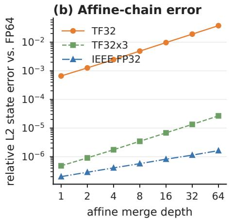

---

**三、审计协议与参数设置（双层实验设计）**

**第一层：受控隔离压力测试**

- **链结构**：合成的 **KDA-shaped 128×128** 仿射变换链，$K = V = 128$。
- **精度档位**：显式 Triton tl.dot 精度 **tf32 / tf32x3 / ieee**，外加同 FP32 输入上的 **FP64** 作为参考基准。
- **扫描维度**：depth 1–64、3 个随机种子、2 个合成矩阵族、accuracy/ULP 指标、100 次 launch 的计时统计（取中位数与 p25/p75 区间）。

**第二层：Pinned FLA 真实 kernel 验证**

- **环境**：PyTorch 2.7.1+cu126、Triton 3.3.1、CUDA 12.6、单张 **RTX 4090**、BF16 KDA 张量、$d_k = d_v = 64$、固定 FLA commit **465b4bc**。
- **规模**：序列长度 4K–256K 的单 GPU KDA 卡内 CP kernel，对比无 CP 基线与三种精度档位。
- **明确边界**：这是合成压力测试而非 checkpoint trace；**D=128 超出该 GPU 每 block 的 shared memory 限制**，因此不做 multi-GPU 或模型级推断。

---

**四、核心测量结果**

**深度扫描下的状态误差放大（对 FP64 的中位相对误差）**

| 精度路径 | Depth 1 | Depth 64 | 误差量级跨度 |
|---|---|---|---|
| **TF32** | 6.59×10⁻⁴ | **3.76×10⁻²** | 约 57× 放大 |
| **TF32x3** | 4.80×10⁻⁷ | **2.66×10⁻⁵** | 约 55× 放大 |
| **IEEE** | 2.01×10⁻⁷ | **1.63×10⁻⁶** | 约 8× 放大 |

- 三档精度的**相对排序在整个深度范围内保持稳定**，第二个矩阵族复现了同样的排序，说明结论非单族伪影。
- 这是**深度压力证据，而非普适增长定律**——论文反复强调该曲线不能外推到所有 KDA 工作负载。

**Depth 64 的隔离 kernel 代价（RTX 4090 中位延迟，100 launches）**

| 精度路径 | 中位延迟 | 相对代价 |
|---|---|---|
| **TF32** | 0.189 ms | 1.00× |
| **TF32x3** | 0.356 ms | 1.88× |
| **IEEE** | 3.891 ms | **20.54×** |

- **TF32x3 的原理**：采用三项 TF32 分解/校正逼近 FP32 GEMM 精度，以约 1.88× 的代价换取约 3 个数量级的误差改善，是明显的精度-成本甜点；它**不是 IEEE FP32**。
- IEEE 路径 20.54× 的代价揭示了一条陡峭的成本悬崖，为编译器/runtime 的**路径选择策略**提供了量化依据。

---

**五、否定性结果与边界条件（同样重要的证据）**

Pinned FLA 实验给出了与隔离测试互补、甚至方向相反的结论：

- **CP vs 无 CP 的固有差异**：在 64K/256K（观测深度 8/32）下，最终状态相对 L2 误差对无 CP 基线为 **3.16×10⁻³ / 3.12×10⁻³**，256K 输出误差 **4.09×10⁻³**——这个差异来自 CP 切分本身，而非 TF32。
- **关键否定**：在可行的 **D=64** 压力下，TF32、TF32x3 与 IEEE 的 CP 输出**逐位一致**；该运行未复现任何精度模式改进，CP/no-CP 差异**不能归因于 TF32**。
- **真实 kernel 中的算子代价更温和**：256K 下 TF32x3/IEEE 算子延迟仅为 TF32 的 **1.071× / 1.372×**（远低于隔离测试的 1.88×/20.54×），因为真实 kernel 中其他开销稀释了 dot 的占比。
- **结论的收窄**：隔离正控制 + pinned kernel 边界共同支持的只是**较窄的规则**——名义数据类型不充分、仿射链深度值得审计——而非“TF32 全局不安全”或“所有 context parallelism 都受影响”的过度声明。

---

**六、在 TensorExplorer 整体流程中的位置与输入输出关系**

**输入侧**

- 来自前序筛选的**存活算术模式**（arithmetic semantics），即候选格式所隐含的 dot-product 执行原语。
- KDA kernel graph 中**会重复暴露该算术语义的复合算子**（affine merge 链）——注意 $\pi$（执行路径）不是对 504 种格式做笛卡尔展开，而是只对选中的复合算子做定向审计。

**输出侧**

- 一条**执行路径边界**写入候选记录：为每个存活模式标注其在深度组合下的误差行为与档位代价，形成 **quality / implementation / path-composition 三重边界**。
- 具体的架构建议：编译器/kernel 接口应将**快速 TF32 路径与精度敏感的 TF32x3/IEEE 路径显式化**，而非依赖隐式默认；高精度档位不仅应分配给敏感算子，还应覆盖**数值上深层的状态传播区域**。
- 与 **RQ4 中的 operator-aware 分配**（down_proj、lm_head 敏感性）汇合，升级为**execution-path-aware precision**：同一算子内部，局部递推与 context-parallel 仿射前缀也可能需要不同的内部精度。

---

**七、方法学价值总结**

- **证据不对称性设计**：廉价的隔离合成实验提出机制假设，昂贵的 pinned 真实 kernel 划定适用边界——两者共同防止了过度泛化，这是全文“screen–classify–cost 循环”在执行路径维度的复刻。
- **首次量化的三档价目表**：TF32/TF32x3/IEEE 在深度 64 处 **3.76×10⁻² / 2.66×10⁻⁵ / 1.63×10⁻⁶** 的误差阶梯与 **1.00×/1.88×/20.54×** 的成本阶梯，为 pre-ISA 阶段决定“是否为高精度路径预留模式位”提供了可审计的实测锚点。
- **契约边界的扩展**：TensorExplorer 最终返回的不再是单纯的格式清单，而是一份包含**路径绑定**的 execution-mode 短名单，供下游 ISA 编码、operand delivery 与物理实现阶段使用。

### 4. 块缩放点积单元的硬件成本证据（编码宽度不决定面积）

---

**核心命题：编码宽度 ≠ 硬件面积**

块缩放点积单元的成本证据揭示了 TensorExplorer 筛选流程中一个关键的反直觉结论：**operand 的编码位数（encoded width）不能作为面积预测的独立依据**。论文中最具代表性的反例出现在九个 K16 不对称 operand pair 的综合结果中——两个 **MXFP8×MXFP6** pair 的每 lane 摊销位数完全相同（均为 **14.5 bits**），但面积表现截然相反：

| Operand Pair | 每Lane摊销位数 | 面积相对 MXFP8×MXFP8 | 结果解读 |
|---|---|---|---|
| MXFP8×MXFP4 | 12.5 bits | **−9.66%** | 面积节省 |
| MXFP8×MXFP6 (E3M2) | 14.5 bits | **−5.85%** | 面积节省 |
| MXFP8×MXFP6 (E2M3) | 14.5 bits | **+0.91%** | 面积反超 |
| MXFP8×MXFP8（参考） | 16 bits | 基准 1.00× | 对称参考点 |

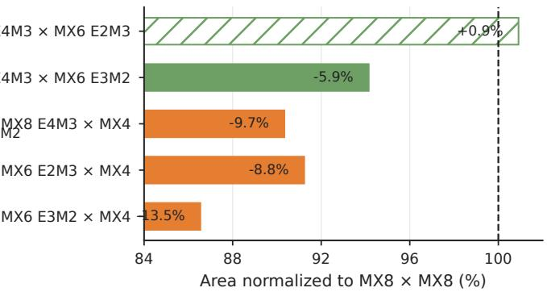

---

**为什么 E2M3 会出现面积反转**

- **E2M3 保留了 4 位 significand 精度**，与 MXFP8 的 **E4M3** 格式完全相同的 significand 位宽。这意味着：
  - **decode 逻辑宽度不变**：E2M3 仅减少 exponent 位（3→2），significand payload 没有变窄；
  - **alignment shifter 宽度不变**：exponent 对齐路径由最大 exponent 范围决定，而 mantissa 对齐由 significand 宽度决定；
  - **乘法器核心宽度不变**：product path 的面积主要受 `p²` 乘法代理（`p` 为解码后的 significand/integer 精度）支配，E2M3 与 E4M3 的 `p` 相同。
- **节省的仅是 exponent 比较与解码的少量逻辑**，不足以抵消共享路径中保留的全宽度 significand 成本，最终比对称 MXFP8×MXFP8 反而大 **0.91%**。
- **E3M2 则相反**：它削减的是 **significand 精度**（保留 3 位），直接收窄乘法器与 mantissa 对齐树，因此即使 exponent 位更多，也能实现 **5.85%** 的净节省。
- 这正是论文中成本模型 $C_{\mathrm{unit}}(f,K) = C_{\mathrm{dec}}(f) + C_{\mathrm{scale}}(f) + KC_{\mathrm{mul}}(f) + C_{\mathrm{red}}(K,w_f) + C_{\mathrm{acc}}(w_f) + C_{\mathrm{mode}}$ 所刻画的：**bit 在 exponent 域与 significand 域的分布位置，比总位数更能决定成本**。

---

**实现原理与单元架构**

- **基础单元结构**：每个被综合的单元是 **16-lane 块缩放点积单元**，包含：
  - 独立的 A/B **decoder**（value table 或 integer 解码）；
  - 独立的 **E8M0 shared-scale** 指数处理路径（asymmetric pair 中 A/B 各持独立 scale metadata）；
  - **mantissa 乘法阵列**（per-lane product path）；
  - **fixed-point 累加/归约树**（reduction tree）与 **32-bit signed 输出**；
  - **可复用 mode 控制/decoder 开销** $C_{\mathrm{mode}}$（多模式共享最大宽度算术核，仅切换 decoder）。
- **流水线配置**：standalone 与 reusable 单元均采用**两 cycle 流水线，initiation interval 为 1**，目标频率 **1410 MHz**，工艺为 **TSMC 22 nm pre-layout** 综合流程。
- **pair 扩展方式**：TensorExplorer 在单格式筛选存活后，才允许组合为有序 pair $(f_A, G_A, r_A; f_B, G_B, r_B; K)$——decode 与 scale 路径独立，但乘法与归约按**联合宽度**统一配置，符合 NVIDIA block-scaled MMA 中 FP8/FP6/FP4 独立 operand type 的现实接口。
- **验证手段**：
  - Chisel 测试将 RTL 与独立 fixed-point 参考模型逐 lane 比对；
  - 代表性 **K1 版本**的四个 asymmetric pair 通过 **SymbiYosys depth-6 有界等价性证明**（覆盖符号 operand、scale 与选择信号），但证明不覆盖综合后的 K16 阵列；
  - 九个 K16 pair 的 setup report 全部标记 **MET**。

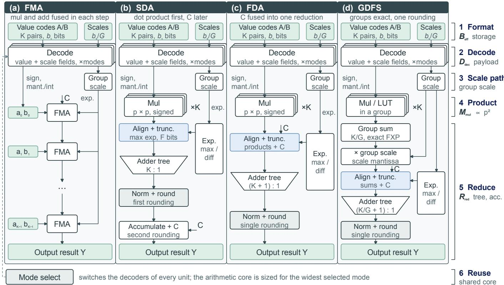 *Fig. 2. Hardware-mode organizations and their mapping to the analytical cost terms. (a) FMA chains � fused steps and rounds at each step. (b) SDA reduces � products before adding �, creating two rounding points. (c) FDA aligns � with the � products and uses one $( K + 1 ) { : } 1$ reduction and one rounding. (d) GDFS, the grouped organization corresponding to the retained GFDA evidence, forms exact fixed-point group sums, applies the group scale, and performs a final aligned reduction. The right-hand brackets map efective storage $B _ { \mathrm { e f f } } .$ , decode payload $D _ { \mathrm { d e c } } .$ product proxy $M _ { \mathrm { m u l } }$ , reduction/accumulation $R _ { \mathrm { r e d } }$ , and shared-mode reuse. This is a cost/semantics schematic rather than a literal shared RTL implementation.*

---

**参数设置与测量条件**

- **综合规模矩阵**：11 个 signed-finite P3109 格式 × $K \in \{16, 32, 64, 128\}$ = **44 个唯一 datapath**；15 个 K16 单元；6 个可复用 K128 mode set。
- **面积随 K 的增长规律**：面积增长**略快于线性 K**，因为 reduction 与 shifting 逻辑随 $K$ 扩张（$C_{\mathrm{red}}(K, w_f)$ 项）。
- **关键单点数据**：
  - **b6p5sf**：K16 = **4188 μm²**，K128 = **38975 μm²**；
  - **b8p6sf**：K16 = **5277 μm²**，K128 = **48098 μm²**；
  - 6-bit 相对 8-bit：K16 省 **20.6%**，K128 省 **19.0%**；
  - 实用 8-mode K128 单元仅比最宽 constituent 大 **15.1%**（11-mode set 为 18.6%），对照 8 个独立单元重复则需 83.3% 额外面积（松上界）。
- **power 定位**：**vectorless power 仅作诊断字段**，面积是唯一进入 Pareto selector 的硬件变量——因为没有 SAIF/VCD 或 post-layout activity 数据，real-operand toggle ratio 只用于方向性异常检查。
- **面积代理模型校准**：以 $K$、$K\log K$、precision²、exponent width 为特征的线性模型，在 leave-one-format-out 下达到 **8.89% 平均 / 19.73% p90 / 25.77% 最大**绝对百分比误差；最大 constituent 复用模型达到 **5.53% 平均 / 13.81% 最大**误差。

---

**输入输出关系与在整体流程中的位置**

- **输入**：两路编码 operand（各自携带独立 E8M0 scale）+ 模式选择信号。
- **输出**：32-bit signed 点积结果（多个软件 PTQ 点可共享同一 datapath mode，仅在 grouping/packing 层面不同）。
- **级联位置**：该 RTL 层处于 TensorExplorer 证据漏斗的**最深层**——只有通过 QSNR 筛选、被 admission rule（≥25% payload 节省、16-value packet 对齐）接纳、并被 full PPL + 完整 task 标注为 quality-pass 或 lossy-frontier 的区域，才进入 22 nm 综合校准。
- **方向约束是单向的**：**低面积不能拯救 workload 失败**（最低面积的 b4p1sf control 在 workload 筛选中出局，且是唯一 setup 不到 MET 的单元，slack 为 0.00 ns）；但硬件证据可以推翻“窄即便宜”的先验——b4p2sf 与 b4p3sf 有效存储相同，前者质量更差且面积更大，被直接 dominate。
- **对 ISA 决策的直接含义**：每个被保留的 operand pair 都必须**实测**而非按位宽推算；MXFP8×MXFP4 是有实测支撑的成本台阶（−9.66%），而 6-bit 混合路径是否省钱取决于 **exponent/significand 的分布**，不是 value bit 总数。

---

**边界与免责声明**

- 所有面积为 **pre-layout candidate-unit anchor**：不包含 operand delivery、scheduling、clock tree 与物理收敛，端到端 GPU speedup 不可由此预测。
- 软件仿真路径（量化两个 operand 后走原生 PyTorch Linear）与 RTL 是**分离的证据层**——端到端精度归因于软件路径，RTL 仅提供成本锚点，二者共享的只是显式的 operand/scale 契约。
- MXFP6/8 在此是**格式形状代理**（E3M2/E2M3/E4M3 值路径 + E8M0 group scale），非 OCP 一致性声明。
- 成本代理模型的校准范围限于**同一 Chisel generator 与同一工艺节点**，不构成跨 vendor family 或 post-layout 成本的验证。

---

## 4. 实验方法与实验结果

---

**一、实验设置分析**

TensorExplorer 的实验设计核心是一个 **“廉价筛选 → 完整工作负载 → RTL 级 PPA 证据”的非对称证据漏斗**，每一层有不同的证据角色，避免了低质量候选浪费昂贵的评估资源。

**1. 候选空间与准入规则（Admission Rules）**

- 候选由元组 **x = (f, G, r, K)** 定义：f 为数值/缩放格式，G 为 shared-scale group size，r 为 rounding 规则，K 为 dot-product 维度（硬件锚定宽度）。
- 筛选范围覆盖 **504 个 interim P3109 格式**（Binary-k-p，k = 3–16 值位）+ OCP（MXFP4/6/8、MXINT4/8）+ NVFP4-like + AMD/Huawei/NVIDIA 公开别名 proxy。
- **宽度准入先验固定于排序之前**（防止事后挑选）：
  - 仅准入 GPU 生态友好的 4/6/8-bit 宽度；
  - 压缩格式必须节省 **≥25% 原始 value payload**；
  - 16 值 payload 必须装入一个 16-byte staging packet（4-bit→8B，6-bit→12B，8-bit→16B）；
  - 8-bit 作为 byte-lane 参考基准。
- **质量预算为单侧工程容差**：ΔPPL ≤ 0.1（约为平均未量化 PPL 10.7759 的 0.93%），ΔAcc ≥ −0.15 pp（约为任务基线 78.4647% 的 0.19%）。
- 三个可复现标签：**quality-pass**（满足全部均值预算）、**lossy width-frontier**（质量失败但作为该位宽非支配代表保留）、**control**（仅用于暴露失败/被排除层）。均值通过 ≠ 区间确认（95% model-cluster interval 必须同样落入预算，两者不合并）。

**2. 模型与评测协议**

- **LLMCompass 模型集**：LLaMA、Llama-2、Llama-3、Mistral、Qwen3、Qwen2.5 家族，最大 13B 参数，共 8 个模型；量化 Linear 层数 197–281 层。
- **PPL**：完整 WikiText-2 test split，context/stride = 256/256，非重叠窗口，首 token 仅作上下文；已发布修正表修复了历史 scored_tokens 字段的 N−1 记录问题（PPL 数值本身未变，因 evaluator 已用运行时 denominator）。
- **任务**：完整 zero-shot PIQA + ARC-Easy acc_norm 作为两任务 proxy（无采样）；ARC-Challenge、HellaSwag、WinoGrande 完整运行用于 finalist 复核。
- **不确定性估计**：resampling 整模型 delta，保持每模型配对基线比较。
- 主协议为 **nearest-rounding weight-only PTQ**（RTN），是校准/mixed-precision 搜索之前的受控扰动。

**3. 三层证据流水线与硬件评测环境**

- **Layer 1（数值签名）**：QSNR 快速通道，504 P3109 格式 × 8 模型 × 6 group size = **24,192 行**；确定性 layer-wise 采样（每 Linear 层 ≤16 组，seed 3109）。
- **Layer 2（工作负载）**：全 PPL + 完整任务，仅对 promoted 点执行。
- **Layer 3（硬件成本）**：参数化 **Chisel** dot-product 单元，**TSMC 22 nm pre-layout 综合流程，目标 1410 MHz**；面积 A 为 Pareto selector 的硬件变量，vectorless power 仅为诊断。
- 验证配套：单 lane SymbiYosys 有界等价性证明（decode/scale shift/符号处理），Chisel 多 lane 累加测试对照独立定点参考；71/72 个实用单元 setup MET（仅低 QSNR 的 b4p1sf K128 control 失败于 0.00 ns slack）。

**4. 执行路径审计（KDA Case）环境**

- 隔离实验：128×128 synthetic KDA-shaped affine chain，explicit Triton tl.dot 精度（tf32/tf32x3/ieee）+ FP64 参考，3 seeds、深度 1–64、100-launch 计时。
- Pinned FLA commit 465b4bc：真实单 GPU KDA CP kernel，4K–256K 序列，RTX 4090、PyTorch 2.7.1+cu126、Triton 3.3.1、BF16 张量、d_k = d_v = 64。
- 明确边界声明：D=128 超出该 GPU 每 block shared-memory 限制，不是 checkpoint trace，不推断多 GPU 或模型级结论。

 *Fig. 1. Overview of the TensorExplorer pre-ISA screening flow. (a) Candidates are defined by numerical format, scale group, rounding policy, dot-product length, and selected operand pairing, and are characterized along quality and cost axes. (b) Cheap QSNR and static screens, promotion of regular 4/6/8-bit payloads, full workloads, and 22 nm RTL evidence progressively narrow the design space before Pareto selection. (c) The output is a measured mode record and shortlist containing a lossy range-aware 4-bit point, a cost-advantaged 6-bit middle, and near-baseline 8-bit references. Task callouts are mean accurac deltas in percentage points; the 6-bit callout is K16 area relative to b8p6sf. The shortlist is not a universal format menu, and ISA encoding and hardware integration remain downstream.*

---

**二、结果数据分析**

**1. 核心短名单（Shortlist）——质量/存储/面积三角**

| Candidate | Status | Eff. bits | PPL Δ | Task Δ | 95% CI; 通过率 | K | Area (μm²) | 解读 |
|---|---|---|---|---|---|---|---|---|
| nvfp4_g8 | lossy 4-bit | 5.000 | 0.511 | −0.505 pp | [−0.697, −0.307]; 2/8 | 16 | 4798 | 最强已测 4-bit 点，双预算均失败 |
| mxint8_g16 | pass, 8-bit | 8.500 | −0.005 | 0.032 pp | [−0.041, 0.098]; 7/8 | 16 | 6134 | 区间确认的 OCP 质量参考 |
| p3109_b6p5sf_g8 | pass, 6-bit | 7.000 | 0.019 | −0.056 pp | [−0.218, 0.113]; 5/8 | 16 | 4188 | 最低实用面积，但任务区间跨界 |
| p3109_b8p6sf_g64 | pass, 8-bit | 8.125 | −0.001 | 0.020 pp | [−0.029, 0.066]; 8/8 | 16 | 5277 | 区间确认的 P3109 参考点 |
| P3109 八模式集 | mode set | — | — | — | — | 128 | 55369 | 八个 decoder 仅比最宽路径贵 15.1% |

关键洞见：**面积与质量选出不同赢家**——最低面积（4-bit 整数路径）无法挽救工作负载失败；**b6p5sf 相对 b8p6sf 在 K16 省 20.6%、K128 省 19.0% 面积**，且在 one-dot-per-cycle 归一化下 16-lane b6p5sf 达 **10.8 TOPS/mm²**。

**2. RQ1：工作负载筛选后的精度区域**

- OCP/NV/INT 扫描中，同在 **5.0 effective bits/weight** 下的 4-bit 对比构成关键反例：

| 4-bit 候选 (g8) | Task Δ (PIQA/ARC-Easy) | 结论 |
|---|---|---|
| **nvfp4_g8** (E4M3-scaled FP4) | −0.505 pp | 最强 4-bit 点，8 模型均值全为负但仍最优 |
| **mxint4_g8** | −1.361 pp | 比 NVFP4 差 0.856 pp |
| **mxfp4_g8** | −1.804 pp | OCP 系最弱 4-bit |

- 证明 **range/scale 语义 > decoder 面积**——工具未简单偏好最廉价 datapath。
- P3109 区域阶梯：4-bit 全部为 stress control（无一点进入近基线 PPL band）；6-bit 8/10 点进入（以 **b6p5sf** 领先）；8-bit 全部 20 点进入。
- **Vendor replay**：38 个 AMD/Huawei/NVIDIA 别名 proxy 中 9 个达 full-flow 均值预算；AMD/OCP **E4M3 g16** 最强（ΔPPL 0.055，ΔAcc −0.022 pp）；E2M3 出现指标分裂（g128 最低 PPL delta，g32 最好任务结果）。
- **三任务强检验**（ARC-C/HellaSwag/WinoGrande）不推翻区域结论：nvfp4_g8 平均再损 0.403 pp；mxint8_g16、b8p6sf_g64、b8p7sf_g16 聚集在基线 ±0.013 pp 内，但近基线簇内无统计置信排序（Pearson r = −0.945 而 Spearman ρ = −0.300，两任务 proxy 对强任务 r = 0.905 而 ρ = 0.100——**线性相关强、秩排序失效**）。

**3. RQ2：配方边界检验**

- **训练侧检查**（0.48M 参数 byte-level causal/masked LM，512 步 STE + 5.97M BERT SST-2 全集训练）：NVFP4-like 仍比 MXFP4 安全，6/8-bit 近基线；19 个 SST-2 候选精度变化 −0.803~+1.491 pp，基线标准误 1.339 pp——仅解决一致性，不决出赢家。
- **W/A8 replay**（Mistral-7B + Qwen3-8B，MXINT8 g64 activation-only）：均值 PPL +0.012；叠加 b6p5sf_g8 权重后总 PPL 反而 −0.024，b8p6sf_g64 −0.0004，NVFP4 +0.714——**权重量化的 4/6/8-bit 区域在激活也低精度时未立即反转**。
- **非对称 MXFP8 激活 replay**：MXFP4/MXFP6-E2M3/MXFP8 权重分别抬升 PPL 1.585/0.168/0.136——6-bit 保持接近 8-bit，但混合路径均破 0.1 预算；未校准 FP4 仍然 lossy。

**4. RQ3：Group size 与 QSNR 为何不是简单排序器**

- **Group size 非单调性**：当 g8 子组继承 g16 父 scale 时，7 格式 × 1,344 采样张量**精确复现**；独立 g8 量化改变 **23.2–45.9% 的 scale codes**，PPL 差值**跨格式变号**——小 group 提供更多选择而非质量保证。

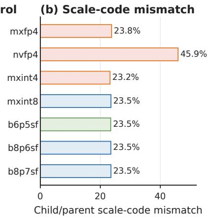

- **QSNR 的能力边界**：40 个 promoted P3109 候选上 QSNR vs 均值 PPL delta 得 Spearman ρ = −0.968 / Pearson r = −0.819；但在 6-bit 区域内部细排序弱化至 ρ = −0.527——**QSNR 分离区域，不排序近平局**。
- **排序策略依赖预算目标**：24 suites 时两者均找到 24 个接受点，但 width priority 覆盖 4 个 frontier 点中的 3 个而 QSNR 只覆盖 2 个；28 suites 时 QSNR 找全 28 个均值预算点和全部 4 个 frontier 点，width priority 仅 27 和 3——QSNR 的增量优势折合**一个候选 suite / 8 次模型级 PPL run**。

**5. 交叉案例：KDA 执行路径精度审计**

- 隔离 synthetic chain（深度 1→64，median 相对状态误差 vs FP64）：

| 执行路径 | Depth 1 | Depth 64 | Depth 64 隔离延迟（相对成本） |
|---|---|---|---|
| **TF32** | 6.59×10⁻⁴ | 3.76×10⁻² | 0.189 ms (1.00×) |
| **TF32x3** | 4.80×10⁻⁷ | 2.66×10⁻⁵ | 0.356 ms (1.88×) |
| **IEEE** | 2.01×10⁻⁷ | 1.63×10⁻⁶ | 3.891 ms (20.54×) |

- 真实 pinned FLA kernel：64K/256K（深度 8/32）CP vs no-CP 误差 3.16×10⁻³/3.12×10⁻³，但 TF32/TF32x3/IEEE 的 CP 输出在该可行 stress 下 **bit-identical**——CP/no-CP 差异不能归因于 TF32；256K 下 TF32x3/IEEE 算子延迟为 TF32 的 1.071×/1.372×。
- 结论边界：建立的是**深度 stress 而非普适增长律**，核心规则是“名义 datatype 不足以定义数值契约，affine chain 深度需要审计”。

**6. RQ4：硬件成本证据**

- **K 扫描**：11 个 signed-finite P3109 格式在 K ∈ {16,32,64,128} 产生 44 个独立 datapath，映射为 264 个 format/group/K 行；面积随 K 增长略超线性（reduction/shifter 逻辑扩张）。
- **不对称操作数对（K16, 1410 MHz，9 对全部 MET）**：

| 操作数对 | 相对 MXFP8×MXFP8 面积 |
|---|---|
| **MXFP8×MXFP4** | **−9.66%** |
| **MXFP6 E3M2×MXFP4** | **−13.46%** |
| **MXFP6 E2M3×MXFP8** | **+0.91%**（E2M3 保留 4 位 significand，与 E4M3 相同，抵消 2 位值位节省） |

- **编码宽度不决定面积**：两对 MXFP8×MXFP6 均 14.5 amortized bits/lane，但 E3M2 省 5.85% 而 E2M3 反而贵 0.91%——decode/alignment/product width 抹平名义值位差。

- **中间精度阈值**：真实 Qwen2.5-7B 操作数 + synthetic heavy-tail K128 探针一致给出规则——4/6-bit 在 **10 个 mantissa fractional bits** 越 50 dB，实用 8-bit finalist 需 **12 bits**；共享 P3109 路径的观测 stress 目标为 12-bit。
- **模式复用**：实用 8 模式 K128 单元仅比最宽成分贵 **15.1%**（全 11 格式集 18.6%）；对比八单元完全复制省 83.3%（loose upper bound）。
- **成本模型校准**：留一格式 holdout（K、K log K、precision²、指数宽度的线性面积模型）44 个预测达 8.89% 均值 / 19.73% p90 / 25.77% 最大 APE（b6p5sf 误差 <6.94%）；最大成分复用模型 24 点 holdout 达 5.53% 均值 / 13.81% 最大——**单生成器/单工艺内的早期锚点，非跨家族验证**。

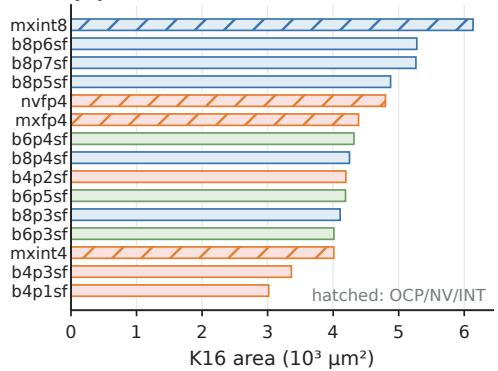
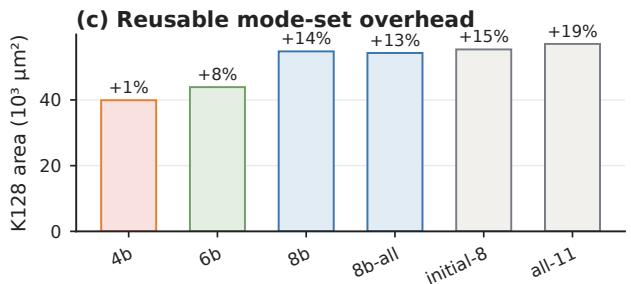
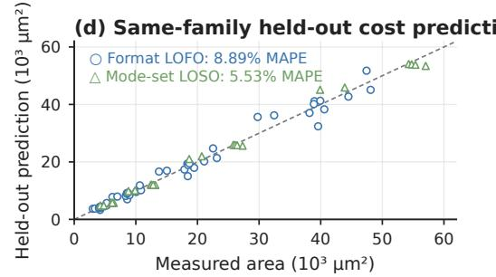

---

**三、消融实验分析**

**1. Clipping 压力测试（改变预算通过而非仅排名）**

| 候选 (Mistral-7B + Qwen3-8B 均值 ΔPPL) | max-abs scale | 固定 0.9×-max clipping |
|---|---|---|
| NVFP4-like | 0.710 | 1.192 |
| **b6p5sf** | **−0.048** | **0.271** |
| **b8p6sf** | **−0.012** | **0.211** |

- 6-bit 与 8-bit 均从预算内跌出，**且两者排名互换**——max-abs 短名单必须在目标配方下重新验证；clipping 是软件 policy 而非硬件语义。

**2. Stochastic rounding 消融（seed-0, 单 seed）**

- 全部 18 个 seed-0 stochastic-value PTQ 点平均恶化均值 PPL **1.356**、PIQA/ARC-Easy delta 平均 **−1.233 pp**（相对 nearest rounding）。
- 无一 stochastic 点晋升 Pareto shortlist——nearest rounding 为采纳路径，stochastic 仅作单 seed 消融（论文诚实声明非多 seed 统计主张）。

**3. Group size 消融（受控 replay，见 RQ3）**

- 继承父 scale → 精确等价（1,344/1,344 张量）；独立缩放 → 23.2–45.9% scale code 变化 + PPL 符号翻转——证明 **group size 属于存储/packing 契约，不构成新算术 datapath**，且非单调排序器。

**4. 排序策略消融（QSNR vs Width priority budget sweep）**

- 回放两个确定性排序在固定 40 候选宇宙内：宽优先在预算 24 时 frontier 覆盖更优，QSNR 在预算 28 完成 accepted region——**最优筛选器依赖恢复目标**；40→28 的削减量化了避免穷举重放的价值。
- Leave-one-family-out 敏感性：QSNR accepted recall 范围 **90.9%–100%**（Qwen2.5 家族退出时 width priority 多保留一个接受点）——敏感性证据而非前瞻验证。

**5. Odd-width holdout（审计生态先验的代价）**

- 16 个分层 control 覆盖被排除宽度、5 个 QSNR 分位与高成本控制；Mistral 近基线 tie frontier 含 3 点，admitted set 在 0.01-PPL tie epsilon 下漏掉一个 odd-width g128 control（**recall 2/3**）；Qwen3 与双模型均值零遗漏——对更广格式族覆盖的**实测局限**，但不足以把每个可行宽度都变成硬件模式。

**6. 算子感知低/高精度分配（operator-aware pilot）**

- 三模型（Qwen3-8B / Llama-3-8B / Mistral-7B）五种 policy（baseline / all-low / all-high / 单类降级 / 单类救援），57 行全 WikiText-2：
  - All-low (nvfp4_g8)：PPL +1.174 / +0.649 / +0.346（模型依赖）；
  - All-high (mxint8_g16)：−0.024 / −0.014 / −0.005（近基线）；
  - **down_proj 为最一致救援目标**（Llama-3/Mistral 的 top rescue，平均恢复 all-low PPL 退化的 **38.3%**）；**lm_head 尽管只有一层 Linear 也持续敏感**。
- 软硬件协同设计结论：无需每算子独立 datapath，但精度菜单应允许编译器/运行时向敏感复合算子区域选择性分配高精度。

**7. Tie-aware Pareto 回放**

- 将 <0.01 PPL 与 <0.15 pp 差异折叠为 tie：storage/PPL frontier 从 **12 → 9 点**，area/task frontier 从 **6 → 3 点**——区域结论不变（4-bit 压力区 / 6-bit 低面积中段 / 8-bit 近平局由存储与复用决定），但展示近基线区分度不足。

**8. 模型依赖性检查（b6p5sf_g8）**

- 剔除六个命名模型家族之一，任务均值在 −0.093 至 −0.017 pp 间移动；95% 任务区间 [−0.218, 0.113] 跨越 −0.15 预算且仅 5/8 模型个体通过——论文明确承认**八个相关模型不构成 population-equivalence 主张**，这是 6-bit 区域保持“unresolved”标签的方法学根源。

---

**四、总体评价**

- **证据链完整性**：每个结论都有明确的证据层级（QSNR 提议 → 工作负载定标签 → 综合定成本），且**负结果与边界声明诚实**（KDA 不归因于 TF32、单 seed stochastic 不做统计主张、holdout recall 2/3、成本模型不跨家族验证）。
- **两个最有力的反直觉结论**：(1) 同为 5.0 effective bits 时 range/scale 语义压倒算术面积（NVFP4 > MXINT4 > MXFP4）；(2) 编码宽度不排序面积（E2M3 vs E3M2 反转），迫使每个保留操作数对必须实测。
- **主要局限**：pre-layout 22 nm 单元面积 proxy（无 operand delivery/scheduling/物理收敛）、固定 RTN/PTQ 配方下结论对 clipping 敏感、6-bit 核心推荐点的任务区间未闭合、8 模型间的家族相关性削弱统计外推——这些均被作者显式圈定为后续 ISA 集成阶段的工作。

---

