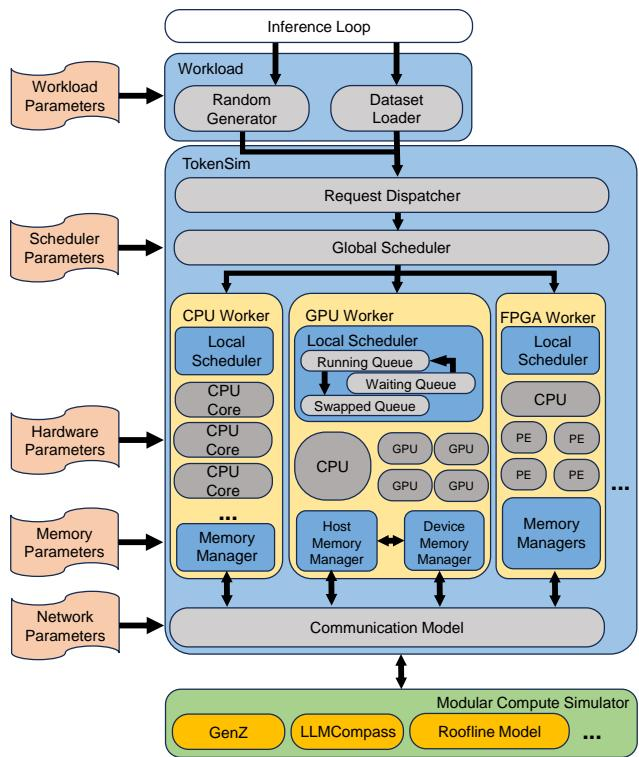
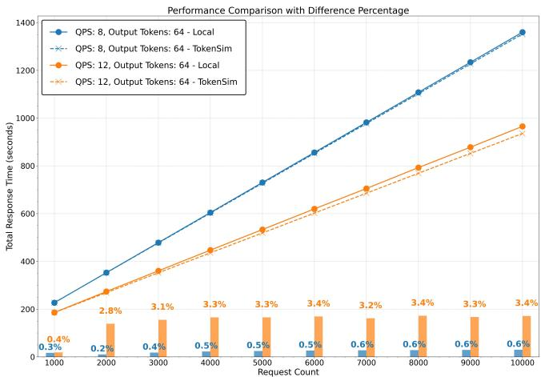

# TokenSim: Enabling Hardware and Software Exploration for Large Language Model Inference Systems 通俗讲解

### 0. 整体创新点通俗解读

**痛点直击**

你如果做过 LLM serving 相关的研究，一定碰到过这种尴尬：你想试一个新的调度策略，或者想评估某个新型硬件（比如 PIM 芯片）跑 LLM 推理划不划算，只有两条路——

- **真机实验**：租一排 A100 跑几天，烧钱、烧时间，而且硬件组合根本凑不齐（你上哪找 8 张 GDDR6-Aim 去做对比？）
- **用现有模拟器**：GenZ、LLMCompass 这类工具只接受**单条请求或单个 batch**，吐给你两个数——latency 和 memory usage，就完事了

问题是，真实的 LLM serving 根本不是这么玩的。真实系统里有几百上千个并发请求在排队、进 batch、被 preemption、被驱逐，用户在乎的是 **tail latency（P99）** 和延迟的**分布**，而不是单条请求跑多快。现有模拟器把这些全删了，等于给了你一辆车在空旷测试场跑一圈的成绩，却让你据此预测早高峰的路况——完全失真。vLLM 那些调度和内存优化（continuous batching、PagedAttention）带来的数量级收益，在单请求模拟里根本体现不出来。

---

**通俗比方**

把 LLM 推理系统想象成一家**动态营业的火锅店**：

- 老式模拟器（GenZ/LLMCompass）相当于：只模拟“一桌客人从点菜到吃完”的流程，然后告诉你“每桌耗时 40 分钟”。它假设店里永远只有这一桌。
- 但真实情况是：客人**源源不断进门**（dynamic request arrival），有的只点个锅底（短 prompt），有的点满汉全席（长 prompt），桌位（GPU memory）是有限的，你得决定让谁先进、谁等着、谁的 KV cache 先腾出去。**店的真实营业能力，取决于这套调度逻辑，而不是单桌的吃饭速度。**
- TokenSim 做的事，就是把**整个店在营业高峰期的全流程**模拟出来：客流按真实数据集到达、服务员（scheduler）按你定义的规则排桌、后厨内存（memory manager）按块/按 token 精细记账，最后告诉你 P50/P99 排队时间、翻台率、内存占用随时间的曲线。

---

**关键一招**

作者最巧妙的动作是**换掉抽象层级**，而不是去造一个更快的计算模拟器：

- **不自己算算子**：TokenSim 把逐层逐算子的耗时计算“外包”给已有的 compute simulator（如 GenZ），自己只做**系统层的编排**。这就像它不造引擎，只造整车和驾驶模拟舱——所以硬件配置可以随便换。
- **把调度做成“钩子”（breakpoint）**：在模型配置文件里允许用户在任意算子后面插入 breakpoint，默认每个 token 生成后触发一次调度。这一招直接把 disaggregated serving（prefill 和 decode 分离到不同 GPU）这种复杂架构，变成了**两行代码的配置**——breakpoint 处把带着 KV cache 的请求踢回 global scheduler，再派发给 decode 设备。
- **两级调度 + 实时内存账本**：global scheduler 管“请求去哪个 worker”，local scheduler 管“这一轮 batch 里谁留谁走”；memory manager 按 block/token/byte 粒度实时记录占用，配合 SimPy 的离散事件驱动，preemption、KV cache 迁移、memory pool 这些动态行为全部可模拟。

 *Fig. 1: TokenSim system overview.*

验证结果是硬通货：在 A100 + vLLM + ShareGPT 数据集上，吞吐误差几何平均只有 **0.109%**，P99 latency 误差 **0.337%**，CDF 曲线几乎和真实系统重合——

| 指标 | 误差 |
|---|---|
| Throughput | 0.109% |
| P50 latency | 0.6% |
| P99 latency | 0.254% |
| Max latency | 0.337% |

相比依赖随机森林回归估耗时的 **Vidur**（每次还要 400 秒 pre-training）和慢到不如实跑的 **LLMServingSim**，TokenSim 用解析式的 transformer 模型做到了既准又轻，甚至能在笔记本上无 GPU 运行。

---

**一句话总结**

这篇论文的核心洞察是：**LLM serving 的性能瓶颈已经从“算子多快”转移到“系统调度多聪明”**，但现有模拟器全在死磕前者。TokenSim 把模拟的重心从 kernel 层拉回到 scheduling/memory management 层，用模块化 + 真实数据集驱动 + 离散事件仿真，第一次让“不用买八张卡就能回答‘该买几张卡、怎么配、调什么参数’”成为可能。它不是造了更好的显微镜，而是造了第一台能看清**整条流水线动态行为**的望远镜。

### 1. 动态事件驱动的 LLM 负载仿真（真实数据集采样 + QoS 指标输出）

**痛点直击**

- 之前的仿真器（GenZ、LLMCompass 这类）本质上是个**“单次压力测试机”**：你喂给它一个请求或一个 batch，它吐给你两个数字——latency 和 memory usage，然后结束。
- 这在真实 LLM serving 场景下是**严重失真**的，因为真实系统面对的不是一次请求，而是**几百上千个并发请求在持续地进出系统**：
  - 请求长度不一（有人问一句话，有人贴一篇论文），batch 组成随时在变；
  - KV cache 随时间增长，**内存占用是一条动态曲线**，不是一个静态数字；
  - 用户真正在乎的是 **P99 tail latency**（99 个百分位的延迟）——服务挂不挂，看的从来不是平均值，是长尾。
- 一句话总结痛点：**旧仿真器给的是“实验室体检报告”，而工程师需要的是“24 小时动态心电监护”**。

---

**通俗比方**

- 旧仿真器像**在空旷的高速公路上测一辆车的极限速度**——路上就你一辆车，测出来的数据再准，也回答不了“早高峰堵不堵”。
- TokenSim 干的事，是造一个**微缩城市交通沙盘**：
  - **真实数据集采样** = 不是随机撒车上路，而是按真实通勤数据（ShareGPT 对话记录）生成车流——几点来车、每辆车跑多远（输入/输出 token 长度），都照着真实规律来；
  - **事件驱动（SimPy）** = 沙盘上有个虚拟时钟，每辆车到达、变道、出站都是一个“事件”，时钟只在这些事件发生的瞬间跳转，中间空转的时间直接跳过——所以模拟一天的车流可能几秒就跑完，**不需要真 GPU**，你的笔记本就能跑；
  - **QoS 指标输出** = 你最后拿到的不是“平均车速”，而是完整的延迟分布、每个时刻的内存水位、多少比例的车超时了（SLO 违约率）。

这其实很接近体系结构研究里的**trace-driven simulation**（比如模拟 CPU 用 SPEC trace），只是这里的"trace"被替换成了 LLM 场景的**请求流 + 调度策略 + 内存管理策略**三者联动的动态过程。

---

**关键一招**

- 作者最巧妙的转换在于：**没有去真实跑模型，而是把“执行”替换成了“查表 + 排事件”**：
  - 每个 iteration 在 GPU 上跑多久？TokenSim 不真的算 Transformer，而是调用底层计算模拟器（如 GenZ）**根据 batch 构成快速推算出耗时**，然后在 SimPy 的虚拟时间轴上“预订”这段时间；
  - 与此同时，**内存管理器在并行记账**：以 block/token/byte 粒度追踪 KV cache 的分配和释放，请求一进来占用就涨，请求被抢占或完成就释放——所以内存曲线是**实时长出来的**，不是事后估的；
  - **调度器是可插拔的用户代码**：全局调度器决定请求去哪个 worker，本地调度器决定请求是留下还是“回炉”。用户改几行 Python 就能定义一个新的调度策略，然后拿同一份真实数据集去压力测试。
- 这一招的直接收益，就是论文里那张核心验证图：

- 注意看这张图：**虚线是真实 vLLM 跑出来的延迟 CDF，实线是 TokenSim 仿真出来的**——在不同 QPS 下两条曲线几乎重合（几何平均误差 < 1%）。这说明“查表 + 排事件”这套替换，在统计意义上**忠实复刻了真实系统的动态行为**。
- 更进一步，正因为有了完整的延迟分布，才能定义 **mTPOT SLO**（任意两个 token 之间的间隔不许超过阈值）这种只有动态仿真才测得出的指标——静态仿真器连这个概念都无法表达，因为它们压根看不到 token 之间的时间间隔。

---

**一句话收束**

- 静态仿真回答“**这个算子多快**”；TokenSim 这种动态事件驱动仿真回答“**这套系统在真实流量下，第 99 个用户等多久**”——前者是硬件问题，后者才是 serving 系统的问题。作者的关键一招，就是把“真实执行”降维成了“**事件排队 + 内存记账**”，用不到 1% 的精度代价，换来了整个动态行为空间的可探索性。

### 2. 两级可编程调度器与算子级断点机制

**痛点直击**

之前的 LLM 模拟器（如 GenZ、LLMCompass）本质上都是“一次性快照”式的：给你一个请求或一个 batch，吐出两个数——latency 和 memory usage。这在真实 serving 场景下会“很难受”，难受在三个地方：

- **静态输入 vs 动态世界**：真实系统每秒涌进来几百上千个请求，请求长度千奇百怪，队列在变、batch 在变、显存在变。你模拟单 batch 的结果，对预测 P99 尾延迟、显存水位曲线几乎没用。
- **调度策略写死**：连续批调度、PagedAttention 这些系统优化已经是 vLLM 们的标配，但旧模拟器根本没法表达“这个请求被抢占”“这批请求何时重组”这类**时间维度上的决策**。
- **想模拟 disaggregation（prefill/decode 分离）这种新架构时，卡死了**：因为“prefill 完成后把 KV cache 转给 decode 设备”这个动作发生在**两个计算阶段的中间缝隙里**，传统模拟器只有“算一层”的概念，没有“在缝隙里做决策”的插槽。

一句话：之前的模拟器只有**计算模型**，没有**控制流模型**。

---

**通俗比方**

把这想象成**一家餐厅的管理系统**：

- **全局调度器** = 前厅经理：看着新客人进门（新请求），决定把哪桌客人分给哪个服务员（哪个 worker）。
- **本地调度器（Local Scheduler）** = 每个服务员自己：决定手上这桌客人要不要继续服务，还是“这桌我只负责上完前菜（prefill），后半场交给专门的主菜师傅（decode worker）"。

好，关键问题来了：服务员在什么时机可以做这个决定？

- 旧模拟器的做法是：一桌客人从进门到吃完，**中途根本不许说话**——你必须整场服务完才能汇报。
- TokenSim 的**断点机制**就是给服务流程装了一个**“敬酒暂停铃”**：你可以规定“每上一道菜（每生成一个 token），服务员必须停下来看一眼规则手册（调用一次 scheduler 函数），决定下一步怎么办”。

更妙的是，这个暂停铃**不是只能装在‘每道菜之后’**——你可以把它精确地拧到**任何两个后厨动作（算子）之间**。这就把调度的“时间粒度”从“一整场宴会”细化到了“炒菜的每一锅”。

 *Fig. 1: TokenSim system overview.*

---

**关键一招**

作者没有重新发明一个模拟引擎，而是在**模型描述文件（model config）里插了两个“钩子”**，做了一个三层的逻辑转换：

- **第一层：把调度拆成两级**：
  - **Global Scheduler** 只管宏观路由：手握所有 worker 的硬件类型、负载、显存状态，还允许**有状态**——比如自己记一本小账（过去一个时间窗给某个 worker 派了多少活），实现 load-aware 调度。
  - **Local Scheduler** 只管微观决策：每次迭代间隙，看一眼本 worker 的任务队列和显存，决定哪些请求继续、哪些“上交”回全局池。

- **第二层：把“调度时机”从硬编码变成可编程的 breakpoint**：
  - 默认断点放在**每次 token 生成之后**，所以连续批调度几乎是免费的——天然支持。
  - 用户想在更细的粒度上干预？直接在模型配置文件的任意位置加断点，勾住自定义函数。

- **第三层：这招的杀手级应用——两行代码实现 disaggregation**：
  - 在 prefill worker 的断点处写一行 `submit_global()`：发现请求刚生成第一个 token（`len(r.tokens) == len(r.prompt) + 1`），立刻把它扔回全局池；
  - Global scheduler 那边一行 `dispatch`：把这个请求连同 KV cache 路由给 decode worker。
  - KV cache 的搬运耗时由**通信模型**（SimPy 事件驱动）单独算账，支持传输重叠。

 *(a) Hardware config(a) Hardware config (b) Scheduler config(b) Scheduler config (c) Model config Fig. 2: One example of TokenSim configurations.Fi*

**精髓在于**：作者把“调度”从模拟引擎的**内部黑盒**，挪到了用户**可写的配置文件**里。引擎只负责忠实地在断点处“暂停并询问”，决策逻辑完全外包给用户。这就是为什么 TokenSim 能以极低的代码量，模拟出从连续批调度、PagedAttention 到 disaggregated serving、CachedAttention 这一整条系统优化演进线——因为它模拟的不是某个具体系统，而是**“决策插入点”这个抽象本身**。

### 3. 细粒度分布式内存管理仿真与通信模型

好，这个点其实是TokenSim能比GenZ、LLMCompass这类“老式模拟器”准确一个数量级的**隐藏功臣**。表面上看论文吹的是“支持调度和内存管理”，但真正卡住别人脖子的，是它们根本没法回答一个动态问题——“**此刻，内存里到底发生了什么？**”

---

**痛点直击 (The "Why")**

- 之前的模拟器（GenZ、Roofline那套）本质上是“**单次拍照**”：你给它一个请求或一个batch，它算出latency和memory usage两个数字，然后收工。
- 但真实LLM服务系统是“**连续剧**”：
  - 请求源源不断进来，vLLM的**continuous batching**每生成一个token就可能重组一次batch；
  - **PagedAttention**把GPU显存切成block，逻辑块映射物理块，碎片率、抢占（preemption）随时在变；
  - **PD分离**架构下，KV cache还要在prefill卡和decode卡之间搬来搬去。
- 这些优化全都是“内存状态随时间演化”的玩法。你连PagedAttention的block都模拟不了，就等于告诉别人：“我能模拟vLLM”——**纯吹牛**。模拟出来的prefill/decode设备配比、抢占频率、tail latency，全是错的。

---

**通俗比方**

- 老模拟器像**体检报告**：一年拍一次快照，告诉你血压多少。
- TokenSim像给系统装了**24小时Holter心电监护**：每一块block、每一次KV cache搬家，都实时记账。
- 再打个比方：PagedAttention本身就是抄操作系统**虚拟内存页表**的思路。TokenSim干的事，就是连这层“页表仿真”都原样造了一遍——别人模拟的是“这台机器算得多快”，TokenSim模拟的是“**这台机器的操作系统有多能折腾内存**”。

---

**关键一招 (The "How")**

作者没有去模拟硬件电路，而是做了两件很“软件工程”的聪明事：

- **第一招：把Memory Manager做成“账本”，且粒度可调**
  - 为CPU、GPU、FPGA每种worker类型各挂一个**memory manager**，记账粒度由用户选：**block级 / token级 / byte级**；
  - 为什么block级是关键？因为PagedAttention的抢占、换入换出、碎片，全发生在block这个粒度上。你在block粒度上对账，才能算出“何时显存不够→何时触发preemption→哪个倒霉请求被踢出去重算”这条因果链——这正是vLLM真实行为里**tail latency**的主要来源；
  - 这也是为什么论文里敢说误差<1%，而用随机森林回归估runtime的Vidur会有额外误差：粗粒度近似丢掉了内存这层动态。

- **第二招：把“数据搬运”抽象成一个可组合的通信模型**
  - 分布式场景下，各worker的内存不是孤岛，而是连成一个大**memory pool**；
  - TokenSim单独做了一个communication组件：输入三个参数——**缓存位置（host/device）+ 数据大小 + 带宽**——输出**传输耗时**；
  - 巧妙之处在于它借用了SimPy的**事件驱动**特性：
    - 默认是“接收方干完上一单再发下一单”（串行）；
    - 但你可以调buffer大小，模拟**预取/重叠传输**——比如KV cache在低带宽存储和高带宽GPU之间流水线搬运；
    - 这样，PD分离架构里prefill→decode的KV cache传输、CachedAttention式的多轮对话缓存复用，全都变成了“几行配置”就能搭出来的实验。

- **一句话总结逻辑转换**：别人把内存当**常数**（一张静态占用表），作者把内存当**一等公民的动态状态机**（账本+物流系统），调度器每做一次决策，账本和物流都会如实反馈后果。

 *Fig. 1: TokenSim system overview.*

---

**这套设计直接换来的能力**（论文第四、五节的几个findings，全是靠它才跑出来的）：

| 实验结论 | 依赖的机制 |
|---|---|
| Finding 2：限制新请求、给老请求留显存，反而降低tail latency | **block级内存记账** → 精确模拟preemption |
| Finding 4：预算紧张时PIM芯片（GDDR6-Aim）可替代A100做decode | **多硬件类型memory manager** + 通信模型 |
| Finding 5：prefill卡显存砍半，吞吐几乎不变 | **实时内存footprint追踪** |
| Finding 6：多轮对话memory cache对64 token输出最有效 | **内存池 + 可配置传输模型**（800ns/block） |

给你一个判断标准：以后看任何LLM serving模拟器，先问它一句——**“你能模拟PagedAttention的抢占吗？能模拟KV cache跨设备搬运吗？”**答不上来的，测出来的吞吐数字对真实系统基本没有参考价值。TokenSim这篇论文的价值，就是把这个门槛立起来了。

### 4. 高精度 Transformer 细粒度计算建模（含首个 PD 分离仿真验证）

**痛点直击 (The "Why")**

你要研究 LLM 推理系统的调度策略、PD 分离架构，总不能每试一个想法就烧几百块 GPU 时费去跑真实实验。所以你需要**仿真器**。但现有的仿真器有三个让人“很难受”的地方：

- **只看静态快照，不看动态过程**。像 GenZ、LLMCompass 这类工具，输入只能是单条请求或单个 batch，输出只有两个孤零零的数字：latency 和 memory usage。而真实 serving 系统每秒面对几百上千条并发请求，用户关心的是 **P99 尾部延迟**、是请求进进出出时内存的动态波动——这些静态快照一个都给不了。
- **精度靠“猜”，不靠“算”**。Vidur 这类新框架虽然支持了 continuous batching，但它用 **随机森林回归模型**去估算 kernel 运行时间。机器学习模型的本质是插值——遇到训练集没覆盖的配置（比如你改了内存粒度、换了硬件参数），误差立刻失控。更麻烦的是，它每次仿真前还要花约 **400 秒做 pre-training**，你调参调到手软，它预训练跑到手软。
- **根本没法仿真 PD 分离**。Prefill 是 compute-bound、Decode 是 memory-bound，业界已经普遍用 **Disaggregated Serving** 把两者拆到不同 GPU 上。但没有任何一个仿真器能模拟“Prefill 算完、KV-Cache 通过总线传给 Decode 设备”这条完整链路。这意味着你研究 PD 分离的调度策略时，**仿真这条路直接被堵死**，只能上真机烧钱。

---

**通俗比方 (The Analogy)**

你可以把仿真器分成三档，就像做菜的三种方式：

- **Roofline / GenZ**：像只看菜谱估算——“这菜大概 20 分钟”。至于火候变化、锅的容量，一概不知。
- **Vidur**：像请了个学徒，看过你做几百次菜，然后**凭经验猜**你下一步要放多少盐。日常菜还行，你一换新食材，它就开始瞎猜。
- **TokenSim**：像直接把整条流水线**按工序拆解复刻**——洗菜、切菜、颠勺每一步的耗时都按物理规律算出来。菜谱换了、锅换了，照样算得准。

而“细粒度”的关键在于：它不是把一个 Transformer layer 当成一个黑盒估时长，而是拆到 **block 级内存操作、operator 级 hook**。这就像模拟交通不是按“整条路平均速度”，而是模拟到**每一辆车过每一个红绿灯**——只有这样，你才能回答“如果把 prefill 那条路的车道砍一半会怎样”这种精细问题。

---

**关键一招**

作者的核心操作可以拆成两步：

- **用“物理建模”替换“黑盒回归”**：
  - Vidur 的路子是：跑实验 → 训回归模型 → 用模型猜时间。
  - TokenSim 的路子：基于 SimPy 的**离散事件驱动架构**，把每个 worker、每次内存读写都建模成独立事件，迭代耗时由底层的 compute simulator（如 GenZ）按算力/带宽**逐层推算**出来。
  - 关键细节在于**内存仿真做到 block 粒度**（对应 PagedAttention 的分块管理），避免了 MLP 环节的粗粒度近似——这就是误差压到 1% 以下的直接原因：

| 指标 | 几何平均误差 |
|---|---|
| Throughput | **0.109%** |
| P50 Latency | **0.6%** |
| P99 Latency | **0.254%** |
| Max Latency | **0.337%** |

- **在模型配置里插了“断点”，让 PD 分离从不可能变成两行代码**：
  - 作者并没有为 PD 分离重写一套仿真流程，而是巧妙地在模型配置文件的 operator 之间插入 **breakpoint hook**。
  - 默认断点在每个 token 生成后触发调度器；而实现 PD 分离时，只需在断点处挂上两个回调：一个把生成完第一个 token 的请求**交还给全局调度器**，另一个由全局调度器**派发给 Decode 设备**——中间的 KV-Cache 传输延迟由通信模型按“位置 + 数据量 + 带宽”精确计算。
  - 精度的最终验证是在两块 A100 上跑真实的 **DistServe**，用实测的总线带宽喂给 TokenSim，仿真结果与真机几乎重合：

- **代价与权衡**：细粒度建模不是免费的。对比 Vidur，TokenSim 的单次仿真时间略长，但省掉了每次约 400 秒的 pre-training——在需要反复调参探索的场景下，**总时间反而占优**，且换硬件配置不会破坏精度：

---

**一句话总结**：TokenSim 的这招本质是**用“逐工序复刻流水线”替代“凭经验估时长”**，再靠一个轻量的 breakpoint 机制把 PD 分离这种跨设备协同架构“接线”进仿真——从此你研究 prefill/decode 设备配比、PIM 替代 decode GPU、KV-Cache 传输策略这些问题，都不用烧真机了。
