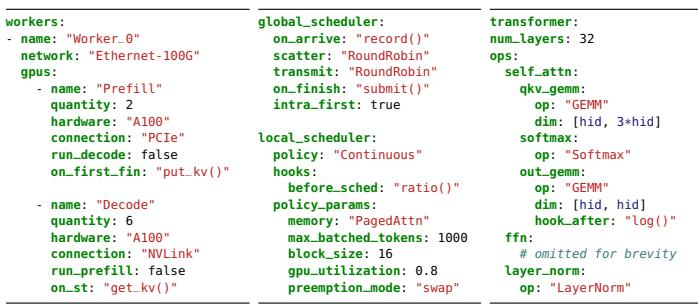
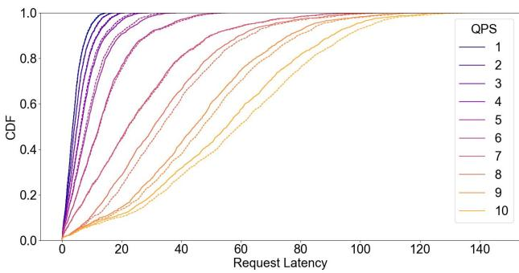
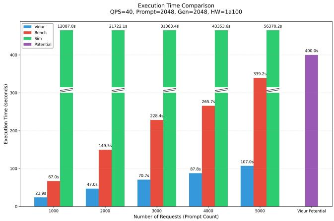
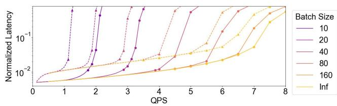
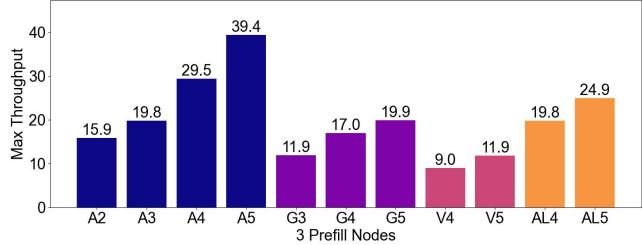
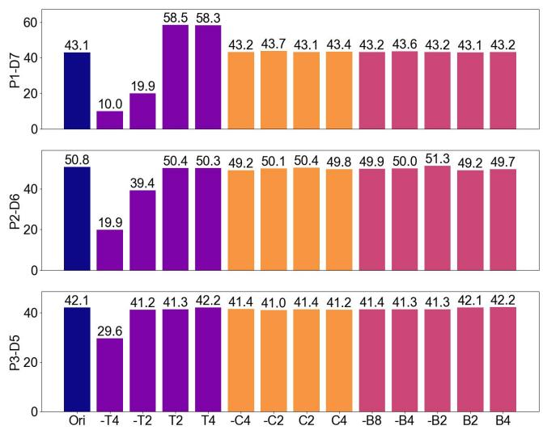

# TokenSim: Enabling Hardware and Software Exploration for Large Language Model Inference Systems 图表详解

### (a) Hardware config(a) Hardware config (b) Scheduler config(b) Scheduler config (c) Model config Fig. 2: One example of TokenSim configurations.Fi

- **图像概述**: 该图展示了 **TokenSim** 模拟器的完整配置文件示例（Figure 2），包含三个核心配置模块：(a) **Hardware config** 硬件配置、(b) **Scheduler config** 调度器配置、(c) **Model config** 模型配置。此配置实现了一个 **Disaggregated Architecture（解耦架构）** 的 LLM 推理系统。

- **硬件配置 (Hardware Config) 分析**:
  - **Worker 定义**: 定义了名为 `"Worker_0"` 的工作节点，网络环境为 **Ethernet-100G**。
  - **GPU 分组**: 采用 **Prefill/Decode 解耦设计**：
    
    | 参数 | Prefill GPU 组 | Decode GPU 组 |
    |------|----------------|---------------|
    | 名称 | "Prefill" | "Decode" |
    | 数量 | **2** 个 | **6** 个 |
    | 硬件型号 | **A100** | **A100** |
    | 连接方式 | **PCIe** | **NVLink** |
    | 运行解码 | `false` | `true` (隐含) |
    | 运行预填充 | `true` (隐含) | `false` |
    | 完成回调 | `put_kv()` | `get_kv()` |

  - **关键设计细节**: 
    - Prefill 阶段使用 **PCIe** 连接（带宽较低但成本可控），Decode 阶段使用 **NVLink** 高速互连（满足内存密集型需求）。
    - 回调函数 `put_kv()` 和 `get_kv()` 实现 **KV Cache 跨设备传输**，这是解耦架构的核心机制。

- **调度器配置 (Scheduler Config) 分析**:
  - **Global Scheduler（全局调度器）**:
    
    | 配置项 | 值 | 功能说明 |
    |--------|-----|----------|
    | `on_arrive` | `"record()"` | 请求到达时记录状态 |
    | `scatter` | `"RoundRobin"` | 请求分发采用轮询策略 |
    | `transmit` | `"RoundRobin"` | 数据传输采用轮询策略 |
    | `on_finish` | `"submit()"` | 完成后提交结果 |
    | `intra_first` | `true` | 优先进行节点内调度 |

  - **Local Scheduler（本地调度器）**:
    - **调度策略**: `"Continuous"` —— 采用 **Continuous Batching（连续批处理）**，支持动态批次调整。
    - **Hooks（钩子函数）**: `before_sched: "ratio()"` —— 在调度前执行比例计算（用于解构架构的负载均衡）。
    - **Policy Params（策略参数）——PagedAttention 内存管理**:

      | 参数 | 值 | 说明 |
      |------|-----|------|
      | `memory` | `"PagedAttn"` | 启用分页注意力机制 |
      | `max_batched_tokens` | **1000** | 单次迭代最大 token 数 |
      | `block_size` | **16** | 内存块大小（token 数） |
      | `gpu_utilization` | **0.8** | GPU 内存利用率上限（80%） |
      | `preemption_mode` | `"swap"` | 抢占模式为交换（换出到主机内存） |

- **模型配置 (Model Config) 分析**:
  - **Transformer 结构**: 
    - 层数 (`num_layers`): **32 层**（对应 LLaMA2-70B 或类似规模模型）。
  - **算子级 (Operator-level) 细粒度定义**:
    
    | 算子类型 | 具体操作 | 计算维度/说明 |
    |----------|----------|---------------|
    | **Self-Attention** | | |
    | QKV 投影 | `"GEMM"` | `[hid, 3*hid]` —— 通用矩阵乘法 |
    | Softmax | `"Softmax"` | 注意力权重归一化 |
    | 输出投影 | `"GEMM"` | `[hid, hid]` |
    | Hook | `"log()"` | 在 Attention 后插入日志钩子（用于性能剖析） |
    | **FFN** | *(省略)* | 包含 LayerNorm 等 |
    | Layer Norm | `"LayerNorm"` | 层归一化操作 |

  - **Breakpoint 机制体现**: 配置中的 `hook_after: "log()"` 展示了 TokenSim 的 **operator-level breakpoint（算子级断点）** 特性，允许用户在模型任意算子后插入自定义逻辑（如调度决策、数据收集）。

- **架构洞察与系统特征总结**:
  - **资源配比**: **2:6** 的 Prefill-to-Decode GPU 比例表明该配置针对 **长输出序列（long generation）** 场景优化（Finding 3 论证：长输出需要更多 Decode 资源）。
  - **异构连接策略**: Prefill 用 PCIe + Decode 用 NVLink 的混合互联方案体现了 **成本-性能权衡** —— 计算密集型的 Prefill 对互联带宽不敏感，而内存密集型的 Decode 需要 NVLink 的高带宽支撑 KV Cache 访问。
  - **内存管理精细化**: `gpu_utilization: 0.8` 预留 20% 显存用于 **减少抢占（preemption）**，直接关联 Finding 2（限制新请求可改善尾延迟）。
  - **可扩展性接口**: 所有组件（scheduler、memory manager、hooks）均通过字符串配置指向用户自定义函数，实现了 **modular and extensible（模块化可扩展）** 设计目标。

### 535603b843e782a72994a3aaaff71160bf9026e70f34554e0eff7c2c02e05995.jpg

- **图表基本信息**
    - 图表编号：Fig. 5
    - 图表标题：vLLM latency CDF aligns with TokenSim at different QPS
    - 图表类型：累积分布函数图（Cumulative Distribution Function, CDF）
    - 坐标轴定义：
        - X轴：Request Latency（请求延迟），范围0-140
        - Y轴：CDF（累积概率），范围0.0-1.0

- **实验配置与数据来源**
    - 模型：LLaMA2-7B
    - 硬件平台：NVIDIA A100 GPU
    - 数据集：ShareGPT数据集，共2,000个请求
    - 对比系统：vLLM v0.6.2（虚线） vs TokenSim（实线）
    - 变量参数：QPS（Queries Per Second）从1到10变化

- **关键观察与特征分析**
    - **曲线分布模式**：图中包含10组对比曲线（QPS=1至QPS=10），每组包含一条虚线（vLLM实测）和一条实线（TokenSim模拟）
    - **QPS影响趋势**：随着QPS增加（从深紫色/蓝色向浅黄色过渡），整体曲线向右偏移，表明**系统负载增加导致请求延迟显著上升**
    - **低QPS区域（QPS 1-3）**：曲线陡峭且集中在低延迟区域（0-20ms），说明系统在轻负载下响应迅速
    - **高QPS区域（QPS 8-10）**：曲线平缓且分布广泛（延伸至100-140ms），显示**尾延迟（tail latency）明显增大**

- **验证精度评估**
    - **拟合程度**：每个QPS对应的虚线与实线**高度重合**，视觉上几乎无法区分
    - **误差量化**（结合论文正文数据）：
        
        | 指标 | 几何平均误差 |
        |------|-------------|
        | Throughput（吞吐量） | 0.109% |
        | P50 Latency | 0.6% |
        | P99 Latency | 0.254% |
        | Max Latency | 0.337% |
    
    - **结论**：TokenSim在**延迟分布建模方面达到亚百分比级精度**（<1% error），有效验证了其作为LLM推理系统仿真器的可靠性

- **工程意义与应用价值**
    - 该图证明了TokenSim能够**准确捕捉真实系统的延迟分布特性**，而非仅提供平均值
    - 对于LLM服务系统而言，**尾延迟（P99/Pmax）的准确预测**对SLA（Service Level Agreement）保障至关重要
    - 支持在不同负载场景（QPS变化）下进行**性能瓶颈预测和容量规划**

### e4d6e66e57b5259979e5de15d9eba3455bac5ce7b5fa3a0b30d0614ac0647fba.jpg

- **图表核心主题**：该图为 **TokenSim** 与现有主流 LLM 推理模拟器（**Vidur**, **LLMServingSim**）在 **Runtime Efficiency（运行时效率）** 方面的对比分析。
- **实验配置参数**：
    - **QPS (Queries Per Second)**: 40
    - **Prompt Length**: 2048 tokens
    - **Generation Length**: 2048 tokens  
    - **Hardware**: 1x NVIDIA A100 GPU

- **关键数据对比表**：

| 请求数量 (Number of Requests) | Vidur 执行时间 (s) | Bench (基准/实测) 执行时间 (s) | Sim (LLMServingSim) 执行时间 (s) |
| :--- | :--- | :--- | :--- |
| 1,000 | **23.9s** | 67.0s | 12,087.0s |
| 2,000 | **47.0s** | 149.5s | 21,722.1s |
| 3,000 | **70.7s** | 228.4s | 31,393.4s |
| 4,000 | **87.8s** | 265.7s | 43,353.6s |
| 5,000 | **107.0s** | 339.2s | 56,370.2s |
| **Vidur 预训练开销 (Potential)** | — | — | **400.0s** |

- **深度分析与发现**：
    - **LLMServingSim (Sim) 的性能瓶颈**：图中绿色柱状图显示，**LLMServingSim** 的执行时间呈指数级增长，在处理 5000 个请求时耗时高达 **56,370 秒**（约 15.6 小时）。这验证了论文指出的其“**impressively slow**”且“**slower than the real-time behavior**”的严重缺陷，主要归因于其在处理长序列（Long Prompts）时的局限性。
    - **Vidur 的隐性成本**：虽然 **Vidur**（蓝色柱）本身的模拟速度较快（5000请求仅需 107s），但图表右侧的紫色柱（**Vidur Potential**）揭示了其致命弱点：每次运行前需要进行约 **400 秒的随机森林模型预训练（Pre-training）**。
    - **TokenSim 的综合优势**：尽管 TokenSim 在单次模拟中的绝对时间可能略高于 Vidur（未在此图直接展示，但在论文论述中提及），但它**完全省去了 400s 的预训练开销**。在模型调优阶段需要频繁修改配置的场景下，TokenSim 的**轻量化（Lightweight）** 特性使其**总体预期时间（Overall Expected Time）** 具有显著优势。
    - **可扩展性趋势**：随着请求数量从 1000 增加到 5000，Vidur 和 Bench 的时间增长基本呈线性，而 LLMServingSim 的增长斜率极大，证明了其在规模化模拟中的不可用性。

- **结论总结**：该图有力地支撑了论文观点——**TokenSim 通过牺牲微小的单次运行速度，换取了无需预训练的高灵活性和更短的总迭代周期**，是进行 LLM 推理系统快速原型验证和参数搜索的更优工具。

### c8f4ebe17cb1d89d536392cbd875c5bda7129a1da785969b685b9cfb50084834.jpg

- **图表基本信息**
    - 图表编号：Figure 9
    - 图表标题：Normalized latency graph for static batching and continuous batching with limited batch sizes
    - 实验设置：使用 **A100 GPU** 运行 **LLaMA2-7B** 模型，处理 **50,000** 个来自 **ShareGPT** 数据集的随机请求

- **坐标轴定义**
    - **X轴**：QPS (Queries Per Second)，范围 0-8，表示请求到达速率
    - **Y轴**：**Normalized Latency** (归一化延迟)，采用对数刻度 (10⁻² 到 >10⁻¹)
    - **图例**：**Batch Size** (批大小) 包括 10, 20, 40, 80, 160, **Inf** (无限制)

- **线条类型说明**
    - **虚线 (Dashed lines)**：代表 **Static Batching** (静态批处理)
    - **实线 (Solid lines)**：代表 **Continuous Batching** (连续批处理)

- **核心数据趋势分析**

| Batch Size | 低 QPS (<2) 行为 | 高 QPS (>4) 行为 | 静态 vs 连续差异 |
|------------|------------------|------------------|------------------|
| **10** | 延迟最低 (~0.01) | 延迟急剧飙升 (>0.1) | 差异显著 |
| **20** | 延迟较低 | 快速上升 | 明显差异 |
| **40** | 中等延迟 | 稳步上升 | 差异明显 |
| **80** | 中等延迟 | 平缓上升 | 差异存在 |
| **160** | 较高初始延迟 | 最平缓增长 | 差异缩小 |
| **Inf** | 较高初始延迟 | 最优扩展性 | 差异最小但持续存在 |

- **关键发现与洞察**

    - **Finding 1 验证**：**Continuous Batching** 显著降低延迟并提高可扩展性，尤其在负载增加条件下

    - **延迟增长模式差异**：
        - **Static Batching**：呈现**陡峭的指数级增长**，一旦达到系统容量极限，延迟迅速恶化
        - **Continuous Batching**：呈现**更线性的渐进式增长**，系统具有更好的负载适应能力

    - **Batch Size 权衡关系**：
        - 小 Batch Size (10-20)：**低负载下延迟最优**，但**高负载下脆弱性极高**
        - 大 Batch Size (80-Inf)：**初始延迟较高**，但**高负载下稳定性更强**
        - **Inf (无限制)**：在所有 QPS 水平下都表现出最佳的**可扩展性**

    - **实际系统启示**：
        - 在**动态变化的真实工作负载**中，**Continuous Batching** 提供更可预测的性能表现
        - **Static Batching** 的"气泡"问题 (如图8所示) 在高并发场景下导致严重的资源浪费和延迟抖动
        - 对于**SLO (Service Level Objective) 敏感**的应用，**Continuous Batching** 是必要选择

- **技术机制解释**
    - **Static Batching** 的性能瓶颈：必须等待批次内**最长请求完成**才能处理新请求，导致短请求被长请求阻塞
    - **Continuous Batching** 的优势：允许在迭代过程中**动态添加/移除请求**，消除等待间隙，提高 **GPU 利用率**
    - 归一化延迟计算基于 **vLLM 框架** 的评估指标，确保跨配置的可比性

### fec511aeea71baf65f491a94ee726d399a3cdd41ac4e1f152e0a3bbf67f18cf5.jpg

- **图表基本信息**
    - 图表类型：柱状图
    - X轴：不同硬件配置下的解码设备数量（基于 **3 Prefill Nodes** 固定配置）
    - Y轴：**Max Throughput**（最大吞吐量）
    - 实验背景：**Disaggregated Architecture**（解耦架构），分离 Prefill 和 Decode 阶段

- **图例与数据详解**

| 配置标识 | 硬件类型 | 解码设备数 | 最大吞吐量 | 性能排名 |
|---------|---------|-----------|-----------|---------|
| **A2** | NVIDIA A100 | 2 | 15.9 | 9 |
| **A3** | NVIDIA A100 | 3 | 19.8 | 6 |
| **A4** | NVIDIA A100 | 4 | 29.5 | 2 |
| **A5** | NVIDIA A100 | 5 | **39.4** | **1** |
| **G3** | SK HYNIX GDDR6-Aim (PIM) | 3 | 11.9 | 10 |
| **G4** | SK HYNIX GDDR6-Aim (PIM) | 4 | 17.0 | 8 |
| **G5** | SK HYNIX GDDR6-Aim (PIM) | 5 | 19.9 | 5 |
| **V4** | NVIDIA V100 | 4 | **9.0** | **11** |
| **V5** | NVIDIA V100 | 5 | 11.9 | 10 |
| **AL4** | A100 (1/4 FLOPS) | 4 | 19.8 | 6 |
| **AL5** | A100 (1/4 FLOPS) | 5 | 24.9 | 4 |

- **核心发现与分析**
    - **A100 绝对优势**：标准 **NVIDIA A100** 作为 Decode 设备时性能最优，**A5 配置**（5个A100解码器）达到 **39.4** 的峰值吞吐量，显著领先其他方案
    - **PIM 的性价比定位**：**GDDR6-Aim (PIM)** 芯片表现中等，**G5** 达到 19.9，约为同数量 A100（A5: 39.4）的 **50%**，但成本仅为 A100 的约 **1/2**，符合 **Finding 4** 关于 PIM 作为预算受限场景下经济替代方案的结论
    - **V100 性能瓶颈**：**NVIDIA V100** 表现最差，**V4** 仅 9.0，即使在增加设备数量后（V5: 11.9）仍远低于其他选项，说明上一代 GPU 在 LLM 解码阶段已不具备竞争力
    - **计算能力的影响**：**AL 系列**（A100 降频至 1/4 FLOPS）的表现（AL5: 24.9）优于 PIM 和 V100，说明 **Decode 阶段仍需一定的计算能力**，纯内存带宽优化（PIM）或旧架构（V100）无法完全弥补

- **系统设计启示**
    - 在 **3 Prefill Nodes** 的固定配置下，**Decode 阶段的硬件选择对整体吞吐量起决定性作用**
    - 对于 **预算充足** 场景：应优先采用 **全 A100 配置**（A4/A5），吞吐量增益显著（A4→A5 提升 **33.6%**）
    - 对于 **预算敏感** 场景：**PIM (G5)** 可提供约 **50% 的 A100 性能**，但需注意受限于服务器 **PCIe 插槽数量**（本实验限制为 8 个设备总数 = 3 Prefill + 5 Decode）
    - **不建议使用 V100**：即使在低价位段，其性能也不具吸引力

### 77b5d1f25ef3e4168648784651f599cd8368a95f77cf7f42a4fceed6bfe27c0c.jpg

- **图表核心主题**：该图展示了在**Disaggregated（解耦）架构**下，**Prefill（预填充）阶段**对不同硬件参数变化的敏感性分析，具体评估了**计算性能（T）**、**内存容量（C）** 和**内存带宽（B）** 对系统**吞吐量（Throughput）** 的影响。

- **实验配置维度**：图表包含三种**Prefill-Decode设备分配比例**的对比实验：
  - **P1-D7**：1个Prefill设备配合7个Decode设备
  - **P2-D6**：2个Prefill设备配合6个Decode设备
  - **P3-D5**：3个Prefill设备配合5个Decode设备

- **X轴参数定义与数据解读**：

| 参数类别 | 参数标识 | 含义 | 典型数值示例 |
|---------|---------|------|-------------|
| **基准** | Ori | 原始NVIDIA A100配置 | - |
| **计算性能** | -T4 / -T2 | 计算性能降至1/4或1/2 | 10.0 / 19.9 (P1-D7) |
| | T2 / T4 | 计算性能提升至2倍或4倍 | 58.5 / 58.3 (P1-D7) |
| **内存容量** | -C4 / -C2 | 容量减半或减至1/4 | ~43.2 (P1-D7) |
| | C2 / C4 | 容量翻倍或4倍 | ~43.4 (P1-D7) |
| **内存带宽** | -B8至B4 | 带宽在1/8至4倍间变化 | 43.1-43.7 (P1-D7) |

- **关键发现与定量分析**：

  - **计算性能的主导作用（Finding 7）**：
    - 在P1-D7配置下，将计算性能从原始值降至**1/4 (-T4)** 时，吞吐量从**43.1骤降至10.0**（下降76.8%）
    - 提升计算性能至**2倍 (T2)** 时，吞吐量跃升至**58.5**（提升35.7%）
    - 继续提升至**4倍 (T4)** 时，吞吐量为**58.3**，出现**平台期现象**，表明此时瓶颈已转移至Decode阶段

  - **内存资源的非敏感性**：
    - 无论内存容量如何变化（从-C4到C4），吞吐量波动范围极小（**43.1-43.4**，波动<1%）
    - 内存带宽在**1/8 (-B8) 至 4倍 (B4)** 的极端范围内调整时，吞吐量仍稳定在**43.1-43.7**区间
    - 这一规律在**P2-D6**和**P3-D5**配置中同样成立：内存相关参数变化时，吞吐量始终维持在**49-52**的狭窄带状区域内

  - **不同设备配比的绝对性能差异**：
    - P2-D6配置的基准吞吐量（**50.8**）高于P1-D7（**43.1**），说明增加Prefill设备数量可提升整体性能
    - 但P3-D5（**42.1**）反而低于P2-D6，提示存在**最优配比点**，过度增加Prefill设备可能导致资源闲置

- **工程实践启示**：
  - **硬件选型建议**：对于专用的Prefill节点，应优先投资于**高FLOPS计算单元**（如采用更先进的GPU架构或增加核心数），而非盲目追求大容量高带宽显存
  - **成本优化空间**：由于A100的**80GB HBM2e显存**和**2TB/s带宽**对Prefill任务存在显著过剩，可考虑使用**显存容量较小但计算能力相当**的替代方案（如专业计算卡）以降低成本
  - **系统瓶颈识别**：当计算性能提升至**2×312 TFLOPS**（约A100的2倍）后，系统进入**Decode-bound区域**，进一步优化Prefill已无意义，需转向Decode侧优化

