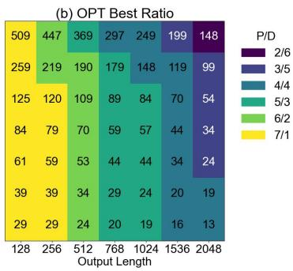
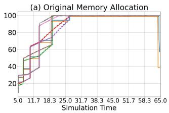
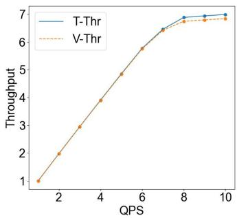
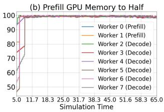
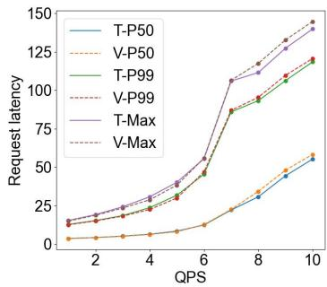
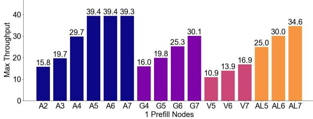
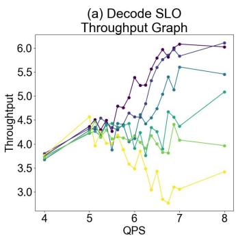
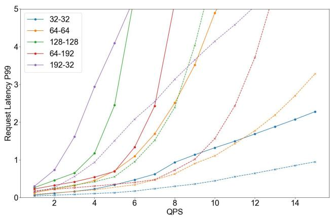

# TokenSim: Enabling Hardware and Software Exploration for Large Language Model Inference Systems 论文解析

## 0. 论文基本信息

**作者 (Authors)**: Feiyang Wu, Zhuohang Bian, Guoyang Duan, et al.

**发表期刊/会议 (Journal/Conference)**: unknown

**发表年份 (Publication Year)**: 2024

**研究机构 (Affiliations)**: Beihang University, Peking University, Renmin University of China, Alibaba Group, Sensetime

---

## 1. 摘要

**目的**

- 解决现有 LLM 推理模拟器（如 Roofline、GenZ、LLMCompass）仅支持单请求/单批次输入、只能输出延迟与内存占用两个粗粒度指标，无法刻画真实服务系统中**动态请求流**、**尾延迟分布**及**内存随时间变化**的问题。
- 构建一个**模块化、可扩展**的 LLM 推理软硬件探索模拟器 **TokenSim**，支持用户自定义 scheduling 与 memory management 策略，服务于真实 LLM serving 系统的性能预测与优化探索。

---

**方法**

- **系统架构**：
  - 基于 **SimPy** 离散事件仿真框架，无需 GPU 即可在个人电脑上运行。
  - 采用**两级调度器设计**：global scheduler 负责将请求分配到 worker，local scheduler 在迭代间决定请求去留。
  - 通过 model configuration 中的 **breakpoint** 机制实现 operator 级调度钩子，两行代码即可实现 KV cache transfer 等 disaggregation 类优化。
- **内存与通信建模**：
  - 为 CPU/GPU/FPGA 等多种 worker 实现 memory manager，支持按 **block / token / byte** 粒度监控内存利用率，兼容 **PagedAttention**。
  - 通信组件基于 cache 位置、数据量与 memory bandwidth 建模节点间数据传输开销，支持 sequential 与 concurrent 的数据搬运重叠。
  - 计算部分可对接 GenZ 等外部 compute simulator。
- **验证设置**：
  - 使用 LLaMA2-7B + NVIDIA A100 + vLLM v0.6.2，2000 条 ShareGPT 请求，对比 throughput 与 latency 百分位。
  - 与 **Vidur**、**LLMServingSim** 对比精度与运行时开销。
  - 基于 **Dist-Serve** 验证 prefill/decode 分离仿真能力（2×A100，输入/输出各 64 token，QPS=8）。

 *Fig. 1: TokenSim system overview.*

---

**结果**

- **精度验证**：
  - 与真实 vLLM 相比，throughput 几何平均误差 **0.109%**，P50/P99/max latency 误差分别为 **0.6% / 0.254% / 0.337%**，整体误差低于 **1%**。
  - Latency CDF 曲线与真实硬件高度吻合。

- **与 SOTA 模拟器对比**：

| 维度 | TokenSim | Vidur | LLMServingSim |
|---|---|---|---|
| 计时方式 | 解析式 transformer 模型，无需预训练 | 随机森林回归，需约 **400s** 预训练 | 无需预训练但运行极慢 |
| 内存仿真 | block 粒度细粒度仿真 | 粗粒度近似 | 粗粒度 |
| 长请求支持 | 支持 | 支持 | 仅支持约 10 token |
| 精度 | 最接近真实结果 | 略逊于 TokenSim | 接近但受短请求限制 |

- **系统优化探索（六项关键发现）**：
  - **Finding 1**：continuous batching 相比 static batching 显著降低延迟并提升可扩展性，负载越高优势越明显。
  - **Finding 2**：限制新请求流入、为已有请求预留 KV cache 内存（如 vLLM 的 `gpu_memory_utilization`）可减少 preemption、改善尾延迟（mTPOT SLO 场景下吞吐更高），说明**最大化 batch size 并非普遍最优**。
  - **Finding 3**：disaggregated 架构中 prefill/decode 设备最优配比主要取决于**输出长度**——输出越长，越受益于更多 prefill 设备。

  - **Finding 4**：**PIM 芯片**（SK HYNIX GDDR6-Aim，约为 A100 一半价格）可作为预算受限场景下 decode 阶段的性价比替代方案，但受限于节点内 PCIe slot 数量，无法完全取代 A100；降算力版 A100 与 V100 均非优选。
  - **Finding 5**：prefill 阶段 GPU 内存占用显著低于 decode 阶段；将 prefill GPU 内存减半后吞吐几乎不变，可实现更均衡的资源分配。
  - **Finding 6**：multi-round conversation 场景下，memory cache 优化对**短输出**（约 64 token）收益最大，可将同等 P99 latency 下的请求率翻倍；对极短输出（≤32 token）收益递减。

- **硬件特性分析（Finding 7）**：
  - Disaggregated 设置下，prefill 阶段对 **memory capacity**（1/4–4 倍）与 **memory bandwidth**（1/8–4 倍）变化不敏感，对**计算性能**高度敏感；算力累计达 2× A100 后受 decode 能力制约而饱和。表明 A100 的内存容量与带宽对 prefill 任务而言**过剩**。

---

**结论**

- TokenSim 是首个支持**动态请求流**、**用户自定义两级调度**、**细粒度内存管理**及 **prefill/decode 分离**仿真的 LLM serving 模拟器，在真实数据集验证下误差率低于 **1%**。
- 相比 Vidur 免除 400 秒级预训练开销，相比 LLMServingSim 支持长 prompt 且运行更快，在精度—效率—灵活性上取得更优平衡。
- 通过七项 finding 证明：系统级仿真（batching 策略、PD 分离配比、内存预留、cache 复用）与硬件参数（FLOPS、bandwidth、capacity）探索必须在**完整系统上下文**中进行，单纯单请求建模会得出误导性结论。
- 代码已开源：`https://github.com/pku-lemonade/TokenSim`。

---

## 2. 背景知识与核心贡献

**研究背景**

- 大语言模型（LLM）如 ChatGPT、Gemini 在聊天机器人、编程助手等场景中广泛应用，其推理服务（LLM Serving）的**计算与内存需求**呈指数级增长。
- 为应对该需求，产业界从两个层面进行了优化：
  - **硬件层面**：新型加速器不断涌现，峰值浮点性能与内存带宽各异；近数据处理（Near-Data-Processing）加速器（如 **GDDR6-Aim**、**UPMEM**）利用新型存储技术，在内存密集型算子上具备超越传统内存系统的带宽优势。
  - **软件层面**：推理系统的优化聚焦两大方向——**请求调度**（Request Scheduling，如 Continuous Batching 通过动态调整 batch size 提升利用率）与**内存管理**（Memory Management，如 **PagedAttention** 通过分块映射缓解 KV Cache 碎片化）；vLLM 结合两类优化实现了数量级的延迟降低。
- 硬件与软件创新催生了**跨栈协同优化**的新机会，例如在异构加速器集群上实施异构感知的调度策略。

**研究动机**

- 现有模拟器（如 GenZ、LLMCompass）的输入局限于**单请求或单 batch**，仅输出延迟与内存占用两个静态数值。
- 真实 LLM 推理系统需处理**数百至数千并发请求**：
  - 用户满意度与**尾延迟**强相关，需获取完整的**延迟分布**（Latency Distribution）而非单一均值。
  - 请求持续到达与离开，**内存占用随时间动态变化**，静态指标无法刻画。
- 系统优化方法的多样性（调度、内存管理、Prefill/Decode 分离等）使从业者迫切需要一个能**预测性能与资源需求**的动态模拟工具，而当前方案存在明显空白。

**与现有方案的对比**

| 方法 | Modular | Scheduler | Mem Manager | Portable | Dataset |
|---|---|---|---|---|---|
| Roofline | ✗ | ✗ | ✗ | ✓ | ✗ |
| GenZ | ✗ | ✗ | ✗ | ✗ | ✗ |
| LLMCompass | ✗ | ✗ | ✗ | ✗ | ✗ |
| **TokenSim** | **✓** | **✓** | **✓** | **✓** | **✓** |

此外，与最新模拟器相比：

- **Vidur**：支持高级调度与 PagedAttention，但依赖**随机森林回归模型**估计计算耗时，可能引入额外误差。
- **LLMServingSim**：提供 HW/SW 协同仿真，但**性能极差**（甚至慢于实时），且缺乏自定义新模型与新硬件架构的灵活性。

**核心贡献**

- 提出 **TokenSim**：面向 LLM 推理的**软硬件协同探索模拟系统**，具备高度模块化与可扩展架构，基于 **SimPy** 离散事件仿真框架实现，可在无 GPU 的个人电脑上运行。

 *Fig. 1: TokenSim system overview.*

- **动态请求负载支持**：
  - 从真实数据集（如 **ShareGPT**）采样生成动态请求流，模拟数百至数千并发场景。
  - 输出**延迟分布（CDF）**与随时间变化的内存占用等 QoS 指标。
- **两级可扩展调度器**：
  - **全局调度器**（Global Scheduler）管理请求到 worker 的分配，可访问 worker 数量、硬件类型、并发数等信息，支持有状态（Stateful）的负载感知调度。
  - **本地调度器**（Local Scheduler）在迭代间决定请求去留。
  - 引入**断点机制**，实现算子级粒度的调度钩子，仅需两行代码即可实现 Prefill/Decode 分离架构下的 **KV Cache 传输**。
- **细粒度内存管理**：
  - 为 CPU、GPU、FPGA 等多种 worker 类型实现内存管理器，支持 **block、token、byte 级**任意粒度的监控。
  - 通过通信组件建模**跨设备数据传输开销**（缓存位置、数据大小、内存带宽），支持顺序与并发的传输重叠。
- **高精度验证**：
  - 在 LLaMA2-7B + NVIDIA A100 + vLLM v0.6.2 环境下，吞吐量几何平均误差仅 **0.109%**，P50/P99/最大延迟误差分别为 **0.6% / 0.254% / 0.337%**。
  - 是首个支持 **Prefill 与 Decode 分离**仿真的 LLM 模拟器，与 DistServe 真实结果对比精度高。
- **深入的软硬件探索**：基于 TokenSim 开展系统级实验，产出七项关键发现（Finding 1–7），涵盖：
  - **Continuous Batching** 相比静态 Batching 显著降低延迟并提升可扩展性。
  - 限制新请求流入并为旧请求预留内存可改善**尾延迟**与用户体验（即使不最大化 batch size）。
  - 分离架构中最优 **Prefill/Decode 设备比**主要取决于输出长度。
  - **PIM 芯片**（如 GDDR6-Aim）在预算受限场景下是 decode 阶段的高性价比替代方案。
  - Prefill 阶段内存占用显著低于 Decode 阶段，削减 Prefill GPU 内存是可行的优化策略。
  - **多轮对话内存缓存**在短输出（约 64 token）场景下收益最大。
  - Prefill 阶段更依赖**计算性能**而非内存容量/带宽，A100 的内存规格对 Prefill 任务而言存在冗余。
- **开源开放**：代码已开源，降低 LLM 推理系统研究与优化的门槛。

---

## 3. 核心技术和实现细节

### 0. 技术架构概览

**整体定位**

TokenSim 是一个面向 **LLM Inference Serving** 的软硬件协同仿真框架，基于 **SimPy** 离散事件仿真库构建，采用事件驱动架构，可在无 GPU 的个人计算机上高效模拟复杂推理系统的动态行为。其核心目标是支持**动态请求流**与**用户自定义调度/内存管理策略**的模拟，弥补传统仿真器仅支持单请求/单批次输入的不足。

 *Fig. 1: TokenSim system overview.*

---

**与现有方法的架构对比**

| 方法 | 模块化 | Scheduler | 内存管理 | 可移植 | 数据集支持 |
|---|---|---|---|---|---|
| Roofline | ✗ | ✗ | ✗ | ✓ | ✗ |
| GenZ | ✗ | ✗ | ✗ | ✗ | ✗ |
| LLMCompass | ✗ | ✗ | ✗ | ✗ | ✗ |
| **TokenSim** | **✓** | **✓** | **✓** | **✓** | **✓** |

---

**核心组件与数据流**

TokenSim 的整体运行逻辑围绕一个 **Inference Loop** 展开，各组件分工如下：

- **Workload Generator（负载生成器）**
  - 从真实数据集（如 **ShareGPT**）与用户参数中采样生成动态请求流。
- **Dispatcher（分发器）**
  - 接收生成的请求，并将其转发给 **Global Scheduler**。
- **两级调度器（Two-stage Scheduler）**
  - **Global Scheduler（全局调度器）**：管理流入请求，依据 Worker 的硬件类型、并发请求数等信息将请求分配至各 Worker；支持有状态调度，可记录历史负载信息实现 **load-aware scheduling**。
  - **Local Scheduler（本地调度器）**：在每个 Worker 内运行，于迭代之间决定请求是留在本地继续计算，还是被返回至全局调度器（例如 Prefill 完成后转交 Decode 设备）。
- **Worker（工作节点）**
  - 并发运行于仿真环境中，由本地调度器管理。
- **Memory Manager（内存管理器）**
  - 针对不同 Worker 类型（**CPU / GPU / FPGA**）分别实现，实时监控设备内存利用率。
  - 支持任意粒度的内存追踪——按 **block**、**token** 或 **byte**，从而兼容 **PagedAttention** 等分块式内存管理技术。
- **Compute Simulator（计算模拟器）**
  - 调度器形成 batch 后，相关信息被送至计算模拟器（如 **GenZ**）以确定单次迭代耗时。
  - 架构上支持接入多种计算模拟器，实现不同硬件配置与仿真方法的可插拔扩展。
- **Communication Model（通信模型）**
  - 当发生跨设备数据移动（如 **Disaggregated Architecture** 下 Prefill 与 Decode 设备间的 **KV Cache Transfer**）时，基于缓存位置（host 或 device）、数据大小与内存带宽计算传输延迟。
  - 利用 SimPy 的事件驱动能力支持**顺序与并发的数据传输重叠**，可模拟预加载缓冲等更复杂的传输优化策略。

---

**关键扩展机制设计**

- **配置驱动（Configuration-driven）**
  - 硬件配置、调度器配置、模型配置均通过配置文件定义，如图 2 所示。

 *(a) Hardware config(a) Hardware config (b) Scheduler config(b) Scheduler config (c) Model config Fig. 2: One example of TokenSim configurations.Fi*

- **用户自定义调度 API**
  - 全局与本地调度器均可通过修改用户自定义函数进行替换，API 提供完整系统信息（Worker 数量、硬件类型、内存利用率等）。
  - 借助该机制，仅需数行代码即可实现如 **PD 分离**这类高级架构：本地调度器在 Prefill 结束后提交请求至全局调度器，全局调度器再将其分发给 Decode 设备。
- **Breakpoint（断点）机制**
  - 在模型配置中支持 **operator-level** 的钩子，默认在每个 token 生成后触发调度器。
  - 断点可显式添加在模型配置文件末尾，分别关联至本地调度器（请求回传）与全局调度器（请求再分发），实现**调度粒度的完全控制**。

---

**架构特点总结**

- **模块化**：调度器、内存管理器、计算模拟器、通信模型均可独立替换与扩展。
- **动态仿真能力**：不同于 GenZ、LLMCompass 等静态方法，TokenSim 可模拟数百至数千并发请求，输出延迟分布（如 **P50/P99/CDF**）与随时间变化的内存占用。
- **精度保障**：在真实硬件 + **vLLM** 上验证，吞吐量几何平均误差仅 **0.109%**，P50/P99/最大延迟误差分别为 **0.6% / 0.254% / 0.337%**。
- **技术前瞻性**：首个支持 **Prefill-Decode 分离**仿真的 LLM 模拟器，并支持模拟 **CachedAttention / MemServe** 风格的多轮对话 KV Cache 复用机制。

### 1. 动态事件驱动的 LLM 负载仿真（真实数据集采样 + QoS 指标输出）

**核心定位**

TokenSim 的**动态事件驱动负载仿真**是其区别于 Roofline、GenZ、LLMCompass 等静态分析工具的根本特征。传统工具仅接受单一 request 或单一 batch 输入，输出孤立的 latency 与 memory usage 两个数值；而 TokenSim 基于 **SimPy 离散事件仿真框架**，能够以真实数据集采样的动态请求流为输入，输出完整的 **QoS 指标分布**（P50/P99/Max latency、TTFT、mTPOT、吞吐量随时间演化曲线），实现对真实 LLM serving 系统行为的低成本预测。

 *Fig. 1: TokenSim system overview.*

---

**一、事件驱动架构的实现原理**

- **底层引擎**：TokenSim 构建于 **SimPy 4.1.1** 之上，SimPy 是轻量级 Python 离散事件仿真框架，通过 **event-driven architecture** 维护一个按模拟时间排序的事件队列，所有活动组件（worker、dispatcher、scheduler、memory manager）以**并行协程**形式运行，模拟时间仅在事件间推进。
- **并行建模**：每个 worker 作为独立进程在 simulated environment 中并发运行，由各自 local scheduler 管理；这种设计天然贴合真实推理系统中多 GPU/多设备并行的执行语义。
- **无 GPU 依赖**：仿真完全在 CPU 上运行，支持在个人计算机上完成对大规模集群级 serving 场景的模拟，避免了在真实硬件上做参数扫描的高昂成本。
- **推理主循环**：系统围绕一个 inference loop 组织，追踪所有 worker 的模拟时间；每个迭代中由 scheduler 组 batch，batch 信息交由底层计算模拟器（如 **GenZ**）估算单次 iteration time，架构支持可插拔的多种 compute simulator。

---

**二、真实数据集动态采样的负载生成机制**

- **数据来源**：验证与实验均使用 **ShareGPT dataset**（约 2,000~50,000 条真实用户对话请求），其中 prompt 长度与 output 长度直接从真实分布中采样，而非人工设定的固定长度。
- **请求到达模型**：通过 **QPS（Queries Per Second）** 参数控制请求注入速率，workload 由 dataset + 参数共同生成；dispatcher 按事件驱动方式将 request 送入 global scheduler。
- **动态性体现**：
  - 请求**异步到达**：新请求随时间不断进入系统，模拟真实在线服务的开放负载；
  - 请求**异步离开**：长短不一的请求完成时间不同，batch 成员随时间动态变化；
  - **多轮对话负载建模**：在 memory cache 实验中，一半请求为单轮、一半为 2~7 轮，轮次长度服从 **Poisson 分布**，进一步贴近真实 chatbot 流量。
- **与静态方法的对比**：论文用 Fig. 8 直观展示了 static batching 下短请求被长请求阻塞产生 bubbles、而 continuous batching 动态补位的差异——这类时间维度的行为只有事件驱动的动态仿真才能捕捉。

---

**三、QoS 指标输出的定义与作用**

- **输出指标体系**：
  - **Latency 分位数分布**：P50、P99、Max latency，直接反映 **tail latency**，对用户满意度至关重要（Figure 5 中以 CDF 曲线完整呈现延迟分布）；
  - **TTFT（Time To First Token）**：首 token 延迟，实验中 SLO 设为 15 秒；
  - **mTPOT（maximum Token Processing Over Time）**：相邻 token 生成间隔的最大值，SLO 设为 0.3 秒，用于刻画**生成速度的均匀性**——即使平均 decode latency 达标，若个别 token 间隔过长（如 preemption 导致），用户体验仍会受损；
  - **SLO-constrained Throughput**：仅统计满足全部 SLO 约束的有效请求吞吐，而非原始吞吐。
- **动态内存视图**：随请求进出系统，memory manager 实时追踪 GPU/CPU/FPGA 内存的 block/token/byte 级占用，输出**内存随时间的演化曲线**（如 Figure 13 的 prefill/decode 内存热力图），这是静态工具无法提供的维度。

---

**四、输入输出关系的量化验证**

仿真输出的可信度通过 A100 + vLLM v0.6.2 + LLaMA2-7B 的真实部署反向校准，误差水平如下：

| 指标 | TokenSim 几何平均误差 |
|---|---|
| Throughput | 0.109% |
| P50 Latency | 0.600% |
| P99 Latency | 0.254% |
| Max Latency | 0.337% |

- **验证流程**：从 ShareGPT 采样 2,000 请求，扫描不同 QPS，将 TokenSim 输出的吞吐曲线与延迟分位数与 vLLM 真实运行结果逐点比对（Figure 4），并进一步比对延迟 CDF 曲线的整体形状（Figure 5），二者高度重合。
- **对比 SOTA 模拟器**：在固定 token 长度（128~2048）、请求量 100~500 的场景下，TokenSim 的延迟百分比误差稳定优于 Vidur 与 LLMServingSim（Table II），且不依赖 Vidur 每次运行前约 **400 秒的随机森林预训练**。

---

**五、关键参数设置与用户可配置面**

- **硬件配置**：定义各 worker 的 FLOPS、memory bandwidth、memory capacity 等参数，支持异构设备混布（A100、V100、GDDR6-Aim PIM）；
- **调度器配置**：global/local scheduler 的策略函数可通过配置文件注入，scheduler API 暴露全部系统状态（worker 数量、硬件类型、并发数、内存利用率），且支持**有状态调度**（如记录时间窗口内已分发请求数用于 load-aware 策略）；
- **内存配置**：`gpu_memory_utilization` 等比率参数、block 大小、preemption 行为均可调控，用于复现 vLLM 风格的调优空间；
- **断点机制**：在 model 配置中以 operator-level **breakpoint** 定义调度介入粒度，默认每个 token 生成后触发，两行代码即可实现 disaggregated 架构的 KV cache 转移。

 *(a) Hardware config(a) Hardware config (b) Scheduler config(b) Scheduler config (c) Model config Fig. 2: One example of TokenSim configurations.Fi*

---

**六、在整体工作中的支撑作用**

- **驱动全部六个软件层 Finding**：continuous batching 的可扩展性优势（Finding 1）、限制 `Max Mem Ratio` 改善 mTPOT 达标吞吐（Finding 2）、P/D 设备最优配比分析（Finding 3）、PIM 替代 decode GPU 的成本收益（Finding 4）、prefill 内存减半策略（Finding 5）、memory cache 对 64-token 输出的倍增效果（Finding 6）——每一项结论都依赖动态负载下 SLO 约束吞吐这一只有动态仿真才能给出的指标。
- **支撑硬件层探索**：Figure 15 中对 FLOPS/带宽/容量的独立与组合参数扫描，揭示了 prefill 阶段对计算性能敏感、对 A100 原生带宽与容量“过剩”的结论（Finding 7）。
- **弥合系统研究与部署验证的鸿沟**：以 <1% 的误差率和分钟级的仿真耗时，将原本需要在真实集群上耗费数小时的调参实验（batch 策略、disaggregation 配比、缓存策略）压缩到个人电脑上完成，是 TokenSim 作为 **hardware-software co-exploration** 平台的核心价值所在。

### 2. 两级可编程调度器与算子级断点机制

**核心观点**

TokenSim 的**两级可编程调度器（two-stage scheduler）**与**算子级断点机制（operator-level breakpoint）**共同构成了该模拟器区别于 Roofline、GenZ、LLMCompass 等静态分析工具的核心竞争力：前者将调度决策解耦为**全局分配（inter-worker）**与**本地迭代（intra-worker）**两个可独立编程的层次，后者通过在模型配置中插入 hook，将调度触发粒度从“每次 token 生成”细化到“任意算子边界”，从而使 **continuous batching**、**disaggregated serving**、**KV cache 传输**等真实系统优化得以在纯软件模拟环境中精确复现。

 *Fig. 1: TokenSim system overview.*

---

**一、两级调度器的实现原理与职责划分**

- **架构分层**：TokenSim 在推理主循环（inference loop）之上设置**一个 global scheduler**与**每个 worker 一个 local scheduler**。global scheduler 掌握所有 worker 的视图，负责将 dispatcher 分发的请求路由到具体 worker；local scheduler 则在每个迭代（iteration）间隙运行，决定当前请求是**留在本地继续计算**，还是**回吐（submit）给 global scheduler** 重新调度。
- **两级解耦的设计动机**：
  - **inter-worker 层**对应 disaggregation、heterogeneity-aware 分配等跨设备策略——global scheduler 可读取 worker 数量、**硬件类型**、并发请求数、**memory utilization 状态**等全系统信息。
  - **intra-worker 层**对应 continuous batching 等批内策略——local scheduler 的关键输入是**当前任务队列**与该 worker 的内存利用率，在迭代边界动态调整 batch 组成。
- **可编程接口**：两级调度函数均通过**配置文件以 user-defined function 形式注入**（见 Figure 2 的 scheduler config），无需修改模拟器内核代码。
- **状态化调度（stateful scheduling）**：
  - 调度函数 API 提供**完整系统信息**作为输入，且函数本身可持有状态。
  - 典型用法：global scheduler 在滑动时间窗内记录已向某 worker 派发的请求数，形成 record book，供后续 **load-aware scheduling** 决策使用。
  - 这使得模拟复杂策略（如 DistServe 的 goodput 导向分配）只需数十行 Python 代码。

 *(a) Hardware config(a) Hardware config (b) Scheduler config(b) Scheduler config (c) Model config Fig. 2: One example of TokenSim configurations.Fi*

---

**二、两级调度器的输入输出关系**

| 维度 | Global Scheduler | Local Scheduler |
|---|---|---|
| **输入** | workers 列表（含硬件类型、并发数、内存状态）、新到达请求 `new_reqs`、各 worker 提交的 `submit` 请求 | 当前 worker 对象、`running_reqs`（运行中请求）、`dispatch_reqs`（上级派发请求） |
| **输出** | `dispatch_results` 字典：每个 worker 分到哪些请求 | 更新后的本地运行请求集合 + 可选的 `submit_global()` 调用 |
| **触发时机** | 请求到达或 worker 回吐请求时 | 两次迭代之间（默认每 token 一次，可由断点细化） |
| **典型策略** | PD 分离路由、异构感知分配、负载均衡 | continuous batching、preemption 决策、KV cache 迁移触发 |

- **数据流闭环**：请求从 dataset 采样 → dispatcher → global scheduler → worker 的 local scheduler → 计算（compute simulator，如 GenZ）→ 断点触发 → local scheduler 判定去留 → 必要时回流 global scheduler。这一闭环正是 SimPy **事件驱动架构**所支撑的：worker 作为并发进程运行，内存管理器实时监控利用率，通信模型在跨设备数据搬运时计算传输延迟。

---

**三、算子级断点机制的实现细节**

- **默认行为**：断点默认注册在**每次 token 生成之后**，即 local scheduler 默认在每个 decode 迭代结束时被唤醒——这是实现 continuous batching 的最小粒度，对应 Figure 8 中请求可在任意迭代边界加入或退出 batch 的行为。
- **自定义扩展**：断点可**显式添加在模型配置文件（model configuration）的任意算子之后**（Figure 2c 中的 breakpoint 字段），将调度 hook 的触发点从 token 级下沉到 operator 级。
- **断点的双向绑定**：模型配置中声明的断点被链接到两个动作：
  - **local scheduler 回吐**：携带新 token 的请求返回 global scheduler；
  - **global scheduler 再分发**：将这些请求派发给 decode 设备。
- **极简的实现成本**：论文强调，类似 **disaggregated 架构中 KV cache 跨设备传输**这类复杂优化，借助断点机制**仅需两行代码**即可插入模型配置——这是 TokenSim 相较 Vidur（依赖随机森林回归估计运行时）和 LLMServingSim（定制新模型/硬件灵活性差）的关键差异点。

---

**四、算法流程：以 Disaggregated Serving 为例**

论文 Figure 3 给出了完整的 user-defined 调度函数示例，其流程可拆解为：

- **local scheduler 侧**（`schedule_local`）：
  - 扫描 `running_reqs`，识别满足 `len(r.tokens) == len(r.prompt) + 1` 的请求——即 **prefill 刚完成、仅产出首 token** 的请求；
  - 调用 `submit_global()` 将这些请求 ID 上交全局队列；
  - 返回 `dispatch_reqs` 接收新派发的 decode 任务。
- **global scheduler 侧**（`schedule_global`）：
  - 汇总所有 worker 的 `get_submit()` 结果；
  - 对回吐请求：在标记为 `run_decode` 的 worker 中随机选取目标（`random.choice`），追加到对应 `dispatch_results`；
  - 对新到达请求：在标记为 `run_prefill` 的 worker 中选取目标派发；
  - 返回完整的派发字典，完成一次 **prefill→decode 的阶段切换与 KV cache 所有权转移**。
- **通信建模衔接**：请求跨 worker 迁移时，通信组件以 **cache location（host/device）、数据大小、memory bandwidth** 为参数计算传输时间，并利用 SimPy 支持顺序与并发两种传输重叠模式，模拟预取缓冲（preloading buffer）等高级策略。

---

**五、在整体系统中的作用与实证价值**

- **支撑 PD 分离模拟的先发性**：论文声称 TokenSim 是**首个支持 prefill/decode 分离模拟的 LLM 模拟器**，其与 DistServe 在 2×A100 环境下的端到端运行时对比误差可控（1000–10000 请求、64/64 token 设置），断点机制正是该能力的实现基础。
- **驱动系统级 Findings 的产出**：
  - **Finding 1**（continuous batching 在负载上升时延迟增长更平缓、扩展性更好）依赖 token 级默认断点对批动态调整的精确建模；
  - **Finding 3**（最优 prefill/decode 设备配比主要取决于输出长度）依赖两级调度器对 8×A100 节点上不同 P/D 比例的可编程枚举（Figure 11）；
  - **Finding 4**（PIM 芯片如 SK HYNIX GDDR6-Aim 在预算受限时可作 decode 阶段的高性价比替代）依赖 global scheduler 对异构 worker 类型的感知与路由。
- **精度保障**：块粒度（block-granularity）的内存模拟与断点驱动的细粒度调度相配合，避免了 MLP 粗粒度近似，使 TokenSim 在 ShareGPT 数据集、LLaMA2-7B、A100 设置下取得**吞吐几何平均误差 0.109%、P50/P99/最大延迟误差 0.6%/0.254%/0.337%** 的精度。

---

**总结**

两级调度器解决的是**“在哪里做决策”**（全局分配 vs. 本地批管理）的解耦问题，算子级断点解决的是**“何时可以做决策”**（token 边界 vs. 任意算子边界）的粒度问题。二者通过配置文件驱动的 user-defined function 与 SimPy 事件循环耦合，使 TokenSim 在不依赖 GPU、不引入 ML 回归误差的前提下，以亚 1% 误差复现真实 LLM serving 系统的动态行为，为硬件选型（PIM 替代、FLOPS/带宽/容量敏感性分析）与软件优化（PD 分离、memory cache）提供了统一的软硬件协同探索平台。

### 3. 细粒度分布式内存管理仿真与通信模型

**核心定位**

TokenSim 的**细粒度分布式内存管理仿真与通信模型**是整个框架区别于 Roofline、GenZ、LLMCompass 等静态单请求/单批次模拟器的关键模块。它解决的核心问题是：真实 LLM 推理系统（如 vLLM + PagedAttention + Disaggregated Serving）中，**内存占用随请求到达/离开动态变化、KV Cache 跨设备迁移引入传输开销**，而传统模拟器只能输出单一 latency 和静态 memory usage 两个数字。该模块与**两级调度器**（global scheduler + local scheduler）协同，构成 TokenSim 支持动态 workload、QoS 尾延迟分析与软硬件跨栈探索的底层基础。

 *Fig. 1: TokenSim system overview.*

---

**一、内存管理器实现原理**

- **按 Worker 类型分立管理**：TokenSim 为 **CPU、GPU、FPGA** 等不同类型的 worker 各自实例化独立的 memory manager，每个 manager 持续监控其所属设备（host 或 device）的内存利用率状态。这一设计与真实异构集群一一对应，是支持 Section IV-C2 中 PIM 芯片、V100 等替代硬件实验的前提。
- **任意粒度抽象**：内存监控粒度可在 **block（块级）、token（词元级）、byte（字节级）** 三档之间切换，由用户在模型配置中指定：
  - **block 粒度**：直接对齐 **PagedAttention** 的分页机制——GPU 内存被划分为固定大小的 block，逻辑块到物理块的映射由 memory manager 维护，可精确复现 vLLM 的内存碎片行为与抢占逻辑。
  - **token 粒度**：适配按序列长度线性增长的 KV Cache 需求建模。
  - **byte 粒度**：用于底层带宽/容量敏感性分析，支撑 Section V 中对 memory capacity（1/4× 至 4×）与 bandwidth（1/8× 至 4×）的参数扫描实验。
- **实时动态追踪**：依托 SimPy 的**离散事件驱动架构**，内存利用率不是离线静态计算，而是随模拟时钟在每次迭代、每次请求 join/leave/被抢占时实时更新。这使 TokenSim 能输出**随时间变化的内存占用曲线**（如 Figure 13 的 Memory Footprint Heatmap）。

**二、分布式内存池与通信模型**

在分布式环境中，不同 worker 的内存通过网络互连，推理系统倾向于将它们聚合为一个**大容量内存池**，用于跨节点迁移 KV Cache。TokenSim 用一个专门的**通信组件**建模数据传输开销。

- **输入参数**：通信模型接口接收三个核心参数：
  - **cache location**：源数据所在位置，即 **host（CPU 内存）或 device（GPU 显存）**；
  - **data size**：待传输的 KV Cache 数据量（字节数或 block 数 × block 大小）；
  - **memory bandwidth**：链路带宽参数（在 Figure 7 的 DistServe 验证实验中，作者实测两块 A100 GPU 之间的真实通信带宽并直接配置给 TokenSim）。
- **输出**：返回将数据从源设备传输到目标设备所需的**时间**，该时间被注入 SimPy 事件队列，阻塞或调度后续事件。
- **重叠传输建模**：模型原生支持两种传输模式：
  - **sequential（顺序模式）**：默认行为——接收端完成上一个任务后才发起下一次加载，load/store 操作串行执行；
  - **concurrent（并发/预取模式）**：利用 SimPy 的事件并发能力，模拟 **preloading buffer** 式的重叠传输。用户通过调整 **buffer size** 参数即可模拟理想多预取传输过程，无需修改核心代码。
- **典型场景**：在 **PD 分离架构** 中，prefill worker 完成计算后，KV Cache 必须从 prefill 设备迁移至 decode 设备；在 **CachedAttention / MemServe 类多轮对话缓存系统**中，KV Cache 需要从 memory pool 写入/读出。两者均由同一通信组件统一建模。

**三、与调度器的协同机制（算法流程）**

- 通过模型配置文件中的 **breakpoint（断点）** 机制，在算子级别插入 hook：
  - 默认断点在每个 token 生成后触发 local scheduler；
  - 自定义断点可挂在模型配置末尾，同时链接到两个回调：**local scheduler 的 `submit_global`**（将完成 prefill、生成首个新 token 的请求返回全局调度器）与 **global scheduler 的 dispatch**（将该请求派发到 decode 设备），从而以**两行代码**实现 KV Cache 跨设备迁移的完整调度逻辑。
- 单次跨设备请求的完整仿真流程：
  - global scheduler 将请求派发至 prefill worker；
  - prefill worker 的 memory manager 分配 block 存放 prompt 的 KV Cache；
  - 计算模拟器（如 GenZ）返回迭代时间；
  - 断点触发，请求元数据提交至 global scheduler；
  - global scheduler 选择目标 decode worker；
  - 通信模型根据 cache location、data size、bandwidth 计算**传输时间**；
  - decode worker 的 memory manager 在模拟时钟推进传输时间后接管该 KV Cache，进入自回归 decode 循环。

 *(a) Hardware config(a) Hardware config (b) Scheduler config(b) Scheduler config (c) Model config Fig. 2: One example of TokenSim configurations.Fi*

**四、输入输出关系与在整体系统中的作用**

- **输入侧**：dataset 采样生成的动态请求流（如 ShareGPT 的 50,000 请求）、QPS、模型配置、硬件配置（FLOPS / bandwidth / capacity）、调度函数、内存管理粒度、通信链路带宽。
- **输出侧**：
  - **时序内存占用**（Figure 13 的 GPU Memory Footprint）；
  - **延迟分布 CDF、P50/P99/max latency、吞吐量**（Figure 4–5 验证中取得 throughput 误差 **0.109%**、P99 误差 **0.254%** 的精度）；
  - PD 分离场景下与 DistServe 真实 2×A100 部署的 runtime 对齐结果（Figure 7）。
- **作用**：
  - 使 Section IV-B 的 **GPU memory utilization ratio 限制实验** 成为可能——正是因为 block 级抢占行为可被精确仿真，才能发现“不最大化 batch size 反而改善 tail latency 与 mTPOT SLO”这一反直觉结论；
  - 支撑 Section IV-E 的**多轮对话 memory cache 实验**（每次 KV Cache 取回延迟设为 **800 ns/block**），复现并扩展 MemServe 的原始结论；
  - 支撑 Section IV-D 的发现：**prefill 阶段显存占用显著低于 decode 阶段**，将 prefill GPU 内存减半后吞吐几乎不变、资源利用率更均衡。

**五、精度归因**

- 作者将 TokenSim 相对 Vidur 的精度优势明确归因于**细粒度内存仿真**：
  - **block 粒度**模拟避免了 MLP 等算子上的粗粒度近似，更真实反映 Transformer 内部运行时状态；
  - Vidur 依赖**随机森林回归模型**估算计算时间，引入额外误差，且每次运行前需约 **400 秒**预训练；TokenSim 无预训练开销，整体预期时间反而占优。
- 残余误差来源（PD 分离场景）：
  - KV Cache 经总线传输存在不可避免的**带宽波动**，大请求量下误差累积；
  - DistServe 底层使用 **SwiftTransformer** 运行时，而 TokenSim 未建模该框架，属系统性误差源，且在低请求量下更显著。

---

**总结**

该模块的本质是将**操作系统式内存抽象（分页、池化、跨节点迁移）**与**离散事件仿真**结合：memory manager 负责“状态”（哪里有多少内存、以什么粒度被占用），communication model 负责“转移”（迁移需要多久、能否与计算重叠）。二者共同使 TokenSim 成为首个支持 **PD 分离**、**PagedAttention**、**分布式 KV Cache 池**等现代 LLM 服务优化的轻量级模拟器，且在真实数据集上保持 **<1%** 的误差率。

### 4. 高精度 Transformer 细粒度计算建模（含首个 PD 分离仿真验证）

**核心观点**

TokenSim 的高精度本质上来自三个相互耦合的设计决策：以 **SimPy 离散事件仿真**为骨架替代基于回归模型的时间估计、以 **block 粒度的细粒度内存仿真**替代粗粒度 MLP 近似、以 **operator-level breakpoint 机制**打通 prefill/decode 分离（PD Disaggregation）的全流程仿真。这三者共同将端到端误差压缩至 **1% 以内**，并使其成为首个支持 PD 分离验证的 LLM simulator。

---

**一、细粒度计算建模的实现原理**

* **仿真引擎选型**
  - 底层采用 **SimPy**（Python 离散事件仿真框架），以事件驱动方式建模 worker、device 等主动组件，时钟仅在事件间推进，无需真实 GPU 即可在个人电脑上运行。
  - 每个 worker 作为并发 process 运行于同一 simulated environment 中，天然支持多 worker、多设备的并行时序交错。

* **两级调度架构（Two-Stage Scheduler）**
  - **Global Scheduler**：管理新到达请求，依据可获取的全局信息（worker 数量、硬件类型、并发请求数、内存利用率）将请求分配至 worker；支持 **有状态调度**（可记录时间窗口内已派发请求数，实现 load-aware 策略）。
  - **Local Scheduler**：在每次 iteration 之间决策请求是留在本地继续 decode，还是提交回 global scheduler（PD 分离的关键路径）。
  - 调度策略以纯 Python 函数形式由用户在配置文件中定义，API 直接暴露全部系统状态，无需修改仿真器内核。

* **Operator-Level Breakpoint 机制**
  - 默认在每生成一个 token 后（即每个 decode iteration 结束处）触发调度钩子。
  - 用户可在 **model configuration 文件末尾显式插入 breakpoint**，并将其同时绑定至：本地调度器（返回带新 token 的请求至 global scheduler）和 global scheduler（将请求派发至 decode device），两行代码即可实现 KV cache 跨设备迁移的 disaggregation 逻辑。
  - 该机制将调度粒度从 iteration 级下沉至 **token/operator 级**，是仿真 continuous batching 与 PD 分离的基础。

 *(a) Hardware config(a) Hardware config (b) Scheduler config(b) Scheduler config (c) Model config Fig. 2: One example of TokenSim configurations.Fi*

* **Memory Manager 与通信模型**
  - 为 CPU/GPU/FPGA 等不同 worker 类型实现独立 memory manager，监控粒度可选 **block / token / byte** 三级，直接对标 **PagedAttention** 的分块管理语义。
  - **Communication Component**：以 KV cache 位置（host/device）、数据大小、内存带宽为输入，返回数据搬运耗时；基于 SimPy 事件机制支持 **串行与并发传输重叠**（如 preloading buffer 场景，可通过调大 buffer size 验证模型兼容性）。

* **计算时间求解**
  - Batch 组成后，相关信息交由 **compute simulator（如 GenZ）** 计算单次 iteration 的执行时间；架构上支持可插拔的多种计算仿真器，解耦调度/内存仿真与硬件性能建模。

---

**二、精度验证：实验设置与量化结果**

* **实验配置**
  - 硬件：单张 **NVIDIA A100**（80 GB）；模型：**LLaMA2-7B**；workload：ShareGPT 数据集 2,000 个请求；baseline：**vLLM v0.6.2** 真实部署；变量：request rate（QPS）。
  - 误差度量：geometric mean error。

* **量化精度**

| 指标 | Geometric Mean Error |
|---|---|
| Throughput | **0.109%** |
| P50 Latency | **0.6%** |
| P99 Latency | **0.254%** |
| Max Latency | **0.337%** |

* **CDF 级对齐验证**：不仅比对标量分位数，还绘制完整 latency CDF 曲线与真实系统叠加，虚线（vLLM）与实线（TokenSim）在不同 QPS 下高度吻合，证明误差不是“均值碰巧接近”，而是**全分布对齐**。

* **高精度的归因**
  - **Block 粒度内存仿真**：精确复现 PagedAttention 下 block 分配/回收/预emption 的时序效应，避免了 MLP 层的粗粒度近似。
  - **无需随机森林预训练**：对比 Vidur 依赖回归模型估计计算时间（需约 **400 秒 pre-training**，且配置频繁变更时随机化失效），TokenSim 采用 transformer 结构导向的确定性建模，规避了回归引入的系统性偏差。

* **与 SOTA Simulator 的延迟误差对比**（vs. 真实硬件，10 output tokens，QPS = 40）

| Request 数 | Vidur | TokenSim | LLMServingSim |
|---|---|---|---|
| 100 | 2.371% | 2.592% | 2.556% |
| 300 | 7.246% | 7.587% | 7.557% |
| 500 | 12.122% | 12.593% | 12.556% |

  - 注：此表为固定 token 长度（128–2048）下的对比；三者误差量级接近，但 TokenSim 的优势在于 **无需预训练、支持长 prompt、支持细粒度内存操作**，且 LLMServingSim 在该实验中只能处理极短请求。

---

**三、首个 PD 分离仿真的技术路径**

* **实现方式**
  - 复用 breakpoint 机制：prefill worker 在生成 **1 个新 token**（`len(r.tokens) == len(r.prompt) + 1`）时即提交回 global scheduler，后者将其随机派发至任一 `run_decode=True` 的 worker；新请求则派发至 `run_prefill=True` 的 worker。
  - KV cache 迁移耗时由 communication model 基于实测带宽计算，而非假设值。

* **验证协议**
  - Baseline：**DistServe**（PD 分离 serving 系统）部署于 **2×A100**，实测 GPU 间通信带宽后回填至 TokenSim 配置。
  - Workload：1,000–10,000 请求，固定 64 input tokens / 64 output tokens，QPS 固定为 **8**——刻意压低流量以排除不同内存调度策略引入的运行时波动，**将误差隔离到 PD 分离机制本身**。

* **误差来源分析（论文自述）**
  - **总线波动**：KV cache 传输在大量请求下存在不可避免的带宽抖动，误差随请求规模累积。
  - **底层 runtime 差异**：DistServe 基于 **SwiftTransformer** 运行时，TokenSim 未建模该实现细节；且该误差在请求数较少时更显著。

* **该能力解锁的下游研究**
  - PD 设备配比探索（Finding 3：最优 prefill/decode 比例主要由 output length 决定）。
  - Decode 阶段硬件替代评估（Finding 4：PIM 芯片如 SK HYNIX GDDR6-Aim 在预算受限时是高性价比选择）。
  - Prefill 显存减半验证（Finding 5）与 prefill 阶段算力敏感性分析（Finding 7：prefill 收益来自算力而非容量/带宽）。

---

**四、输入输出关系与在整体系统中的角色**

* **输入**
  - **Hardware config**：FLOPS、memory bandwidth、memory capacity、设备类型与数量。
  - **Model config**：transformer 层结构，可插入 operator-level breakpoint。
  - **Scheduler config**：global/local 调度函数（用户自定义 Python 代码）。
  - **Workload**：从真实数据集（如 ShareGPT）采样或参数化生成（input/output 长度、Poisson 到达率、多轮对话轮数分布）。

* **输出**
  - 端到端指标：throughput、latency 分位数（P50/P99/max）、完整 latency CDF。
  - 时变指标：GPU 内存占用随时间的动态曲线（支撑 Finding 5 的显存减半实验）。
  - SLO-aware 指标：满足 TTFT / mTPOT SLO 的有效吞吐。

* **在整体系统中的定位**
  - 充当 **硬件—软件跨层探索的中间层**：下接可插拔的 compute simulator（GenZ 等）提供单次 iteration 延时，上承 scheduling 与 memory management 策略研究，将传统 simulator 只能输出“单请求 latency + memory”两个数字，扩展为**动态多请求场景下的分布级性能画像**。
  - 相较 Roofline / GenZ / LLMCompass 只支持静态单请求或单层计算，TokenSim 补齐了 **modular scheduler、memory manager、真实 dataset、可移植性**四项能力（Table I 中的唯一全勾选项），是 Section IV/V 全部 six findings 与平台特性分析得以低成本完成的方法论基础。

---

## 4. 实验方法与实验结果

**实验设置总览**

TokenSim 的实验体系分为两大板块：**精度验证实验**（Section III-C、III-D）与**系统优化探索实验**（Section IV、V）。所有实验围绕真实 LLM 推理系统（以 **vLLM v0.6.2** 和 **DistServe** 为 baseline）展开。

**精度验证实验设置**

- **硬件与模型**：
  - NVIDIA **A100 GPU（80 GB 显存）**
  - **LLaMA2-7B** 模型（fp16 精度）
- **工作负载**：
  - **ShareGPT 数据集**，采样 **2,000** 条请求
  - 通过改变 **QPS（Queries Per Second）** 控制负载强度
  - 与 **DistServe** 对比时：请求量 **1,000–10,000** 条，固定输入/输出各 **64 tokens**，QPS 固定为 **8**（以消除不同内存调度策略导致的 runtime 波动）
- **对比对象**：
  - **Vidur**（基于随机森林回归模型的仿真框架）
  - **LLMServingSim**（HW/SW 联合仿真基础设施，开源版仅能处理极短请求，只能测试 **10 tokens** 输出）
- **验证指标**：
  - **吞吐量几何平均误差**
  - **延迟分位数误差**（P50、P99、Max latency）
  - **延迟 CDF 曲线对齐度**
  - **总体运行时间对比**

---

**精度验证结果数据**

**1. 与真实硬件对齐度（Figure 4、Figure 5）**

| 指标 | TokenSim 误差 |
| --- | --- |
| **吞吐量**（几何平均） | **0.109%** |
| **P50 延迟** | **0.6%** |
| **P99 延迟** | **0.254%** |
| **最大延迟** | **0.337%** |

- 延迟 **CDF 曲线**（Figure 5）在多个 QPS 档位下与 vLLM 真实曲线高度重合，验证了模拟的分布级精度，而非仅点估计。

**2. 与 SOTA 仿真器对比（Table II）**

| Request 数 | 100 | 200 | 300 | 400 | 500 |
| --- | --- | --- | --- | --- | --- |
| **Local**（真实） | 2.756 | 5.246 | 7.819 | 10.371 | 12.981 |
| **Vidur** | 2.371 | 4.698 | 7.246 | 9.935 | 12.122 |
| **TokenSim** | **2.592** | **5.089** | **7.587** | **10.095** | **12.593** |
| **LLMServingSim** | 2.556 | 5.056 | 7.557 | 10.056 | 12.556 |

- TokenSim 误差始终介于真实值与 Vidur 之间，**更贴近真实结果**（例如 500 请求时 TokenSim 为 12.593 vs 真实 12.981，误差约 3%，优于 Vidur 的 12.122）。
- 高精度来源归因于 **block 级细粒度内存仿真**，避免了 MLP 仿真的粗粒度近似。

**3. 运行效率（Figure 6）**

- **Vidur**：每次运行前需 **约 400 秒预训练**（随机森林模型），对配置频繁变更的场景不友好。
- **TokenSim**：单次运行时间略长于 Vidur（因细粒度内存操作仿真），但**无需预训练**，整体期望耗时更优。
- **LLMServingSim**：性能极差，**慢于真实推理本身**，且仅能处理 10 tokens 短请求。

**4. PD 分离（Disaggregated Prefill/Decoding）仿真验证（Figure 7）**

- **设置**：2× A100 GPU 上部署 DistServe，实测 GPU 间通信带宽并回填至 TokenSim 配置。
- **结果**：TokenSim 与 DistServe 在 1,000–10,000 请求规模下 runtime 高度吻合。
- **误差来源**：
  - 总线传输 **KV-Cache** 存在不可避免波动，大请求量下误差累积
  - DistServe 底层使用 **SwiftTransformer** runtime，TokenSim 未建模该组件，且该误差在请求量较低时更明显
- TokenSim 是**首个支持 prefill/decode 分离仿真的 LLM 仿真器**。

---

**系统优化探索实验（Case Studies）设置**

**A. Continuous Batching vs Static Batching（Finding 1）**

- **设置**：A100 + LLaMA2-7B，**50,000** 条 ShareGPT 随机请求；为公平对比，将 continuous batching 的**最大 batch size 限制为与 static batching 相同**，另设 “**inf**”（无限制）组；指标为 **normalized latency**。
- **结果**：随请求率上升，continuous batching 延迟上升**更缓慢且更稳定**；batch size 越大延迟越低，无限制时最优。
- **结论**：**Finding 1**——Continuous batching 在高负载下显著降低延迟并提升可扩展性。

**B. GPU 显存利用率限制**

- **动机**：无限制接收新请求会触发**抢占**——长请求耗尽 block 后，运行中请求的 KV cache 被换出到 host/远端内存，直接恶化**尾延迟**。
- **SLO 定义**：
  - **TTFT SLO = 15 s**（Time to First Token）
  - **mTPOT SLO = 0.3 s**（max Token Processing Over Time，约束相邻 token 生成间隔，保证流式体验均匀）
- **结果**：限制新请求的 GPU memory utilization ratio、为老请求**预留显存**，可显著提升 **SLO 内吞吐**。
- **结论**：**Finding 2**——限制新请求流入并预留显存可减少抢占、改善尾延迟，即使牺牲了最大 batch size。

---

**消融实验**

TokenSim 未采用传统“逐一去除模块”的消融形式，而是通过**配置维度消融**系统参数，逐项量化其对性能的影响，本质上是参数化消融。

**消融 1：PD 设备配比**

- **设置**：8× A100 单节点，LLaMA2-7B / OPT-13B，输入长度 **128–2048**、输出长度 **128–2048** 网格扫描，寻找**不违反 SLO 的最大吞吐**对应的最优 P/D 设备数配比。
- **结果**（Figure 11）：
  - 最优配比**主要取决于输出长度**：输出越长，越需要更多 prefill 设备
  - 输入长度的影响相对次要
- **结论**：**Finding 3**——输出长度越长，PD 分离架构中受益于更多 prefill 设备。

**消融 2：Decode 阶段硬件替换（异构硬件消融）**

- **候选硬件**（受服务器 PCIe 插槽限制，共测 8 卡配置）：
  - **V100**（上代低价 GPU，约 A100 的 1/4 价格）
  - **SK HYNIX GDDR6-Aim（G6-Aim）** PIM 芯片（约 A100 的 1/2 价格，高带宽）
  - **A100 with 1/4 FLOPS**（模拟降算力版）
- **关键数据**（Figure 12）：
  - 预算 5× A100：**1 A100 做 prefill + 7× G6-Aim 做 decode**，吞吐 **29.1**，相比 **2 A100 prefill + 6 G6-Aim**（吞吐仅 **24.7**）更优，节省约一半成本
  - 预算充足时：2× A100 prefill + 其余 A100 decode 最优
  - **V100**：仅在预算 ≤3× A100 时勉强可用，性能差距不显著但整体较差
  - **降算力 A100**：表现次优，说明原版 A100 的算力对 decode **并非严重过剩**
- **结论**：**Finding 4**——PIM 芯片在预算受限场景下是 decode 阶段的高性价比方案，但受插槽数量限制无法完全替代 A100。

**消融 3：Prefill GPU 显存容量**

- **设置**：LLaMA2-7B，输入 128 / 输出 1024 tokens，采用 Figure 11 的最优配比与 QPS，10,000 请求，观测时间窗口 **[5, 65] s**（系统进入稳态的时段）。
- **结果**（Figure 13）：
  - Prefill 阶段 GPU 显存占用**显著低于** decode 阶段（decode 因持续累积 KV cache 而高负载）
  - 将 prefill GPU 显存**减半**后，吞吐几乎不变，资源利用更均衡
- **结论**：**Finding 5**——Prefill 阶段显存需求低，削减其显存分配是可行的优化策略。

**消融 4：多轮对话 Memory Cache**

- **设置**：模拟真实 chatbot，**50% 单轮 + 50% 二至七轮**请求，轮长服从 Poisson 分布；KV cache 回读延迟按 **800 ns/block** 设定（引自 MemServe）；指标为 **P99 请求延迟**。
- **结果**（Figure 14）：
  - 输出长度 **64 tokens** 时，memory cache 可将同等 P99 延迟下的请求率**翻倍**
  - 输出 **≤32 tokens** 时收益递减
- **结论**：**Finding 6**——Memory cache 优化对短输出多轮对话最有效，输出约 64 tokens 时延迟显著降低。

**消融 5：硬件参数三维度扫描（算力 / 带宽 / 容量）**

- **设置**：8× A100 分离架构（P1-D7 / P2-D6 / P3-D5），50,000 ShareGPT 请求；对 prefill GPU 独立/组合调整三个参数：
  - 算力 **T**、容量 **C**（C2 = 2 倍，-C2 = 1/2 倍，1/8 容量因低于 fp16 模型参数量未测）、带宽 **B**
- **结果**（Figure 15）：
  - 容量 **1/4×–4×** 与带宽 **1/8×–4×** 变化对吞吐影响**极小**，说明 prefill 对带宽/容量不敏感
  - 算力显著影响吞吐，但累计算力达 **2× A100** 后触及 decode 能力上限，继续增加无增益
- **结论**：**Finding 7**——Prefill 阶段受益于算力提升而非内存资源，A100 的显存容量与带宽对 prefill 任务而言**配置过剩**。

---

**整体评价**

- **实验设计优点**：
  - 验证维度完整：点估计（吞吐/P50/P99/Max）+ 分布级（CDF）+ 端到端系统（PD 分离），误差均控制在 **1% 以内**
  - 消融实验全部基于**真实数据集（ShareGPT）与真实 SLO 约束**，结论对实际部署有直接指导意义
  - 覆盖软硬件全栈：调度策略、内存管理、设备配比、异构硬件、硬件参数
- **潜在局限**：
  - Table II 中三款仿真器的误差均随请求数增大而单调上升（500 请求时约 3%），论文摘要宣称“误差 <1%”仅适用于 Figure 4 的轻负载验证场景
  - 硬件消融（Figure 12、15）中 G6-Aim、降算力 A100 为模拟配置而非物理实测，其结论依赖 TokenSim 本身的建模精度
  - PD 分离验证依赖实测通信带宽回填，且未建模 SwiftTransformer，底层 runtime 差异引入系统性偏差

---

