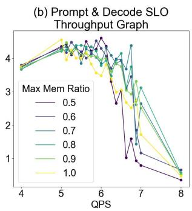
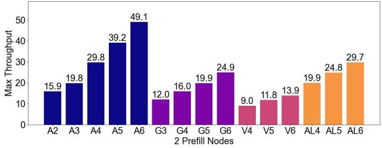

# TokenSim: Enabling Hardware and Software Exploration for Large Language Model Inference Systems 原文翻译

# TokenSim：面向大语言模型推理系统的软硬件探索支持

1<sup>st</sup> Feiyang Wu   
Beihang University   
Beijing, China   
21373411@buaa.edu.cn

2<sup>nd</sup> Zhuohang Bian Beihang University Beijing, China 22373017@buaa.edu.cn

6<sup>th</sup> Teng Ma Renmin University of China & Alibaba Group Beijing, China sima.mt@alibaba-inc.com

3<sup>rd</sup> Guoyang Duan   
Peking University   
Beijing, China   
2200011004@stu.pku.edu.cn   
7<sup>th</sup> Yongqiang Yao   
Sensetime   
Shanghai, China   
soundbupt@gmail.com   
4<sup>rd</sup> Tianle Xu   
Peking University   
Beijing, China   
2200011072@stu.pku.edu.cn   
8<sup>th</sup> Ruihao Gong   
Sensetime   
Beijing, China   
gongruihao@sensetime.com   
5<sup>th</sup> Junchi Wu   
Peking University   
Beijing, China   
1281236805@qq.com

9<sup>th</sup> Youwei Zhuo Peking University Beijing, China youwei@pku.edu.cn

摘要——大语言模型（LLM）服务需求的日益增长，推动了对 LLM 推理系统优化与性能剖析的显著进展。随着这些模型被广泛应用于各类场景，对高效且可扩展的服务方案的需求呈指数级增长。本工作提出了 TokenSim，一个专门为 LLM 推理设计的综合性软硬件探索系统。TokenSim 的特点在于其对可扩展系统优化的支持，包括调度和内存管理。我们使用运行于真实数据集的系统对结果进行了验证，误差率低于 1%。此外，TokenSim 还支持对 LLM 服务系统的性能与优化进行多种富有洞见的探索。代码可在 https://github.com/pku-lemonade/TokenSim 获取。

## I. 引言

大语言模型（LLM）[1]，例如 ChatGPT [2] 和 Gemini [3]，在理解和生成类人内容方面展现了令人瞩目的能力，从而革新了聊天机器人 [2]、[4] 和编程助手 [5]、[6] 等应用。随着 LLM 的普及，LLM 服务不断增长的计算与内存需求正变得日益具有挑战性。

为应对这些需求，研究者们提出了多种硬件与软件优化方法。在硬件方面，各类新型加速器不断涌现，具有各不相同的峰值浮点性能和内存带宽。例如，近数据处理（near-data-processing）加速器 [7]、[8] 利用新型内存技术实现了比传统内存系统更高的带宽，这使它们更适合访存密集型算子。在推理系统方面，优化主要聚焦于两个关键领域：请求调度和内存管理。请求调度优化旨在通过将不同长度的请求组成批次来提升加速器的利用率，而内存管理优化则致力于解决内存占用和内存访问效率问题。例如，vLLM [9] 采用了这两个类别的优化，带来了数量级的延迟降低。因此，这些系统优化已成为真实世界 LLM 服务系统的常态。软硬件的创新也为跨栈优化开辟了新的机遇。例如，在管理由新型硬件加速器组成的集群时，在推理系统中实现感知异构性的调度策略是一种自然的做法。

由于现有优化方法的多样性与复杂性，LLM 从业者理解并预测 LLM 推理系统的性能与资源需求变得十分重要。目前，若干模拟器 [10]、[11] 支持对不同硬件进行性能建模。遗憾的是，它们将输入限制为单条请求或单个批次，仅为一个测试用例报告两个数值：延迟和内存使用量。这些指标对于 LLM 推理的开发者和用户而言都不足够。在真实世界的 LLM 推理中，系统通常需要处理来自不同用户的数百至数千条并发请求。用户满意度与尾延迟（tail latency）密切相关，因此获取延迟的分布至关重要。随着新请求进入和离开系统，内存使用量也会不断变化。

在本工作中，我们通过提供一个高度模块化且可扩展的模拟器 TokenSim 来解决上述动态性支持的缺失。如表 I 所示，TokenSim 具有两个关键特性： 支持从真实数据集中采样的动态 LLM 请求输入； 支持算子级粒度的用户自定义调度与内存管理。凭借这些新特性，TokenSim 可以模拟 QoS 指标，并生成详细的性能结果，包括延迟分布和随时间变化的内存使用量。

我们提出了若干案例研究以支持软硬件探索。首先，我们展示了现有模拟器由于缺乏对批处理（batching）的支持，在动态 LLM 工作负载下会产生高度不准确的性能指标，详见第 IV-A 节。随后，我们进行了涉及多种软件优化的实验。这些实验包括限制 GPU 内存利用率（第 IV-B 节）、考察 worker 比例（第 IV-C1 节），以及在解耦（disaggregated）场景下为 decode worker 识别最优的硬件类型（第 IV-C2 节）。借助 TokenSim 的内存管理设计，我们还评估了在长对话场景下使用内存池的性能影响（第 IV-E 节）。这些实验凸显了系统级模拟的重要意义。最后，我们研究了 FLOPS、内存带宽和内存容量对真实 LLM 服务系统的影响（第 V 节），揭示了 prefill worker 与 decode worker 对硬件资源需求的差异。

## II. 背景

## A. LLM 推理

通常，大语言模型（LLM）[1] 由若干 Transformer [12] 解码器块组成，每个块包含一个自注意力（self-attention）模块和一个多层感知机（MLP）。在生成过程中，LLM 逐个采样并生成新 Token，每个 Token 依赖于其所有前序 Token。由于这种顺序依赖关系，自注意力中由前序 Token 生成的 key 和 value 向量通常会被缓存，用于后续 Token 的生成，这被称为 KV 缓存（key-value cache）[13]。

表 I：LLM 模拟方法对比。
<table><tr><td>方法</td><td></td><td></td><td>模块化 调度器 内存管理器 可移植</td><td></td><td>数据集</td></tr><tr><td>Roofline</td><td>X</td><td>X</td><td>X</td><td>√</td><td>X</td></tr><tr><td>GenZ</td><td>X</td><td>X</td><td>X</td><td>X</td><td>X</td></tr><tr><td>LLMCompass</td><td>X</td><td>X</td><td>X</td><td>X</td><td>X</td></tr><tr><td>TokenSim</td><td>√</td><td>√</td><td>√</td><td>√</td><td>√</td></tr></table>

根据计算方式的不同，推理过程通常被划分为两个阶段：在 prefill 阶段，每条请求仅运行一次迭代，为 prompt 部分生成 KV 缓存。该阶段通过矩阵乘法对 prompt 中的每个 Token 进行并行计算，因此具有高度的计算受限（compute-bound）特性。在 decode 阶段，LLM 利用先前生成的 KV 缓存，通过多次迭代自回归地生成后续 Token。该阶段涉及矩阵-向量乘法，每次仅计算一个新 Token，因此具有高度的访存受限（memory-bound）特性。

## B. LLM 推理系统优化

Continuous batching [14] 是一种在 LLM 推理中采用的技术，用于提升吞吐量和效率。在传统的静态批处理（static batching）中，请求会被累积起来，直到批次填满后才进行处理，这往往会导致延迟。而 Continuous batching 则允许通过在迭代之间动态调整批次大小，对传入请求进行即时处理。这种方式通过细粒度的批次调整实现了高 GPU 利用率，使请求在到达后即可被立即处理，从而显著改善了请求延迟。

PagedAttention [9] 是一种用于管理推理期间 KV cache 的先进技术。它通过将 GPU 内存划分为多个块（block），并将逻辑块映射到物理块（类似于操作系统内存管理的方式），来缓解因请求和输出长度不同而导致的内存碎片问题。这种方法提升了内存效率，并显著改善了整体吞吐量。

Disaggregated serving [15], [16] 是近期提出的一种优化方法，其关注 prefill 阶段与 decode 阶段的不同特性。通过将这两个阶段拆分到不同设备上，该方法可以实现优化的资源分配，从而提升 LLM 推理的整体效率。基于 disaggregated 架构，为了在多轮对话之间复用 KV cache，CachedAttention [17] 提出了一种基于 disaggregated 架构、集成了上下文缓存的新颖系统。CachedAttention 维护一个缓存系统，利用高效的内存与存储介质来保存所有请求的 KV cache。MemServe [18] 实现了一个类似的系统，通过 API 管理分布式 KV cache 的内存池，并借助基于全局前缀树（global prompt tree）的局部性感知策略来增强缓存复用。这两种方法都通过优化缓存管理和复用策略，提升了多轮对话服务的效率。

## C. 模拟框架

为了高效、快速地开展针对性测试，一些研究 [10] [11] 提出了专门面向 LLM 推理任务的模拟方法。GenZ [10] 可以针对不同的并行方法和硬件参数，对单次 LLM 推理迭代进行模拟。LLMCompass [11] 则更进一步，基于不同的脉动阵列（systolic array）和缓冲区设计，对 LLM 推理的单层计算进行模拟。

该领域的最新进展引入了对复杂调度技术（如 Continuous batching）以及先进内存管理策略（如 PagedAttention）的支持。Vidur [19] 是一个大规模模拟框架，遵循 vLLM [9] 的方法，支持先进的调度方法和内存管理。然而，它依赖随机森林回归模型来估计计算运行时间，这可能会引入额外的误差。与此同时，LLMServingSim [20] 提供了一个软硬件协同模拟的基础设施，但存在明显的性能限制，并且在自定义新模型和硬件架构方面缺乏灵活性。

我们的 TokenSim 采用了一种细致的面向 Transformer 的模拟模型来解决上述局限，在保持更快模拟速度的同时实现了更高的精度。此外，TokenSim 还支持一些新技术，例如对 disaggregated prefill 与 decoding 阶段的模拟。[16] 这种方法能够在不牺牲效率的情况下实现全面的精度提升。

## III. TOKENSIM 设计

  
Fig. 1: TokenSim 系统总览。

在本节中，我们将描述 TokenSim 的内部实现，并展示用户如何以模块化、可扩展的方式定义自己的调度和内存管理策略。

TokenSim 利用 SimPy [21] 库来开展模拟，借助其事件驱动架构来高效地对复杂系统进行建模。SimPy 是一个轻量级的离散事件模拟框架，允许对 Worker 和设备等主动组件进行建模，这些组件在模拟环境中并行工作，时间在模拟环境中被跟踪。SimPy 赋予了 TokenSim 高效模拟进程的能力，甚至支持在没有 GPU 的个人电脑上运行。

图 1 展示了 TokenSim 的架构。该系统在一个推理循环（inference loop）中运行，跟踪所有 Worker 的模拟时间。TokenSim 根据数据集和参数生成工作负载，请求由分发器（dispatcher）分派至全局调度器（global scheduler），后者根据用户定义的设置将请求分配给各个 Worker。

  
(a) 硬件配置  
(b) 调度器配置  
(c) 模型配置  
Fig. 2: TokenSim 配置示例。

<sup>每个</sup> <sup>Worker</sup> <sup>并发运行</sup><sup>，</sup><sup>由本地调度器进行管理</sup><sup>，</sup><sup>这些调度器采用各种算法</sup><sup>，并与监控设备内存利用率的</sup><sub>内存管理器</sub><sup>协同工作。一旦调度器为一次迭代形成批次，相关信息会被发送到计算模拟器（如 GenZ），以确定迭代</sup> <sup>时间。该架构支持多种计算模拟器，从而支持各种硬件配置和模拟方法。当发生跨</sup><sup>设备数据传输时，通信模型会基于网络参数，通过连接各个内存管理器来计算传输延迟。该架构支持多种计算模拟器，从而支持</sup><sup>各种硬件配置和模拟方法。当发生跨设备数据传输时，通信模型会基于网络参数</sup><sup>，通过连接内存管理器来计算</sup> <sub>A. TokenSim 调度器</sub><sup>现有</sup><sup>的传输延迟。</sup>

## A. TokenSim 调度器

现有的 LLM 推理系统采用了先进的 worker 内调度与 worker 间调度技术。为了支持当前与未来的创新，TokenSim 采用了一种两阶段调度器，包含一个全局调度器和每个 worker 对应的局部调度器。全局调度器管理传入的请求并将其分配给各 worker，而局部调度器则在迭代之间决定请求是保留在本地还是返回给全局调度器。

两类调度器的用户自定义函数均可通过修改配置文件进行设置，如图 ?? 所示。调度器函数 API 提供了所有系统信息。例如，全局调度器可以获取当前 worker 的数量、它们的硬件类型以及并发请求。它还可以是有状态的，用户可以主动记录在给定时间窗口内已分发给某个 worker 的请求数量，并利用该记录进行后续的负载感知调度。对于局部调度器而言，调度算法所需的最重要信息是当前的任务队列与内存利用率状态。幸运的是，TokenSim 能够实时模拟内存变化，这将在下一节中介绍。

为了完全掌控调度粒度，TokenSim 引入了断点特性，支持在模型配置中进行算子级别的挂钩（图 2c）。默认断点会在每生成一个 token 后调用一次调度器。这种设置简化了各类优化的实现，例如 disaggregation（分离式架构），它利用断点进行 KV cache 迁移，仅需两行代码，如 2a 所示。

在 TokenSim 中，断点可以被显式地添加到模型配置文件的末尾，并与以下两者关联：1）一个局部调度器，负责将带有新生成 token 的请求返回给全局调度器；2）一个全局调度器，负责将这些请求分发给 decode 设备，如图 3 所示。

## B. TokenSim 内存管理器

当前诸如 PagedAttention 之类的技术为内存管理带来了显著的复杂性。为了支持这些创新，TokenSim 实现

```
def schedule_local(worker: Worker, running_reqs, dispatch_reqs):   
submit_global([r.id for running_reqs if len(r.tokens) == len(r.prompt) + 1])   
return dispatch_reqs   
def schedule_global(workers: list[Worker], new_reqs):   
dispatch_results = {w.id: [] for w in workers}   
for req in sum(w.get_submit() for w in workers, []):   
target_id = random.choice(w.id for w in workers if w.run_decode)   
dispatch_results[target_id].append(req)   
 for new_reqs:   
target_id = random_choice(w.id for w in workers if w.run_prefill)   
dispatch_results[target_id].append(req)   
return dispatch_results
```

图 3：全局调度器与局部调度器的用户自定义调度器示例，定义了一种分离式架构。

## B. TokenSim 内存管理器

诸如 PagedAttention 之类的最新技术为内存管理增加了显著的调度复杂度。为了支持这些创新，TokenSim 为不同类型的工作节点（如 CPU、GPU 和 FPGA）实现了内存管理器，以在任意粒度上（按 block、token 或 byte）监控内存利用率，从而支持用户自定义的调度行为。

此外，在分布式环境中，不同工作节点的内存通过网络连接，推理系统往往将其共享以构建大型内存池，并从一个节点的内存向另一个节点传输数据。例如，分离式架构会在 prefill 与 decode 设备之间传输 KV cache。TokenSim 使用一个通信组件来建模数据传输开销。该模型以缓存位置（主机或设备）、数据大小和内存带宽为参数，返回将数据传输到另一设备所需的时间。

该模型旨在支持多种类型的内存传输重叠，利用 SimPy 的事件驱动能力来促进顺序与并发的数据加载和存储。通过选择合适的数据传输大小和重叠方法，仿真可以轻松实现。

例如，在数据块从低带宽存储传输到高带宽存储的场景中，默认方法会在接收方完成前一个任务后才启动加载，依次执行每个加载和存储操作。此外，通过采用更复杂的重叠技术（例如使用预加载缓冲区），通信模型可以通过保持最佳的缓冲区利用率来实现高效的数据传输。对于一个支持多次数据预加载的理想传输过程，将模型的缓冲区大小调整为更大的值即可体现该模型的兼容性与简洁性。

## C. 验证研究

在本节中，我们使用真实硬件上 vLLM v0.6.2 生成的性能结果对 TokenSim 的输出进行验证。


  
the LLaMA2-7B model [22], [23] on an NVIDI       Fig. 4: vLLM throughput and latency validation. $" \mathrm { V } _ { - } "$ 100 and $" \mathrm { T } \cdot " $ , using stands 2,000 requests from the ShareGPT da<sup>2,000</sup> <sup>requests</sup> <sup>from</sup> <sup>the</sup> <sup>ShareGPT</sup> <sup>da</sup>for vLLM and TokenSim respectively. $" \mathrm { T h r } "$ 4]. By varying req   denotes throu hput.

  
Fig. 5: vLLM latency CDF aligns with TokenSim at different QPS, dashed lines are vLLM and solid lines are TokenSim.

为了评估 TokenSim 的准确性，我们在 NVIDIA A100 GPU 上使用 LLaMA2-7B 模型 [22], [23]，并采用来自 ShareGPT 数据集 [24] 的 2,000 条请求进行了实验。通过改变请求速率（每秒查询数，QPS），我们将 TokenSim 仿真得到的吞吐量与延迟分位数与 vLLM 的真实结果进行了对比，如图 4 所示。吞吐量的几何平均误差为 0.109%，P50、P99 和最大请求延迟的几何平均误差分别为 0.6%、0.254% 和 0.337%。

为了进一步验证仿真精度，我们记录了请求延迟并绘制了延迟分布的累积分布函数（CDF），如图 5 所示。TokenSim 仿真结果与真实硬件观测结果之间的紧密对齐证实了其高度的准确性。

## D. 与最先进模拟器的对比

我们对 TokenSim 与两种最先进的 LLM 推理模拟器进行了全面对比：Vidur [19] 和 LLM-ServingSim [20]。我们的评估聚焦于两个关键指标：模拟准确性和运行时效率。此外，我们还测试了 TokenSim 模拟 Prefill 与解码阶段分离（disaggregation）的能力。

1) 模拟准确性：为评估 TokenSim 的模拟准确性，我们将其与 Vidur 和 LLMServingSim 进行了对比。实验设置如下：我们在一块 80 GB 内存的 A100 GPU 上进行实验。我们首先通过找到 LLM 吞吐量达到 40 QPS 的工作点来确定最优的每秒查询数（QPS）值，该点表示 LLM 的最佳性能状态。在获得该 QPS 值后，我们测量了从提交第一个请求到完成的总耗时，请求数量从 100 到 500 不等。

由于 LLMServingSim 的开源版本只能处理非常短的请求，我们将所有三个模拟器的结果与真实场景进行了对比。随后，我们使用从 128 到 2048 的固定 token 长度，将 TokenSim 和 Vidur 与真实场景进行了对比。

如表 II 所示，与真实结果相比，TokenSim 表现出比 Vidur 和 LLMServingSim 更高的准确性，相比最先进水平取得了显著提升。

我们将高模拟准确性归因于细粒度的内存模拟。通过严谨的实现与验证，我们支持块粒度（block-granularity）模拟，从而对 Transformer 内部的运行时状态提供了更细致的洞察。通过采用这种方式，我们避免了 MLP 模拟中的粗粒度近似，从而更准确地反映真实世界的运行时场景。

TABLE II: 真实硬件结果与不同模拟器模拟结果之间的延迟差异百分比。柱状图表示 10 个输出 token 在不同请求数量（从 100 到 500）下的延迟百分比误差。
<table><tr><td>请求数量</td><td>100</td><td>200</td><td>300</td><td>400</td><td>500</td></tr><tr><td>本地实测</td><td>2.756</td><td>5.246</td><td>7.819</td><td>10.371</td><td>12.981</td></tr><tr><td>Vidur</td><td>2.371</td><td>4.698</td><td>7.246</td><td>9.935</td><td>12.122</td></tr><tr><td>TokenSim</td><td>2.592</td><td>5.089</td><td>7.587</td><td>10.095</td><td>12.593</td></tr><tr><td>LLMServingSim</td><td>2.556</td><td>5.056</td><td>7.557</td><td>10.056</td><td>12.556</td></tr></table>

2) 运行时效率：在执行时间方面，我们将 TokenSim 与 Vidur 进行了对比。LLMServingSim 的速度异常缓慢，甚至比真实运行行为还要慢。如图 6 所示，尽管我们的 TokenSim 似乎具有更长的运行时间，但 Vidur 每次运行前都需要大量的时间——约 400 秒的预训练。此外，TokenSim 支持细粒度的内存操作模拟，能够提供更细致的洞察。LLMServingSim 由于在模拟长 prompt 方面的限制，被设置为仅处理 10 个 token，且其性能明显缓慢。

虽然 TokenSim 可能比 Vidur 耗时略多，但它避免了预训练过程且更加轻量。在验证模型运行时配置的阶段，参数可能会经历大幅调整。大量不同的配置可能使随机化失效。就总体预期时间而言，TokenSim 仍具优势，其轻量化的操作方式支持更灵活的适配。

  
Fig. 6: TokenSim 与 Vidur 的执行时间对比。注意，Vidur 在每次运行前需要大量预训练时间（约 400 秒），如图中阴影区域所示。此外，由于 LLMServingSim 无法模拟长 prompt，其被配置为仅处理 10 个 token，且性能明显缓慢。

3) Prefill 与解码阶段分离：我们选择 Dist-Serve [16] 作为真实世界基线。据我们所知，TokenSim 是首个支持 Prefill 与解码阶段分离的大语言模型模拟器。

为验证这一能力，我们在两块 A100 GPU 上部署了 DistServe。我们测量了 GPU 之间的实际通信带宽，并使用该数据配置 TokenSim 以实现精确模拟。随后，我们使用 1000 到 10000 的一组请求对 TokenSim 与 DistServe 进行了对比，每个请求的输入 token 长度固定为 64 个 token。我们选择了 QPS 值为 8，以尽量减少不同内存调度策略引起的运行时波动，从而更有效地聚焦于 Prefill 与解码分离本身的模拟性能。

如图 7 所示，TokenSim 在模拟分离式 Prefill 与解码阶段方面表现出很高的准确性。我们将观察到的偏差归因于两个主要来源：首先，KV-Cache 通过总线传输时不可避免地存在波动，尤其是在大量请求的情况下，这些波动会累积并引入一定误差。其次，DistServe 采用 SwiftTransformer 作为其底层运行时框架，而我们在模拟中并未纳入该框架。这一差异是不可避免的误差来源。此外，我们的实验表明，当请求数量相对较少时，SwiftTransformer 引入的误差更为明显。

Prefill 与解码分离技术被广泛应用于当前的推理部署中，带来了显著的性能提升。TokenSim 对 PD 分离的模拟凸显了其强大的性能。

  
Fig. 7: DistServe 与 TokenSim 的运行时对比。实验在 2 块 A100 GPU 上进行，每个请求包含 64 个输入 token 和 64 个输出 token，代表常见的真实场景。我们测试了实际通信带宽并将其用于精确模拟。

## IV. 基于 TOKENSIM 的框架优化分析

在 LLM 推理中，需要认识到的是，虽然 vLLM [9] 等框架提供了推荐配置，但性能会随着不同的工作负载和硬件环境而产生显著变化。因此，诸如调度方法、批大小调整以及 Prefill 与解码过程分离等优化策略，并不总能提升性能，在某些条件下甚至可能导致性能下降。

本节研究了各种优化策略对 LLM 推理的影响，对其与不同硬件配置和工作负载特征之间的交互进行了深入分析。通过系统性评估，我们旨在为在多样化计算环境中实现最优性能提供洞察。我们的全面实验得出了六项关键发现，总结如下。

## A. 连续批处理（Continuous Batching）

图 8 展示了推理服务器接收四个请求作为输入时的执行示例。在静态批处理（static batching）中，较短的请求必须等待较长的请求完成，从而在系统中产生气泡（bubbles）。相比之下，连续批处理（continuous batching）允许在批处理过程中加入新请求，因此 GPU 资源不会浪费在气泡上。这些差异导致两种方法表现出截然不同的性能特征，也凸显了对连续批处理进行仿真以准确预测 LLM 推理系统行为的必要性。

<table><tr><td>R1</td><td>R1</td><td>R1</td><td>R1</td><td>R1</td><td>R1</td><td>END</td><td></td><td></td><td>R5</td></tr><tr><td>R2</td><td>R2</td><td>R2</td><td>R2</td><td>END</td><td></td><td></td><td></td><td></td><td>R6</td></tr><tr><td>R3</td><td>R3</td><td>R3</td><td>R3</td><td>R3</td><td>END</td><td></td><td></td><td></td><td>R7</td></tr><tr><td>R4</td><td>R4</td><td>R4</td><td>R4</td><td>R4</td><td>R4</td><td>R4</td><td>R4</td><td>END</td><td>R8</td></tr><tr><td colspan="10">iter1 iter2 iter3 iter4 iter5 iter6 iter7 iter8</td></tr><tr><td>R1</td><td>R1</td><td>R1</td><td>R1</td><td>R1</td><td>R1</td><td>END</td><td>R8</td><td>iter9 R8</td><td>iter10 R8</td></tr><tr><td>R2</td><td>R2</td><td>R2</td><td>R2</td><td>END</td><td>R6</td><td>R6</td><td>R6</td><td>R6</td><td>R6</td></tr><tr><td>R3</td><td>R3</td><td>R3</td><td>R3</td><td>R3</td><td>END</td><td>R7</td><td>R7</td><td>R7</td><td>R7</td></tr><tr><td>R4</td><td>R4</td><td>R4</td><td>R4</td><td>R4</td><td>R4</td><td>R4</td><td>R4</td><td>END</td><td>R10</td></tr><tr><td></td><td></td><td>R5</td><td>R5</td><td>R5</td><td>R5</td><td>R5</td><td>END</td><td>R9</td><td>R9</td></tr></table>

图 8：静态批处理（上）与连续批处理（下）的迭代对比。黄色块表示 prefill 阶段，蓝色块表示 decode 阶段。白色块为气泡。

图 9 比较了静态批处理与连续批处理下的系统延迟分位数。该实验在 A100 GPU 上运行 LLaMA2-7B 模型，处理了来自 ShareGPT 数据集的 50,000 个随机请求。为了展示连续批处理的独特属性，批处理请求的最大数量被限制为与静态批处理相同。批大小（batch size）为 "inf" 表示无限制，允许调度器最大化资源利用率。性能采用由 vLLM 框架 [9] 所评估的归一化延迟（normalized latency）指标进行衡量。

  
图 9：静态批处理与限制批大小的连续批处理的归一化延迟图。虚线表示静态批处理，实线表示连续批处理。"Inf" 表示无批大小限制。

如图 9 所示，静态批处理与连续批处理呈现出截然不同的延迟趋势。随着请求速率的提高，与静态批处理相比，连续批处理的延迟上升更为缓慢且平稳。这一发现直接支持了发现 1（Finding 1），凸显了连续批处理能够显著降低延迟并提升可扩展性，尤其是在负载不断增大的情况下。

发现 1：与静态批处理相比，连续批处理能够显著降低延迟并提升可扩展性，尤其是在负载不断增大的情况下。

## B. 输入批处理

先前的研究 [10] 表明，增大批大小可以在对延迟影响极小的情况下提升吞吐量。这意味着将 GPU 内存尽可能多地用于 KV cache 更有利于端到端性能。然而，由于静态批处理与连续批处理之间的差异，我们的研究表明，最大化 GPU 利用率并非在所有情况下都是最优的。

当较长的请求需要更多内存且没有空闲块可用时，LLM 框架通常会抢占（preempt）新请求。这涉及将正在运行的请求从设备内存迁移至主机内存或远端内存。更重要的是，它直接影响尾延迟（tail latency），因为被抢占的请求通常需要比平均时间更长的时间才能完成。在对话场景中，Token 的生成速度被期望是快速且均匀分布的。如果某些 Token 的生成耗时过长，即使平均 decode 延迟满足服务级别目标（Service Level Objective，SLO），用户体验也可能受损。当发生抢占时，请求可能会暂停，但平均延迟仍可能符合 SLO。因此，我们使用最大 Token 处理耗时（maximum Token Processing Over Time，mTPOT）SLO 来强调 Token 生成均匀分布的重要性：任意两个 Token 之间的间隔都不应超过 mTPOT SLO，否则该请求不计入吞吐量。

为了解决这一问题，推理框架倾向于通过为传入请求设置最大 GPU 内存利用率上限来限制批大小，从而为较早的请求预留内存并减少抢占。例如，vLLM 提供了 gpu_memory_utilization 选项用于性能调优。

图 10 展示了处理来自 ShareGPT 数据集请求的吞吐量，仅统计满足服务级别目标的请求。我们将首 Token 时间（Time to First Token，TTFT）SLO 设为 15 秒，mTPOT SLO 设为 0.3 秒。图 10(a) 展示了仅考虑 mTPOT SLO 时的吞吐量，突出了 decode 阶段的延迟改进；图 10(b) 展示了同时考虑两种 SLO 时的吞吐量，证明了该限制在提升 SLO 范围内吞吐量方面的有效性。结果表明，在特定条件下，策略性地限制新请求的流入并为先前已处理的请求预留内存——而非最大化批大小——可以通过优化未来 KV cache 的管理显著提升用户体验。这支持了发现 2（Finding 2），即限制新请求并为较早的请求预留内存可以改善尾延迟和用户体验。

发现 2：限制新请求的流入并为较早的请求预留内存，可以通过减少抢占和改善尾延迟来提升用户体验，即使这意味着不最大化批大小。


  
图 10：限制新请求可被调度的 GPU 内存利用率的吞吐量图。"Max Mem Ratio" 表示 GPU 内存利用率，"Decode SLO Throughput" 表示仅考虑 mTPOT SLO 的吞吐量，"Prompt & Decode SLO Throughput" 表示同时考虑 TTFT 和 mTPOT SLO 的吞吐量。

## C. 解耦策略

1) 设备类型比例：近期的研究 [15]、[16] 提出了解耦架构，将 prefill 与 decode 阶段分离到不同的 GPU 上。然而，改变 prefill 与 decode 设备比例所带来的影响尚未得到充分探索。这些比例会显著影响具有特定特征的工作负载的性能表现。虽然一些框架 [16] 提供了动态调整这些比例的方法，但它们可能会引入性能上的权衡。

<table><tr><td colspan="8">(a) LLaMA 最佳比例</td></tr><tr><td>128</td><td>999</td><td>869</td><td>700</td><td>569</td><td>446</td><td>349</td><td>288</td></tr><tr><td>256</td><td>500</td><td>429</td><td>359</td><td>320</td><td>288</td><td>209</td><td>179</td></tr><tr><td>Inpp gth</td><td>512</td><td>249 209</td><td>209</td><td>174</td><td>149</td><td>129</td><td>99</td></tr><tr><td>768</td><td>159</td><td>150</td><td>140</td><td>109</td><td>109</td><td>93</td><td>70</td></tr><tr><td>1024</td><td>120</td><td>109</td><td>100</td><td>84</td><td>84</td><td>65</td><td>54</td></tr><tr><td>1536</td><td>79</td><td>75</td><td>65</td><td>54</td><td>54</td><td>44</td><td>34</td></tr><tr><td>2048</td><td>57</td><td>57</td><td>49</td><td>39</td><td>39</td><td>29</td><td>24</td></tr><tr><td></td><td>128</td><td>256</td><td></td><td>512 768 1024 1536 2048 Output Length</td><td></td><td></td><td></td></tr></table>

  
图 11：在 8×A100 节点上运行于不同平均输入与输出长度的 LLaMA2-7B 和 OPT-13B 模型时的最佳解耦类型比例。P/D 表示 prefill 与 decode 设备的数量。方块上的数字表示在不违反 SLO 的前提下的最大吞吐量。

图 11 展示了在配备 8× A100 GPU 的节点上，针对具有不同输入与输出序列长度的工作负载，以不同颜色表示的最佳 prefill 与 decode 设备比例。为了在不违反服务 SLO 的前提下最大化吞吐量，无论输入长度如何，增加 prefill 节点对于较长的输出长度至关重要。然而，随着输出长度的增加，较短的输入长度允许更多的 prefill 节点用于 decode。这一分析支持了发现 3，该发现指出 prefill 与 decode 设备的最佳比例主要取决于输出长度，更长的输出长度能从额外的 prefill 设备中获益更多。

发现 3：解耦架构中 prefill 与 decode 设备的最佳比例主要取决于输出长度，更长的输出长度能从额外的 prefill 设备中获益更多。

2) 高效替代方案：此前的研究 [10]、[11] 已经表明，LLM 推理的 decode 阶段是内存受限的，严重依赖 GPU 的内存容量和带宽。在解耦架构中，prefill 与 decode 阶段可以分配到不同的硬件组件上，从而基于各阶段的特性进行优化。由于计算性能对 decode 阶段并非关键，我们测试了多种硬件配置，包括原始 GPU 的低计算性能版本、上一代更便宜的 GPU，以及以高内存容量和带宽著称的存内计算芯片。

图 12 展示了在 decode 阶段使用不同硬件设备替代 A100 GPU 时解耦架构的吞吐量。由于服务器主板上可用的 PCIe 插槽数量有限，我们仅测试了包含 8 个设备的配置。我们测试了三种类型的硬件：作为上一代更便宜 GPU（价格约为 A100 的 1/4）的 NVIDIA V100，作为高性能 PIM 芯片（价格约为 A100 的 1/2）的 SK HYNIX GDDR6-Aim (G6-Aim) [7]，以及计算性能为 1/4 的 A100。




  
图 12：使用不同硬件的解耦方案：`"V"` 表示 NVIDIA V100，`"A"` 表示 NVIDIA A100，`"G"` 表示“SK HYNIX GDDR6-Aim”，“AL”表示峰值 FLOPS 为 1/4 的 A100。字母后的数字表示 decode 设备的数量。

如图 12 所示，如果预算只允许购买 5 块 A100 GPU，最佳选择是使用 1 块 A100 作为 prefill 设备，并购买 7 个 G6-Aim，在实现相近吞吐量的同时，每块可节省约一半 A100 的成本。如果使用 2 块 A100 作为 prefill 设备，最大吞吐量仅为 24.7，低于前者的 29.1。然而，在预算更充足的情况下，更可取的做法是使用 2 块 A100 作为 prefill 设备，其余 A100 作为 decode 设备。在预算较少的情况下（例如仅购买 4 块 A100），使用 G6-Aim 仍是最佳选择，尽管差异并不显著。V100 的性能相对较差，仅当预算恰好只允许购买 3 块或更少的 A100 时才有价值，但性能差异并不大。降低计算性能版本的 A100 GPU 并非最优选择，这表明原始 A100 的计算性能对于 decode 阶段而言并不算过度冗余。总而言之，PIM 在预算受限的场景下可以是一种高性价比的选择，但由于节点内可用插槽总数的限制，它无法完全替代 A100 用于 decode 阶段。

发现 4：存内计算芯片在解耦架构中可以作为 decode 阶段的高性价比替代方案，尤其是在预算受限的情况下，但由于插槽限制，它们无法完全替代 A100 等高性能 GPU。

## D. 分离式架构下的内存占用

为了进一步研究推理过程中 prefill 与 decode 阶段的内存需求，我们对 LLaMA2-7B 模型的 GPU 内存使用模式进行了分析。在该实验中，我们将输入长度配置为 128 个 token，输出长度配置为 1024 个 token，并采用图 11 中确定的最优设备分配和每秒查询数参数。我们在固定时间窗口 [5, 65] 秒内共发起 10,000 个请求。之所以选择该时间窗口，是因为观测内存占用只需分析一段稳定运行的时间。此外，prefill 阶段的持续时间明显短于 decode 阶段，这使得我们能够在该时间范围内收集到充分的信息。

图 13(a) 所示的内存占用曲线表明，在 PD 分离过程中，prefill 阶段的 GPU 内存占用显著低于 decode 阶段。这一差异可归因于两个阶段截然不同的计算需求。Prefill 需要 KV cache 计算所需的大量初始内存分配，但此后保持较低的内存占用；而 decode 由于依赖 KV cache 进行自回归 token 生成，因此持续维持较高的内存需求。

一旦 prefill 阶段完成，decode 设备继续在高内存负载下运行，而 prefill 设备的 GPU 内存占用则显著降低。

正如发现 5 所强调的，prefill 阶段可以用更少的资源进行有效管理，从而实现更高效的 GPU 内存分配，并有可能提升系统吞吐量。我们提出，减少 prefill GPU 的内存分配可能是一种可行的优化策略。

基于这一提议，我们将 prefill GPU 内存减少至原始容量的一半。图 13(b) 表明，减少 prefill GPU 内存可以在资源利用率之间实现更好的平衡，同时吞吐量几乎保持不变。这一发现有助于更高效地分配 GPU 内存，并有可能提升整体系统吞吐量。


  
Fig. 13: 分离式架构下 Prefill 与 Decode Worker 的 GPU 内存占用随时间变化的热力图。左侧热力图展示原始内存分配，右侧热力图展示将 prefill GPU 内存减少至一半后的效果。

发现 5：prefill 阶段的内存占用低于 decode 阶段。减少 prefill GPU 的内存分配可能是一种可行的优化策略。

## E. 内存缓存

近期的研究 [17]、[18] 提出了一种创新方法，通过将多轮对话的 KV cache 存储在专用存储中以供未来使用，从而服务多轮对话。然而，用户的具体工作负载和硬件配置可能差异巨大，在所有条件下进行全面测试既耗时又昂贵。通过在 TokenSim 中添加少量配置和代码，我们可以有效模拟这种使用共享内存缓存来管理对话上下文 KV cache 的机制。

  
Fig. 14: 在不同输入和输出长度下启用与禁用内存缓存的请求延迟 P99。图例中的 "X-y" 表示输入长度为 x、输出长度为 y。虚线表示启用内存缓存，实线表示禁用。

图 14 展示了在不同输入和输出序列长度下，启用与不启用多轮对话内存缓存时的 P99 请求延迟。对话长度按泊松分布生成，平均长度作为其均值。为了模拟真实的聊天机器人场景，一半请求为单轮对话，另一半则涉及两到七轮对话。从内存缓存中检索 KV cache 的延迟设置为每个 block 800 纳秒，参考自 [18]。

结果揭示了与原始研究类似的趋势，同时提供了额外的洞察。随着请求率的增加，使用内存缓存可以显著降低延迟，尤其是在平均输出长度为 64 时，在相同 P99 延迟下请求率几乎翻倍。这支持了发现 6，即内存缓存优化对于多轮对话中的短输出长度最为有效，可显著降低约 64 token 输出的延迟，但对于极短输出（例如长度小于等于 32 的输出）则收益递减。总体而言，我们的观察是，内存缓存优化对短输出场景最为有效，但始终优于原始版本。

发现 6：内存缓存优化对于多轮对话中的短输出长度最为有效，可显著降低约 64 token 输出的延迟，但对于极短输出（例如 ≤32 token）则收益递减。

## V. 基于 TOKENSIM 的平台特性分析

在本节中，我们使用 TokenSim 框架分析多种硬件属性。我们关注以下关键属性：

• 计算性能：该属性反映执行浮点计算的能力。

• 内存带宽：该属性表示 GPU 内存的数据传输速度，影响数据在 GPU 与其内存之间的传输速度。

• 内存容量：该属性决定了可存储在 GPU 内存中的数据量，影响处理大模型的能力以及容纳更多 KV cache 的能力。

在实验中，我们对这些属性进行了独立和组合的调整，以评估其对性能的影响。虽然我们的部分发现与现有模拟器 [10] 报告的结果一致，但当考虑系统优化时，TokenSim 得出了不同的结论。由于篇幅限制，我们在此展示分离式架构下的一个发现，并计划在后续工作中进一步探索。

  
Fig. 15: 1、2、3 个 prefill 设备的吞吐量（"P1-D7" 表示 1 个 prefill 设备与 7 个 decode 设备），使用不同的硬件参数："Ori" 表示原始 A100；"T" 表示计算性能；"C" 和 "B" 分别表示容量和带宽。"C2" 表示容量加倍，而 "-C2" 表示容量减半。

图 15 评估了分离式架构下 prefill GPU 的不同参数，以不同的请求率处理来自 ShareGPT 数据集的 50,000 个请求。该图展示了在不违反 SLO 的前提下可达到的最大吞吐量。结果表明，内存容量在 A100 的 1/4 到 4 倍范围内、带宽在 1/8 到 4 倍范围内，对性能的影响极小，这表明 prefill 阶段对带宽和容量的需求较低。1/8 容量未经过测试，因为它低于 fp16 格式下的模型参数大小。相比之下，计算性能显著影响吞吐量，但当累计计算性能达到 $2 \times 3 1 2 .$ 时，便触及了 decode 能力的上限，超过该值后进一步提升并不能增强吞吐量。这支持了发现 7，该发现强调 prefill 阶段更多受益于计算性能的提升，而非内存容量或带宽，这表明 A100 GPU 的内存容量和带宽对于 prefill 任务而言是过剩的。

发现 7：在分离式架构下，prefill 阶段更多受益于计算性能的提升，而非内存容量或带宽，这表明 A100 GPU 的内存容量和带宽对于 prefill 任务而言是过剩的。

## VI. 结论

本工作介绍了 TokenSim，这是一个高度可扩展的框架，旨在模拟现代 LLM 服务系统。TokenSim 被设计为能够适配多种硬件配置和系统优化方案。其模块化设计，以及对多种调度和内存管理技术的支持，使 TokenSim 成为优化 LLM 推理系统的宝贵工具。它展现出极高的准确性，在模拟真实世界数据集时误差率低于 1%，进一步证实了其有效性。通过使用 TokenSim，我们对当前的系统优化方案进行了分析，包括 continuous batching、分离式架构（disaggregated architecture）以及内存缓存。此外，我们还探索了多种硬件配置，得出了关于分离式架构的、超越现有工作的新见解。

## REFERENCES

[1] T. B. Brown, B. Mann, N. Ryder, M. Subbiah, J. Kaplan, P. Dhariwal, A. Neelakantan, P. Shyam, G. Sastry, A. Askell, S. Agarwal, A. Herbert-Voss, G. Krueger, T. Henighan, R. Child, A. Ramesh, D. M. Ziegler, J. Wu, C. Winter, C. Hesse, M. Chen, E. Sigler, M. Litwin, S. Gray, B. Chess, J. Clark, C. Berner, S. McCandlish, A. Radford, I. Sutskever, and D. Amodei, “Language models are few-shot learners,” 2020. [Online]. Available: https://arxiv.org/abs/2005.14165

[2] OpenAI, “Chatgpt: Language model,” https://www.openai.com/chatgpt, 2023.

[3] Google, “Gemini - chat to supercharge your ideas,” https://gemini. google.com/, 2023.

[4] ——, “Google bard,” https://bard.google.com/, 2023.

[5] GitHub, “Github copilot,” https://github.com/features/copilot, 2022.

[6] M. Chen, J. Tworek, H. Jun, Q. Yuan, H. P. de Oliveira Pinto, J. Kaplan, H. Edwards, Y. Burda, N. Joseph, G. Brockman, A. Ray, R. Puri, G. Krueger, M. Petrov, H. Khlaaf, G. Sastry, P. Mishkin, B. Chan, S. Gray, N. Ryder, M. Pavlov, A. Power, L. Kaiser, M. Bavarian, C. Winter, P. Tillet, F. P. Such, D. Cummings, M. Plappert, F. Chantzis, E. Barnes, A. Herbert-Voss, W. H. Guss, A. Nichol, A. Paino, N. Tezak, J. Tang, I. Babuschkin, S. Balaji, S. Jain, W. Saunders, C. Hesse, A. N. Carr, J. Leike, J. Achiam, V. Misra, E. Morikawa, A. Radford, M. Knight, M. Brundage, M. Murati, K. Mayer, P. Welinder, B. McGrew, D. Amodei, S. McCandlish, I. Sutskever, and W. Zaremba, “Evaluating large language models trained on code,” 2021. [Online]. Available: https://arxiv.org/abs/2107.03374

[7] Y. Kwon, K. Vladimir, N. Kim, W. Shin, J. Won, M. Lee, H. Joo, H. Choi, G. Kim, B. An, J. Kim, J. Lee, I. Kim, J. Park, C. Park, Y. Song, B. Yang, H. Lee, S. Kim, D. Kwon, S. Lee, K. Kim, S. Oh, J. Park, G. Hong, D. Ka, K. Hwang, J. Park, K. Kang, J. Kim, J. Jeon, M. Lee, M. Shin, M. Shin, J. Cha, C. Jung, K. Chang, C. Jeong, E. Lim, I. Park, J. Chun, and S. Hynix, “System architecture and software stack for gddr6-aim,” in 2022 IEEE Hot Chips 34 Symposium (HCS), 2022, pp. 1–25.

[8] UPMEM, “Upmem: Processing-in-memory (pim) solutions,” https:// www.upmem.com/.

[9] W. Kwon, Z. Li, S. Zhuang, Y. Sheng, L. Zheng, C. H. Yu, J. Gonzalez, H. Zhang, and I. Stoica, “Efficient memory management for large language model serving with pagedattention,” in Proceedings of the 29th Symposium on Operating Systems Principles, ser. SOSP ’23. New York, NY, USA: Association for Computing Machinery, 2023, p. 611–626. [Online]. Available: https://doi.org/10.1145/3600006.3613165

[10] A. Bambhaniya, R. Raj, G. Jeong, S. Kundu, S. Srinivasan, M. Elavazhagan, M. Kumar, and T. Krishna, “Demystifying platform requirements for diverse llm inference use cases,” 2024. [Online]. Available: https://arxiv.org/abs/2406.01698

[11] H. Zhang, A. Ning, R. Prabhakar, and D. Wentzlaff, “A hardware evaluation framework for large language model inference,” 2023. [Online]. Available: https://arxiv.org/abs/2312.03134

[12] A. Vaswani, N. Shazeer, N. Parmar, J. Uszkoreit, L. Jones, A. N. Gomez, L. Kaiser, and I. Polosukhin, “Attention is all you need,” in Proceedings of the 31st International Conference on Neural Information Processing Systems, ser. NIPS’17. Red Hook, NY, USA: Curran Associates Inc., 2017, p. 6000–6010.

[13] R. Pope, S. Douglas, A. Chowdhery, J. Devlin, J. Bradbury, A. Levskaya, J. Heek, K. Xiao, S. Agrawal, and J. Dean, “Efficiently scaling transformer inference,” 2022. [Online]. Available: https://arxiv.org/abs/2211.05102

[14] G.-I. Yu, J. S. Jeong, G.-W. Kim, S. Kim, and B.-G. Chun, “Orca: A distributed serving system for Transformer-Based generative models,” in 16th USENIX Symposium on Operating Systems Design and Implementation (OSDI 22). Carlsbad, CA: USENIX Association, Jul. 2022, pp. 521–538. [Online]. Available: https://www.usenix.org/ conference/osdi22/presentation/yu

[15] P. Patel, E. Choukse, C. Zhang, A. Shah, Íñigo Goiri, S. Maleki, and R. Bianchini, “Splitwise: Efficient generative llm inference using phase splitting,” 2024. [Online]. Available: https://arxiv.org/abs/2311.18677

[16] Y. Zhong, S. Liu, J. Chen, J. Hu, Y. Zhu, X. Liu, X. Jin, and H. Zhang, “Distserve: Disaggregating prefill and decoding for goodputoptimized large language model serving,” 2024. [Online]. Available: https://arxiv.org/abs/2401.09670

[17] B. Gao, Z. He, P. Sharma, Q. Kang, D. Jevdjic, J. Deng, X. Yang, Z. Yu, and P. Zuo, “Cost-Efficient large language model serving for multi-turn conversations with CachedAttention,” in 2024 USENIX Annual Technical Conference (USENIX ATC 24). Santa Clara, CA: USENIX Association, Jul. 2024, pp. 111–126. [Online]. Available: https://www.usenix.org/conference/atc24/presentation/gao-bin-cost

[18] C. Hu, H. Huang, J. Hu, J. Xu, X. Chen, T. Xie, C. Wang, S. Wang, Y. Bao, N. Sun, and Y. Shan, “Memserve: Context caching for disaggregated llm serving with elastic memory pool,” 2024. [Online]. Available: https://arxiv.org/abs/2406.17565

[19] A. Agrawal, N. Kedia, J. Mohan, A. Panwar, N. Kwatra, B. Gulavani, R. Ramjee, and A. Tumanov, “Vidur: A large-scale simulation framework for llm inference,” in Proceedings of Machine Learning and Systems, P. Gibbons, G. Pekhimenko, and C. D. Sa, Eds., vol. 6, 2024, pp. 351– 366.

[20] J. Cho, M. Kim, H. Choi, G. Heo, and J. Park, “Llmservingsim: A hw/sw co-simulation infrastructure for llm inference serving at scale,” in 2024 IEEE International Symposium on Workload Characterization (IISWC), 2024, pp. 15–29.

[21] K. G. Müller, T. Vignaux, O. Lünsdorf, and S. Scherfke, “Simpy: Discrete event simulation for python,” https://simpy.readthedocs.io/, 2002, version 4.1.1, released November 12, 2023.

[22] H. Touvron, T. Lavril, G. Izacard, X. Martinet, M.-A. Lachaux, T. Lacroix, B. Rozière, N. Goyal, E. Hambro, F. Azhar, A. Rodriguez, A. Joulin, E. Grave, and G. Lample, “Llama: Open and efficient foundation language models,” 2023. [Online]. Available: https: //arxiv.org/abs/2302.13971

[23] H. Touvron, L. Martin, K. Stone, P. Albert, A. Almahairi, Y. Babaei, N. Bashlykov, S. Batra, P. Bhargava, S. Bhosale, D. Bikel, L. Blecher, C. C. Ferrer, M. Chen, G. Cucurull, D. Esiobu, J. Fernandes, J. Fu, W. Fu, B. Fuller, C. Gao, V. Goswami, N. Goyal, A. Hartshorn, S. Hosseini, R. Hou, H. Inan, M. Kardas, V. Kerkez, M. Khabsa, I. Kloumann, A. Korenev, P. S. Koura, M.-A. Lachaux, T. Lavril, J. Lee, D. Liskovich, Y. Lu, Y. Mao, X. Martinet, T. Mihaylov, P. Mishra, I. Molybog, Y. Nie, A. Poulton, J. Reizenstein, R. Rungta, K. Saladi, A. Schelten, R. Silva, E. M. Smith, R. Subramanian, X. E. Tan, B. Tang, R. Taylor, A. Williams, J. X. Kuan, P. Xu, Z. Yan, I. Zarov, Y. Zhang, A. Fan, M. Kambadur, S. Narang, A. Rodriguez, R. Stojnic, S. Edunov, and T. Scialom, “Llama 2: Open foundation and fine-tuned chat models,” 2023. [Online]. Available: https://arxiv.org/abs/2307.09288

[24] ShareGPT Team, “Sharegpt,” https://www.sharegpt.com/, 2023.